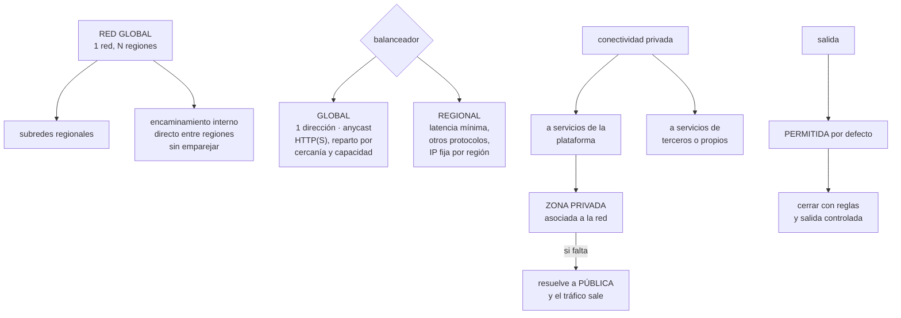

# 231 — Red global, load balancing, PSC y Cloud DNS

> [← 230 · Workload Identity Federation, IAM Conditions y PAM](../../part-19-gcp-production-architecture/230-workload-identity-federation-iam-conditions-y-pam/README.md) · [Índice de la parte](../README.md) · [232 · Terraform, Infrastructure Manager y policy validation →](../../part-19-gcp-production-architecture/232-terraform-infrastructure-manager-y-policy-validation/README.md)

**Parte:** 19 — Google Cloud: arquitectura de datos y operación en producción<br>
**Nivel:** avanzado · **Horas estimadas:** 4<br>
**Laboratorio:** `network` · **Estado:** `EXECUTABLE_CORE`

## 🎯 Propósito

Montar la red de Google Cloud, que es la que más se diferencia de las otras dos: **la red es global y una sola dirección puede servir desde todas las regiones**. La clase explica qué implica eso para el balanceo, cómo funciona la conectividad privada hacia servicios propios y de terceros, y la resolución de nombres con su equivalente del problema de la clase 219: si la zona no está asociada a la red, el nombre resuelve a la dirección pública.

## 📚 Resultados de aprendizaje

Al finalizar podrás:

1. **Aprovechar** la red global sin trasladar suposiciones regionales.
2. **Elegir** el balanceador adecuado entre global y regional.
3. **Conectar** a servicios propios y de terceros de forma privada.
4. **Resolver** nombres privados en todas las redes que los necesitan.
5. **Controlar** la salida a internet, que está abierta por defecto.

## 🧩 Conceptos centrales

| Concepto | Comprensión verificable |
|---|---|
| `red global` | Red virtual que abarca todas las regiones. Las subredes son regionales; el encaminamiento interno es directo. |
| `balanceo global` | Una dirección única que reparte a los grupos de la región más cercana con capacidad. |
| `conexión de servicio privada` | Mecanismo para alcanzar un servicio de la plataforma o de un tercero por una dirección de tu red. |
| `acceso privado a servicios` | Alternativa que permite alcanzar servicios de la plataforma sin dirección externa, por rutas privilegiadas. |
| `zona privada de nombres` | Zona asociada a redes concretas. Sin asociación, el nombre resuelve a la dirección pública. |
| `salida controlada` | Restricción del tráfico saliente, que está permitido por defecto y hay que cerrar. |

## 🧠 Modelo mental

Google Cloud combina una jerarquía estricta de recursos con una red global y servicios data-first; proyecto, cuota e IAM forman una unidad operativa.

Aplicado a esta clase, separa siempre cuatro planos: **intención** (qué necesita el usuario),
**configuración** (qué declaramos), **estado observado** (qué existe de verdad) y
**evidencia** (cómo sabemos que cumple). Confundirlos produce diseños que se ven correctos
en un diagrama pero fallan al operar.

## 🗺️ Flujo de razonamiento



## 📖 Desarrollo

### 1. La red global, y qué cambia

Esta es la diferencia estructural que más suposiciones invalida.

```text
LA RED ES GLOBAL
  una sola red abarca todas las regiones
  las SUBREDES son regionales
  y los recursos de subredes distintas se alcanzan
  directamente, sin emparejar nada

QUÉ DESAPARECE
  emparejamientos entre regiones
  concentradores de tránsito para unir regiones propias
  y buena parte de la complejidad de encaminamiento de las
  clases 194 y 199

QUÉ NO DESAPARECE
  el coste del tráfico entre regiones, que sigue
  el coste del tráfico entre zonas, que también
  y la latencia física
```

Y las suposiciones que hay que desmontar:

```text
✗ «hay que emparejar las redes de cada región»
  no; es una sola red

✗ «una subred agotada solo afecta a su región»
  cierto, pero el rango se decide en el plan global
                                                clase 193
  → y las subredes se pueden AMPLIAR sin recrear, que es
    una ventaja real frente a otras nubes

✗ «las reglas de cortafuegos son por subred»
  son de la RED, con selectores y prioridades  clase 229
  → una regla mal puesta afecta a todas las regiones

✗ «el balanceador es regional»
  hay de los dos, y el global cambia el diseño
```

**Los rangos secundarios**, que hacen falta para contenedores:

```text
una subred puede tener rangos SECUNDARIOS
  → los pods y los servicios del clúster usan esos rangos
  → y se dimensionan aparte del rango principal
                                          clases 193, 234

→ el plan de direcciones tiene que contarlos, y son los que
  más consumen
```

Y una decisión que conviene tomar pronto:

```text
¿SUBREDES AUTOMÁTICAS O PERSONALIZADAS?
  automáticas   la red crea una subred por región, con
                rangos fijos
                → cómodo y garantiza solapamiento con
                  cualquier otra red creada igual
  personalizadas se declaran los rangos del plan
                → la elección correcta para cualquier
                  organización                clase 193

→ y las redes automáticas se convierten en personalizadas,
  pero no al revés
```

### 2. Balanceo: global y regional

El balanceador global es la pieza que más cambia el diseño frente a las otras nubes.

```text
BALANCEADOR GLOBAL DE APLICACIÓN
  UNA dirección, anunciada desde muchos puntos
  el usuario llega al punto más cercano
  y desde ahí se reparte a la región con capacidad

  qué da
    una sola entrada para todas las regiones
    conmutación entre regiones sin tocar nombres
      → y por tanto SIN el retraso del TTL ni de las cachés
        de cliente                             clase 215
    terminación TLS y certificados gestionados
    caché integrada en el borde
    y filtrado de aplicación delante

  qué implica
    la salud de los grupos por región decide el reparto
    → y hay que configurarla bien, con las lecciones de la
      clase 196

BALANCEADOR REGIONAL
  para protocolos que no son HTTP
  para latencia mínima dentro de una región
  y cuando hace falta una IP fija por región para listas
  de terceros                                  clase 193

BALANCEADOR INTERNO
  para el tráfico entre servicios propios
  regional o global según el caso
```

Y la consecuencia sobre continuidad, que es notable:

```text
con balanceo global, perder una región NO exige cambiar un
registro de nombres
  → el reparto deja de enviar tráfico a esa región
  → y el tramo de «redirección» de la clase 215 casi
    desaparece

→ lo que NO desaparece
  promover los datos                        clase 235
  escalar la capacidad en la región que queda clase 233
  y decidir                                 ← sigue siendo
                                              el tramo que
                                              domina
```

Y una advertencia:

```text
la capacidad de los grupos por región hay que dimensionarla
para absorber el tráfico de la región perdida
→ si cada región está al 80 %, perder una no funciona
→ es la misma aritmética de la clase 186, aplicada a
  regiones en vez de a zonas
```

Y el caché del borde:

```text
el balanceador global integra caché
  → las lecciones de la clase 197 aplican igual: clave de
    caché, contenido rancio, invalidación por etiqueta
  → y el ahorro de salida y de origen también
```

### 3. Conectividad privada y nombres

Aquí hay dos mecanismos que se confunden y una trampa idéntica a la de la clase 219.

```text
ACCESO PRIVADO A SERVICIOS
  las máquinas sin dirección externa alcanzan las API de
  la plataforma por rutas privilegiadas
  + se activa por subred, sin crear recursos
  + gratuito
  − el tráfico sale por las direcciones públicas del
    servicio, no por una dirección de tu red
  − y por tanto el control por origen es más grueso

CONEXIÓN DE SERVICIO PRIVADA
  crea una dirección DE TU RED que representa el servicio
  + alcanzable desde el centro de datos y desde otras redes
  + permite política por origen fina
  + y sirve también para servicios de TERCEROS y para
    publicar los propios a otros clientes
  − cuesta, y consume direcciones           clase 193

CRITERIO
  ¿hace falta alcanzarlo desde fuera de la red o controlar
   por origen?  → conexión privada
  ¿solo desde dentro y sin dirección externa?
                → acceso privado a servicios
```

**La trampa de los nombres**, que es la misma de siempre:

```text
la conexión privada crea una dirección
y hace falta que el NOMBRE del servicio resuelva a ella
→ eso lo hace una ZONA PRIVADA, asociada a las redes

✗ si la zona no está asociada a una red
  el nombre resuelve a la dirección PÚBLICA
  → el tráfico sale a internet
  → y si el acceso público está cerrado, falla; y si no,
    funciona pagando salida y sin control
                                          clase 219, ley 26

→ y con red compartida, la asociación se hace en el
  proyecto anfitrión, no en el de servicio
  → es el error de configuración más frecuente aquí
```

Y la comprobación obligatoria:

```text
para cada servicio con conexión privada, resolver su nombre
desde CADA red y comprobar que devuelve dirección privada
→ función de aptitud, diaria                   clase 190
```

**La resolución con el centro de datos**, con lo suyo:

```text
políticas de reenvío entrante y saliente
  entrante   el centro de datos resuelve nombres de la nube
  saliente   la nube resuelve nombres del centro de datos
→ y hay que montar las DOS
→ el fallo clásico es montar una y descubrir la otra el día
  que un sistema corporativo tiene que llamar   clase 195
```

Y los controles de perímetro, que aquí tienen forma propia:

```text
un PERÍMETRO DE SERVICIO agrupa proyectos y restringe qué
API pueden usarse desde fuera y hacia fuera
  → impide que una identidad válida copie datos a un
    proyecto de otra organización
  → es el equivalente del perímetro de datos de la
    clase 200, y es lo que cierra el hueco que deja la
    conexión privada
```

### 4. Salida, cortafuegos y diagnóstico

**La salida está permitida por defecto**, como en las otras dos nubes, y hay que cerrarla.

```text
LAS REGLAS DE CORTAFUEGOS
  son de la red, con prioridad, y con reglas implícitas al
  final
    entrada: denegar todo
    SALIDA: permitir todo                          ley 26

  selectores
    por etiqueta de red   ← cualquiera con permiso sobre la
                            instancia puede ponerla
    por CUENTA DE SERVICIO ← exige permiso sobre la cuenta
  → usar cuenta de servicio siempre que se pueda
                                                clase 229

CERRAR LA SALIDA
  regla de denegación de salida con prioridad alta
  y permisos explícitos hacia lo declarado
  con las API de la plataforma alcanzadas por acceso
    privado o conexión privada

Y EL PERÍMETRO DE SERVICIO
  impide sacar datos a proyectos ajenos aunque la red lo
  permitiera                                   clase 200
```

Y los mecanismos de salida gestionada:

```text
LA PASARELA DE TRADUCCIÓN DE DIRECCIONES
  da salida a máquinas sin dirección externa
  con direcciones fijas para listas de terceros
  y hay que dimensionar los puertos por instancia
  → el agotamiento de puertos aparece igual que en la
    clase 221

EL CORTAFUEGOS GESTIONADO
  inspección de capa 7 y control por nombre de destino
  → lo que hace falta para la lista de destinos permitidos
                                                clase 200
```

**El diagnóstico**, con las herramientas propias:

```text
COMPROBADOR DE CONECTIVIDAD
  dice, para un origen y un destino, si el tráfico llegaría
  y qué regla o ruta lo permite o lo bloquea
  → responde en segundos lo que una captura tarda horas
                                                clase 202

REGISTROS DE FLUJO
  quién habla con quién, y qué se deniega
  → con muestreo configurable: al 100 % en lo crítico

ESPEJO DE PAQUETES
  copia del tráfico hacia un destino de análisis
  → caro y con datos sensibles; con procedimiento

Y LOS REGISTROS DE REGLAS DE CORTAFUEGOS
  desactivados por defecto, por regla        ley 26
  → activarlos en las reglas de denegación es lo que
    revela lo que se está bloqueando
```

Y la lista de comprobación de la clase:

```text
☐ la red es personalizada, con rangos del plan
☐ los rangos secundarios están dimensionados
☐ no se han creado redes por región innecesariamente
☐ las reglas seleccionan por cuenta de servicio
☐ la salida está cerrada explícitamente
☐ hay perímetro de servicio para los proyectos con datos
☐ el balanceador global se usa donde aporta, y el regional
  donde hace falta IP fija u otro protocolo
☐ la capacidad por región absorbe la pérdida de una
☐ las zonas privadas están asociadas a todas las redes, en
  el proyecto anfitrión
☐ hay comprobación diaria de resolución a dirección privada
☐ el reenvío con el centro de datos está en los dos
  sentidos
☐ los registros de flujo están al 100 % en lo crítico
☐ los registros de las reglas de denegación están activados
```

Y el cierre que enlaza con la clase siguiente: con jerarquía, identidad y red resueltas, hace falta declararlo como código con validación previa de las políticas, para que el rechazo no llegue en el momento de desplegar. Es la materia de la clase 232.

## 🔬 Ejemplo trabajado

**CloudShop monta la red de su organización en Google Cloud. Lo que sigue es lo que ahorró la red global, el problema de zonas privadas que se repitió pese a conocerlo, y la conmutación de región que resultó ser mucho más rápida que en las otras dos nubes.**

**Lo que ahorró la red global:**

```text
el diseño trasladado de las otras nubes preveía
  3 redes (una por región)
  emparejamientos entre ellas                        3
  o un concentrador de tránsito                      1
  reglas duplicadas por región

el diseño real
  2 redes compartidas (producción y no producción)
  subredes regionales dentro de cada una
  emparejamientos                                    0
  concentradores                                     0
  reglas de cortafuegos, únicas para las 3 regiones

ahorro estimado frente al diseño trasladado
  coste de concentrador y tránsito         1.900 €/mes
  reglas que mantener                          3× menos
  y la complejidad de encaminamiento entre regiones,
  eliminada
```

Y el hallazgo que no se esperaba:

```text
las subredes se pueden AMPLIAR sin recrear
  → en las otras dos nubes, ampliar exigía crear otra
    subred o renumerar                        clase 193
  → aquí, dos subredes que se estaban agotando se
    ampliaron de /22 a /20 en minutos, sin cortar nada
  → y eso cambió la estrategia de dimensionado: se puede
    empezar ajustado y ampliar
```

**El problema de las zonas privadas, otra vez.**

```text
se montaron conexiones privadas a 19 servicios
con zonas privadas para que los nombres resolvieran a
dirección privada

y al comprobar, dos semanas después
  proyectos de servicio desde los que resolvía correcto  4
  proyectos desde los que resolvía a dirección PÚBLICA  38

causa
  con red compartida, la zona privada debe asociarse a la
  red del PROYECTO ANFITRIÓN
  el equipo la había asociado en cada proyecto de
  servicio, donde no tiene efecto
  → y funcionaba en los 4 proyectos donde alguien la había
    asociado bien por casualidad

lo incómodo
  el equipo CONOCÍA el problema: lo habían sufrido en la
  clase 219, con Azure
  → y aun así lo repitieron, porque el sitio donde hay que
    asociarla es distinto
  → es exactamente el error de traslado de la clase 229

corrección
  zonas asociadas a las redes de los proyectos anfitriones
  comprobación diaria: resolver los 19 nombres desde una
  máquina de cada proyecto de servicio
  → 4 fallos en los 6 meses siguientes, todos en proyectos
    creados antes de que la automatización existiera
                                                    ley 27
```

**El balanceo global, y lo que cambió en continuidad.**

```text
montaje
  1 balanceador global de aplicación
  1 dirección, anunciada desde todos los puntos
  grupos de instancias en 2 regiones (Bélgica y Fráncfort)
  certificados gestionados
  filtrado y caché en el borde                clase 197

prueba de pérdida de región
  se retiraron los grupos de la región principal

  detección por comprobación de salud            28 s
  reparto a la región restante           automático
  cambio de nombre necesario                   NINGUNO
  caché de cliente                         irrelevante
  → los dos tramos que dominaban en las otras nubes
    desaparecen                                clase 215

  lo que SÍ hubo que hacer
    promover la base de datos                  2 min 10
    escalar la región restante                 4 min 40
    y DECIDIR                                  3 min 20

  tiempo total                                 8 min 15
  frente a 10 min 40 en Azure y 12 min 40 en AWS

y la lección
  el tramo de redirección desapareció por completo
  el tramo de DECISIÓN sigue siendo de los mayores
  → y ese no lo resuelve ninguna tecnología     clase 215
```

Y el dimensionado que hizo falta:

```text
la primera prueba falló
  cada región estaba al 74 % en el pico
  al perder una, la otra no absorbía el tráfico
  → 6 minutos de degradación mientras escalaba

corrección
  cada región dimensionada para absorber el 100 % del
  tráfico total con utilización ≤ 65 %
  coste adicional                            2.100 €/mes
  → y ese es el precio real de la continuidad activa
                                          clases 186, 215
```

**La salida, cerrada:**

```text
fase 1   registrar sin bloquear
  se activaron los registros de las reglas y los de flujo
  destinos externos observados, únicos              1.140
    necesarios y conocidos                             48
    de la propia plataforma                           620
      → deberían ir por acceso privado, no por internet
    desconocidos                                      472
      · 410 dominios de telemetría de una biblioteca
      ·  38 un servicio de traducción no declarado
      ·  14 almacenes de otras organizaciones
      ·  10 dominios registrados hacía menos de 60 días

fase 2   acceso privado a servicios activado en todas las
         subredes
  → los 620 destinos de la plataforma dejan de salir
  → salida a internet                    41 TB → 6 TB/mes

fase 3   denegación de salida por defecto, con permitidos
         por nombre a través del cortafuegos gestionado

fase 4   perímetro de servicio sobre los proyectos con
         datos
  → y aquí se comprobó lo que la clase 200 advertía:
    con la salida cerrada, aún se podía copiar a un
    almacén de otra organización usando la API de la
    plataforma
  → el perímetro lo impidió

coste de salida                       3.900 € → 610 €/mes
```

**El diagnóstico, con la herramienta que ahorró horas:**

```text
incidente   el servicio de precios no alcanzaba la base
            desde la región secundaria

lo que se habría hecho antes
  revisar reglas a mano, capturar paquetes: horas

lo que se hizo
  comprobador de conectividad: origen la instancia,
  destino la base
  → respuesta en 12 segundos: «bloqueado por la regla
    deny-egress-default; no hay regla que permita el
    destino»
  → causa: la regla de permitido se había creado con
    selector por etiqueta y las instancias nuevas usaban
    cuenta de servicio

tiempo total                                      9 min
```

**El resultado:**

```text                                        antes     después
redes                                          41           2
emparejamientos                                67           0
concentradores de tránsito                      1           0
proyectos con resolución privada correcta    4/42       42/42
destinos externos alcanzables            ilimitado         48
salida a internet                          41 TB       6 TB
coste de salida                          3.900 €       610 €
tiempo de conmutación de región         sin medir    8 min 15
tiempo de diagnóstico de red              2-3 h        9 min
coste de conectividad                    6.400 €     3.900 €
```

**La lección que esta clase deja**: la red global eliminó los emparejamientos, los concentradores y —en la conmutación— el tramo de redirección entero, que en las otras dos nubes era el que más se alargaba. Y el error de las zonas privadas **se repitió pese a que el equipo lo había sufrido en la nube anterior**: el mecanismo era el mismo y el sitio donde se asocia, distinto. Es la forma más pura del error de traslado.

## 🧪 Laboratorio guiado

Ejecuta desde la raíz:

```bash
python classes/part-19-gcp-production-architecture/231-red-global-load-balancing-psc-y-cloud-dns/lab.py
```

El laboratorio selecciona el motor de práctica **`network`** y produce
`lab_result.json`. El escenario, sus comprobaciones y el artefacto esperado corresponden a
esta clase; no requiere credenciales y deja explícito qué debe revalidarse en un sandbox real.

1. Lee `exercise.steps` y formula una predicción antes de ejecutar.
2. Ejecuta la práctica y verifica todos los elementos de `checks`.
3. Provoca el caso de `negative_test` y explica la señal observada.
4. Materializa `gcp-network` en `evidence/` usando la plantilla indicada.
5. Para proveedor real, sigue `sandbox.requires`, registra costo y ejecuta `destroy`.

### Evidencia esperada

El artefacto principal es una topología con rutas, puertos y controles. Además, la entrega debe incluir el comando ejecutado,
la salida estructurada y una conclusión que no exceda lo observado.

## 🏆 Reto verificable

Construye **`gcp-network`** para el caso CloudShop. Incluye una alternativa descartada,
un supuesto que pueda falsarse, una prueba de fallo y una decisión de rollback.

## ✅ Criterio de aceptación

- [ ] `lab.py` termina con código 0 y genera JSON válido.
- [ ] La entrega conecta al menos tres requisitos con mecanismos verificables.
- [ ] Existe una prueba positiva y una prueba negativa con evidencia.
- [ ] Seguridad, costo y operación aparecen como decisiones, no como anexos.
- [ ] Se declara una limitación y una condición que obligaría a revisar el diseño.
- [ ] Otra persona puede repetir el recorrido sin conocimiento tácito.

## ⚠️ Errores frecuentes

| Síntoma | Causa probable | Corrección |
|---|---|---|
| Se crean redes por región y emparejamientos entre ellas | Se trasladó el modelo regional de otras nubes | La red es global: una red por entorno con subredes regionales, sin emparejamientos internos. |
| El nombre de un servicio con conexión privada resuelve a dirección pública | Con red compartida, la zona privada debe asociarse a la red del proyecto anfitrión | Asocia en el anfitrión y comprueba a diario la resolución desde una máquina de cada proyecto de servicio. |
| Al perder una región el servicio se degrada mientras escala | Cada región estaba dimensionada solo para su propio tráfico | Dimensiona cada región para absorber el total con utilización por debajo del codo. |
| Una regla de cortafuegos se puede burlar poniendo una etiqueta | El selector es por etiqueta de red | Selecciona por cuenta de servicio, que exige permiso sobre esa cuenta. |
| Con la salida cerrada aún se pueden copiar datos fuera | La API de la plataforma se alcanza por rutas privilegiadas y llega a proyectos ajenos | Añade un perímetro de servicio sobre los proyectos con datos. |
| Diagnosticar por qué no llega el tráfico lleva horas | Se revisan reglas a mano en vez de usar la comprobación de conectividad | Usa el comprobador de conectividad primero y activa los registros de las reglas de denegación. |

## 🛡️ Seguridad, ética y costo

Trabaja con cuentas propias o sandboxes autorizados. No publiques secretos, identificadores
reales ni datos personales. Antes de crear recursos pagos define presupuesto, etiquetas y
comando de destrucción; después verifica que no queden recursos huérfanos. Los ejemplos
locales enseñan contratos, pero no certifican cumplimiento ni disponibilidad de producción.

## ❓ Preguntas de comprobación

1. ¿Qué desaparece y qué no al ser la red global?
2. ¿Qué tramo de la conmutación de región elimina el balanceo global?
3. ¿Dónde hay que asociar una zona privada cuando se usa red compartida?
4. ¿Qué diferencia hay entre el acceso privado a servicios y la conexión de servicio privada?
5. ¿Qué cierra el perímetro de servicio que no cierra el cortafuegos?

## 🔗 Referencias

- Google Cloud (2025). *VPC network overview*. <https://cloud.google.com/vpc/docs/vpc>
- Google Cloud (2025). *Cloud Load Balancing: global external Application Load Balancer*. <https://cloud.google.com/load-balancing/docs/https>
- Google Cloud (2025). *Private Service Connect*. <https://cloud.google.com/vpc/docs/private-service-connect>
- Google Cloud (2025). *Cloud DNS private zones and forwarding*. <https://cloud.google.com/dns/docs/zones>
- Google Cloud (2025). *Connectivity Tests*. <https://cloud.google.com/network-intelligence-center/docs/connectivity-tests/concepts/overview>
- Documentación oficial vigente del servicio implementado; registra URL y fecha de consulta.

---

> [Evaluación](assessment.md) · [Contrato de clase](lesson.yaml) · [Índice de la parte](../README.md)

**📥 Descargar:** [Parte 19 en PDF](../../../site/downloads/partes/manual-parte-19-gcp-production-architecture.pdf) · [Recorrido de Google Cloud en PDF](../../../site/downloads/nubes/manual-google-cloud.pdf) · [Manual integral](../../../site/downloads/multi-cloud-engineering-manual-v2.0.pdf)

| Anterior | Índice | Siguiente |
|---|---|---|
| [← 230 · Workload Identity Federation, IAM Conditions y PAM](../../part-19-gcp-production-architecture/230-workload-identity-federation-iam-conditions-y-pam/README.md) | [Parte 19](../README.md) · [Programa](../../README.md) | [232 · Terraform, Infrastructure Manager y policy validation →](../../part-19-gcp-production-architecture/232-terraform-infrastructure-manager-y-policy-validation/README.md) |
