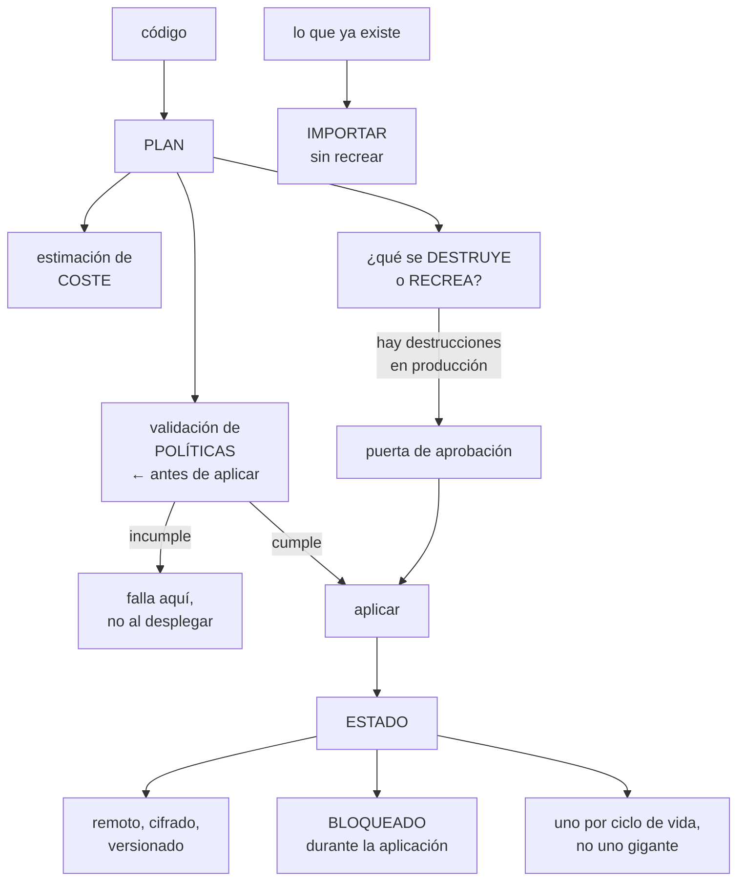

# 232 — Terraform, Infrastructure Manager y policy validation

> [← 231 · Red global, load balancing, PSC y Cloud DNS](../../part-19-gcp-production-architecture/231-red-global-load-balancing-psc-y-cloud-dns/README.md) · [Índice de la parte](../README.md) · [233 · Cloud Run, Functions, API Gateway y Workflows →](../../part-19-gcp-production-architecture/233-cloud-run-functions-api-gateway-y-workflows/README.md)

**Parte:** 19 — Google Cloud: arquitectura de datos y operación en producción<br>
**Nivel:** avanzado · **Horas estimadas:** 4<br>
**Laboratorio:** `iac` · **Estado:** `EXECUTABLE_CORE`

## 🎯 Propósito

Declarar la infraestructura de Google Cloud como código con la pieza que faltaba en las partes anteriores: **validar las políticas antes de desplegar, para que el rechazo no llegue en el momento de aplicar**. La clase cubre la gestión del estado y sus riesgos, la estructura por ciclo de vida, la validación previa de restricciones, y la operación que resuelve el problema de la ley 27: qué hacer con lo que ya existe y no cumple.

## 📚 Resultados de aprendizaje

Al finalizar podrás:

1. **Gestionar** el estado de forma segura y con bloqueo.
2. **Estructurar** el código por ciclo de vida y por ámbito.
3. **Validar** políticas y coste antes de aplicar, no después.
4. **Importar** lo existente al código sin recrearlo.
5. **Retirar** recursos de forma controlada y comprobada.

## 🧩 Conceptos centrales

| Concepto | Comprensión verificable |
|---|---|
| `estado` | Registro de qué recursos gestiona el código. Contiene información sensible y debe protegerse y bloquearse. |
| `bloqueo del estado` | Mecanismo que impide dos aplicaciones simultáneas. Sin él, el estado se corrompe. |
| `plan de cambios` | Previsualización de lo que se creará, modificará, recreará y destruirá. Se lee antes de aplicar. |
| `validación de políticas` | Comprobación del plan contra las restricciones de la organización, antes de aplicar. |
| `importación` | Incorporación de un recurso existente al estado, sin recrearlo. |
| `servicio gestionado de despliegue` | Alternativa que ejecuta el despliegue en la nube, con el estado gestionado por la plataforma. |

## 🧠 Modelo mental

Google Cloud combina una jerarquía estricta de recursos con una red global y servicios data-first; proyecto, cuota e IAM forman una unidad operativa.

Aplicado a esta clase, separa siempre cuatro planos: **intención** (qué necesita el usuario),
**configuración** (qué declaramos), **estado observado** (qué existe de verdad) y
**evidencia** (cómo sabemos que cumple). Confundirlos produce diseños que se ven correctos
en un diagrama pero fallan al operar.

## 🗺️ Flujo de razonamiento



## 📖 Desarrollo

### 1. El estado, y cómo no perderlo

La diferencia principal frente a Bicep es que aquí **hay un estado**, y eso da capacidades y riesgos.

```text
QUÉ DA EL ESTADO
  saber exactamente qué gestiona el código
  detectar deriva: lo que cambió por fuera
  y destruir lo que deja de estar declarado
  → resuelve el problema de los huérfanos de la clase 220

QUÉ RIESGOS TRAE
  contiene valores sensibles en claro
    → contraseñas generadas, claves, cadenas de conexión
    → un estado en un repositorio es una fuga
  se corrompe si dos personas aplican a la vez
  y si se pierde, el código deja de saber qué gestiona
```

Y la configuración mínima:

```text
ESTADO REMOTO
  en un almacén de objetos, no en el portátil
  con VERSIONADO activado
  con cifrado
  con acceso restringido: quien lee el estado ve secretos
  y con registro de acceso                    clase 238

BLOQUEO
  automático al aplicar
  → sin él, dos canalizaciones simultáneas corrompen el
    estado
  y un procedimiento para liberar un bloqueo atascado
    → que hay que tener escrito ANTES de necesitarlo

UN ESTADO POR CICLO DE VIDA
  no uno gigante
  → un estado enorme hace lentas todas las operaciones
  → y un error afecta a todo
```

Y el error que más daño hace:

```text
BORRAR O PERDER EL ESTADO
  el código deja de saber qué existe
  → al aplicar, intenta CREAR lo que ya está
  → y falla con errores de recurso duplicado, o peor:
    crea duplicados donde el nombre no es único

la recuperación
  restaurar la versión anterior del estado
  → y por eso el versionado del almacén es obligatorio
  o importar todo de nuevo, que es lento y manual
```

Y la alternativa gestionada, que conviene conocer:

```text
el servicio gestionado de despliegue ejecuta el código en
la nube y guarda el estado por ti
  + sin almacén que proteger, sin bloqueo que gestionar
  + con identidad de la plataforma, sin credenciales
  − menos control sobre el proceso y sobre las versiones

→ para equipos pequeños o que empiezan, suele ser mejor
→ y para canalizaciones complejas, el modelo propio
```

### 2. Estructura y ámbitos

La estructura es la de siempre, con los ámbitos de esta nube.

```text
SEPARADO POR CICLO DE VIDA Y POR ÁMBITO
  organizacion/    políticas, carpetas, permisos de
                   organización
  red/             red compartida, subredes, cortafuegos,
                   zonas privadas
  proyectos/       creación y configuración base
  datos/           bases, conjuntos, almacenes
                   → con protección contra destrucción
  cargas/          servicios, trabajos, colas

→ cada uno con su estado
→ y las dependencias entre ellos por salidas y fuentes de
  datos, no por variables copiadas
```

Y las reglas que evitan los problemas frecuentes:

```text
PROTECCIÓN CONTRA DESTRUCCIÓN
  los recursos con datos llevan la marca que impide
  destruirlos
  → y entonces un plan que los destruiría FALLA en el plan,
    no en el aplicar
  → es la protección más barata que existe

SIN SECRETOS EN VARIABLES
  referencias al gestor de secretos
  → y aun así, el valor acaba en el estado: por eso el
    estado se protege como un secreto

VERSIONES FIJADAS
  la del proveedor y las de los módulos
  → sin fijar, el mismo código produce cosas distintas en
    momentos distintos                          ley 25

MÓDULOS DEL CATÁLOGO OFICIAL
  con los valores por defecto revisados
  → misma idea que en la clase 220, contra la ley 26
```

Y los ámbitos de despliegue, que aquí importan:

```text
lo que se crea en la ORGANIZACIÓN
  carpetas, políticas de organización, permisos de
  organización
  → exige permisos muy altos
  → y por eso ese estado y esa canalización van aparte,
    con aprobación                            clase 229

lo que se crea en el PROYECTO
  casi todo lo demás
  → con la identidad federada del proyecto
```

Y una advertencia de traslado:

```text
✗ «una carpeta de módulos por entorno»
  produce código duplicado que diverge
✓ un módulo, y ficheros de variables por entorno
  → y la diferencia entre entornos, visible en un solo
    sitio
```

### 3. Validar antes de aplicar

Esta es la pieza que las partes 17 y 18 echaban de menos: **comprobar que el cambio cumplirá las políticas antes de intentarlo**.

```text
EL PROBLEMA SIN VALIDACIÓN PREVIA
  el despliegue llega a producción y la política lo rechaza
  → el cambio queda a medias
  → y el equipo descubre la restricción en el peor momento

LA VALIDACIÓN PREVIA
  se genera el PLAN
  se convierten los recursos previstos a su forma final
  se evalúan contra las restricciones de la organización
  → y la canalización FALLA ahí, con un mensaje que dice
    qué restricción y qué falta
```

Y lo que se puede validar:

```text
las restricciones de organización         clase 229
las políticas propias de la empresa
  «ningún almacén sin cifrado con clave propia»
  «ninguna base sin copia de seguridad»
  «ningún recurso sin etiquetas obligatorias»
y las convenciones
  nombres, regiones, tamaños permitidos
```

Y las otras dos puertas que deben estar en la misma canalización:

```text
ESTIMACIÓN DE COSTE
  a partir del plan, cuánto costará al mes
  → publicada en la revisión                clase 220
  → y con umbral: por encima de X, aprobación

DESTRUCCIONES Y RECREACIONES
  el plan las lista
  → y una recreación destruye y crea: para una base, es
    pérdida de datos
  → puerta automática: si hay destrucciones en producción,
    aprobación explícita                    clase 220
```

Y el orden completo de la canalización:

```text
1  formato y análisis estático
2  validación de sintaxis
3  PLAN, con identidad federada y solo lectura
4  validación de políticas sobre el plan
5  estimación de coste
6  publicación del resumen: qué se crea, cambia, RECREA y
   destruye
7  puerta si hay destrucciones o si el coste supera el
   umbral
8  aplicar, con identidad de despliegue
9  comprobar el resultado
```

Y una práctica que ahorra incidentes:

```text
el PLAN se ejecuta con una identidad de SOLO LECTURA
→ y la de escritura solo se usa en el paso de aplicar
→ así una propuesta de cambio de cualquiera puede generar
  plan sin poder cambiar nada                clase 230
```

### 4. Importar, detectar deriva y retirar

**La importación** es lo que permite poner bajo código lo que ya existe, que es el problema de la ley 27.

```text
EL ESCENARIO HABITUAL
  hay cientos de recursos creados a mano
  el código nuevo describe lo que debería haber
  → aplicarlo intentaría crear lo que ya existe

LA IMPORTACIÓN
  incorpora el recurso existente al estado
  → y a partir de ahí, el código lo gestiona
  → sin recrearlo ni cortar nada

y el trabajo real
  hay que escribir el código que COINCIDA con lo que existe
  → y el plan posterior dice qué diferencias hay
  → esas diferencias son el inventario de lo que estaba mal
```

Y el orden que funciona:

```text
1  generar el código a partir de lo existente, donde la
   herramienta lo permita
2  importar
3  ejecutar el plan: si sale vacío, el código describe la
   realidad
4  y si no, cada diferencia es una decisión: ¿se ajusta el
   código o se corrige el recurso?
5  corregir hacia el estado deseado, por lotes
```

**La deriva**, que es lo que ocurre después:

```text
alguien cambia algo por la consola durante un incidente
→ el código deja de describir la realidad
→ y el siguiente despliegue lo revierte sin avisar

LA DETECCIÓN
  ejecutar el plan periódicamente y alertar si no está
  vacío
  → un plan que no está vacío sin que nadie haya cambiado
    el código significa deriva
  → y esa alerta es la que detecta los cambios manuales
                                          ley 25, clase 219
```

**La retirada**, que es lo que el estado permite y casi nadie usa:

```text
quitar el recurso del código y aplicar → se destruye
→ y por eso la protección contra destrucción en los datos

y para lo que hay que sacar del código sin borrarlo
  se quita del estado, y el recurso queda huérfano
  → útil cuando pasa a gestionarlo otro equipo
  → y peligroso si se olvida: queda sin gobierno   ley 20
```

Y las comprobaciones de esta clase:

```text
☐ borrar el estado y comprobar que se puede restaurar
☐ aplicar dos veces en paralelo y ver que el bloqueo lo
  impide
☐ intentar destruir un recurso protegido
☐ desplegar algo que incumple una política y ver que falla
  en la validación, no al aplicar
☐ ejecutar el plan sin cambios y comprobar que está vacío
☐ desplegar el entorno de cero en un proyecto vacío
                                                clase 220
```

Y la lista de comprobación de la clase:

```text
☐ el estado es remoto, cifrado, versionado y con acceso
  restringido
☐ el bloqueo está activo y hay procedimiento para liberarlo
☐ hay un estado por ciclo de vida, no uno gigante
☐ los recursos con datos tienen protección contra
  destrucción
☐ las versiones del proveedor y de los módulos están fijadas
☐ se usan módulos del catálogo oficial donde existen
☐ la canalización valida políticas sobre el plan
☐ estima el coste y lo publica
☐ lista destrucciones y recreaciones, con puerta de
  aprobación
☐ el plan usa identidad de solo lectura
☐ lo existente está importado, y el plan sale vacío
☐ hay detección periódica de deriva, con alerta
☐ el entorno se despliega de cero periódicamente
```

Y el cierre que enlaza con la clase siguiente: con la base declarada y validada, quedan las cargas. Las opciones de cómputo gestionado de esta nube —y la que ha cambiado más el modelo de contenedores— son la materia de la clase 233.

## 🔬 Ejemplo trabajado

**CloudShop pone su infraestructura de Google Cloud bajo código. Lo que sigue es la importación de 4.100 recursos creados a mano, el estado que se perdió una vez, y la validación previa que evitó 61 despliegues fallidos en producción.**

**El punto de partida:**

```text
recursos existentes                              9.400
  declarados en algún código                       410   4 %
  creados a mano                                 8.990

estados existentes                                  11
  en un almacén sin versionado                       7
  EN EL REPOSITORIO                                  2  ←
  en portátiles                                      2

y los 2 del repositorio contenían
  3 contraseñas de bases de datos en claro
  1 clave de cuenta de servicio
  → visibles para los 214 miembros de la organización
  → desde hacía 14 meses                        ley 15
```

Y la corrección inmediata:

```text
estados retirados del repositorio y del historial
contraseñas y clave rotadas
almacén de estados: versionado, cifrado con clave propia,
  acceso restringido a 4 identidades, registro de acceso
  activado                                    clase 238
→ y una función de aptitud: ningún fichero de estado en
  ningún repositorio                          clase 190
```

**La importación, por lotes.**

```text
orden elegido
  1  red y cortafuegos          (más estable, menos riesgo)
  2  proyectos y permisos
  3  datos                      (con protección primero)
  4  cargas                     (las que más cambian)

el proceso por lote
  generar el código desde lo existente
  importar
  ejecutar el plan
  → y aquí aparecía el trabajo real

lote de red: 210 recursos
  plan tras importar: 118 diferencias
    · 41 reglas de cortafuegos con descripción vacía
      → se ajustó el código
    · 38 subredes sin registros de flujo activados
      → se corrigió el RECURSO
    ·  9 reglas con selector por etiqueta       clase 229
      → se corrigieron
    · 30 diferencias de campos irrelevantes
      → se ajustó el código

→ cada diferencia era una decisión, y 47 de las 118
  revelaron configuraciones que estaban mal
```

Y el resultado global:

```text
recursos importados                              4.100
  → los otros 4.890 eran efímeros o de servicios
    gestionados que no se declaran
diferencias encontradas al importar               1.240
  ajustes al código                                 810
  CORRECCIONES DE RECURSOS                          430  ←

→ importar fue, además, una auditoría de configuración
→ y las 430 correcciones son la remediación que la ley 27
  exige                                        clase 228
```

**El estado que se perdió.**

```text
qué pasó
  una canalización mal configurada aplicó con la variable
  de ruta del estado vacía
  → creó un estado nuevo, vacío, en la ruta por defecto
  → y el siguiente despliegue, con el estado bueno, entró
    en conflicto

  y el estado bueno se sobrescribió

qué salvó el caso
  el almacén tenía versionado activado
  → se restauró la versión anterior en 4 minutos

qué habría pasado sin versionado
  el código no habría sabido qué existía
  → habría intentado crear 4.100 recursos que ya estaban
  → y en los que el nombre no es único, habría creado
    duplicados

correcciones
  la ruta del estado, obligatoria y comprobada en la
  canalización
  copia diaria del estado a otro almacén
  y una prueba: borrar el estado en un entorno inferior y
  restaurarlo                                     ley 22
```

**La validación previa de políticas, que era lo que faltaba.**

```text
antes de montarla, en 3 meses
  despliegues rechazados por política EN EL MOMENTO DE
  APLICAR                                            61
    de ellos, en producción                          19
    de ellos, que dejaron el cambio a medias         11
  tiempo medio de resolución                     2 h 20

tras montarla
  la canalización convierte el plan a la forma final y lo
  evalúa contra las restricciones
  → falla en la validación, con el mensaje

  despliegues rechazados en el momento de aplicar
                                              61 → 2
    los 2, por restricciones que la validación no cubre
  rechazados en la validación                       74
    → antes de tocar nada, en 40 segundos
  tiempo medio de resolución               2 h 20 → 9 min
```

Y las políticas propias que se añadieron a la validación:

```text
ningún almacén sin cifrado con clave propia
ninguna base sin copia de seguridad configurada
ningún recurso sin las 5 etiquetas obligatorias
ninguna regla de cortafuegos con selector por etiqueta
ninguna cuenta de servicio con papel de proyecto
ningún recurso fuera de las regiones de la UE

→ y cada una con un mensaje que dice qué falta y enlaza el
  módulo que ya lo cumple                     clase 217
```

**La estimación de coste, que evitó dos sorpresas:**

```text
caso 1   una propuesta de cambio añadía un clúster con
         nodos de 32 núcleos
         estimación                        +8.400 €/mes
         → la revisión preguntó por qué; resultó ser un
           valor copiado de otro entorno
         → corregido a nodos de 8: +1.100 €/mes

caso 2   una propuesta activaba registros de acceso a
         datos en todos los servicios
         estimación                        +3.900 €/mes
                                                clase 238
         → se acotó a los servicios con datos sensibles:
           +410 €/mes
```

**La deriva, detectada:**

```text
plan ejecutado a diario, sin cambios de código
  → si no sale vacío, hay deriva

primeros 6 meses
  detecciones                                       23
    cambios hechos por consola durante incidentes    14
      → 9 de ellos deberían haberse revertido y no se
        revirtieron                                ley 25
    cambios de servicios gestionados que ajustan campos     6
      → se marcaron para ignorar
    3 cambios que nadie pudo explicar
      → investigados; 2 eran automatismos de la
        plataforma, 1 fue un script de un proveedor

→ y las 9 del primer grupo son exactamente lo que la deriva
  sirve para encontrar
```

**Las pruebas negativas, ejecutadas:**

```text
✓  borrar el estado y restaurarlo             4 min
✓  aplicar dos veces en paralelo              bloqueado
✓  destruir un recurso protegido              falla en el
                                              plan
✓  desplegar algo que incumple una política   falla en
                                              validación
✗  plan sin cambios, vacío
   → 6 recursos con deriva permanente por campos que la
     plataforma ajusta sola
   → marcados para ignorar; corregido
✓  desplegar el entorno de cero en proyecto vacío  61 min
```

**El resultado:**

```text                                        antes     después
recursos bajo código                          4 %        97 %
estados en repositorios                         2           0
secretos expuestos en estados                   4           0
despliegues rechazados al aplicar          61/trim      2/trim
tiempo de resolución de un rechazo         2 h 20       9 min
configuraciones corregidas al importar          —         430
deriva detectada y corregida                   no      23/6mes
sorpresas de coste en despliegues            2/trim         0
tiempo de despliegue de cero            imposible      61 min
```

**La lección que esta clase deja**: importar cuatro mil cien recursos **fue además una auditoría**, y produjo cuatrocientas treinta correcciones de configuración que ninguna herramienta de postura había señalado. La validación previa de políticas convirtió sesenta y un rechazos en producción en setenta y cuatro fallos de canalización de cuarenta segundos. Y el estado estuvo catorce meses en un repositorio con **tres contraseñas de producción en claro**, visible para doscientos catorce personas.

## 🧪 Laboratorio guiado

Ejecuta desde la raíz:

```bash
python classes/part-19-gcp-production-architecture/232-terraform-infrastructure-manager-y-policy-validation/lab.py
```

El laboratorio selecciona el motor de práctica **`iac`** y produce
`lab_result.json`. El escenario, sus comprobaciones y el artefacto esperado corresponden a
esta clase; no requiere credenciales y deja explícito qué debe revalidarse en un sandbox real.

1. Lee `exercise.steps` y formula una predicción antes de ejecutar.
2. Ejecuta la práctica y verifica todos los elementos de `checks`.
3. Provoca el caso de `negative_test` y explica la señal observada.
4. Materializa `gcp-iac-stack` en `evidence/` usando la plantilla indicada.
5. Para proveedor real, sigue `sandbox.requires`, registra costo y ejecuta `destroy`.

### Evidencia esperada

El artefacto principal es un plan reproducible sin secretos ni cambios inesperados. Además, la entrega debe incluir el comando ejecutado,
la salida estructurada y una conclusión que no exceda lo observado.

## 🏆 Reto verificable

Construye **`gcp-iac-stack`** para el caso CloudShop. Incluye una alternativa descartada,
un supuesto que pueda falsarse, una prueba de fallo y una decisión de rollback.

## ✅ Criterio de aceptación

- [ ] `lab.py` termina con código 0 y genera JSON válido.
- [ ] La entrega conecta al menos tres requisitos con mecanismos verificables.
- [ ] Existe una prueba positiva y una prueba negativa con evidencia.
- [ ] Seguridad, costo y operación aparecen como decisiones, no como anexos.
- [ ] Se declara una limitación y una condición que obligaría a revisar el diseño.
- [ ] Otra persona puede repetir el recorrido sin conocimiento tácito.

## ⚠️ Errores frecuentes

| Síntoma | Causa probable | Corrección |
|---|---|---|
| El estado contiene secretos visibles para mucha gente | Está en un repositorio o en un almacén con acceso amplio | Estado remoto, cifrado, versionado y restringido a unas pocas identidades, con registro de acceso, y una función de aptitud que prohíba ficheros de estado en repositorios. |
| Se pierde el estado y el código intenta crear lo que ya existe | El almacén no tiene versionado o la ruta del estado no está fijada | Versionado obligatorio, copia diaria, ruta comprobada en la canalización y prueba de restauración. |
| Un despliegue se rechaza por política a mitad de aplicar | No se valida el plan contra las restricciones antes de aplicar | Convierte el plan a su forma final y evalúalo contra las políticas en la canalización, con mensajes que digan qué falta. |
| Una recreación destruye datos | El plan no se leyó y el recurso no estaba protegido | Marca los recursos con datos contra destrucción y pon puerta de aprobación cuando el plan liste destrucciones. |
| Un cambio hecho en la consola desaparece en el siguiente despliegue | Deriva no detectada entre el código y la realidad | Ejecuta el plan periódicamente sin cambios de código y alerta si no sale vacío. |
| Aparecen sorpresas de coste tras un despliegue | No se estima el coste del plan en la revisión | Añade estimación de coste a la canalización, con umbral que exija aprobación. |

## 🛡️ Seguridad, ética y costo

Trabaja con cuentas propias o sandboxes autorizados. No publiques secretos, identificadores
reales ni datos personales. Antes de crear recursos pagos define presupuesto, etiquetas y
comando de destrucción; después verifica que no queden recursos huérfanos. Los ejemplos
locales enseñan contratos, pero no certifican cumplimiento ni disponibilidad de producción.

## ❓ Preguntas de comprobación

1. ¿Qué capacidades da el estado y qué riesgos trae?
2. ¿Qué ocurre si se pierde el estado y cómo se recupera?
3. ¿Qué se gana validando las políticas sobre el plan en vez de al aplicar?
4. ¿Qué revela la importación de recursos existentes además de ponerlos bajo código?
5. ¿Cómo se detecta que alguien cambió algo por la consola?

## 🔗 Referencias

- HashiCorp (2025). *Terraform state: remote backends and locking*. <https://developer.hashicorp.com/terraform/language/state>
- Google Cloud (2025). *Infrastructure Manager*. <https://cloud.google.com/infrastructure-manager/docs/overview>
- Google Cloud (2025). *Policy validation with Policy Library*. <https://cloud.google.com/docs/terraform/policy-validation>
- Google Cloud (2025). *Cloud Foundation Toolkit modules*. <https://cloud.google.com/foundation-toolkit>
- HashiCorp (2025). *Importing existing infrastructure*. <https://developer.hashicorp.com/terraform/cli/import>
- Documentación oficial vigente del servicio implementado; registra URL y fecha de consulta.

---

> [Evaluación](assessment.md) · [Contrato de clase](lesson.yaml) · [Índice de la parte](../README.md)

| Anterior | Índice | Siguiente |
|---|---|---|
| [← 231 · Red global, load balancing, PSC y Cloud DNS](../../part-19-gcp-production-architecture/231-red-global-load-balancing-psc-y-cloud-dns/README.md) | [Parte 19](../README.md) · [Programa](../../README.md) | [233 · Cloud Run, Functions, API Gateway y Workflows →](../../part-19-gcp-production-architecture/233-cloud-run-functions-api-gateway-y-workflows/README.md) |
