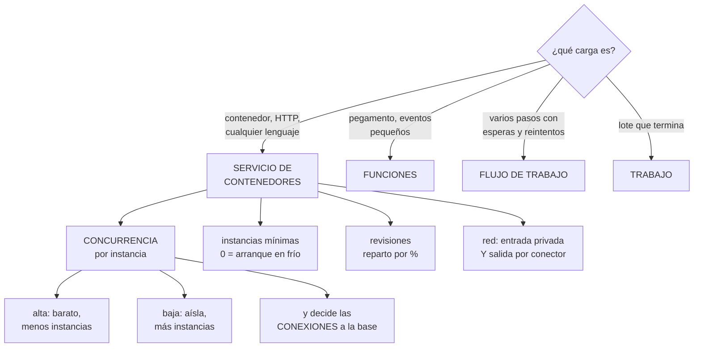

# 233 — Cloud Run, Functions, API Gateway y Workflows

> [← 232 · Terraform, Infrastructure Manager y policy validation](../../part-19-gcp-production-architecture/232-terraform-infrastructure-manager-y-policy-validation/README.md) · [Índice de la parte](../README.md) · [234 · GKE Autopilot, Workload Identity y Config Sync →](../../part-19-gcp-production-architecture/234-gke-autopilot-workload-identity-y-config-sync/README.md)

**Parte:** 19 — Google Cloud: arquitectura de datos y operación en producción<br>
**Nivel:** avanzado · **Horas estimadas:** 4<br>
**Laboratorio:** `serverless` · **Estado:** `EXECUTABLE_CORE`

## 🎯 Propósito

Desplegar cargas sin gestionar servidores en Google Cloud, donde el modelo de contenedores gestionados es el que más ha cambiado la forma de trabajar: **se despliega una imagen, escala a cero y se reparte tráfico por revisión, sin orquestador**. La clase cubre la configuración que separa un servicio de demostración de uno de producción —concurrencia, instancias mínimas, tiempos de espera y conexiones—, las funciones y la orquestación de pasos largos.

## 📚 Resultados de aprendizaje

Al finalizar podrás:

1. **Elegir** entre servicio de contenedores, funciones y flujos de trabajo.
2. **Configurar** concurrencia e instancias con criterio, no por defecto.
3. **Conectar** las cargas a la red privada, de entrada y de salida.
4. **Desplegar** con reparto por revisión y vuelta atrás inmediata.
5. **Orquestar** procesos de varios pasos sin escribir la coordinación.

## 🧩 Conceptos centrales

| Concepto | Comprensión verificable |
|---|---|
| `servicio de contenedores gestionado` | Ejecuta una imagen con escalado automático, escala a cero y reparto de tráfico por revisión. |
| `concurrencia por instancia` | Cuántas peticiones atiende una instancia a la vez. Es el ajuste que más cambia coste y latencia. |
| `instancia mínima` | Número de instancias siempre encendidas. Elimina el arranque en frío y se paga. |
| `revisión` | Versión inmutable del servicio. El tráfico se reparte entre revisiones por porcentaje. |
| `conector de red` | Mecanismo que hace que el tráfico saliente del servicio pase por la red privada. |
| `flujo de trabajo` | Orquestación declarativa de pasos con reintentos, esperas y compensaciones, sin código de coordinación. |

## 🧠 Modelo mental

Google Cloud combina una jerarquía estricta de recursos con una red global y servicios data-first; proyecto, cuota e IAM forman una unidad operativa.

Aplicado a esta clase, separa siempre cuatro planos: **intención** (qué necesita el usuario),
**configuración** (qué declaramos), **estado observado** (qué existe de verdad) y
**evidencia** (cómo sabemos que cumple). Confundirlos produce diseños que se ven correctos
en un diagrama pero fallan al operar.

## 🗺️ Flujo de razonamiento



## 📖 Desarrollo

### 1. Elegir la forma de ejecutar

Hay cuatro opciones y se diferencian por lo que ejecutan y cuánto duran.

```text
SERVICIO DE CONTENEDORES
  una imagen que atiende peticiones
  + cualquier lenguaje y cualquier dependencia
  + escala a cero y escala por peticiones
  + reparto de tráfico por revisión, nativo
  + sin orquestador que operar
  − arranque en frío si escala a cero

FUNCIONES
  código sin empaquetar, disparado por eventos o HTTP
  + más simple para pegamento
  − menos control del entorno
  → y en la práctica se ejecutan sobre la misma base que
    los servicios: la diferencia es de empaquetado

TRABAJO
  un contenedor que se ejecuta, termina y no atiende
  peticiones
  + para lotes, migraciones y procesos programados
  + con paralelismo por tareas

FLUJO DE TRABAJO
  orquestación declarativa de pasos
  + reintentos, esperas largas, ramas y compensaciones sin
    escribir código de coordinación
  − no es para lógica compleja: para coordinar
```

Y el criterio:

```text
¿atiende peticiones HTTP?         servicio
¿reacciona a un evento y es
  pequeño?                        función
¿empieza, hace y termina?          trabajo
¿coordina varios pasos con
  esperas y reintentos?            flujo de trabajo
¿necesita operadores, GPU o
  planificación fina?              clúster       clase 234
```

Y la diferencia principal frente a lo visto en las otras nubes:

```text
aquí el servicio de contenedores cubre lo que en otras
nubes se reparte entre varios productos
  → aplicaciones web, APIs, trabajadores y funciones
  → con un solo modelo de despliegue y de escalado
→ y eso reduce mucho lo que hay que aprender y operar
                                                    ley 23
```

Y una advertencia de traslado:

```text
✗ «escala a cero, así que es lo más barato»
  con tráfico continuo, un servicio con instancias mínimas
  puede salir más barato que uno que arranca y para
  → y con concurrencia alta, mucho más    ← ver abajo
```

### 2. Concurrencia: el ajuste que más cambia

Este es el parámetro que distingue este modelo y el que más se configura mal.

```text
CONCURRENCIA POR INSTANCIA
  cuántas peticiones atiende UNA instancia a la vez
  valor por defecto: alto (80 en muchos casos)

  ALTA
    + menos instancias para el mismo tráfico
    + mucho más barato
    + menos arranques en frío
    − una petición pesada afecta a las otras 79
    − y la memoria se comparte entre todas

  BAJA (1)
    + aislamiento total: como una función
    + útil si el código no es seguro para concurrencia
    − una instancia por petición: caro y con muchos
      arranques
```

Y el cálculo, que es el de la clase 186:

```text
instancias = caudal × latencia / concurrencia

  1.000 pet/s × 0,08 s / 80 = 1 instancia
  1.000 pet/s × 0,08 s /  1 = 80 instancias

→ el mismo tráfico, con 80 veces más instancias
→ y por tanto, con 80 veces más conexiones a la base
```

Y de ahí la consecuencia que rompe sistemas:

```text
LAS CONEXIONES A LA BASE
  cada instancia abre su agrupación
  instancias máximas × tamaño de agrupación = conexiones

  con concurrencia 1 y máximo 100 instancias
    100 × 5 = 500 conexiones
    y la base admite 200
    → agotamiento, igual que en la clase 207

  con concurrencia 80 y el mismo tráfico
    2 instancias × 5 = 10 conexiones

→ subir la concurrencia es también la forma de reducir
  conexiones
→ y donde no se pueda, hace falta un intermediario
```

Y cómo se elige el valor:

```text
¿el código es seguro para atender varias peticiones a la
 vez?
  no → concurrencia 1, y arreglarlo
  sí → medir

y se mide
  con la carga real, subiendo la concurrencia hasta que la
  latencia empeora
  → el punto donde el p99 empieza a subir es el codo
                                                clase 186
  → y se elige algo por debajo
```

**Las instancias mínimas**, con la decisión de coste:

```text
MÍNIMO 0
  + no se paga cuando no hay tráfico
  − arranque en frío en la primera petición
  → aceptable para lo asíncrono y lo interno

MÍNIMO ≥ 1
  + sin arranque en frío
  − se paga siempre
  → obligatorio en el camino crítico

Y EL TAMAÑO DE LA IMAGEN decide cuánto dura el arranque
  → imagen mínima, dependencias justas    clase 212
  → y el trabajo de inicialización, fuera de la petición
```

### 3. Red, despliegue y tiempos

**La red**, con la misma separación de la clase 221:

```text
ENTRADA
  pública, interna o solo desde el balanceador
  → «interna» significa alcanzable desde la red, no desde
    internet
  → y la autorización sigue siendo necesaria: la red no
    autoriza                                clase 189

SALIDA
  por defecto, el tráfico saliente NO pasa por tu red
  → un conector o la salida directa a la red hacen que sí
  → y solo entonces se alcanza lo privado y se pasa por el
    cortafuegos                          clases 221, 231

y hay que decidir
  ¿todo el tráfico saliente por la red, o solo el privado?
  → para control de salida, todo               clase 200
```

Y el error de traslado que se repite:

```text
✗ «tiene entrada interna, ya está en la red»
  la entrada y la salida se configuran por separado
  → y sin conector, el servicio no alcanza la base privada
```

**El despliegue por revisiones**, que aquí es nativo y muy bueno:

```text
cada despliegue crea una REVISIÓN inmutable
el tráfico se reparte por porcentaje entre revisiones

  desplegar sin tráfico                     0 %
  comprobar con una etiqueta que da una URL propia
  desviar 5 %, 25 %, 100 %
  y volver atrás cambiando el porcentaje    segundos

→ es el despliegue escalonado de la clase 102, sin montar
  nada
→ y la vuelta atrás no redespliega: cambia un número
```

Y lo que hay que cuidar:

```text
LAS MIGRACIONES DE ESQUEMA
  dos revisiones sirviendo a la vez significa dos versiones
  del código contra la misma base
  → expandir y contraer, siempre               clase 188

LAS SESIONES
  las instancias son efímeras y no hay afinidad garantizada
  → el estado va fuera                        clase 149
```

**Los tiempos de espera y el ciclo de vida:**

```text
TIEMPO MÁXIMO DE PETICIÓN
  configurable, con un máximo alto
  → y el mismo error de la clase 207: poner el máximo «por
    si acaso» significa pagar peticiones colgadas
  → múltiplo pequeño del p99                    ley 26

SEÑAL DE TERMINACIÓN
  la instancia recibe aviso antes de pararse
  → hay que atenderla: terminar lo que se está haciendo
  → si no, se cortan peticiones             clase 212

TRABAJO EN SEGUNDO PLANO
  fuera de una petición, la CPU puede no estar asignada
  → un hilo que sigue trabajando tras responder puede no
    avanzar
  → o se activa la asignación continua de CPU, o el trabajo
    va a una cola                            clase 237
```

Y una advertencia sobre eso último, que sorprende:

```text
el patrón «responder rápido y seguir trabajando en
segundo plano» NO funciona por defecto aquí
→ y falla de forma intermitente, que es lo peor
→ el trabajo diferido va a una cola, siempre
```

### 4. Flujos de trabajo y operación

**Los flujos de trabajo** resuelven la coordinación sin escribirla, y evitan uno de los antipatrones de la parte 09.

```text
QUÉ RESUELVEN
  «llama a A; si falla, reintenta 3 veces con retroceso;
   luego espera a que llegue B; si tarda más de 2 horas,
   compensa A y avisa»
  → escrito en un fichero declarativo
  → con el estado de cada ejecución persistido

QUÉ EVITAN
  la coordinación escrita a mano en un servicio, que
  acumula estado y se convierte en un punto único
  → y las esperas largas ocupando concurrencia

Y LOS LÍMITES
  no son para lógica de negocio compleja
  ni para volumen muy alto
  → cada paso tiene coste, y con millones de ejecuciones
    suma
```

Y la disciplina que este programa exige y aquí también aplica:

```text
cada paso con efecto, IDEMPOTENTE          clase 210
  → el flujo reintenta, y un reintento no debe duplicar
las compensaciones, explícitas y probadas
  → y recordando que la compensación hace invisible el
    fallo                                        ley 19
y el estado del flujo, consultable
  → «¿por qué este pedido lleva 3 horas?» debe tener
    respuesta sin abrir registros
```

**Lo que hay que vigilar** en estas cargas:

```text
peticiones, errores y latencia por percentil  clase 238
instancias activas frente al máximo
  → tocar el máximo significa rechazo
utilización de la concurrencia
  → si está muy por debajo, se puede subir y ahorrar
tiempo de arranque y peticiones que lo pagan
conexiones a la base por instancia
peticiones que agotan el tiempo de espera
y en flujos: ejecuciones en curso, fallidas y su antigüedad
                                                    ley 13
```

Y el coste, con las palancas propias:

```text
se factura por tiempo de instancia y por peticiones

las palancas, por efecto
  1  SUBIR LA CONCURRENCIA        ← la mayor, con diferencia
  2  reducir la latencia (menos tiempo de instancia)
  3  instancias mínimas solo donde hacen falta
  4  memoria y CPU ajustadas, medidas
  5  y la asignación continua de CPU solo si se usa
```

Y la lista de comprobación de la clase:

```text
☐ la forma de ejecutar corresponde a la carga
☐ la concurrencia se eligió midiendo, no por defecto
☐ el código es seguro para concurrencia, comprobado
☐ las conexiones máximas a la base están calculadas
☐ las instancias mínimas cubren el camino crítico
☐ la imagen es mínima y el arranque está medido
☐ la entrada está restringida y la salida pasa por la red
☐ el despliegue usa revisiones con reparto por porcentaje
☐ los cambios de esquema usan expandir y contraer
☐ el tiempo de espera es múltiplo pequeño del p99
☐ el servicio atiende la señal de terminación
☐ no hay trabajo en segundo plano fuera de la petición
☐ los pasos de los flujos son idempotentes
☐ hay alerta de ejecuciones de flujo antiguas o fallidas
```

Y el cierre que enlaza con la clase siguiente: cuando la carga exige operadores, control fino o cargas heterogéneas, aparece el clúster gestionado, que aquí tiene un modo que quita casi toda la operación. Es la materia de la clase 234.

## 🔬 Ejemplo trabajado

**CloudShop despliega su plataforma en Google Cloud. Lo que sigue es el ajuste de concurrencia que redujo el coste un 71 % y las conexiones a la base de 500 a 12, el trabajo en segundo plano que fallaba de forma intermitente, y el flujo de trabajo que sustituyó a un coordinador escrito a mano.**

**El montaje inicial, trasladado de la nube anterior:**

```text
11 servicios, todos con
  concurrencia                              1
  motivo del equipo   «así se comporta como una función,
                       que es lo que teníamos»
  instancias mínimas                        0
  máximo                                  100
  tiempo de espera                        300 s
  memoria                                 512 Mi
  entrada                                 interna
  salida                                  sin conector
```

Y los cuatro problemas que aparecieron el primer mes:

```text
1  la base agotó conexiones en el primer pico
2  el coste era 3,4 veces el estimado
3  los servicios no alcanzaban la base privada
4  el envío de correos fallaba de forma intermitente
```

**Problema 1 y 2 · La concurrencia.**

```text
el cálculo, con la carga real del servicio de pedidos
  caudal en el pico                     900 pet/s
  latencia p50                           78 ms

  con concurrencia 1
    instancias = 900 × 0,078 / 1 = 71 instancias
    conexiones = 71 × 7 = 497            > 200 de la base

  con concurrencia 40
    instancias = 900 × 0,078 / 40 = 2 instancias
    conexiones = 2 × 7 = 14
```

Y la medición para elegir el valor:

```text
se subió la concurrencia por escalones, midiendo el p99

  concurrencia   p99      instancias en el pico
       1        142 ms          71
      10        148 ms           8
      25        151 ms           3
      40        156 ms           2
      60        189 ms           2
      80        410 ms           2   ← el codo

  → el p99 empieza a subir claramente entre 60 y 80
  → se eligió 40, con margen

y antes hubo que comprobar
  ¿el código es seguro para atender varias a la vez?
  → 2 de los 11 servicios NO lo eran: usaban una variable
    global para el contexto de la petición
  → corregidos; y hasta corregirlos, quedaron en
    concurrencia 1
```

Y el efecto:

```text                                        antes     después
concurrencia                                    1          40
instancias en el pico                          71           2
conexiones a la base                          497          14
coste de cómputo                          4.100 €     1.180 €
p99                                        142 ms      156 ms
agotamientos de conexiones                 3/mes           0
```

**Problema 3 · La salida sin conector.**

```text
síntoma   los servicios no alcanzaban la base privada
          ni el almacén con conexión privada  clase 231

causa     entrada configurada como interna
          → el equipo asumió que eso los ponía «en la red»
          → la SALIDA es un ajuste distinto

corrección
  conector de red, con subred dedicada dimensionada por el
  máximo de instancias
  y encaminamiento de CUANTO tráfico salga, por la red
  → así pasa por el cortafuegos y se registra   clase 200

y la comprobación que se añadió
  desde el servicio, resolver el nombre de la base
  → debe devolver dirección privada
  y comprobar la dirección de salida observada
  → debe ser la de la pasarela de traducción
```

**Problema 4 · El trabajo en segundo plano.**

```text
síntoma   entre el 2 % y el 11 % de los correos de
          confirmación no se enviaban
          sin errores en los registros
          sin patrón horario

causa
  el servicio respondía al cliente y luego, en un hilo
  aparte, enviaba el correo
  → fuera de la petición, la CPU puede no estar asignada
  → el hilo se quedaba a medias y la instancia se apagaba
  → y no se registraba nada porque no llegaba a fallar

corrección
  el envío pasa a una cola; un servicio consumidor lo
  procesa                                     clase 237
  → y con idempotencia, porque hay reintentos

correos no enviados                        2-11 % → 0
```

Y la observación del equipo:

```text
este fallo es el más difícil de los cuatro
  no daba error
  no tenía patrón
  y funcionaba en pruebas, donde el tráfico bajo mantenía
  las instancias vivas
→ y es una diferencia de modelo, no un error de
  configuración                                clase 229
```

**El flujo de trabajo que sustituyó al coordinador.**

```text
el proceso de devolución tenía 7 pasos
  validar → autorizar reembolso → esperar recepción del
  paquete (hasta 14 días) → inspeccionar → reembolsar →
  actualizar inventario → notificar

la implementación anterior
  un servicio que guardaba el estado en una tabla
  un trabajo programado cada 10 min que buscaba
    devoluciones pendientes y las avanzaba
  reintentos escritos a mano
  compensaciones escritas a mano
  → 1.400 líneas de coordinación
  → y 3 incidentes en el año por estados inconsistentes

la implementación con flujo de trabajo
  fichero declarativo de 120 líneas
  reintentos con retroceso, declarados
  espera de hasta 14 días, nativa
  compensación declarada
  estado de cada ejecución, consultable

resultado
  líneas de coordinación                 1.400 → 120
  incidentes por estado inconsistente        3/año → 0
  «¿por qué esta devolución lleva 3 días?»
    antes    abrir registros: 20-40 min
    después  consultar la ejecución: 30 s
  coste                                   +18 €/mes
```

Y la disciplina que hizo falta:

```text
los 7 pasos, idempotentes
  → el flujo reintenta, y reembolsar dos veces cuesta
    dinero
  → clave de idempotencia por devolución e intento
                                                clase 210
y la compensación, probada
  → se ejecutó a propósito 20 veces en preproducción
  → 2 de 20 dejaron el inventario mal: corregido
                                            ley 19, 22
```

**El despliegue por revisiones, y lo que evitó:**

```text
214 despliegues en 6 meses
  desplegados sin tráfico y comprobados con URL propia
  desviados al 5 %, luego al 100 %

  revisiones que no llegaron al 100 %              9
    · 6 detectadas en el 5 % por tasa de error
    · 3 detectadas al comprobar con la URL propia
  tiempo de vuelta atrás                         12 s
  peticiones afectadas por despliegue defectuoso
                                       ~340 (en el 5 %)

y lo que habría pasado sin reparto por porcentaje
  las 9 habrían llegado al 100 % del tráfico
```

**El resultado:**

```text                                        antes     después
coste de cómputo                          4.100 €     1.180 €
conexiones máximas a la base                  497          14
agotamientos de conexiones                  3/mes           0
correos no enviados                        2-11 %          0
servicios que alcanzan la base privada       0/11       11/11
líneas de coordinación de devoluciones      1.400         120
incidentes por estado inconsistente         3/año           0
despliegues defectuosos que llegaron
  a todo el tráfico                            n/d           0
```

**La lección que esta clase deja**: un solo parámetro —la concurrencia, puesta en 1 por trasladar el modelo de funciones— **costaba dos mil novecientos euros al mes y agotaba las conexiones de la base**. Subirlo a 40 redujo las instancias de setenta y una a dos. Y el fallo más difícil de los cuatro no dio ningún error: **el trabajo en segundo plano fuera de la petición no avanza**, y eso no es un error de configuración sino una diferencia de modelo que hay que conocer antes de trasladar código.

## 🧪 Laboratorio guiado

Ejecuta desde la raíz:

```bash
python classes/part-19-gcp-production-architecture/233-cloud-run-functions-api-gateway-y-workflows/lab.py
```

El laboratorio selecciona el motor de práctica **`serverless`** y produce
`lab_result.json`. El escenario, sus comprobaciones y el artefacto esperado corresponden a
esta clase; no requiere credenciales y deja explícito qué debe revalidarse en un sandbox real.

1. Lee `exercise.steps` y formula una predicción antes de ejecutar.
2. Ejecuta la práctica y verifica todos los elementos de `checks`.
3. Provoca el caso de `negative_test` y explica la señal observada.
4. Materializa `gcp-serverless` en `evidence/` usando la plantilla indicada.
5. Para proveedor real, sigue `sandbox.requires`, registra costo y ejecuta `destroy`.

### Evidencia esperada

El artefacto principal es una función con límites, reintentos e idempotencia. Además, la entrega debe incluir el comando ejecutado,
la salida estructurada y una conclusión que no exceda lo observado.

## 🏆 Reto verificable

Construye **`gcp-serverless`** para el caso CloudShop. Incluye una alternativa descartada,
un supuesto que pueda falsarse, una prueba de fallo y una decisión de rollback.

## ✅ Criterio de aceptación

- [ ] `lab.py` termina con código 0 y genera JSON válido.
- [ ] La entrega conecta al menos tres requisitos con mecanismos verificables.
- [ ] Existe una prueba positiva y una prueba negativa con evidencia.
- [ ] Seguridad, costo y operación aparecen como decisiones, no como anexos.
- [ ] Se declara una limitación y una condición que obligaría a revisar el diseño.
- [ ] Otra persona puede repetir el recorrido sin conocimiento tácito.

## ⚠️ Errores frecuentes

| Síntoma | Causa probable | Corrección |
|---|---|---|
| La base agota conexiones con poco tráfico | Concurrencia por instancia baja, que multiplica el número de instancias y de agrupaciones | Mide el codo subiendo la concurrencia y elige un valor por debajo; calcula las conexiones máximas resultantes. |
| El coste es varias veces el estimado | Se factura tiempo de instancia y hay muchas instancias por concurrencia baja | Subir la concurrencia es la palanca de coste con más efecto; después, reducir latencia y ajustar recursos. |
| El servicio no alcanza recursos privados pese a tener entrada interna | Entrada y salida se configuran por separado | Añade el conector o la salida directa a la red y comprueba la dirección de salida observada. |
| Un trabajo diferido falla de forma intermitente y sin errores | Fuera de la petición, la CPU puede no estar asignada y el hilo no avanza | Envía el trabajo diferido a una cola con un consumidor propio, o activa la asignación continua de CPU. |
| Se paga tiempo de peticiones que ya no interesan a nadie | El tiempo de espera está en el máximo por si acaso | Fíjalo en un múltiplo pequeño del p99 esperado. |
| Dos revisiones sirviendo a la vez rompen la base | Un cambio de esquema incompatible entre versiones | Aplica expandir y contraer: el código tolera las dos formas durante la transición. |

## 🛡️ Seguridad, ética y costo

Trabaja con cuentas propias o sandboxes autorizados. No publiques secretos, identificadores
reales ni datos personales. Antes de crear recursos pagos define presupuesto, etiquetas y
comando de destrucción; después verifica que no queden recursos huérfanos. Los ejemplos
locales enseñan contratos, pero no certifican cumplimiento ni disponibilidad de producción.

## ❓ Preguntas de comprobación

1. ¿Cómo se relacionan concurrencia, número de instancias y conexiones a la base?
2. ¿Cómo se elige el valor de concurrencia y qué hay que comprobar antes?
3. ¿Por qué tener entrada interna no basta para alcanzar recursos privados?
4. ¿Qué le ocurre al trabajo que sigue tras responder a la petición?
5. ¿Qué resuelve un flujo de trabajo y qué sigue siendo responsabilidad del código?

## 🔗 Referencias

- Google Cloud (2025). *Cloud Run: concurrency and instance settings*. <https://cloud.google.com/run/docs/about-concurrency>
- Google Cloud (2025). *Cloud Run: traffic management and revisions*. <https://cloud.google.com/run/docs/managing/revisions>
- Google Cloud (2025). *Cloud Run: CPU allocation and background activity*. <https://cloud.google.com/run/docs/configuring/cpu-allocation>
- Google Cloud (2025). *Connecting to a VPC network from Cloud Run*. <https://cloud.google.com/run/docs/configuring/connecting-vpc>
- Google Cloud (2025). *Workflows*. <https://cloud.google.com/workflows/docs/overview>
- Documentación oficial vigente del servicio implementado; registra URL y fecha de consulta.

---

> [Evaluación](assessment.md) · [Contrato de clase](lesson.yaml) · [Índice de la parte](../README.md)

**📥 Descargar:** [Parte 19 en PDF](../../../site/downloads/partes/manual-parte-19-gcp-production-architecture.pdf) · [Recorrido de Google Cloud en PDF](../../../site/downloads/nubes/manual-google-cloud.pdf) · [Manual integral](../../../site/downloads/multi-cloud-engineering-manual-v2.0.pdf)

| Anterior | Índice | Siguiente |
|---|---|---|
| [← 232 · Terraform, Infrastructure Manager y policy validation](../../part-19-gcp-production-architecture/232-terraform-infrastructure-manager-y-policy-validation/README.md) | [Parte 19](../README.md) · [Programa](../../README.md) | [234 · GKE Autopilot, Workload Identity y Config Sync →](../../part-19-gcp-production-architecture/234-gke-autopilot-workload-identity-y-config-sync/README.md) |
