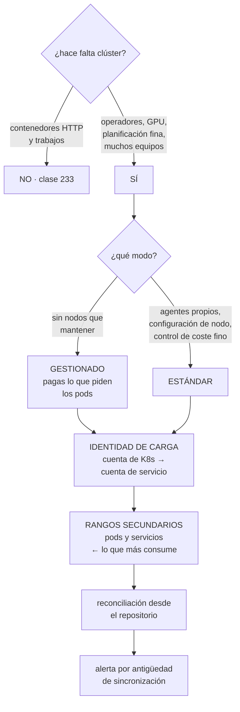

# 234 — GKE Autopilot, Workload Identity y Config Sync

> [← Clase anterior](../../part-19-gcp-production-architecture/233-cloud-run-functions-api-gateway-y-workflows/README.md) · [Índice de la parte](../README.md) · [Clase siguiente →](../../part-19-gcp-production-architecture/235-cloud-sql-spanner-firestore-y-bigtable/README.md)

**Parte:** 19 — Google Cloud: arquitectura de datos y operación en producción<br>
**Nivel:** avanzado · **Horas estimadas:** 4<br>
**Laboratorio:** `kubernetes` · **Estado:** `EXECUTABLE_CORE`

## 🎯 Propósito

Operar Kubernetes gestionado en Google Cloud, donde existe un modo que quita casi toda la operación de nodos y cambia la decisión de la clase 213: **si el motivo para no usar clúster era el coste de mantenerlo, ese motivo se reduce mucho**. La clase compara los dos modos con lo que cada uno permite y prohíbe, cubre la identidad de carga y el consumo de direcciones, y la reconciliación desde el repositorio con su alerta imprescindible.

## 📚 Resultados de aprendizaje

Al finalizar podrás:

1. **Elegir** entre el modo gestionado y el estándar con criterios.
2. **Decidir** si el clúster compensa frente al servicio de contenedores.
3. **Dar** identidad a las cargas sin claves, atada al espacio de nombres.
4. **Dimensionar** los rangos de direcciones que consume el clúster.
5. **Operar** con reconciliación, políticas y actualizaciones planificadas.

## 🧩 Conceptos centrales

| Concepto | Comprensión verificable |
|---|---|
| `modo gestionado` | El proveedor administra los nodos: se paga por lo que piden los pods y no hay conjunto que mantener. |
| `modo estándar` | Grupos de nodos administrados por el equipo. Más control y más trabajo. |
| `identidad de carga` | Vinculación entre una cuenta de servicio de Kubernetes y una de la nube, sin claves. |
| `rango secundario` | Rango de la subred del que salen las direcciones de pods y servicios. Es el que más consume. |
| `canal de versión` | Política de actualización automática del plano de control y de los nodos. |
| `sincronización de configuración` | Bucle gestionado que aplica el estado declarado en el repositorio y corrige la deriva. |

## 🧠 Modelo mental

Google Cloud combina una jerarquía estricta de recursos con una red global y servicios data-first; proyecto, cuota e IAM forman una unidad operativa.

Aplicado a esta clase, separa siempre cuatro planos: **intención** (qué necesita el usuario),
**configuración** (qué declaramos), **estado observado** (qué existe de verdad) y
**evidencia** (cómo sabemos que cumple). Confundirlos produce diseños que se ven correctos
en un diagrama pero fallan al operar.

## 🗺️ Flujo de razonamiento



## 📖 Desarrollo

### 1. Dos modos, y qué cambia cada uno

La decisión más importante al crear el clúster es el modo, y aquí hay uno que no existe en las otras nubes.

```text
MODO GESTIONADO
  no hay grupos de nodos que administrar
  se paga por CPU, memoria y disco que PIDEN los pods
  el proveedor decide y mantiene los nodos
  + sin parchear, sin escalar el conjunto, sin drenar
  + la petición de recursos es el contrato: si pides bien,
    pagas bien
  + configuración segura por defecto: política de red,
    nodos endurecidos, identidad de carga activada
                                                    ley 26
  − no se puede tocar el nodo: nada de agentes con acceso
    privilegiado ni configuraciones del sistema
  − menos control sobre el empaquetado
  − y ciertas capacidades quedan restringidas

MODO ESTÁNDAR
  grupos de nodos propios
  + control total: agentes, configuración, tipos de máquina
  + coste por unidad menor si el empaquetado es alto
  − hay que mantener el conjunto                  ley 23
  − y hay que activar a mano lo que el otro trae puesto
```

Y el efecto sobre la decisión de la clase 213:

```text
el motivo principal para NO usar clúster era el coste de
operarlo
  actualizaciones, complementos, nodos, parches
→ el modo gestionado reduce mucho ese coste
→ y por tanto la frontera se mueve: hay casos que antes no
  compensaban y ahora sí

lo que NO cambia
  sigue habiendo actualizaciones de versión
  siguen los complementos que se instalen a mano
  y sigue haciendo falta saber Kubernetes
```

Y el criterio actualizado:

```text
¿es un servicio HTTP o un trabajo?
  → servicio de contenedores; más simple  clase 233
¿hacen falta operadores, recursos propios o planificación
  fina?
  → clúster
¿hacen falta agentes con acceso al nodo o configuración del
  sistema?
  → clúster en modo estándar
¿ninguna de las dos?
  → clúster en modo gestionado
```

Y una advertencia de coste que sorprende:

```text
en el modo gestionado se paga lo que PIDEN los pods
→ una petición de recursos generosa «por si acaso» se paga
  entera, use lo que use
→ y por tanto las peticiones bien puestas dejan de ser
  buena práctica y pasan a ser una línea de la factura
                                                clase 213
```

### 2. Identidad y direcciones

**La identidad de carga** es el mecanismo estándar aquí y conviene que esté activada desde el principio.

```text
CÓMO FUNCIONA
  una cuenta de servicio de Kubernetes se anota con una
  cuenta de servicio de la nube
  el pod obtiene testigos de esa identidad
  → sin claves, sin secretos montados

Y EL ENLACE
  se concede a la cuenta de Kubernetes el permiso de
  suplantar la de la nube
  → atado a espacio de nombres Y nombre de la cuenta
  → el mismo error de las clases 218 y 222: si se ata solo
    al proyecto, cualquier cuenta de servicio del clúster
    la obtiene

Y LO QUE HAY QUE DESACTIVAR
  el acceso de los pods al servicio de metadatos del nodo
  → si no, obtienen la identidad del NODO, que suele tener
    más permisos
  → en el modo gestionado viene desactivado; en el estándar,
    hay que hacerlo                                ley 26
```

Y la prueba obligatoria:

```text
desde un pod de otro espacio de nombres, intentar obtener
la identidad
→ debe fallar
y desde un pod, leer las credenciales del nodo
→ debe estar bloqueado                            ley 22
```

**Las direcciones**, que es la decisión que más consume:

```text
LOS TRES RANGOS
  nodos          del rango principal de la subred
  PODS           de un rango secundario
  SERVICIOS      de otro rango secundario

EL CÁLCULO
  el rango de pods se dimensiona por
    nodos máximos × pods por nodo × factor de reserva
  → y el factor no es 1: se reservan bloques por nodo
  → un clúster de 100 nodos con 110 pods por nodo puede
    necesitar un /17

Y LA TRAMPA
  el número de pods por nodo se fija al crear
  y el rango de pods NO se puede cambiar sin recrear
  → es la misma decisión irreversible de la clase 222
                                                    ley 14
```

Y las opciones que reducen el consumo:

```text
reducir los pods por nodo, si no hacen falta 110
usar rangos no enrutables para pods, donde el modelo lo
  permita                                     clase 193
y reutilizar rangos secundarios entre clústeres, donde
  esté soportado

→ y en cualquier caso, calcularlo ANTES, con el plan de
  direcciones delante
```

Y el uso de red compartida:

```text
el clúster vive en un proyecto de servicio y usa subredes
de la red compartida                          clase 229
→ los rangos secundarios los cede el proyecto anfitrión
→ y por tanto los pide plataforma, no el equipo
```

### 3. Operar desde el repositorio

La reconciliación es la misma idea de las clases 213 y 222, con una variante gestionada.

```text
SINCRONIZACIÓN DE CONFIGURACIÓN GESTIONADA
  un componente del proveedor aplica lo declarado en el
  repositorio y corrige la deriva
  + menos que operar
  + con políticas de admisión integradas
  − menos control sobre versiones y extensiones

O UN CONTROLADOR PROPIO
  + control total y portable
  − hay que operarlo                            ley 23
```

Y la alerta que no puede faltar, por tercera vez:

```text
«la sincronización lleva N minutos sin completarse»
o «el estado real difiere del declarado desde hace N»
→ un bucle parado no da error: deja de aplicar    ley 13
→ y en la clase 179 esa prueba negativa falló porque la
  alerta iba a un canal sin nadie
```

**Las políticas de admisión**, que aquí se integran con el gobierno:

```text
lo que hay que impedir
  imágenes que no vengan del registro propio
  imágenes sin firmar                          clase 106
  contenedores con privilegios o con red del anfitrión
  recursos sin peticiones ni límites          clase 213
  y recursos sin etiquetas obligatorias       clase 239

y la disciplina
  modo de aviso primero, con medición
  mensajes que digan qué falta y cómo arreglarlo
  y el carril fácil que cumpla solo             ley 16
```

Y la política de red, con la diferencia entre modos:

```text
en el modo gestionado viene activada
en el estándar hay que activarla, y por defecto todos los
pods hablan con todos                    ley 26, clase 222
→ denegación por defecto entre espacios de nombres, y
  reglas explícitas
```

**Las actualizaciones**, con lo que cambia aquí:

```text
CANALES DE VERSIÓN
  rápido · regular · estable
  → el plano de control y los nodos se actualizan solos
    dentro del canal
  → con VENTANAS Y EXCLUSIONES de mantenimiento declaradas

Y ESO CAMBIA EL TRABAJO
  no hay que planificar cada actualización menor
  → pero SÍ hay que comprobar antes las interfaces
    retiradas y los complementos           clase 213
  → y las exclusiones evitan que ocurra en campaña

LO QUE SIGUE SIENDO MANUAL
  las versiones mayores
  los complementos instalados a mano
  y los operadores propios
```

Y una comprobación que hay que tener:

```text
el aviso de interfaces retiradas: la plataforma detecta
manifiestos que usan API que van a desaparecer
→ conviene revisarlo antes de cada canal, no después
→ y añadirlo a la canalización              clase 232
```

### 4. Coste, entrada y comprobaciones

**El coste**, con las palancas de cada modo:

```text
MODO GESTIONADO
  se paga lo pedido por los pods
  palancas
    peticiones ajustadas al p95 real         clase 213
    clases de cómputo adecuadas a la carga
    y pods de baja prioridad para lotes tolerantes
  → y no hay empaquetado que optimizar: eso lo hace el
    proveedor

MODO ESTÁNDAR
  se pagan los nodos
  palancas
    empaquetado alto
    autoescalado de nodos bien configurado
    tipos de máquina adecuados
    capacidad interrumpible para lotes
    y compromisos de uso                     clase 239

Y EN AMBOS
  el clúster tiene un coste fijo de plano de control
  → varios clústeres pequeños cuestan más que uno con
    espacios de nombres separados
  → salvo que el aislamiento lo justifique      clase 213
```

**La entrada**, con las opciones:

```text
BALANCEADOR GLOBAL como entrada del clúster
  + una dirección para varias regiones      clase 231
  + certificados gestionados y caché en el borde
  + filtrado de aplicación delante

CONTROLADOR DE ENTRADA PROPIO
  + control y portabilidad                  clase 158
  − hay que operarlo

Y LA PUERTA DE ENLACE declarativa
  el modelo más nuevo, con separación entre quien opera la
  entrada y quien declara las rutas
  → encaja con la separación de la clase 229
```

Y las comprobaciones de esta clase:

```text
☐ obtener la identidad desde otro espacio de nombres
  → debe fallar
☐ leer credenciales del nodo desde un pod
  → debe estar bloqueado
☐ desplegar una imagen de un registro ajeno
  → debe rechazarse
☐ desplegar un pod sin peticiones de recursos
  → debe rechazarse
☐ desplegar un pod con privilegios
  → debe rechazarse
☐ hablar entre dos espacios de nombres no permitidos
  → debe fallar
☐ parar la sincronización y esperar la alerta
☐ perder una zona y comprobar el reparto de réplicas
                                                clase 227
```

Y la lista de comprobación de la clase:

```text
☐ la decisión de usar clúster está justificada frente al
  servicio de contenedores
☐ el modo elegido corresponde a lo que hace falta
☐ la identidad de carga está activada y atada a espacio de
  nombres y cuenta
☐ el acceso al servicio de metadatos está bloqueado
☐ los rangos secundarios se calcularon antes de crear
☐ los pods por nodo están ajustados a lo necesario
☐ el clúster usa la red compartida
☐ la política de red está activada, con denegación por
  defecto
☐ hay políticas de admisión con mensajes útiles
☐ la reconciliación está montada, con alerta por antigüedad
☐ el canal de versión y las ventanas están decididos
☐ se revisan las interfaces retiradas antes de actualizar
☐ las peticiones de recursos están medidas, no copiadas
☐ las réplicas se reparten entre zonas
```

Y el cierre que enlaza con la clase siguiente: con el cómputo resuelto, quedan los datos, que en esta nube ofrecen una familia amplia y una base distribuida con una propiedad que no tiene equivalente. Es la materia de la clase 235.

## 🔬 Ejemplo trabajado

**CloudShop revisa su uso de Kubernetes en Google Cloud. Lo que sigue es la decisión de modo que cambió respecto a la de la clase 222, el cálculo de direcciones que evitó recrear el clúster, y el ahorro de ajustar las peticiones de recursos.**

**La decisión de modo:**

```text
lo que se necesitaba
  2 cargas con GPU del equipo de datos
  un operador de base vectorial
  trabajos por lotes con prioridades
  el buscador, con imagen propia

lo que NO se necesitaba
  agentes con acceso privilegiado al nodo
  configuración del sistema operativo
  tipos de máquina exóticos

→ modo GESTIONADO para todo salvo las cargas con GPU
→ y un grupo de nodos estándar aparte para esas
  (el modo gestionado las soporta con restricciones que no
   encajaban con el operador que usaban)

y la comparación de esfuerzo, frente al clúster de Azure
  actualizaciones al año            3 planificadas → 1
  mantenimiento de complementos     18 días/año → 4
  soporte a equipos                 44 días/año → 38
  incidentes de plataforma          11 días/año → 3
  ───────────────────────────────────────────────────
  total                             82 días/año → 46
                                    0,4 → 0,22 personas
```

Y la observación que el equipo registró:

```text
el modo gestionado reduce a la mitad el coste de operación
→ y eso mueve la frontera de la clase 213: hay dos cargas
  que se habían quedado fuera del clúster por el coste de
  operarlo y que ahora entrarían
→ decisión: no moverlas de todos modos; funcionan donde
  están                                       clase 216
```

**El cálculo de direcciones, hecho antes de crear.**

```text
el equipo iba a aceptar los valores por defecto
  pods por nodo                                    110
  rango de pods sugerido                          /14

el cálculo real
  nodos máximos previstos                           38
  pods por nodo REALES observados en el clúster de
    Azure                                       máx. 31
  → 110 era el valor por defecto y no correspondía a nada

  con 32 pods por nodo
    rango de pods necesario                       /19
    rango de servicios                            /22

  frente a
  con 110 pods por nodo
    rango de pods                                 /17

→ y el plan de direcciones asignaba /18 por proyecto
→ con el valor por defecto, el clúster se habría comido
  todo el proyecto y habría bloqueado el crecimiento

y la decisión irreversible
  el número de pods por nodo se fija al crear
  → cambiarlo exige recrear el clúster           ley 14
```

**La identidad, y la prueba que falló.**

```text
identidad de carga activada
7 cuentas de servicio de la nube, una por carga
enlace atado a espacio de nombres y nombre de cuenta

pruebas negativas
  ✓  pod de «datos» pidiendo la identidad de «buscador»
                                                denegado
  ✓  pod leyendo credenciales del nodo          bloqueado
  ✗  el operador de base vectorial
     → su enlace se había creado atado solo al proyecto
     → cualquier cuenta de servicio del clúster podía
       obtener esa identidad
     → y esa identidad tenía permisos de escritura en el
       conjunto de datos vectoriales
     → corregido

→ y es el mismo fallo que en la clase 222, con el mismo
  componente: el que se instala a mano y no pasa por la
  plantilla                                clase 229, ley 27
```

**Las peticiones de recursos, y el ahorro.**

```text
en el modo gestionado se paga lo PEDIDO

las peticiones estaban copiadas del clúster anterior
  carga             pedido        uso p95 real
  buscador          2 CPU / 4 Gi   0,7 CPU / 2,1 Gi
  indexador         4 CPU / 8 Gi   2,9 CPU / 5,8 Gi
  operador vect.    1 CPU / 2 Gi   0,1 CPU / 0,6 Gi
  api interna       1 CPU / 2 Gi   0,2 CPU / 0,9 Gi
  trabajos lote     2 CPU / 4 Gi   1,8 CPU / 3,6 Gi

ajuste a p95 con margen del 25 %
  buscador          0,9 CPU / 2,7 Gi
  indexador         3,6 CPU / 7,3 Gi
  operador vect.    0,2 CPU / 0,8 Gi
  api interna       0,3 CPU / 1,2 Gi
  trabajos lote     2,3 CPU / 4,5 Gi

coste del clúster gestionado      3.400 € → 1.640 €/mes

→ y aquí el ajuste de peticiones no es higiene: es
  directamente la factura                       clase 213
```

Y un efecto que no se buscaba:

```text
al bajar las peticiones, más pods caben por nodo
→ y el proveedor usa menos nodos
→ pero como se paga por lo pedido, el ahorro es directo y
  no depende del empaquetado
```

**La reconciliación y las políticas:**

```text
sincronización gestionada desde el repositorio
  con alerta de antigüedad, a canal con guardia
  → y probada parándola: alerta en 4 minutos    ley 22

políticas de admisión, en modo aviso 3 semanas
  incumplimientos medidos
    imágenes de registros ajenos                    41
      → 38 eran imágenes públicas de herramientas
      → se copiaron al registro propio y se firmaron
    pods sin peticiones de recursos                 62
      → todos, de un equipo que desplegaba a mano
    contenedores con privilegios                     4
      → 3 legítimos (agentes de red), 1 innecesario
    sin etiquetas obligatorias                      88

tras corregir, modo bloqueo
  rechazos en el primer mes                          6
  todos, incumplimientos reales
  tiquetes de soporte                                0
  → porque el mensaje decía qué faltaba      clase 217
```

**Las actualizaciones, con el canal:**

```text
canal          regular
ventanas       martes y jueves, 02:00-06:00
exclusiones    del 15 de noviembre al 5 de enero (campaña)
               y las 2 semanas de cierre trimestral

en 12 meses
  actualizaciones automáticas aplicadas             9
  que causaron incidencia                           0
  actualizaciones mayores planificadas              1
    con revisión previa de interfaces retiradas
    → 11 manifiestos corregidos antes
  duración de la mayor                            2 h
```

**El resultado:**

```text                                        antes     después
coste del clúster                         3.400 €     1.640 €
direcciones consumidas por pods            8.192       2.048
  (con el valor por defecto)
capacidad de equipo dedicada           0,4 pers.   0,22 pers.
actualizaciones planificadas al año            3           1
enlaces de identidad mal atados                1           0
pods sin peticiones de recursos               62           0
imágenes de registros ajenos                  41           0
```

**La lección que esta clase deja**: el modo gestionado **redujo a la mitad el coste de operar el clúster**, lo que mueve la frontera de cuándo compensa usarlo. El valor por defecto de ciento diez pods por nodo no correspondía a nada —el uso real era treinta y uno— y aceptarlo habría consumido el proyecto entero de direcciones **de forma irreversible**. Y el único fallo de identidad estaba, otra vez, en el componente instalado a mano: el que no pasa por la plantilla.

## 🧪 Laboratorio guiado

Ejecuta desde la raíz:

```bash
python classes/part-19-gcp-production-architecture/234-gke-autopilot-workload-identity-y-config-sync/lab.py
```

El laboratorio selecciona el motor de práctica **`kubernetes`** y produce
`lab_result.json`. El escenario, sus comprobaciones y el artefacto esperado corresponden a
esta clase; no requiere credenciales y deja explícito qué debe revalidarse en un sandbox real.

1. Lee `exercise.steps` y formula una predicción antes de ejecutar.
2. Ejecuta la práctica y verifica todos los elementos de `checks`.
3. Provoca el caso de `negative_test` y explica la señal observada.
4. Materializa `gcp-gke-platform` en `evidence/` usando la plantilla indicada.
5. Para proveedor real, sigue `sandbox.requires`, registra costo y ejecuta `destroy`.

### Evidencia esperada

El artefacto principal es manifiestos declarativos con estado observado. Además, la entrega debe incluir el comando ejecutado,
la salida estructurada y una conclusión que no exceda lo observado.

## 🏆 Reto verificable

Construye **`gcp-gke-platform`** para el caso CloudShop. Incluye una alternativa descartada,
un supuesto que pueda falsarse, una prueba de fallo y una decisión de rollback.

## ✅ Criterio de aceptación

- [ ] `lab.py` termina con código 0 y genera JSON válido.
- [ ] La entrega conecta al menos tres requisitos con mecanismos verificables.
- [ ] Existe una prueba positiva y una prueba negativa con evidencia.
- [ ] Seguridad, costo y operación aparecen como decisiones, no como anexos.
- [ ] Se declara una limitación y una condición que obligaría a revisar el diseño.
- [ ] Otra persona puede repetir el recorrido sin conocimiento tácito.

## ⚠️ Errores frecuentes

| Síntoma | Causa probable | Corrección |
|---|---|---|
| El clúster consume el rango de direcciones del proyecto entero | Se aceptó el valor por defecto de pods por nodo sin medir el uso real | Calcula nodos por pods reales antes de crear; el valor se fija al crear y cambiarlo exige recrear el clúster. |
| La factura del clúster gestionado es alta pese a poco uso | Se paga lo que piden los pods y las peticiones estaban copiadas | Ajusta las peticiones al p95 real con margen; aquí es directamente la factura, no higiene. |
| Cualquier cuenta de servicio del clúster obtiene una identidad privilegiada | El enlace de identidad se ató solo al proyecto | Ata a espacio de nombres y nombre de cuenta, y compruébalo desde un pod de otro espacio. |
| Los pods obtienen permisos que no les corresponden | Pueden alcanzar el servicio de metadatos del nodo | Bloquéalo; en modo gestionado viene bloqueado, en estándar hay que hacerlo. |
| Los cambios del repositorio dejan de aplicarse sin aviso | El bucle de sincronización se detuvo en silencio | Alerta por antigüedad de la sincronización, con destino a guardia, y pruébala parándola. |
| Una actualización automática ocurre en plena campaña | No hay exclusiones de mantenimiento declaradas | Declara ventanas y exclusiones para los periodos críticos, y revisa las interfaces retiradas antes de cambiar de canal. |

## 🛡️ Seguridad, ética y costo

Trabaja con cuentas propias o sandboxes autorizados. No publiques secretos, identificadores
reales ni datos personales. Antes de crear recursos pagos define presupuesto, etiquetas y
comando de destrucción; después verifica que no queden recursos huérfanos. Los ejemplos
locales enseñan contratos, pero no certifican cumplimiento ni disponibilidad de producción.

## ❓ Preguntas de comprobación

1. ¿Qué permite y qué prohíbe el modo gestionado, y cómo cambia la decisión de usar clúster?
2. ¿Por qué las peticiones de recursos son directamente la factura en modo gestionado?
3. ¿Qué rangos consume un clúster y cuál es la decisión irreversible?
4. ¿A qué debe atarse el enlace de identidad de carga?
5. ¿Qué sigue siendo manual pese a tener canal de versión?

## 🔗 Referencias

- Google Cloud (2025). *GKE Autopilot overview*. <https://cloud.google.com/kubernetes-engine/docs/concepts/autopilot-overview>
- Google Cloud (2025). *Workload Identity Federation for GKE*. <https://cloud.google.com/kubernetes-engine/docs/concepts/workload-identity>
- Google Cloud (2025). *IP address planning for GKE clusters*. <https://cloud.google.com/kubernetes-engine/docs/concepts/alias-ips>
- Google Cloud (2025). *Config Sync and Policy Controller*. <https://cloud.google.com/kubernetes-engine/enterprise/config-sync/docs/overview>
- Google Cloud (2025). *GKE release channels and maintenance windows*. <https://cloud.google.com/kubernetes-engine/docs/concepts/release-channels>
- Documentación oficial vigente del servicio implementado; registra URL y fecha de consulta.

---

> [Evaluación](assessment.md) · [Contrato de clase](lesson.yaml) · [Índice de la parte](../README.md)
