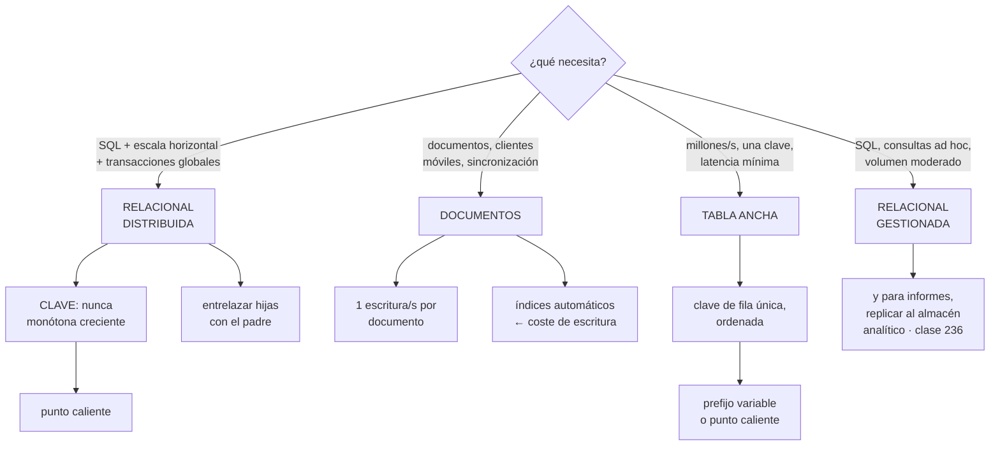

# 235 — Cloud SQL, Spanner, Firestore y Bigtable

> [← 234 · GKE Autopilot, Workload Identity y Config Sync](../../part-19-gcp-production-architecture/234-gke-autopilot-workload-identity-y-config-sync/README.md) · [Índice de la parte](../README.md) · [236 · BigQuery, Dataflow, Dataproc y gobernanza de datos →](../../part-19-gcp-production-architecture/236-bigquery-dataflow-dataproc-y-gobernanza-de-datos/README.md)

**Parte:** 19 — Google Cloud: arquitectura de datos y operación en producción<br>
**Nivel:** avanzado · **Horas estimadas:** 4<br>
**Laboratorio:** `data` · **Estado:** `EXECUTABLE_CORE`

## 🎯 Propósito

Elegir el almacén de datos en Google Cloud, donde hay cuatro familias con propósitos claramente distintos y una que no tiene equivalente en las otras nubes: **una base relacional que escala horizontalmente y da consistencia fuerte global, a cambio de un coste y unas reglas de modelado propias**. La clase da el criterio de elección, las decisiones que no se pueden cambiar en cada una, y la advertencia de siempre sobre la clave.

## 📚 Resultados de aprendizaje

Al finalizar podrás:

1. **Elegir** entre las cuatro familias con criterios comprobables.
2. **Modelar** para la base distribuida evitando los puntos calientes.
3. **Decidir** si la consistencia fuerte global compensa su coste.
4. **Dimensionar** capacidad y detectar el estrangulamiento.
5. **Combinar** el camino operativo con el analítico sin forzar ninguno.

## 🧩 Conceptos centrales

| Concepto | Comprensión verificable |
|---|---|
| `base relacional gestionada` | Motor tradicional gestionado. Escala vertical, transacciones y consultas ad hoc. |
| `base relacional distribuida` | Escala horizontal con transacciones y consistencia fuerte global. Con reglas de modelado propias. |
| `base de documentos` | Almacén sin esquema con sincronización a clientes. Cómoda y con límites de escritura por documento. |
| `base de tabla ancha` | Almacén de altísimo volumen y baja latencia, con una sola clave ordenada. |
| `punto caliente` | Clave que concentra escrituras contiguas. En estas familias, la causa principal de mala escala. |
| `entrelazado` | Colocación física de filas hijas junto a su padre, para que la transacción no cruce servidores. |

## 🧠 Modelo mental

Google Cloud combina una jerarquía estricta de recursos con una red global y servicios data-first; proyecto, cuota e IAM forman una unidad operativa.

Aplicado a esta clase, separa siempre cuatro planos: **intención** (qué necesita el usuario),
**configuración** (qué declaramos), **estado observado** (qué existe de verdad) y
**evidencia** (cómo sabemos que cumple). Confundirlos produce diseños que se ven correctos
en un diagrama pero fallan al operar.

## 🗺️ Flujo de razonamiento



## 📖 Desarrollo

### 1. Cuatro familias, cuatro propósitos

Aquí las familias están más diferenciadas que en las otras nubes, y elegir mal se paga pronto.

```text
RELACIONAL GESTIONADA
  motor tradicional, gestionado
  + SQL completo, transacciones, consultas ad hoc
  + migración desde lo heredado casi directa
  − escala vertical con techo
  − y las conexiones son un recurso limitado  clase 233
  para   la mayoría de los sistemas de tamaño normal

RELACIONAL DISTRIBUIDA
  escala horizontal CON transacciones y consistencia fuerte
  global
  + no hay que elegir entre SQL y escala
  + disponibilidad muy alta y multirregión real
  − coste base alto: hay un mínimo de capacidad
  − reglas de modelado propias, y la clave manda
  para   volúmenes que una relacional no aguanta, o cuando
         se necesita consistencia fuerte entre regiones

DOCUMENTOS
  almacén sin esquema, con sincronización a clientes
  + cómodo, con consultas por campo y tiempo real
  + integración directa con aplicaciones móviles
  − límite de escrituras por documento
  − índices automáticos que se pagan en cada escritura
  para   perfiles, catálogos, estado de aplicaciones
         cliente

TABLA ANCHA
  altísimo volumen, latencia de milisegundos, una sola
  clave ordenada
  + escala a petabytes con latencia estable
  − sin consultas por otros campos: solo por la clave
  − coste base alto (nodos)
  para   series temporales, telemetría, perfiles de
         usuario a gran escala
```

Y el criterio, en preguntas:

```text
¿el volumen cabe en una máquina grande y crecerá poco?
  → relacional gestionada; y no compliques

¿hace falta SQL y no cabe, o hace falta consistencia
 fuerte entre regiones?
  → relacional distribuida, midiendo el coste base

¿es estado de aplicación cliente con sincronización?
  → documentos

¿son millones de escrituras por segundo con una clave
 conocida?
  → tabla ancha

¿son informes y exploración?
  → ninguna de las cuatro: almacén analítico  clase 236
```

Y la advertencia de coste que decide muchas elecciones:

```text
la relacional distribuida y la de tabla ancha tienen COSTE
BASE ALTO
  hay un mínimo de capacidad que se paga aunque no se use
→ para volúmenes pequeños salen mucho más caras
→ y por eso «empezar por la que escala» suele ser un error
  de coste                                    clase 216
```

### 2. La clave, otra vez

En las tres familias distribuidas, el error de diseño es el mismo y tiene el mismo nombre: **la clave que concentra**.

```text
EL PROBLEMA
  estas bases reparten los datos por RANGOS de clave
  → claves contiguas van al mismo servidor
  → y una clave que crece de forma monótona hace que TODAS
    las escrituras nuevas caigan en el mismo sitio

LAS CLAVES QUE PRODUCEN PUNTOS CALIENTES
  identificador autoincremental
  marca de tiempo como primer componente
  y cualquier secuencia ordenada

→ y es distinto del problema de la clase 208: allí la clave
  se distribuía por resumen y el problema era la
  concentración de TRÁFICO; aquí el problema es el ORDEN
```

Y las soluciones:

```text
IDENTIFICADOR ALEATORIO
  el más simple y el que mejor reparte
  − se pierde el orden natural de inserción

INVERTIR LOS BITS de un valor creciente
  reparte y conserva unicidad

PREFIJO CALCULADO
  un valor derivado del resto de la clave, como primer
  componente
  → reparte, y sigue permitiendo consultas por el resto si
    se recorre cada prefijo

CLAVE COMPUESTA con algo que reparta primero
  cliente + fecha, en vez de fecha + cliente
  → y sirve para las consultas por cliente        clase 208
```

**El entrelazado**, que es propio de la relacional distribuida:

```text
las filas hijas se colocan FÍSICAMENTE junto a su padre
  pedido y sus líneas, juntos
→ leer un pedido con sus líneas es una sola lectura local
→ y la transacción no cruza servidores

y sin entrelazar
  la transacción coordina entre servidores
  → latencia mucho mayor y más conflictos

→ es la decisión de modelado que más cambia el rendimiento
→ y hay que tomarla al crear la tabla
```

Y las transacciones, con lo que hay que saber:

```text
la relacional distribuida da transacciones globales con
consistencia fuerte
  → y eso cuesta coordinación

las de SOLO LECTURA no bloquean y son mucho más baratas
  → declararlas como tales, siempre

y las de lectura con obsolescencia acotada
  «lee de hace 10 segundos»
  → sirven la mayoría de las consultas y evitan la
    coordinación                              clase 223

→ y la mayoría de los sistemas que usan transacciones
  fuertes para todo están pagando coordinación que no
  necesitan                                        ley 26
```

### 3. Capacidad, límites y coste

**La relacional distribuida** se dimensiona por unidades de proceso.

```text
LA CAPACIDAD
  se mide en unidades; hay un mínimo por instancia
  y cada unidad da un tope de almacenamiento y de caudal

  → y la regla operativa
    mantener la utilización de CPU por debajo del 65 % en
    una región y del 45 % en multirregión
    → por encima, la latencia se dispara     clase 186

EL ESTRANGULAMIENTO
  se manifiesta como latencia alta y transacciones
  abortadas
  → y las abortadas hay que reintentar, lo que empeora
  → la señal directa es la CPU y la de operaciones por
    servidor

Y LAS ESTADÍSTICAS DE ACCESO
  la plataforma indica qué rangos de clave concentran
  → es la herramienta que encuentra el punto caliente
  → y hay que mirarla, no suponer               ley 15
```

**La base de documentos**, con sus límites característicos:

```text
UNA ESCRITURA POR SEGUNDO Y DOCUMENTO
  → un contador global en un documento no funciona
  → hay que repartirlo en varios y sumar al leer

ÍNDICES AUTOMÁTICOS
  por defecto se indexa cada campo
  → cada escritura paga por todos            clase 223
  → y hay que EXCLUIR lo que no se consulta

CONSULTAS LIMITADAS
  no hay uniones ni agregaciones complejas
  → y las consultas compuestas exigen índices declarados

Y LAS REGLAS DE SEGURIDAD
  si los clientes acceden directamente, las reglas son el
  control de acceso
  → y una regla mal escrita expone todo
  → se prueban con el simulador, siempre        ley 22
```

**La tabla ancha**, con lo suyo:

```text
UNA SOLA CLAVE, ORDENADA
  las consultas son por clave o por rango de claves
  → no hay índices secundarios
  → el diseño de la clave ES el diseño

GRUPOS DE COLUMNAS
  separar lo que se lee junto
  → leer un grupo no trae los demás

CADUCIDAD POR CELDA
  las versiones antiguas se retiran solas
  → imprescindible en series temporales

Y EL COSTE
  por nodo y por almacenamiento
  → con un mínimo por instancia
```

Y la decisión de continuidad, que aquí es sencilla y cara:

```text
la relacional distribuida en configuración multirregión da
consistencia fuerte y disponibilidad muy alta
  → y cuesta del orden del triple

y la relacional gestionada
  réplicas de lectura, y conmutación con su plazo medido
                                                clase 215
```

### 4. Combinar operativo y analítico

El patrón que este programa repite desde la clase 150 aquí es especialmente directo.

```text
LO OPERATIVO en la familia que corresponda
LO ANALÍTICO en el almacén de análisis      clase 236

y la conexión
  flujo de cambios hacia el almacén analítico
  o consulta federada desde el almacén hacia la base
  o réplica gestionada, donde exista

→ y ninguna de las cuatro familias se fuerza para hacer
  informes
```

Y las tres cosas que hay que decidir al montarlo:

```text
¿CUÁNTO RETRASO SE ACEPTA?
  segundos, minutos u horas
  → y hay que declararlo y vigilarlo            ley 13

¿QUÉ DATOS NO CRUZAN?
  los personales completos, seudonimizados o excluidos
                                          clases 230, 239

¿QUIÉN ES EL ESCRITOR?
  el almacén analítico es de solo lectura desde el punto de
  vista del negocio
  → si alguien escribe ahí y luego vuelve al operativo, hay
    dos escritores                                ley 21
```

**El caché**, que en muchos sistemas es lo que evita cambiar de familia:

```text
un caché en memoria delante de la relacional gestionada
resuelve la mayoría de los problemas de lectura
  → y es mucho más barato que migrar a una distribuida
  → con las cautelas de la clase 111: el caché portante y
    la avalancha

→ antes de cambiar de familia por rendimiento de lectura,
  medir qué resuelve un caché
```

Y las comprobaciones de esta clase:

```text
☐ escribir 10.000 filas con clave secuencial y observar el
  reparto
☐ consultar las estadísticas de acceso y comprobar que no
  hay rango caliente
☐ ejecutar una transacción que cruce servidores y medir
☐ escribir el mismo documento 10 veces por segundo
☐ probar las reglas de acceso con el simulador
☐ conmutar la base y cronometrar               clase 215
☐ y comprobar el retraso del flujo hacia lo analítico
```

Y la lista de comprobación de la clase:

```text
☐ la familia elegida corresponde a los patrones y al
  volumen
☐ se comparó el coste base antes de elegir una que escala
☐ la clave no es monótona creciente
☐ las tablas hijas están entrelazadas donde procede
☐ las lecturas usan transacciones de solo lectura
☐ se usa obsolescencia acotada donde basta
☐ la utilización se mantiene por debajo del umbral
☐ se revisan las estadísticas de acceso por rango
☐ en documentos, los índices automáticos están recortados
☐ ningún documento recibe más de una escritura por segundo
☐ las reglas de acceso se han probado con el simulador
☐ lo analítico va a su almacén, con retraso declarado
☐ el almacén analítico no es escritor de nada operativo
```

Y el cierre que enlaza con la clase siguiente: con los datos operativos resueltos, queda la plataforma analítica, que en esta nube es la pieza más madura y la que más problemas de gobierno y de coste produce. Es la materia de la clase 236.

## 🔬 Ejemplo trabajado

**CloudShop elige sus almacenes en Google Cloud. Lo que sigue es la decisión que evitó pagar una base distribuida sin necesitarla, el punto caliente que apareció igualmente en otra tabla, y el contador de un documento que no escalaba.**

**La elección, carga por carga:**

```text
carga            volumen            elección
pedidos          41 M filas,        relacional gestionada
                 900 escrituras/s
catálogo         4,1 M productos    relacional gestionada
sesiones         2 M activas,       documentos
                 sincronización
                 con la app
telemetría de    41.000 eventos/s   tabla ancha
  la web
inventario       120 M filas,       RELACIONAL DISTRIBUIDA
  global         consistencia
                 fuerte entre 2
                 regiones
informes         —                  almacén analítico
                                    clase 236
```

**La decisión que se evitó:**

```text
la propuesta inicial ponía CUANTO existe en la relacional
distribuida
motivo   «escala, y así no hay que migrar nunca»

el cálculo de coste
  mínimo de capacidad por instancia
  pedidos                        ~1.900 €/mes
  catálogo                       ~1.900 €/mes
  inventario                     ~2.400 €/mes
  ─────────────────────────────────────────
  total                          ~6.200 €/mes

frente a
  pedidos y catálogo en relacional gestionada
                                    920 €/mes
  inventario en distribuida       2.400 €/mes
  ─────────────────────────────────────────
  total                           3.320 €/mes

→ y pedidos con 41 M de filas y 900 escrituras/s cabe
  holgadamente en una relacional gestionada
→ ahorro                          2.880 €/mes
```

Y el criterio que se registró:

```text
«se usa la relacional distribuida solo donde se necesita
 consistencia fuerte entre regiones o el volumen no cabe»
qué la reabriría   si pedidos supera las 4.000
                   escrituras/s sostenidas o los 500 M de
                   filas                       clase 190
```

**El punto caliente del inventario.**

```text
el modelo inicial
  tabla inventario, clave primaria: identificador
  autoincremental
  motivo   «como en la base relacional de siempre»

lo que pasó en la prueba de carga
  a partir de 1.200 escrituras/s
    latencia p99                    de 12 ms a 890 ms
    transacciones abortadas         14 %
    CPU media de la instancia       31 %   ← engañosa

  las estadísticas de acceso por rango decían
    el 96 % de las escrituras caían en el ÚLTIMO rango
    → todas las claves nuevas eran contiguas
    → un solo servidor las atendía

corrección
  clave primaria: identificador aleatorio
  y para las consultas por producto y almacén, clave
  compuesta (producto, almacén) que reparte por producto

resultado
  latencia p99 a 1.200 escrituras/s     890 ms → 14 ms
  transacciones abortadas                  14 % → 0,2 %
  caudal máximo probado                 1.200 → 9.400/s
```

Y el entrelazado, que faltaba:

```text
las tablas de movimientos de inventario no estaban
entrelazadas con la de inventario
  → cada transacción de ajuste coordinaba entre servidores
  → latencia de la transacción            48 ms

con movimientos entrelazados bajo inventario
  → la transacción es local
  → latencia                              9 ms

→ y esta decisión se toma AL CREAR la tabla; cambiarla
  exige recrear y migrar               ley 14
```

**El contador del documento.**

```text
la aplicación móvil mantenía un contador de artículos en
el carrito, en un documento por usuario
  → funcionaba

y para el panel de operaciones se añadió un contador
GLOBAL de carritos activos, en un solo documento

  síntoma   en campaña, el contador se quedaba atrás y
            aparecían errores de contención
  causa     un documento admite del orden de una escritura
            por segundo sostenida
            y había hasta 340 modificaciones por segundo

corrección
  el contador se reparte en 100 documentos
  cada escritura elige uno al azar
  el panel suma los 100 al leer

  → y para el panel, un valor agregado cada 30 s desde el
    almacén analítico habría bastado y habría sido más
    barato                                    clase 236
  → se hizo así al final
```

Y los índices, recortados:

```text
los documentos de sesión tenían 34 campos
indexados automáticamente                        34
consultados                                       4

tras excluir los 30 no consultados
  coste de escritura por documento        -71 %
  coste mensual de documentos      1.240 € → 380 €
```

**Las reglas de acceso, probadas:**

```text
la aplicación móvil accede directamente a los documentos
de sesión
→ las reglas son el control de acceso, no hay servidor en
  medio

el simulador de reglas, con 12 casos
  ✓  usuario lee su propio documento
  ✓  usuario escribe su propio documento
  ✗  usuario lee el documento de OTRO usuario
     → la regla comparaba el identificador del documento,
       no el del usuario autenticado
     → cualquiera con un identificador podía leer
  ✓  usuario sin autenticar                     denegado
  ✗  usuario escribe un campo que no debería
     → la regla no validaba qué campos se modifican
  ✓  el resto                                   correcto

→ 2 de 12, y las dos exponían datos de otros usuarios
→ y sin el simulador no se habrían visto hasta que alguien
  las probara                                     ley 22
```

**La telemetría en tabla ancha:**

```text
clave de fila   invertida(marca de tiempo) + sesión
  → el componente invertido reparte; sin él, todas las
    escrituras nuevas caerían juntas

grupos de columnas
  «evento» y «contexto» separados
  → el proceso en tiempo real lee solo «evento»

caducidad por celda                           30 días
  → y el histórico va al almacén analítico  clase 236

coste                                       610 €/mes
  frente a 3.900 € estimados con el bus de mensajes
                                                clase 224
```

**El resultado:**

```text                                        antes     después
coste mensual de datos                    6.200 €     3.320 €
  (según la propuesta inicial)
latencia p99 del inventario                890 ms       14 ms
caudal máximo del inventario            1.200/s      9.400/s
transacciones abortadas                     14 %       0,2 %
coste de documentos                       1.240 €       380 €
reglas de acceso con fallos                 2/12         0/12
contadores con contención                      1           0
```

**La lección que esta clase deja**: la propuesta de poner todo en la base que escala **habría costado casi el doble** sin resolver ningún problema, porque el coste base de esas familias es alto y la mayoría de las cargas cabían en una relacional normal. Y el punto caliente apareció donde siempre: **una clave autoincremental trasladada de la base relacional**, que en un almacén repartido por rangos concentra el noventa y seis por ciento de las escrituras en un solo servidor.

## 🧪 Laboratorio guiado

Ejecuta desde la raíz:

```bash
python classes/part-19-gcp-production-architecture/235-cloud-sql-spanner-firestore-y-bigtable/lab.py
```

El laboratorio selecciona el motor de práctica **`data`** y produce
`lab_result.json`. El escenario, sus comprobaciones y el artefacto esperado corresponden a
esta clase; no requiere credenciales y deja explícito qué debe revalidarse en un sandbox real.

1. Lee `exercise.steps` y formula una predicción antes de ejecutar.
2. Ejecuta la práctica y verifica todos los elementos de `checks`.
3. Provoca el caso de `negative_test` y explica la señal observada.
4. Materializa `gcp-operational-data` en `evidence/` usando la plantilla indicada.
5. Para proveedor real, sigue `sandbox.requires`, registra costo y ejecuta `destroy`.

### Evidencia esperada

El artefacto principal es un modelo de datos ligado a patrones de acceso. Además, la entrega debe incluir el comando ejecutado,
la salida estructurada y una conclusión que no exceda lo observado.

## 🏆 Reto verificable

Construye **`gcp-operational-data`** para el caso CloudShop. Incluye una alternativa descartada,
un supuesto que pueda falsarse, una prueba de fallo y una decisión de rollback.

## ✅ Criterio de aceptación

- [ ] `lab.py` termina con código 0 y genera JSON válido.
- [ ] La entrega conecta al menos tres requisitos con mecanismos verificables.
- [ ] Existe una prueba positiva y una prueba negativa con evidencia.
- [ ] Seguridad, costo y operación aparecen como decisiones, no como anexos.
- [ ] Se declara una limitación y una condición que obligaría a revisar el diseño.
- [ ] Otra persona puede repetir el recorrido sin conocimiento tácito.

## ⚠️ Errores frecuentes

| Síntoma | Causa probable | Corrección |
|---|---|---|
| Latencia altísima y transacciones abortadas con la CPU baja | Clave monótona creciente: todas las escrituras nuevas caen en el mismo rango | Usa identificador aleatorio, invierte los bits o pon delante un componente que reparta; revisa las estadísticas de acceso por rango. |
| Las transacciones son lentas aunque toquen pocas filas | Cruzan servidores porque las tablas hijas no están entrelazadas con el padre | Entrelaza las hijas al crear la tabla; cambiarlo después exige recrear y migrar. |
| Se paga mucho por una carga pequeña | Se eligió una familia con coste base alto por si escala en el futuro | Compara el coste base antes de elegir; empieza en la relacional gestionada y registra qué señal justificaría migrar. |
| Un contador global da errores de contención | Un documento admite del orden de una escritura por segundo | Reparte el contador en varios documentos y suma al leer, o agrega el valor en el almacén analítico. |
| El coste de escritura de los documentos es desproporcionado | Se indexan automáticamente todos los campos | Excluye del índice los campos que no se consultan. |
| Un usuario puede leer los datos de otro | Las reglas de acceso comparan el identificador equivocado o no validan los campos modificados | Prueba las reglas con el simulador para todos los casos, incluidos los de acceso ajeno. |

## 🛡️ Seguridad, ética y costo

Trabaja con cuentas propias o sandboxes autorizados. No publiques secretos, identificadores
reales ni datos personales. Antes de crear recursos pagos define presupuesto, etiquetas y
comando de destrucción; después verifica que no queden recursos huérfanos. Los ejemplos
locales enseñan contratos, pero no certifican cumplimiento ni disponibilidad de producción.

## ❓ Preguntas de comprobación

1. ¿Qué pregunta decide entre las cuatro familias?
2. ¿Por qué una clave autoincremental produce puntos calientes en un almacén repartido por rangos?
3. ¿Qué aporta entrelazar las tablas hijas y cuándo se decide?
4. ¿Qué límite tiene la escritura sobre un mismo documento y cómo se resuelve?
5. ¿Por qué no conviene empezar por la familia que más escala?

## 🔗 Referencias

- Google Cloud (2025). *Spanner schema design and hotspot avoidance*. <https://cloud.google.com/spanner/docs/schema-design>
- Google Cloud (2025). *Spanner: interleaved tables and transactions*. <https://cloud.google.com/spanner/docs/schema-and-data-model>
- Google Cloud (2025). *Firestore: best practices and limits*. <https://cloud.google.com/firestore/docs/best-practices>
- Google Cloud (2025). *Bigtable schema design*. <https://cloud.google.com/bigtable/docs/schema-design>
- Google Cloud (2025). *Cloud SQL: read replicas and high availability*. <https://cloud.google.com/sql/docs/mysql/high-availability>
- Documentación oficial vigente del servicio implementado; registra URL y fecha de consulta.

---

> [Evaluación](assessment.md) · [Contrato de clase](lesson.yaml) · [Índice de la parte](../README.md)

| Anterior | Índice | Siguiente |
|---|---|---|
| [← 234 · GKE Autopilot, Workload Identity y Config Sync](../../part-19-gcp-production-architecture/234-gke-autopilot-workload-identity-y-config-sync/README.md) | [Parte 19](../README.md) · [Programa](../../README.md) | [236 · BigQuery, Dataflow, Dataproc y gobernanza de datos →](../../part-19-gcp-production-architecture/236-bigquery-dataflow-dataproc-y-gobernanza-de-datos/README.md) |
