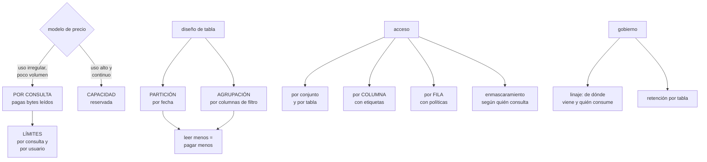

# 236 — BigQuery, Dataflow, Dataproc y gobernanza de datos

> [← 235 · Cloud SQL, Spanner, Firestore y Bigtable](../../part-19-gcp-production-architecture/235-cloud-sql-spanner-firestore-y-bigtable/README.md) · [Índice de la parte](../README.md) · [237 · Pub/Sub, Eventarc y entrega exactamente-una-vez →](../../part-19-gcp-production-architecture/237-pub-sub-eventarc-y-entrega-exactamente-una-vez/README.md)

**Parte:** 19 — Google Cloud: arquitectura de datos y operación en producción<br>
**Nivel:** avanzado · **Horas estimadas:** 4<br>
**Laboratorio:** `data` · **Estado:** `EXECUTABLE_CORE`

## 🎯 Propósito

Operar la plataforma analítica de Google Cloud, que es la pieza más madura de esta nube y la que más problemas produce de dos tipos concretos: **coste, porque una consulta mal escrita puede costar cientos de euros en segundos, y gobierno, porque el acceso a datos personales se concede en la primera semana y nadie lo revisa después**. La clase cubre el modelo de facturación, el diseño de tablas, el procesamiento por lotes y continuo, y el control de acceso a nivel de columna y de fila.

## 📚 Resultados de aprendizaje

Al finalizar podrás:

1. **Elegir** el modelo de facturación adecuado y evitar las sorpresas.
2. **Diseñar** tablas particionadas y agrupadas para reducir lo que se lee.
3. **Elegir** entre procesamiento continuo, por lotes y gestionado.
4. **Controlar** el acceso a columnas y filas con datos sensibles.
5. **Gobernar** el linaje, la calidad y la retención de los datos.

## 🧩 Conceptos centrales

| Concepto | Comprensión verificable |
|---|---|
| `facturación por consulta` | Se paga por bytes leídos. Una consulta sin filtro sobre una tabla grande cuesta mucho. |
| `capacidad reservada` | Modelo de precio por capacidad de proceso contratada, con coste previsible. |
| `partición` | División física de una tabla, normalmente por fecha. Permite leer solo lo necesario. |
| `agrupación` | Ordenación física por columnas dentro de la partición. Reduce lo leído en filtros por esas columnas. |
| `enmascaramiento de columna` | Transformación del valor según quién consulta, sin duplicar la tabla. |
| `linaje` | Registro de de dónde viene cada tabla y qué la consume. Necesario para retirar y para auditar. |

## 🧠 Modelo mental

Google Cloud combina una jerarquía estricta de recursos con una red global y servicios data-first; proyecto, cuota e IAM forman una unidad operativa.

Aplicado a esta clase, separa siempre cuatro planos: **intención** (qué necesita el usuario),
**configuración** (qué declaramos), **estado observado** (qué existe de verdad) y
**evidencia** (cómo sabemos que cumple). Confundirlos produce diseños que se ven correctos
en un diagrama pero fallan al operar.

## 🗺️ Flujo de razonamiento



## 📖 Desarrollo

### 1. El coste, que es lo primero

Aquí el coste no es un asunto de fin de mes: **una consulta puede costar cientos de euros en segundos**, y por eso se aborda antes que el diseño.

```text
POR CONSULTA
  se paga por BYTES LEÍDOS, no por filas devueltas
  → «select * from tabla limit 10» sobre 40 TB lee 40 TB
  → el límite no reduce lo leído
  + sin coste cuando no se consulta
  − impredecible; una consulta mal escrita cuesta mucho

CAPACIDAD RESERVADA
  se paga por capacidad de proceso, con compromiso
  + coste previsible y consultas «gratis» dentro de la
    capacidad
  − hay que dimensionarla, y las consultas compiten entre sí

CRITERIO
  uso irregular o bajo   → por consulta, CON LÍMITES
  uso alto y continuo    → capacidad reservada
  y lo habitual: capacidad para lo productivo y por
  consulta para exploración, con límites
```

Y los límites que hay que poner el primer día:

```text
LÍMITE DE BYTES POR CONSULTA
  «ninguna consulta puede leer más de X»
  → rechaza antes de ejecutar
  → y es lo único que impide el susto de una consulta

CUOTA DIARIA POR USUARIO Y POR PROYECTO

Y LA COSTUMBRE DE ESTIMAR ANTES
  la herramienta dice cuántos bytes leerá una consulta
  ANTES de ejecutarla
  → y esa estimación debe estar en la formación de
    cualquiera que consulte                     ley 26
```

Y las tres causas de coste que se repiten:

```text
1  SELECCIONAR TODAS LAS COLUMNAS
   el almacenamiento es por columnas: leer 3 de 80 cuesta
   una fracción
   → «select *» es el error más caro y el más común

2  NO FILTRAR POR LA COLUMNA DE PARTICIÓN
   una consulta sin filtro de fecha lee la tabla entera
   → se puede EXIGIR el filtro en la definición de la tabla

3  CONSULTAS PROGRAMADAS QUE NADIE REVISA
   un panel que refresca cada 5 minutos sobre una tabla
   grande
   → y nadie mira su coste                        ley 15
```

### 2. Diseñar para leer menos

Todo el rendimiento y el coste dependen de cuántos bytes se leen. Hay dos mecanismos.

```text
PARTICIÓN
  divide la tabla, normalmente por fecha
  → una consulta con filtro de fecha lee solo esas
    particiones

  y la opción que evita sustos
    exigir el filtro de partición en la tabla
    → una consulta sin él FALLA en vez de leer todo

AGRUPACIÓN
  ordena físicamente por hasta cuatro columnas dentro de
  la partición
  → filtrar por la primera columna de agrupación reduce
    mucho lo leído
  → el orden importa: se agrupa por lo que más se filtra

→ y las dos juntas son lo que convierte una tabla de 40 TB
  en consultas de 2 GB
```

Y el resto de decisiones de modelado:

```text
DESNORMALIZAR
  las uniones cuestan; repetir datos suele salir más barato
  → aquí, al contrario que en una base transaccional

CAMPOS ANIDADOS Y REPETIDOS
  guardar las líneas de un pedido dentro del pedido
  → evita la unión y reduce lo leído

VISTAS MATERIALIZADAS
  agregados precalculados que se refrescan solos
  → las consultas los usan automáticamente
  → y reducen mucho el coste de los paneles

TABLAS EXTERNAS
  consultar ficheros del almacén sin cargarlos
  → cómodo, y más lento y más caro por consulta
  → para datos poco consultados
```

**El almacenamiento**, con su propia palanca:

```text
las particiones que no se modifican pasan a un precio de
almacenamiento menor, solas
→ y la RETENCIÓN por partición retira lo antiguo
→ sin retención, la tabla crece indefinidamente   ley 25

y una decisión que hay que tomar
  ¿cuántos años de histórico hacen falta de verdad?
  → casi siempre menos de los que se guardan
  → y lo que haga falta por norma, en almacenamiento
    barato                                   clase 239
```

Y la carga de datos, con lo que decide el coste:

```text
CARGA POR LOTES        gratuita o muy barata
INSERCIÓN CONTINUA     se paga por fila, y suma
ESCRITURA POR FLUJO    el mecanismo moderno, más barato

→ si el retraso aceptable es de minutos, la carga por lotes
  cada pocos minutos es mucho más barata que la inserción
  fila a fila
→ y esa es una decisión de arquitectura, no de
  implementación                              clase 242
```

### 3. Procesar: continuo, por lotes y gestionado

Hay tres formas de transformar datos y se eligen por lo que hay que hacer, no por preferencia.

```text
CONSULTAS PROGRAMADAS Y VISTAS MATERIALIZADAS
  la transformación se escribe en SQL, dentro del almacén
  + lo más simple; sin infraestructura
  + y el linaje se registra solo
  − limitado a lo que SQL puede hacer
  → y es lo que resuelve la mayoría de los casos

PROCESAMIENTO UNIFICADO (Dataflow)
  el mismo código para lotes y para flujo continuo
  + gestiona ventanas, datos que llegan tarde y estado
  + escala solo
  − más que operar, y hay que entender el modelo
  → para transformaciones complejas o continuas de verdad

MOTOR DE CÓDIGO ABIERTO GESTIONADO (Dataproc)
  para trabajos existentes que ya están escritos
  + migración directa de lo que ya hay
  − hay que gestionar clústeres, aunque sean efímeros
  → y para trabajos nuevos, rara vez es la elección
```

Y el criterio:

```text
¿se puede escribir en SQL y el retraso de minutos vale?
  → consulta programada o vista materializada
¿hace falta procesamiento continuo con ventanas y estado?
  → procesamiento unificado
¿hay trabajos que ya existen y funcionan?
  → motor gestionado, con fecha de revisión      ley 25
```

Y lo que hay que resolver en el procesamiento continuo, que es lo mismo de la clase 116:

```text
DATOS QUE LLEGAN TARDE
  una ventana cerrada y un dato de hace 3 horas
  → decidir: descartar, reprocesar o corregir
  → y declararlo                              clase 242

EXACTAMENTE UNA VEZ
  se consigue con identificadores y deduplicación
  → no viene gratis                          clase 237

Y EL RETRASO
  vigilado, con alerta                          ley 13
  → «el flujo lleva N minutos de retraso» es la señal que
    dice que algo va mal antes de que falte un dato
```

Y la orquestación:

```text
los trabajos dependen unos de otros
→ hace falta un orquestador que sepa el orden, reintente y
  avise                                       clase 243
→ y no un conjunto de trabajos programados por hora
  esperando que el anterior haya terminado
```

### 4. Gobierno: acceso, linaje y retención

**El acceso a datos sensibles** es donde este tipo de plataformas produce los hallazgos más incómodos.

```text
LOS NIVELES DE CONTROL
  por conjunto de datos y por tabla
    → el habitual, y el más grueso
  POR COLUMNA
    las columnas se etiquetan; el acceso se concede por
    etiqueta
    → «quien no tenga la etiqueta de datos personales no ve
      esas columnas»
  POR FILA
    políticas que filtran según quién consulta
    → «cada país ve sus propias filas»
  ENMASCARAMIENTO
    la columna se transforma según quién consulta
    → un analista ve el correo con formato pero sin valor
    → sin duplicar la tabla
```

Y el problema que resuelven, que es el de la clase 230:

```text
sin control por columna, dar acceso a una tabla es dar
acceso a CUANTO contiene
→ y por eso el acceso se concede al conjunto entero
→ y por eso los equipos de análisis acaban viendo datos
  personales completos que no necesitan

con etiquetas de columna
  el acceso a la tabla no incluye las columnas etiquetadas
  → y la mayoría de los análisis funcionan igual
```

Y la disciplina:

```text
1  CLASIFICAR las columnas: la plataforma puede detectar
   datos personales automáticamente
2  ETIQUETAR las sensibles
3  QUITAR el acceso amplio y conceder por etiqueta
4  y REVISAR trimestralmente quién la tiene   clase 230
```

**El linaje**, que hace posible retirar y auditar:

```text
qué tablas alimentan a cuáles
qué consultas y paneles consumen cada tabla
y de dónde vino cada dato

→ sin linaje, retirar una tabla es imposible: nadie sabe
  quién la usa                                    ley 20
→ y ante una petición de borrado de datos personales,
  tampoco se sabe dónde se copiaron   clases 139, 251
```

Y lo que hay que vigilar en esta plataforma:

```text
coste por consulta, por usuario y por panel
consultas que leen más de X bytes
tablas sin partición ni agrupación
tablas sin retención
tablas sin consumidores en 90 días        → candidatas a
                                            retirar
acceso a columnas sensibles, por identidad
retraso de los flujos continuos
y trabajos que fallan sin que nadie lo mire      ley 13
```

Y la lista de comprobación de la clase:

```text
☐ hay límite de bytes por consulta
☐ hay cuota diaria por usuario y por proyecto
☐ las tablas grandes están particionadas
☐ se exige el filtro de partición donde procede
☐ están agrupadas por las columnas de filtro habituales
☐ los paneles usan vistas materializadas
☐ hay retención por tabla
☐ la ingesta usa lotes o escritura por flujo, no inserción
  fila a fila
☐ las columnas sensibles están clasificadas y etiquetadas
☐ el acceso se concede por etiqueta, no al conjunto entero
☐ hay políticas de fila donde aplica
☐ el linaje está activado y se consulta
☐ hay alerta de retraso de los flujos y de trabajos
  fallidos
☐ se revisan las tablas sin consumidores
```

Y el cierre que enlaza con la clase siguiente: con datos operativos y analíticos resueltos, queda la mensajería que los conecta, que en esta nube tiene una propiedad que se anuncia mucho y conviene entender bien. Es la materia de la clase 237.

## 🔬 Ejemplo trabajado

**CloudShop monta su plataforma analítica en Google Cloud. Lo que sigue son las tres consultas que costaban 4.100 € al mes, el acceso a datos personales que tenían 41 personas, y el rediseño de tablas que redujo el coste un 88 %.**

**La factura, al revisar:**

```text
coste mensual del almacén analítico          7.900 €
  consultas                                  6.200 €
  almacenamiento                             1.400 €
  inserción continua                           300 €

las consultas, por origen
  paneles programados                        4.100 €  ←
  exploración de analistas                   1.400 €
  transformaciones programadas                 700 €
```

Y el desglose de los paneles:

```text
panel                     refresco   bytes/ejec.   €/mes
ventas en tiempo real       5 min       2,1 TB    2.900
ocupación por almacén      15 min       0,9 TB      810
embudo de conversión        1 h         3,4 TB      390

→ tres consultas, 4.100 €/mes
→ y los tres paneles los abría alguien 2 o 3 veces al día
```

Y el diagnóstico de la primera:

```text
la consulta del panel de ventas
  select * from pedidos p join lineas l ... where
  fecha >= current_date() - 30

  la tabla pedidos                          14 TB
  la tabla lineas                           26 TB
  ninguna estaba particionada
  → el filtro de fecha no reducía nada: se leía todo
  → y «select *» traía 80 columnas de las que se usaban 6

  bytes leídos por ejecución                 2,1 TB
  ejecuciones al mes                         8.640
```

**El rediseño de tablas:**

```text
pedidos
  partición    por fecha de pedido, diaria
  agrupación   por país, canal, estado
  filtro de partición    EXIGIDO

lineas
  partición    por fecha del pedido (heredada)
  agrupación   por producto
  o mejor: las líneas ANIDADAS dentro de pedidos
  → se eligió anidarlas: elimina la unión

y las consultas reescritas
  columnas explícitas, no «select *»
  filtro de fecha, obligatorio

bytes por ejecución del panel de ventas   2,1 TB → 1,4 GB
```

Y las vistas materializadas:

```text
los tres paneles consultaban agregados diarios
→ vista materializada con el agregado, refrescada sola
→ los paneles la usan automáticamente

bytes por ejecución                       1,4 GB → 12 MB

coste de los tres paneles          4.100 € → 41 €/mes
```

**Los límites, puestos después del susto:**

```text
un analista ejecutó una consulta exploratoria sin filtro
sobre la tabla de eventos de 61 TB
  bytes leídos                                61 TB
  coste de esa consulta                       310 €
  duración                                     94 s

→ y no había nada que lo impidiera

límites puestos
  bytes máximos por consulta                   200 GB
    → salvo excepción con aprobación
  cuota diaria por usuario                       2 TB
  cuota diaria por proyecto de exploración      20 TB

y formación
  la estimación previa de bytes, en la guía de
  incorporación
  → y un aviso en la herramienta cuando la estimación
    supera 50 GB

consultas rechazadas por límite, primer mes          61
  de ellas, errores reales del analista               57
  con excepción aprobada                               4
```

**El acceso a datos personales.**

```text
al inventariar
  personas con acceso al conjunto de datos de clientes  41
  de ellas, que necesitaban ver datos personales
  completos                                              3

  → los otros 38 hacían análisis agregados y no
    necesitaban el correo, el teléfono ni la dirección
  → pero el acceso se concede al conjunto, y el conjunto
    los incluye                               clase 230

y la clasificación automática encontró
  columnas con datos personales                         61
    en tablas donde nadie sabía que los había             9
      · una tabla de análisis de campañas con correos
      · dos tablas temporales de una migración de 2023
        que nunca se borraron                     ley 25
```

Y la corrección:

```text
clasificación y etiquetado de las 61 columnas
etiquetas jerárquicas
  personal-directo    (nombre, correo, teléfono,
                      dirección)
  personal-indirecto  (identificador, dispositivo)
  financiero

acceso concedido por etiqueta, no por conjunto
  personal-directo                    3 personas
  personal-indirecto                 12 personas
  financiero                          6 personas
  el resto del conjunto              41 personas

y enmascaramiento para los casos intermedios
  el correo se ve como «a***@dominio.com»
  → suficiente para verificar y sin exponer el valor

y las políticas de fila
  el equipo de cada país ve solo las filas de su país

y las 3 tablas con datos que nadie sabía
  2 borradas (temporales de la migración)
  1 seudonimizada
```

Y la comprobación:

```text
prueba negativa
  un analista sin la etiqueta consulta la columna de
  correo
  → la consulta falla, indicando qué etiqueta falta
  un analista de España consulta filas de Portugal
  → devuelve 0 filas
  → y ambas se ejecutan en cada despliegue del gobierno
                                                    ley 22
```

**El procesamiento, ajustado:**

```text
antes
  inserción continua fila a fila desde la aplicación
  41.000 eventos/s → 300 €/mes de inserción
  y transformaciones en un motor gestionado con un clúster
  siempre encendido                            410 €/mes

después
  los eventos van al servicio de mensajería y de ahí en
  lotes cada 60 s                       clase 237
    coste de ingesta                     300 € → 18 €
  las transformaciones que caben en SQL, como consultas
    programadas                                      9
  las que no, en procesamiento unificado             2
    clúster gestionado retirado           410 € → 140 €

y el retraso declarado
  eventos disponibles para consulta      ≤ 90 s
  con alerta si supera 5 min                    ley 13
```

**La retención y el linaje:**

```text
retención por tabla
  eventos brutos                        90 días
  agregados diarios                      5 años
  tablas de trabajo                      7 días

  almacenamiento                  1.400 € → 310 €

linaje activado
  tablas sin consumidores en 90 días                 34
    → 28 borradas tras avisar
    →  6 resultaron alimentar informes trimestrales
  y ante la primera petición de borrado de datos de un
  cliente
    tablas donde aparecía, según el linaje              7
    tablas que el equipo creía                          2
                                          clases 139, 251
```

**El resultado:**

```text                                        antes     después
coste mensual del almacén                 7.900 €       610 €
  paneles                                 4.100 €        41 €
  exploración                             1.400 €       120 €
  almacenamiento                          1.400 €       310 €
  ingesta                                   300 €        18 €
bytes por ejecución del panel de ventas    2,1 TB      12 MB
personas con acceso a datos personales        41           3
columnas sensibles sin clasificar              61           0
tablas con datos personales desconocidos        3           0
tablas sin consumidores                        34           6
consultas que pueden leer la tabla entera  cualquiera       0
```

**La lección que esta clase deja**: tres paneles que alguien abría dos veces al día costaban **cuatro mil cien euros al mes**, y el problema no era la plataforma sino tablas sin particionar consultadas con «select *». Y cuarenta y una personas tenían acceso a datos personales completos porque **el acceso se concede al conjunto y el conjunto los incluye**; solo tres los necesitaban, y el resto siguió trabajando igual con las columnas enmascaradas.

## 🧪 Laboratorio guiado

Ejecuta desde la raíz:

```bash
python classes/part-19-gcp-production-architecture/236-bigquery-dataflow-dataproc-y-gobernanza-de-datos/lab.py
```

El laboratorio selecciona el motor de práctica **`data`** y produce
`lab_result.json`. El escenario, sus comprobaciones y el artefacto esperado corresponden a
esta clase; no requiere credenciales y deja explícito qué debe revalidarse en un sandbox real.

1. Lee `exercise.steps` y formula una predicción antes de ejecutar.
2. Ejecuta la práctica y verifica todos los elementos de `checks`.
3. Provoca el caso de `negative_test` y explica la señal observada.
4. Materializa `gcp-analytics-platform` en `evidence/` usando la plantilla indicada.
5. Para proveedor real, sigue `sandbox.requires`, registra costo y ejecuta `destroy`.

### Evidencia esperada

El artefacto principal es un modelo de datos ligado a patrones de acceso. Además, la entrega debe incluir el comando ejecutado,
la salida estructurada y una conclusión que no exceda lo observado.

## 🏆 Reto verificable

Construye **`gcp-analytics-platform`** para el caso CloudShop. Incluye una alternativa descartada,
un supuesto que pueda falsarse, una prueba de fallo y una decisión de rollback.

## ✅ Criterio de aceptación

- [ ] `lab.py` termina con código 0 y genera JSON válido.
- [ ] La entrega conecta al menos tres requisitos con mecanismos verificables.
- [ ] Existe una prueba positiva y una prueba negativa con evidencia.
- [ ] Seguridad, costo y operación aparecen como decisiones, no como anexos.
- [ ] Se declara una limitación y una condición que obligaría a revisar el diseño.
- [ ] Otra persona puede repetir el recorrido sin conocimiento tácito.

## ⚠️ Errores frecuentes

| Síntoma | Causa probable | Corrección |
|---|---|---|
| Una consulta cuesta cientos de euros en segundos | Se paga por bytes leídos y no hay límite ni filtro de partición | Pon límite de bytes por consulta y cuota por usuario, particiona las tablas y exige el filtro de partición. |
| Los paneles dominan la factura | Refrescan consultas pesadas sobre tablas grandes muchas veces al día | Usa vistas materializadas con los agregados y revisa el coste por panel. |
| El filtro de fecha no reduce el coste | La tabla no está particionada por esa columna | Particiona por la columna de filtro habitual y agrupa por las siguientes más usadas. |
| Todo el equipo de análisis ve datos personales completos | El acceso se concede al conjunto de datos, que los incluye | Clasifica y etiqueta las columnas sensibles, concede por etiqueta y usa enmascaramiento para los casos intermedios. |
| La ingesta continua cuesta más que el proceso | Se inserta fila a fila cuando el retraso aceptable es de minutos | Agrupa en lotes o usa la escritura por flujo; decide el retraso aceptable como decisión de arquitectura. |
| No se puede retirar una tabla porque nadie sabe quién la usa | No hay linaje registrado | Activa el linaje y revisa periódicamente las tablas sin consumidores. |

## 🛡️ Seguridad, ética y costo

Trabaja con cuentas propias o sandboxes autorizados. No publiques secretos, identificadores
reales ni datos personales. Antes de crear recursos pagos define presupuesto, etiquetas y
comando de destrucción; después verifica que no queden recursos huérfanos. Los ejemplos
locales enseñan contratos, pero no certifican cumplimiento ni disponibilidad de producción.

## ❓ Preguntas de comprobación

1. ¿Por qué un límite de filas no reduce el coste de una consulta?
2. ¿Qué diferencia hay entre partición y agrupación, y para qué sirve cada una?
3. ¿Qué problema resuelve el control de acceso por columna?
4. ¿Cuándo conviene procesamiento unificado frente a consultas programadas?
5. ¿Para qué hace falta el linaje además de para auditar?

## 🔗 Referencias

- Google Cloud (2025). *BigQuery: controlling costs*. <https://cloud.google.com/bigquery/docs/best-practices-costs>
- Google Cloud (2025). *Partitioned and clustered tables*. <https://cloud.google.com/bigquery/docs/partitioned-tables>
- Google Cloud (2025). *Column-level and row-level security*. <https://cloud.google.com/bigquery/docs/column-level-security-intro>
- Google Cloud (2025). *Dataflow: unified batch and streaming*. <https://cloud.google.com/dataflow/docs/concepts>
- Google Cloud (2025). *Dataplex and data lineage*. <https://cloud.google.com/dataplex/docs/about-data-lineage>
- Documentación oficial vigente del servicio implementado; registra URL y fecha de consulta.

---

> [Evaluación](assessment.md) · [Contrato de clase](lesson.yaml) · [Índice de la parte](../README.md)

| Anterior | Índice | Siguiente |
|---|---|---|
| [← 235 · Cloud SQL, Spanner, Firestore y Bigtable](../../part-19-gcp-production-architecture/235-cloud-sql-spanner-firestore-y-bigtable/README.md) | [Parte 19](../README.md) · [Programa](../../README.md) | [237 · Pub/Sub, Eventarc y entrega exactamente-una-vez →](../../part-19-gcp-production-architecture/237-pub-sub-eventarc-y-entrega-exactamente-una-vez/README.md) |
