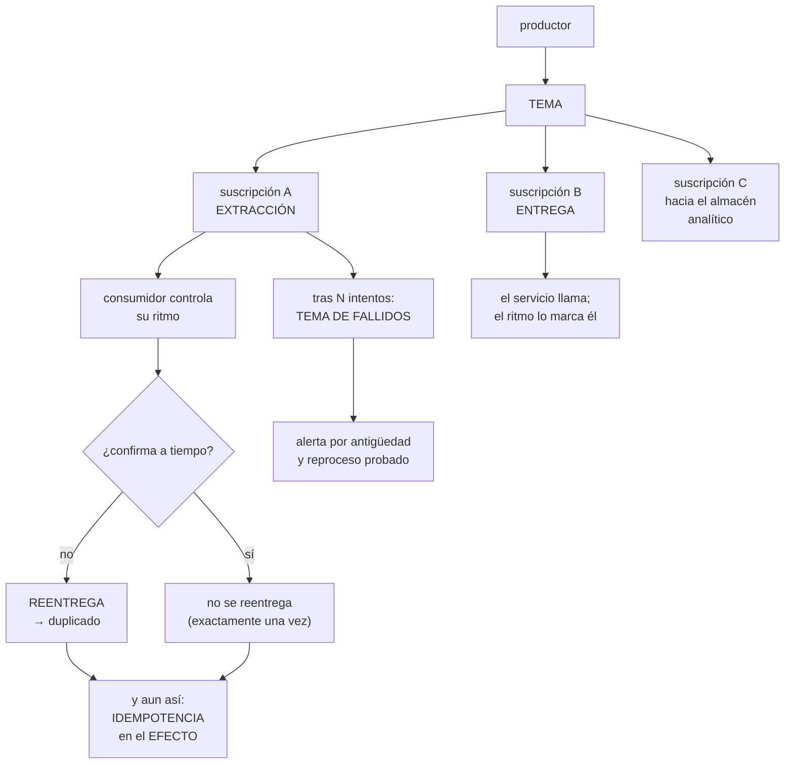

# 237 — Pub/Sub, Eventarc y entrega exactamente-una-vez

> [← 236 · BigQuery, Dataflow, Dataproc y gobernanza de datos](../../part-19-gcp-production-architecture/236-bigquery-dataflow-dataproc-y-gobernanza-de-datos/README.md) · [Índice de la parte](../README.md) · [238 · Cloud Operations, Trace y OpenTelemetry →](../../part-19-gcp-production-architecture/238-cloud-operations-trace-y-opentelemetry/README.md)

**Parte:** 19 — Google Cloud: arquitectura de datos y operación en producción<br>
**Nivel:** avanzado · **Horas estimadas:** 4<br>
**Laboratorio:** `messaging` · **Estado:** `EXECUTABLE_CORE`

## 🎯 Propósito

Montar la mensajería de Google Cloud, cuyo servicio principal anuncia **entrega exactamente una vez**, y conviene entender con precisión qué significa y qué sigue siendo responsabilidad del código. La clase separa el servicio de mensajería del enrutador de eventos, explica los mecanismos de entrega y sus parámetros, y sostiene lo que este programa lleva demostrando: **la garantía del transporte no elimina la necesidad de idempotencia en el efecto**.

## 📚 Resultados de aprendizaje

Al finalizar podrás:

1. **Elegir** entre suscripción de entrega y de extracción, y el enrutador de eventos.
2. **Configurar** plazos, reintentos y destino de fallidos coherentemente.
3. **Entender** qué garantiza la entrega exactamente una vez y qué no.
4. **Ordenar** mensajes por clave cuando el orden importa.
5. **Operar** los fallidos con alerta, diagnóstico y reproceso probado.

## 🧩 Conceptos centrales

| Concepto | Comprensión verificable |
|---|---|
| `tema` | Punto de publicación. Los consumidores se conectan mediante suscripciones independientes. |
| `suscripción de extracción` | El consumidor pide mensajes. Controla su propio ritmo. |
| `suscripción de entrega` | El servicio llama a un punto del consumidor. Más simple y con menos control de ritmo. |
| `plazo de confirmación` | Tiempo que el mensaje queda retenido tras entregarse. Si vence, se reentrega. |
| `entrega exactamente una vez` | Garantía de que un mensaje confirmado no se reentrega dentro de la ventana de confirmación. |
| `clave de ordenación` | Campo que agrupa mensajes para entregarlos en orden. Limita el caudal por clave. |

## 🧠 Modelo mental

Google Cloud combina una jerarquía estricta de recursos con una red global y servicios data-first; proyecto, cuota e IAM forman una unidad operativa.

Aplicado a esta clase, separa siempre cuatro planos: **intención** (qué necesita el usuario),
**configuración** (qué declaramos), **estado observado** (qué existe de verdad) y
**evidencia** (cómo sabemos que cumple). Confundirlos produce diseños que se ven correctos
en un diagrama pero fallan al operar.

## 🗺️ Flujo de razonamiento



## 📖 Desarrollo

### 1. Un tema, muchas suscripciones

El modelo aquí es más simple que el de las otras nubes: hay un servicio principal y un enrutador.

```text
SERVICIO DE MENSAJERÍA
  un TEMA donde se publica
  N SUSCRIPCIONES independientes, cada una con su propio
  ritmo, sus reintentos y su destino de fallidos
  → uno a muchos, sin configurar nada más
  → y añadir un consumidor es crear una suscripción: el
    productor no se entera                    clase 148

ENRUTADOR DE EVENTOS
  entrega eventos de la propia plataforma y de fuentes
  propias a destinos, con filtros
  → «cuando se suba un fichero a este almacén, llama a este
    servicio»
  → y por debajo usa el servicio de mensajería
```

Y los dos tipos de suscripción, que se eligen mal a menudo:

```text
EXTRACCIÓN
  el consumidor pide mensajes cuando puede
  + controla su ritmo: no le llega más de lo que aguanta
  + amortigua picos de forma natural
  − hay que ejecutar un proceso que extraiga

ENTREGA (a un punto HTTP)
  el servicio llama al consumidor
  + más simple: no hay proceso extractor
  + encaja con servicios que escalan por peticiones
                                                clase 233
  − el ritmo lo marca el servicio, no el consumidor
  − y por tanto puede escalar el consumidor sin control

Y LA DECISIÓN
  si el consumidor tiene un recurso limitado detrás (una
  base), la extracción da control
  si escala bien y es idempotente, la entrega es más simple
  → y en cualquier caso hay que poner un límite de
    concurrencia                             clase 233
```

Y los otros destinos, que ahorran código:

```text
SUSCRIPCIÓN HACIA EL ALMACÉN ANALÍTICO
  los mensajes se escriben directamente en una tabla
  → sin consumidor que mantener
  → y con esquema validado                    clase 236

SUSCRIPCIÓN HACIA ALMACENAMIENTO
  vuelca por lotes a ficheros
  → el histórico, sin escribir nada         clase 224
```

### 2. Exactamente una vez: qué significa

Esta es la propiedad que más se malinterpreta, y conviene ser preciso.

```text
LO QUE GARANTIZA
  un mensaje CONFIRMADO no se vuelve a entregar dentro de
  la ventana de confirmación
  → elimina los duplicados que produce el plazo vencido
    cuando el consumidor sí había terminado

LO QUE NO GARANTIZA
  que el PRODUCTOR no publique el mismo hecho dos veces
    → un reintento del productor crea dos mensajes
      distintos
  que el efecto no se produzca dos veces si el consumidor
    falla DESPUÉS de actuar y ANTES de confirmar
  que el reproceso desde el tema de fallidos no repita
  ni que dos suscripciones no procesen lo mismo

→ es decir: elimina una de las cinco fuentes de duplicado
  de la clase 210, no las cinco
```

Y la conclusión, que es la de siempre:

```text
LA IDEMPOTENCIA EN EL EFECTO SIGUE SIENDO OBLIGATORIA
  clave del suceso, generada por el productor
  registro de claves procesadas, en dos estados
  y escritura condicionada antes del efecto  clase 210

→ lo que la garantía da es que se necesitan MENOS
  reintentos y menos reproceso, no que se pueda prescindir
  de la comprobación
```

Y el coste, que conviene conocer:

```text
la entrega exactamente una vez tiene un coste
  el caudal por suscripción es menor
  la latencia es algo mayor
  y hay restricciones de configuración

→ activarla donde el duplicado cuesta dinero
→ y no en la telemetría, donde no aporta y limita el caudal
```

**Los parámetros que producen duplicados**, con la misma aritmética de siempre:

```text
PLAZO DE CONFIRMACIÓN
  tiempo que el mensaje queda retenido tras entregarse
  si vence antes de confirmar, se reentrega

  y la extensión automática
    las bibliotecas extienden el plazo mientras se procesa
    → activarla es lo que evita el problema
    → y hay un máximo total: procesos muy largos no encajan

CONCURRENCIA DEL CONSUMIDOR
  cuántos mensajes procesa a la vez
  → si es alta y el proceso es lento, se acumulan mensajes
    retenidos y algunos vencen
  → es la misma relación de prebúsqueda de la clase 224

REINTENTOS Y RETROCESO
  con retroceso exponencial declarado
  → sin retroceso, un consumidor caído recibe una avalancha
    en cuanto vuelve
```

### 3. Orden, filtros y fallidos

**El orden** se consigue con clave, y tiene su coste.

```text
CLAVE DE ORDENACIÓN
  los mensajes con la misma clave se entregan en orden
  → y en la misma suscripción, al mismo consumidor

  coste
    el caudal por clave lo limita un solo consumidor
    y si un mensaje falla, los siguientes de esa clave
    ESPERAN
    → un mensaje venenoso bloquea su clave entera

  y hay que decidir
    ¿qué se hace con el veneno? ¿se aparta y se sigue, o se
    para?
    → misma decisión que en la clase 224
```

Y la pregunta previa, que evita el problema:

```text
¿de verdad hace falta orden, o basta con que las
operaciones sean conmutativas?
  «−1 unidad» no necesita orden
  «estado = ENVIADO» tampoco, si lleva versión
  «stock = 4» sí
→ y modelar para no necesitar orden es más barato que
  garantizarlo                          clases 203, 224
```

**Los filtros**, que reducen trabajo y coste:

```text
una suscripción puede filtrar por atributos del mensaje
  → el consumidor solo recibe lo suyo
  → y no se paga por entregar lo que se iba a descartar

y por eso conviene que los atributos lleven lo necesario
para filtrar
  tipo de suceso, entidad, entorno, versión de esquema
```

**El tema de fallidos**, con la disciplina de siempre:

```text
tras N intentos, el mensaje va a otro tema
  → y hay que crear una suscripción sobre él, o los
    mensajes caducan sin que nadie los vea         ley 13

LAS ALERTAS
  «hay mensajes sin confirmar con más de 1 hora de
   antigüedad»                              ← la que sirve
  «el número de mensajes sin confirmar crece de forma
   sostenida»
  y en el tema de fallidos, las dos                ley 15

EL DIAGNÓSTICO
  guardar el motivo del fallo con el mensaje
  → veneno, dependencia o error de código   clase 210

EL REPROCESO
  procedimiento escrito, con límite de ritmo y por lotes
  y probado por alguien que no lo escribió         ley 22
```

Y una capacidad que evita reprocesos:

```text
RETROCESO EN EL TIEMPO
  una suscripción puede volver a un momento anterior o a
  una instantánea
  → y reprocesar desde ahí sin mover mensajes
  → útil cuando un consumidor procesó mal durante un rato
  → y exige que el consumidor sea idempotente, otra vez
```

### 4. Operar y medir

**Lo que hay que vigilar**, con las señales que dicen algo:

```text
MENSAJES SIN CONFIRMAR
  número y ANTIGÜEDAD del más viejo
  → la antigüedad es la que detecta el consumidor parado

PLAZOS VENCIDOS
  señal directa de plazo mal puesto o proceso lento

RETRASO DE PUBLICACIÓN A CONSUMO
  el tiempo entre que ocurre el hecho y se procesa
  → es la medida que le importa al negocio    clase 238

MENSAJES EN EL TEMA DE FALLIDOS, y su antigüedad

ENTREGAS REPETIDAS del mismo mensaje
  → si la entrega exactamente una vez está activa y aun así
    hay repeticiones, algo no está confirmando

Y EL COSTE
  se paga por volumen publicado, entregado y almacenado
  → una suscripción que nadie consume acumula y factura
  → suscripciones sin consumidor: inventario periódico
                                                    ley 25
```

Y una advertencia de coste que se repite:

```text
los mensajes se retienen hasta que se confirman o caducan
  → una suscripción abandonada retiene todo hasta la
    caducidad
  → y factura almacenamiento
→ y por eso las suscripciones sin consumidor son un
  hallazgo típico del primer inventario
```

**Las comprobaciones** de esta clase:

```text
☐ enviar el mismo mensaje 50 veces y comprobar un efecto
☐ parar el consumidor y esperar la alerta de antigüedad
☐ dejar un mensaje en el tema de fallidos y esperar alerta
☐ reprocesar 10.000 mensajes con límite de ritmo
☐ publicar un mensaje con esquema inválido
☐ retroceder una suscripción y comprobar el reproceso
☐ y comprobar que un mensaje venenoso con clave de
  ordenación no bloquea indefinidamente
```

Y los errores de traslado, que esta parte vigila:

```text
✗ «como garantiza exactamente una vez, no hace falta
   idempotencia»
  → cubre una de las cinco fuentes de duplicado

✗ «la suscripción de entrega es como una cola con
   consumidor»
  → el ritmo lo marca el servicio; hay que limitar la
    concurrencia del consumidor

✗ «un tema por consumidor»
  → un tema, N suscripciones; crear un tema por consumidor
    obliga al productor a saber quién escucha  clase 148
```

Y la lista de comprobación de la clase:

```text
☐ hay un tema y una suscripción por consumidor
☐ el tipo de suscripción corresponde al consumidor
☐ la concurrencia del consumidor está limitada
☐ el plazo de confirmación supera el proceso, o se extiende
☐ los reintentos tienen retroceso declarado
☐ la entrega exactamente una vez está donde el duplicado
  cuesta
☐ toda operación con efecto es idempotente igualmente
☐ el orden por clave se usa solo donde hace falta
☐ está decidido qué hacer con un veneno en una clave
  ordenada
☐ los filtros reducen lo que llega a cada consumidor
☐ hay tema de fallidos CON suscripción
☐ hay alerta por antigüedad, no solo por número
☐ el motivo del fallo se guarda con el mensaje
☐ el reproceso está escrito y probado
☐ no hay suscripciones sin consumidor
```

Y el cierre que enlaza con la clase siguiente: con datos, cómputo y mensajería en pie, falta saber qué ocurre cuando algo va mal. La observabilidad de esta nube, con el estándar abierto, es la materia de la clase 238.

## 🔬 Ejemplo trabajado

**CloudShop monta la mensajería de su plataforma en Google Cloud. Lo que sigue es el malentendido sobre la entrega exactamente una vez, la suscripción abandonada que acumuló 41 millones de mensajes, y la clave de ordenación que bloqueó un cliente durante 6 horas.**

**El malentendido, semana 2.**

```text
el equipo activó la entrega exactamente una vez en las 6
suscripciones
y retiró la comprobación de idempotencia de los
consumidores
motivo   «ya no hace falta: el servicio lo garantiza»

lo que pasó en la primera campaña
  correos de confirmación duplicados               214
  descuentos de stock duplicados                    88

el diagnóstico
  la garantía cubre: un mensaje CONFIRMADO no se reentrega
  no cubría lo que estaba pasando

  caso 1 (correos)
    el consumidor enviaba el correo y fallaba al confirmar
    por una desconexión
    → el mensaje se reentregaba, correctamente
    → y el correo se enviaba otra vez
    → la garantía funcionó: el problema es que el EFECTO ya
      se había producido

  caso 2 (stock)
    el productor reintentaba al no recibir confirmación de
    publicación
    → publicaba DOS mensajes distintos, con contenido igual
    → dos mensajes distintos, entregados una vez cada uno
    → la garantía no aplica: son mensajes distintos

corrección
  idempotencia restaurada, con clave del suceso generada
  por el PRODUCTOR y estable entre reintentos  clase 210
  → y la entrega exactamente una vez se dejó activa donde
    el duplicado cuesta, y se desactivó en telemetría,
    donde limitaba el caudal

duplicados tras la corrección                        0
```

Y la frase que el equipo escribió en el registro de decisión:

```text
«la garantía del transporte reduce los duplicados de
 transporte; el efecto lo protege el consumidor»
→ y es la misma conclusión de las clases 117, 210 y 224,
  con otro producto                              ley 18
```

**La suscripción abandonada.**

```text
al revisar el coste, mes 4
  coste de mensajería                        1.840 €/mes
  esperado                                     ~200 €

desglose
  publicación                                   140 €
  entrega                                       180 €
  ALMACENAMIENTO DE MENSAJES SIN CONFIRMAR    1.520 €  ←

causa
  una suscripción creada para una prueba en el mes 1
  su consumidor se apagó al terminar la prueba
  la suscripción siguió recibiendo CUANTO se publicaba
  mensajes retenidos                       41 millones
  antigüedad del más antiguo                   94 días
  → y la retención estaba en 7 días… en OTRA suscripción

  la abandonada tenía retención de 31 días y los mensajes
  se acumulaban hasta caducar y volver a acumularse

corrección
  suscripción borrada
  inventario de suscripciones sin actividad de consumo
    → 4 más encontradas
  alerta: «suscripción sin consumo en 24 h»
  y caducidad automática de suscripciones inactivas 30 días
                                                    ley 25

coste                            1.840 € → 190 €/mes
```

**La clave de ordenación que bloqueó un cliente.**

```text
el flujo de integración con socios usaba clave de
ordenación = identificador de socio
motivo   los eventos de un socio deben procesarse en orden

qué pasó
  un socio envió un evento con un campo con un carácter que
  el consumidor no manejaba
  → el consumidor fallaba al procesarlo
  → reintentaba con retroceso
  → y todos los eventos siguientes de ESE socio esperaban

  duración                                       6 h 10
  eventos acumulados de ese socio                 4.100
  otros socios                            sin afectación

cómo se detectó
  el socio llamó
  → la alerta de antigüedad existía pero con umbral de
    24 h                                          ley 15

correcciones
  1  umbral de antigüedad a 30 minutos
  2  decisión escrita sobre el veneno en clave ordenada
     tras 5 intentos, el mensaje se aparta al tema de
     fallidos y la clave AVANZA
     → se pierde el orden estricto para esa clave, y se
       registra como incidencia de datos
     → la alternativa (parar) era peor para el negocio
  3  validación de esquema en la publicación
     → el mensaje con el carácter problemático se habría
       rechazado al publicar                    clase 188
```

**La configuración final:**

```text
consumidor          tipo         plazo   concurr.  orden
notificaciones      entrega       60 s     50       no
inventario          extracción   600 s     20       no
facturación         extracción   600 s     10       no
integración socios  extracción   300 s      5       SÍ
analítica           hacia el almacén analítico, directa
histórico           hacia almacenamiento, por lotes

entrega exactamente una vez
  activa en inventario, facturación e integración
  inactiva en notificaciones y telemetría

filtros
  cada suscripción filtra por tipo de suceso
  → la de inventario recibía 41.000 mensajes/día y ahora
    2.100
  → y no se paga por los 38.900 que descartaba

temas de fallidos
  uno por suscripción, CON suscripción propia
  con el motivo guardado como atributo
```

Y las dos suscripciones directas, que ahorraron trabajo:

```text
ANALÍTICA
  antes   un consumidor que leía y escribía en el almacén
          analítico: 340 líneas y un servicio que mantener
  después suscripción directa hacia la tabla, con esquema
          validado                              clase 236
  → servicio retirado                             ley 23

HISTÓRICO
  antes   un trabajo que exportaba cada noche
  después suscripción hacia almacenamiento, por lotes de
          5 minutos
  → trabajo retirado
```

**Las comprobaciones, ejecutadas:**

```text
✓  mismo mensaje 50 veces                    1 efecto
✓  parar el consumidor → alerta de antigüedad    3 min
✓  mensaje en tema de fallidos → alerta           41 s
✓  reprocesar 10.000 con límite de ritmo       2 min
✗  publicar un mensaje con esquema inválido
   → se aceptó: la validación de esquema no estaba
     activada en 2 de los 6 temas
   → activada
✓  retroceder una suscripción y reprocesar
✗  veneno con clave de ordenación
   → bloqueó indefinidamente en la primera prueba
   → corregido con la decisión de apartar y avanzar
```

**El resultado:**

```text                                        antes     después
coste de mensajería                       1.840 €       190 €
duplicados por campaña                       302           0
suscripciones sin consumidor                   5           0
mensajes retenidos                        41 M          <10 k
bloqueo por veneno en clave ordenada       6 h 10      6 min
tiempo de detección de consumidor parado     24 h       3 min
servicios de integración retirados             —           2
mensajes entregados y descartados         38.900/día        0
```

**La lección que esta clase deja**: la garantía de entrega exactamente una vez es real y **cubre una de las cinco fuentes de duplicado**; quitar la idempotencia porque existe produjo trescientos dos duplicados en una campaña. Y el mayor coste del capítulo no fue de proceso ni de entrega: fue **mil quinientos veinte euros al mes de almacenamiento de una suscripción que nadie consumía desde hacía tres meses**.

## 🧪 Laboratorio guiado

Ejecuta desde la raíz:

```bash
python classes/part-19-gcp-production-architecture/237-pub-sub-eventarc-y-entrega-exactamente-una-vez/lab.py
```

El laboratorio selecciona el motor de práctica **`messaging`** y produce
`lab_result.json`. El escenario, sus comprobaciones y el artefacto esperado corresponden a
esta clase; no requiere credenciales y deja explícito qué debe revalidarse en un sandbox real.

1. Lee `exercise.steps` y formula una predicción antes de ejecutar.
2. Ejecuta la práctica y verifica todos los elementos de `checks`.
3. Provoca el caso de `negative_test` y explica la señal observada.
4. Materializa `gcp-event-platform` en `evidence/` usando la plantilla indicada.
5. Para proveedor real, sigue `sandbox.requires`, registra costo y ejecuta `destroy`.

### Evidencia esperada

El artefacto principal es un flujo que declara orden, entrega y manejo de errores. Además, la entrega debe incluir el comando ejecutado,
la salida estructurada y una conclusión que no exceda lo observado.

## 🏆 Reto verificable

Construye **`gcp-event-platform`** para el caso CloudShop. Incluye una alternativa descartada,
un supuesto que pueda falsarse, una prueba de fallo y una decisión de rollback.

## ✅ Criterio de aceptación

- [ ] `lab.py` termina con código 0 y genera JSON válido.
- [ ] La entrega conecta al menos tres requisitos con mecanismos verificables.
- [ ] Existe una prueba positiva y una prueba negativa con evidencia.
- [ ] Seguridad, costo y operación aparecen como decisiones, no como anexos.
- [ ] Se declara una limitación y una condición que obligaría a revisar el diseño.
- [ ] Otra persona puede repetir el recorrido sin conocimiento tácito.

## ⚠️ Errores frecuentes

| Síntoma | Causa probable | Corrección |
|---|---|---|
| Aparecen duplicados pese a tener entrega exactamente una vez | La garantía cubre la reentrega tras confirmar, no el reintento del productor ni el fallo tras producir el efecto | Mantén la idempotencia en el consumidor con clave del suceso generada por el productor y estable entre reintentos. |
| La factura de mensajería es diez veces lo previsto | Una suscripción sin consumidor retiene todo lo publicado y paga almacenamiento | Inventaría suscripciones sin consumo, alerta cuando una lleve 24 h sin consumir y caduca las inactivas. |
| Los eventos de un cliente se detienen durante horas | Un mensaje venenoso bloquea su clave de ordenación | Decide y escribe qué ocurre con el veneno: apartarlo y avanzar, o parar; valida el esquema al publicar. |
| El consumidor recibe más carga de la que aguanta | Suscripción de entrega, donde el ritmo lo marca el servicio | Limita la concurrencia del consumidor o usa suscripción de extracción si hay un recurso limitado detrás. |
| Vencen los plazos y se reentregan mensajes que sí se estaban procesando | El plazo de confirmación es menor que el proceso y no se extiende | Activa la extensión automática del plazo y reduce la concurrencia; vigila los plazos vencidos. |
| Los mensajes fallidos caducan sin que nadie los vea | El tema de fallidos no tiene suscripción ni alerta | Crea suscripción sobre él, alerta por antigüedad y guarda el motivo del fallo como atributo. |

## 🛡️ Seguridad, ética y costo

Trabaja con cuentas propias o sandboxes autorizados. No publiques secretos, identificadores
reales ni datos personales. Antes de crear recursos pagos define presupuesto, etiquetas y
comando de destrucción; después verifica que no queden recursos huérfanos. Los ejemplos
locales enseñan contratos, pero no certifican cumplimiento ni disponibilidad de producción.

## ❓ Preguntas de comprobación

1. ¿Qué garantiza exactamente la entrega exactamente una vez y qué no?
2. ¿Cuándo conviene suscripción de extracción y cuándo de entrega?
3. ¿Qué coste tiene usar clave de ordenación y qué hay que decidir?
4. ¿Por qué una suscripción sin consumidor genera coste?
5. ¿Qué dos suscripciones directas evitan escribir un consumidor?

## 🔗 Referencias

- Google Cloud (2025). *Pub/Sub: exactly-once delivery*. <https://cloud.google.com/pubsub/docs/exactly-once-delivery>
- Google Cloud (2025). *Pub/Sub subscription types and delivery*. <https://cloud.google.com/pubsub/docs/subscriber>
- Google Cloud (2025). *Message ordering*. <https://cloud.google.com/pubsub/docs/ordering>
- Google Cloud (2025). *Dead-letter topics and retry policies*. <https://cloud.google.com/pubsub/docs/handling-failures>
- Google Cloud (2025). *Eventarc*. <https://cloud.google.com/eventarc/docs/overview>
- Documentación oficial vigente del servicio implementado; registra URL y fecha de consulta.

---

> [Evaluación](assessment.md) · [Contrato de clase](lesson.yaml) · [Índice de la parte](../README.md)

**📥 Descargar:** [Parte 19 en PDF](../../../site/downloads/partes/manual-parte-19-gcp-production-architecture.pdf) · [Recorrido de Google Cloud en PDF](../../../site/downloads/nubes/manual-google-cloud.pdf) · [Manual integral](../../../site/downloads/multi-cloud-engineering-manual-v2.0.pdf)

| Anterior | Índice | Siguiente |
|---|---|---|
| [← 236 · BigQuery, Dataflow, Dataproc y gobernanza de datos](../../part-19-gcp-production-architecture/236-bigquery-dataflow-dataproc-y-gobernanza-de-datos/README.md) | [Parte 19](../README.md) · [Programa](../../README.md) | [238 · Cloud Operations, Trace y OpenTelemetry →](../../part-19-gcp-production-architecture/238-cloud-operations-trace-y-opentelemetry/README.md) |
