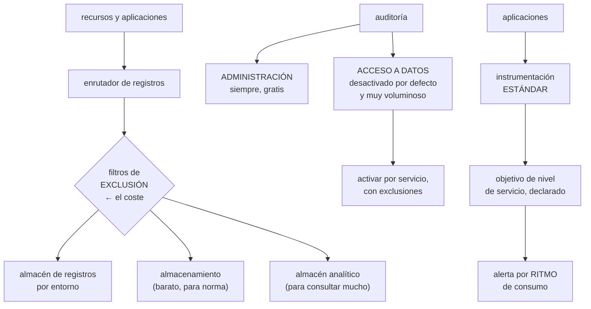

# 238 — Cloud Operations, Trace y OpenTelemetry

> [← 237 · Pub/Sub, Eventarc y entrega exactamente-una-vez](../../part-19-gcp-production-architecture/237-pub-sub-eventarc-y-entrega-exactamente-una-vez/README.md) · [Índice de la parte](../README.md) · [239 · SCC, VPC Service Controls, KMS y FinOps →](../../part-19-gcp-production-architecture/239-scc-vpc-service-controls-kms-y-finops/README.md)

**Parte:** 19 — Google Cloud: arquitectura de datos y operación en producción<br>
**Nivel:** avanzado · **Horas estimadas:** 4<br>
**Laboratorio:** `observability` · **Estado:** `EXECUTABLE_CORE`

## 🎯 Propósito

Montar la observabilidad de Google Cloud, donde los registros de auditoría son la pieza distintiva y a la vez la que más coste y más sorpresas produce: **el registro de acceso a datos está desactivado por defecto, y activarlo sin acotar dispara la factura**. La clase cubre el enrutado y los filtros de exclusión, la instrumentación estándar, los objetivos de nivel de servicio como recurso declarado, y las alertas que este programa exige siempre.

## 📚 Resultados de aprendizaje

Al finalizar podrás:

1. **Enrutar** registros con filtros de inclusión y exclusión, y controlar su coste.
2. **Decidir** qué registros de auditoría activar y sobre qué servicios.
3. **Instrumentar** con el estándar abierto para no quedar atado.
4. **Declarar** objetivos de nivel de servicio y alertar por ritmo de consumo.
5. **Correlacionar** desde la alerta hasta la causa sin eslabones rotos.

## 🧩 Conceptos centrales

| Concepto | Comprensión verificable |
|---|---|
| `receptor de registros` | Regla que enruta registros a un destino: almacén de registros, almacenamiento, almacén analítico o mensajería. |
| `filtro de exclusión` | Regla que descarta registros antes de almacenarlos. La palanca de coste más directa. |
| `registro de auditoría de administración` | Quién creó, modificó o borró qué. Siempre activo y sin coste. |
| `registro de acceso a datos` | Quién leyó o escribió datos. Desactivado por defecto y muy voluminoso. |
| `objetivo de nivel de servicio` | Recurso declarado con su indicador, su objetivo y su presupuesto de error. |
| `alerta por ritmo de consumo` | Se dispara cuando el presupuesto de error se gasta demasiado rápido. La que debe despertar. |

## 🧠 Modelo mental

Google Cloud combina una jerarquía estricta de recursos con una red global y servicios data-first; proyecto, cuota e IAM forman una unidad operativa.

Aplicado a esta clase, separa siempre cuatro planos: **intención** (qué necesita el usuario),
**configuración** (qué declaramos), **estado observado** (qué existe de verdad) y
**evidencia** (cómo sabemos que cumple). Confundirlos produce diseños que se ven correctos
en un diagrama pero fallan al operar.

## 🗺️ Flujo de razonamiento



## 📖 Desarrollo

### 1. Enrutar y excluir

El modelo aquí es un enrutador: todo pasa por él y se decide qué va a dónde.

```text
LOS DESTINOS
  almacén de registros   consultable, con retención
  almacenamiento         barato, para conservar por norma
  almacén analítico      para consultar mucho volumen
                                                clase 236
  mensajería             para procesar en tiempo real

Y EL RECEPTOR
  un filtro decide qué se envía a cada destino
  → y se pueden crear en la organización, para que apliquen
    a todos los proyectos                     clase 229
```

**Los filtros de exclusión**, que son la palanca de coste más directa:

```text
se descartan ANTES de almacenar y no se pagan

lo que casi siempre se excluye
  comprobaciones de salud del balanceador
  peticiones correctas de servicios muy hablados, con
    muestreo parcial
  registros de nivel de información de componentes ruidosos
  y las lecturas de metadatos de los agentes

y con MUESTREO
  «excluye el 95 % de las peticiones con código 200»
  → conserva una muestra y descarta el resto
  → y hay que tenerlo en cuenta al contar    clase 225
```

Y el receptor a la organización, que resuelve un problema de gobierno:

```text
un receptor en la organización envía los registros de
AUDITORÍA de todos los proyectos a un destino centralizado
  en un proyecto de seguridad
  al que los equipos NO tienen acceso de escritura ni de
  borrado
→ y eso es lo que hace la auditoría creíble  clase 141
→ sin ello, quien compromete un proyecto borra sus huellas
```

Y la retención, por destino:

```text
almacén de registros de aplicación        30 días
almacén de auditoría                      400 días
almacenamiento para conservación          lo que exija la
                                          norma
→ y hay que fijarla: los valores por defecto no
  corresponden a nada                            ley 26
```

### 2. Los registros de auditoría

Esta es la pieza distintiva y la que hay que entender antes de activarla.

```text
ADMINISTRACIÓN
  quién creó, modificó o borró un recurso
  SIEMPRE activo y sin coste
  → y es el que responde «¿quién cambió esto?»

ACCESO A DATOS
  quién leyó o escribió datos
  DESACTIVADO por defecto, salvo unos pocos    ley 26
  → y es el que responde «¿quién leyó esta tabla?»
  → es decir, el que hace falta para investigar una fuga

  y su volumen
    cada lectura de cada objeto genera una entrada
    → en un almacén con mucho tráfico, es enorme
    → activarlo en todos los servicios dispara la factura

EVENTOS DE SISTEMA
  acciones que hace la propia plataforma
  siempre activo

DENEGACIÓN DE POLÍTICA
  intentos rechazados por una política
  → muy útil y de poco volumen
```

Y la decisión que hay que tomar servicio por servicio:

```text
¿ACTIVAR ACCESO A DATOS AQUÍ?
  sí   donde hay datos sensibles: almacenes con datos
       personales, conjuntos analíticos, gestor de secretos
  sí   en el gestor de claves, siempre
  no   en almacenes de artefactos, registros y datos
       públicos

y dentro de los activados
  distinguir LECTURA de ESCRITURA
    la escritura es poco voluminosa y muy valiosa
    la lectura es lo que dispara el volumen
  → activar escritura en muchos, lectura en pocos

y excluir las identidades que generan ruido
  los propios agentes, los procesos de copia
  → con una exclusión, no desactivando el servicio entero
```

Y la comprobación de que sirve:

```text
«¿quién leyó la tabla de clientes en las últimas 24 h?»
→ si no se puede contestar, el registro de acceso a datos
  no está donde hace falta
→ y esa pregunta llega el día de un incidente, no antes
                                                clase 226
```

Y el acceso a los propios registros:

```text
quien puede leer los registros de auditoría ve mucho
  → acceso restringido y auditado
  → y quien puede BORRARLOS o cambiar el enrutado, menos
    aún
  → con política de organización que lo impida  clase 229
```

### 3. Instrumentar y declarar objetivos

**La instrumentación**, con la decisión de la clase 225:

```text
ESTÁNDAR ABIERTO
  trazas, métricas y registros con la API común
  el destino es configuración
  → cambiar de proveedor de análisis no toca el código
  → y la misma instrumentación vale en las tres nubes
                                                clase 158

y aquí hay un detalle a favor
  los servicios gestionados ya emiten trazas y métricas
  → y el contexto se propaga si la aplicación lo respeta
  → una petición que cruza balanceador, servicio de
    contenedores y base aparece como una sola traza
```

Y lo que hay que cuidar, que es lo de siempre:

```text
el contexto de traza viaja también por la mensajería
  → dentro del mensaje                        clase 237
dimensiones de baja cardinalidad             clase 211
registros estructurados con traza, servicio, versión y
  entorno
y sin secretos ni datos personales completos
```

**Los objetivos de nivel de servicio**, que aquí son un recurso declarado:

```text
se declara
  el SERVICIO
  el INDICADOR: disponibilidad o latencia, con su fuente
  el OBJETIVO: 99,5 % en 28 días
  → y la plataforma calcula el presupuesto de error y su
    consumo

y se puede declarar como código, junto al servicio
                                                clase 232

Y LA ALERTA QUE IMPORTA
  por RITMO DE CONSUMO del presupuesto
  «se está gastando 14 veces más rápido de lo normal»
  → esa es la que despierta                   clase 211
  → y no «hubo un error»

  con dos ventanas
    corta, para lo que arde
    larga, para la degradación lenta
```

Y la disciplina que este programa exige:

```text
el objetivo se define por FLUJO DE USUARIO, no por
componente                                    clase 123
  «el 99,5 % de las confirmaciones de pedido en menos de
   800 ms, medidas en el borde»
→ y medido donde el usuario lo sufre         clase 126
```

Y las alertas que faltan siempre:

```text
POR AUSENCIA
  «este trabajo no se ha ejecutado en N minutos»
  → un trabajo programado que deja de dispararse no genera
    error                                          ley 13

POR ANTIGÜEDAD
  mensajes sin confirmar, temas de fallidos, sincronización
  certificados, retraso de replicación
                                    clases 237, 234, 235

Y POR NEGOCIO
  «pedidos confirmados por minuto por debajo del mínimo»
  → detecta lo que ninguna métrica técnica ve      ley 15
```

### 4. Consultar, correlacionar y pagar

**Las consultas preparadas**, que ahorran minutos durante un incidente:

```text
«todo lo de esta traza»
«errores de este servicio en la última hora, por tipo»
«qué cambió en los recursos en la última hora»
  → del registro de auditoría de administración
«quién accedió a estos datos»
  → del registro de acceso a datos
«peticiones más lentas y qué tramo domina»

→ guardadas y enlazadas desde el procedimiento de la
  alerta                                       clase 127
```

**La cadena de diagnóstico**, con el eslabón que aquí es directo:

```text
alerta por ritmo de consumo del presupuesto
  → panel del servicio
    → trazas del periodo
      → registros de esas trazas
        → REGISTRO DE AUDITORÍA: ¿qué se cambió?

→ y ese último eslabón es el que suele faltar en otras
  plataformas y aquí está siempre activo y gratis
```

Y el perfilado, que resuelve una categoría de problemas:

```text
el perfilador continuo muestra dónde se va el tiempo y la
memoria en producción, con muestreo y coste bajo
→ y resuelve las preguntas que ni las trazas ni los
  registros contestan: «¿por qué esta función consume el
  40 % de la CPU?»
→ conviene tenerlo activo antes de necesitarlo
```

**El coste**, con las palancas:

```text
1  FILTROS DE EXCLUSIÓN         ← la mayor
2  activar acceso a datos solo donde hace falta
3  retención por almacén, no global
4  destino según uso: consultable, barato o analítico
5  muestreo en la aplicación
6  y dimensiones de baja cardinalidad

y la revisión trimestral
  ¿cuánto cuesta la observabilidad frente al cómputo?
  → en la clase 211 costaba el doble
  → y aquí, con acceso a datos mal acotado, puede costar
    más                                       clase 239
```

Y la lista de comprobación de la clase:

```text
☐ hay receptor en la organización para los registros de
  auditoría
☐ el destino de auditoría está en un proyecto sin acceso de
  escritura desde producción
☐ hay filtros de exclusión para lo ruidoso
☐ el acceso a datos está activado donde hay datos
  sensibles, y solo ahí
☐ se distingue lectura de escritura al activarlo
☐ la retención está fijada por almacén
☐ el acceso a los registros está restringido y auditado
☐ una política impide cambiar el enrutado de auditoría
☐ la instrumentación de las aplicaciones es estándar
☐ el contexto de traza viaja por la mensajería
☐ hay objetivos declarados por flujo de usuario
☐ hay alerta por ritmo de consumo, con dos ventanas
☐ hay alertas por ausencia, por antigüedad y de negocio
☐ las consultas de diagnóstico están guardadas
☐ el perfilador continuo está activo
☐ se puede contestar quién leyó unos datos concretos
```

Y el cierre que enlaza con la clase siguiente: con la observabilidad en pie, quedan la seguridad operativa y el coste, que aquí tienen herramientas propias y un mecanismo de perímetro que ya ha aparecido varias veces. Es la materia de la clase 239.

## 🔬 Ejemplo trabajado

**CloudShop monta la observabilidad de su organización en Google Cloud. Lo que sigue es la activación del acceso a datos que multiplicó la factura por seis, la pregunta que no se podía contestar durante un incidente, y los objetivos declarados que sustituyeron a 71 alertas técnicas.**

**El punto de partida:**

```text
coste mensual de observabilidad             1.100 €
  registros                                   740 €
  métricas                                    240 €
  trazas                                      120 €

registros de auditoría
  de administración                        activos (gratis)
  DE ACCESO A DATOS                        desactivados
  destino                        el proyecto de cada equipo
  → cada equipo podía borrar sus propios registros de
    auditoría                                clase 141
```

**El incidente que reveló el hueco.**

```text
seguridad recibió un aviso: un correo de un cliente
aparecía en una lista de contactos de un tercero

la pregunta
  «¿quién ha leído la tabla de clientes en los últimos 90
   días?»

la respuesta
  no se podía contestar
  el registro de acceso a datos estaba desactivado
  el de administración decía quién había concedido permisos,
  no quién había leído

lo que se pudo hacer
  reconstruir con los registros de consulta del almacén
  analítico, que sí guardaban las consultas
  → 41 identidades habían consultado la tabla
  → y de ellas, 9 no debían tener acceso   clase 236

tiempo de investigación                        3 días
y la conclusión
  la respuesta se obtuvo por casualidad, porque el almacén
  analítico registra sus consultas
  → sobre el almacén de objetos no habría habido nada
```

**La activación, y la factura.**

```text
primer intento
  se activó el acceso a datos en TODOS los servicios, con
  lectura y escritura

  factura del mes siguiente
    registros                          740 € → 6.400 €

  desglose
    almacén de objetos, lecturas            4.100 €
      → cada descarga de una imagen del catálogo generaba
        una entrada; 41 M al día
    almacén analítico, lecturas               980 €
    bases de datos, lecturas                  710 €
    resto                                     610 €
```

Y la corrección, servicio por servicio:

```text
servicio                lectura   escritura   motivo
almacén con datos de
  clientes                 SÍ         SÍ      datos
                                              personales
almacén de imágenes
  del catálogo             no         SÍ      público
almacén analítico          SÍ         SÍ      datos
                                              personales
gestor de secretos         SÍ         SÍ      siempre
gestor de claves           SÍ         SÍ      siempre
base de pedidos            no         SÍ      volumen; y
                                              el acceso va
                                              por la API
almacén de artefactos      no         SÍ      no sensible
registros                  no         SÍ

y las exclusiones dentro de los activados
  identidades de los agentes de copia
  identidad del proceso de replicación
  → 61 % del volumen restante, excluido

registros                      6.400 € → 1.180 €
```

Y la comprobación:

```text
«¿quién ha leído la tabla de clientes en las últimas 24 h?»
→ contestada en 40 segundos
→ y esa consulta quedó guardada y enlazada desde el
  procedimiento de incidente de datos          clase 127
```

**El destino centralizado:**

```text
receptor en la ORGANIZACIÓN
  filtro: todos los registros de auditoría
  destino: proyecto de seguridad
    los equipos no tienen escritura ni borrado ahí
  retención                                   400 días
  y a partir de 90 días, a almacenamiento barato

y una política de organización
  nadie puede modificar ni borrar los receptores de
  auditoría de la organización              clase 229

prueba negativa
  intentar borrar el receptor desde un proyecto de
  producción                                  → denegado
  intentar borrar registros del proyecto de seguridad
                                              → denegado
                                                    ley 22
```

**Los filtros de exclusión:**

```text
volumen antes                             1,9 TB/mes

exclusiones
  comprobaciones de salud del balanceador       -410 GB
  peticiones 200 del servicio de catálogo,
    muestreo del 3 %                            -620 GB
  lecturas de metadatos de los agentes          -180 GB
  registros de nivel de información de 3
    componentes ruidosos                        -240 GB

volumen después                            450 GB/mes
```

**Los objetivos, que sustituyeron a las alertas técnicas:**

```text
antes
  alertas configuradas                              98
    disparadas al mes                              740
    accionables                                 61 (8 %)
  la mayoría, umbrales técnicos: CPU, memoria, errores

después
  objetivos declarados                               6
    confirmación de pedido: 99,5 % < 800 ms
    listado de catálogo: 99,9 % < 400 ms
    búsqueda: 99 % < 1 s
    procesamiento de eventos: 99,5 % < 5 min de retraso
    disponibilidad de la API pública: 99,8 %
    y el flujo de pago: 99,9 %

  alertas por ritmo de consumo                       6
    ventana corta (1 h) y larga (6 h)
  alertas por ausencia                              14
  alertas por antigüedad                             9
  alertas de negocio                                 4
  técnicas que sobrevivieron                        12
  ─────────────────────────────────────────────────────
  total                                             45

  disparadas al mes                                 68
  accionables                                  61 (90 %)

y las 71 técnicas retiradas
  → ninguna había detectado un problema que los objetivos
    no detectaran antes
```

**La prueba de las alertas:**

```text
condición provocada en las 45
  no llegaron                                        7
    4 por umbral mal puesto
    2 por destino sin destinatarios
    1 porque el objetivo estaba mal declarado: el
      indicador medía en el servidor, no en el borde
                                        clase 126, ley 22
```

**El perfilador, que resolvió algo que las trazas no:**

```text
síntoma   el servicio de búsqueda consumía el doble de CPU
          que hacía tres meses, con el mismo tráfico
          las trazas no mostraban ningún tramo lento

el perfilador continuo
  el 41 % de la CPU en una función de normalización de
  texto
  → un cambio de tres meses antes había añadido una
    expresión regular compilada EN CADA LLAMADA

corrección    compilar una vez
CPU                                        -38 %
instancias necesarias                       9 → 6
```

**El resultado:**

```text                                        antes     después
coste de observabilidad                   1.100 €     1.640 €
  (con auditoría de datos activada donde hace falta)
  frente a 6.400 € con todo activado
volumen de registros                       1,9 TB      450 GB
«¿quién leyó estos datos?»            incontestable    40 s
registros de auditoría borrables por
  los equipos                                  sí          no
alertas configuradas                           98          45
  accionables                              61 (8 %)   61 (90 %)
objetivos declarados                            0           6
alertas que no llegaban                        n/d      0 (de 7
                                                     corregidas)
```

**La lección que esta clase deja**: activar el registro de acceso a datos **en todos los servicios multiplicó la factura por seis**, y acotarlo a donde hay datos sensibles la dejó en menos de la cuarta parte sin perder la capacidad que importaba. La pregunta que un incidente hizo —quién leyó una tabla— **no se podía contestar**, y solo se respondió por casualidad porque el almacén analítico registra sus consultas. Y setenta y una alertas técnicas se retiraron sin perder nada: **ninguna había detectado un problema antes que los objetivos**.

## 🧪 Laboratorio guiado

Ejecuta desde la raíz:

```bash
python classes/part-19-gcp-production-architecture/238-cloud-operations-trace-y-opentelemetry/lab.py
```

El laboratorio selecciona el motor de práctica **`observability`** y produce
`lab_result.json`. El escenario, sus comprobaciones y el artefacto esperado corresponden a
esta clase; no requiere credenciales y deja explícito qué debe revalidarse en un sandbox real.

1. Lee `exercise.steps` y formula una predicción antes de ejecutar.
2. Ejecuta la práctica y verifica todos los elementos de `checks`.
3. Provoca el caso de `negative_test` y explica la señal observada.
4. Materializa `gcp-observability` en `evidence/` usando la plantilla indicada.
5. Para proveedor real, sigue `sandbox.requires`, registra costo y ejecuta `destroy`.

### Evidencia esperada

El artefacto principal es telemetría correlacionada con una pregunta operativa. Además, la entrega debe incluir el comando ejecutado,
la salida estructurada y una conclusión que no exceda lo observado.

## 🏆 Reto verificable

Construye **`gcp-observability`** para el caso CloudShop. Incluye una alternativa descartada,
un supuesto que pueda falsarse, una prueba de fallo y una decisión de rollback.

## ✅ Criterio de aceptación

- [ ] `lab.py` termina con código 0 y genera JSON válido.
- [ ] La entrega conecta al menos tres requisitos con mecanismos verificables.
- [ ] Existe una prueba positiva y una prueba negativa con evidencia.
- [ ] Seguridad, costo y operación aparecen como decisiones, no como anexos.
- [ ] Se declara una limitación y una condición que obligaría a revisar el diseño.
- [ ] Otra persona puede repetir el recorrido sin conocimiento tácito.

## ⚠️ Errores frecuentes

| Síntoma | Causa probable | Corrección |
|---|---|---|
| No se puede saber quién leyó unos datos durante un incidente | El registro de acceso a datos está desactivado por defecto | Actívalo en los servicios con datos sensibles, distinguiendo lectura de escritura, y guarda la consulta que responde esa pregunta. |
| La factura de registros se multiplica al activar la auditoría de datos | Se activó la lectura en todos los servicios, incluidos los de mucho volumen y datos públicos | Acota por servicio, activa escritura en muchos y lectura en pocos, y excluye las identidades de agentes y procesos de copia. |
| Un equipo puede borrar los registros que lo incriminan | La auditoría se guarda en el proyecto del propio equipo | Receptor en la organización hacia un proyecto de seguridad sin escritura desde producción, y política que impida modificarlo. |
| Hay decenas de alertas y ninguna dice si el usuario está sufriendo | Son umbrales técnicos y no objetivos por flujo de usuario | Declara objetivos por flujo, alerta por ritmo de consumo del presupuesto y retira las técnicas que no aporten. |
| Un objetivo declarado no detecta un problema real | El indicador se mide en el servidor y no donde el usuario lo sufre | Mide en el borde y comprueba el objetivo provocando la condición. |
| Un servicio consume más CPU y las trazas no muestran nada | El coste está dentro del proceso, no en las llamadas | Activa el perfilador continuo antes de necesitarlo; muestra dónde se va el tiempo en producción. |

## 🛡️ Seguridad, ética y costo

Trabaja con cuentas propias o sandboxes autorizados. No publiques secretos, identificadores
reales ni datos personales. Antes de crear recursos pagos define presupuesto, etiquetas y
comando de destrucción; después verifica que no queden recursos huérfanos. Los ejemplos
locales enseñan contratos, pero no certifican cumplimiento ni disponibilidad de producción.

## ❓ Preguntas de comprobación

1. ¿Qué diferencia hay entre el registro de administración y el de acceso a datos?
2. ¿Por qué el destino de la auditoría debe estar fuera del alcance de producción?
3. ¿Cuál es la palanca de coste más directa en el enrutado de registros?
4. ¿Qué alerta debe despertar a alguien y por qué no el error suelto?
5. ¿Qué resuelve el perfilador continuo que no resuelven trazas ni registros?

## 🔗 Referencias

- Google Cloud (2025). *Cloud Logging: routing and storage*. <https://cloud.google.com/logging/docs/routing/overview>
- Google Cloud (2025). *Cloud Audit Logs*. <https://cloud.google.com/logging/docs/audit>
- Google Cloud (2025). *Service monitoring: SLOs and burn rate alerts*. <https://cloud.google.com/stackdriver/docs/solutions/slo-monitoring>
- Google Cloud (2025). *Cloud Trace and OpenTelemetry*. <https://cloud.google.com/trace/docs/setup>
- Google Cloud (2025). *Cloud Profiler*. <https://cloud.google.com/profiler/docs/about-profiler>
- Documentación oficial vigente del servicio implementado; registra URL y fecha de consulta.

---

> [Evaluación](assessment.md) · [Contrato de clase](lesson.yaml) · [Índice de la parte](../README.md)

| Anterior | Índice | Siguiente |
|---|---|---|
| [← 237 · Pub/Sub, Eventarc y entrega exactamente-una-vez](../../part-19-gcp-production-architecture/237-pub-sub-eventarc-y-entrega-exactamente-una-vez/README.md) | [Parte 19](../README.md) · [Programa](../../README.md) | [239 · SCC, VPC Service Controls, KMS y FinOps →](../../part-19-gcp-production-architecture/239-scc-vpc-service-controls-kms-y-finops/README.md) |
