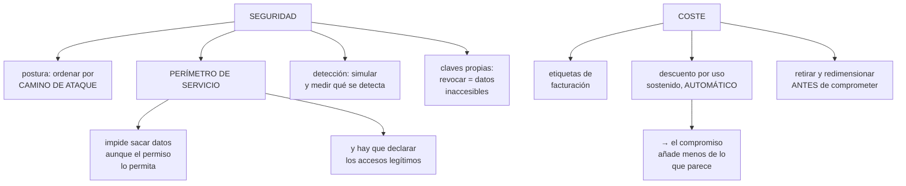

# 239 — SCC, VPC Service Controls, KMS y FinOps

> [← Clase anterior](../../part-19-gcp-production-architecture/238-cloud-operations-trace-y-opentelemetry/README.md) · [Índice de la parte](../README.md) · [Clase siguiente →](../../part-19-gcp-production-architecture/240-proyecto-cloudshop-productivo-en-google-cloud/README.md)

**Parte:** 19 — Google Cloud: arquitectura de datos y operación en producción<br>
**Nivel:** avanzado · **Horas estimadas:** 4<br>
**Laboratorio:** `security` · **Estado:** `EXECUTABLE_CORE`

## 🎯 Propósito

Cerrar la operación de Google Cloud con la seguridad y el coste, que aquí tienen dos piezas propias: **el perímetro de servicio, que es el control que impide sacar datos aunque los permisos lo permitan, y el modelo de descuentos automáticos, que cambia el cálculo de los compromisos**. La clase cubre la postura y la detección con la disciplina de la clase 226, y el control de coste con la de la 214.

## 📚 Resultados de aprendizaje

Al finalizar podrás:

1. **Priorizar** los hallazgos de seguridad por alcance y por camino de ataque.
2. **Aplicar** perímetros de servicio y entender qué cierran.
3. **Gestionar** claves de cifrado propias donde aportan.
4. **Atribuir** el coste y aprovechar los descuentos automáticos.
5. **Comprometer** capacidad solo tras retirar y redimensionar.

## 🧩 Conceptos centrales

| Concepto | Comprensión verificable |
|---|---|
| `perímetro de servicio` | Frontera que restringe qué API pueden usarse hacia dentro y hacia fuera de un grupo de proyectos. |
| `camino de ataque` | Secuencia de pasos desde un punto expuesto hasta un dato valioso. Ordena la prioridad. |
| `clave gestionada por el cliente` | Clave de cifrado bajo control propio. Permite revocar el acceso a los datos por completo. |
| `descuento por uso sostenido` | Rebaja automática por mantener recursos encendidos, sin compromiso. |
| `compromiso de uso` | Descuento a cambio de un compromiso de gasto o de capacidad durante uno o tres años. |
| `etiqueta de facturación` | Etiqueta que aparece en el desglose de costes. Distinta de las que se usan en condiciones de permiso. |

## 🧠 Modelo mental

Google Cloud combina una jerarquía estricta de recursos con una red global y servicios data-first; proyecto, cuota e IAM forman una unidad operativa.

Aplicado a esta clase, separa siempre cuatro planos: **intención** (qué necesita el usuario),
**configuración** (qué declaramos), **estado observado** (qué existe de verdad) y
**evidencia** (cómo sabemos que cumple). Confundirlos produce diseños que se ven correctos
en un diagrama pero fallan al operar.

## 🗺️ Flujo de razonamiento



## 📖 Desarrollo

### 1. Postura y caminos de ataque

La disciplina es la de la clase 226 y aquí hay una herramienta que la hace directa.

```text
LO QUE PRODUCE LA EVALUACIÓN CONTINUA
  hallazgos de configuración: público, sin cifrar, sin
  copias, versión antigua
  hallazgos de identidad: permisos amplios, claves
  hallazgos de vulnerabilidades

Y LO QUE ORDENA EL TRABAJO
  no la gravedad declarada
  sino los CAMINOS DE ATAQUE
  «desde esta máquina expuesta, con esta cuenta de
   servicio, se llega a este conjunto con datos de
   clientes»
  → con la puntuación de exposición calculada

→ y esos caminos concentran más riesgo que cientos de
  hallazgos sueltos                            clase 226
```

Y el orden de trabajo, ya conocido:

```text
1  cerrar los caminos que terminan en datos
2  reducir el alcance de las identidades más amplias
                                                clase 230
3  impedir por política que lo arreglado vuelva
                                                clase 229
4  remediar el resto por lotes                    ley 27
5  aceptar por escrito lo que no compensa      clase 189
```

Y los hallazgos que se repiten en esta nube:

```text
cuentas de servicio con papel de proyecto      clase 230
claves de cuenta de servicio sin caducidad
almacenes con acceso a «todos los usuarios autenticados»
  → que significa cualquier cuenta de Google, no solo la
    organización
  → y es el hallazgo que más sorprende
reglas de cortafuegos con selector por etiqueta clase 229
conjuntos analíticos con acceso al conjunto entero
                                                clase 236
y proyectos sin carpeta, que no reciben políticas
```

Y la comprobación de la detección:

```text
simular técnicas conocidas y medir qué proporción se
detecta
→ es la única medida real                    clase 226
→ y las que no se detecten son la lista de trabajo
```

### 2. El perímetro de servicio

Este es el control propio de esta nube y el que cierra el hueco que dejan los permisos.

```text
EL PROBLEMA QUE RESUELVE
  una identidad con permiso legítimo sobre unos datos puede
  copiarlos a un proyecto de otra organización
  → el permiso lo autoriza
  → la red no lo impide, porque va por la API de la
    plataforma                              clase 200, 231

EL PERÍMETRO
  agrupa proyectos y restringe qué API pueden usarse
  desde fuera hacia dentro     ← quién puede leer
  desde dentro hacia fuera     ← a dónde se puede escribir
  → y una identidad de dentro NO puede escribir en un
    recurso de fuera del perímetro
```

Y lo que hay que hacer para que funcione sin romper nada:

```text
1  DEFINIR el perímetro: qué proyectos y qué servicios
2  MODO DE SIMULACIÓN: registra lo que bloquearía
3  MEDIR semanas
4  DECLARAR los accesos legítimos que cruzan
     reglas de entrada y de salida, por identidad, por
     proyecto y por servicio
5  APLICAR

→ activar sin simular corta integraciones legítimas
  → y es la misma disciplina de las clases 200, 209 y 217
```

Y lo que suele aparecer en la simulación:

```text
herramientas de terceros que leen datos
canalizaciones de otro proyecto
copias hacia un proyecto de análisis
el propio equipo consultando desde su portátil
  → y eso obliga a decidir: ¿se declara o se prohíbe?
```

**Las claves gestionadas por el cliente**, con lo que aportan de verdad:

```text
QUÉ APORTAN
  el control de la clave: revocarla hace los datos
  inaccesibles, incluso para el proveedor
  → y eso es lo que exigen algunos requisitos
                                                clase 177
  rotación bajo control propio
  y registro de cada uso de la clave           clase 238

QUÉ CUESTAN
  operación: rotación, permisos, disponibilidad de la clave
  y si la clave se pierde o se revoca por error, los datos
  son irrecuperables
  → esa es una consecuencia real, no teórica

DÓNDE APLICARLAS
  donde haya requisito o datos sensibles
  no en todo                                     ley 26
```

Y una advertencia operativa:

```text
la clave vive en una región
→ si esa región no está disponible, los datos cifrados con
  ella tampoco
→ y eso entra en el cálculo del techo de disponibilidad
                                                clase 185
```

### 3. Coste: los descuentos que ya se aplican

Aquí hay una diferencia que cambia el cálculo de los compromisos.

```text
DESCUENTO POR USO SOSTENIDO
  se aplica AUTOMÁTICAMENTE por mantener recursos
  encendidos durante el mes
  → sin compromiso, sin contratar nada
  → y llega a ser apreciable

Y LA CONSECUENCIA
  el compromiso de uso añade descuento SOBRE lo ya
  descontado
  → el ahorro incremental es menor de lo que sugiere el
    porcentaje anunciado
  → y hay que calcularlo con las cifras propias, no con el
    porcentaje del catálogo               clase 227
```

Y los tipos de compromiso:

```text
POR GASTO
  se compromete una cantidad por hora
  + flexible: se aplica a lo que haya
  − descuento menor

POR RECURSO
  se compromete una cantidad de CPU y memoria en una región
  + descuento mayor
  − rígido: si se cambia de región o de familia, se pierde

→ y el orden de la clase 227 sigue valiendo
  retirar → redimensionar → apagar → y ENTONCES comprometer
```

**La atribución**, con la particularidad de las etiquetas:

```text
HAY DOS MECANISMOS DE ETIQUETADO
  uno aparece en el desglose de FACTURACIÓN
  otro sirve para CONDICIONES de permiso y para políticas
                                          clases 229, 230
  → y no son intercambiables
  → usar el equivocado hace que el gasto no se atribuya

Y LA JERARQUÍA AYUDA
  el desglose por PROYECTO es directo y limpio
  → y por eso la separación por proyecto de la clase 229
    es también una decisión de atribución
```

Y el resto del método, que es el de la clase 214:

```text
etiquetas obligatorias en la creación, por política
presupuestos por proyecto, sobre previsión, con acción en
  no producción
detección de anomalías por servicio y por dueño
retirada automática de lo ocioso: apagar antes de borrar
y coste por unidad de negocio
```

Y las partidas que sorprenden en esta nube:

```text
consultas del almacén analítico              clase 236
registros de acceso a datos                  clase 238
almacenamiento de mensajes sin confirmar     clase 237
tráfico entre zonas y entre regiones
mínimos de capacidad de las bases distribuidas clase 235
y los proyectos sin uso que nadie retira       ley 25
```

### 4. El ritmo, y lo que se degrada solo

Coste y seguridad comparten la propiedad de degradarse sin intervención, y esta clase cierra la parte con el mismo calendario de la 227.

```text
SEMANAL
  anomalías de coste abiertas
  hallazgos críticos nuevos
  recursos ociosos retirados

MENSUAL
  coste por unidad de negocio y su tendencia
  cobertura y utilización de compromisos
  proyectos sin uso
  y hallazgos por camino de ataque

TRIMESTRAL
  simulación de técnicas y proporción detectada clase 226
  prueba del acceso de emergencia            clase 230
  revisión de accesos y de exenciones
  y un experimento de resiliencia            clase 227

ANUAL
  ejercicio de pérdida de región             clase 215
  revisión de las decisiones registradas     clase 190
```

Y las señales que dicen si está sano:

```text
SEGURIDAD
  caminos de ataque que terminan en datos      → cero
  proporción de técnicas simuladas detectadas
  claves de cuenta de servicio                 → cero
  proyectos sin carpeta                        → cero
  y perímetros con reglas de excepción sin fecha → cero

COSTE
  gasto atribuido                              > 90 %
  coste por unidad de negocio                  tendencia
  utilización de compromisos                   > 95 %
  proyectos sin uso                            tendencia a
                                               cero
```

Y una comprobación honesta, la misma de la clase 226:

```text
¿cuántos incidentes detectó el centro y cuántos se
detectaron por otra vía?
→ y las vías de siempre: una factura, un tercero, un
  inventario, una persona
```

Y la lista de comprobación de la clase:

```text
☐ los hallazgos se ordenan por camino de ataque
☐ no hay caminos que terminen en datos sensibles
☐ no hay almacenes con acceso a todos los usuarios
  autenticados
☐ hay perímetros de servicio sobre los proyectos con datos
☐ los perímetros se simularon antes de aplicar
☐ las reglas de excepción del perímetro tienen dueño y
  fecha
☐ las claves propias están donde hay requisito, y su
  región entra en el cálculo de disponibilidad
☐ las etiquetas de facturación son las correctas
☐ el gasto atribuido supera el 90 %
☐ se retiró y redimensionó antes de comprometer
☐ el descuento incremental del compromiso se calculó sobre
  el ya aplicado
☐ hay presupuestos con acción y detección de anomalías
☐ se simulan técnicas y se publica la proporción detectada
☐ existe el calendario semanal, mensual, trimestral y anual
```

Y el cierre que enlaza con la clase siguiente: con todo lo de esta parte montado, queda ponerlo junto en un sistema productivo, compararlo con las otras dos nubes y cerrar la parte. Es la materia de la clase 240.

## 🔬 Ejemplo trabajado

**CloudShop cierra la operación de Google Cloud. Lo que sigue son los almacenes accesibles por cualquier cuenta de Google, el perímetro que cortó una integración legítima, y el cálculo de compromiso que resultó dar mucho menos de lo anunciado.**

**La postura, ordenada por camino de ataque:**

```text
hallazgos abiertos                                 2.140
puntuación de exposición: los 5 caminos principales

1  máquina con IP externa y puerto de administración
   abierto
   → su cuenta de servicio tiene papel de proyecto
     → alcanza el almacén de copias y la base de pedidos
   pasos: 3 · datos al final: 2,3 M de registros

2  almacén de exportaciones con acceso a «todos los
   usuarios autenticados»
   → cualquier cuenta de Google del mundo podía listarlo y
     descargarlo
   → contenía extractos diarios de pedidos desde 2023
   pasos: 1 · datos: 41 meses de extractos

3  cuenta de servicio de la canalización con papel de
   organización                              clase 230

4  conjunto analítico con acceso al conjunto entero para
   41 personas                               clase 236

5  clave de cuenta de servicio de un consultor externo,
   activa desde 2023                            ley 25
```

Y el segundo merece detalle:

```text
«todos los usuarios autenticados» NO significa «todos los
de la organización»
  significa cualquiera con una cuenta de Google

→ el equipo lo había configurado creyendo lo primero
→ y la política de organización que lo impide existía
  desde la clase 229, pero el almacén se había creado ANTES
                                                    ley 27

cuánto llevaba así                            19 meses
accesos externos registrados            no se sabía
  → el registro de acceso a datos no estaba activo en ese
    almacén                                   clase 238
  → se activó, y en 30 días: 0 accesos externos
  → lo cual no dice nada de los 19 meses anteriores
```

**El perímetro de servicio, con su simulación.**

```text
definición
  proyectos: los 14 de producción con datos
  servicios restringidos: almacenamiento, almacén
  analítico, bases, gestor de secretos y claves

modo de simulación, 4 semanas
  accesos que se bloquearían                     41.200
    legítimos                                       610
    del propio perímetro                         40.400
    NO IDENTIFICADOS                                190  ←

los 610 legítimos
  · canalización de despliegue desde el proyecto de
    plataforma
  · herramienta de visualización de un tercero
  · exportación nocturna al proyecto de análisis
  · 4 personas consultando desde su portátil

los 190 no identificados
  · 140 de una cuenta de servicio de un proyecto que se
    creía retirado en 2024                       ley 25
  ·  38 de una herramienta de un proveedor cuyo contrato
    había terminado
  ·  12 de una dirección que resultó ser un entorno de
    pruebas de un socio, no declarado

→ los 190 se cortaron a propósito
→ y los 610 se declararon como reglas de entrada y salida,
  con dueño y fecha de revisión
```

Y el corte que ocurrió igualmente:

```text
al aplicar, una integración se rompió
  el equipo de finanzas exportaba un informe mensual desde
  una hoja de cálculo conectada
  → esa conexión no había aparecido en las 4 semanas de
    simulación porque es MENSUAL y cayó fuera de la
    ventana

→ duración del corte                           2 días
→ corrección: regla declarada
→ y lección: la ventana de simulación debe cubrir el ciclo
  completo de negocio                          clase 167
```

**Las claves propias, decididas por caso:**

```text
dónde se aplicaron
  almacén con datos de clientes
  conjunto analítico con datos personales
  copias de seguridad
  → los tres con requisito contractual del mayor cliente

dónde NO
  almacenes de imágenes y artefactos
  registros de aplicación
  → sin requisito y con coste de operación

y el efecto sobre disponibilidad, calculado
  la clave vive en una región
  → se configuró con réplica en la segunda región
  → sin eso, el techo del flujo habría bajado  clase 185

y la prueba negativa
  revocar el acceso a la clave en preproducción
  → los datos pasaron a ser inaccesibles, correctamente
  → y la restauración tardó 11 minutos
  → procedimiento escrito y probado               ley 22
```

**El cálculo de compromiso, que dio menos de lo anunciado.**

```text
gasto de cómputo                            8.400 €/mes

el descuento por uso sostenido YA aplicado
  precio de lista                          11.900 €
  descuento automático                     -3.500 €
  gasto real                                8.400 €

la oferta de compromiso a 1 año
  descuento anunciado sobre lista              37 %
  → parecía un ahorro de 4.400 €/mes

el cálculo real
  con compromiso, sobre lista               7.500 €
  ahorro frente a los 8.400 actuales          900 €/mes
  → no 4.400 €

→ porque el descuento automático ya estaba aplicado
→ y comparar con el precio de lista es el error
                                                clase 227
```

Y el orden que se siguió antes de comprometer:

```text
1  RETIRAR   71 proyectos sin actividad      clase 229
             -3.100 €/mes
2  REDIMENSIONAR  peticiones de recursos del clúster
                                             clase 234
             -1.760 €/mes
3  APAGAR    entornos no productivos por horario
             -1.900 €/mes
4  y ENTONCES comprometer, sobre la base estable
             -610 €/mes

→ y el compromiso se hizo POR GASTO, no por recurso
→ motivo: el clúster iba a cambiar de familia
```

**El coste, atribuido:**

```text
al empezar
  gasto atribuido                                  64 %
  y el 36 % restante
    recursos con el tipo de etiqueta EQUIVOCADO   2.100 €
      → se habían puesto las de condiciones de permiso,
        que no aparecen en el desglose
    servicios compartidos                         1.900 €
    tráfico entre zonas                           1.400 €

tras corregir el tipo de etiqueta y repartir lo compartido
  gasto atribuido                                  95 %
```

**La detección, medida:**

```text
simulación de 14 técnicas
  detectadas la primera vez                     9 de 14
  las 5 que no
    · exfiltración al almacén de otra organización
      → la detectó el PERÍMETRO, no la regla
      → y se aceptó así
    · suplantación de una cuenta privilegiada
      → regla escrita
    · creación de una clave de cuenta de servicio
      → la impide la política; regla añadida igualmente
    · acceso a datos desde una identidad inusual
      → dependía del registro de acceso a datos, ahora
        activo
    · enumeración de proyectos
      → umbral corregido

segunda simulación                           13 de 14
```

**El resultado:**

```text                                        antes     después
caminos de ataque que terminan en datos         5           0
almacenes accesibles por cualquier cuenta       3           0
perímetros de servicio                          0           2
accesos no identificados que cruzaban         190           0
claves de cuenta de servicio                   12           3
gasto atribuido                              64 %         95 %
coste mensual                            21.400 €    14.030 €
utilización del compromiso                     —          97 %
técnicas simuladas detectadas               9/14        13/14
```

**La lección que esta clase deja**: un almacén con extractos de pedidos de cuarenta y un meses era descargable por **cualquier persona con una cuenta de Google**, porque «todos los usuarios autenticados» no significa lo que parece, y la política que lo impedía se creó después que el almacén. Y el compromiso que prometía un 37 % de descuento **daba novecientos euros al mes y no cuatro mil cuatrocientos**, porque el descuento automático ya estaba aplicado: comparar con el precio de lista es el error.

## 🧪 Laboratorio guiado

Ejecuta desde la raíz:

```bash
python classes/part-19-gcp-production-architecture/239-scc-vpc-service-controls-kms-y-finops/lab.py
```

El laboratorio selecciona el motor de práctica **`security`** y produce
`lab_result.json`. El escenario, sus comprobaciones y el artefacto esperado corresponden a
esta clase; no requiere credenciales y deja explícito qué debe revalidarse en un sandbox real.

1. Lee `exercise.steps` y formula una predicción antes de ejecutar.
2. Ejecuta la práctica y verifica todos los elementos de `checks`.
3. Provoca el caso de `negative_test` y explica la señal observada.
4. Materializa `gcp-security-finops` en `evidence/` usando la plantilla indicada.
5. Para proveedor real, sigue `sandbox.requires`, registra costo y ejecuta `destroy`.

### Evidencia esperada

El artefacto principal es un control con amenaza, mitigación y evidencia. Además, la entrega debe incluir el comando ejecutado,
la salida estructurada y una conclusión que no exceda lo observado.

## 🏆 Reto verificable

Construye **`gcp-security-finops`** para el caso CloudShop. Incluye una alternativa descartada,
un supuesto que pueda falsarse, una prueba de fallo y una decisión de rollback.

## ✅ Criterio de aceptación

- [ ] `lab.py` termina con código 0 y genera JSON válido.
- [ ] La entrega conecta al menos tres requisitos con mecanismos verificables.
- [ ] Existe una prueba positiva y una prueba negativa con evidencia.
- [ ] Seguridad, costo y operación aparecen como decisiones, no como anexos.
- [ ] Se declara una limitación y una condición que obligaría a revisar el diseño.
- [ ] Otra persona puede repetir el recorrido sin conocimiento tácito.

## ⚠️ Errores frecuentes

| Síntoma | Causa probable | Corrección |
|---|---|---|
| Un almacén resulta accesible desde fuera de la organización | Se concedió a «todos los usuarios autenticados», que significa cualquier cuenta del proveedor | Prohíbelo por política, revisa lo existente porque la política no actúa hacia atrás, y activa el registro de acceso a datos allí. |
| Una identidad legítima copia datos a otra organización | El permiso lo autoriza y la red no lo impide porque va por la API | Aplica perímetros de servicio sobre los proyectos con datos, simulando antes y declarando los accesos legítimos. |
| Aplicar el perímetro corta una integración que no apareció en la simulación | La ventana de simulación no cubrió un proceso mensual | Simula durante un ciclo completo de negocio antes de aplicar. |
| El ahorro del compromiso es mucho menor de lo anunciado | Se comparó con el precio de lista y el descuento automático ya estaba aplicado | Calcula el ahorro incremental sobre el gasto real actual, no sobre la tarifa de catálogo. |
| Parte del gasto no aparece atribuido pese a etiquetar | Se usó el tipo de etiqueta que sirve para condiciones de permiso y no el de facturación | Comprueba qué mecanismo aparece en el desglose y usa ese; los dos no son intercambiables. |
| Los datos cifrados con clave propia dejan de estar disponibles | La clave vive en una región que no está disponible | Replica la clave y cuenta su disponibilidad en el cálculo del techo del flujo. |

## 🛡️ Seguridad, ética y costo

Trabaja con cuentas propias o sandboxes autorizados. No publiques secretos, identificadores
reales ni datos personales. Antes de crear recursos pagos define presupuesto, etiquetas y
comando de destrucción; después verifica que no queden recursos huérfanos. Los ejemplos
locales enseñan contratos, pero no certifican cumplimiento ni disponibilidad de producción.

## ❓ Preguntas de comprobación

1. ¿Qué ordena la prioridad de los hallazgos de seguridad?
2. ¿Qué cierra un perímetro de servicio que no cierra ni el permiso ni el cortafuegos?
3. ¿Qué hay que comprobar antes de aplicar un perímetro y durante cuánto tiempo?
4. ¿Por qué el descuento por compromiso da menos de lo que anuncia el porcentaje?
5. ¿Qué efecto tiene sobre la disponibilidad usar claves de cifrado propias?

## 🔗 Referencias

- Google Cloud (2025). *Security Command Center: attack path simulation*. <https://cloud.google.com/security-command-center/docs/attack-exposure-learn>
- Google Cloud (2025). *VPC Service Controls: dry run mode*. <https://cloud.google.com/vpc-service-controls/docs/dry-run-mode>
- Google Cloud (2025). *Customer-managed encryption keys*. <https://cloud.google.com/kms/docs/cmek>
- Google Cloud (2025). *Sustained use and committed use discounts*. <https://cloud.google.com/compute/docs/sustained-use-discounts>
- Google Cloud (2025). *Billing labels and cost breakdown*. <https://cloud.google.com/billing/docs/how-to/bq-examples>
- Documentación oficial vigente del servicio implementado; registra URL y fecha de consulta.

---

> [Evaluación](assessment.md) · [Contrato de clase](lesson.yaml) · [Índice de la parte](../README.md)
