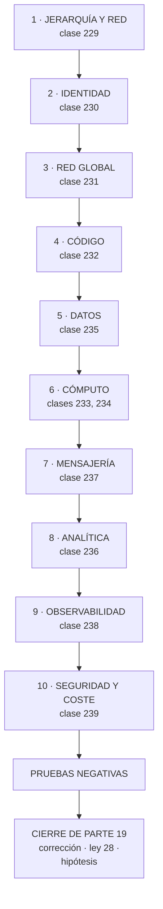

# 240 — Proyecto: CloudShop productivo en Google Cloud

> [← Clase anterior](../../part-19-gcp-production-architecture/239-scc-vpc-service-controls-kms-y-finops/README.md) · [Índice de la parte](../README.md) · [Clase siguiente →](../../part-20-cloud-data-ai-platforms/241-lakehouse-warehouse-mesh-y-contratos-de-datos/README.md)

**Parte:** 19 — Google Cloud: arquitectura de datos y operación en producción<br>
**Nivel:** avanzado · **Horas estimadas:** 8<br>
**Laboratorio:** `capstone` · **Estado:** `EXECUTABLE_CORE`

## 🎯 Propósito

Poner en producción el sistema completo de CloudShop en Google Cloud, compararlo con las otras dos nubes y cerrar la parte 19. La clase da el orden, el entregable y las pruebas negativas; corrige las cinco predicciones de la clase 228 —tres acertadas, una incompleta y una fallada—, actualiza el recuento de leyes, añade la ley 28 y escribe la hipótesis de la parte 20.

## 📚 Resultados de aprendizaje

Al finalizar podrás:

1. **Construir** el sistema completo en el orden que evita rehacer.
2. **Comprobar** con las pruebas negativas de toda la parte.
3. **Comparar** las tres nubes con cifras y sacar conclusiones defendibles.
4. **Corregir** las cinco predicciones de la clase 228 con evidencia.
5. **Escribir** la hipótesis de la parte 20 en forma refutable.

## 🧩 Conceptos centrales

| Concepto | Comprensión verificable |
|---|---|
| `ley 28` | Donde se paga por uso, cada valor por defecto es una factura; y nadie lo revisa porque no parece una decisión. |
| `error de traslado` | Fallo que viene de dar por válida una suposición de otra nube. La causa dominante de esta parte. |
| `coste de operar varias nubes` | Suma de modelos de gobierno, permisos, red, observabilidad y calendarios. No es proporcional al número. |
| `equivalencia conceptual` | Correspondencia de ideas entre proveedores. Alta; la operativa es la que difiere. |
| `prueba negativa de parte` | Comprobación acumulada de las once clases, ejecutada sobre el sistema entero. |
| `hipótesis de parte` | Afirmación refutable escrita antes de estudiar, que la parte siguiente corrige con evidencia. |

## 🧠 Modelo mental

Google Cloud combina una jerarquía estricta de recursos con una red global y servicios data-first; proyecto, cuota e IAM forman una unidad operativa.

Aplicado a esta clase, separa siempre cuatro planos: **intención** (qué necesita el usuario),
**configuración** (qué declaramos), **estado observado** (qué existe de verdad) y
**evidencia** (cómo sabemos que cumple). Confundirlos produce diseños que se ven correctos
en un diagrama pero fallan al operar.

## 🗺️ Flujo de razonamiento



## 📖 Desarrollo

### 1. El encargo, el orden y las pruebas

**El encargo.** Llevar a producción la plataforma de pedidos de CloudShop en Google Cloud, con usuarios reales, guardia, presupuesto y continuidad comprobada.

**El orden**, por coste de cambio:

```text
1  JERARQUÍA Y RED COMPARTIDA                    clase 229
   carpetas por entorno, proyectos por carga
   políticas de organización en auditoría antes de aplicar
   → y con plan de remediación de lo existente    ley 27

2  IDENTIDAD                                     clase 230
   sin claves de cuenta de servicio
   asignaciones en el ámbito del recurso, con condiciones

3  RED GLOBAL                                    clase 231
   una red por entorno, salida cerrada, zonas privadas
   asociadas en el proyecto anfitrión

4  CÓDIGO                                        clase 232
   estado protegido, validación de políticas y coste antes
   de aplicar

5  DATOS                                         clase 235
   familia por patrones y por coste base; clave que reparte

6  CÓMPUTO                            clases 233, 234
   servicio de contenedores por defecto; clúster donde hace
   falta

7  MENSAJERÍA                                    clase 237
   un tema, una suscripción por consumidor, idempotencia

8  ANALÍTICA                                     clase 236
   particionado, límites de consulta y acceso por columna

9  OBSERVABILIDAD                                clase 238
   instrumentación estándar, objetivos declarados,
   auditoría acotada

10 SEGURIDAD Y COSTE                             clase 239
   perímetros, caminos de ataque, compromisos tras retirar
```

**Las pruebas negativas de la parte:**

```text
☐ crear un recurso sin etiquetas obligatorias
☐ crear una clave de cuenta de servicio
☐ suplantar una cuenta sin permiso
☐ acceder fuera de una condición de recurso o de tiempo
☐ activar un papel privilegiado sin aprobación
☐ entrar con el acceso de emergencia
☐ resolver un nombre con conexión privada desde cada
  proyecto
☐ sacar datos a un proyecto de otra organización
☐ desplegar algo que incumple una política
☐ borrar el estado y restaurarlo
☐ ejecutar el plan sin cambios y comprobar que sale vacío
☐ escribir con clave secuencial y observar el reparto
☐ consultar una tabla grande sin filtro de partición
☐ consultar una columna sensible sin la etiqueta
☐ enviar el mismo mensaje 50 veces
☐ dejar un mensaje en el tema de fallidos y esperar alerta
☐ obtener la identidad desde otro espacio de nombres
☐ perder una región y cronometrar
☐ provocar la condición de cada alerta
☐ desplegar el entorno de cero en un proyecto vacío
```

Y los criterios de evaluación, con el peso donde importa:

```text                                                     peso
1  ningún proyecto sin carpeta ni sin dueño                2
2  cero claves de cuenta de servicio sin excepción         3
3  el alcance de cada identidad está medido                3
4  las zonas privadas resuelven desde todos los proyectos  3
5  hay perímetro de servicio sobre los proyectos con datos 3
6  la clave de las tablas distribuidas reparte             2
7  hay límite de bytes por consulta                        3
8  el acceso a datos personales es por columna             3
9  la instrumentación es estándar                          2
10 hay objetivos declarados con alerta por ritmo           2
11 la lista de valores por defecto cambiados es explícita  3
12 las pruebas negativas se ejecutaron y hay fallos
   publicados                                              3
```

### 2. Cierre de la parte 19: corrección de las cinco predicciones

**Las cinco predicciones de la clase 228, corregidas con la evidencia de las clases 229 a 239.**

```text
1. «la tercera nube confirmará la equivalencia conceptual y
    diferirá en lo operativo; y lo que más costará no será
    aprender lo distinto sino DESAPRENDER lo de las dos
    anteriores»

   CORRECTA, y con cinco casos documentados. Crear una red
   por proyecto; asumir que las reglas de cortafuegos son
   por subred; confundir la barrera con el permiso; poner la
   concurrencia en 1 por trasladar el modelo de funciones; y
   usar una clave autoincremental en un almacén repartido
   por rangos. El más puro fue el de las zonas privadas: el
   equipo HABÍA SUFRIDO ese problema en la nube anterior, lo
   conocía, y lo repitió porque el sitio donde se asocia la
   zona es distinto.

2. «la jerarquía de proyectos y la red compartida volverán a
    condicionar todo, y el error frecuente será el CONTRARIO:
    demasiados proyectos»

   CORRECTA y literal. 214 proyectos, 189 colgando de la
   organización sin carpeta, 71 sin actividad en 90 días,
   120 sin dueño. Y uno de los inactivos contenía una copia
   de la tabla de clientes legible por cualquier cuenta,
   desde hacía 19 meses.

3. «la identidad volverá a ser el eje y el error más
    frecuente volverá a ser el ámbito amplio»

   CORRECTA E INCOMPLETA, y lo que falta es lo más útil. El
   ámbito amplio estaba: 18 asignaciones en la organización
   y 140 en carpetas. Pero el hallazgo mayor fue otro:
   eliminar 341 claves de cuenta de servicio costó cuatro
   meses y NO redujo el alcance ni un punto. Quitar
   credenciales y reducir alcance son dos trabajos
   distintos, y confundirlos hace creer que el primero
   resuelve el segundo. Esa distinción no estaba en la
   predicción.

4. «los valores por defecto volverán a estar mal elegidos, y
    aquí fallarán sobre todo en RED»

   FALLADA en la segunda mitad, y el patrón del fallo
   importa. Los valores por defecto de red estaban mal —la
   salida permitida, el selector por etiqueta—, pero los que
   costaron dinero de verdad fueron otros: consultar sin
   filtro de partición y con todas las columnas, 4.100 €/mes;
   activar la auditoría de acceso a datos en todo, ×6 la
   factura de registros; el indexado automático de
   documentos; la concurrencia; y una suscripción abandonada
   reteniendo 41 millones de mensajes. Es la SEGUNDA VEZ que
   fallamos en dónde fallarán los valores por defecto: en la
   clase 228 predijimos identidad para Azure y era coste y
   observabilidad; aquí predijimos red y era analítica y
   auditoría. El patrón que no habíamos visto es que los
   valores por defecto caros están donde se factura por uso,
   no donde la nube es característica.

5. «los problemas serán otra vez de las leyes 25, 15 y 22.
    Lo refutable: la proporción de hallazgos que detecte una
    comprobación automática y periódica será MAYOR que en
    las partes 17 y 18»

   CORRECTA, y medible. En esta parte, las comprobaciones
   automáticas detectaron: 4 proyectos con zonas sin
   asociar, 23 casos de deriva, 74 despliegues que
   incumplían política, 190 accesos no identificados que
   cruzaban el perímetro, 5 caminos de ataque y 5 técnicas
   no detectadas. Frente a las partes anteriores, donde casi
   todo lo grave lo encontraron inventarios o facturas.
   PERO el matiz cualitativo se mantiene: los tres hallazgos
   más graves de esta parte —el almacén público de 19 meses,
   la suscripción de 41 millones de mensajes y las 41
   personas con acceso a datos personales— los encontraron
   un inventario, una factura y otro inventario. Las
   comprobaciones detectan más cosas; las peores siguen
   apareciendo al mirar.
```

**Marcador: tres correctas, una incompleta, una fallada.**

### 3. Recuento de leyes, ley 28 e hipótesis de la parte 20

**El recuento de leyes, cerrada la parte 19.**

```text
ley 13  lo que no se mira deja de funcionar en silencio        55
ley 15  la señal existe y nadie la mira                        44
ley 22  un procedimiento nunca ejecutado no funciona           39
ley 14  el coste se decide al crear, no al pagar               34
ley 16  un control que estorba se rodea                        32
ley 20  lo que no tiene dueño se filtra y se desperdicia       31
ley 21  el acoplamiento vive en quién escribe                  25
ley 25  lo provisional sobrevive a su motivo                   24
ley 26  el valor por defecto sirve a la demostración           19
ley 23  la capacidad la limita lo que ya se mantiene           19
ley 24  lo que no está en el diagrama no se analiza            13
ley 17  se optimiza la medida, no el objetivo                  13
ley 19  la compensación hace invisible el fallo                10
ley 27  un control solo actúa sobre lo que cambia               9
ley 18  lo asíncrono traslada la garantía, no la elimina        9
```

Y la parte 19 obliga a escribir la ley que explica el fallo de la predicción 4:

```text
LEY 28
  donde se paga por uso, cada valor por defecto es una
  factura; y nadie lo revisa porque no parece una decisión

apariciones en esta parte                                      5
  clase 236   consultar sin filtro de partición y con todas
              las columnas: 4.100 €/mes en tres paneles
  clase 238   auditoría de acceso a datos activada en todo:
              la factura de registros ×6
  clase 237   una suscripción sin consumidor reteniendo
              41 M de mensajes: 1.520 €/mes de
              almacenamiento
  clase 235   indexado automático de todos los campos de un
              documento
  clase 233   concurrencia 1 por instancia: 2.900 €/mes

y lo que la distingue de la ley 26
  la 26 dice que el valor inicial está elegido para que la
  demostración funcione
  la 28 dice DÓNDE duele: en los servicios que facturan por
  uso, un valor por defecto no es una configuración: es una
  decisión de gasto continuo
  → y por eso pasa desapercibida: nadie revisa una casilla
    de un asistente pensando en la factura del año que
    viene                                          ley 14
```

**La hipótesis de la parte 20** (clases 241 a 252, plataformas de datos e IA), escrita antes de estudiarla:

```text
1. la parte 20 volverá a demostrar lo de la clase 175: en
   las cargas de datos e IA el problema dominante no será el
   modelo ni el cómputo, será el DATO —su origen, su
   permiso, su forma y quién lo escribe—; y las leyes
   dominantes serán la 21 y la 14

2. de todo lo que se monte, lo que más problemas producirá
   no será entrenar ni servir modelos, sino la ORQUESTACIÓN
   y la calidad: trabajos que fallan sin que nadie los mire
   y datos que llegan mal sin que nada lo detecte
                                              leyes 13, 15

3. los contratos de datos fracasarán por la misma razón que
   los controles: si publicar un dato con contrato cuesta
   más que publicarlo sin él, se publicará sin él  ley 16

4. en la parte de IA, la evaluación será lo que más se
   omita: se medirá la calidad del modelo en el laboratorio
   y no en producción, y la deriva se descubrirá por una
   queja, no por una señal                          ley 22

5. y una refutable con cifra: **el coste de las cargas de IA
   estará dominado por la inferencia y no por el
   entrenamiento, en una proporción de al menos tres a uno**;
   y dentro de la inferencia, por peticiones que no
   necesitaban un modelo
```

Y el cierre de la parte 19: **de once clases, los tres hallazgos más graves los encontraron un inventario, una factura y otro inventario**, y ninguno una alerta. La parte 20 sube una capa —a las plataformas de datos e inteligencia artificial, por encima de cualquier proveedor concreto— y empieza por la arquitectura de datos y sus contratos. Es la clase 241.

### 4. Comparar las tres nubes

Con el mismo sistema montado tres veces, se pueden defender conclusiones.

```text
LO QUE RESULTÓ EQUIVALENTE EN LAS TRES
  el techo de disponibilidad y su aritmética   clase 185
  la teoría de colas y la concurrencia         clase 186
  la consistencia decidida por operación       clase 187
  la idempotencia y los mensajes fallidos      clase 210
  el despliegue escalonado con vuelta atrás
  la estructura del código por ciclo de vida
  el orden de implantar un control: medir, avisar, aplicar
  y las pruebas negativas, una a una

LO QUE NO
  el modelo de gobierno y su alcance
  el modelo de permisos y sus ámbitos
  la red: regional frente a global
  la observabilidad y qué viene activado
  y lo que cada una factura por uso              ley 28
```

Y la comparación medida:

```text                              AWS      Azure      Google
p99 del flujo de compra         412 ms    438 ms     395 ms
disponibilidad observada       99,86 %   99,84 %    99,88 %
coste mensual                 16.700 €  17.400 €   15.900 €
coste por pedido               0,046 €   0,051 €    0,044 €
valores por defecto cambiados       24        19         21
pruebas negativas fallidas       7/19      8/19       6/20
tiempo hasta producción      9 semanas 7 semanas  6 semanas
líneas de infraestructura       ~4.100    ~3.800     ~3.400
conmutación de región         12 min 40  10 min 40   8 min 15
equipo dedicado                   2,1       2,4        1,9
```

Y las cuatro conclusiones que se pueden defender:

```text
1  EL COSTE DE UN SISTEMA EQUIVALENTE ES PARECIDO
   la diferencia entre la más cara y la más barata es del
   9 %, dentro de lo que cambia una decisión de diseño
   → elegir nube por precio de lista es un error
                                          clases 216, 228

2  EL TIEMPO HASTA PRODUCCIÓN BAJA CON CADA REPETICIÓN
   9, 7 y 6 semanas
   → y no por la nube: por el método
   → lo que se traslada bien es el ORDEN, no la
     configuración

3  LO QUE MÁS DIFIERE ES LO QUE MÁS CUESTA APRENDER
   el modelo operativo: gobierno, permisos, red y
   observabilidad
   → tres meses en cada nube nueva
   → y ese es el coste real de la multinube    clase 157

4  EL ERROR DOMINANTE AL AÑADIR UNA NUBE NO ES LA
   IGNORANCIA: ES EL TRASLADO
   → cinco casos documentados en esta parte
   → y la contramedida es un procedimiento, no un curso:
     al empezar con un servicio, comprobar explícitamente
     qué se hereda, qué viene activado y qué se propaga
                                                clase 229
```

Y la lista de comprobación de la clase:

```text
☐ el sistema se construyó en el orden por coste de cambio
☐ hay lista explícita de valores por defecto cambiados
☐ el alcance de cada identidad está medido
☐ los perímetros están simulados un ciclo completo
☐ las 20 pruebas negativas se ejecutaron y hay fallos
  publicados
☐ el entorno se despliega de cero desde el código
☐ el coste está atribuido por encima del 90 %
☐ hay comparación con las otras nubes, con cifras
☐ está escrito lo que no se hace
```

Y el cierre que enlaza con la clase siguiente: la parte 20 deja de hablar de proveedores y sube a las plataformas de datos e inteligencia artificial, que se montan sobre cualquiera de las tres. Empieza por la arquitectura de datos y sus contratos, en la clase 241.

## 🔬 Ejemplo trabajado

**El sistema de CloudShop en producción en Google Cloud. Lo que sigue es la lista de valores por defecto cambiados, el resultado de las veinte pruebas negativas —de las que fallaron seis— y la comparación final de las tres nubes.**

**La lista de valores por defecto cambiados:**

```text
servicio            por defecto              cambiado a
────────────────────────────────────────────────────────────
cortafuegos         salida permitida         denegada, con
                                             permitidos
cortafuegos         selector por etiqueta    por cuenta de
                                             servicio
red                 subredes automáticas     personalizadas
proyecto            cuenta de servicio       una por carga
                    por defecto
almacenamiento      sin registro de acceso   activado donde
                                             hay datos
almacén analítico   sin límite de bytes      200 GB por
                                             consulta
almacén analítico   tablas sin partición     particionadas y
                                             agrupadas
almacén analítico   sin exigir filtro        exigido
documentos          indexa todos los campos  4 de 34
documentos          reglas permisivas de     reglas probadas
                    ejemplo                  con simulador
servicio de
  contenedores      concurrencia por         40, medida
                    defecto usada como 1
servicio de
  contenedores      sin conector de red      con conector y
                                             salida por la red
servicio de
  contenedores      tiempo de espera alto    3× el p99
mensajería          sin tema de fallidos     con tema y
                                             suscripción
mensajería          entrega exactamente una  activa donde el
                    vez desactivada          duplicado cuesta
registros           sin caducidad            30 y 400 días
registros           acceso a datos           activado por
                    desactivado              servicio, acotado
clúster             110 pods por nodo        32, medidos
estado del código   local                    remoto, cifrado,
                                             versionado
Spanner             clave secuencial         aleatoria
compromisos         comparados con lista     con el gasto real

total                                                    21
que funcionaban sin cambiarlos                           21
```

**Las veinte pruebas negativas: seis fallaron.**

```text
✓  crear recurso sin etiquetas                    rechazado
✓  crear clave de cuenta de servicio              rechazado
✓  suplantar sin permiso                          denegado
✗  acceder fuera de una condición de recurso
   → 2 de 11 servicios ignoraban la condición
                                                clase 230
✓  activar papel privilegiado sin aprobación      denegado
✓  acceso de emergencia                           90 s
✗  resolver nombre con conexión privada desde cada proyecto
   → 3 proyectos creados el mes anterior sin zonas
     asociadas: la automatización llegó después   ley 27
✓  sacar datos a otra organización            perímetro lo
                                              impide
✓  desplegar incumpliendo política            falla en
                                              validación
✓  borrar el estado y restaurarlo             4 min
✗  plan sin cambios, vacío
   → 6 recursos con deriva permanente por campos que la
     plataforma ajusta; marcados para ignorar
✓  escribir con clave secuencial              reparto
                                              correcto
✓  consultar sin filtro de partición          rechazado
✗  consultar columna sensible sin etiqueta
   → 1 vista materializada creada antes del etiquetado
     exponía la columna sin control             ley 27
✓  mismo mensaje 50 veces                     1 efecto
✓  mensaje en tema de fallidos → alerta       38 s
✓  identidad desde otro espacio de nombres    denegado
✗  perder una región
   → 8 min 15 s, dentro de lo previsto, pero la clave de
     cifrado propia vivía en una sola región y 2 almacenes
     quedaron inaccesibles                     clase 239
✗  provocar la condición de cada alerta
   → 7 de 45 no llegaron; 4 por umbral, 2 por destino y 1
     por objetivo medido en el servidor         clase 238
✓  desplegar el entorno de cero                61 min
```

Y el análisis de las seis:

```text
tres por la ley 27: recursos creados antes de que existiera
  la comprobación o el etiquetado que los cubriría
dos por controles que no cubrían lo que se creía
  (condiciones ignoradas por 2 servicios, alerta con el
   indicador en el sitio equivocado)
una por una dependencia no contada en el cálculo
  (la región de la clave de cifrado)

→ y el diagnóstico es el mismo de las clases 216 y 228:
  el sistema creció y las comprobaciones no crecieron con él
→ con el añadido de que aquí ya existían las comprobaciones
  y lo que faltó fue ejecutarlas sobre lo creado después
```

**Las cifras del sistema, tras tres meses:**

```text                                     objetivo    medido
p99 del flujo de compra                    < 500 ms    395 ms
disponibilidad observada                     99,8 %    99,88 %
coste mensual                             15.000 €   15.900 €
coste por pedido                            0,050 €    0,044 €
conmutación de región                       15 min    8 min 15
coste atribuido                                90 %      95 %
alertas por turno                             < 2        0,6
técnicas simuladas detectadas                > 90 %    13/14
despliegue del entorno de cero                  —      61 min
```

**La comparación final de las tres nubes**, con lo que costó de verdad:

```text                              AWS      Azure      Google
coste mensual                 16.700 €  17.400 €   15.900 €
coste por pedido               0,046 €   0,051 €    0,044 €
p99 del flujo                   412 ms    438 ms     395 ms
conmutación de región         12 min 40 10 min 40   8 min 15
valores por defecto cambiados       24        19         21
pruebas fallidas                  7/19      8/19       6/20
tiempo hasta producción      9 semanas 7 semanas  6 semanas
meses para aprender el modelo
  operativo                          —         3          3
equipo dedicado                   2,1       2,4        1,9

Y OPERAR LAS TRES A LA VEZ
  equipo dedicado sumado                          6,4
  equipo real necesario                           7,8
  → un 22 % más que la suma, por los cambios de contexto
    y por mantener tres modelos operativos al día
                                                clase 157
```

Y las decisiones que se tomaron con esta comparación:

```text
no migrar nada entre nubes: los tres sistemas funcionan
no operar los tres a la vez para la misma carga
  → CloudShop mantiene AWS como principal, Azure por el
    contrato corporativo y Google para las cargas de datos
    y de IA                                     clase 157
y el criterio escrito
  «cada nube por un motivo declarado; ninguna por
   preferencia»
```

**La lección que este proyecto deja**: veintiún valores por defecto cambiados, **todos los cuales funcionaban**, y los cinco más caros estaban en servicios que facturan por uso. De las seis pruebas negativas fallidas, **tres fueron por recursos creados después de que existiera la comprobación**. Y comparando las tres nubes con el mismo sistema montado bien, la diferencia de coste es del nueve por ciento: **la nube no decide el coste; lo deciden las decisiones de diseño y los valores por defecto que nadie revisa**.

## 🧪 Laboratorio guiado

Ejecuta desde la raíz:

```bash
python classes/part-19-gcp-production-architecture/240-proyecto-cloudshop-productivo-en-google-cloud/lab.py
```

El laboratorio selecciona el motor de práctica **`capstone`** y produce
`lab_result.json`. El escenario, sus comprobaciones y el artefacto esperado corresponden a
esta clase; no requiere credenciales y deja explícito qué debe revalidarse en un sandbox real.

1. Lee `exercise.steps` y formula una predicción antes de ejecutar.
2. Ejecuta la práctica y verifica todos los elementos de `checks`.
3. Provoca el caso de `negative_test` y explica la señal observada.
4. Materializa `cloudshop-gcp` en `evidence/` usando la plantilla indicada.
5. Para proveedor real, sigue `sandbox.requires`, registra costo y ejecuta `destroy`.

### Evidencia esperada

El artefacto principal es un incremento integrado, demostrable y documentado. Además, la entrega debe incluir el comando ejecutado,
la salida estructurada y una conclusión que no exceda lo observado.

## 🏆 Reto verificable

Construye **`cloudshop-gcp`** para el caso CloudShop. Incluye una alternativa descartada,
un supuesto que pueda falsarse, una prueba de fallo y una decisión de rollback.

## ✅ Criterio de aceptación

- [ ] `lab.py` termina con código 0 y genera JSON válido.
- [ ] La entrega conecta al menos tres requisitos con mecanismos verificables.
- [ ] Existe una prueba positiva y una prueba negativa con evidencia.
- [ ] Seguridad, costo y operación aparecen como decisiones, no como anexos.
- [ ] Se declara una limitación y una condición que obligaría a revisar el diseño.
- [ ] Otra persona puede repetir el recorrido sin conocimiento tácito.

## ⚠️ Errores frecuentes

| Síntoma | Causa probable | Corrección |
|---|---|---|
| Al añadir una nube nueva fallan cosas que en las anteriores funcionaban | Se trasladaron suposiciones del modelo operativo anterior | Al empezar con cada servicio, comprueba explícitamente qué se hereda, qué viene activado y qué se propaga; es un procedimiento, no un curso. |
| Los valores por defecto caros pasan desapercibidos | En los servicios que facturan por uso, un valor por defecto es una decisión de gasto que no parece una decisión | Revisa primero los valores por defecto de todo lo que se factura por uso, y estima su coste antes de aceptar el asistente. |
| Las comprobaciones pasan y aparecen huecos en lo creado después | La automatización llegó más tarde que los recursos | Toda automatización nueva se acompaña de una tarea de remediación y de una comprobación periódica sobre lo existente. |
| Se elige nube comparando precios de lista | El coste lo deciden el diseño y los valores por defecto, no el proveedor | Compara el coste del mismo sistema montado bien; la diferencia suele estar dentro del ruido. |
| Operar varias nubes consume más equipo que la suma de las partes | Se cuentan las tecnologías y no los modelos operativos ni los cambios de contexto | Justifica cada nube por un motivo declarado y cuenta el coste operativo real, que es superior a la suma. |
| Una clave de cifrado propia deja datos inaccesibles al perder una región | La clave vive en una región y no entró en el cálculo del techo | Replica la clave y cuenta su disponibilidad como una dependencia dura más. |

## 🛡️ Seguridad, ética y costo

Trabaja con cuentas propias o sandboxes autorizados. No publiques secretos, identificadores
reales ni datos personales. Antes de crear recursos pagos define presupuesto, etiquetas y
comando de destrucción; después verifica que no queden recursos huérfanos. Los ejemplos
locales enseñan contratos, pero no certifican cumplimiento ni disponibilidad de producción.

## ❓ Preguntas de comprobación

1. ¿Cuál de las cinco predicciones de la clase 228 falló y qué patrón revela su fallo?
2. ¿Qué dice la ley 28 y en qué se distingue de la ley 26?
3. ¿Qué distinción faltaba en la predicción sobre identidad?
4. ¿Qué resultó equivalente entre las tres nubes y qué no?
5. ¿Por qué operar tres nubes cuesta más que la suma de operar cada una?

## 🔗 Referencias

- Google Cloud (2025). *Architecture Framework*. <https://cloud.google.com/architecture/framework>
- Google Cloud (2025). *Enterprise foundations blueprint*. <https://cloud.google.com/architecture/security-foundations>
- Google Cloud (2025). *Landing zone design*. <https://cloud.google.com/architecture/landing-zones>
- Beyer, B. y otros (2018). *The Site Reliability Workbook*. <https://sre.google/workbook/table-of-contents/>
- Forsgren, N. y otros (2018). *Accelerate* — medir antes y después con las mismas definiciones. <https://itrevolution.com/product/accelerate/>
- Documentación oficial vigente del servicio implementado; registra URL y fecha de consulta.

---

> [Evaluación](assessment.md) · [Contrato de clase](lesson.yaml) · [Índice de la parte](../README.md)
