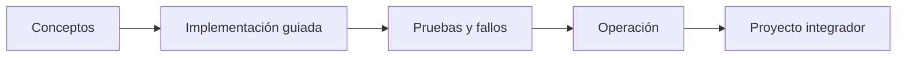

# Parte 19 — Google Cloud: arquitectura de datos y operación en producción

> [← Parte 18](../part-18-azure-production-architecture/README.md) · [Índice completo](../README.md) · [Parte 20 →](../part-20-cloud-data-ai-platforms/README.md)

**Nivel:** avanzado · **Clases:** 12 · **Duración sugerida:** 6–8 semanas

Operar CloudShop con la red global, servicios administrados, seguridad y plataforma de datos de Google Cloud.

## Resultados de la parte

Al completar esta parte podrás explicar el dominio con lenguaje independiente del proveedor,
implementar sus mecanismos esenciales, diagnosticar fallos y defender decisiones mediante
evidencia, costo, seguridad y objetivos de confiabilidad.

## Modelo mental

Google Cloud combina una jerarquía estricta de recursos con una red global y servicios data-first; proyecto, cuota e IAM forman una unidad operativa.

## Secuencia

## Clases

| ID | Clase | Laboratorio | Horas |
|---:|---|---|---:|
| 229 | [Resource Manager, folders, Shared VPC y guardrails](229-resource-manager-folders-shared-vpc-y-guardrails/README.md) | `governance` | 4 |
| 230 | [Workload Identity Federation, IAM Conditions y PAM](230-workload-identity-federation-iam-conditions-y-pam/README.md) | `iam` | 4 |
| 231 | [Red global, load balancing, PSC y Cloud DNS](231-red-global-load-balancing-psc-y-cloud-dns/README.md) | `network` | 4 |
| 232 | [Terraform, Infrastructure Manager y policy validation](232-terraform-infrastructure-manager-y-policy-validation/README.md) | `iac` | 4 |
| 233 | [Cloud Run, Functions, API Gateway y Workflows](233-cloud-run-functions-api-gateway-y-workflows/README.md) | `serverless` | 4 |
| 234 | [GKE Autopilot, Workload Identity y Config Sync](234-gke-autopilot-workload-identity-y-config-sync/README.md) | `kubernetes` | 4 |
| 235 | [Cloud SQL, Spanner, Firestore y Bigtable](235-cloud-sql-spanner-firestore-y-bigtable/README.md) | `data` | 4 |
| 236 | [BigQuery, Dataflow, Dataproc y gobernanza de datos](236-bigquery-dataflow-dataproc-y-gobernanza-de-datos/README.md) | `data` | 4 |
| 237 | [Pub/Sub, Eventarc y entrega exactamente-una-vez](237-pub-sub-eventarc-y-entrega-exactamente-una-vez/README.md) | `messaging` | 4 |
| 238 | [Cloud Operations, Trace y OpenTelemetry](238-cloud-operations-trace-y-opentelemetry/README.md) | `observability` | 4 |
| 239 | [SCC, VPC Service Controls, KMS y FinOps](239-scc-vpc-service-controls-kms-y-finops/README.md) | `security` | 4 |
| 240 | [Proyecto: CloudShop productivo en Google Cloud](240-proyecto-cloudshop-productivo-en-google-cloud/README.md) | `capstone` | 8 |

## Evaluación de la parte

- 35 % laboratorios y evidencia reproducible.
- 25 % retos verificables.
- 20 % decisiones y ADR.
- 10 % seguridad, confiabilidad y costo.
- 10 % proyecto integrador de la parte.

Se aprueba con 80 % de clases en nivel B o superior y el proyecto integrador reproducible.

## Pauta bibliográfica

- Google Cloud Architecture Framework — Google.
- Google Cloud Certified Professional Cloud Architect Study Guide — Dan Sullivan.
- Data Engineering with Google Cloud — Adi Wijaya.
