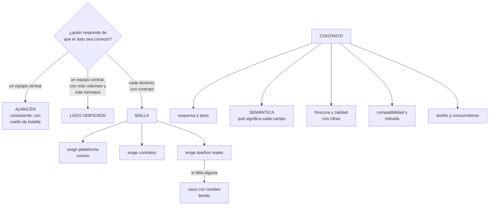

# 241 — Lakehouse, warehouse, mesh y contratos de datos

> [← 240 · Proyecto: CloudShop productivo en Google Cloud](../../part-19-gcp-production-architecture/240-proyecto-cloudshop-productivo-en-google-cloud/README.md) · [Índice de la parte](../README.md) · [242 · Ingesta batch, CDC y streaming →](../../part-20-cloud-data-ai-platforms/242-ingesta-batch-cdc-y-streaming/README.md)

**Parte:** 20 — Plataformas cloud de datos, analítica, IA y agentes<br>
**Nivel:** avanzado · **Horas estimadas:** 4<br>
**Laboratorio:** `data` · **Estado:** `EXECUTABLE_CORE`

## 🎯 Propósito

Elegir la arquitectura de datos —almacén, lago unificado o malla— con el criterio que decide de verdad, que no es técnico: **quién es responsable de que un dato sea correcto**. La clase compara las tres formas por lo que resuelven y lo que cuestan, y desarrolla la pieza que las hace funcionar o fracasar a todas: el contrato de datos, con la advertencia de la ley 16 sobre por qué se incumplen.

## 📚 Resultados de aprendizaje

Al finalizar podrás:

1. **Distinguir** almacén, lago unificado y malla por su modelo de responsabilidad.
2. **Elegir** la forma que corresponde al tamaño y a la madurez de la organización.
3. **Escribir** un contrato de datos con lo mínimo que lo hace útil.
4. **Versionar** y evolucionar contratos sin romper a los consumidores.
5. **Evitar** que el contrato se convierta en trámite que se rodea.

## 🧩 Conceptos centrales

| Concepto | Comprensión verificable |
|---|---|
| `almacén` | Modelo centralizado: un equipo transforma los datos de todos y los publica. Consistente y con cuello de botella. |
| `lago unificado` | Almacenamiento barato con motores encima y una capa de metadatos y transacciones que lo hace fiable. |
| `malla de datos` | Cada dominio publica sus propios datos como producto, con dueño, contrato y calidad. |
| `producto de datos` | Conjunto publicado con dueño, contrato, calidad declarada y consumidores conocidos. |
| `contrato de datos` | Acuerdo explícito entre quien publica y quien consume: esquema, semántica, frescura, calidad y compatibilidad. |
| `capa de tabla transaccional` | Formato sobre ficheros que aporta transacciones, versiones y evolución de esquema. |

## 🧠 Modelo mental

Una plataforma de IA sigue siendo un sistema de datos: necesita procedencia, evaluación, límites de costo, seguridad y operación antes de una interfaz inteligente.

Aplicado a esta clase, separa siempre cuatro planos: **intención** (qué necesita el usuario),
**configuración** (qué declaramos), **estado observado** (qué existe de verdad) y
**evidencia** (cómo sabemos que cumple). Confundirlos produce diseños que se ven correctos
en un diagrama pero fallan al operar.

## 🗺️ Flujo de razonamiento



## 📖 Desarrollo

### 1. Tres formas, un criterio

Las tres arquitecturas se comparan mal cuando se comparan por tecnología. El criterio que decide es otro.

```text
LA PREGUNTA
  ¿quién responde de que un dato sea correcto?

  un equipo central             → almacén o lago
  el dominio que lo genera      → malla

→ y esa es una decisión organizativa que arrastra la
  técnica, no al revés                          ley 21
```

**Las tres formas**, con lo que resuelven y lo que cuestan:

```text
ALMACÉN
  un equipo central recibe los datos de todos, los
  transforma y los publica modelados
  + consistencia: los mismos nombres significan lo mismo
  + un solo sitio donde buscar
  − CUELLO DE BOTELLA: cada petición espera al equipo
    central
  − y ese equipo no conoce el dominio de nadie
  → funciona muy bien hasta cierto tamaño, y deja de
    funcionar de golpe

LAGO UNIFICADO
  almacenamiento barato con motores encima, y una capa que
  aporta transacciones, versiones y evolución de esquema
  + admite cualquier formato y volumen
  + separa almacenamiento de cómputo: se paga por lo que se
    consulta
  + y con la capa transaccional, deja de ser un vertedero
  − sigue habiendo un equipo central si nadie más publica

MALLA
  cada dominio publica sus datos como PRODUCTO, con dueño,
  contrato y calidad
  + elimina el cuello de botella
  + quien conoce el dato responde de él
  − exige tres cosas a la vez: plataforma común, contratos
    y dueños reales
  − si falta alguna, produce el caos que decía evitar
```

Y el criterio práctico:

```text
¿menos de 4 o 5 equipos que producen datos?
  → almacén o lago; la malla añade coordinación sin
    beneficio

¿el equipo central es el cuello y las peticiones esperan
 meses?
  → malla, pero SOLO si hay plataforma y dueños

¿hay dueños dispuestos a responder de sus datos?
  → si la respuesta es no, la malla no se puede montar
  → y decirlo antes ahorra un año                 ley 20
```

Y la advertencia sobre la malla:

```text
la malla no es una tecnología: es un reparto de
responsabilidad
→ montarla comprando un producto y sin cambiar quién
  responde produce lo mismo de antes, con más piezas
                                          clases 172, 183
```

### 2. El lago que sí funciona

El lago de datos tuvo mala fama por un motivo concreto, y las capas transaccionales lo resuelven.

```text
EL PROBLEMA DEL LAGO ANTIGUO
  ficheros en un almacén, sin transacciones
  → una escritura a medias deja datos corruptos
  → dos procesos escribiendo, resultados imposibles
  → cambiar un esquema, un proyecto
  → y borrar una fila concreta, casi imposible
  → resultado: un vertedero donde nadie confía

LA CAPA DE TABLA TRANSACCIONAL
  aporta sobre los ficheros
    transacciones: la escritura se ve entera o no se ve
    VERSIONES: se puede consultar el estado de ayer
    evolución de esquema: añadir y renombrar columnas
    borrado y actualización por fila
    y compactación de ficheros pequeños

→ y con eso, el lago deja de ser un vertedero
```

Y las decisiones que hay que tomar al montarlo:

```text
LA ORGANIZACIÓN EN CAPAS
  bruto        tal como llegó, inmutable
  refinado     limpio, tipado, deduplicado
  publicado    modelado para consumir
  → y cada capa con su retención y su dueño
  → el bruto se conserva porque permite reprocesar
                                                clase 242

EL PARTICIONADO
  por fecha, casi siempre
  → y con cuidado: demasiadas particiones producen millones
    de ficheros diminutos y consultas lentísimas

LA COMPACTACIÓN
  los ficheros pequeños hay que juntarlos
  → si no, cada consulta abre miles de ficheros
  → es mantenimiento, y hay que programarlo      ley 25

Y LA RETENCIÓN DE VERSIONES
  las versiones antiguas ocupan
  → limpieza programada, con la ventana que se necesite
    para consultar el pasado
```

Y una advertencia de coste:

```text
separar almacenamiento de cómputo abarata el
almacenamiento y hace el cómputo visible
→ y entonces la factura la domina quién consulta y cómo
                                          clase 236, ley 28
```

### 3. El contrato de datos

El contrato es lo que hace que un dato sea usable por alguien que no lo produjo. Sin él, cada consumidor descubre la semántica leyendo filas.

```text
LO MÍNIMO QUE DEBE TENER

  ESQUEMA         campos, tipos, obligatoriedad
  SEMÁNTICA       qué significa cada campo
                  → «importe» ¿con impuestos? ¿en qué
                    moneda? ¿de qué momento?
                  → esta es la parte que más se omite y la
                    que más errores causa       clase 188
  GRANULARIDAD    qué representa una fila
  CLAVE           qué identifica una fila de forma única
  FRESCURA        cada cuánto se actualiza y cuál es el
                  retraso máximo
  CALIDAD         reglas comprobables, con umbrales
  COMPATIBILIDAD  qué cambios se permiten sin aviso
  DUEÑO           un equipo, con un canal
  CONSUMIDORES    quiénes lo usan          ← imprescindible
                  para poder cambiar y para poder retirar
                                             ley 20, clase 188
  RETIRADA        cómo y con cuánto aviso
```

Y las dos partes que lo distinguen de un esquema:

```text
1  LA SEMÁNTICA ESCRITA
   «pedido_confirmado» ¿es cuando el usuario pulsa o cuando
   el pago se aprueba?
   → la diferencia son horas y miles de filas
   → y dos consumidores que lo interpreten distinto
     producen informes que no cuadran

2  LA FRESCURA Y LA CALIDAD, CON CIFRAS
   «se actualiza cada 15 minutos; el retraso no supera 1
    hora el 99 % de los días»
   «el campo cliente no es nulo en más del 0,1 % de las
    filas»
   → y esas cifras se COMPRUEBAN, o el contrato es una
     declaración de intenciones               clase 243
```

**La evolución**, con las reglas de la clase 188:

```text
ADITIVO      añadir campo opcional            seguro
RESTRICTIVO  quitar, renombrar, cambiar tipo  rompe
SEMÁNTICO    mismo campo, otro significado    ROMPE EN
                                              SILENCIO

→ y aquí el semántico es aún más peligroso que en una API:
  un informe que cambia de significado no da error, da otro
  número

y el patrón
  expandir y contraer: campo nuevo, migrar consumidores,
  medir que nadie usa el viejo, retirar
  → y el paso de MEDIR exige saber quién consume
```

Y la versión del contrato, que hay que llevar:

```text
el contrato tiene versión
y los consumidores declaran contra qué versión leen
→ así se sabe a quién afecta un cambio
→ y se puede publicar la versión nueva conviviendo con la
  anterior
```

### 4. Por qué se incumplen, y cómo evitarlo

Los contratos de datos fracasan por el mismo mecanismo que los controles de la parte 14.

```text
SI PUBLICAR CON CONTRATO CUESTA MÁS QUE PUBLICAR SIN ÉL,
SE PUBLICARÁ SIN ÉL                                ley 16

  y las formas de rodearlo
    copiar la tabla a otro sitio y publicarla allí
    dar acceso directo a la base operativa
    exportar a una hoja de cálculo
    → y entonces el dato circula sin contrato, sin calidad
      y sin dueño                                  ley 20
```

Y lo que hace que se cumplan:

```text
1  EL CARRIL FÁCIL LO TRAE HECHO
   una plantilla de producto de datos que genera el
   contrato, las comprobaciones y el registro
   → publicar CON contrato debe ser lo más rápido
                                                clase 171

2  EL CONTRATO SE GENERA, NO SE ESCRIBE A MANO
   el esquema, del propio dato
   la frescura, de la ejecución
   la calidad, de las comprobaciones
   → y a mano solo la SEMÁNTICA, que es lo que no se puede
     deducir

3  EL CONSUMO SIN CONTRATO SE IMPIDE
   el acceso directo a las bases operativas, cerrado
   → y eso obliga a que el productor publique de verdad
                                                clase 200

4  Y HAY UN CATÁLOGO donde se busca
   → si encontrar un dato es más difícil que pedírselo a
     alguien por mensaje, el catálogo no existe
```

Y la medida de si funciona:

```text
proporción de conjuntos consumidos que TIENEN contrato
proporción de accesos que van al producto publicado frente
  a los que van a la base operativa
y tiempo desde que alguien necesita un dato hasta que lo
  tiene
  → si sigue siendo de semanas, no se ha resuelto nada
```

Y una advertencia sobre el catálogo:

```text
un catálogo que se rellena a mano queda obsoleto en meses
→ se alimenta de los propios contratos y del linaje
                                          clases 236, 243
→ y lo que no está en el catálogo pero se consume es un
  hallazgo                                        ley 24
```

Y la lista de comprobación de la clase:

```text
☐ está decidido quién responde de que un dato sea correcto
☐ la forma elegida corresponde al número de equipos
  productores
☐ si es malla, hay plataforma, contratos y dueños reales
☐ el lago usa capa transaccional, no ficheros sueltos
☐ hay capas: bruto, refinado y publicado, con retención
☐ hay compactación programada
☐ cada producto de datos tiene contrato
☐ el contrato incluye SEMÁNTICA escrita
☐ incluye frescura y calidad con cifras comprobables
☐ incluye dueño y consumidores conocidos
☐ el contrato tiene versión y los consumidores la declaran
☐ publicar con contrato es más rápido que sin él
☐ el acceso directo a las bases operativas está cerrado
☐ hay catálogo alimentado automáticamente
```

Y el cierre que enlaza con la clase siguiente: con la arquitectura y los contratos decididos, queda traer los datos. Ingesta por lotes, captura de cambios y continua es la materia de la clase 242.

## 🔬 Ejemplo trabajado

**CloudShop rehace su plataforma de datos. Lo que sigue es por qué el almacén central dejó de funcionar, la decisión de malla que se tomó a medias, y el campo «importe» que significaba tres cosas distintas.**

**El punto de partida:**

```text
equipos que producen datos                          14
equipo central de datos                        6 personas
peticiones de datos nuevos en cola                  41
tiempo medio de espera                        11 semanas

y lo que hacían los equipos mientras esperaban
  acceso directo a las réplicas de lectura de las bases
  operativas                                        19
  exportaciones a hojas de cálculo                  34
  copias de tablas a sus propios proyectos          22

→ el 71 % del consumo de datos NO pasaba por la plataforma
→ y esos datos no tenían contrato, ni calidad, ni dueño
                                          ley 16, ley 20
```

**El campo «importe», que significaba tres cosas.**

```text
se descubrió al no cuadrar tres informes

  informe de finanzas       importe = sin impuestos, en
                            euros, del momento del pedido
  panel de operaciones      importe = con impuestos, en
                            euros, del momento del envío
  informe de marketing      importe = con impuestos y con
                            descuento aplicado, del momento
                            del pago

  los tres leían de tablas distintas, todas llamadas
  «pedidos», todas con un campo «importe»
  y ninguna decía qué significaba

diferencia acumulada en el cierre trimestral   214.000 €
tiempo de conciliación                          3 semanas
y la causa
  ninguna de las tres tablas tenía contrato
  → y el esquema era idéntico: mismo nombre, mismo tipo
  → el esquema NO es el contrato               clase 188
```

**La decisión de arquitectura.**

```text
se planteó malla de datos

y se comprobaron las tres condiciones
  1  PLATAFORMA COMÚN                     no existía
     → publicar un producto de datos exigía montar
       infraestructura propia
  2  CONTRATOS                            no existían
  3  DUEÑOS DISPUESTOS                    parcialmente
     de los 14 equipos, 6 aceptaron responder de sus datos
     5 dijeron que no tenían capacidad
     3 no contestaron

→ y la conclusión honesta
  con 6 de 14, no se puede montar una malla completa
  y montarla a medias produce dos sistemas y ningún dueño
                                                clase 172

LA DECISIÓN
  fase 1  lago unificado con capa transaccional, operado
          por el equipo central
          y los 6 dominios dispuestos publican SUS
          productos sobre esa plataforma
  fase 2  a medida que otros dominios se sumen, se amplía
  y NO se declara «tenemos malla»

y el criterio registrado
  «un dominio publica sus datos cuando tiene un dueño
   nombrado y acepta el contrato; hasta entonces, los
   publica el equipo central»              clase 190
```

**La plataforma, montada primero.**

```text
lo que la plantilla de producto de datos genera
  el almacenamiento en la capa correspondiente
  la tabla transaccional con su esquema
  el trabajo de publicación con su orquestación
                                                clase 243
  las comprobaciones de calidad declaradas
  el contrato, generado del esquema y de la ejecución
  el registro en el catálogo
  los permisos por columna                    clase 236
  y las alertas de frescura y de calidad

tiempo para publicar un producto de datos nuevo
  antes                                     11 semanas
  después                                       2 días

→ y ese número es lo que hizo que los equipos publicaran
  con contrato en vez de rodearlo               ley 16
```

**El contrato, con la parte que costó escribir.**

```text
el de «pedidos confirmados», completo

  esquema        23 campos, generado
  granularidad   una fila por pedido
  clave          identificador de pedido
  SEMÁNTICA      escrita a mano, 23 líneas
    confirmado_en   momento en que el PAGO fue aprobado
                    por la pasarela, en UTC
                    → no cuando el usuario pulsó
    importe_neto    sin impuestos ni descuentos, en euros,
                    convertido al tipo del día del pago
    importe_bruto   con impuestos, sin descuentos
    importe_pagado  lo que el cliente pagó realmente
    → y la regla: si hace falta otro importe, se añade un
      campo; NUNCA se cambia el significado de estos tres
                                                clase 188
  frescura       cada 15 min; retraso ≤ 1 h el 99 % de los
                 días
  calidad        identificador no nulo y único: 100 %
                 cliente no nulo: > 99,9 %
                 importe_neto ≤ importe_bruto: 100 %
                 confirmado_en no futuro: 100 %
  compatibilidad aditivo sin aviso; el resto, 60 días
  dueño          equipo de pedidos, con canal
  consumidores   9 declarados
  retirada       90 días de aviso
```

Y el efecto de la semántica escrita:

```text
los tres informes se rehicieron contra el contrato
  finanzas       usa importe_neto
  operaciones    usa importe_bruto
  marketing      usa importe_pagado

diferencia en el cierre siguiente                  0 €
tiempo de conciliación                     3 semanas → 0
```

**El lago, con lo que hubo que aprender:**

```text
capas
  bruto      tal como llega, inmutable, 90 días
  refinado   limpio y tipado, 2 años
  publicado  productos de datos, según contrato

y los dos problemas del primer trimestre

1  FICHEROS PEQUEÑOS
   la ingesta continua escribía cada 30 s
   → 2.880 ficheros al día por tabla
   → una consulta sobre 90 días abría 259.000 ficheros
   → 41 s en vez de 2 s
   corrección   compactación programada cada hora
                y escritura cada 5 min en vez de 30 s

2  VERSIONES ANTIGUAS
   la capa transaccional conserva versiones
   → almacenamiento creciendo un 8 % semanal
   corrección   limpieza programada, conservando 7 días de
                versiones
                → suficiente para el reproceso y para
                  consultar el pasado reciente
   almacenamiento                        -61 %
```

**El cierre del acceso directo:**

```text
las 19 conexiones directas a réplicas operativas
  se avisó con 90 días
  se publicaron los productos equivalentes
  se midió el uso hasta llegar a cero        clase 188
  y se cerró el acceso

  de las 19
    14 se sustituyeron por productos de datos
     3 resultaron no usarse
     2 eran procesos operativos, no de análisis
       → se rehicieron contra la API      clase 183

proporción del consumo que pasa por la plataforma
  antes                                          29 %
  después                                        96 %
```

**El resultado, al año:**

```text                                        antes     después
tiempo para publicar un producto        11 semanas      2 días
peticiones en cola                             41           3
consumo que pasa por la plataforma           29 %        96 %
conjuntos consumidos con contrato              0 %        91 %
accesos directos a bases operativas            19           0
informes que no cuadran                         3           0
tiempo de conciliación trimestral       3 semanas          0
dominios que publican sus propios datos         0           6
almacenamiento del lago                       —         -61 %
```

**La lección que esta clase deja**: el equipo central no era el problema: **era el cuello, y el 71 % del consumo lo estaba rodeando** con exportaciones y accesos directos, exactamente como la ley 16 predice. Y el error más caro del año —doscientos catorce mil euros de descuadre— no lo causó ninguna tecnología: lo causó **un campo llamado «importe» que significaba tres cosas distintas y cuyo esquema era idéntico en las tres tablas**.

## 🧪 Laboratorio guiado

Ejecuta desde la raíz:

```bash
python classes/part-20-cloud-data-ai-platforms/241-lakehouse-warehouse-mesh-y-contratos-de-datos/lab.py
```

El laboratorio selecciona el motor de práctica **`data`** y produce
`lab_result.json`. El escenario, sus comprobaciones y el artefacto esperado corresponden a
esta clase; no requiere credenciales y deja explícito qué debe revalidarse en un sandbox real.

1. Lee `exercise.steps` y formula una predicción antes de ejecutar.
2. Ejecuta la práctica y verifica todos los elementos de `checks`.
3. Provoca el caso de `negative_test` y explica la señal observada.
4. Materializa `data-architecture` en `evidence/` usando la plantilla indicada.
5. Para proveedor real, sigue `sandbox.requires`, registra costo y ejecuta `destroy`.

### Evidencia esperada

El artefacto principal es un modelo de datos ligado a patrones de acceso. Además, la entrega debe incluir el comando ejecutado,
la salida estructurada y una conclusión que no exceda lo observado.

## 🏆 Reto verificable

Construye **`data-architecture`** para el caso CloudShop. Incluye una alternativa descartada,
un supuesto que pueda falsarse, una prueba de fallo y una decisión de rollback.

## ✅ Criterio de aceptación

- [ ] `lab.py` termina con código 0 y genera JSON válido.
- [ ] La entrega conecta al menos tres requisitos con mecanismos verificables.
- [ ] Existe una prueba positiva y una prueba negativa con evidencia.
- [ ] Seguridad, costo y operación aparecen como decisiones, no como anexos.
- [ ] Se declara una limitación y una condición que obligaría a revisar el diseño.
- [ ] Otra persona puede repetir el recorrido sin conocimiento tácito.

## ⚠️ Errores frecuentes

| Síntoma | Causa probable | Corrección |
|---|---|---|
| Los equipos rodean la plataforma con exportaciones y accesos directos | Publicar por el camino oficial tarda semanas y hacerlo por fuera, minutos | Haz que publicar con contrato sea lo más rápido, con una plantilla que lo genere todo, y cierra después el acceso directo. |
| Tres informes con el mismo campo dan números distintos | El esquema coincide pero la semántica no está escrita | Escribe qué significa cada campo en el contrato; si hace falta otro significado, se añade un campo, nunca se cambia el existente. |
| La malla de datos produce más caos que el modelo anterior | Faltaba alguna de las tres condiciones: plataforma, contratos o dueños reales | Comprueba las tres antes de empezar; con dueños insuficientes, empieza por la plataforma y los contratos y suma dominios cuando acepten. |
| Las consultas sobre el lago son lentísimas | Millones de ficheros pequeños por escrituras muy frecuentes | Escribe con menos frecuencia y programa compactación; el mantenimiento del lago es trabajo, no ocurre solo. |
| El almacenamiento del lago crece sin control | Las versiones antiguas de la capa transaccional se conservan indefinidamente | Programa la limpieza conservando la ventana que necesites para reprocesar y consultar el pasado. |
| No se puede cambiar un contrato porque nadie sabe quién lo usa | Los consumidores no están declarados | Incluye los consumidores en el contrato y mide el uso real antes de retirar nada. |

## 🛡️ Seguridad, ética y costo

Trabaja con cuentas propias o sandboxes autorizados. No publiques secretos, identificadores
reales ni datos personales. Antes de crear recursos pagos define presupuesto, etiquetas y
comando de destrucción; después verifica que no queden recursos huérfanos. Los ejemplos
locales enseñan contratos, pero no certifican cumplimiento ni disponibilidad de producción.

## ❓ Preguntas de comprobación

1. ¿Qué pregunta decide entre almacén, lago y malla?
2. ¿Qué tres condiciones exige una malla de datos y qué pasa si falta una?
3. ¿Qué aporta la capa transaccional sobre ficheros sueltos?
4. ¿Qué parte del contrato no se puede generar y por qué es la que más errores evita?
5. ¿Por qué se incumplen los contratos de datos y qué lo evita?

## 🔗 Referencias

- Dehghani, Z. (2022). *Data Mesh: Delivering Data-Driven Value at Scale*. <https://www.oreilly.com/library/view/data-mesh/9781492092384/>
- Armbrust, M. y otros (2021). *Lakehouse: a new generation of open platforms*. <https://www.cidrdb.org/cidr2021/papers/cidr2021_paper17.pdf>
- Delta Lake (2025). *Table format and transaction log*. <https://docs.delta.io/latest/index.html>
- Apache Iceberg (2025). *Table specification*. <https://iceberg.apache.org/spec/>
- Open Data Contract Standard (2025). <https://bitol-io.github.io/open-data-contract-standard/latest/>
- Documentación oficial vigente del servicio implementado; registra URL y fecha de consulta.

---

> [Evaluación](assessment.md) · [Contrato de clase](lesson.yaml) · [Índice de la parte](../README.md)

**📥 Descargar:** [Parte 20 en PDF](../../../site/downloads/partes/manual-parte-20-cloud-data-ai-platforms.pdf) · [Manual integral](../../../site/downloads/multi-cloud-engineering-manual-v2.0.pdf)

| Anterior | Índice | Siguiente |
|---|---|---|
| [← 240 · Proyecto: CloudShop productivo en Google Cloud](../../part-19-gcp-production-architecture/240-proyecto-cloudshop-productivo-en-google-cloud/README.md) | [Parte 20](../README.md) · [Programa](../../README.md) | [242 · Ingesta batch, CDC y streaming →](../../part-20-cloud-data-ai-platforms/242-ingesta-batch-cdc-y-streaming/README.md) |
