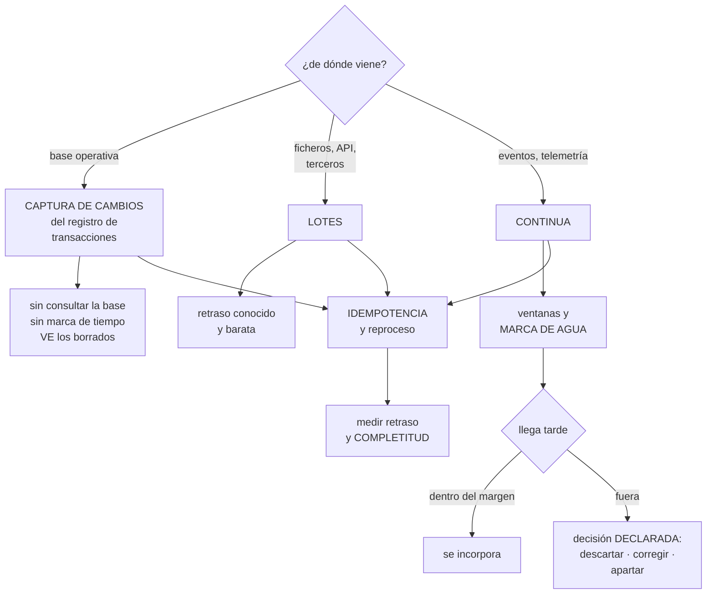

# 242 — Ingesta batch, CDC y streaming

> [← Clase anterior](../../part-20-cloud-data-ai-platforms/241-lakehouse-warehouse-mesh-y-contratos-de-datos/README.md) · [Índice de la parte](../README.md) · [Clase siguiente →](../../part-20-cloud-data-ai-platforms/243-orquestacion-calidad-lineage-y-observabilidad-de-datos/README.md)

**Parte:** 20 — Plataformas cloud de datos, analítica, IA y agentes<br>
**Nivel:** avanzado · **Horas estimadas:** 4<br>
**Laboratorio:** `data` · **Estado:** `EXECUTABLE_CORE`

## 🎯 Propósito

Traer los datos a la plataforma con el método que corresponde a cada origen, y resolver los tres asuntos que deciden si la ingesta es fiable: **cómo se capturan los cambios sin consultar la base operativa a golpe de consulta, qué se hace con los datos que llegan tarde, y cómo se reprocesa sin duplicar**. La clase compara lotes, captura de cambios y continua, con su coste y sus garantías.

## 📚 Resultados de aprendizaje

Al finalizar podrás:

1. **Elegir** entre lotes, captura de cambios y continua con criterios.
2. **Capturar** cambios sin consultar la base operativa periódicamente.
3. **Tratar** los datos que llegan tarde con una regla declarada.
4. **Reprocesar** sin duplicar y sin tumbar el sistema.
5. **Medir** el retraso y la completitud de cada flujo.

## 🧩 Conceptos centrales

| Concepto | Comprensión verificable |
|---|---|
| `ingesta por lotes` | Traer un bloque de datos cada cierto tiempo. Simple, barata y con retraso conocido. |
| `captura de cambios` | Leer el registro de transacciones de la base para obtener las modificaciones, sin consultarla. |
| `extracción incremental` | Consultar solo lo modificado desde la última vez. Requiere una marca fiable y no ve los borrados. |
| `marca de agua` | Frontera de tiempo a partir de la cual se considera que ya no llegarán más datos de un periodo. |
| `dato que llega tarde` | Registro cuyo momento de suceso es anterior a la ventana ya cerrada. |
| `reproceso` | Volver a ejecutar la ingesta o la transformación sobre un periodo. Debe ser idempotente. |

## 🧠 Modelo mental

Una plataforma de IA sigue siendo un sistema de datos: necesita procedencia, evaluación, límites de costo, seguridad y operación antes de una interfaz inteligente.

Aplicado a esta clase, separa siempre cuatro planos: **intención** (qué necesita el usuario),
**configuración** (qué declaramos), **estado observado** (qué existe de verdad) y
**evidencia** (cómo sabemos que cumple). Confundirlos produce diseños que se ven correctos
en un diagrama pero fallan al operar.

## 🗺️ Flujo de razonamiento



## 📖 Desarrollo

### 1. Tres métodos, tres orígenes

El método se elige por el origen y por el retraso aceptable, no por preferencia.

```text
LOTES
  se trae un bloque cada cierto tiempo
  + simple, barato y fácil de reprocesar
  + el retraso es conocido y estable
  − no sirve si el retraso aceptable es de segundos
  para   ficheros de terceros, exportaciones, catálogos

CAPTURA DE CAMBIOS
  se lee el REGISTRO DE TRANSACCIONES de la base
  + no consulta la base: no le añade carga
  + ve inserciones, actualizaciones Y BORRADOS
  + no depende de que exista una marca de tiempo fiable
  − exige permisos y configuración en la base
  − y el registro tiene retención: si el consumidor se
    queda atrás, se pierden cambios          ley 13
  para   bases operativas, siempre que se pueda

CONTINUA
  los eventos llegan según ocurren
  + retraso de segundos
  − ventanas, datos que llegan tarde y estado
  − y más caro de operar
  para   telemetría, clics, sensores, y lo que el negocio
         necesite en tiempo real DE VERDAD
```

Y el método que hay que evitar cuando se pueda:

```text
EXTRACCIÓN INCREMENTAL POR CONSULTA
  «dame las filas modificadas desde la última vez»

  problemas
    añade carga a la base operativa, en horas malas
    exige una marca de tiempo de modificación FIABLE
      → y muchas tablas no la tienen, o no se actualiza
        siempre
    NO VE LOS BORRADOS
      → las filas borradas quedan para siempre en el
        destino                                    ley 13
    y las transacciones largas producen huecos: una fila
      escrita antes de la marca pero confirmada después

→ es el método más común y el que más errores silenciosos
  produce
→ y la captura de cambios lo resuelve todo
```

Y la pregunta que hay que hacerse antes de elegir:

```text
¿CUÁNTO RETRASO ACEPTA EL NEGOCIO DE VERDAD?
  «en tiempo real» casi nunca significa segundos
  → un panel que alguien mira dos veces al día no lo
    necesita
  → y la ingesta continua cuesta bastante más que los lotes
                                          clases 236, 237

→ preguntar qué DECISIÓN se toma con el dato y cada cuánto
→ y de ahí sale el retraso aceptable, que se escribe en el
  contrato                                    clase 241
```

### 2. Capturar cambios bien

La captura de cambios resuelve mucho y tiene detalles que deciden si funciona.

```text
CÓMO FUNCIONA
  la base escribe cada cambio en su registro de
  transacciones
  el capturador lo lee y publica un evento por cambio
  → con la fila antes y después, y la operación

LO QUE DA
  todos los cambios, incluidos borrados
  el ORDEN real de las transacciones
  sin carga adicional de consulta
  y sin depender de columnas de auditoría
```

Y lo que hay que resolver:

```text
LA RETENCIÓN DEL REGISTRO
  el registro se recicla
  → si el capturador se para más de esa ventana, se pierden
    cambios y hay que recargar la tabla entera
  → ALERTA por retraso del capturador frente a la retención
                                          ley 13, clase 237

LA CARGA INICIAL
  el capturador solo ve lo que cambia DESDE que arranca
  → hace falta una foto inicial, y empalmarla sin huecos ni
    duplicados
  → los productos serios lo hacen; si se hace a mano, es la
    parte que más se falla

LOS CAMBIOS DE ESQUEMA
  una columna nueva en el origen aparece en los eventos
  → y el destino tiene que tolerarla       clase 188
  → con registro de esquemas y compatibilidad hacia delante

EL ORDEN Y LAS CLAVES
  los eventos de una misma fila deben procesarse en orden
  → clave de ordenación por clave primaria    clase 237
  → y aun así, idempotencia: se reprocesa
```

Y el patrón de escritura en el destino:

```text
los eventos de cambio no se «insertan»: se FUSIONAN
  si la clave existe, se actualiza; si no, se inserta; y si
  la operación es borrado, se marca
  → y por eso las capas transaccionales del lago importan
                                                clase 241

y los borrados
  ¿se borra de verdad o se marca?
  → marcarlos conserva el histórico y permite auditar
  → borrarlos de verdad hace falta para peticiones de
    supresión de datos personales           clase 251
  → y hay que decidirlo, no dejarlo
```

Y una alternativa que evita todo esto cuando es viable:

```text
QUE EL ORIGEN PUBLIQUE EVENTOS DE NEGOCIO
  «pedido confirmado» en vez de «fila insertada en
  pedidos»
  + el consumidor no depende del esquema interno
  + y el evento tiene semántica                clase 148
  − exige que el equipo del origen lo haga

→ y esa es la diferencia entre acoplarse al ESQUEMA o al
  CONTRATO                                 ley 21, clase 241
```

### 3. Ventanas, marcas de agua y datos que llegan tarde

En la ingesta continua, la mitad del trabajo es decidir **cuándo se considera cerrado un periodo**.

```text
DOS TIEMPOS DISTINTOS
  tiempo del SUCESO      cuándo ocurrió
  tiempo de PROCESO      cuándo llegó

  → y no coinciden: un móvil sin cobertura envía sus
    eventos horas después                     clase 203

LA MARCA DE AGUA
  la frontera que dice «ya no espero más datos anteriores a
  este momento»
  → se calcula del retraso observado
  → y cerrar una ventana antes de tiempo pierde datos;
    cerrarla tarde retrasa todo
```

Y la decisión que hay que declarar:

```text
¿QUÉ SE HACE CON LO QUE LLEGA DESPUÉS?

  DESCARTAR
    simple; se pierden datos
    → aceptable en telemetría, no en ventas

  INCORPORAR Y CORREGIR
    la ventana se recalcula y el resultado cambia
    → los consumidores deben tolerar que una cifra de ayer
      cambie hoy
    → y hay que decirlo en el contrato        clase 241

  APARTAR PARA REVISIÓN
    a un destino de datos tardíos, con alerta
    → y alguien decide

→ y la decisión se escribe; no elegir es elegir descartar
  en silencio                                     ley 13
```

Y la medida que hace falta:

```text
DISTRIBUCIÓN DEL RETRASO entre suceso y proceso
  p50, p95, p99 y máximo
  → de ahí sale la marca de agua, no de una suposición
  → y si la distribución cambia, la marca hay que
    revisarla

y la proporción de datos que llegan tarde
  → si crece, algo ha cambiado en el origen
```

**Las ventanas**, con sus tipos:

```text
FIJAS       de 5 en 5 minutos, sin solapamiento
DESLIZANTES cada minuto, mirando 5 hacia atrás
DE SESIÓN   agrupan por inactividad
            → para comportamiento de usuario

→ y las de sesión guardan estado por clave: hay que
  dimensionarlo y caducarlo
```

### 4. Reprocesar y medir

**El reproceso** es lo que salva cuando algo se hizo mal, y hay que poder hacerlo.

```text
POR QUÉ HACE FALTA
  un error en la transformación durante tres días
  un origen que envió datos incorrectos
  una regla de negocio que cambia con efecto retroactivo
  o simplemente un despliegue malo

LO QUE LO HACE POSIBLE
  1  CONSERVAR EL DATO BRUTO, tal como llegó
     → la capa bruta de la clase 241 existe para esto
  2  TRANSFORMACIONES DETERMINISTAS
     → misma entrada, misma salida
     → y sin depender de «ahora»: la fecha de proceso se
       pasa como parámetro
  3  ESCRITURA IDEMPOTENTE en el destino
     → sobrescribir la partición entera, o fusionar por
       clave
     → nunca «insertar»                        clase 210
  4  Y PODER LIMITAR EL RITMO
     → reprocesar tres meses de golpe tumba el sistema
                                                clase 210
```

Y el patrón que más se usa y mejor funciona:

```text
SOBRESCRIBIR POR PARTICIÓN
  el reproceso de un día borra la partición de ese día y la
  escribe entera
  → idempotente por construcción
  → y sin duplicados aunque se ejecute diez veces

→ y por eso el particionado por fecha no es solo una
  optimización de consulta                    clase 236
```

**Lo que hay que medir** en cada flujo de ingesta:

```text
RETRASO      entre el suceso y su disponibilidad
             → con la cifra del contrato como umbral
                                                clase 241
COMPLETITUD  ¿llegaron todas las filas esperadas?
             → comparar recuentos con el origen
             → y esta es la que casi nadie mide
FRESCURA     ¿cuándo se actualizó por última vez?
             → ALERTA POR ANTIGÜEDAD           ley 13
VOLUMEN      filas por ejecución, con su rango normal
             → una caída del 90 % sin error es el fallo
               más silencioso que existe
ERRORES      filas rechazadas, con el motivo
```

Y la alerta que más incidentes evita:

```text
«este flujo lleva N minutos sin actualizar»
  → un flujo parado no da error: deja de producir
  → y el consumidor ve datos viejos sin saberlo

y la segunda
  «el volumen de esta ejecución está fuera de su rango
   normal»
  → detecta el origen que dejó de enviar la mitad
```

Y la lista de comprobación de la clase:

```text
☐ el método corresponde al origen y al retraso aceptable
☐ el retraso aceptable se preguntó al negocio y está en el
  contrato
☐ no se usa extracción incremental por consulta sobre
  bases operativas
☐ la captura de cambios tiene alerta de retraso frente a la
  retención del registro
☐ la carga inicial se empalma sin huecos ni duplicados
☐ los cambios de esquema del origen se toleran
☐ el destino fusiona por clave, no inserta
☐ está decidido si los borrados se marcan o se borran
☐ la marca de agua se calcula del retraso observado
☐ está declarado qué se hace con los datos que llegan tarde
☐ el dato bruto se conserva para reprocesar
☐ las transformaciones son deterministas y parametrizadas
☐ el reproceso sobrescribe por partición
☐ el reproceso tiene límite de ritmo
☐ se miden retraso, completitud, frescura, volumen y errores
☐ hay alerta por antigüedad y por volumen fuera de rango
```

Y el cierre que enlaza con la clase siguiente: con los datos entrando, hace falta que los trabajos se ejecuten en orden, que la calidad se compruebe y que alguien se entere cuando algo falla. Orquestación, calidad, linaje y observabilidad de datos es la materia de la clase 243.

## 🔬 Ejemplo trabajado

**CloudShop rehace la ingesta de su plataforma de datos. Lo que sigue es la extracción incremental que llevaba dos años perdiendo borrados, el capturador que se quedó atrás y obligó a recargar 400 millones de filas, y el flujo que dejó de producir sin que nadie se enterara durante nueve días.**

**El punto de partida:**

```text
flujos de ingesta                                   61
  extracción incremental por consulta                41
  ficheros por lotes                                 14
  continua                                            6

carga añadida a las bases operativas por las 41
  consultas al día                               11.800
  concentradas entre las 2:00 y las 5:00
  → y solapando con la ventana de copias de seguridad
```

**Problema 1 · Los borrados que nunca llegaron.**

```text
se detectó al conciliar el catálogo
  productos activos según la base operativa       41.200
  productos activos según el almacén analítico    58.900
  diferencia                                      17.700

causa
  la extracción incremental consultaba
  «dame las filas con fecha_modificacion > última vez»
  → un producto BORRADO no tiene fila que devolver
  → llevaba en el almacén desde que se creó

cuánto llevaba así                             2 años
y qué había producido
  informes de catálogo con un 43 % más de productos de los
  reales
  y un modelo de recomendación entrenado con productos
  que no existían                             clase 244

→ y nada falló: la ingesta funcionaba perfectamente
                                                    ley 13
```

Y el segundo problema del mismo método:

```text
al revisar las 41 tablas
  con columna de fecha de modificación fiable        22
  con la columna, pero que NO siempre se actualiza    12
    → 4 procesos escribían sin tocarla
    → esas filas nunca llegaban al almacén
  SIN columna de modificación                          7
    → se extraía la tabla entera cada noche
    → una de ellas, de 180 M de filas
```

**La migración a captura de cambios.**

```text
las 41 pasaron a captura del registro de transacciones

lo que se ganó
  borrados, capturados
  filas sin marca de tiempo, capturadas
  carga sobre las bases operativas       11.800 → 0
                                         consultas/día
  retraso medio                          8 h → 45 s
  y la extracción completa de 180 M de filas, eliminada

lo que costó
  configuración en 9 bases de datos
  permisos de lectura del registro
  y 3 semanas de trabajo
```

Y el problema que apareció al mes:

```text
el capturador de la base de pedidos se paró un viernes por
la noche por un fallo de despliegue
nadie lo notó hasta el lunes

  retención del registro de transacciones          48 h
  tiempo parado                                    62 h
  → los cambios de 14 horas se habían reciclado

  consecuencia
    recarga completa de la tabla de pedidos
    400 M de filas, 11 horas
    y durante la recarga, el almacén analítico con datos
    incompletos

correcciones
  alerta: «el retraso del capturador supera el 50 % de la
  retención del registro»                          ley 13
  retención del registro subida a 7 días
  y alerta de capturador detenido, a canal con guardia
                                                clase 238

→ y la alerta de retraso existía… con umbral de 24 h y a un
  canal sin suscriptores                          ley 15
```

**Problema 2 · El flujo que dejó de producir.**

```text
síntoma reportado, 9 días después
  el equipo de marketing dijo que el panel de campañas
  «se veía raro»

diagnóstico
  el flujo de eventos de la web había dejado de escribir
  el 3 de marzo
  el trabajo se ejecutaba, no daba error, y escribía 0 filas
  causa: un cambio en el origen renombró un campo y el
  filtro no encontraba nada                    clase 188

  el panel mostraba los últimos datos disponibles, del 3 de
  marzo, sin indicar la fecha                clase 187

lo que faltaba
  alerta de FRESCURA: «este conjunto lleva N horas sin
    actualizarse»
  alerta de VOLUMEN: «esta ejecución escribió 0 filas,
    fuera de su rango normal de 180.000-240.000»
  y la antigüedad del dato, visible en el panel

con las tres, el fallo se habría detectado en 30 minutos
```

**Las ventanas y los datos que llegan tarde.**

```text
el flujo de eventos de la aplicación móvil

  distribución del retraso entre suceso y llegada, medida
    p50                                        2,1 s
    p95                                         41 s
    p99                                       4 min
    máximo observado                        11 horas
      → móviles sin cobertura                clase 203

  la marca de agua estaba en 60 segundos
  → el 1,2 % de los eventos llegaba después
  → y se descartaban EN SILENCIO

  el efecto
    las cifras de conversión por hora eran un 1,2 % bajas
    y los picos de zonas con mala cobertura, mucho más

decisión declarada, tras hablar con negocio
  marca de agua                              15 minutos
  lo que llega después                incorporar y corregir
    → las cifras de una hora pueden cambiar durante las 12
      horas siguientes
    → declarado en el contrato               clase 241
    → y los paneles muestran «cifras provisionales» hasta
      el cierre
  lo que llega con más de 12 h              a revisión
    → 41 eventos al día; alguien los mira

y lo que se descartó
  cerrar a 60 s y descartar: perdía datos de venta
  cerrar a 12 h: retrasaba todo para el 1,2 %
```

**El reproceso, probado.**

```text
el escenario
  un error en la transformación de pedidos durante 3 días

lo que se pudo hacer
  el dato bruto estaba conservado                clase 241
  la transformación era determinista y recibía la fecha
    como parámetro
  el destino se sobrescribe por partición

  reproceso de 3 días
    ejecutado 3 veces seguidas para comprobar
    resultado idéntico las 3 veces               ✓
    duración                                  22 min
    con límite de ritmo: 1 partición cada 2 min

y el ensayo anterior, sin límite de ritmo
  se lanzaron los 3 días en paralelo con 90 días de otro
  reproceso
  → el almacén analítico alcanzó su límite de consultas
    concurrentes
  → y los paneles de producción dejaron de responder
    41 minutos                                clase 236
```

**La vigilancia montada:**

```text
por cada uno de los 61 flujos
  retraso, frente al umbral del contrato
  frescura, con alerta por antigüedad
  volumen, con rango normal y alerta fuera de él
  completitud: recuento en origen frente a destino
  errores y filas rechazadas, con motivo

y en los 6 continuos
  retraso del capturador frente a la retención
  proporción de datos que llegan tarde
  y tamaño del estado de las ventanas de sesión

primeros 6 meses
  alertas de frescura disparadas                       14
    → 11 reales: flujos parados
    → 3 por mantenimiento previsto
  alertas de volumen                                    9
    → 6 reales: orígenes que dejaron de enviar
    → y 2 de ellas, cambios de esquema no comunicados
                                                clase 241
  alertas de completitud                                4
```

**El resultado:**

```text                                        antes     después
flujos por extracción incremental              41           0
consultas a bases operativas                11.800/día      0
retraso medio de la ingesta                   8 h        45 s
borrados capturados                            no          sí
productos fantasma en el almacén           17.700           0
tiempo de detección de un flujo parado      9 días      30 min
datos descartados por llegar tarde           1,2 %      0,003 %
reprocesos que causaron incidente             1/1         0/7
completitud comprobada                         no      61 flujos
```

**La lección que esta clase deja**: la extracción incremental por consulta funcionaba perfectamente y llevaba **dos años sin traer un solo borrado**, con el resultado de un catálogo con un 43 % más de productos de los reales y un modelo entrenado sobre productos inexistentes. Y el flujo que se paró tardó **nueve días** en detectarse porque el trabajo se ejecutaba, no daba error y escribía cero filas: **lo que faltaba no era una alerta de error, sino una de frescura y otra de volumen**.

## 🧪 Laboratorio guiado

Ejecuta desde la raíz:

```bash
python classes/part-20-cloud-data-ai-platforms/242-ingesta-batch-cdc-y-streaming/lab.py
```

El laboratorio selecciona el motor de práctica **`data`** y produce
`lab_result.json`. El escenario, sus comprobaciones y el artefacto esperado corresponden a
esta clase; no requiere credenciales y deja explícito qué debe revalidarse en un sandbox real.

1. Lee `exercise.steps` y formula una predicción antes de ejecutar.
2. Ejecuta la práctica y verifica todos los elementos de `checks`.
3. Provoca el caso de `negative_test` y explica la señal observada.
4. Materializa `ingestion-pipeline` en `evidence/` usando la plantilla indicada.
5. Para proveedor real, sigue `sandbox.requires`, registra costo y ejecuta `destroy`.

### Evidencia esperada

El artefacto principal es un modelo de datos ligado a patrones de acceso. Además, la entrega debe incluir el comando ejecutado,
la salida estructurada y una conclusión que no exceda lo observado.

## 🏆 Reto verificable

Construye **`ingestion-pipeline`** para el caso CloudShop. Incluye una alternativa descartada,
un supuesto que pueda falsarse, una prueba de fallo y una decisión de rollback.

## ✅ Criterio de aceptación

- [ ] `lab.py` termina con código 0 y genera JSON válido.
- [ ] La entrega conecta al menos tres requisitos con mecanismos verificables.
- [ ] Existe una prueba positiva y una prueba negativa con evidencia.
- [ ] Seguridad, costo y operación aparecen como decisiones, no como anexos.
- [ ] Se declara una limitación y una condición que obligaría a revisar el diseño.
- [ ] Otra persona puede repetir el recorrido sin conocimiento tácito.

## ⚠️ Errores frecuentes

| Síntoma | Causa probable | Corrección |
|---|---|---|
| El destino tiene más filas que el origen y nadie sabe por qué | La extracción incremental por consulta no ve los borrados | Usa captura de cambios del registro de transacciones, que ve inserciones, actualizaciones y borrados. |
| Faltan filas modificadas por ciertos procesos | La columna de fecha de modificación no se actualiza siempre | No dependas de columnas de auditoría; captura del registro de transacciones. |
| Hay que recargar una tabla entera tras una parada | El capturador se quedó atrás más que la retención del registro | Alerta al superar la mitad de la retención, sube la retención y vigila el capturador detenido. |
| Un conjunto lleva días sin actualizarse y nadie lo nota | El trabajo se ejecuta sin error y escribe cero filas | Alerta por frescura y por volumen fuera del rango normal; el error no es la única señal. |
| Las cifras son sistemáticamente algo bajas | La marca de agua cierra la ventana antes de que lleguen los datos tardíos, que se descartan en silencio | Calcula la marca de agua del retraso observado y declara qué se hace con lo que llega tarde. |
| Un reproceso tumba los paneles de producción | Se lanzó sin límite de ritmo y agotó la capacidad de consulta | Reprocesa por particiones con límite de ritmo, y comprueba que el resultado es idéntico ejecutándolo varias veces. |

## 🛡️ Seguridad, ética y costo

Trabaja con cuentas propias o sandboxes autorizados. No publiques secretos, identificadores
reales ni datos personales. Antes de crear recursos pagos define presupuesto, etiquetas y
comando de destrucción; después verifica que no queden recursos huérfanos. Los ejemplos
locales enseñan contratos, pero no certifican cumplimiento ni disponibilidad de producción.

## ❓ Preguntas de comprobación

1. ¿Qué tres problemas tiene la extracción incremental por consulta?
2. ¿Qué hay que vigilar en un capturador de cambios y por qué?
3. ¿De dónde sale la marca de agua y qué hay que declarar sobre los datos tardíos?
4. ¿Qué cuatro cosas hacen posible un reproceso sin duplicados?
5. ¿Qué dos alertas detectan un flujo que dejó de producir sin dar error?

## 🔗 Referencias

- Kleppmann, M. (2017). *Designing Data-Intensive Applications*, cap. 11 — flujos y captura de cambios. <https://dataintensive.net/>
- Debezium (2025). *Change data capture connectors*. <https://debezium.io/documentation/reference/stable/index.html>
- Apache Beam (2025). *Streaming model: windows, watermarks and triggers*. <https://beam.apache.org/documentation/programming-guide/#windowing>
- Akidau, T. y otros (2015). *The Dataflow Model*. <https://research.google/pubs/pub43864/>
- Google Cloud (2025). *Datastream: serverless change data capture*. <https://cloud.google.com/datastream/docs/overview>
- Documentación oficial vigente del servicio implementado; registra URL y fecha de consulta.

---

> [Evaluación](assessment.md) · [Contrato de clase](lesson.yaml) · [Índice de la parte](../README.md)
