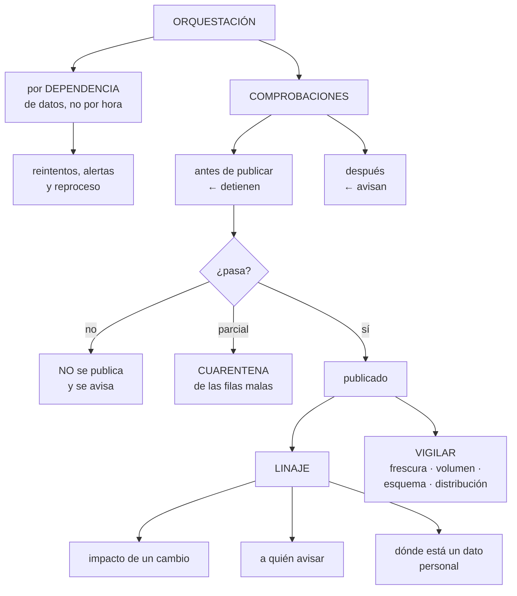

# 243 — Orquestación, calidad, lineage y observabilidad de datos

> [← 242 · Ingesta batch, CDC y streaming](../../part-20-cloud-data-ai-platforms/242-ingesta-batch-cdc-y-streaming/README.md) · [Índice de la parte](../README.md) · [244 · Feature stores, training pipelines y experiment tracking →](../../part-20-cloud-data-ai-platforms/244-feature-stores-training-pipelines-y-experiment-tracking/README.md)

**Parte:** 20 — Plataformas cloud de datos, analítica, IA y agentes<br>
**Nivel:** avanzado · **Horas estimadas:** 4<br>
**Laboratorio:** `observability` · **Estado:** `EXECUTABLE_CORE`

## 🎯 Propósito

Hacer que la plataforma de datos se opere como se opera un sistema: con orquestación que sabe el orden, comprobaciones de calidad que fallan de verdad, linaje que permite retirar y cambiar, y observabilidad que avisa antes de que alguien se queje. La clase aborda el problema que este programa lleva anticipando: **la mayor parte de los fallos de datos no son ruidosos, y los descubre un consumidor semanas después**.

## 📚 Resultados de aprendizaje

Al finalizar podrás:

1. **Orquestar** trabajos por dependencia de datos, no por horario.
2. **Comprobar** la calidad con reglas que detienen el flujo cuando procede.
3. **Usar** el linaje para evaluar impacto, retirar y cumplir peticiones de borrado.
4. **Vigilar** frescura, volumen, esquema y distribución.
5. **Reaccionar** a los incidentes de datos con un procedimiento propio.

## 🧩 Conceptos centrales

| Concepto | Comprensión verificable |
|---|---|
| `orquestación por dependencia` | Un trabajo se ejecuta cuando sus entradas están listas, no a una hora fija. |
| `comprobación de calidad` | Regla sobre los datos con umbral. Puede avisar o detener el flujo. |
| `cuarentena` | Destino de las filas que no pasan las comprobaciones, para no contaminar ni perder. |
| `linaje` | Grafo de qué alimenta a qué y quién consume. Base del análisis de impacto. |
| `deriva de esquema` | Cambio no anunciado en la forma del dato de origen. |
| `incidente de datos` | Situación en que un dato publicado es incorrecto. Tiene su propio procedimiento. |

## 🧠 Modelo mental

Una plataforma de IA sigue siendo un sistema de datos: necesita procedencia, evaluación, límites de costo, seguridad y operación antes de una interfaz inteligente.

Aplicado a esta clase, separa siempre cuatro planos: **intención** (qué necesita el usuario),
**configuración** (qué declaramos), **estado observado** (qué existe de verdad) y
**evidencia** (cómo sabemos que cumple). Confundirlos produce diseños que se ven correctos
en un diagrama pero fallan al operar.

## 🗺️ Flujo de razonamiento



## 📖 Desarrollo

### 1. Orquestar por dependencia

El error de orquestación más común es programar por horario y esperar que lo anterior haya terminado.

```text
✗ POR HORARIO
  el trabajo A a las 2:00, el B a las 3:00, el C a las 4:00
  → si A tarda más, B se ejecuta con datos incompletos
  → y no da error: produce un resultado incorrecto
                                                    ley 13
  → y cuando A se acelera, sobra hora y media de espera

✓ POR DEPENDENCIA
  B se ejecuta cuando A ha terminado con éxito
  y C, cuando B y otra entrada están listas
  → el orden lo declara el grafo, no el reloj
```

Y lo que un orquestador debe dar:

```text
grafo de dependencias declarado
reintentos con retroceso
plazos: si un trabajo tarda más de X, avisa
ejecución por PARTICIÓN, no por «hoy»
  → así se puede reprocesar el 3 de marzo   clase 242
paralelismo controlado, con límites
y estado consultable: ¿qué se está ejecutando y qué falló?
```

Y dos propiedades que evitan la mitad de los incidentes:

```text
IDEMPOTENCIA DE CADA TAREA
  ejecutarla dos veces produce lo mismo
  → y por eso el reintento es seguro

SIN SOLAPAMIENTO
  si la ejecución de ayer sigue corriendo, la de hoy espera
  → dos ejecuciones sobre la misma partición producen
    duplicados o resultados imposibles
  → y es un valor que hay que configurar        ley 26
```

Y el disparo por llegada de datos, que es lo que más se aproxima a lo ideal:

```text
el trabajo arranca cuando su entrada aparece
  un fichero en el almacén, una partición completa, un
  mensaje
→ y así el retraso total es la suma de los tiempos de
  proceso, no la suma de las esperas

y hay que saber cuándo una entrada está COMPLETA
  → un fichero que se está escribiendo no está listo
  → marca de finalización, o escritura atómica
```

Y la alerta que hace falta, que no es la de fallo:

```text
«este trabajo no ha terminado a la hora en que suele»
  → un trabajo que tarda el triple no ha fallado, y algo va
    mal
«este trabajo no se ha ejecutado»               ley 13
  → el que deja de dispararse no genera ningún error
```

### 2. Comprobar la calidad

Las comprobaciones de calidad valen si **detienen algo**. Un panel de calidad en verde que nadie mira es exactamente la ley 15.

```text
LAS DIMENSIONES QUE HAY QUE COMPROBAR

  COMPLETITUD    ¿están todas las filas esperadas?
                 recuento frente al origen o frente al
                 rango histórico
  UNICIDAD       ¿la clave es única?
  VALIDEZ        ¿los valores están en el dominio
                 esperado?
                 nulos, rangos, formatos, catálogos
  CONSISTENCIA   ¿cuadra con otra fuente?
                 el total de ventas del día frente al de
                 finanzas
  FRESCURA       ¿el dato es de cuando debería?
  DISTRIBUCIÓN   ¿la forma de los datos es la habitual?
                 → la que detecta lo que las demás no
```

Y la última merece detalle, porque es la que encuentra los fallos silenciosos:

```text
la media, la desviación y los percentiles de una columna
numérica
la proporción de cada valor en una categórica
el porcentaje de nulos por columna

→ si el importe medio pasa de 41 € a 0,41 €, ninguna regla
  de validez lo detecta: los valores son válidos
→ y eso es exactamente lo que ocurre cuando un origen
  cambia de céntimos a euros sin avisar      clase 188
```

**Dónde se comprueba**, que decide qué se puede hacer:

```text
ANTES DE PUBLICAR
  si falla, NO se publica y se avisa
  → el consumidor sigue viendo el dato anterior, correcto
  → esta es la que protege

DESPUÉS DE PUBLICAR
  si falla, se avisa
  → el dato malo ya está fuera
  → sirve para lo que no se puede comprobar antes

→ y la mayoría de las plataformas comprueban después
  porque es más fácil                            ley 26
```

Y qué hacer cuando falla parcialmente:

```text
DETENER LA PUBLICACIÓN ENTERA
  correcto cuando el fallo indica que algo está roto

CUARENTENA
  las filas que no pasan van a un destino aparte
  las buenas se publican
  → y alguien revisa la cuarentena
  → si nadie la revisa, es una papelera      clase 210

Y LA DECISIÓN SE DECLARA por regla, no se improvisa
  «si más del 1 % falla, se detiene; si menos, cuarentena»
```

Y la regla que hace útil todo esto:

```text
las comprobaciones vienen del CONTRATO           clase 241
  las cifras de calidad que el contrato promete son las que
  se comprueban
→ y así el contrato deja de ser una declaración y pasa a
  ser algo que se verifica                        ley 22
```

### 3. Linaje: impacto, aviso y borrado

El linaje se presenta como documentación y en realidad resuelve tres problemas operativos.

```text
1  ANÁLISIS DE IMPACTO
   «si cambio esta columna, ¿qué se rompe?»
   → sin linaje, la respuesta es «probemos y veamos»
   → con linaje, la lista de tablas, informes y modelos
     afectados                                clase 241

2  A QUIÉN AVISAR CUANDO ALGO FALLA
   una tabla llega mal → ¿quién la consume?
   → y hay que avisarles ANTES de que tomen decisiones con
     ella
   → esto es lo que distingue un incidente de datos bien
     llevado de uno mal llevado

3  DÓNDE ESTÁ UN DATO PERSONAL
   una petición de supresión obliga a borrarlo de todas
   partes
   → y «todas partes» incluye las copias derivadas, los
     conjuntos de entrenamiento y los ficheros de
     exportación                       clases 139, 251
   → sin linaje, no se puede cumplir
```

Y de dónde sale:

```text
AUTOMÁTICO
  de las consultas que ejecutan las transformaciones
  → es el que se mantiene solo
  → y el que cubre lo que pasa dentro de la plataforma

DECLARADO
  para lo que la plataforma no ve: ficheros que alguien
  sube, procesos externos, exportaciones
  → y esa parte se queda obsoleta                 ley 25

→ por eso conviene que CUANTO exista pase por la plataforma
  → lo que entra por fuera, no tiene linaje
```

Y el nivel de detalle:

```text
A NIVEL DE TABLA     suficiente para avisar y para retirar
A NIVEL DE COLUMNA   necesario para el impacto fino y para
                     el borrado de datos personales
→ y el segundo cuesta más de mantener; se activa donde hace
  falta
```

Y lo que permite hacer, que es lo que justifica el esfuerzo:

```text
RETIRAR una tabla: se sabe quién la usa      clase 188
CAMBIAR un esquema: se avisa a quien toca
AUDITAR: de dónde salió esta cifra del informe
Y LIMPIAR: tablas sin consumidores en 90 días
                                          clase 236, ley 25
```

### 4. Observar y responder

**Lo que hay que vigilar** en una plataforma de datos, que no es lo mismo que en un servicio.

```text
POR CONJUNTO PUBLICADO
  frescura, con alerta por antigüedad            ley 13
  volumen por ejecución, con su rango normal
  resultado de las comprobaciones de calidad
  y el cumplimiento del contrato: retraso frente a lo
    prometido                                clase 241

POR FLUJO
  duración, con alerta si se desvía
  tasa de fallo y de reintento
  filas en cuarentena
  y coste                                    clase 236

Y LO TRANSVERSAL
  DERIVA DE ESQUEMA en los orígenes
    → una columna nueva, una que desaparece, un tipo que
      cambia
    → detectada al ingerir, no al consumir  clase 242
  conjuntos sin consumidores
  y conjuntos consumidos sin contrato
```

Y la señal que más problemas encuentra y menos se mide:

```text
LA DISTRIBUCIÓN DE LAS COLUMNAS, comparada con su
histórico
  → detecta el cambio de unidades, el origen que envía la
    mitad, la categoría que desaparece y el nulo que
    aparece
  → y nada de eso da error
```

**El incidente de datos**, que necesita procedimiento propio:

```text
QUÉ LO DISTINGUE DE UN INCIDENTE DE SERVICIO
  el servicio no está caído: está dando datos incorrectos
  y la gente ya ha tomado decisiones con ellos
  → el daño no se detiene apagando nada

EL PROCEDIMIENTO
  1  CONTENER: dejar de publicar; marcar el conjunto como
     no fiable
     → y que los consumidores lo vean            clase 187
  2  AVISAR a los consumidores, con el linaje en la mano
     → y decirles qué decisiones pueden estar afectadas
  3  DIAGNOSTICAR: desde cuándo, qué filas, qué causa
  4  CORREGIR y reprocesar                     clase 242
  5  CONFIRMAR a los consumidores
  6  y REVISIÓN: por qué no lo detectó una comprobación
                                                clase 127
```

Y la pregunta de la revisión, que es la que produce mejoras:

```text
«¿qué comprobación habría detectado esto, y por qué no
 existía?»
  → y la respuesta se convierte en una regla nueva
  → y así el conjunto de comprobaciones crece con los
    fallos vividos                            clase 216
```

Y la lista de comprobación de la clase:

```text
☐ los trabajos se orquestan por dependencia, no por horario
☐ cada tarea es idempotente
☐ no hay solapamiento entre ejecuciones
☐ la ejecución es por partición, no por «hoy»
☐ hay alerta de trabajo no ejecutado y de duración anómala
☐ hay comprobaciones de las seis dimensiones
☐ se comprueba la distribución, no solo la validez
☐ las comprobaciones críticas se hacen ANTES de publicar
☐ está declarado qué se detiene y qué va a cuarentena
☐ alguien revisa la cuarentena
☐ las comprobaciones salen de las cifras del contrato
☐ el linaje es automático y llega al nivel que hace falta
☐ se usa para impacto, aviso y borrado de datos personales
☐ se vigilan frescura, volumen, esquema y distribución
☐ existe procedimiento de incidente de datos, con aviso a
  consumidores
☐ cada incidente produce una comprobación nueva
```

Y el cierre que enlaza con la clase siguiente: con la plataforma de datos operada, empieza la parte de aprendizaje automático, que se apoya en todo lo anterior y añade sus propios problemas. Almacén de atributos, canalizaciones de entrenamiento y registro de experimentos es la materia de la clase 244.

## 🔬 Ejemplo trabajado

**CloudShop opera su plataforma de datos. Lo que sigue son los tres incidentes de datos del año —ninguno detectado por una alerta—, el cambio de unidades que nadie vio, y el procedimiento que se montó después.**

**El punto de partida:**

```text
trabajos de datos                                  180
  orquestados por horario                          180
  con comprobaciones de calidad                     12
  con alerta de fallo                              180
  con alerta de NO EJECUCIÓN                          0
  con alerta de frescura                              0

linaje                                    no existía
procedimiento de incidente de datos       no existía
```

**Incidente 1 · El trabajo que se ejecutó antes de tiempo.**

```text
qué pasó
  el trabajo de agregación de ventas se ejecutaba a las
  4:00
  la ingesta de pedidos, a las 2:00, y tardaba 90 minutos
  un martes, la ingesta tardó 2 h 40 por un pico de volumen
  → a las 4:00, la ingesta no había terminado
  → la agregación se ejecutó con el 61 % de los pedidos
  → y no dio error

  el informe de ventas del día mostró un 39 % menos
  se detectó                        cuando el director de
                                    ventas preguntó
  tiempo hasta detectarlo                       9 horas

corrección
  orquestación por dependencia: la agregación espera a que
  la ingesta termine con éxito
  y comprobación de completitud antes de agregar
```

**Incidente 2 · El cambio de unidades.**

```text
qué pasó
  un socio cambió el formato de su fichero de tarifas: los
  importes pasaron de céntimos a euros
  sin avisar                                clase 188

  la ingesta funcionó: los valores eran numéricos y
  positivos
  las comprobaciones de validez pasaron: rango 0-100000
  → los precios de 4.100 pasaron a ser 41

  el efecto
    el motor de precios aplicó tarifas 100 veces menores
    durante 6 días
    ventas afectadas                              4.100
    pérdida                                    118.000 €

  se detectó
    en el cierre contable mensual
    tiempo hasta detectarlo                     14 días

qué lo habría detectado
  una comprobación de DISTRIBUCIÓN
  «el importe medio de esta tabla está fuera de su rango
   histórico»
  → media histórica 4.180 €, desviación 310
  → media del día 41,8 €
  → 13 desviaciones fuera
  → habría detenido la publicación en la primera ejecución
```

Y la lección que el equipo escribió:

```text
las comprobaciones de validez comprueban que los valores
son POSIBLES
las de distribución comprueban que son LOS DE SIEMPRE
→ y el fallo silencioso siempre produce valores posibles
```

**Incidente 3 · La columna que desapareció.**

```text
qué pasó
  el equipo de la aplicación renombró un campo del evento
  de sesión
  el flujo de ingesta lo tomaba por nombre
  → el campo llegó vacío
  → el 41 % de los eventos quedó sin canal de origen

  el efecto
    el informe de atribución de campañas mostró un 41 % de
    tráfico «directo»
    marketing reasignó 31.000 € de presupuesto por ese dato

  se detectó
    marketing notó que el canal de pago «había caído mucho»
    tiempo hasta detectarlo                     11 días

qué lo habría detectado
  detección de deriva de esquema en la ingesta
  y comprobación de distribución: la proporción de nulos en
  esa columna pasó de 2 % a 41 %
```

**Lo que se montó.**

```text
ORQUESTACIÓN
  los 180 trabajos, migrados a un grafo de dependencias
  ejecución por partición, con la fecha como parámetro
  sin solapamiento
  reintentos con retroceso
  y tres alertas nuevas
    trabajo no ejecutado en su ventana
    duración por encima del percentil 95 histórico
    y trabajo bloqueado esperando una entrada

  efecto
    retraso total de la cadena de ventas
      antes   4:00 fijo, con riesgo
      después termina cuando termina; media 3:20, y correcto
    incidentes por ejecución prematura        1 → 0

COMPROBACIONES
  las cifras del contrato de cada producto se convirtieron
  en comprobaciones automáticas             clase 241

  por conjunto
    completitud: recuento frente al origen
    unicidad de la clave
    validez: nulos, rangos, catálogos
    consistencia: totales frente a otra fuente
    frescura
    DISTRIBUCIÓN: media, desviación y percentiles de las
      columnas numéricas; proporción de valores en las
      categóricas; porcentaje de nulos por columna

  y la política
    las de completitud, unicidad y distribución: DETIENEN
    las de validez: cuarentena si menos del 1 %, detienen si
      más
    las de consistencia: avisan

  primeros 6 meses
    ejecuciones detenidas por comprobación             41
      reales                                           38
      falsos positivos                                  3
        → umbrales ajustados
    filas en cuarentena                             1.900
      revisadas                                     1.900
      → 1.740 recuperadas tras corregir el origen

LINAJE
  automático, a nivel de tabla, y de columna en los
  conjuntos con datos personales
  → 41 tablas sin consumidores, retiradas
  → y el primer análisis de impacto: un cambio de esquema
    propuesto afectaba a 19 informes, 3 modelos y 2
    exportaciones a socios
    → el equipo creía que a 4
```

**El procedimiento de incidente de datos, y su primera ejecución:**

```text
incidente   una tabla de inventario llegó con el 30 % de
            las filas duplicadas

  09:12  la comprobación de unicidad detiene la publicación
  09:12  alerta al canal de guardia
  09:18  el conjunto se marca como NO FIABLE
         → los paneles muestran el aviso
  09:22  el linaje da los consumidores: 7 informes, 1
         modelo de reposición, 1 exportación a un socio
  09:25  avisados los 9, con el mensaje de qué decisiones
         pueden estar afectadas
  09:40  causa: un cambio en el capturador reprocesó un
         rango                                clase 242
  10:15  corregido y reprocesado
  10:20  conjunto marcado como fiable; consumidores
         confirmados

  duración                                     1 h 08
  decisiones tomadas con el dato malo                0
    → porque no se publicó

y la revisión
  «¿qué comprobación lo detectó?»   la de unicidad, que
                                    existía
  «¿por qué no se evitó?»           el reproceso no
                                    sobrescribía la
                                    partición: insertaba
  → corregido                                clase 242
```

**El resultado, al año:**

```text                                        antes     después
trabajos orquestados por dependencia            0         180
conjuntos con comprobaciones                   12         94
incidentes de datos publicados                  3           0
  (detenidos antes de publicar)                 —          41
tiempo medio de detección                  11 días      9 min
detectados por un consumidor                  3/3         0/41
pérdida por datos incorrectos            149.000 €          0
tablas sin consumidores                        41           0
análisis de impacto antes de un cambio         no          sí
conjuntos con linaje                            0        100 %
```

**La lección que esta clase deja**: los tres incidentes del año **los detectaron tres personas de negocio, no una alerta**, y el más caro —ciento dieciocho mil euros— lo produjo un cambio de céntimos a euros que **pasó todas las comprobaciones de validez** porque los valores eran perfectamente posibles. Lo que faltaba no era una regla más estricta: era **comparar la distribución con su histórico**, que es lo único que detecta un valor posible pero equivocado.

## 🧪 Laboratorio guiado

Ejecuta desde la raíz:

```bash
python classes/part-20-cloud-data-ai-platforms/243-orquestacion-calidad-lineage-y-observabilidad-de-datos/lab.py
```

El laboratorio selecciona el motor de práctica **`observability`** y produce
`lab_result.json`. El escenario, sus comprobaciones y el artefacto esperado corresponden a
esta clase; no requiere credenciales y deja explícito qué debe revalidarse en un sandbox real.

1. Lee `exercise.steps` y formula una predicción antes de ejecutar.
2. Ejecuta la práctica y verifica todos los elementos de `checks`.
3. Provoca el caso de `negative_test` y explica la señal observada.
4. Materializa `data-reliability` en `evidence/` usando la plantilla indicada.
5. Para proveedor real, sigue `sandbox.requires`, registra costo y ejecuta `destroy`.

### Evidencia esperada

El artefacto principal es telemetría correlacionada con una pregunta operativa. Además, la entrega debe incluir el comando ejecutado,
la salida estructurada y una conclusión que no exceda lo observado.

## 🏆 Reto verificable

Construye **`data-reliability`** para el caso CloudShop. Incluye una alternativa descartada,
un supuesto que pueda falsarse, una prueba de fallo y una decisión de rollback.

## ✅ Criterio de aceptación

- [ ] `lab.py` termina con código 0 y genera JSON válido.
- [ ] La entrega conecta al menos tres requisitos con mecanismos verificables.
- [ ] Existe una prueba positiva y una prueba negativa con evidencia.
- [ ] Seguridad, costo y operación aparecen como decisiones, no como anexos.
- [ ] Se declara una limitación y una condición que obligaría a revisar el diseño.
- [ ] Otra persona puede repetir el recorrido sin conocimiento tácito.

## ⚠️ Errores frecuentes

| Síntoma | Causa probable | Corrección |
|---|---|---|
| Un trabajo produce resultados incompletos sin dar error | Se orquesta por horario y su entrada aún no había terminado | Orquesta por dependencia de datos y añade comprobación de completitud antes de agregar. |
| Un cambio de unidades pasa todas las comprobaciones | Las reglas de validez comprueban que los valores sean posibles, no que sean los de siempre | Añade comprobaciones de distribución contra el histórico: media, desviación, percentiles y proporción de nulos. |
| Una columna llega vacía y el informe cambia de sentido | El origen renombró un campo y no hay detección de deriva de esquema | Detecta la deriva al ingerir y alerta por cambio en la proporción de nulos. |
| El dato malo ya está publicado cuando se detecta | Las comprobaciones se ejecutan después de publicar porque es más fácil | Ejecuta antes de publicar las que protegen, y declara qué detiene y qué va a cuarentena. |
| No se puede avisar a quien usa un dato incorrecto | No hay linaje y los consumidores no están declarados | Activa el linaje automático y úsalo para el aviso, el análisis de impacto y las peticiones de borrado. |
| La cuarentena se llena y nadie la mira | Es un destino sin dueño ni revisión | Asigna dueño, alerta por antigüedad y revísala como se revisa una cola de fallidos. |

## 🛡️ Seguridad, ética y costo

Trabaja con cuentas propias o sandboxes autorizados. No publiques secretos, identificadores
reales ni datos personales. Antes de crear recursos pagos define presupuesto, etiquetas y
comando de destrucción; después verifica que no queden recursos huérfanos. Los ejemplos
locales enseñan contratos, pero no certifican cumplimiento ni disponibilidad de producción.

## ❓ Preguntas de comprobación

1. ¿Por qué orquestar por horario produce resultados incorrectos sin errores?
2. ¿Qué detecta la comprobación de distribución que no detecta la de validez?
3. ¿Qué diferencia hay entre comprobar antes y después de publicar?
4. ¿Qué tres problemas operativos resuelve el linaje?
5. ¿Qué pregunta de la revisión de un incidente de datos produce las mejoras?

## 🔗 Referencias

- Apache Airflow (2025). *Concepts: DAGs, data-aware scheduling and backfills*. <https://airflow.apache.org/docs/apache-airflow/stable/core-concepts/index.html>
- Great Expectations (2025). *Data quality expectations*. <https://docs.greatexpectations.io/>
- Moses, B. y otros (2022). *Data Quality Fundamentals*. <https://www.oreilly.com/library/view/data-quality-fundamentals/9781098112035/>
- OpenLineage (2025). *Lineage specification*. <https://openlineage.io/docs/>
- dbt (2025). *Tests, contracts and lineage*. <https://docs.getdbt.com/docs/build/data-tests>
- Documentación oficial vigente del servicio implementado; registra URL y fecha de consulta.

---

> [Evaluación](assessment.md) · [Contrato de clase](lesson.yaml) · [Índice de la parte](../README.md)

**📥 Descargar:** [Parte 20 en PDF](../../../site/downloads/partes/manual-parte-20-cloud-data-ai-platforms.pdf) · [Manual integral](../../../site/downloads/multi-cloud-engineering-manual-v2.0.pdf)

| Anterior | Índice | Siguiente |
|---|---|---|
| [← 242 · Ingesta batch, CDC y streaming](../../part-20-cloud-data-ai-platforms/242-ingesta-batch-cdc-y-streaming/README.md) | [Parte 20](../README.md) · [Programa](../../README.md) | [244 · Feature stores, training pipelines y experiment tracking →](../../part-20-cloud-data-ai-platforms/244-feature-stores-training-pipelines-y-experiment-tracking/README.md) |
