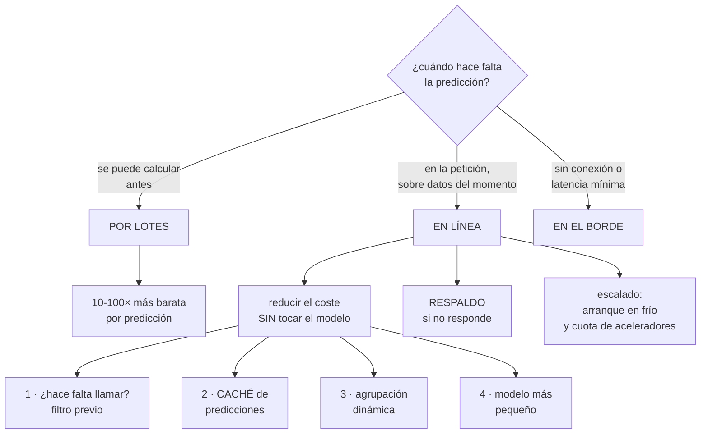

# 245 — Serving online, batch inference y escalado de modelos

> [← 244 · Feature stores, training pipelines y experiment tracking](../../part-20-cloud-data-ai-platforms/244-feature-stores-training-pipelines-y-experiment-tracking/README.md) · [Índice de la parte](../README.md) · [246 · MLOps, registro, promoción, drift y rollback →](../../part-20-cloud-data-ai-platforms/246-mlops-registro-promocion-drift-y-rollback/README.md)

**Parte:** 20 — Plataformas cloud de datos, analítica, IA y agentes<br>
**Nivel:** avanzado · **Horas estimadas:** 4<br>
**Laboratorio:** `performance` · **Estado:** `EXECUTABLE_CORE`

## 🎯 Propósito

Poner un modelo a servir peticiones reales, que es donde el coste y la latencia dejan de ser hipótesis. La clase compara servicio en línea y por lotes con el criterio que decide —**cuándo hace falta la predicción y cuántas se usan de verdad**—, cubre el escalado con aceleradores y sus particularidades, y desarrolla la palanca que más ahorra y menos se aplica: **no llamar al modelo cuando no hace falta**.

## 📚 Resultados de aprendizaje

Al finalizar podrás:

1. **Elegir** entre servicio en línea, por lotes y en el borde.
2. **Dimensionar** el servicio con la aritmética de colas y de aceleradores.
3. **Reducir** el coste sin tocar el modelo: caché, filtro y agrupación.
4. **Escalar** con arranque en frío de modelos grandes y capacidad limitada.
5. **Degradar** con un valor por defecto cuando el modelo no responde.

## 🧩 Conceptos centrales

| Concepto | Comprensión verificable |
|---|---|
| `servicio en línea` | Predicción bajo demanda, en el camino de la petición. Latencia baja y coste por petición. |
| `inferencia por lotes` | Predicciones calculadas de antemano para muchas entidades. Mucho más barata por predicción. |
| `agrupación dinámica` | Juntar peticiones que llegan casi a la vez en un solo paso por el acelerador. |
| `arranque en frío de modelo` | Tiempo de cargar los pesos en memoria. En modelos grandes, decenas de segundos. |
| `respaldo` | Respuesta alternativa cuando el modelo no responde o no aporta. |
| `coste por predicción útil` | Coste dividido entre las predicciones que cambiaron una decisión, no entre todas. |

## 🧠 Modelo mental

Una plataforma de IA sigue siendo un sistema de datos: necesita procedencia, evaluación, límites de costo, seguridad y operación antes de una interfaz inteligente.

Aplicado a esta clase, separa siempre cuatro planos: **intención** (qué necesita el usuario),
**configuración** (qué declaramos), **estado observado** (qué existe de verdad) y
**evidencia** (cómo sabemos que cumple). Confundirlos produce diseños que se ven correctos
en un diagrama pero fallan al operar.

## 🗺️ Flujo de razonamiento



## 📖 Desarrollo

### 1. En línea, por lotes o en el borde

La decisión se toma con dos preguntas y ahorra mucho dinero.

```text
1  ¿CUÁNDO HACE FALTA LA PREDICCIÓN?
   en el momento de la petición, con datos del momento
     → en línea
   se puede calcular antes
     → por lotes

2  ¿CUÁNTAS SE USAN DE VERDAD?
   si se calculan 4 millones y se usan 40.000, algo está
   mal en las dos direcciones
```

Y la comparación de coste, que es la que decide:

```text
POR LOTES
  se procesa mucho a la vez, con el acelerador saturado
  + entre 10 y 100 veces más barata por predicción
  + sin latencia que respetar
  − la predicción envejece: es de cuando se calculó
  − y no sirve para entradas que no existían

EN LÍNEA
  + siempre fresca, con datos del momento
  − coste por petición y latencia que respetar
  − y capacidad que hay que tener encendida

EN EL BORDE
  el modelo se ejecuta en el dispositivo
  + sin latencia de red y sin conexión    clase 203
  + sin coste de inferencia
  − modelo pequeño, y actualizarlo es desplegar a una flota
```

Y el patrón mixto, que resuelve la mayoría de los casos:

```text
POR LOTES para lo previsible
  las recomendaciones de los clientes activos, calculadas
  cada noche
EN LÍNEA solo para lo que no estaba
  clientes nuevos, sesiones sin identificar, contextos
  raros

→ y si el 92 % de las peticiones son de clientes conocidos,
  el 92 % del coste desaparece
```

Y la pregunta que hay que hacer antes de montar nada:

```text
¿CUÁNTAS PREDICCIONES CAMBIAN UNA DECISIÓN?
  un modelo que predice para todos los productos de una
  página, de los que el usuario mira 3
  → se pagan 40 predicciones para usar 3

→ y esa proporción es la que hay que medir: COSTE POR
  PREDICCIÓN ÚTIL, no por predicción       clase 214
```

### 2. Reducir el coste sin tocar el modelo

Las cuatro palancas, por orden de efecto y de esfuerzo.

```text
1  NO LLAMAR AL MODELO
   una regla previa que decide si hace falta
     «si el carrito está vacío, no hay nada que recomendar»
     «si el importe es menor de 5 €, no se evalúa fraude»
   → y esa regla suele eliminar entre el 20 % y el 60 % de
     las llamadas
   → es la palanca con más efecto y la que menos se aplica

2  CACHÉ DE PREDICCIONES
   la misma entrada produce la misma salida
   → si los atributos no han cambiado, la predicción
     tampoco
   → clave de caché = los atributos que entran al modelo
   → con validez corta, y con las cautelas de la clase 197

3  AGRUPACIÓN DINÁMICA
   juntar las peticiones que llegan en una ventana de
   milisegundos y pasarlas al acelerador de una vez
   → el acelerador rinde mucho más con lotes
   → coste por predicción, mucho menor
   − añade latencia: la ventana de espera
   → y por eso hay que dimensionarla con el objetivo de
     latencia delante                          clase 186

4  UN MODELO MÁS PEQUEÑO
   destilado, cuantizado o simplemente menor
   → suele perder poco y costar mucho menos
   → y hay que medir cuánto pierde, no suponerlo
```

Y el orden importa:

```text
aplicar las cuatro en orden
  la 1 elimina llamadas
  la 2 elimina cálculos repetidos
  la 3 abarata lo que queda
  la 4 abarata cada uno

→ empezar por la 4 (cambiar el modelo) es lo habitual y lo
  menos rentable
```

Y una palanca más, que es de arquitectura:

```text
SEPARAR LA RECUPERACIÓN DEL ORDENAMIENTO
  un método barato selecciona 200 candidatos de 4 millones
  el modelo caro ordena solo esos 200
→ y así el modelo caro no ve el catálogo entero
→ es el patrón estándar en recomendación y en búsqueda
```

Y lo que hay que medir para saber si funciona:

```text
llamadas al modelo por petición de usuario
proporción servida desde caché
tamaño medio de lote
coste por predicción y COSTE POR PREDICCIÓN ÚTIL
y el efecto de cada palanca en la calidad, medido
```

### 3. Escalar con aceleradores

El escalado de modelos tiene tres particularidades que no aparecen en un servicio normal.

```text
1  EL ARRANQUE EN FRÍO ES LARGO
   cargar los pesos en memoria: de segundos a minutos en
   modelos grandes
   → escalar de 0 a 1 no cubre un pico             clase 233
   → hace falta capacidad mínima encendida
   → y precargar el modelo en la imagen, no descargarlo al
     arrancar                                   clase 212

2  LOS ACELERADORES SON CAROS Y ESCASOS
   la cuota es limitada y hay que pedirla     clase 217
   → y en momentos de demanda, puede no haber
   → por eso la capacidad para picos se reserva, no se
     espera encontrar

3  LA UTILIZACIÓN ES LO QUE DECIDE EL COSTE
   un acelerador al 15 % cuesta lo mismo que al 90 %
   → y la agrupación dinámica es lo que lo sube
   → un servicio con un modelo por acelerador y poco
     tráfico es dinero tirado
```

Y las decisiones que resultan:

```text
VARIOS MODELOS POR ACELERADOR
  si caben en memoria, compartir
  → y con aislamiento de latencia entre ellos, o el modelo
    lento afecta al rápido                     clase 186

CAPACIDAD MÍNIMA POR OBJETIVO DE LATENCIA
  el escalado tarda; el margen lo cubre     clase 212

Y EL ESCALADO POR LA SEÑAL CORRECTA
  no por CPU: por peticiones en cola o por utilización del
  acelerador
  → y la CPU de un servicio de inferencia dice poco
                                                clase 212
```

**El respaldo**, que convierte una caída en una degradación:

```text
SI EL MODELO NO RESPONDE, ¿QUÉ SE DEVUELVE?
  los más vendidos, en recomendación
  la regla anterior, en fraude
  la estimación media, en plazos
  o nada, si la función es prescindible

→ y con eso, el modelo pasa a ser dependencia BLANDA
                                                clase 185
→ sin respaldo, el modelo es una dependencia dura en el
  camino crítico, y su disponibilidad entra en el techo

y hay que PROBARLO apagando el modelo             ley 22
  → en la clase 201, 2 de 5 dependencias declaradas
    blandas eran duras
```

Y el plazo, con la misma regla de siempre:

```text
plazo hacia el modelo = múltiplo pequeño de su p99
→ y al vencer, respaldo
→ nunca esperar «un poco más»: la petición del usuario
  tiene su propio presupuesto             clases 186, 207
```

### 4. Servir varias versiones y desplegar

**El despliegue de un modelo** tiene una diferencia con el de un servicio: el modelo puede ser correcto y peor.

```text
LO QUE HAY QUE COMPROBAR ANTES DE DESPLEGAR
  que responde y no falla                    ← lo obvio
  que la latencia está dentro del objetivo
  que las métricas de calidad en el conjunto de prueba son
    las esperadas                            clase 244
  que los atributos coinciden con los del entrenamiento
  y que sobre TRÁFICO REAL se comporta como se espera
    → y eso solo se sabe sirviendo
```

Y las formas de comprobarlo con tráfico real:

```text
ESPEJO
  el modelo nuevo recibe una copia del tráfico y su
  respuesta se descarta
  + sin riesgo para el usuario
  + permite comparar predicciones y latencia
  − no mide el efecto en el negocio

DESPLIEGUE ESCALONADO
  5 %, 25 %, 100 %, con vuelta atrás por métrica
                                                clase 102
  + mide el efecto real
  − expone a una parte de los usuarios

EXPERIMENTO CONTROLADO
  dos grupos, con asignación estable por usuario
  + mide el efecto en el NEGOCIO, no solo en la métrica del
    modelo
  − tarda: hace falta suficiente muestra
  → y es la única forma de saber si el modelo nuevo es
    mejor PARA LO QUE IMPORTA
```

Y la advertencia sobre las métricas:

```text
un modelo con mejor precisión puede empeorar el negocio
  recomendar lo que el usuario iba a comprar de todos modos
  mejora la métrica y no añade ventas
→ por eso la decisión se toma con la métrica de NEGOCIO,
  no con la del modelo                            ley 17
```

**Servir varias versiones**, que hace falta más de lo que parece:

```text
durante el escalonado, dos versiones a la vez
y a veces, versiones distintas por segmento

→ y cada predicción debe registrar QUÉ VERSIÓN la produjo
  → sin eso, no se pueden comparar resultados
  → ni explicar una predicción concreta      clase 250
```

Y lo que hay que registrar de cada predicción:

```text
identificador de la petición y de la traza  clase 238
versión del modelo y de los atributos
las ENTRADAS que recibió
  → para detectar desvío y para depurar   clase 244
la salida y su confianza
y, cuando llegue, el resultado real
  → que es lo que permite medir la calidad en producción
                                                clase 246
```

Y la lista de comprobación de la clase:

```text
☐ está decidido si la predicción va en línea o por lotes
☐ se ha medido cuántas predicciones se usan de verdad
☐ hay filtro previo que evita llamadas innecesarias
☐ hay caché de predicciones donde procede
☐ la agrupación dinámica está dimensionada con el objetivo
  de latencia
☐ se separan recuperación y ordenamiento si el catálogo es
  grande
☐ la capacidad mínima cubre el arranque en frío
☐ el modelo va precargado en la imagen
☐ la cuota de aceleradores tiene margen
☐ el escalado usa una señal distinta de la CPU
☐ hay respaldo y se ha probado apagando el modelo
☐ el plazo hacia el modelo es múltiplo pequeño de su p99
☐ el despliegue es escalonado, con vuelta atrás por métrica
☐ la decisión se toma con la métrica de negocio
☐ cada predicción registra versión, entradas y salida
```

Y el cierre que enlaza con la clase siguiente: con el modelo sirviendo, queda operarlo a lo largo del tiempo: promoverlo, detectar cuándo deja de servir y volver atrás. Es la materia de la clase 246.

## 🔬 Ejemplo trabajado

**CloudShop pone a servir su modelo de recomendación. Lo que sigue es la factura de inferencia que era 11 veces la del entrenamiento, las cuatro palancas aplicadas por orden, y el modelo mejor que empeoró las ventas.**

**El punto de partida:**

```text
coste mensual de aprendizaje automático        18.400 €
  entrenamiento                                 1.500 €
  INFERENCIA                                   16.900 €  ←

y la proporción
  inferencia / entrenamiento                       11:1

el servicio de recomendación
  peticiones de usuario al día                    2,1 M
  predicciones al día                            84 M
    → 40 productos evaluados por petición
  productos que el usuario ve                         6
  productos en los que hace clic                   0,08
```

Y la primera medida, que orientó todo:

```text
coste por predicción                        0,0000067 €
coste por predicción ÚTIL (las que se ven)   0,000045 €
coste por CLIC                                  0,0034 €

→ se pagaban 40 predicciones para mostrar 6
→ y de las 6, 0,08 producían un clic
```

**Palanca 1 · No llamar al modelo.**

```text
se analizaron las 2,1 M de peticiones diarias

  con carrito vacío y sin historial                31 %
    → no hay nada que personalizar
    → se sirven los más vendidos de la categoría
  con sesión de menos de 3 segundos                 9 %
    → el usuario se va antes de ver la
      recomendación
  desde rastreadores identificados                  7 %

  peticiones que llaman al modelo         2,1 M → 1,1 M
  reducción                                        48 %

y el efecto en negocio, medido
  clics en recomendación                        -0,3 %
  → dentro del ruido; los 31 % sin historial recibían
    recomendaciones que no se pulsaban
```

**Palanca 2 · Caché de predicciones.**

```text
los atributos de un cliente cambian cuando compra o navega
  → entre visitas seguidas, casi siempre son los mismos

caché con clave = huella de los atributos de entrada
validez                                          15 min

  tasa de aciertos                                 61 %
  llamadas al modelo                     1,1 M → 430 k

y la comprobación
  ¿las recomendaciones se quedan viejas?
  → se midió el clic con y sin caché: diferencia 0,1 %
  → aceptado, y declarado                    clase 187
```

**Palanca 3 · Agrupación dinámica.**

```text
antes   una petición, un paso por el acelerador
        utilización del acelerador                 17 %

agrupación con ventana de 8 ms
  tamaño medio de lote                             14
  utilización                                      71 %
  latencia p99 del modelo            22 ms → 31 ms
  → y el objetivo era 80 ms, así que cabía

aceleradores necesarios                     6 → 2
```

**Palanca 4 · Separar recuperación y ordenamiento.**

```text
antes   el modelo evaluaba 40 candidatos elegidos por una
        consulta

después
  recuperación: un método barato (vecinos por embebido
  precalculado) selecciona 40 de 4,1 M
    coste                             despreciable
  ordenamiento: el modelo caro ordena esos 40

→ y aquí no hubo ahorro porque ya se evaluaban 40
→ pero permitió subir a 200 candidatos sin coste adicional
  del recuperador
  → y la calidad del ordenamiento mejoró: +4 % de clics
```

**El resultado de las cuatro palancas:**

```text                                        antes     después
peticiones que llaman al modelo             2,1 M      430 k
predicciones al día                          84 M      8,6 M
utilización del acelerador                   17 %       71 %
aceleradores                                    6          2
coste de inferencia                     16.900 €     2.940 €
latencia p99 del servicio                   94 ms     102 ms
clics en recomendación                    base      +3,7 %

→ 83 % menos de coste y más clics
→ y no se tocó el modelo
```

**El modelo mejor que empeoró las ventas.**

```text
situación   un modelo nuevo mejoraba la precisión de 0,885
            a 0,912 en el conjunto de prueba
            el equipo quiso desplegarlo

el experimento controlado, 3 semanas, 50/50

  métrica                        modelo actual   nuevo
  precisión del modelo                 0,885     0,912
  clics en recomendación                base     +6,1 %
  INGRESOS por recomendación            base     -2,4 %  ←
  ticket medio                          base     -8,9 %

  qué pasaba
    el modelo nuevo era mejor prediciendo qué producto
    haría clic el usuario
    → y acertaba recomendando lo que el usuario IBA A
      COMPRAR DE TODOS MODOS
    → productos baratos y ya conocidos
    → sustituía descubrimiento por confirmación

decisión   NO desplegar
           y cambiar la métrica de entrenamiento: de clic a
           ingreso incremental

y la lección registrada
  «la métrica del modelo y la del negocio no son la misma
   cosa; la decisión se toma con la segunda»
                                                    ley 17
```

**El respaldo, probado.**

```text
el modelo era dependencia DURA del listado
  si no respondía, la página no cargaba

respaldo montado
  si el modelo no responde en 120 ms (3× su p99), se sirven
  los más vendidos de la categoría

prueba negativa: apagar el modelo
  primera ejecución    la página cargó, con los más
                       vendidos                      ✓
                       pero la latencia subió a 340 ms
                       → el plazo estaba en 300 ms, no 120
  corregido y repetido  latencia 108 ms               ✓

y el efecto en el techo de disponibilidad
  antes    el modelo, dependencia dura: 99,5 %
           techo del listado                    99,4 %
  después  dependencia blanda
           techo                                99,89 %
                                                clase 185
```

**El escalado y los aceleradores:**

```text
arranque en frío del modelo
  con descarga de pesos al arrancar              94 s
  con los pesos en la imagen                     18 s
  → y aun así, 18 s no cubre un pico

capacidad mínima                    2 instancias siempre
escalado por utilización del acelerador, no por CPU
  → la CPU estaba al 12 % con el acelerador al 71 %

cuota de aceleradores
  máximo del escalado                             8
  cuota concedida                                 8
  → sin margen
  → se pidió 12 y se alerta al 80 %          clase 217
  → y en la campaña de noviembre hizo falta llegar a 10
```

**El registro de predicciones:**

```text
por cada predicción se guarda
  identificador de traza                     clase 238
  versión del modelo y de la definición de atributos
  las entradas                                clase 244
  la salida y su confianza
  si vino de caché o del modelo
  y, cuando llega, si hubo clic y si hubo compra

  volumen                                  8,6 M/día
  muestreo del 5 % para las entradas completas
  coste                                     190 €/mes

y lo que permitió
  medir la calidad en producción, no solo en prueba
                                                clase 246
  detectar el desvío de atributos
  y explicar una predicción concreta ante una queja
```

**El resultado:**

```text                                        antes     después
coste de inferencia                     16.900 €     2.940 €
proporción inferencia/entrenamiento         11:1        2:1
aceleradores                                    6          2
utilización del acelerador                   17 %       71 %
clics en recomendación                     base      +3,7 %
techo de disponibilidad del listado       99,4 %     99,89 %
modelos desplegados por mejorar su
  métrica y empeorar el negocio                 —          0
coste por predicción útil            0,000045 €   0,0000078 €
```

**La lección que esta clase deja**: el 83 % del coste de inferencia se eliminó **sin tocar el modelo**, y la palanca que más aportó fue la primera y la más simple: **no llamar al modelo cuando no hace falta**, que quitó casi la mitad de las llamadas sin efecto medible en el negocio. Y el modelo con mejor precisión **redujo los ingresos un 2,4 %**: acertaba recomendando lo que el usuario iba a comprar igualmente.

## 🧪 Laboratorio guiado

Ejecuta desde la raíz:

```bash
python classes/part-20-cloud-data-ai-platforms/245-serving-online-batch-inference-y-escalado-de-modelos/lab.py
```

El laboratorio selecciona el motor de práctica **`performance`** y produce
`lab_result.json`. El escenario, sus comprobaciones y el artefacto esperado corresponden a
esta clase; no requiere credenciales y deja explícito qué debe revalidarse en un sandbox real.

1. Lee `exercise.steps` y formula una predicción antes de ejecutar.
2. Ejecuta la práctica y verifica todos los elementos de `checks`.
3. Provoca el caso de `negative_test` y explica la señal observada.
4. Materializa `model-serving` en `evidence/` usando la plantilla indicada.
5. Para proveedor real, sigue `sandbox.requires`, registra costo y ejecuta `destroy`.

### Evidencia esperada

El artefacto principal es una prueba de carga con baseline y cuello de botella. Además, la entrega debe incluir el comando ejecutado,
la salida estructurada y una conclusión que no exceda lo observado.

## 🏆 Reto verificable

Construye **`model-serving`** para el caso CloudShop. Incluye una alternativa descartada,
un supuesto que pueda falsarse, una prueba de fallo y una decisión de rollback.

## ✅ Criterio de aceptación

- [ ] `lab.py` termina con código 0 y genera JSON válido.
- [ ] La entrega conecta al menos tres requisitos con mecanismos verificables.
- [ ] Existe una prueba positiva y una prueba negativa con evidencia.
- [ ] Seguridad, costo y operación aparecen como decisiones, no como anexos.
- [ ] Se declara una limitación y una condición que obligaría a revisar el diseño.
- [ ] Otra persona puede repetir el recorrido sin conocimiento tácito.

## ⚠️ Errores frecuentes

| Síntoma | Causa probable | Corrección |
|---|---|---|
| La factura de inferencia es varias veces la de entrenamiento | Se llama al modelo para todo y las predicciones útiles son una fracción | Mide el coste por predicción útil y aplica las cuatro palancas por orden: no llamar, cachear, agrupar y reducir el modelo. |
| El acelerador está al 15 % y el coste es alto | Una petición por paso, sin agrupación | Activa la agrupación dinámica con la ventana dimensionada contra el objetivo de latencia. |
| El escalado no cubre los picos | El arranque en frío del modelo es de decenas de segundos | Precarga los pesos en la imagen, mantén capacidad mínima y pide cuota de aceleradores con margen. |
| Si el modelo falla, la página no carga | El modelo es dependencia dura del camino crítico | Define un respaldo, ponle plazo corto y compruébalo apagando el modelo. |
| Un modelo con mejor métrica empeora el negocio | La métrica del modelo no es la del negocio | Decide con un experimento controlado sobre la métrica de negocio, y ajusta el objetivo de entrenamiento si difieren. |
| No se puede explicar ni comparar una predicción concreta | No se registra qué versión la produjo ni con qué entradas | Registra versión, entradas, salida y resultado real, con muestreo si el volumen lo exige. |

## 🛡️ Seguridad, ética y costo

Trabaja con cuentas propias o sandboxes autorizados. No publiques secretos, identificadores
reales ni datos personales. Antes de crear recursos pagos define presupuesto, etiquetas y
comando de destrucción; después verifica que no queden recursos huérfanos. Los ejemplos
locales enseñan contratos, pero no certifican cumplimiento ni disponibilidad de producción.

## ❓ Preguntas de comprobación

1. ¿Qué dos preguntas deciden entre servicio en línea y por lotes?
2. ¿Cuáles son las cuatro palancas de coste y en qué orden se aplican?
3. ¿Qué relación hay entre agrupación dinámica, utilización del acelerador y latencia?
4. ¿Qué convierte un modelo en dependencia blanda y cómo se comprueba?
5. ¿Por qué la decisión de desplegar se toma con la métrica de negocio?

## 🔗 Referencias

- NVIDIA (2025). *Triton Inference Server: dynamic batching and model concurrency*. <https://docs.nvidia.com/deeplearning/triton-inference-server/user-guide/docs/user_guide/model_configuration.html>
- Google (2025). *Vertex AI: online and batch prediction*. <https://cloud.google.com/vertex-ai/docs/predictions/overview>
- Huyen, C. (2022). *Designing Machine Learning Systems*, caps. 7-8. <https://www.oreilly.com/library/view/designing-machine-learning/9781098107956/>
- Kohavi, R. y otros (2020). *Trustworthy Online Controlled Experiments*. <https://experimentguide.com/>
- Covington, P. y otros (2016). *Deep neural networks for YouTube recommendations* — recuperación y ordenamiento. <https://research.google/pubs/pub45530/>
- Documentación oficial vigente del servicio implementado; registra URL y fecha de consulta.

---

> [Evaluación](assessment.md) · [Contrato de clase](lesson.yaml) · [Índice de la parte](../README.md)

| Anterior | Índice | Siguiente |
|---|---|---|
| [← 244 · Feature stores, training pipelines y experiment tracking](../../part-20-cloud-data-ai-platforms/244-feature-stores-training-pipelines-y-experiment-tracking/README.md) | [Parte 20](../README.md) · [Programa](../../README.md) | [246 · MLOps, registro, promoción, drift y rollback →](../../part-20-cloud-data-ai-platforms/246-mlops-registro-promocion-drift-y-rollback/README.md) |
