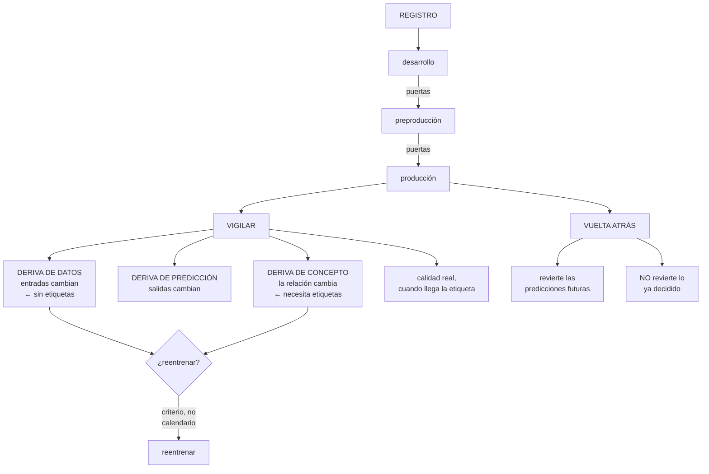

# 246 — MLOps, registro, promoción, drift y rollback

> [← 245 · Serving online, batch inference y escalado de modelos](../../part-20-cloud-data-ai-platforms/245-serving-online-batch-inference-y-escalado-de-modelos/README.md) · [Índice de la parte](../README.md) · [247 · Modelos fundacionales, tokens, embeddings y RAG →](../../part-20-cloud-data-ai-platforms/247-modelos-fundacionales-tokens-embeddings-y-rag/README.md)

**Parte:** 20 — Plataformas cloud de datos, analítica, IA y agentes<br>
**Nivel:** avanzado · **Horas estimadas:** 4<br>
**Laboratorio:** `delivery` · **Estado:** `EXECUTABLE_CORE`

## 🎯 Propósito

Operar modelos a lo largo del tiempo, que es donde fallan casi todos los proyectos de aprendizaje automático: **el modelo se despliega, funciona, y nadie mira si sigue funcionando**. La clase cubre el registro y la promoción con puertas, los tipos de deriva y cómo se detecta cada uno, la vuelta atrás con su particularidad —**revertir el modelo no revierte lo que ya decidió**—, y el reentrenamiento con su criterio.

## 📚 Resultados de aprendizaje

Al finalizar podrás:

1. **Promover** modelos por etapas, con puertas comprobables.
2. **Distinguir** los tipos de deriva y detectar cada uno.
3. **Medir** la calidad en producción cuando la etiqueta tarda o no llega.
4. **Volver atrás** sabiendo qué se revierte y qué no.
5. **Decidir** cuándo reentrenar, con un criterio y no por calendario.

## 🧩 Conceptos centrales

| Concepto | Comprensión verificable |
|---|---|
| `registro de modelos` | Catálogo de modelos con sus versiones, etapas, métricas y trazabilidad al experimento. |
| `promoción` | Paso de una versión de una etapa a la siguiente, con puertas que hay que superar. |
| `deriva de datos` | Las entradas cambian de distribución. Se detecta sin necesidad de etiquetas. |
| `deriva de concepto` | La relación entre entradas y resultado cambia. Solo se detecta con etiquetas. |
| `retroalimentación` | Efecto por el que las decisiones del modelo cambian los datos que lo entrenarán. |
| `reentrenamiento` | Actualización del modelo con datos nuevos. Se dispara por señal, no por calendario. |

## 🧠 Modelo mental

Una plataforma de IA sigue siendo un sistema de datos: necesita procedencia, evaluación, límites de costo, seguridad y operación antes de una interfaz inteligente.

Aplicado a esta clase, separa siempre cuatro planos: **intención** (qué necesita el usuario),
**configuración** (qué declaramos), **estado observado** (qué existe de verdad) y
**evidencia** (cómo sabemos que cumple). Confundirlos produce diseños que se ven correctos
en un diagrama pero fallan al operar.

## 🗺️ Flujo de razonamiento



## 📖 Desarrollo

### 1. Registro y promoción

Un modelo en producción tiene que poder responder a tres preguntas, y el registro es lo que las contesta.

```text
¿QUÉ VERSIÓN ESTÁ SIRVIENDO?
¿DE DÓNDE SALIÓ?
¿QUÉ TUVO QUE SUPERAR PARA LLEGAR AQUÍ?

y el registro guarda
  la versión, con su artefacto inmutable
  el experimento que la produjo               clase 244
  los datos y su versión
  las métricas en el conjunto de prueba
  la etapa: desarrollo, preproducción, producción
  quién la promovió y cuándo
  y la firma del artefacto                    clase 106
```

**Las puertas de promoción**, que hay que declarar antes:

```text
A PREPRODUCCIÓN
  el experimento es reproducible               clase 244
  las métricas superan un umbral mínimo
  no hay fuga detectada                        clase 244
  los atributos coinciden con los de servicio
  el modelo carga y responde
  y la latencia está dentro del objetivo    clase 245

A PRODUCCIÓN
  espejo o escalonado con tráfico real, sin degradación
  el experimento controlado da mejor resultado en la
    MÉTRICA DE NEGOCIO                          ley 17
  la evaluación de sesgos y de casos límite pasó
                                                clase 250
  el respaldo está probado                     clase 245
  y hay procedimiento de vuelta atrás
```

Y la regla que evita el problema de siempre:

```text
las puertas se COMPRUEBAN automáticamente
  → si son una lista que alguien marca, se marcan
                                                    ley 22
→ y las que no se puedan automatizar se declaran como
  manuales, con quién firma
```

Y una decisión que hay que tomar:

```text
¿QUIÉN PROMUEVE A PRODUCCIÓN?
  el equipo que entrena, con las puertas verdes
  o alguien más, con aprobación
→ y en modelos que afectan a personas —crédito, selección,
  precios— la aprobación es de negocio, no técnica
                                                clase 251
```

Y la trazabilidad completa:

```text
de la predicción → a la versión del modelo   clase 245
  → al experimento
    → al conjunto de datos y su versión
      → a las tablas y sus contratos          clase 243

→ y esa cadena es lo que permite contestar una reclamación
  y pasar una auditoría
```

### 2. Los tipos de deriva

«El modelo se ha degradado» es un diagnóstico incompleto. Hay tres cosas distintas y se detectan de formas distintas.

```text
DERIVA DE DATOS — las ENTRADAS cambian
  la distribución de los atributos es otra
  ejemplo   la proporción de clientes móviles pasa del
            40 % al 70 %
  → se detecta SIN etiquetas, comparando distribuciones
  → y es la que se puede vigilar desde el primer día

DERIVA DE PREDICCIÓN — las SALIDAS cambian
  el modelo empieza a predecir otra cosa
  ejemplo   la proporción de «fraude» pasa del 2 % al 9 %
  → tampoco necesita etiquetas
  → y suele ser consecuencia de la anterior

DERIVA DE CONCEPTO — la RELACIÓN cambia
  las mismas entradas ya no llevan al mismo resultado
  ejemplo   una campaña cambia el comportamiento de compra
  → SOLO se detecta con etiquetas
  → y es la que de verdad degrada la calidad

Y LO QUE NO ES DERIVA
  un error en la ingesta de un atributo   clase 242
  un cambio de esquema no anunciado       clase 243
  → se manifiestan igual, y se arreglan de otra manera
  → por eso lo primero es descartar que el dato esté mal
```

Y cómo se mide cada una:

```text
DE DATOS
  por atributo: distancia entre la distribución actual y la
  del entrenamiento
  → con umbral, y por atributo, no en global
  → un solo atributo derivado puede bastar

DE PREDICCIÓN
  distribución de las salidas, comparada con la de
  referencia

DE CONCEPTO
  la métrica de calidad, calculada cuando llegan las
  etiquetas
  → y si tardan 30 días, se sabe con 30 días de retraso
```

**Cuando la etiqueta tarda o no llega**, que es el caso habitual:

```text
MÉTRICAS INDIRECTAS
  ¿el usuario aceptó la sugerencia?
  ¿el operador corrigió la decisión del modelo?
  ¿la tasa de reclamaciones cambió?
  → llegan antes y correlacionan

ETIQUETADO PARCIAL
  anotar una muestra a mano, periódicamente
  → caro, y suficiente para detectar degradación

Y EL CONJUNTO DE REFERENCIA
  un conjunto fijo, etiquetado, que se pasa por el modelo
  cada semana
  → detecta si el modelo cambió; no si el mundo cambió
  → y por eso hace falta además la deriva de datos
```

Y la advertencia de la retroalimentación:

```text
las decisiones del modelo cambian los datos futuros
  el modelo de crédito rechaza a un grupo
  → no hay datos de si habrían pagado
  → el modelo siguiente hereda esa ceguera
                                          clase 244

→ y por eso hace falta exploración, y hay que decidir
  cuánta
```

### 3. Volver atrás, y lo que no se revierte

Aquí hay una diferencia importante con un servicio normal.

```text
REVERTIR UN SERVICIO
  se vuelve a la versión anterior y el sistema queda como
  estaba

REVERTIR UN MODELO
  las predicciones futuras vuelven a ser las de antes
  LAS DECISIONES YA TOMADAS, NO
    los pedidos rechazados siguen rechazados
    los precios aplicados, aplicados
    las recomendaciones mostradas, mostradas
    y los correos enviados, enviados

→ y por eso el escalonado importa más aquí: limita cuántas
  decisiones se toman con el modelo malo   clase 245
```

Y lo que hay que tener preparado:

```text
LA VUELTA ATRÁS TÉCNICA
  cambiar el porcentaje de tráfico o la versión activa
  → segundos, si el registro y el servicio lo permiten

Y LA REPARACIÓN DEL DAÑO
  ¿se pueden identificar las decisiones afectadas?
  → sí, si cada predicción registra su versión
                                                clase 245
  ¿se pueden deshacer?
  → depende: un precio se puede abonar, un correo no se
    puede recuperar
  → y hay que tenerlo pensado ANTES, por tipo de decisión
```

Y una decisión de diseño que reduce el daño:

```text
PARA DECISIONES IRREVERSIBLES O DE ALTO IMPACTO
  el modelo SUGIERE y una persona decide
  o el modelo decide dentro de límites y lo demás escala
    «el modelo puede aprobar hasta 500 €; por encima,
     revisión»
→ y esos límites son la contención de esta capa
                                                clase 153
```

**El reentrenamiento**, con el criterio:

```text
✗ POR CALENDARIO
  «reentrenamos cada mes»
  → se reentrena cuando no hace falta y no se reentrena
    cuando sí

✓ POR SEÑAL
  deriva de datos por encima del umbral
  degradación de la métrica de calidad
  o llegada de datos de un periodo que cambia el problema
    (una campaña, una temporada)

Y EN AMBOS CASOS, CON PUERTAS
  el modelo reentrenado NO va a producción por ser más
  nuevo
  → pasa las mismas puertas que cualquier otro
  → y si es peor, no se promueve
```

Y el reentrenamiento automático, que hay que tratar con cuidado:

```text
un proceso que reentrena y despliega solo es cómodo y
peligroso
  → si los datos de entrada están mal, el modelo aprende lo
    malo y se despliega
  → y el fallo se propaga sin que nadie lo vea      ley 13

→ el reentrenamiento se puede automatizar
→ la PROMOCIÓN, con puertas y, en muchos casos, con
  aprobación
```

Y una comprobación que evita desastres:

```text
el modelo reentrenado se compara con el actual EN EL MISMO
conjunto de prueba
→ y si la diferencia es grande en cualquier dirección, se
  investiga antes de promover
→ una mejora enorme suele ser una fuga        clase 244
```

### 4. Operar la flota de modelos

Cuando hay más de tres o cuatro modelos, aparecen los problemas de escala organizativa.

```text
LO QUE HAY QUE SABER DE CADA MODELO
  qué decide y qué impacto tiene
  quién es el dueño                              ley 20
  cuándo se entrenó y con qué datos
  cuál es su métrica y su umbral de alerta
  qué respaldo tiene
  y cuándo se revisó por última vez

→ y sin eso, aparecen modelos en producción que nadie
  mantiene
```

Y el hallazgo típico del primer inventario:

```text
modelos sirviendo que nadie sabía que existían
modelos entrenados hace años y nunca reentrenados
modelos cuyo dueño ya no está en la empresa
y modelos que se pueden apagar porque su decisión ya no se
  usa                                              ley 25
```

**La retirada**, que es tan necesaria como en el resto:

```text
un modelo que no se usa sigue costando
  inferencia, atributos que se calculan, datos que se
  ingieren
→ y su retirada exige saber quién consume sus predicciones
                                                clase 243
```

**Lo que hay que vigilar** por modelo:

```text
volumen de predicciones y su tendencia
latencia y errores                          clase 245
deriva de datos, por atributo
deriva de predicción
calidad real, cuando llegan las etiquetas
proporción servida desde el respaldo
  → si sube, el modelo está fallando y nadie lo nota
                                                clase 185
y coste por predicción útil                 clase 245
```

Y las alertas que hacen falta:

```text
deriva de un atributo por encima del umbral
caída de la métrica de calidad
cambio en la distribución de las salidas
proporción de respaldo por encima de lo normal
y AUSENCIA: «este modelo no ha recibido peticiones en N
  horas»                                          ley 13
```

Y la revisión periódica, que es lo que evita la degradación lenta:

```text
cada trimestre, por modelo
  ¿sigue haciendo falta?
  ¿su métrica sigue en el objetivo?
  ¿cuándo se reentrenó?
  ¿su dueño sigue siendo ese?
  ¿los datos que usa siguen siendo los que debe?
                                          clases 244, 251
  y ¿qué pasaría si lo apagáramos hoy?
```

Y la lista de comprobación de la clase:

```text
☐ hay registro de modelos con versión, etapa y
  trazabilidad
☐ las puertas de promoción están declaradas y se comprueban
  solas
☐ las que no se pueden automatizar tienen firmante
☐ se distingue deriva de datos, de predicción y de concepto
☐ se descarta primero que el dato esté mal
☐ hay medida de calidad en producción, aunque sea indirecta
☐ está previsto qué decisiones se pueden deshacer y cuáles
  no
☐ las decisiones de alto impacto tienen límite o revisión
  humana
☐ el reentrenamiento se dispara por señal, no por
  calendario
☐ el modelo reentrenado pasa las mismas puertas
☐ la promoción automática está limitada o aprobada
☐ hay inventario de modelos con dueño y última revisión
☐ se vigila la proporción servida desde el respaldo
☐ hay alerta por ausencia de peticiones
☐ hay revisión trimestral por modelo
```

Y el cierre que enlaza con la clase siguiente: hasta aquí, modelos entrenados sobre datos propios. La parte que viene trata de los modelos fundacionales, que se usan sin entrenarlos y traen problemas distintos. Es la materia de la clase 247.

## 🔬 Ejemplo trabajado

**CloudShop opera sus cuatro modelos. Lo que sigue es el modelo que llevaba 14 meses degradándose sin que nadie lo notara, el reentrenamiento automático que desplegó un modelo entrenado con datos corruptos, y el inventario que encontró siete modelos.**

**El punto de partida:**

```text
modelos que el equipo conocía                        4
modelos sirviendo peticiones                         7  ←
  los 3 desconocidos
    · un clasificador de comentarios, de 2022
    · un detector de duplicados de catálogo
    · un modelo de estimación de demanda cuyo dueño
      dejó la empresa en 2023                    ley 20

vigilancia por modelo
  latencia y errores                                 4/7
  deriva                                             0/7
  calidad en producción                              0/7
  dueño identificable                                4/7
```

**El modelo que llevaba 14 meses degradándose.**

```text
el modelo de estimación de plazo de entrega
  entrenado en enero de 2024
  precisión medida entonces (error medio)      1,4 días

se revisó al montar la vigilancia
  error medio actual                           3,9 días
  → y las quejas por plazo incumplido habían subido un
    140 % en ese periodo
  → se atribuían a «problemas de logística»

el diagnóstico
  deriva de datos: la proporción de envíos por el
  transportista B pasó del 12 % al 41 %
    → CloudShop había cambiado de proveedor principal en
      marzo de 2024
    → y el modelo nunca vio ese cambio
  deriva de concepto: los plazos del transportista B se
    comportan distinto

→ ninguna de las dos se vigilaba
→ y la calidad en producción tampoco: la etiqueta (plazo
  real) llegaba a los 5 días y nadie la comparaba con la
  predicción

corrección
  reentrenamiento con datos de los 12 meses anteriores
  error medio                              3,9 → 1,2 días
  quejas por plazo                                -61 %
```

Y lo que se montó para que no vuelva:

```text
vigilancia de deriva por atributo, con umbral
  → el atributo «transportista» habría disparado la alerta
    en marzo de 2024
calidad en producción: al llegar el plazo real, se compara
  con la predicción
  → error medio, calculado a diario, con alerta al superar
    2 días
```

**El reentrenamiento automático que salió mal.**

```text
el modelo de recomendación tenía reentrenamiento
automático mensual, con despliegue automático si la métrica
no empeoraba más de un 2 %

qué pasó en agosto
  la ingesta de eventos tuvo un fallo durante 6 días: el
  41 % de los eventos llegó sin canal de origen
                                                clase 243
  el reentrenamiento se ejecutó con esos datos
  la métrica en el conjunto de prueba bajó un 1,4 %
  → dentro del umbral del 2 %
  → se desplegó automáticamente

  efecto en producción
    clics en recomendación                       -11 %
    ingresos por recomendación                    -8 %
    duración hasta detectarlo                    9 días
    → se detectó por el panel de ingresos, no por el
      modelo                                       ley 15

correcciones
  1  el reentrenamiento comprueba primero la CALIDAD DE LOS
     DATOS de entrada                          clase 243
     → si las comprobaciones no pasan, no entrena
  2  la promoción automática se limitó
     → despliegue al 5 % automático
     → al 100 %, con métrica de negocio de 48 h y
       aprobación
  3  y una comprobación: si la métrica cambia más de un 1 %
     en cualquier dirección, se investiga  clase 244

y la regla que quedó escrita
  «se puede automatizar el entrenamiento; la promoción a
   todo el tráfico, no»
```

**Las puertas de promoción, declaradas.**

```text
A PREPRODUCCIÓN, automáticas
  ☐ experimento reproducible
  ☐ métricas por encima del mínimo del modelo
  ☐ sin fuga: comprobación de correlación sospechosa
  ☐ atributos idénticos entre entrenamiento y servicio
                                                clase 244
  ☐ carga y responde en menos de 60 s
  ☐ latencia p99 dentro del objetivo

A PRODUCCIÓN
  ☐ espejo 48 h sin degradación de latencia   automática
  ☐ escalonado al 5 %, 48 h                   automática
  ☐ métrica de NEGOCIO no peor                automática
  ☐ evaluación de sesgos por segmento         automática
                                                clase 250
  ☐ respaldo probado                          automática
  ☐ aprobación del dueño del producto         MANUAL

y en el primer trimestre
  promociones intentadas                            14
  bloqueadas por una puerta                          5
    · 2 por métrica de negocio peor
    · 1 por fuga detectada
    · 1 por atributos que no coincidían
    · 1 por latencia
```

**La vuelta atrás, y lo que no se revirtió.**

```text
incidente   el modelo de fraude nuevo empezó a rechazar el
            9 % de los pagos, frente al 2 % habitual

  09:14  la alerta de deriva de PREDICCIÓN se dispara
         «la proporción de rechazo está fuera de su rango»
  09:16  se revierte cambiando el porcentaje de tráfico
  09:16  vuelta atrás técnica completada           2 min

  y lo que NO se revirtió
    pagos rechazados entre 08:40 y 09:16          1.140
    de ellos, legítimos (estimado)                  980
    → esos clientes ya habían recibido el rechazo
    → 214 habían abandonado la compra

  la reparación
    las 1.140 se identificaron por el registro de
    predicciones                              clase 245
    se contactó a los 980 con un código de descuento
    coste de la reparación                     4.100 €

→ y por eso el modelo estaba al 5 % y no al 100 %
  → al 100 %, habrían sido 22.800 rechazos
```

Y la corrección de diseño:

```text
el modelo de fraude pasó a tener límites
  puede rechazar automáticamente hasta 200 €
  entre 200 y 1.000 €, marca para revisión
  por encima, siempre revisión humana
→ y así una decisión errónea del modelo no es irreversible
                                                clase 153
```

**El inventario y las retiradas:**

```text
los 7 modelos, revisados

  modelo                     dueño   uso        decisión
  recomendación              sí      alto       mantener
  plazo de entrega           sí      alto       mantener
  fraude                     sí      alto       mantener
  devolución                 sí      medio      mantener
  clasificador de
    comentarios (2022)       no      0 pred/día RETIRAR
  detector de duplicados     no      12/día     asignar
                                                dueño
  estimación de demanda      no      alto       ASIGNAR
                                                dueño y
                                                reentrenar

y el de estimación de demanda
  entrenado en 2022, nunca reentrenado
  alimentaba las decisiones de reposición del almacén
  error medio                          medido: 34 %
  tras reentrenar                              11 %
  → reducción de stock inmovilizado    -190.000 €

y el clasificador retirado
  costaba 340 €/mes en inferencia y atributos
  0 predicciones al día desde 2023            ley 25
```

**El resultado, al año:**

```text                                        antes     después
modelos conocidos                             4/7        7/7
modelos con dueño                             4/7        6/6
  (uno retirado)
modelos con vigilancia de deriva              0/7        6/6
modelos con calidad medida en producción      0/7        6/6
tiempo de detección de degradación        14 meses     3 días
error del modelo de plazo                 3,9 días   1,2 días
error del modelo de demanda                  34 %       11 %
promociones bloqueadas por puertas              0          5
despliegues automáticos al 100 %                sí         no
modelos retirados                               0          1
```

**La lección que esta clase deja**: un modelo llevaba **catorce meses degradándose** —de 1,4 a 3,9 días de error— porque el proveedor de transporte cambió y el modelo nunca lo supo; las quejas se atribuían a logística. Y el reentrenamiento automático **desplegó un modelo entrenado con seis días de datos corruptos** porque la métrica bajó menos del umbral: automatizar el entrenamiento es razonable; automatizar la promoción a todo el tráfico, no.

## 🧪 Laboratorio guiado

Ejecuta desde la raíz:

```bash
python classes/part-20-cloud-data-ai-platforms/246-mlops-registro-promocion-drift-y-rollback/lab.py
```

El laboratorio selecciona el motor de práctica **`delivery`** y produce
`lab_result.json`. El escenario, sus comprobaciones y el artefacto esperado corresponden a
esta clase; no requiere credenciales y deja explícito qué debe revalidarse en un sandbox real.

1. Lee `exercise.steps` y formula una predicción antes de ejecutar.
2. Ejecuta la práctica y verifica todos los elementos de `checks`.
3. Provoca el caso de `negative_test` y explica la señal observada.
4. Materializa `mlops-pipeline` en `evidence/` usando la plantilla indicada.
5. Para proveedor real, sigue `sandbox.requires`, registra costo y ejecuta `destroy`.

### Evidencia esperada

El artefacto principal es un pipeline con gates, promoción y rollback. Además, la entrega debe incluir el comando ejecutado,
la salida estructurada y una conclusión que no exceda lo observado.

## 🏆 Reto verificable

Construye **`mlops-pipeline`** para el caso CloudShop. Incluye una alternativa descartada,
un supuesto que pueda falsarse, una prueba de fallo y una decisión de rollback.

## ✅ Criterio de aceptación

- [ ] `lab.py` termina con código 0 y genera JSON válido.
- [ ] La entrega conecta al menos tres requisitos con mecanismos verificables.
- [ ] Existe una prueba positiva y una prueba negativa con evidencia.
- [ ] Seguridad, costo y operación aparecen como decisiones, no como anexos.
- [ ] Se declara una limitación y una condición que obligaría a revisar el diseño.
- [ ] Otra persona puede repetir el recorrido sin conocimiento tácito.

## ⚠️ Errores frecuentes

| Síntoma | Causa probable | Corrección |
|---|---|---|
| Un modelo se degrada durante meses sin que nadie lo note | No se vigila la deriva ni la calidad en producción | Vigila deriva por atributo, distribución de salidas y calidad real cuando llega la etiqueta, con alertas. |
| Se reentrena y el modelo empeora sin explicación | Los datos de entrada estaban mal y el reentrenamiento no lo comprobó | Ejecuta las comprobaciones de calidad de datos antes de entrenar; si no pasan, no se entrena. |
| Un modelo malo llega a todo el tráfico automáticamente | La promoción está automatizada con un umbral laxo | Automatiza el entrenamiento y el despliegue parcial; la promoción a todo el tráfico, con métrica de negocio y aprobación. |
| Revertir el modelo no arregla el daño | Las decisiones ya tomadas no se revierten al cambiar de versión | Limita el porcentaje de tráfico, registra la versión en cada predicción para identificar lo afectado y prevé la reparación por tipo de decisión. |
| Aparecen modelos en producción que nadie mantiene | No hay inventario con dueño ni revisión periódica | Inventaría modelos con dueño, uso, última revisión y respaldo; retira los que no se usan. |
| Se reentrena cada mes y a veces no hacía falta y otras hacía falta antes | El disparador es el calendario | Dispara por señal: deriva por encima del umbral, degradación de la métrica o cambio conocido del problema. |

## 🛡️ Seguridad, ética y costo

Trabaja con cuentas propias o sandboxes autorizados. No publiques secretos, identificadores
reales ni datos personales. Antes de crear recursos pagos define presupuesto, etiquetas y
comando de destrucción; después verifica que no queden recursos huérfanos. Los ejemplos
locales enseñan contratos, pero no certifican cumplimiento ni disponibilidad de producción.

## ❓ Preguntas de comprobación

1. ¿Qué diferencia hay entre deriva de datos, de predicción y de concepto?
2. ¿Qué hay que descartar antes de diagnosticar deriva?
3. ¿Cómo se mide la calidad en producción cuando la etiqueta tarda?
4. ¿Qué revierte y qué no revierte volver a la versión anterior de un modelo?
5. ¿Qué parte del ciclo se puede automatizar y cuál conviene no automatizar?

## 🔗 Referencias

- Sculley, D. y otros (2015). *Hidden technical debt in machine learning systems*. <https://papers.nips.cc/paper/2015/hash/86df7dcfd896fcaf2674f757a2463eba-Abstract.html>
- Huyen, C. (2022). *Designing Machine Learning Systems*, cap. 8 — data distribution shifts. <https://www.oreilly.com/library/view/designing-machine-learning/9781098107956/>
- Google (2025). *MLOps: continuous delivery and automation pipelines*. <https://cloud.google.com/architecture/mlops-continuous-delivery-and-automation-pipelines-in-machine-learning>
- MLflow (2025). *Model registry and stages*. <https://mlflow.org/docs/latest/model-registry.html>
- Breck, E. y otros (2017). *The ML test score: a rubric for ML production readiness*. <https://research.google/pubs/pub46555/>
- Documentación oficial vigente del servicio implementado; registra URL y fecha de consulta.

---

> [Evaluación](assessment.md) · [Contrato de clase](lesson.yaml) · [Índice de la parte](../README.md)

**📥 Descargar:** [Parte 20 en PDF](../../../site/downloads/partes/manual-parte-20-cloud-data-ai-platforms.pdf) · [Manual integral](../../../site/downloads/multi-cloud-engineering-manual-v2.0.pdf)

| Anterior | Índice | Siguiente |
|---|---|---|
| [← 245 · Serving online, batch inference y escalado de modelos](../../part-20-cloud-data-ai-platforms/245-serving-online-batch-inference-y-escalado-de-modelos/README.md) | [Parte 20](../README.md) · [Programa](../../README.md) | [247 · Modelos fundacionales, tokens, embeddings y RAG →](../../part-20-cloud-data-ai-platforms/247-modelos-fundacionales-tokens-embeddings-y-rag/README.md) |
