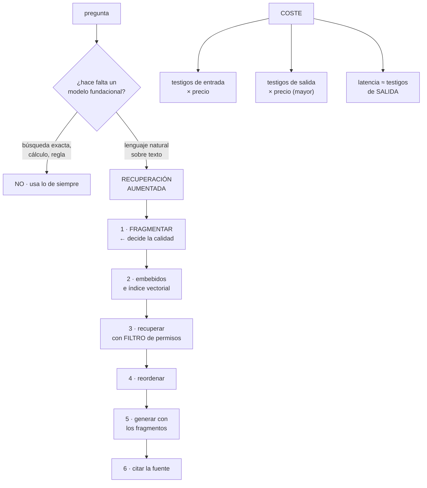

# 247 — Modelos fundacionales, tokens, embeddings y RAG

> [← 246 · MLOps, registro, promoción, drift y rollback](../../part-20-cloud-data-ai-platforms/246-mlops-registro-promocion-drift-y-rollback/README.md) · [Índice de la parte](../README.md) · [248 · Bedrock, Azure AI Foundry y Vertex AI →](../../part-20-cloud-data-ai-platforms/248-bedrock-azure-ai-foundry-y-vertex-ai/README.md)

**Parte:** 20 — Plataformas cloud de datos, analítica, IA y agentes<br>
**Nivel:** avanzado · **Horas estimadas:** 4<br>
**Laboratorio:** `architecture` · **Estado:** `EXECUTABLE_CORE`

## 🎯 Propósito

Entender los modelos fundacionales lo suficiente para tomar decisiones de ingeniería con ellos: **qué determina el coste y la latencia, por qué la recuperación aumentada resuelve unos problemas y no otros, y qué se puede y no se puede garantizar**. La clase cubre los testigos como unidad de coste, los embebidos y la búsqueda vectorial, el patrón de recuperación aumentada con sus modos de fallo, y cuándo no hace falta un modelo de este tipo.

## 📚 Resultados de aprendizaje

Al finalizar podrás:

1. **Calcular** coste y latencia a partir de testigos y de la ventana de contexto.
2. **Construir** búsqueda por embebidos con la partición y el filtrado correctos.
3. **Montar** recuperación aumentada sabiendo qué resuelve y qué no.
4. **Reducir** coste con caché, modelos menores y filtros previos.
5. **Decidir** cuándo un modelo fundacional no es la herramienta.

## 🧩 Conceptos centrales

| Concepto | Comprensión verificable |
|---|---|
| `testigo` | Unidad en que el modelo procesa el texto. Es la unidad de coste y de límite de contexto. |
| `ventana de contexto` | Cuántos testigos caben en una petición. Su uso decide coste y latencia. |
| `embebido` | Representación numérica de un texto que permite comparar significado por distancia. |
| `búsqueda vectorial` | Recuperación por proximidad de embebidos. Aproximada, con parámetros que cambian precisión y latencia. |
| `recuperación aumentada` | Buscar fragmentos relevantes y dárselos al modelo como contexto para que responda con ellos. |
| `fragmentación` | División de los documentos en trozos indexables. Decide más la calidad que el modelo elegido. |

## 🧠 Modelo mental

Una plataforma de IA sigue siendo un sistema de datos: necesita procedencia, evaluación, límites de costo, seguridad y operación antes de una interfaz inteligente.

Aplicado a esta clase, separa siempre cuatro planos: **intención** (qué necesita el usuario),
**configuración** (qué declaramos), **estado observado** (qué existe de verdad) y
**evidencia** (cómo sabemos que cumple). Confundirlos produce diseños que se ven correctos
en un diagrama pero fallan al operar.

## 🗺️ Flujo de razonamiento



## 📖 Desarrollo

### 1. Testigos: coste y latencia

Casi todas las decisiones de ingeniería con estos modelos salen de una unidad: el testigo.

```text
QUÉ ES
  el trozo en que el modelo parte el texto
  aproximadamente, en castellano, 1 testigo ≈ 3-4
  caracteres
  → un texto de 1.000 palabras ≈ 1.400-1.800 testigos

Y POR QUÉ IMPORTA
  el precio se cobra por testigo
  la ventana de contexto se mide en testigos
  y la LATENCIA depende sobre todo de los testigos de
  SALIDA
```

Y la aritmética que hay que saber hacer:

```text
COSTE POR PETICIÓN
  testigos de entrada × precio de entrada
  + testigos de salida × precio de salida

  y el precio de salida suele ser VARIAS VECES el de
  entrada
  → generar menos texto ahorra más que enviar menos

LATENCIA
  tiempo hasta el primer testigo   ← depende de la entrada
  después, N testigos × tiempo por testigo
  → una respuesta de 800 testigos tarda mucho más que una
    de 80, con la misma entrada

→ y de ahí la primera palanca: PEDIR RESPUESTAS CORTAS
  «responde en menos de tres frases» cambia el coste y la
  latencia más que cambiar de modelo
```

Y la ventana de contexto, con la trampa que trae:

```text
las ventanas grandes permiten meter documentos enteros
  → y eso tienta a no construir recuperación

lo que cuesta
  cada petición paga TODOS los testigos de entrada
  → meter 100.000 testigos en cada pregunta es carísimo
  → y la latencia de la primera respuesta sube

y lo que no mejora
  la calidad no crece con el contexto: la información
  relevante se diluye entre lo irrelevante
  → y el modelo atiende peor a lo que está en medio

→ por eso la recuperación aumentada sigue siendo la
  respuesta, aunque la ventana sea enorme
```

Y las palancas de coste, por orden:

```text
1  ¿HACE FALTA LLAMAR AL MODELO?          ← la mayor
2  respuestas cortas y formato acotado
3  caché de peticiones repetidas
4  contexto justo: recuperar 5 fragmentos, no 50
5  modelo más pequeño para lo que no lo necesita
   → y con enrutamiento: lo fácil al pequeño, lo difícil
     al grande
6  y caché de contexto, donde el proveedor lo ofrezca

→ es la misma lista de la clase 245, con otra tecnología
```

### 2. Embebidos y búsqueda vectorial

Los embebidos convierten texto en vectores donde la cercanía significa parecido de significado.

```text
PARA QUÉ SIRVEN
  buscar por significado, no por palabras exactas
  agrupar textos parecidos
  detectar duplicados
  y recuperar contexto para el modelo

Y LO QUE HAY QUE SABER
  el modelo de embebido decide la calidad de la búsqueda
  cambiar de modelo obliga a REINDEXAR todo
  → y por eso es una decisión con coste de cambio  ley 14
  los embebidos de idiomas distintos requieren un modelo
    que los cubra
  y la dimensión del vector afecta al almacenamiento y a la
    latencia
```

**La búsqueda es aproximada**, y eso tiene consecuencias:

```text
el índice no compara con todos los vectores: usa una
estructura aproximada
  → devuelve casi siempre los más cercanos, no siempre
  → y hay parámetros que cambian el equilibrio

  más precisión → más latencia y más memoria
  menos precisión → más rápido y a veces se pierde el
    fragmento bueno

→ y hay que MEDIR la proporción de veces que el fragmento
  correcto está entre los recuperados
→ sin esa medida, no se sabe si el problema es el modelo o
  la búsqueda
```

Y el filtrado, que es donde está el problema de seguridad:

```text
EL FILTRO POR PERMISOS TIENE QUE APLICARSE EN LA BÚSQUEDA
  ✗ recuperar y luego filtrar
    → se recuperan 10, se filtran 7, quedan 3
    → y a veces quedan 0 aunque hubiera documentos válidos
  ✓ filtrar DENTRO de la búsqueda
    → el índice solo considera lo que el usuario puede ver

→ y si el filtro se aplica después, el modelo puede recibir
  fragmentos que ese usuario no debería ver
→ que es la fuga más típica de estos sistemas  clase 249
```

**La fragmentación**, que decide la calidad más que el modelo:

```text
SI LOS FRAGMENTOS SON MUY GRANDES
  contienen información irrelevante que diluye
  y se paga por testigos que no aportan

SI SON MUY PEQUEÑOS
  pierden el contexto: «esto» sin saber a qué se refiere
  y una respuesta que cruza dos fragmentos no se encuentra

LO QUE FUNCIONA
  fragmentar por ESTRUCTURA: secciones, apartados, párrafos
  con solapamiento pequeño entre fragmentos
  y guardando el título y la jerarquía en cada fragmento
  → para que el fragmento se entienda solo

→ y ajustar la fragmentación suele mejorar más que cambiar
  de modelo
```

Y la búsqueda híbrida, que resuelve un fallo típico:

```text
los embebidos son malos con
  códigos de producto, referencias, nombres propios raros
  y números

→ combinar búsqueda por palabras y por embebidos, y
  fusionar los resultados
→ es lo que hace que «el pedido 4471» encuentre el pedido
  4471
```

### 3. Recuperación aumentada: qué resuelve y qué no

El patrón es sencillo y sus modos de fallo, conocidos.

```text
EL PATRÓN
  1  fragmentar los documentos
  2  calcular embebidos e indexar
  3  ante una pregunta, recuperar los fragmentos relevantes
     CON el filtro de permisos
  4  reordenar con un modelo más preciso, si hace falta
  5  pedir al modelo que responda USANDO esos fragmentos
  6  y devolver la respuesta CON las fuentes
```

**Qué resuelve:**

```text
que el modelo responda con información propia y actual
sin reentrenarlo
con fuentes citables
y controlando qué documentos puede ver cada usuario
```

**Qué NO resuelve**, que es lo que hay que decir claro:

```text
NO GARANTIZA QUE LA RESPUESTA SEA CORRECTA
  el modelo puede contradecir los fragmentos, mezclarlos o
  inventar
  → recuperar bien reduce mucho el problema; no lo elimina

NO RESUELVE PREGUNTAS AGREGADAS
  «¿cuántos pedidos hubo en marzo?»
  → eso es una consulta, no una recuperación
  → y darle 50 fragmentos para que cuente sale mal
  → hay que enrutar esa pregunta a una consulta real

NO RESUELVE RAZONAMIENTO SOBRE MUCHOS DOCUMENTOS
  «¿qué contrato tiene la cláusula más restrictiva?»
  → exige comparar todos, no recuperar cinco

Y NO ARREGLA DOCUMENTACIÓN MALA
  si el documento está desactualizado, la respuesta será
  incorrecta con una fuente que la respalda
  → y eso es peor que no responder            clase 250
```

Y los modos de fallo, con su corrección:

```text
NO SE RECUPERA EL FRAGMENTO BUENO
  → medir la proporción; mejorar fragmentación, búsqueda
    híbrida o reordenamiento

SE RECUPERA Y EL MODELO NO LO USA
  → instrucción explícita de responder solo con lo dado
  → y de decir «no lo sé» cuando no esté

SE RESPONDE CON INFORMACIÓN QUE NO ESTABA
  → comprobación posterior: ¿la respuesta está respaldada
    por los fragmentos?                        clase 250

SE MEZCLAN DOS FUENTES CONTRADICTORIAS
  → indicar la fecha y la versión de cada fragmento
  → y preferir la más reciente

Y EL DOCUMENTO CAMBIÓ Y EL ÍNDICE NO
  → reindexación disparada por el cambio, no por calendario
  → y alerta de antigüedad del índice           ley 13
```

Y la instrucción que más mejora la fiabilidad:

```text
«responde solo con la información de los fragmentos; si no
 está, di que no lo sabes; y cita la fuente de cada
 afirmación»
→ no lo garantiza, y reduce mucho la invención
```

### 4. Cuándo no hace falta

La pregunta que ahorra más dinero de toda esta parte.

```text
NO HACE FALTA UN MODELO FUNDACIONAL SI
  la respuesta está en una tabla y se puede consultar
  la decisión es una regla que se puede escribir
  el problema es una clasificación con datos etiquetados
    → un modelo pequeño y específico será más barato,
      más rápido y más predecible          clases 244, 245
  la búsqueda es por palabras exactas o por identificador
  o el volumen es enorme y el margen por operación,
    pequeño
```

Y el patrón que resuelve la mayoría de los casos reales:

```text
UN FILTRO PREVIO QUE ENRUTA
  ¿la pregunta es de las 20 más frecuentes?
    → respuesta preparada, sin modelo
  ¿pide un dato concreto?
    → consulta a la base
  ¿es una operación?
    → llamada a la API
  ¿es lenguaje natural sobre documentos?
    → recuperación aumentada

→ y ese enrutado suele quitar entre el 40 % y el 70 % de
  las llamadas al modelo                        clase 245
```

**El coste comparado**, que conviene tener en la cabeza:

```text
una consulta a una base            microcéntimos
un modelo clasificador propio      microcéntimos
un modelo fundacional pequeño      céntimos
un modelo fundacional grande       decenas de céntimos

→ diferencias de tres o cuatro órdenes de magnitud
→ y por eso el enrutado importa tanto
```

Y la decisión sobre el proveedor y el alojamiento:

```text
MODELO GESTIONADO DE UN PROVEEDOR
  + sin infraestructura, con modelos grandes disponibles
  − los datos salen a un tercero: hay que comprobar
    condiciones de uso y de retención        clase 251
  − y el modelo puede cambiar sin aviso
    → fijar la versión                          clase 248

MODELO ABIERTO ALOJADO POR UNO MISMO
  + los datos no salen; control de versión total
  − hay que operar aceleradores y su escalado clase 245
  − y los modelos abiertos grandes son caros de servir

→ y la decisión suele ser mixta: gestionado para lo
  general, propio para lo sensible          clase 248
```

Y la lista de comprobación de la clase:

```text
☐ está calculado el coste por petición en testigos
☐ se piden respuestas cortas y con formato acotado
☐ hay filtro previo que enruta y evita llamadas
☐ hay caché de peticiones repetidas
☐ el contexto es el justo, no la ventana entera
☐ la fragmentación respeta la estructura del documento
☐ cada fragmento se entiende solo
☐ la búsqueda es híbrida si hay códigos o referencias
☐ el filtro por permisos se aplica DENTRO de la búsqueda
☐ se mide la proporción de veces que se recupera lo
  correcto
☐ la instrucción pide responder solo con lo dado y citar
☐ las preguntas agregadas se enrutan a una consulta real
☐ la reindexación se dispara por cambio, con alerta de
  antigüedad
☐ la versión del modelo está fijada
☐ está comprobado qué hace el proveedor con los datos
```

Y el cierre que enlaza con la clase siguiente: con los conceptos claros, queda ver qué ofrecen las tres nubes para todo esto y qué decisiones cambian según el proveedor. Es la materia de la clase 248.

## 🔬 Ejemplo trabajado

**CloudShop monta un asistente para su equipo de atención al cliente. Lo que sigue es el coste que se disparó por respuestas largas, la fuga de permisos que llevaba el catálogo de un socio a otro, y el enrutado que quitó el 61 % de las llamadas.**

**El montaje inicial:**

```text
asistente sobre 41.000 documentos
  políticas de devolución, fichas de producto, contratos
  con socios, procedimientos internos

montaje
  fragmentos de 1.000 caracteres, corte fijo
  embebidos, índice vectorial
  recuperar 20 fragmentos
  modelo grande, sin límite de respuesta
  filtro de permisos aplicado DESPUÉS de recuperar

primer mes
  consultas                                     41.000
  coste                                       11.400 €
  latencia p95                                   9,4 s
  satisfacción del equipo de atención             baja
```

**El desglose del coste:**

```text
testigos de entrada por consulta
  20 fragmentos × ~350 testigos              7.000
  instrucción y pregunta                       400
  ─────────────────────────────────────────────────
  entrada                                    7.400

testigos de salida por consulta
  media                                        890
  → el modelo respondía con párrafos largos y explicaciones

coste por consulta                          0,278 €
  de los cuales, salida                       61 %  ←
```

Y las cuatro correcciones, por orden:

```text
1  RESPUESTAS CORTAS
   instrucción: «responde en menos de 4 frases; si hace
   falta más, ofrece ampliar»
   testigos de salida            890 → 180
   coste por consulta      0,278 € → 0,131 €
   latencia p95                  9,4 s → 3,1 s
   → y la satisfacción SUBIÓ: el equipo prefería respuestas
     cortas

2  MENOS FRAGMENTOS, MEJOR ELEGIDOS
   se midió la proporción de veces que el fragmento
   correcto estaba entre los recuperados
     con 20 fragmentos                          94 %
     con 5 fragmentos                           71 %
     con 5 fragmentos + reordenamiento          93 %
   → 5 con reordenamiento da casi lo mismo que 20
   entrada                    7.400 → 2.200 testigos
   coste por consulta      0,131 € → 0,061 €

3  CACHÉ
   el 38 % de las consultas eran repeticiones casi exactas
   → caché con clave por huella de la pregunta normalizada
   consultas al modelo                    41.000 → 25.400

4  ENRUTADO PREVIO
   se analizaron 5.000 consultas
     de las 20 preguntas más frecuentes           41 %
       → respuesta preparada, sin modelo
     piden un dato concreto de un pedido          18 %
       → consulta a la base
     operación (crear devolución, etc.)            2 %
       → llamada a la API
     lenguaje natural sobre documentos             39 %
       → recuperación aumentada

   consultas al modelo                25.400 → 9.900

coste mensual                       11.400 € → 610 €
```

Y la observación:

```text
del ahorro del 95 %, el modelo no se cambió ni una vez
→ y la palanca que más aportó fue la última: enrutar
→ que es exactamente lo que decía la clase 245
```

**La fuga de permisos.**

```text
se detectó cuando un agente de atención vio, en una
respuesta, las condiciones comerciales de un socio
distinto del que estaba atendiendo

diagnóstico
  el índice contenía los contratos de los 41 socios
  la búsqueda recuperaba los 20 fragmentos más cercanos
  el filtro de permisos se aplicaba DESPUÉS
  → pero el modelo ya había recibido los 20
  → y aunque la interfaz filtrara la cita, el TEXTO de la
    respuesta contenía la información

  cuánto llevaba así                         4 meses
  respuestas potencialmente afectadas, estimadas   1.400

corrección
  el filtro se aplica DENTRO de la búsqueda: el índice solo
  considera los fragmentos que ese usuario puede ver
  → con los permisos como metadatos del fragmento
  → y comprobado con una prueba negativa       ley 22

la prueba
  un agente asignado al socio A pregunta por las
  condiciones del socio B
  → el índice no devuelve nada de B
  → el modelo responde «no dispongo de esa información»
  → ejecutada en cada despliegue
```

Y una corrección adicional:

```text
los contratos con socios se sacaron del índice general
  → índice aparte, con acceso por socio
  → y así un fallo de filtrado no puede cruzar socios
                                          clase 189, 249
```

**La fragmentación, ajustada.**

```text
antes   corte fijo cada 1.000 caracteres
  → los fragmentos cortaban tablas por la mitad
  → y las condiciones de devolución quedaban partidas entre
    dos fragmentos
  → proporción de recuperación correcta          71 %

después
  fragmentación por ESTRUCTURA: cada apartado del documento
  solapamiento de 100 caracteres
  cada fragmento lleva el título del documento y la
  jerarquía de apartados
  y los fragmentos muy largos se parten por párrafo

  proporción de recuperación correcta            93 %
  → sin cambiar el modelo de embebido
```

Y el problema de los códigos:

```text
las consultas con referencia de producto («¿el REF-4471
tiene devolución gratuita?») fallaban el 60 % de las veces
  → los embebidos no distinguen bien REF-4471 de REF-4741

corrección
  búsqueda híbrida: por palabras y por embebidos, fusionada
  aciertos con referencia               40 % → 96 %
```

**Las preguntas que no eran para el modelo.**

```text
se analizaron las respuestas peor valoradas

  «¿cuántas devoluciones hubo la semana pasada?»
    → el modelo recibía 5 fragmentos de política y
      respondía cualquier cosa
    → enrutada a una consulta                clase 236
  «¿qué socio tiene el plazo de pago más largo?»
    → exige comparar los 41 contratos, no recuperar 5
    → enrutada a una tabla mantenida aparte
  «¿está aprobada la devolución del pedido 8812?»
    → dato de la base                       clase 235

→ y esas tres categorías eran el 21 % de las consultas mal
  respondidas
```

**La reindexación:**

```text
antes   reindexación completa, semanal
  → un cambio de política tardaba hasta 7 días en aparecer
  → y un agente citó una política derogada a un cliente

después
  reindexación disparada por el cambio del documento
    → un evento al publicar una versión nueva  clase 237
  y alerta: «este documento se modificó hace más de 30 min
    y su índice no se ha actualizado»            ley 13

  retraso medio de indexación         7 días → 4 min
```

**El resultado:**

```text                                        antes     después
coste mensual                            11.400 €       610 €
coste por consulta                        0,278 €     0,015 €
latencia p95                                9,4 s       2,1 s
llamadas al modelo                       41.000       9.900
proporción de recuperación correcta         71 %        93 %
aciertos con referencia de producto         40 %        96 %
fuga de fragmentos entre socios              sí          no
retraso de indexación                     7 días       4 min
consultas mal respondidas                   31 %         6 %
```

**La lección que esta clase deja**: el 95 % del coste se eliminó **sin cambiar de modelo**, y la palanca que más aportó fue enrutar: **el 61 % de las consultas no necesitaba un modelo fundacional**. Y la fuga que llevaba cuatro meses no era un problema del modelo: era **aplicar el filtro de permisos después de recuperar en vez de dentro de la búsqueda**, con lo que el modelo recibía texto que ese usuario no debía ver.

## 🧪 Laboratorio guiado

Ejecuta desde la raíz:

```bash
python classes/part-20-cloud-data-ai-platforms/247-modelos-fundacionales-tokens-embeddings-y-rag/lab.py
```

El laboratorio selecciona el motor de práctica **`architecture`** y produce
`lab_result.json`. El escenario, sus comprobaciones y el artefacto esperado corresponden a
esta clase; no requiere credenciales y deja explícito qué debe revalidarse en un sandbox real.

1. Lee `exercise.steps` y formula una predicción antes de ejecutar.
2. Ejecuta la práctica y verifica todos los elementos de `checks`.
3. Provoca el caso de `negative_test` y explica la señal observada.
4. Materializa `rag-system` en `evidence/` usando la plantilla indicada.
5. Para proveedor real, sigue `sandbox.requires`, registra costo y ejecuta `destroy`.

### Evidencia esperada

El artefacto principal es un diagrama acompañado por decisiones y trade-offs. Además, la entrega debe incluir el comando ejecutado,
la salida estructurada y una conclusión que no exceda lo observado.

## 🏆 Reto verificable

Construye **`rag-system`** para el caso CloudShop. Incluye una alternativa descartada,
un supuesto que pueda falsarse, una prueba de fallo y una decisión de rollback.

## ✅ Criterio de aceptación

- [ ] `lab.py` termina con código 0 y genera JSON válido.
- [ ] La entrega conecta al menos tres requisitos con mecanismos verificables.
- [ ] Existe una prueba positiva y una prueba negativa con evidencia.
- [ ] Seguridad, costo y operación aparecen como decisiones, no como anexos.
- [ ] Se declara una limitación y una condición que obligaría a revisar el diseño.
- [ ] Otra persona puede repetir el recorrido sin conocimiento tácito.

## ⚠️ Errores frecuentes

| Síntoma | Causa probable | Corrección |
|---|---|---|
| El coste por consulta es altísimo | Respuestas largas y demasiados fragmentos de contexto | Pide respuestas cortas con formato acotado y reduce los fragmentos usando reordenamiento; la salida suele pesar más que la entrada. |
| Un usuario recibe información de documentos que no debería ver | El filtro de permisos se aplica después de recuperar | Filtra dentro de la búsqueda con los permisos como metadatos del fragmento, y separa en índices distintos lo que nunca debe cruzarse. |
| No se recupera el fragmento que contiene la respuesta | Fragmentación por corte fijo que parte la información | Fragmenta por estructura, añade solapamiento y guarda el título y la jerarquía en cada fragmento. |
| Las consultas con códigos o referencias fallan | Los embebidos no distinguen bien identificadores parecidos | Usa búsqueda híbrida combinando palabras exactas y embebidos. |
| Las preguntas agregadas se responden mal | Se intenta que el modelo cuente a partir de fragmentos recuperados | Enruta esas preguntas a una consulta real sobre los datos. |
| Se cita una política derogada | El índice se reconstruye por calendario y va por detrás del documento | Dispara la reindexación por el cambio y alerta si el índice queda por detrás. |

## 🛡️ Seguridad, ética y costo

Trabaja con cuentas propias o sandboxes autorizados. No publiques secretos, identificadores
reales ni datos personales. Antes de crear recursos pagos define presupuesto, etiquetas y
comando de destrucción; después verifica que no queden recursos huérfanos. Los ejemplos
locales enseñan contratos, pero no certifican cumplimiento ni disponibilidad de producción.

## ❓ Preguntas de comprobación

1. ¿Por qué la longitud de la respuesta afecta más al coste y a la latencia que la de la entrada?
2. ¿Por qué una ventana de contexto enorme no sustituye a la recuperación?
3. ¿Dónde hay que aplicar el filtro de permisos y por qué?
4. ¿Qué no resuelve la recuperación aumentada?
5. ¿Qué preguntas no necesitan un modelo fundacional?

## 🔗 Referencias

- Lewis, P. y otros (2020). *Retrieval-augmented generation for knowledge-intensive NLP tasks*. <https://arxiv.org/abs/2005.11401>
- Liu, N. y otros (2023). *Lost in the middle: how language models use long contexts*. <https://arxiv.org/abs/2307.03172>
- Malkov, Y. y Yashunin, D. (2018). *Efficient and robust approximate nearest neighbor search (HNSW)*. <https://arxiv.org/abs/1603.09320>
- Karpukhin, V. y otros (2020). *Dense passage retrieval for open-domain question answering*. <https://arxiv.org/abs/2004.04906>
- Anthropic (2025). *Prompt engineering and long context tips*. <https://docs.anthropic.com/en/docs/build-with-claude/prompt-engineering/overview>
- Documentación oficial vigente del servicio implementado; registra URL y fecha de consulta.

---

> [Evaluación](assessment.md) · [Contrato de clase](lesson.yaml) · [Índice de la parte](../README.md)

**📥 Descargar:** [Parte 20 en PDF](../../../site/downloads/partes/manual-parte-20-cloud-data-ai-platforms.pdf) · [Manual integral](../../../site/downloads/multi-cloud-engineering-manual-v2.0.pdf)

| Anterior | Índice | Siguiente |
|---|---|---|
| [← 246 · MLOps, registro, promoción, drift y rollback](../../part-20-cloud-data-ai-platforms/246-mlops-registro-promocion-drift-y-rollback/README.md) | [Parte 20](../README.md) · [Programa](../../README.md) | [248 · Bedrock, Azure AI Foundry y Vertex AI →](../../part-20-cloud-data-ai-platforms/248-bedrock-azure-ai-foundry-y-vertex-ai/README.md) |
