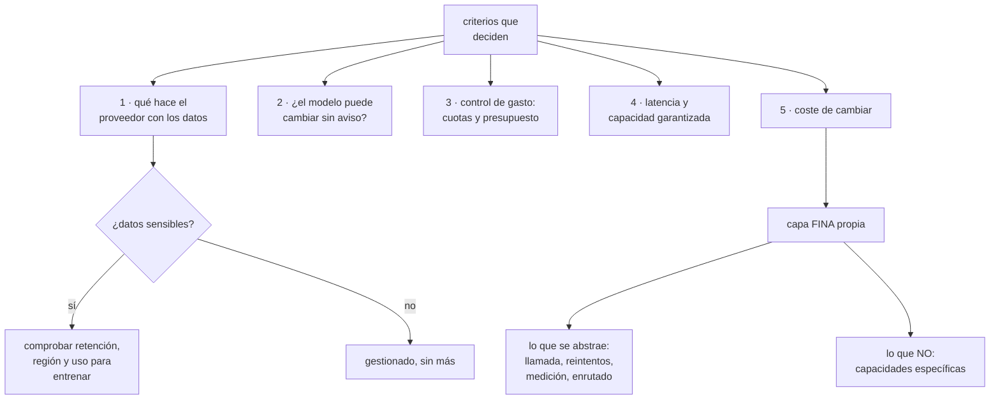

# 248 — Bedrock, Azure AI Foundry y Vertex AI

> [← 247 · Modelos fundacionales, tokens, embeddings y RAG](../../part-20-cloud-data-ai-platforms/247-modelos-fundacionales-tokens-embeddings-y-rag/README.md) · [Índice de la parte](../README.md) · [249 · Agentes, tools, memoria, permisos y guardrails →](../../part-20-cloud-data-ai-platforms/249-agentes-tools-memoria-permisos-y-guardrails/README.md)

**Parte:** 20 — Plataformas cloud de datos, analítica, IA y agentes<br>
**Nivel:** avanzado · **Horas estimadas:** 4<br>
**Laboratorio:** `decision` · **Estado:** `EXECUTABLE_CORE`

## 🎯 Propósito

Elegir dónde y cómo ejecutar modelos fundacionales entre las tres nubes, con los criterios que de verdad diferencian: **qué se hace con los datos que se envían, si el modelo puede cambiar bajo los pies, cómo se controla el gasto y cuánto cuesta cambiar de proveedor**. La clase compara las plataformas gestionadas por lo que aportan y lo que atan, y da el patrón que reduce el coste de cambio.

## 📚 Resultados de aprendizaje

Al finalizar podrás:

1. **Comparar** las plataformas gestionadas por criterios operativos, no por catálogo.
2. **Comprobar** qué hace cada proveedor con los datos enviados.
3. **Fijar** versiones y anticipar las retiradas de modelos.
4. **Controlar** el gasto con cuotas, presupuestos y enrutado.
5. **Reducir** el coste de cambiar de proveedor sin construir una abstracción inútil.

## 🧩 Conceptos centrales

| Concepto | Comprensión verificable |
|---|---|
| `plataforma gestionada de modelos` | Servicio que expone modelos propios y de terceros con una interfaz común, gobierno y facturación integrada. |
| `retención de datos del proveedor` | Qué guarda y durante cuánto tiempo lo que se le envía. Determina si se puede usar con datos sensibles. |
| `versión fijada` | Referencia a una versión concreta del modelo, para que no cambie sin aviso. |
| `retirada de modelo` | Fecha en que una versión deja de estar disponible. Ocurre y hay que planificarla. |
| `capacidad reservada` | Compromiso de rendimiento garantizado, frente al pago por uso con cuotas compartidas. |
| `abstracción de proveedor` | Capa que oculta las diferencias entre proveedores. Barata si es fina, inútil si intenta cubrirlo todo. |

## 🧠 Modelo mental

Una plataforma de IA sigue siendo un sistema de datos: necesita procedencia, evaluación, límites de costo, seguridad y operación antes de una interfaz inteligente.

Aplicado a esta clase, separa siempre cuatro planos: **intención** (qué necesita el usuario),
**configuración** (qué declaramos), **estado observado** (qué existe de verdad) y
**evidencia** (cómo sabemos que cumple). Confundirlos produce diseños que se ven correctos
en un diagrama pero fallan al operar.

## 🗺️ Flujo de razonamiento



## 📖 Desarrollo

### 1. Los cinco criterios que deciden

Las tres nubes ofrecen plataformas equivalentes en el catálogo. Lo que diferencia es operativo.

```text
1  ¿QUÉ HACE EL PROVEEDOR CON LOS DATOS?
   ¿los guarda? ¿cuánto tiempo? ¿en qué región?
   ¿los usa para entrenar?
   ¿hay opción de retención cero?
   → y esto se comprueba EN EL CONTRATO, no en la página de
     producto                                clase 251
   → es el criterio que más decisiones bloquea

2  ¿EL MODELO PUEDE CAMBIAR SIN AVISO?
   un alias que apunta a «la última versión» cambia solo
   → y el comportamiento cambia con él
   → hay que poder FIJAR la versión
   → y saber cuándo se retira                    ley 25

3  ¿CÓMO SE CONTROLA EL GASTO?
   cuotas por proyecto y por identidad
   presupuestos con alerta y con acción      clase 214
   → sin esto, una prueba mal hecha cuesta miles

4  ¿QUÉ CAPACIDAD Y QUÉ LATENCIA ESTÁN GARANTIZADAS?
   el pago por uso comparte cuota con otros clientes
   → y en momentos de demanda, hay limitación
   → la capacidad reservada garantiza rendimiento y cuesta
     aunque no se use

5  ¿CUÁNTO CUESTA CAMBIAR?
   ← y este suele ser el que menos se mira
```

Y lo que resulta equivalente entre las tres:

```text
modelos de calidad parecida
precios del mismo orden
interfaces distintas pero conceptualmente iguales
integración con la identidad y la red de su nube
y herramientas de evaluación y de filtrado

→ y por eso elegir por catálogo de modelos es elegir por lo
  que menos diferencia                        clase 240
```

Y el criterio práctico:

```text
¿ya se opera en una de las tres?
  → empieza por la suya: la identidad, la red, el registro
    y el coste ya están resueltos

¿hay un modelo concreto que solo está en una?
  → y ¿es realmente mejor para ESTE caso, medido?
                                                clase 250

¿hay requisito de residencia o de retención?
  → ese criterio manda sobre los demás      clase 251
```

### 2. Los datos, la versión y la retirada

**Lo que hay que comprobar sobre los datos**, con las preguntas concretas:

```text
¿SE GUARDAN LAS PETICIONES Y LAS RESPUESTAS?
  y si sí, ¿cuánto tiempo y con qué acceso?
  → algunos proveedores guardan por defecto para
    supervisión de abuso, con retención de días
  → y hay opciones de retención cero, a veces con
    condiciones

¿SE USAN PARA ENTRENAR?
  en las plataformas empresariales, normalmente no
  → y hay que verlo escrito

¿EN QUÉ REGIÓN SE PROCESA?
  el modelo puede ejecutarse en otra región que el resto
  → y eso rompe un requisito de residencia    clase 177

¿QUÉ SE REGISTRA POR TU LADO?
  las peticiones a un modelo contienen lo que el usuario
  escribió
  → y eso puede incluir datos personales
  → los registros propios son un dato sensible clase 211
```

Y la decisión que resulta:

```text
DATOS NO SENSIBLES        → gestionado, sin más
DATOS SENSIBLES           → gestionado CON retención cero y
                            región comprobada
DATOS QUE NO PUEDEN SALIR → modelo abierto alojado por uno
                            mismo                clase 245

y el patrón mixto
  seudonimizar antes de enviar
  → sustituir nombres, correos y números por marcadores
  → y restituirlos en la respuesta
  → resuelve muchos casos sin renunciar al gestionado
```

**La versión**, que es donde aparece la sorpresa:

```text
✗ APUNTAR AL ALIAS «último»
  el proveedor actualiza y el comportamiento cambia
  → las instrucciones que funcionaban dejan de funcionar
  → y la calidad puede subir o bajar sin aviso

✓ FIJAR LA VERSIÓN
  y actualizarla como cualquier dependencia: evaluando
  antes                                       clase 250

Y LA RETIRADA
  las versiones se retiran, con aviso de meses
  → hay que tener la fecha en un calendario     ley 25
  → y una evaluación preparada para comparar la siguiente
  → porque la migración no es «cambiar el nombre»: hay que
    revalidar
```

Y lo que hay que tener listo para el día de la migración:

```text
un conjunto de evaluación propio, con casos reales
                                                clase 250
las instrucciones versionadas
y una comparación automática entre la versión actual y la
  nueva
→ con eso, migrar es un día; sin eso, es un proyecto
```

### 3. Gasto, capacidad y límites

**El gasto** se descontrola con una facilidad notable, y por los mismos motivos de la ley 28.

```text
LO QUE HAY QUE PONER ANTES DE EMPEZAR
  cuota por proyecto y por identidad
  presupuesto con alerta al 50, 80 y 100 %
  límite de testigos por petición
  y límite de peticiones por usuario

→ sin esto, un bucle mal escrito en una prueba consume el
  presupuesto del trimestre en una tarde
→ y ha pasado en todas las organizaciones que empiezan
```

Y las palancas, que son las de la clase 247:

```text
enrutar: no llamar al modelo cuando no hace falta
respuestas cortas
caché de peticiones repetidas
contexto justo
modelo pequeño para lo fácil, grande para lo difícil
y caché de contexto, donde exista

→ y la medida que importa: coste por operación de negocio
  resuelta, no por petición                clases 214, 245
```

**La capacidad**, con la decisión de reservar o no:

```text
PAGO POR USO
  + sin compromiso; se paga lo que se usa
  − cuota compartida: en picos de demanda global, hay
    limitación
  − y la limitación aparece como error, que hay que
    manejar

CAPACIDAD RESERVADA
  + rendimiento garantizado y latencia estable
  − se paga aunque no se use
  → y hay que dimensionarla con el tráfico real

CRITERIO
  camino crítico con usuarios esperando  → reservada
  procesos por lotes y usos internos     → por uso
  → y la mezcla es lo habitual
```

Y el manejo de la limitación, que hay que implementar:

```text
reintentos con retroceso y dispersión
y un plazo total: si no se consigue en X, respaldo
                                                clase 245
y NUNCA reintentar sin límite: multiplica la carga en el
  peor momento                                clase 186
```

Y la vigilancia:

```text
testigos de entrada y de salida, por caso de uso
coste por caso de uso y por identidad
peticiones limitadas por cuota
latencia por percentil, y hasta el primer testigo
errores del proveedor
y la proporción servida desde caché o desde el enrutado
```

### 4. El coste de cambiar, y la capa fina

La pregunta que casi nadie hace al empezar: **¿cuánto costaría cambiar de proveedor?**

```text
LO QUE ATA, por orden de coste
  1  LOS EMBEBIDOS y su índice
     cambiar de modelo de embebido obliga a reindexar todo
     → y con millones de fragmentos, eso es tiempo y dinero
                                                clase 247
  2  LAS INSTRUCCIONES ajustadas a un modelo concreto
     → lo que funciona en uno no funciona igual en otro
     → y hay que revalidar                     clase 250
  3  las capacidades específicas: llamada a herramientas,
     salidas estructuradas, caché de contexto
     → cada proveedor lo hace distinto
  4  la integración con el gobierno de esa nube
  5  y el código de llamada, que es lo más barato
```

Y la conclusión, que es la de la clase 158:

```text
LO QUE MÁS ATA NO ES EL CÓDIGO
→ y por eso una abstracción que solo oculta la llamada no
  reduce el coste de cambio de forma apreciable
```

**La capa fina que sí conviene**, con lo que debe y no debe hacer:

```text
LO QUE ABSTRAE
  la llamada al modelo, con reintentos y plazos
  la MEDICIÓN: testigos, coste, latencia, por caso de uso
  el enrutado entre modelos                clase 247
  el registro de peticiones y respuestas, con muestreo
  la aplicación de filtros de entrada y de salida
                                                clase 249
  y la versión de la instrucción usada

LO QUE NO ABSTRAE
  las capacidades específicas de cada proveedor
  → si se usan, se usan; y se registra la decisión
                                                clase 190

→ una capa de 200 líneas que hace lo primero vale mucho
→ una que intenta cubrir todas las capacidades de todos los
  proveedores acaba siendo el mínimo común y estorbando
                                                clase 158
```

Y las decisiones que reducen el coste de cambio de verdad:

```text
MANTENER UN CONJUNTO DE EVALUACIÓN PROPIO
  → permite comparar cualquier modelo con datos propios
  → es lo que más reduce el coste de cambiar   clase 250

GUARDAR LOS TEXTOS ORIGINALES, no solo los embebidos
  → reindexar es posible; recuperar el original desde un
    vector, no

VERSIONAR LAS INSTRUCCIONES como código
  → y probarlas contra el conjunto de evaluación

Y EVITAR ATAR EL ÍNDICE VECTORIAL AL PROVEEDOR DEL MODELO
  → el índice puede vivir aparte y servirse a cualquiera
```

Y la lista de comprobación de la clase:

```text
☐ está comprobado por escrito qué hace el proveedor con los
  datos
☐ la región de procesamiento cumple el requisito
☐ los registros propios de peticiones se tratan como dato
  sensible
☐ la versión del modelo está fijada
☐ la fecha de retirada está en un calendario
☐ hay conjunto de evaluación propio para comparar versiones
☐ hay cuotas por proyecto e identidad
☐ hay presupuesto con alerta y acción
☐ hay límite de testigos y de peticiones por usuario
☐ la limitación se maneja con retroceso y respaldo
☐ la capacidad reservada cubre el camino crítico
☐ se mide coste por operación de negocio, no por petición
☐ hay capa fina propia que mide, enruta y filtra
☐ los textos originales se conservan además de los
  embebidos
☐ las instrucciones están versionadas y probadas
```

Y el cierre que enlaza con la clase siguiente: con el modelo elegido y controlado, aparece lo que más cambia el riesgo: darle herramientas para que actúe. Agentes, permisos y contención es la materia de la clase 249.

## 🔬 Ejemplo trabajado

**CloudShop decide dónde ejecutar sus modelos fundacionales. Lo que sigue es la comparación por criterios operativos, la prueba que consumió el presupuesto del trimestre en una tarde, y la retirada de versión que pilló al equipo sin conjunto de evaluación.**

**La comparación, hecha por los cinco criterios:**

```text
criterio                    nube A     nube B     nube C
datos: retención por        30 días    0 días     30 días
  defecto                              (opción)   (opción
                                                  de 0)
datos: uso para entrenar    no         no         no
región de procesamiento     UE         UE         UE en 2
  garantizada                                     de 4
                                                  modelos
versión fijable             sí         sí         sí
aviso de retirada           6 meses    12 meses   6 meses
cuotas por proyecto         sí         sí         sí
capacidad reservada         sí         sí         sí
integración con su
  identidad y red           sí         sí         sí
modelos disponibles         propios y  propios y  propios
                            de terceros de terceros

y el criterio que decidió
  CloudShop opera principalmente en la nube A  clase 240
  → identidad, red, registro y coste ya resueltos
  → y los modelos son equivalentes para sus casos, medido
    con su conjunto de evaluación             clase 250

decisión
  nube A para el asistente interno y el de atención
  y un modelo abierto alojado para el caso con datos que no
  pueden salir                                ← ver abajo
```

Y el caso que obligó a alojar:

```text
el equipo legal quería un asistente sobre los contratos con
socios
  → contienen condiciones comerciales confidenciales y
    cláusulas de no divulgación
  → tres de los 41 contratos prohíben expresamente enviar
    su contenido a terceros                    clase 251

decisión
  modelo abierto, alojado en la propia nube, con
  aceleradores
  coste                                    1.900 €/mes
  → frente a ~180 €/mes con el gestionado
  → y se aceptó, porque el requisito es contractual

y lo que se registró
  «si los tres contratos se renegocian y desaparece la
   cláusula, se revisa»                        clase 190
```

**La prueba que consumió el presupuesto.**

```text
un equipo probaba un procesamiento de documentos
escribió un bucle que, ante un error, reintentaba sin
límite
y el error era un documento que el modelo no podía procesar

  duración del bucle                            4 horas
  peticiones                                   410.000
  coste                                       18.400 €
  → el presupuesto trimestral del área era de 15.000 €

y no había
  cuota por proyecto
  presupuesto con alerta
  ni límite de peticiones

se detectó
  al día siguiente, en la revisión de coste     ley 15

correcciones
  cuota por proyecto y por identidad
  presupuesto con alerta al 50, 80 y 100 %, y acción al
  120 % en entornos no productivos        clase 214
  límite de testigos por petición
  límite de peticiones por identidad y hora
  y en la capa fina, reintentos con límite y retroceso

y la comprobación
  se repitió el escenario en preproducción
  → el bucle se detuvo a las 200 peticiones
  → coste                                        9 €
```

**La retirada de versión.**

```text
el proveedor anunció la retirada de la versión que el
asistente usaba, con 6 meses de aviso

lo que el equipo tenía
  la versión, fijada                                ✓
  el aviso, en un correo que nadie leyó             ✗
  conjunto de evaluación propio                     ✗
  instrucciones versionadas                         ~

qué pasó
  se enteraron 3 semanas antes de la fecha
  → migraron a la versión nueva sin evaluar
  → y a los 4 días, las quejas del equipo de atención

  qué había cambiado
    la versión nueva daba respuestas más largas
      → coste por consulta +41 %
    y era más reacia a decir «no lo sé»
      → 3 casos de información inventada con fuente
        citada                                clase 250

correcciones
  1  conjunto de evaluación propio: 240 casos reales, con
     respuesta esperada                       clase 250
  2  las fechas de retirada, en el calendario del equipo
     con recordatorio a 3 meses                  ley 25
  3  instrucciones versionadas como código, probadas contra
     el conjunto
  4  y una comparación automática: al aparecer una versión
     nueva, se ejecuta el conjunto contra las dos y se
     publica la diferencia

y la migración siguiente
  duración                                       1 día
  diferencias detectadas antes de migrar             7
    → 5 de instrucción, corregidas
    → 2 de comportamiento, aceptadas y documentadas
```

**La capa fina, y lo que hace:**

```text
214 líneas, en una biblioteca interna

  llamada al modelo con reintentos, retroceso y plazo
  MEDICIÓN por caso de uso
    testigos de entrada y salida
    coste
    latencia y tiempo hasta el primer testigo
  ENRUTADO
    respuestas preparadas → sin modelo
    consultas → base de datos
    modelo pequeño → casos simples
    modelo grande → el resto
  registro con muestreo del 5 %, sin datos personales
  filtros de entrada y de salida            clase 249
  y la versión de la instrucción, en cada llamada

lo que NO hace
  no abstrae la llamada a herramientas: se usa la del
  proveedor y se registró la decisión        clase 158
  no intenta unificar las salidas estructuradas

y el efecto
  el coste por caso de uso, visible desde el primer día
  y al comparar proveedores, el conjunto de evaluación
  ejecutable contra los dos en una tarde
```

**El control de gasto, al año:**

```text
coste mensual por caso de uso
  asistente de atención                          610 €
  asistente interno de documentación             240 €
  clasificación de comentarios                    90 €
  asistente legal (alojado)                    1.900 €
  evaluaciones y pruebas                         180 €
  ─────────────────────────────────────────────────────
  total                                        3.020 €

cuotas y presupuestos
  presupuesto por proyecto, con alerta            sí
  peticiones limitadas por cuota            41/mes
    → todas, en pruebas
  incidentes de coste                              0

capacidad reservada
  para el asistente de atención, en horario laboral
  → latencia p95 estable en 2,1 s
  → sin reserva, subía a 6 s en horas de demanda global
```

**El resultado:**

```text                                        antes     después
incidentes de coste                             1           0
coste del incidente                       18.400 €          —
migraciones de versión sin evaluar              1           0
duración de una migración               3 semanas       1 día
  con quejas                                    sí          no
conjunto de evaluación propio                  no    240 casos
cuotas y límites                               no          sí
coste mensual                             sin medir   3.020 €
coste por operación de negocio             sin medir  0,004 €
```

**La lección que esta clase deja**: la comparación entre proveedores **no la decidió el catálogo de modelos**, que era equivalente, sino que la nube A ya tenía resueltos la identidad, la red y el coste; y el único caso que se salió fue por **una cláusula contractual de tres socios**. Y la migración de versión, que debería haber sido un día, costó tres semanas y tres respuestas inventadas **porque no había conjunto de evaluación propio**: es lo que más reduce el coste de cambiar, y lo que menos se construye.

## 🧪 Laboratorio guiado

Ejecuta desde la raíz:

```bash
python classes/part-20-cloud-data-ai-platforms/248-bedrock-azure-ai-foundry-y-vertex-ai/lab.py
```

El laboratorio selecciona el motor de práctica **`decision`** y produce
`lab_result.json`. El escenario, sus comprobaciones y el artefacto esperado corresponden a
esta clase; no requiere credenciales y deja explícito qué debe revalidarse en un sandbox real.

1. Lee `exercise.steps` y formula una predicción antes de ejecutar.
2. Ejecuta la práctica y verifica todos los elementos de `checks`.
3. Provoca el caso de `negative_test` y explica la señal observada.
4. Materializa `genai-provider-adr` en `evidence/` usando la plantilla indicada.
5. Para proveedor real, sigue `sandbox.requires`, registra costo y ejecuta `destroy`.

### Evidencia esperada

El artefacto principal es una matriz de decisión ponderada y un ADR. Además, la entrega debe incluir el comando ejecutado,
la salida estructurada y una conclusión que no exceda lo observado.

## 🏆 Reto verificable

Construye **`genai-provider-adr`** para el caso CloudShop. Incluye una alternativa descartada,
un supuesto que pueda falsarse, una prueba de fallo y una decisión de rollback.

## ✅ Criterio de aceptación

- [ ] `lab.py` termina con código 0 y genera JSON válido.
- [ ] La entrega conecta al menos tres requisitos con mecanismos verificables.
- [ ] Existe una prueba positiva y una prueba negativa con evidencia.
- [ ] Seguridad, costo y operación aparecen como decisiones, no como anexos.
- [ ] Se declara una limitación y una condición que obligaría a revisar el diseño.
- [ ] Otra persona puede repetir el recorrido sin conocimiento tácito.

## ⚠️ Errores frecuentes

| Síntoma | Causa probable | Corrección |
|---|---|---|
| Una prueba consume el presupuesto del trimestre | No hay cuotas, presupuestos ni límites, y un reintento sin tope | Pon cuotas por proyecto e identidad, presupuestos con alerta y acción, límites de testigos y peticiones, y reintentos con tope. |
| El comportamiento del asistente cambia sin que nadie toque nada | Se apunta al alias de última versión y el proveedor actualizó | Fija la versión y trátala como una dependencia: se actualiza evaluando antes. |
| La migración a una versión nueva se hace a ciegas y sale mal | No hay conjunto de evaluación propio con casos reales | Construye y mantén un conjunto de evaluación; es lo que convierte una migración en un día de trabajo. |
| Un requisito contractual impide usar el servicio gestionado | No se comprobó qué hace el proveedor con los datos ni dónde se procesan | Verifica retención, uso para entrenar y región en el contrato, y reserva el alojamiento propio para lo que no pueda salir. |
| En horas de demanda la latencia se dispara y aparecen errores | El pago por uso comparte cuota y hay limitación | Reserva capacidad para el camino crítico y maneja la limitación con retroceso y respaldo. |
| Cambiar de proveedor resulta mucho más caro de lo previsto | Lo que ata son los embebidos, las instrucciones y las capacidades específicas, no el código | Conserva los textos originales, versiona las instrucciones, mantén el conjunto de evaluación y construye una capa fina que mida y enrute, no una que lo abstraiga todo. |

## 🛡️ Seguridad, ética y costo

Trabaja con cuentas propias o sandboxes autorizados. No publiques secretos, identificadores
reales ni datos personales. Antes de crear recursos pagos define presupuesto, etiquetas y
comando de destrucción; después verifica que no queden recursos huérfanos. Los ejemplos
locales enseñan contratos, pero no certifican cumplimiento ni disponibilidad de producción.

## ❓ Preguntas de comprobación

1. ¿Cuáles son los cinco criterios que diferencian a los proveedores de verdad?
2. ¿Qué hay que comprobar sobre los datos y dónde se comprueba?
3. ¿Qué pasa si se apunta al alias de última versión?
4. ¿Qué ata más al cambiar de proveedor y qué es lo más barato de cambiar?
5. ¿Qué debe y qué no debe hacer una capa propia sobre el proveedor?

## 🔗 Referencias

- AWS (2025). *Amazon Bedrock: data protection and model versions*. <https://docs.aws.amazon.com/bedrock/latest/userguide/data-protection.html>
- Microsoft (2025). *Azure AI Foundry: data privacy and model lifecycle*. <https://learn.microsoft.com/en-us/azure/ai-foundry/>
- Google Cloud (2025). *Vertex AI: generative AI data governance and model versions*. <https://cloud.google.com/vertex-ai/generative-ai/docs/data-governance>
- Anthropic (2025). *Claude API: models, versions and deprecations*. <https://docs.anthropic.com/en/docs/about-claude/models/overview>
- NIST (2024). *AI Risk Management Framework: Generative AI profile*. <https://www.nist.gov/itl/ai-risk-management-framework>
- Documentación oficial vigente del servicio implementado; registra URL y fecha de consulta.

---

> [Evaluación](assessment.md) · [Contrato de clase](lesson.yaml) · [Índice de la parte](../README.md)

| Anterior | Índice | Siguiente |
|---|---|---|
| [← 247 · Modelos fundacionales, tokens, embeddings y RAG](../../part-20-cloud-data-ai-platforms/247-modelos-fundacionales-tokens-embeddings-y-rag/README.md) | [Parte 20](../README.md) · [Programa](../../README.md) | [249 · Agentes, tools, memoria, permisos y guardrails →](../../part-20-cloud-data-ai-platforms/249-agentes-tools-memoria-permisos-y-guardrails/README.md) |
