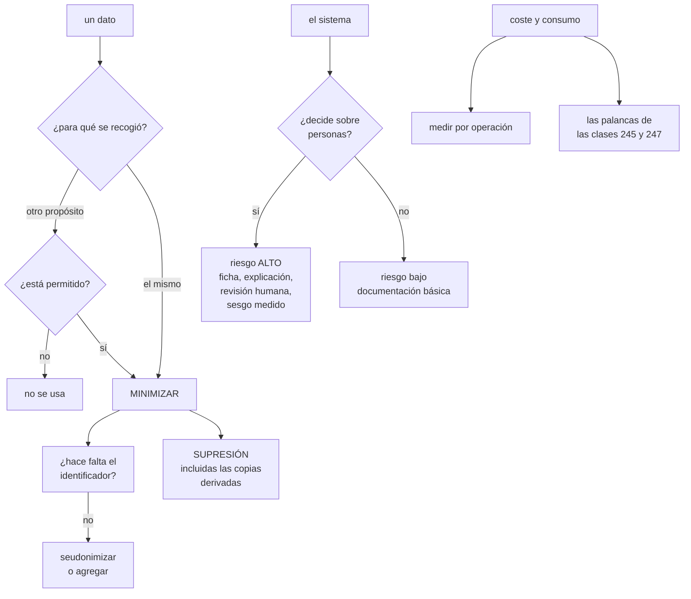

# 251 — Privacidad, gobernanza, sostenibilidad y costo de IA

> [← Clase anterior](../../part-20-cloud-data-ai-platforms/250-evaluacion-de-ia-red-teaming-y-observabilidad/README.md) · [Índice de la parte](../README.md) · [Clase siguiente →](../../part-20-cloud-data-ai-platforms/252-proyecto-asistente-operativo-de-cloudshop/README.md)

**Parte:** 20 — Plataformas cloud de datos, analítica, IA y agentes<br>
**Nivel:** avanzado · **Horas estimadas:** 4<br>
**Laboratorio:** `governance` · **Estado:** `EXECUTABLE_CORE`

## 🎯 Propósito

Resolver las obligaciones que no son técnicas y que deciden si un sistema con datos e inteligencia artificial se puede poner en producción: **qué datos se pueden usar y para qué, qué hay que poder explicar y ante quién, cuánto cuesta de verdad y qué consume**. La clase trata la privacidad, el gobierno de modelos, la sostenibilidad y el coste con el mismo criterio: medir, decidir y registrar.

## 📚 Resultados de aprendizaje

Al finalizar podrás:

1. **Comprobar** la base legal y el propósito antes de usar un dato.
2. **Aplicar** minimización, seudonimización y supresión de forma efectiva.
3. **Documentar** modelos y sistemas para poder responder a quien pregunte.
4. **Medir** el coste y el consumo, y reducirlos con las palancas que existen.
5. **Clasificar** el riesgo de un sistema y aplicar los controles que le tocan.

## 🧩 Conceptos centrales

| Concepto | Comprensión verificable |
|---|---|
| `propósito` | Para qué se recogió un dato. Usarlo para otra cosa exige comprobar si está permitido. |
| `minimización` | Usar los datos mínimos necesarios. Reduce riesgo, coste y obligaciones a la vez. |
| `seudonimización` | Sustituir identificadores por claves. Reduce riesgo y no elimina la condición de dato personal. |
| `derecho de supresión` | Obligación de borrar los datos de una persona, incluidas las copias derivadas. |
| `ficha de modelo` | Documento con qué hace un modelo, con qué datos, sus límites y sus riesgos. |
| `clasificación de riesgo` | Nivel asignado a un sistema según su impacto sobre personas. Determina los controles. |

## 🧠 Modelo mental

Una plataforma de IA sigue siendo un sistema de datos: necesita procedencia, evaluación, límites de costo, seguridad y operación antes de una interfaz inteligente.

Aplicado a esta clase, separa siempre cuatro planos: **intención** (qué necesita el usuario),
**configuración** (qué declaramos), **estado observado** (qué existe de verdad) y
**evidencia** (cómo sabemos que cumple). Confundirlos produce diseños que se ven correctos
en un diagrama pero fallan al operar.

## 🗺️ Flujo de razonamiento



## 📖 Desarrollo

### 1. Qué datos se pueden usar

La pregunta anterior a cualquier decisión técnica, y la que más proyectos detiene tarde.

```text
POR CADA CONJUNTO DE DATOS
  ¿para qué se recogió?
  ¿lo que quiero hacer es ese propósito u otro?
  si es otro, ¿está permitido?
    → base legal, consentimiento, contrato o interés
      legítimo
  ¿hay restricciones contractuales?
    → un contrato con un socio puede prohibir usar sus
      datos para entrenar                    clase 248
  ¿hay restricción de residencia?           clase 177
  y ¿desde cuándo se conserva y hasta cuándo?
```

Y el caso que más aparece:

```text
DATOS RECOGIDOS PARA PRESTAR EL SERVICIO, USADOS PARA
ENTRENAR
  el cliente dio sus datos para que le enviaran el pedido
  → usarlos para entrenar un modelo es otro propósito
  → y puede requerir base distinta o información previa

→ y en la clase 175 aparecieron dos conjuntos usados sin
  permiso
→ es el hallazgo típico de la primera revisión
```

**La minimización**, que reduce tres cosas a la vez:

```text
USAR LOS DATOS MÍNIMOS NECESARIOS
  ¿hace falta el nombre, o basta un identificador?
  ¿hace falta la fecha exacta, o el mes?
  ¿hace falta el domicilio, o el código postal?
  ¿hace falta el histórico completo, o 12 meses?

→ y cada respuesta reduce riesgo, coste de almacenamiento
  y obligaciones                          clases 236, 239
→ y casi nunca reduce la calidad del modelo tanto como se
  teme: hay que MEDIRLO
```

Y las técnicas, con lo que cada una da:

```text
SEUDONIMIZACIÓN
  identificador sustituido por una clave
  + reduce el riesgo de una fuga
  − sigue siendo dato personal: se puede revertir con la
    tabla de correspondencia

ANONIMIZACIÓN
  imposible de revertir
  + deja de ser dato personal
  − difícil de conseguir de verdad: la combinación de
    campos reidentifica
  → agregación, generalización y supresión de casos raros

AGREGACIÓN
  trabajar con totales, no con individuos
  → y con umbral mínimo: un grupo de 2 personas identifica

→ y la trampa: llamar «anonimizado» a lo seudonimizado
  → y tratarlo como si no tuviera obligaciones
```

**La supresión**, que es donde el linaje deja de ser opcional:

```text
UNA PETICIÓN DE BORRADO OBLIGA A BORRAR
  el registro operativo
  las copias en el lago y en el almacén analítico
  los conjuntos de entrenamiento
  las copias de seguridad          ← y esto es lo difícil
  los registros y las trazas       clases 211, 250
  la memoria de los agentes        clase 249
  y las exportaciones a terceros

→ y sin linaje, no se sabe dónde están      clase 243
→ por eso el linaje es un requisito legal, no una comodidad
```

Y lo que hay que decidir de antemano:

```text
LAS COPIAS DE SEGURIDAD
  no se pueden editar sin romper su integridad
  → la práctica habitual: se documenta el plazo de
    caducidad de las copias y se aplica la supresión al
    restaurar
  → y eso se declara, no se improvisa el día que llega la
    petición

Y LOS MODELOS ENTRENADOS
  un modelo entrenado con un dato no «contiene» ese dato
  de forma directa, y puede memorizarlo
  → hay que decidir: ¿se reentrena? ¿se declara el plazo?
  → y la decisión se registra                clase 190
```

### 2. Gobierno de modelos y sistemas

Cuando un sistema afecta a personas, hay que poder responder a quien pregunte.

```text
LA CLASIFICACIÓN DE RIESGO, que ordena todo lo demás

  BAJO      no decide sobre personas
            un buscador interno, un resumen de documentos
            → documentación básica

  MEDIO     influye en decisiones sobre personas, con
            revisión humana
            recomendaciones, priorización de tiquetes
            → ficha de modelo, evaluación de sesgos,
              medición en producción

  ALTO      decide sobre personas con consecuencias
            crédito, selección, precios personalizados,
            detección de fraude que bloquea
            → todo lo anterior más: explicación, revisión
              humana obligatoria, registro de decisiones,
              vía de reclamación y evaluación de impacto

→ y la clasificación se hace ANTES de construir
```

**La ficha de modelo**, con lo que debe contener:

```text
qué hace y para qué se diseñó
qué NO debe usarse para                     ← importante
con qué datos se entrenó, de qué periodo
  y con qué contratos cumplen              clase 244
qué rendimiento tiene, y POR SEGMENTO
qué límites conocidos tiene
qué sesgos se midieron y qué se encontró
quién es el dueño y cuándo se revisa
y la trazabilidad al experimento           clase 246
```

Y la parte de sesgos, con cómo se mide:

```text
EL RENDIMIENTO POR SEGMENTO
  la métrica global esconde diferencias
  → un modelo con 0,88 global puede tener 0,91 en un grupo
    y 0,71 en otro
  → y esa diferencia es el hallazgo

CASOS EMPAREJADOS
  entradas idénticas salvo el atributo sensible
  → y comparar la salida                     clase 250

Y LA PREGUNTA PREVIA
  ¿qué segmentos hay que comprobar?
  → y a veces el atributo no está en los datos, y hay que
    usar una aproximación con cuidado
```

**La explicación**, con lo que se puede y no se puede prometer:

```text
LO QUE SE PUEDE DAR
  qué datos se usaron para la decisión
  qué factores pesaron más en ESTE caso
  qué habría cambiado el resultado
  y cómo reclamar

LO QUE NO SE PUEDE PROMETER
  una explicación causal completa de un modelo complejo
  → y decirlo es más honesto que inventar una explicación
    plausible

→ y por eso, en riesgo alto, conviene un modelo más simple
  y explicable aunque rinda algo menos
  → esa es una decisión de diseño, y se registra
                                                clase 190
```

Y la revisión humana, con lo que la hace real:

```text
✗ REVISIÓN QUE APRUEBA CUANTO LE LLEGA
  si el revisor ve 200 casos al día y el modelo acierta el
  95 %, aprueba sin mirar
  → y la revisión es un trámite                  ley 16

✓ REVISIÓN CON CONDICIONES
  el revisor ve los casos donde el modelo tiene poca
  confianza
  tiene tiempo suficiente
  puede decidir en contra sin justificar largamente
  y se MIDE cuántas veces decide en contra
    → si es cero, la revisión no está ocurriendo
```

### 3. Coste y consumo

El coste de estas plataformas se descontrola con facilidad, y el consumo energético empieza a ser una obligación de informe.

```text
LAS PARTIDAS, con lo que suele dominar
  inferencia                        ← casi siempre la mayor
                                      clase 245
  almacenamiento y consultas del almacén analítico
                                                clase 236
  ingesta y registros                clases 238, 242
  entrenamiento                      ← menor de lo que se
                                       cree
  y aceleradores encendidos y ociosos

→ y la proporción que este programa ha medido: la
  inferencia entre 2 y 11 veces el entrenamiento
                                          clases 240, 245
```

Y las palancas, que ya están todas dichas:

```text
no llamar al modelo cuando no hace falta      clase 247
cachear
agrupar
modelo menor y enrutado
respuestas cortas
lotes en vez de línea donde se pueda
utilización alta de los aceleradores          clase 245
y retirar lo que no se usa                    clase 246

→ y la medida que importa: COSTE POR OPERACIÓN DE NEGOCIO
  RESUELTA                                    clase 214
```

**El consumo**, con lo que se puede decir con honestidad:

```text
LO QUE SE PUEDE ESTIMAR
  la energía es aproximadamente proporcional al cómputo
  → y el cómputo se mide: horas de acelerador, testigos
  los proveedores publican factores de emisión por región
  y la región elegida cambia mucho la huella
    → una región con energía baja en carbono puede reducir
      la huella varias veces, con el mismo cómputo

LO QUE NO SE PUEDE PROMETER
  cifras exactas de consumo por petición
  → los proveedores no las dan con ese detalle
  → y las estimaciones públicas varían mucho

→ y por eso lo honesto es informar de lo que se mide (horas
  de cómputo, testigos, región) y de la estimación, marcada
  como tal                                    clase 179
```

Y las decisiones que reducen consumo y coste a la vez:

```text
las mismas palancas de coste reducen el cómputo
  → y por tanto el consumo
elegir región por factor de emisión, donde la latencia y
  la residencia lo permitan
programar los trabajos por lotes en horas de menor
  intensidad, donde el proveedor lo ofrezca
y retirar modelos y conjuntos que no se usan  ley 25

→ y esto es lo que hace que sostenibilidad y coste no sean
  objetivos en conflicto: casi siempre apuntan al mismo
  sitio
```

Y lo que hay que vigilar:

```text
coste por operación de negocio, por caso de uso
horas de acelerador y su utilización
testigos por caso de uso
almacenamiento por conjunto, con su retención
y la estimación de emisiones, si hay que informar
```

### 4. Ponerlo en práctica

**El orden de trabajo** cuando se plantea un sistema con datos o modelos:

```text
1  CLASIFICAR EL RIESGO
   → y de ahí salen los controles obligatorios

2  COMPROBAR LOS DATOS
   propósito, base, contratos, residencia, retención
   → y si algo no encaja, se resuelve antes de construir

3  MINIMIZAR
   → y medir cuánto cuesta en calidad; suele ser poco

4  CONSTRUIR, con el linaje desde el principio
                                                clase 243

5  EVALUAR, incluidos sesgos por segmento    clase 250

6  DOCUMENTAR: ficha de modelo y de sistema

7  DESPLEGAR con revisión humana donde toque

8  Y OPERAR: medir en producción, revisar y retirar
                                                clase 246
```

Y lo que hay que tener preparado antes de la primera petición:

```text
¿QUÉ SE HACE CUANDO ALGUIEN PIDE SUS DATOS?
  procedimiento, con plazo y con el linaje
¿Y CUANDO PIDE QUE SE BORREN?
  incluidas las copias derivadas y la memoria de agentes
¿Y CUANDO RECLAMA UNA DECISIÓN?
  quién revisa, con qué información y en qué plazo
¿Y CUANDO PREGUNTA UN AUDITOR?
  la trazabilidad del modelo a sus datos       clase 246

→ y estos procedimientos se PRUEBAN, como los demás
                                                    ley 22
→ ejecutar una petición de supresión de prueba antes de
  recibir la primera es la comprobación más útil de esta
  clase
```

Y las señales que dicen si el gobierno funciona:

```text
proporción de conjuntos con propósito y base documentados
conjuntos con datos personales sin clasificar   → cero
modelos en producción sin ficha                 → cero
sistemas de riesgo alto sin revisión humana     → cero
tiempo de respuesta a una petición de supresión
proporción de decisiones revisadas y REVERTIDAS
  → si es cero, la revisión es un trámite
y coste por operación de negocio
```

Y la advertencia de siempre:

```text
si cumplir cuesta más que no cumplir, se rodeará
                                                    ley 16
→ la clasificación de datos, la ficha de modelo y el
  registro de propósito los genera la plataforma
→ y publicar un conjunto o desplegar un modelo CON el
  gobierno debe ser el camino más rápido    clases 171, 241
```

Y la lista de comprobación de la clase:

```text
☐ cada sistema tiene su nivel de riesgo asignado
☐ cada conjunto tiene propósito y base documentados
☐ se ha comprobado que el uso previsto está permitido
☐ se han revisado las restricciones contractuales
☐ se aplica minimización y se ha medido su efecto
☐ no se llama anonimizado a lo seudonimizado
☐ las agregaciones tienen umbral mínimo de grupo
☐ el linaje llega a nivel de columna en los datos
  personales
☐ hay procedimiento de acceso y de supresión, probado
☐ está declarado qué se hace con las copias de seguridad
☐ cada modelo en producción tiene ficha
☐ se mide el rendimiento por segmento
☐ los sistemas de riesgo alto tienen revisión humana real
☐ se mide cuántas decisiones se revierten en la revisión
☐ se mide coste por operación de negocio
☐ la región se eligió contando el factor de emisión
☐ lo estimado se presenta como estimado
```

Y el cierre que enlaza con la clase siguiente: con la plataforma de datos e inteligencia artificial construida, evaluada y gobernada, queda ponerlo todo junto en un sistema real y comprobarlo. Es la materia de la clase 252, que además cierra la parte 20.

## 🔬 Ejemplo trabajado

**CloudShop revisa el gobierno de su plataforma de datos e IA. Lo que sigue son los dos conjuntos que no se podían usar, la petición de supresión que reveló siete copias, y la revisión humana que aprobaba el 100 %.**

**La revisión de propósito.**

```text
conjuntos usados para entrenar                       9

  con propósito y base documentados                  3
  sin documentar                                     6
    → se revisaron uno a uno

los hallazgos
  7 correctos: datos operativos usados para mejorar el
    servicio, con información previa al cliente
  1 PROBLEMÁTICO: las transcripciones de atención al
    cliente
    → se recogieron para calidad del servicio
    → se estaban usando para entrenar un clasificador
    → y contenían datos personales completos
    → decisión: se retiró el conjunto y se reentrenó con
      transcripciones seudonimizadas y con información
      previa añadida al aviso de grabación
  1 PROHIBIDO: el catálogo enriquecido de un proveedor
    → su contrato prohíbe expresamente usarlo para
      entrenar modelos
    → el modelo de clasificación de productos lo usaba
    → decisión: reentrenar sin él
      pérdida de calidad medida                    -1,8 %
      → aceptada

y lo incómodo
  el segundo se descubrió al leer el contrato, no al
  construir el modelo
  → llevaba 14 meses en producción
```

**La minimización, y lo que costó.**

```text
el modelo de predicción de devolución usaba 61 atributos

se probó quitando los de más riesgo
  nombre completo                     ← se quitó
  correo                              ← se quitó
  teléfono                            ← se quitó
  dirección completa                  ← código postal
  fecha de nacimiento exacta          ← tramo de edad
  histórico completo                  ← 18 meses

  atributos                                 61 → 52
  precisión                             0,712 → 0,708
  → una pérdida de 0,4 puntos

y lo que se ganó
  el conjunto deja de contener identificadores directos
  el acceso al conjunto pasó de 41 personas a 12
                                                clase 236
  y la petición de supresión se simplifica mucho
```

Y la comprobación que se hizo antes:

```text
el equipo temía perder mucha calidad
→ se midió, y era 0,4 puntos
→ y la decisión se tomó con la cifra, no con el temor
                                                clase 179
```

**La petición de supresión.**

```text
un cliente ejerció su derecho de supresión

dónde creía el equipo que estaban sus datos
  la base de pedidos
  el almacén analítico

dónde estaban de verdad, según el linaje    clase 243
  1  la base de pedidos
  2  el lago, capa bruta
  3  el lago, capa refinada
  4  el almacén analítico
  5  el conjunto de entrenamiento del modelo de devolución
  6  el índice de búsqueda del asistente       clase 247
  7  la memoria del agente de atención         clase 249
  8  una exportación mensual a un socio de logística
  9  los registros de peticiones al modelo     clase 250

y las copias de seguridad, aparte

qué se hizo
  1-4  borrado o seudonimización, según la capa
  5    el cliente se excluye del próximo conjunto; el
       modelo actual se reentrena en el ciclo previsto
       → y se declaró el plazo                clase 190
  6    reindexado tras borrar el documento
  7    memoria del cliente borrada
  8    se avisó al socio, que tiene su propia obligación
  9    los registros caducan a 30 días; se documentó

  copias de seguridad
    no se editan; caducan a 35 días
    y al restaurar, se aplica la lista de supresiones
    → declarado por escrito y comunicado al cliente

tiempo total                             11 días
tiempo del primer intento (sin linaje, simulado)
                                     no se habría podido
```

Y lo que se montó después:

```text
procedimiento de supresión, escrito y probado
  ejecutado con un cliente de prueba, trimestralmente
                                                    ley 22
  → en el segundo ensayo aparecieron 2 destinos nuevos
    (una tabla creada después y una exportación nueva)
  → y el procedimiento se genera del LINAJE, no de una
    lista escrita a mano                       ley 25

tiempo de la tercera ejecución                  4 días
```

**La clasificación de riesgo:**

```text
sistema                              riesgo   controles
asistente de atención                 medio   ficha,
                                              evaluación,
                                              medición
recomendación de productos            medio   ídem
predicción de plazo de entrega        bajo    documentación
clasificación de comentarios          bajo    documentación
DETECCIÓN DE FRAUDE QUE BLOQUEA       ALTO    ← ver abajo
estimación de demanda (interna)       bajo    documentación

el de fraude, por qué es alto
  bloquea el pago de una persona
  → consecuencia directa y perceptible
  → y hasta entonces se trataba como cualquier otro
```

Y los controles que se añadieron al de fraude:

```text
ficha de modelo completa
rendimiento POR SEGMENTO, medido
  → y aquí apareció el hallazgo:
    tasa de falsos positivos global              2,1 %
    en pagos desde un país concreto              7,4 %
    en pagos con tarjeta de un emisor concreto   6,8 %
    → tres veces más rechazos legítimos para esos grupos
    → causa: menos ejemplos de esos segmentos en el
      entrenamiento                            clase 244
    → corrección: reponderación y más datos de esos
      segmentos
    → tras corregir: 2,4 % y 2,6 %

revisión humana obligatoria por encima de un importe
                                                clase 249
registro de cada decisión con sus factores
vía de reclamación, con plazo de 5 días
y explicación de qué factores pesaron en cada rechazo
```

**La revisión humana que aprobaba el 100 %.**

```text
la revisión existía: los rechazos por encima de 1.000 €
pasaban por una persona

se midió
  casos revisados al mes                          1.840
  revertidos por el revisor                           0  ←
  tiempo medio por caso                             11 s

→ el revisor veía la recomendación del modelo, un botón de
  aprobar y uno de rechazar
→ con 1.840 casos al mes y otras tareas, aprobaba
→ y la revisión era un trámite                     ley 16

correcciones
  1  solo se revisan los casos de BAJA CONFIANZA del modelo
     → 1.840 → 210 al mes
  2  el revisor ve los factores que pesaron y el histórico
     del cliente, no solo la recomendación
  3  el orden de los botones no favorece aprobar
  4  y se MIDE la tasa de reversión

  tras los cambios
    casos revisados                                 210
    revertidos                                       34  16 %
    tiempo medio por caso                          2 min

→ y esos 34 al mes son clientes legítimos que antes se
  rechazaban
```

**El coste y el consumo:**

```text
coste mensual de datos e IA                  12.400 €
  inferencia                                  3.020 €
  almacén analítico                             610 €
  ingesta y registros                         1.140 €
  entrenamiento                                 890 €
  aceleradores del modelo alojado             1.900 €
  almacenamiento del lago                     2.100 €
  plataforma de datos (orquestación, calidad)  2.740 €

proporción inferencia/entrenamiento              3,4:1

y la estimación de consumo, presentada como estimación
  horas de acelerador al mes                    1.410
  testigos procesados                            41 M
  región: factor de emisión de la región usada
  → estimación de emisiones, con el método declarado
  → y marcada como ESTIMADA                    clase 179

y las decisiones que redujeron las dos cosas
  el entrenamiento por lotes se movió a la región con menor
  factor de emisión
    → la latencia no importa en entrenamiento
    → estimación de emisiones                   -41 %
    → y coste                                   -12 %
  aceleradores del modelo alojado: utilización subida del
    31 % al 74 % con agrupación               clase 245
    → 3 aceleradores → 1
```

**El resultado:**

```text                                        antes     después
conjuntos con propósito documentado           3/9         9/9
conjuntos usados sin permiso                    2           0
atributos personales en el conjunto de
  entrenamiento                                 9           0
personas con acceso a ese conjunto             41          12
destinos conocidos en una supresión           2/9         9/9
tiempo de una petición de supresión      imposible     4 días
sistemas con riesgo clasificado                 0           6
modelos con ficha                              0/6         6/6
diferencia de falsos positivos entre
  segmentos                                  3,5×        1,1×
decisiones revertidas en la revisión          0 %        16 %
coste mensual                            18.900 €    12.400 €
estimación de emisiones                     base       -41 %
```

**La lección que esta clase deja**: dos de los nueve conjuntos **no se podían usar**, y uno de ellos llevaba catorce meses en producción; se descubrió leyendo un contrato, no construyendo un modelo. La petición de supresión reveló **nueve destinos donde el equipo creía que había dos**, y solo se pudo resolver con el linaje. Y la revisión humana obligatoria del modelo de fraude aprobaba el cien por cien de los casos en once segundos: al revisar solo los de baja confianza y dar contexto, **se revirtió el 16 %**, que eran clientes legítimos rechazados.

## 🧪 Laboratorio guiado

Ejecuta desde la raíz:

```bash
python classes/part-20-cloud-data-ai-platforms/251-privacidad-gobernanza-sostenibilidad-y-costo-de-ia/lab.py
```

El laboratorio selecciona el motor de práctica **`governance`** y produce
`lab_result.json`. El escenario, sus comprobaciones y el artefacto esperado corresponden a
esta clase; no requiere credenciales y deja explícito qué debe revalidarse en un sandbox real.

1. Lee `exercise.steps` y formula una predicción antes de ejecutar.
2. Ejecuta la práctica y verifica todos los elementos de `checks`.
3. Provoca el caso de `negative_test` y explica la señal observada.
4. Materializa `responsible-ai-controls` en `evidence/` usando la plantilla indicada.
5. Para proveedor real, sigue `sandbox.requires`, registra costo y ejecuta `destroy`.

### Evidencia esperada

El artefacto principal es una jerarquía de política, ownership y evidencia. Además, la entrega debe incluir el comando ejecutado,
la salida estructurada y una conclusión que no exceda lo observado.

## 🏆 Reto verificable

Construye **`responsible-ai-controls`** para el caso CloudShop. Incluye una alternativa descartada,
un supuesto que pueda falsarse, una prueba de fallo y una decisión de rollback.

## ✅ Criterio de aceptación

- [ ] `lab.py` termina con código 0 y genera JSON válido.
- [ ] La entrega conecta al menos tres requisitos con mecanismos verificables.
- [ ] Existe una prueba positiva y una prueba negativa con evidencia.
- [ ] Seguridad, costo y operación aparecen como decisiones, no como anexos.
- [ ] Se declara una limitación y una condición que obligaría a revisar el diseño.
- [ ] Otra persona puede repetir el recorrido sin conocimiento tácito.

## ⚠️ Errores frecuentes

| Síntoma | Causa probable | Corrección |
|---|---|---|
| Un conjunto lleva meses usándose y resulta que no se podía | No se comprobó el propósito ni las restricciones contractuales antes de construir | Documenta propósito, base legal, contratos y residencia por conjunto, y compruébalo antes de empezar. |
| Se trata un conjunto como anónimo y no lo es | Está seudonimizado: la correspondencia existe y se puede revertir | Distingue seudonimización de anonimización y aplica las obligaciones que correspondan; usa umbral mínimo en las agregaciones. |
| No se puede cumplir una petición de supresión | No se sabe dónde se copiaron los datos | Activa el linaje a nivel de columna, genera el procedimiento a partir de él y pruébalo con un caso ficticio cada trimestre. |
| La revisión humana aprueba todo | Demasiados casos, sin contexto y con la aprobación como camino fácil | Revisa solo los de baja confianza, da contexto suficiente y mide la tasa de reversión; si es cero, la revisión no ocurre. |
| El modelo funciona bien en general y mal para un grupo | Solo se mide la métrica global | Mide el rendimiento por segmento y con casos emparejados; la diferencia es el hallazgo. |
| Se publican cifras de consumo que no se pueden sostener | Se presentan estimaciones como mediciones | Informa de lo medido (horas de cómputo, testigos, región) y marca lo estimado como estimado, con el método. |

## 🛡️ Seguridad, ética y costo

Trabaja con cuentas propias o sandboxes autorizados. No publiques secretos, identificadores
reales ni datos personales. Antes de crear recursos pagos define presupuesto, etiquetas y
comando de destrucción; después verifica que no queden recursos huérfanos. Los ejemplos
locales enseñan contratos, pero no certifican cumplimiento ni disponibilidad de producción.

## ❓ Preguntas de comprobación

1. ¿Qué hay que comprobar de un conjunto antes de usarlo para entrenar?
2. ¿Qué diferencia hay entre seudonimizar y anonimizar, y qué implica?
3. ¿Por qué el linaje es un requisito y no una comodidad?
4. ¿Qué hace que una revisión humana sea real y cómo se mide?
5. ¿Por qué coste y sostenibilidad suelen apuntar al mismo sitio?

## 🔗 Referencias

- Mitchell, M. y otros (2019). *Model cards for model reporting*. <https://dl.acm.org/doi/10.1145/3287560.3287596>
- NIST (2024). *AI Risk Management Framework*. <https://www.nist.gov/itl/ai-risk-management-framework>
- ISO/IEC 42001 (2023). *Artificial intelligence management system*. <https://www.iso.org/standard/81230.html>
- Green Software Foundation (2025). *Software Carbon Intensity specification*. <https://sci.greensoftware.foundation/>
- Agencia Española de Protección de Datos (2025). *Guía sobre tratamientos con inteligencia artificial*. <https://www.aepd.es/documento/adecuacion-rgpd-ia.pdf>
- Documentación oficial vigente del servicio implementado; registra URL y fecha de consulta.

---

> [Evaluación](assessment.md) · [Contrato de clase](lesson.yaml) · [Índice de la parte](../README.md)
