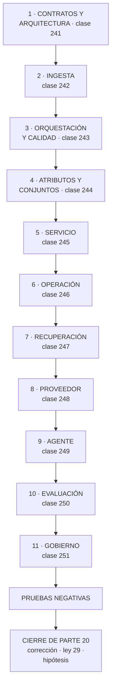

# 252 — Proyecto: asistente operativo de CloudShop

> [← Clase anterior](../../part-20-cloud-data-ai-platforms/251-privacidad-gobernanza-sostenibilidad-y-costo-de-ia/README.md) · [Índice de la parte](../README.md) · [Clase siguiente →](../../part-21-cloud-operations-automation/253-inventario-etiquetado-cmdb-y-ownership/README.md)

**Parte:** 20 — Plataformas cloud de datos, analítica, IA y agentes<br>
**Nivel:** avanzado · **Horas estimadas:** 8<br>
**Laboratorio:** `capstone` · **Estado:** `EXECUTABLE_CORE`

## 🎯 Propósito

Construir el asistente operativo de CloudShop con todo lo de la parte 20 y comprobarlo. La clase da el encargo, el orden, el entregable y las pruebas negativas. Y cierra la parte 20: corrige las cinco predicciones de la clase 240 —cuatro acertadas y una a medias—, actualiza el recuento de leyes, añade la ley 29 y escribe la hipótesis de la parte 21.

## 📚 Resultados de aprendizaje

Al finalizar podrás:

1. **Construir** un sistema con datos y modelos, en el orden que evita rehacer.
2. **Comprobar** con las pruebas negativas de toda la parte.
3. **Medir** calidad, coste y riesgo con cifras defendibles.
4. **Corregir** las cinco predicciones de la clase 240 con evidencia.
5. **Escribir** la hipótesis de la parte 21 en forma refutable.

## 🧩 Conceptos centrales

| Concepto | Comprensión verificable |
|---|---|
| `asistente operativo` | Sistema que ayuda a operar: consulta datos, resume, sugiere y ejecuta acciones acotadas. |
| `ley 29` | Un fallo de datos no da error: da otro número; y por eso lo detecta una persona, semanas después. |
| `orden por coste de cambio` | Contratos y datos primero, modelo al final. El modelo es lo más barato de cambiar. |
| `prueba negativa de parte` | Comprobación acumulada de las once clases, ejecutada sobre el sistema entero. |
| `coste por operación resuelta` | Coste dividido entre las operaciones de negocio que el sistema resolvió, no entre peticiones. |
| `hipótesis de parte` | Afirmación refutable escrita antes de estudiar, que la parte siguiente corrige con evidencia. |

## 🧠 Modelo mental

Una plataforma de IA sigue siendo un sistema de datos: necesita procedencia, evaluación, límites de costo, seguridad y operación antes de una interfaz inteligente.

Aplicado a esta clase, separa siempre cuatro planos: **intención** (qué necesita el usuario),
**configuración** (qué declaramos), **estado observado** (qué existe de verdad) y
**evidencia** (cómo sabemos que cumple). Confundirlos produce diseños que se ven correctos
en un diagrama pero fallan al operar.

## 🗺️ Flujo de razonamiento



## 📖 Desarrollo

### 1. El encargo, el orden y el entregable

**El encargo.** Un asistente para el equipo de operaciones de CloudShop: que conteste preguntas sobre el estado del sistema y del negocio, resuma incidentes, y ejecute acciones acotadas.

**El orden**, por coste de cambio:

```text
1  CONTRATOS Y ARQUITECTURA DE DATOS            clase 241
   qué datos hacen falta, quién responde de ellos, con qué
   semántica escrita
   → lo más caro de cambiar, y lo que más errores evita

2  INGESTA                                      clase 242
   captura de cambios, marca de agua declarada, reproceso
   idempotente

3  ORQUESTACIÓN Y CALIDAD                       clase 243
   por dependencia, con comprobaciones que detienen y
   linaje

4  ATRIBUTOS Y CONJUNTOS                        clase 244
   una definición, unión temporal correcta, experimentos
   reproducibles

5  SERVICIO                                     clase 245
   línea o lotes, con las cuatro palancas y respaldo

6  OPERACIÓN DE MODELOS                         clase 246
   registro, puertas, deriva vigilada

7  RECUPERACIÓN                                 clase 247
   fragmentación por estructura, filtro de permisos dentro
   de la búsqueda

8  PROVEEDOR                                    clase 248
   versión fijada, cuotas, capa fina que mide y enruta

9  AGENTE                                       clase 249
   herramientas estrechas, identidad del usuario, límites y
   confirmación

10 EVALUACIÓN                                   clase 250
   conjunto propio con casos reales, adversarios incluidos

11 GOBIERNO                                     clase 251
   propósito, minimización, riesgo, ficha y supresión
```

Y la regla que resume la parte:

```text
EL MODELO ES LO MÁS BARATO DE CAMBIAR
  cambiar de modelo: días
  cambiar la definición de un atributo: semanas
  cambiar los contratos de datos: meses
→ y por eso el orden es el que es
→ empezar por el modelo es el error de método de esta parte
```

**El entregable:**

```text
1  el problema, con la cifra que lo demuestra
2  contratos de los datos usados, con semántica
3  arquitectura de ingesta, orquestación y calidad
4  definición de atributos y construcción de conjuntos
5  decisiones de servicio y su coste
6  recuperación: fragmentación, filtros y medida de acierto
7  herramientas del agente, con su clasificación por
   consecuencia
8  conjunto de evaluación y sus resultados
9  conjunto adversario y proporción detenida
10 gobierno: propósito, riesgo, ficha, supresión
11 coste por operación resuelta
12 pruebas negativas, con los fallos publicados
13 lo que NO se hace, y por qué
```

**Las pruebas negativas de la parte:**

```text
☐ borrar una fila en el origen y comprobar que llega
☐ enviar un dato con unidades cambiadas
☐ parar un flujo y esperar la alerta de frescura
☐ reprocesar un periodo dos veces y comparar
☐ calcular un atributo por las dos vías y comparar
☐ construir un conjunto y buscar fuga
☐ apagar el modelo y comprobar el respaldo
☐ desplegar un modelo peor y ver que una puerta lo para
☐ consultar un documento sin permiso
☐ preguntar por datos de otro usuario
☐ inyectar instrucciones por cada canal de entrada
☐ pedir una acción que supere los límites
☐ ejecutar el conjunto adversario completo
☐ ejecutar una petición de supresión de prueba
☐ y comprobar el coste por operación resuelta
```

Y los criterios de evaluación:

```text                                                     peso
1  cada dato usado tiene contrato con semántica escrita    3
2  la ingesta captura borrados y trata lo tardío           2
3  las comprobaciones de calidad detienen antes de
   publicar                                                3
4  hay linaje y se usa                                     3
5  los atributos tienen una sola definición                3
6  el conjunto de entrenamiento no tiene fuga              3
7  el filtro de permisos está dentro de la búsqueda        3
8  las acciones se ejecutan con la identidad del usuario   3
9  hay conjunto de evaluación con casos reales             3
10 se publica la proporción de intentos adversarios
   detenidos                                               2
11 cada conjunto tiene propósito comprobado                3
12 las pruebas negativas se ejecutaron y hay fallos
   publicados                                              3
```

### 2. Cierre de la parte 20: corrección de las cinco predicciones

**Las cinco predicciones de la clase 240, corregidas con la evidencia de las clases 241 a 251.**

```text
1. «el problema dominante no será el modelo ni el cómputo,
    será el DATO —su origen, su permiso, su forma y quién lo
    escribe—; y las leyes dominantes serán la 21 y la 14»

   PRIMERA MITAD CORRECTA Y CON CIFRAS: un campo llamado
   «importe» que significaba tres cosas costó 214.000 € de
   descuadre; un cambio de céntimos a euros, 118.000 €; una
   extracción incremental que llevaba dos años sin traer
   borrados produjo un catálogo con un 43 % de productos
   fantasma; diecisiete atributos calculados distinto al
   entrenar y al servir valían 4,5 puntos de precisión; y
   dos conjuntos se estaban usando sin permiso.

   SEGUNDA MITAD FALLADA. Las leyes 21 y 14 aparecieron,
   pero no dominaron. Las que dominaron fueron la 13 y la
   15: los tres incidentes de datos de la clase 243 los
   detectaron tres personas de negocio, no una alerta; un
   flujo estuvo nueve días sin producir sin dar error; un
   modelo se degradó catorce meses y las quejas se
   atribuían a logística. Predijimos qué tipo de problema
   sería —de datos— y fallamos en su mecanismo: no es que
   el dato esté acoplado, es que cuando está mal NO AVISA.

2. «lo que más problemas producirá no será entrenar ni
    servir modelos, sino la ORQUESTACIÓN y la calidad»

   CORRECTA Y EXACTA. Los tres incidentes de datos del año
   fueron: un trabajo que se ejecutó antes de que su
   entrada terminara, un cambio de unidades que pasó todas
   las comprobaciones de validez, y una columna que llegó
   vacía tras un renombrado. Ninguno tuvo que ver con
   modelos. Y los tres se detectaron con semanas de
   retraso.

3. «los contratos de datos fracasarán por la misma razón
    que los controles: si publicar con contrato cuesta más
    que sin él, se publicará sin él»

   CORRECTA Y DEMOSTRADA. El 71 % del consumo de datos
   rodeaba la plataforma con exportaciones, accesos
   directos y copias, porque publicar por el camino oficial
   tardaba once semanas. Lo que lo revirtió no fue una
   norma: fue bajar ese plazo a dos días. Y el consumo que
   pasa por la plataforma subió del 29 % al 96 %.

4. «en la parte de IA, la evaluación será lo que más se
    omita: se medirá la calidad en el laboratorio y no en
    producción, y la deriva se descubrirá por una queja»

   CORRECTA Y SUBESTIMADA. Se omitió, sí. Pero lo peor no
   fue la ausencia: fue que la evaluación que SÍ existía
   daba un 94 % y medía un sistema que no existía, porque
   los sesenta casos los había imaginado el equipo. El
   conjunto con preguntas reales dio 67 %. Predijimos que
   faltaría la evaluación; lo que hubo fue una evaluación
   que engañaba, que es peor.

5. «el coste estará dominado por la inferencia y no por el
    entrenamiento, en una proporción de al menos tres a uno;
    y dentro de la inferencia, por peticiones que no
    necesitaban un modelo»

   CORRECTA EN LAS DOS MITADES Y EN LA CIFRA. La proporción
   medida al empezar era de 11 a 1, y de 3,4 a 1 tras
   optimizar. Y dentro de la inferencia: el 61 % de las
   consultas del asistente no necesitaba un modelo
   fundacional, y el 48 % de las llamadas al recomendador
   se eliminaron con un filtro previo, sin efecto medible
   en el negocio.
```

**Marcador: cuatro correctas, una a medias.** Y el fallo de la primera enseña algo concreto: **acertamos que el problema sería el dato y fallamos en por qué duele; y la respuesta es que un fallo de datos no se comporta como un fallo de software.**

### 3. Recuento de leyes, ley 29 e hipótesis de la parte 21

**El recuento de leyes, cerrada la parte 20.**

```text
ley 13  lo que no se mira deja de funcionar en silencio        61
ley 15  la señal existe y nadie la mira                        49
ley 22  un procedimiento nunca ejecutado no funciona           44
ley 14  el coste se decide al crear, no al pagar               37
ley 16  un control que estorba se rodea                        35
ley 20  lo que no tiene dueño se filtra y se desperdicia       34
ley 21  el acoplamiento vive en quién escribe                  29
ley 25  lo provisional sobrevive a su motivo                   28
ley 26  el valor por defecto sirve a la demostración           22
ley 23  la capacidad la limita lo que ya se mantiene           20
ley 17  se optimiza la medida, no el objetivo                  17
ley 24  lo que no está en el diagrama no se analiza            13
ley 19  la compensación hace invisible el fallo                10
ley 27  un control solo actúa sobre lo que cambia              10
ley 18  lo asíncrono traslada la garantía, no la elimina       10
ley 28  donde se paga por uso, cada defecto es una factura      8
```

Y la parte 20 obliga a escribir la ley que explica el fallo de la predicción 1:

```text
LEY 29
  un fallo de datos no da error: da otro número;
  y por eso lo detecta una persona, semanas después

apariciones en esta parte                                      5
  clase 242   la extracción incremental funcionaba y llevaba
              dos años sin traer un solo borrado
  clase 243   un cambio de céntimos a euros pasó todas las
              comprobaciones de validez: los valores eran
              posibles
  clase 243   un trabajo se ejecutó antes de tiempo y produjo
              un informe con el 61 % de los pedidos, sin
              error
  clase 244   diecisiete atributos calculados distinto al
              entrenar y al servir: el modelo funcionaba en
              el laboratorio
  clase 246   un modelo se degradó de 1,4 a 3,9 días de
              error durante catorce meses

y lo que la distingue de la ley 13
  la 13 dice que lo que no se mira deja de funcionar
  la 29 dice algo más incómodo: que en los datos NO DEJA DE
  FUNCIONAR. Sigue produciendo. Sigue devolviendo filas.
  Sigue entregando informes. Y todo es incorrecto.
  → por eso la alerta de error no sirve
  → y lo que detecta es comparar con lo de siempre:
    distribución, volumen, frescura y completitud
                                                clase 243
```

**La hipótesis de la parte 21** (clases 253 a 264, operación y automatización), escrita antes de estudiarla:

```text
1. la parte 21 va a demostrar que los problemas de operación
   no son de herramientas sino de INVENTARIO Y DE DUEÑO: la
   mayoría de los hallazgos serán cosas que existen y que
   nadie sabía que existían                       ley 20, 24

2. de todas las prácticas que se traten, la que más
   diferencia producirá será la más aburrida: retirar. Y
   será la que menos se haga, porque nadie la pide
                                                    ley 25

3. la automatización de la remediación fracasará donde el
   procedimiento no estuviera antes escrito y probado: no se
   puede automatizar lo que no se sabe hacer a mano
                                                    ley 22

4. en la gestión de incidentes, el tramo que dominará el
   tiempo total no será diagnosticar ni arreglar: será
   DECIDIR y COMUNICAR, como ya ocurrió en las clases 179 y
   215

5. y una refutable con cifra: **más de la mitad del trabajo
   repetitivo que se identifique se podrá eliminar
   retirando o corrigiendo la causa, en vez de
   automatizándolo**; y el equipo intentará automatizarlo
   primero
```

Y el cierre de la parte 20: **de once clases, el error más caro no lo cometió ningún modelo: fue un campo llamado «importe» que significaba tres cosas distintas y cuyo esquema era idéntico en las tres tablas**. La parte 21 sube a la operación: inventario, parcheo, copias, guardia, incidentes y automatización. Empieza por lo que la hipótesis señala como origen de casi todo: saber qué hay y de quién es. Es la clase 253.

### 4. El proyecto, resuelto

**El asistente operativo de CloudShop**, con las decisiones que costaron discusión.

```text
QUÉ HACE
  contesta preguntas sobre el estado del sistema y del
  negocio
  resume incidentes y su historial
  propone acciones acotadas y las ejecuta con confirmación

QUÉ NO HACE, y está escrito
  no decide sobre personas                     clase 251
  no ejecuta cambios en producción
  no accede a datos personales de clientes
  y no sustituye a la guardia: la asiste
```

**Las decisiones, por capa:**

```text
DATOS                                          clase 241
  4 productos de datos con contrato
    estado de servicios, incidentes, despliegues, coste
  semántica escrita: qué significa «incidente resuelto»,
    qué cuenta como «despliegue» y en qué momento
  → y esa discusión duró más que montar el resto

INGESTA                                        clase 242
  captura de cambios del sistema de tiquetes
  eventos de despliegue por mensajería
  y coste por lotes diarios
  marca de agua: 30 min; lo tardío se incorpora y corrige

CALIDAD                                        clase 243
  comprobaciones que DETIENEN antes de publicar
  y de distribución, contra el histórico          ley 29

RECUPERACIÓN                                   clase 247
  procedimientos, registros de decisión y análisis de
  incidentes
  fragmentación por apartado, con título y jerarquía
  búsqueda híbrida: los identificadores de incidente
    importan
  filtro de permisos DENTRO de la búsqueda

MODELO                                         clase 248
  gestionado, versión fijada, con cuotas y presupuesto
  capa fina que mide, enruta y filtra
  y enrutado: el 54 % de las preguntas se resuelve con una
    consulta

AGENTE                                         clase 249
  9 herramientas estrechas
  ejecución con la identidad de quien pregunta
  lectura automática; escritura con confirmación
  y ninguna herramienta que toque producción

EVALUACIÓN                                     clase 250
  180 casos: 90 reales, 30 de fallos vividos, 30 límite,
  30 adversarios

GOBIERNO                                       clase 251
  riesgo BAJO: no decide sobre personas
  datos de clientes excluidos del índice
  registro con muestreo, 30 días
```

**Las pruebas negativas: quince ejecutadas, cinco fallaron.**

```text
✓  borrar una fila en el origen → llega              sí
✗  dato con unidades cambiadas
   → la comprobación de distribución existía en 3 de los 4
     productos; el de coste no la tenía
✓  parar un flujo → alerta de frescura            4 min
✓  reprocesar dos veces → resultado idéntico
✓  atributo por las dos vías → idéntico
✓  buscar fuga en el conjunto → ninguna
✓  apagar el modelo → respaldo (búsqueda simple)
✗  desplegar un modelo peor
   → la puerta de métrica de negocio no aplicaba: el
     asistente no tiene métrica de negocio directa
   → se sustituyó por tasa de escalada y de corrección
                                                clase 250
✓  documento sin permiso → no aparece
✓  datos de otro usuario → denegado
✗  inyección por cada canal
   → 4 de 6 canales; fallaron el nombre de fichero adjunto
     y el campo de descripción de un tiquete   clase 249
✓  acción por encima de los límites → rechazada
✗  conjunto adversario completo               26/30  87 %
✗  petición de supresión de prueba
   → el índice de búsqueda no estaba en la lista de
     destinos; se generó del linaje y apareció
                                          clases 243, 251
✓  coste por operación resuelta               0,011 €
```

Y el análisis de las cinco:

```text
dos por controles aplicados a unos productos y no a todos
  (comprobación de distribución, canales de inyección)
dos por trasladar un criterio que aquí no encaja
  (métrica de negocio, lista de destinos escrita a mano)
una por el conjunto adversario, que es la medida y no un
  fallo

→ y el patrón es el de siempre: el sistema creció y las
  comprobaciones no crecieron con él     clases 216, 240
```

**Las cifras del sistema, tras tres meses:**

```text                                     objetivo    medido
resultado del conjunto de evaluación         > 80 %      88 %
intentos adversarios detenidos               > 90 %      87 %
  (tras corregir)                                        97 %
tasa de escalada a una persona               < 20 %      14 %
tasa de fundamentación                       > 90 %      94 %
coste mensual                              < 800 €     610 €
coste por operación resuelta                    —     0,011 €
llamadas al modelo evitadas por enrutado        —        54 %
tiempo medio de respuesta                    < 3 s      1,9 s
incidentes de datos publicados                  0          0
```

Y lo que se decidió no hacer:

```text
no dar al asistente acceso a datos de clientes: no hace
  falta para operar                             clase 251
no permitirle ejecutar cambios en producción: la
  automatización de remediación es otra cosa    clase 259
no entrenar un modelo propio: el enrutado y la recuperación
  resuelven el caso                       clases 245, 247
y no montar almacén de atributos: no hay atributos con
  histórico compartidos                        clase 244
```

**La lección que este proyecto deja**: la discusión que más tiempo consumió no fue técnica: fue **acordar qué significa «incidente resuelto» y en qué momento cuenta un despliegue**, que es la semántica del contrato de datos. Y de las cinco pruebas negativas fallidas, **dos fueron por aplicar un control a tres de cuatro productos**, que es la forma que toma aquí el problema de siempre.

## 🔬 Ejemplo trabajado

**El asistente operativo de CloudShop, construido en once semanas. Lo que sigue es la semana que se fue en discutir una definición, el enrutado que quitó el 54 % de las llamadas, y la petición de supresión de prueba que encontró un destino que nadie había apuntado.**

**Semana 1-2 · Los contratos, y la discusión que costó una semana.**

```text
los cuatro productos de datos que el asistente necesita
  estado de servicios
  incidentes
  despliegues
  coste

y la discusión
  «¿qué significa incidente RESUELTO?»
    operaciones   cuando el servicio vuelve a funcionar
    soporte       cuando el cliente confirma
    dirección     cuando se cierra el análisis posterior
  → tres momentos, con hasta 6 días entre el primero y el
    tercero

  «¿qué cuenta como DESPLIEGUE?»
    ¿un cambio de configuración?
    ¿una reversión?
    ¿un despliegue al 5 % que no llegó al 100 %?

  → y sin resolverlo, el asistente respondería «hubo 14
    despliegues» y cada área entendería otra cosa
                                                clase 241

lo que se resolvió
  tres campos distintos, no uno
    servicio_restablecido_en
    cliente_confirmo_en
    analisis_cerrado_en
  y el contrato dice qué significa cada uno

  despliegue: se registra cada desviación de tráfico, con
  su porcentaje y su resultado

tiempo                                          6 días
y lo que evitó
  el mismo descuadre de la clase 241, con otro nombre
```

**Semanas 3-4 · Ingesta y calidad.**

```text
captura de cambios del sistema de tiquetes  clase 242
  → y no extracción incremental: los tiquetes se borran
    cuando se crean por error

eventos de despliegue por mensajería        clase 237
  con idempotencia por identificador de despliegue

coste por lotes diarios

y las comprobaciones                        clase 243
  completitud: recuento frente al origen
  unicidad de identificador
  validez: estados de un enumerado cerrado
  frescura: incidentes con menos de 15 min de retraso
  DISTRIBUCIÓN: número de incidentes por día, dentro de su
    rango

  y en el primer mes
    ejecuciones detenidas                             6
      4 reales: el sistema de tiquetes cambió un estado sin
        avisar                                clase 188
      2 falsos positivos, umbrales ajustados
```

Y el producto que se quedó sin la comprobación de distribución:

```text
el de coste se ingería por lotes desde la factura
  → se le pusieron completitud, unicidad, validez y
    frescura
  → y NO distribución, porque «el coste varía mucho»

y en la prueba negativa, meses después
  se envió un lote con los importes en céntimos
  → pasó                                              ✗
  → y habría producido informes de coste 100 veces menores

→ el mismo fallo de la clase 243, en el único producto que
  no tenía la comprobación                       ley 29
→ corregido con un rango relativo, no absoluto
```

**Semanas 5-7 · Recuperación y enrutado.**

```text
el índice
  procedimientos operativos                        180
  registros de decisión                            214
  análisis posteriores de incidentes               340
  documentación de servicios                       410

fragmentación por apartado, con título y jerarquía
  proporción de recuperación correcta            91 %
  → con corte fijo había dado 68 %             clase 247

búsqueda híbrida
  las preguntas con identificador de incidente («¿qué pasó
  en el INC-4471?») fallaban el 70 % con embebidos solos
  → con híbrida, 97 %

y el enrutado
  se analizaron 2.000 preguntas del canal de operaciones

    estado actual de algo                          31 %
      → consulta a los datos, sin modelo
    métrica o cifra concreta                       18 %
      → consulta
    una de las 15 preguntas frecuentes              5 %
      → respuesta preparada
    sobre procedimientos o incidentes pasados      39 %
      → recuperación aumentada
    acción                                          7 %
      → herramienta

  llamadas al modelo                              46 %
  → el 54 % se resuelve sin él                clase 247
```

**Semanas 8-9 · El agente y sus límites.**

```text
9 herramientas
  consultar_estado_servicio(servicio)
  buscar_incidentes(servicio, desde, hasta, estado)
  obtener_incidente(id)
  buscar_despliegues(servicio, desde, hasta)
  consultar_coste(servicio, periodo)
  buscar_procedimiento(consulta)
  crear_incidente(titulo, servicio, gravedad)
  añadir_nota_incidente(id, texto)
  escalar(motivo)

  lectura: 6, automáticas
  escritura: 3, con confirmación
  y ninguna que toque producción

ejecución con la identidad de quien pregunta
  → un ingeniero de un equipo no ve los incidentes de otro
    si no tiene permiso                        clase 249

y lo que se rechazó en el diseño
  «reiniciar_servicio»
  «escalar_capacidad»
  «revertir_despliegue»
  → son remediación automática, que es otra cosa y tiene su
    propia disciplina                          clase 259
  → decisión registrada                        clase 190
```

**Semana 10 · La evaluación.**

```text
180 casos
   90 preguntas reales del canal de operaciones
   30 de fallos vividos durante la construcción
   30 casos límite
     preguntas sobre servicios que no existen
     preguntas ambiguas («¿qué pasó ayer?»)
     preguntas fuera de dominio
   30 adversarios                              clase 250

primer resultado                                 71 %
  los fallos
    18 casos: respondía con un procedimiento derogado
      → los procedimientos no tenían fecha de vigencia
      → añadida al contrato y a los fragmentos
    12 casos: no decía «no lo sé» cuando no sabía
      → instrucción ajustada
    11 casos: mezclaba dos incidentes distintos
      → el identificador se añadió a cada fragmento

resultado tras corregir                          88 %
```

**Semana 11 · Gobierno y la supresión de prueba.**

```text
clasificación de riesgo                          BAJO
  no decide sobre personas
  → documentación básica, sin revisión humana
    obligatoria                                clase 251

datos de clientes
  excluidos del índice: los análisis de incidentes que
  mencionaban clientes se seudonimizaron antes de indexar

y la petición de supresión de prueba
  se ejecutó con un cliente ficticio mencionado en dos
  análisis de incidentes

  destinos que el equipo apuntó                      4
  destinos que dio el LINAJE                         6
    → los 4 previstos
    → el índice de búsqueda del asistente          ←
    → los registros de peticiones al modelo        ←

  → y sin el linaje, dos copias habrían quedado
                                          clases 243, 251

  tiempo de la supresión completa               3 horas
```

**El coste, medido:**

```text
modelo                                         310 €/mes
embebidos y reindexación                        41 €
almacenamiento del índice                       28 €
plataforma de datos (parte proporcional)       190 €
registros                                       41 €
──────────────────────────────────────────────────────
total                                          610 €/mes

operaciones resueltas al mes                  54.000
coste por operación resuelta                 0,011 €

y la comparación que interesaba a dirección
  tiempo de operación ahorrado, estimado con encuesta
  → 41 h/mes del equipo de guardia
  → y la estimación se presentó como ESTIMACIÓN
                                                clase 179
```

**El resultado, tras tres meses:**

```text                                        antes     después
tiempo medio para encontrar un procedimiento  9 min       40 s
tiempo para responder «¿qué pasó con X?»     14 min      1 min
escaladas por no encontrar información        n/d        14 %
resultado del conjunto de evaluación          n/d        88 %
intentos adversarios detenidos                n/d        97 %
coste mensual                                 n/d       610 €
incidentes de datos publicados                  —          0
procedimientos derogados citados             18 casos       0
```

**La lección que este proyecto deja**: seis días de las once semanas se fueron **discutiendo qué significa «incidente resuelto»**, y esa discusión evitó que tres áreas entendieran cosas distintas de la misma cifra. El 54 % de las preguntas **no necesitaba un modelo**. Y de las quince pruebas negativas, la que más enseñó fue la de supresión: **el linaje encontró dos destinos que el equipo no había apuntado**, incluido el propio índice del asistente.

## 🧪 Laboratorio guiado

Ejecuta desde la raíz:

```bash
python classes/part-20-cloud-data-ai-platforms/252-proyecto-asistente-operativo-de-cloudshop/lab.py
```

El laboratorio selecciona el motor de práctica **`capstone`** y produce
`lab_result.json`. El escenario, sus comprobaciones y el artefacto esperado corresponden a
esta clase; no requiere credenciales y deja explícito qué debe revalidarse en un sandbox real.

1. Lee `exercise.steps` y formula una predicción antes de ejecutar.
2. Ejecuta la práctica y verifica todos los elementos de `checks`.
3. Provoca el caso de `negative_test` y explica la señal observada.
4. Materializa `cloudshop-ai-assistant` en `evidence/` usando la plantilla indicada.
5. Para proveedor real, sigue `sandbox.requires`, registra costo y ejecuta `destroy`.

### Evidencia esperada

El artefacto principal es un incremento integrado, demostrable y documentado. Además, la entrega debe incluir el comando ejecutado,
la salida estructurada y una conclusión que no exceda lo observado.

## 🏆 Reto verificable

Construye **`cloudshop-ai-assistant`** para el caso CloudShop. Incluye una alternativa descartada,
un supuesto que pueda falsarse, una prueba de fallo y una decisión de rollback.

## ✅ Criterio de aceptación

- [ ] `lab.py` termina con código 0 y genera JSON válido.
- [ ] La entrega conecta al menos tres requisitos con mecanismos verificables.
- [ ] Existe una prueba positiva y una prueba negativa con evidencia.
- [ ] Seguridad, costo y operación aparecen como decisiones, no como anexos.
- [ ] Se declara una limitación y una condición que obligaría a revisar el diseño.
- [ ] Otra persona puede repetir el recorrido sin conocimiento tácito.

## ⚠️ Errores frecuentes

| Síntoma | Causa probable | Corrección |
|---|---|---|
| Cada área entiende una cifra de forma distinta | El contrato de datos no fija la semántica de los campos | Escribe qué significa cada campo y en qué momento cuenta; si hay varios momentos, son varios campos. |
| Un dato incorrecto pasa todas las comprobaciones | Falta la comprobación de distribución en ese producto | Aplica las mismas comprobaciones a todos los productos; un fallo de datos no da error, da otro número. |
| Se empieza por elegir el modelo y hay que rehacer | El modelo es lo más barato de cambiar y se abordó primero | Contratos y datos primero, atributos después, y el modelo al final. |
| El asistente cita procedimientos derogados | Los fragmentos no llevan fecha de vigencia ni identificador | Incluye vigencia e identificadores en el contrato y en cada fragmento, y reindexa por cambio. |
| Una petición de supresión deja copias | La lista de destinos se escribió a mano | Genera la lista del linaje y prueba la supresión con un caso ficticio antes de recibir la primera real. |
| Una puerta de promoción no aplica a este sistema | Se trasladó un criterio de otro tipo de modelo | Elige indicadores propios del sistema, como tasa de escalada y de corrección, en vez de forzar una métrica de negocio que no existe. |

## 🛡️ Seguridad, ética y costo

Trabaja con cuentas propias o sandboxes autorizados. No publiques secretos, identificadores
reales ni datos personales. Antes de crear recursos pagos define presupuesto, etiquetas y
comando de destrucción; después verifica que no queden recursos huérfanos. Los ejemplos
locales enseñan contratos, pero no certifican cumplimiento ni disponibilidad de producción.

## ❓ Preguntas de comprobación

1. ¿Por qué el orden empieza por los contratos y termina por el modelo?
2. ¿Cuál de las cinco predicciones de la clase 240 falló y en qué mitad?
3. ¿Qué dice la ley 29 y en qué se distingue de la ley 13?
4. ¿Qué proporción de preguntas no necesitaba un modelo y cómo se supo?
5. ¿Qué encontró la petición de supresión de prueba que el equipo no había previsto?

## 🔗 Referencias

- Sculley, D. y otros (2015). *Hidden technical debt in machine learning systems*. <https://papers.nips.cc/paper/2015/hash/86df7dcfd896fcaf2674f757a2463eba-Abstract.html>
- Huyen, C. (2022). *Designing Machine Learning Systems*. <https://www.oreilly.com/library/view/designing-machine-learning/9781098107956/>
- Moses, B. y otros (2022). *Data Quality Fundamentals*. <https://www.oreilly.com/library/view/data-quality-fundamentals/9781098112035/>
- NIST (2024). *AI Risk Management Framework*. <https://www.nist.gov/itl/ai-risk-management-framework>
- Google (2025). *MLOps: continuous delivery and automation pipelines*. <https://cloud.google.com/architecture/mlops-continuous-delivery-and-automation-pipelines-in-machine-learning>
- Documentación oficial vigente del servicio implementado; registra URL y fecha de consulta.

---

> [Evaluación](assessment.md) · [Contrato de clase](lesson.yaml) · [Índice de la parte](../README.md)
