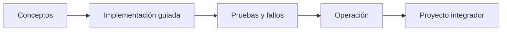

# Parte 20 — Plataformas cloud de datos, analítica, IA y agentes

> [← Parte 19](../part-19-gcp-production-architecture/README.md) · [Índice completo](../README.md) · [Parte 21 →](../part-21-cloud-operations-automation/README.md)

**Nivel:** avanzado · **Clases:** 12 · **Duración sugerida:** 6–8 semanas

Diseñar plataformas gobernadas para batch, streaming, ML, IA generativa y agentes.

## Resultados de la parte

Al completar esta parte podrás explicar el dominio con lenguaje independiente del proveedor,
implementar sus mecanismos esenciales, diagnosticar fallos y defender decisiones mediante
evidencia, costo, seguridad y objetivos de confiabilidad.

## Modelo mental

Una plataforma de IA sigue siendo un sistema de datos: necesita procedencia, evaluación, límites de costo, seguridad y operación antes de una interfaz inteligente.

## Secuencia

## Clases

| ID | Clase | Laboratorio | Horas |
|---:|---|---|---:|
| 241 | [Lakehouse, warehouse, mesh y contratos de datos](241-lakehouse-warehouse-mesh-y-contratos-de-datos/README.md) | `data` | 4 |
| 242 | [Ingesta batch, CDC y streaming](242-ingesta-batch-cdc-y-streaming/README.md) | `data` | 4 |
| 243 | [Orquestación, calidad, lineage y observabilidad de datos](243-orquestacion-calidad-lineage-y-observabilidad-de-datos/README.md) | `observability` | 4 |
| 244 | [Feature stores, training pipelines y experiment tracking](244-feature-stores-training-pipelines-y-experiment-tracking/README.md) | `platform` | 4 |
| 245 | [Serving online, batch inference y escalado de modelos](245-serving-online-batch-inference-y-escalado-de-modelos/README.md) | `performance` | 4 |
| 246 | [MLOps, registro, promoción, drift y rollback](246-mlops-registro-promocion-drift-y-rollback/README.md) | `delivery` | 4 |
| 247 | [Modelos fundacionales, tokens, embeddings y RAG](247-modelos-fundacionales-tokens-embeddings-y-rag/README.md) | `architecture` | 4 |
| 248 | [Bedrock, Azure AI Foundry y Vertex AI](248-bedrock-azure-ai-foundry-y-vertex-ai/README.md) | `decision` | 4 |
| 249 | [Agentes, tools, memoria, permisos y guardrails](249-agentes-tools-memoria-permisos-y-guardrails/README.md) | `security` | 4 |
| 250 | [Evaluación de IA, red teaming y observabilidad](250-evaluacion-de-ia-red-teaming-y-observabilidad/README.md) | `testing` | 4 |
| 251 | [Privacidad, gobernanza, sostenibilidad y costo de IA](251-privacidad-gobernanza-sostenibilidad-y-costo-de-ia/README.md) | `governance` | 4 |
| 252 | [Proyecto: asistente operativo de CloudShop](252-proyecto-asistente-operativo-de-cloudshop/README.md) | `capstone` | 8 |

## Evaluación de la parte

- 35 % laboratorios y evidencia reproducible.
- 25 % retos verificables.
- 20 % decisiones y ADR.
- 10 % seguridad, confiabilidad y costo.
- 10 % proyecto integrador de la parte.

Se aprueba con 80 % de clases en nivel B o superior y el proyecto integrador reproducible.

## Pauta bibliográfica

- Designing Machine Learning Systems — Chip Huyen.
- Fundamentals of Data Engineering — Reis y Housley.
- Building Machine Learning Powered Applications — Emmanuel Ameisen.
