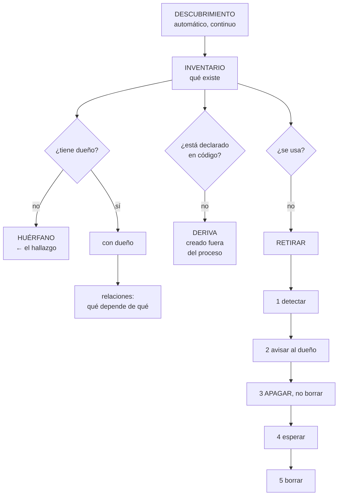

# 253 — Inventario, etiquetado, CMDB y ownership

> [← 252 · Proyecto: asistente operativo de CloudShop](../../part-20-cloud-data-ai-platforms/252-proyecto-asistente-operativo-de-cloudshop/README.md) · [Índice de la parte](../README.md) · [254 · Patching, imágenes doradas y gestión de configuración →](../../part-21-cloud-operations-automation/254-patching-imagenes-doradas-y-gestion-de-configuracion/README.md)

**Parte:** 21 — Operación cloud, automatización y respuesta a incidentes<br>
**Nivel:** avanzado · **Horas estimadas:** 4<br>
**Laboratorio:** `governance` · **Estado:** `EXECUTABLE_CORE`

## 🎯 Propósito

Saber qué hay y de quién es, que es el requisito previo de todo lo demás en operación: **no se puede parchear, retirar, presupuestar ni recuperar lo que no se sabe que existe**. La clase distingue inventario de configuración, explica por qué los inventarios manuales fracasan siempre, da el método para asignar dueños de verdad, y desarrolla la práctica que más resultados produce y menos se hace: retirar.

## 📚 Resultados de aprendizaje

Al finalizar podrás:

1. **Construir** un inventario automático que no envejezca.
2. **Distinguir** inventario, gestión de configuración y relaciones.
3. **Asignar** dueños que respondan, y detectar los que no.
4. **Detectar** lo que existe fuera del proceso y lo que no se usa.
5. **Retirar** con un procedimiento seguro y medible.

## 🧩 Conceptos centrales

| Concepto | Comprensión verificable |
|---|---|
| `inventario` | Lo que existe, descubierto automáticamente. La lista, no la configuración. |
| `base de configuración` | Registro de elementos, sus atributos y sus relaciones. Útil si se alimenta sola. |
| `dueño` | Equipo que responde de un recurso: lo mantiene, lo paga y decide sobre él. |
| `recurso huérfano` | El que existe sin dueño identificable. Ni se mantiene ni se retira. |
| `deriva de inventario` | Diferencia entre lo que existe y lo que está declarado o registrado. |
| `retirada` | Proceso de eliminar lo que ya no hace falta. Detectar, avisar, apagar, esperar y borrar. |

## 🧠 Modelo mental

Operar es controlar cambios bajo incertidumbre: inventario, señal, diagnóstico, acción reversible y aprendizaje deben formar un ciclo cerrado.

Aplicado a esta clase, separa siempre cuatro planos: **intención** (qué necesita el usuario),
**configuración** (qué declaramos), **estado observado** (qué existe de verdad) y
**evidencia** (cómo sabemos que cumple). Confundirlos produce diseños que se ven correctos
en un diagrama pero fallan al operar.

## 🗺️ Flujo de razonamiento



## 📖 Desarrollo

### 1. Tres cosas distintas

«Inventario», «base de configuración» y «mapa de dependencias» se usan como sinónimos y responden preguntas distintas.

```text
INVENTARIO
  ¿QUÉ EXISTE?
  la lista, descubierta de las propias plataformas
  → y debe ser automática y continua

CONFIGURACIÓN
  ¿CÓMO ESTÁ CONFIGURADO?
  atributos, versiones, ajustes
  → y el histórico: qué cambió y cuándo

RELACIONES
  ¿QUÉ DEPENDE DE QUÉ?
  qué se cae si esto se cae
  → y esta es la que casi nunca está completa   ley 24
```

Y por qué los inventarios manuales fracasan siempre:

```text
se rellenan al empezar y quedan obsoletos en semanas
nadie los actualiza porque no le sirve a quien lo
  actualizaría
y cuando hacen falta, no se pueden creer
  → y entonces alguien hace otro inventario a mano

→ el único inventario que sirve es el que se alimenta solo
→ y lo que se rellena a mano es lo que la plataforma no
  puede saber: el DUEÑO y el PROPÓSITO
```

**De dónde sale el inventario automático:**

```text
de las API de las plataformas: recursos, cuentas, redes,
  identidades
de los clústeres y sus cargas               clase 234
de los registros de artefactos e imágenes   clase 212
de los repositorios: qué está declarado     clase 232
de los sistemas de tiquetes y de facturación
y del tráfico observado                      clase 202

→ y la unión de todo eso es lo que da la fotografía
→ con una clave común que permita cruzarlos
```

Y las relaciones, que son la parte difícil:

```text
LO QUE SE PUEDE DESCUBRIR
  dependencias de red, del tráfico observado  clase 202
  llamadas entre servicios, de las trazas     clase 238
  qué consume cada dato, del linaje           clase 243
  qué imágenes usa cada carga
  y qué recursos referencia cada plantilla    clase 232

LO QUE NO
  «este proceso depende de que Ana esté disponible»
  «esta integración la mantiene un proveedor»
  y las dependencias que solo ocurren una vez al mes

→ y por eso el mapa se completa a mano donde haga falta,
  con fecha de revisión                          ley 25
```

### 2. El dueño, y cómo se asigna

Un recurso sin dueño no se mantiene, no se paga con criterio y no se retira. Es la ley 20 en su forma más directa.

```text
QUÉ SIGNIFICA SER DUEÑO
  responder de que funcione
  pagar su coste                              clase 214
  decidir cuándo se actualiza y cuándo se retira
  y ser el destinatario de las alertas         clase 211

→ y por eso el dueño es un EQUIPO, no una persona
  → las personas cambian de equipo y se van    clase 229
```

**Cómo se asigna**, con lo que funciona y lo que no:

```text
✗ UNA CAMPAÑA DE ETIQUETADO
  se pide a todos que etiqueten lo suyo
  → se etiqueta lo fácil y queda lo dudoso
  → y lo nuevo nace sin etiqueta                 ley 27

✓ IMPONERLO EN LA CREACIÓN
  sin etiqueta de dueño, no se crea            clase 214
  → y entonces lo nuevo siempre lo tiene
  → y lo viejo se ataca aparte, con datos

Y PARA LO VIEJO, POR ORDEN
  1  quién lo creó, del registro de auditoría  clase 238
  2  quién lo despliega, del repositorio
  3  quién lo usa, del tráfico y de los permisos
  4  quién paga la cuenta o el proyecto
  5  y si nada de eso da respuesta: candidato a retirar
```

Y el criterio que resuelve los casos dudosos:

```text
SI NADIE LO RECLAMA AL AVISAR, NO TIENE DUEÑO
  → y entonces se apaga
  → y si alguien se queja, ya tiene dueño

→ es brusco y es lo único que funciona
→ y por eso el paso de APAGAR antes de borrar es
  imprescindible                              clase 214
```

**Los huérfanos**, que son el hallazgo típico:

```text
en la clase 229, de 214 proyectos
  con dueño identificable                          94
  con actividad y SIN dueño                        49
  sin actividad                                    71

en la clase 246, de 7 modelos en producción
  con dueño                                         4

y en la clase 200, un script de exportación de un empleado
que ya no estaba, copiando datos desde hacía 14 meses

→ y en todos los casos, el hallazgo lo produjo un
  inventario, no una alerta                       ley 15
```

Y la señal que dice si el modelo funciona:

```text
proporción de recursos con dueño identificable
  → y su tendencia
recursos creados en el último mes sin dueño
  → debe ser cero; si no, la barrera no funciona
y tiempo desde que se detecta un huérfano hasta que se
  resuelve
```

### 3. Deriva: lo que existe fuera del proceso

El inventario sirve para comparar lo que hay con lo que debería haber, y esa comparación es donde están los hallazgos.

```text
LAS TRES COMPARACIONES

1  INVENTARIO frente a CÓDIGO DECLARADO
   lo que existe y no está en ningún repositorio
   → creado a mano, y por tanto no reproducible
   → y no se recrea en un desastre         clases 232, 215

2  INVENTARIO frente a REGISTRO DE CONFIGURACIÓN
   lo que existe y no está registrado
   → o al revés: registrado y no existe

3  CONFIGURACIÓN ACTUAL frente a LA DECLARADA
   alguien cambió algo por la consola
   → y el siguiente despliegue lo revertirá sin avisar
                                                clase 232
```

Y lo que suele aparecer en la primera comparación:

```text
recursos creados «para una prueba»              ley 25
recursos creados durante un incidente y no retirados
recursos de proyectos terminados
recursos creados por un automatismo que ya no existe
y recursos de un equipo que se reorganizó

→ y todos comparten dos propiedades: cuestan dinero y
  amplían la superficie de ataque         clases 214, 226
```

**La disciplina que lo mantiene**, que es la de la clase 232:

```text
la comparación se ejecuta periódicamente y ALERTA
  → y no es un informe que alguien lee

y cada diferencia se clasifica
  se declara en código
  se registra como excepción, con dueño y fecha
  o se retira
→ y las tres opciones cierran; «lo miramos» no cierra
```

Y una categoría que hay que tratar aparte:

```text
LO QUE LA PLATAFORMA CREA SOLA
  recursos gestionados, identidades del sistema, subredes
  de integración
  → aparecen como no declarados y son correctos
  → se marcan para ignorar, con la regla escrita
  → y sin eso, la alerta se llena de ruido y se ignora
                                                clase 125
```

Y una advertencia sobre el registro de configuración:

```text
un registro de configuración que se rellena a mano tiene
el mismo destino que el inventario manual
→ se alimenta de las plataformas, o no existe
→ y su valor está en las RELACIONES y en el histórico, que
  es lo que las plataformas dan peor
```

### 4. Retirar

Es la práctica que más resultados produce y la que menos se hace, porque **nadie la pide**.

```text
POR QUÉ NO SE HACE
  no hay quien la pida: ningún usuario reclama que se
  retire algo
  no tiene métrica visible
  da miedo: ¿y si alguien lo usa?
  y siempre hay algo más urgente                   ley 25

Y QUÉ CUESTA NO HACERLA
  coste directo                             clase 214
  superficie de ataque                      clase 226
  capacidad del equipo consumida en mantener  ley 23
  y actualizaciones bloqueadas por cosas que nadie usa
                                                clase 213
```

**El procedimiento seguro**, en cinco pasos:

```text
1  DETECTAR
   sin actividad en N días
   sin consumidores, según el linaje o el tráfico
   sin dueño
   o marcado como a retirar por su dueño

2  AVISAR al dueño, si lo hay, con plazo
   → y si no lo hay, avisar en el canal general

3  APAGAR o desconectar, sin borrar
   → detener el servicio, quitar el permiso, desasociar
   → y esto es lo que hace el proceso seguro

4  ESPERAR
   → 14 o 30 días, según la criticidad
   → y si alguien se queja, se vuelve a encender en
     minutos

5  BORRAR
   → y con las copias de seguridad, aparte  clase 255
```

Y las señales de «sin actividad», por tipo:

```text
instancias y contenedores    sin peticiones ni conexiones
almacenes                    sin lecturas ni escrituras
bases de datos               sin conexiones
tablas y conjuntos           sin consumidores    clase 243
identidades y claves         sin uso             clase 230
direcciones y balanceadores  sin destinos
imágenes                     sin despliegues     clase 212
suscripciones y colas        sin consumo         clase 237
reglas y rutas               sin coincidencias   clase 231
alertas                      sin disparos en un año
                                                clase 190
y modelos                    sin peticiones      clase 246
```

Y la medida que dice si se está haciendo:

```text
recursos retirados al mes
coste liberado
reclamaciones tras apagar   ← y su proporción
  → si es cero durante meses, se puede ser más agresivo
  → si es alta, la detección está mal

y la cifra que este programa ha visto varias veces
  en la clase 214, 214 recursos retirados y 3
  reclamaciones
  en la clase 229, 71 proyectos retirados y 2
```

Y el caso que hay que tratar con cuidado:

```text
LO QUE SE USA UNA VEZ AL AÑO
  el cierre anual, la campaña de temporada, el informe
  regulatorio
  → «sin actividad en 90 días» lo marca como retirable
  → y apagarlo se descubre el día que hace falta

→ por eso la ventana de detección debe cubrir un ciclo
  completo de negocio, o el dueño debe poder declararlo
                                                clase 167
```

Y la lista de comprobación de la clase:

```text
☐ el inventario se alimenta automáticamente de las
  plataformas
☐ cubre recursos, identidades, datos, imágenes y modelos
☐ hay clave común para cruzar las fuentes
☐ las relaciones se descubren del tráfico, las trazas y el
  linaje
☐ lo que no se puede descubrir está declarado con fecha
☐ el dueño es obligatorio en la creación
☐ el dueño es un equipo, no una persona
☐ hay proceso para asignar dueño a lo antiguo
☐ se compara el inventario con el código declarado
☐ se compara la configuración actual con la declarada
☐ lo que crea la plataforma está marcado para ignorar
☐ cada diferencia se declara, se exceptúa o se retira
☐ hay proceso de retirada con apagado antes del borrado
☐ la ventana de detección cubre un ciclo de negocio
☐ se miden retiradas, coste liberado y reclamaciones
```

Y el cierre que enlaza con la clase siguiente: sabiendo qué hay y de quién es, lo primero que hay que hacer con ello es mantenerlo al día. Parcheo, imágenes doradas y gestión de configuración es la materia de la clase 254.

## 🔬 Ejemplo trabajado

**CloudShop monta su inventario. Lo que sigue es la primera fotografía, los recursos que nadie sabía que existían, y la campaña de retirada que liberó 9.400 € al mes y produjo cuatro reclamaciones.**

**La primera fotografía, unida de siete fuentes:**

```text
fuentes cruzadas
  API de las tres nubes
  clústeres y sus cargas
  registros de imágenes
  repositorios de infraestructura
  facturación
  trazas y registros de flujo
  y el sistema de tiquetes

resultado
  elementos inventariados                        41.200
    con dueño identificable                      24.100  58 %
    sin dueño                                    17.100  42 %
    declarados en código                         31.900  77 %
    creados fuera del proceso                     9.300  23 %
```

Y lo que apareció al cruzar las fuentes:

```text
RECURSOS QUE FACTURAN Y NO ESTÁN EN NINGUNA OTRA FUENTE
  1.140
  → existen, se pagan, y no los despliega nadie, no los usa
    nadie y no están en ningún repositorio

RECURSOS EN REPOSITORIOS QUE NO EXISTEN
    310
  → código que declara cosas que se borraron a mano
  → y que un despliegue recrearía             clase 232

IDENTIDADES SIN USO EN 180 DÍAS
    620
  → de ellas, 41 con permisos de administración
                                                clase 230

IMÁGENES SIN DESPLIEGUE EN 1 AÑO
  7.940
  → 2,1 TB                                    clase 212

ALERTAS SIN DISPARARSE EN 1 AÑO
    214
  → cada una con su regla que mantener        clase 190

Y 3 SERVICIOS EN PRODUCCIÓN QUE NADIE CONOCÍA
  → uno de ellos, procesando pagos de un canal antiguo
    con 41 transacciones al mes
  → su dueño se fue de la empresa en 2023        ley 20
```

**La asignación de dueños.**

```text
primer intento: campaña de etiquetado
  se pidió a los 14 equipos que etiquetaran lo suyo
  en 6 semanas
    etiquetados                              8.400
    sin etiquetar                            8.700
  → se etiquetó lo evidente y quedó lo dudoso
  → y en esas 6 semanas se crearon 1.100 recursos nuevos,
    de los cuales 340 sin etiqueta               ley 27

segundo intento: barrera primero
  1  etiqueta de dueño OBLIGATORIA en la creación, por
     política                              clase 214, 217
     → recursos nuevos sin dueño: 0
  2  y para los 8.700 antiguos, por orden de evidencia

     quién lo creó (registro de auditoría)      3.100
     quién lo despliega (repositorios)          2.400
     quién lo usa (tráfico y permisos)          1.900
     quién paga el proyecto                       900
     ────────────────────────────────────────────────
     resueltos                                  8.300
     sin respuesta                                400
       → candidatos a retirar

tiempo                                          9 semanas
  → y casi todo automatizado: el trabajo manual fueron los
    400 dudosos
```

**La campaña de retirada.**

```text
criterios de detección, por tipo
  instancias sin conexiones en 90 días
  almacenes sin acceso en 180 días
  bases sin conexiones en 90 días
  identidades sin uso en 180 días
  imágenes sin despliegue en 365 días
  alertas sin disparo en 365 días
  colas sin consumo en 30 días
  y proyectos sin actividad en 90 días

→ y con una excepción: los dueños pudieron marcar 41
  elementos como «de uso anual», con motivo
  → el cierre contable, el informe regulatorio y las
    campañas de temporada                    clase 167
```

Y la ejecución, en cinco pasos:

```text
semana 1   DETECTAR
  candidatos                                    3.140

semana 2   AVISAR
  a los dueños, con 14 días
  reclamados por su dueño                         310
    → de ellos, 41 con motivo válido: se marcan
    → 269 no lo usaban y lo confirmaron al mirarlo
  candidatos tras el aviso                      2.830

semanas 4-6  APAGAR, sin borrar
  instancias detenidas                            410
  almacenes con acceso revocado                   180
  identidades desactivadas                        620
  colas con consumidores parados                   14
  alertas desactivadas                            214
  imágenes marcadas para caducidad              7.940
  proyectos apagados                               71
  y el resto, desasociado

semanas 6-10  ESPERAR
  reclamaciones                                     4  ←
    · un informe trimestral que usaba un almacén
    · una integración de un socio, mensual
    · un proceso de conciliación anual, no marcado
    · y una identidad de una herramienta de un proveedor
  → los 4 restaurados en menos de 15 minutos
  → y la lección: la ventana de 90 días no cubre lo
    trimestral ni lo anual                    clase 167

semana 11  BORRAR
  elementos borrados                            2.826
```

Y el resultado:

```text
coste liberado                              9.400 €/mes
  imágenes y almacenamiento                   1.900 €
  instancias y bases                          5.100 €
  proyectos completos                         1.800 €
  otros                                         600 €

reducción de superficie
  identidades con permisos                      -620
  de ellas, con administración                   -41
  servicios expuestos                            -19

y las alertas
  214 retiradas
  → 214 reglas menos que mantener             ley 23
```

Y el ajuste del criterio:

```text
tras las 4 reclamaciones
  la ventana de detección pasó a 400 días para almacenes y
  bases
  y a 90 días solo para instancias y contenedores
  → y los dueños pueden declarar el ciclo de uso de cada
    elemento

en la campaña siguiente (6 meses después)
  candidatos                                      810
  reclamaciones                                     1
```

**Los tres servicios desconocidos:**

```text
1  procesamiento de pagos de un canal antiguo
   41 transacciones al mes, 3.100 € de volumen
   dueño   nadie desde 2023
   → se asignó al equipo de pagos
   → y al revisarlo: usaba una biblioteca con 3
     vulnerabilidades graves y una clave estática de 2022
                                          clases 212, 230
   → corregido

2  exportación nocturna a un socio
   → el socio ya no operaba desde 2024
   → apagado; 0 reclamaciones               ley 25

3  panel interno de un equipo disuelto
   → 4 personas lo usaban, de otro equipo
   → dueño asignado a ese equipo
```

**La deriva, vigilada después:**

```text
comparaciones automáticas, semanales
  inventario frente a código declarado
  configuración actual frente a declarada     clase 232
  y elementos sin dueño

primeros 6 meses
  diferencias detectadas                          141
    creadas a mano durante incidentes              62
      → 48 debían haberse retirado y no se retiraron
                                                    ley 25
    creadas por automatismos de la plataforma      41
      → marcadas para ignorar, con regla escrita
    cambios por consola no revertidos              23
    y 15 sin explicación
      → investigadas: 12 eran de proveedores externos, 3
        de scripts olvidados

elementos sin dueño creados en 6 meses              0
```

**El resultado, al año:**

```text                                        antes     después
elementos inventariados                    41.200      38.100
recursos con dueño identificable             58 %        99 %
recursos creados fuera del proceso          9.300         310
servicios desconocidos                          3           0
identidades sin uso                           620          40
imágenes sin despliegue                     7.940         210
alertas que nunca se disparan                 214           0
coste liberado                                 —      9.400 €/mes
reclamaciones tras retirar                      —        5/3.600
tiempo para saber qué hay                  imposible    40 s
```

**La lección que esta clase deja**: la campaña de etiquetado etiquetó lo evidente y **creó trescientos cuarenta recursos nuevos sin etiqueta mientras se hacía**; lo que funcionó fue poner la barrera primero y atacar lo viejo con datos. Y la retirada de dos mil ochocientos veintiséis elementos produjo **cuatro reclamaciones**, todas de procesos trimestrales o anuales que la ventana de noventa días no podía ver: el criterio de detección tiene que cubrir un ciclo completo de negocio.

## 🧪 Laboratorio guiado

Ejecuta desde la raíz:

```bash
python classes/part-21-cloud-operations-automation/253-inventario-etiquetado-cmdb-y-ownership/lab.py
```

El laboratorio selecciona el motor de práctica **`governance`** y produce
`lab_result.json`. El escenario, sus comprobaciones y el artefacto esperado corresponden a
esta clase; no requiere credenciales y deja explícito qué debe revalidarse en un sandbox real.

1. Lee `exercise.steps` y formula una predicción antes de ejecutar.
2. Ejecuta la práctica y verifica todos los elementos de `checks`.
3. Provoca el caso de `negative_test` y explica la señal observada.
4. Materializa `cloud-inventory` en `evidence/` usando la plantilla indicada.
5. Para proveedor real, sigue `sandbox.requires`, registra costo y ejecuta `destroy`.

### Evidencia esperada

El artefacto principal es una jerarquía de política, ownership y evidencia. Además, la entrega debe incluir el comando ejecutado,
la salida estructurada y una conclusión que no exceda lo observado.

## 🏆 Reto verificable

Construye **`cloud-inventory`** para el caso CloudShop. Incluye una alternativa descartada,
un supuesto que pueda falsarse, una prueba de fallo y una decisión de rollback.

## ✅ Criterio de aceptación

- [ ] `lab.py` termina con código 0 y genera JSON válido.
- [ ] La entrega conecta al menos tres requisitos con mecanismos verificables.
- [ ] Existe una prueba positiva y una prueba negativa con evidencia.
- [ ] Seguridad, costo y operación aparecen como decisiones, no como anexos.
- [ ] Se declara una limitación y una condición que obligaría a revisar el diseño.
- [ ] Otra persona puede repetir el recorrido sin conocimiento tácito.

## ⚠️ Errores frecuentes

| Síntoma | Causa probable | Corrección |
|---|---|---|
| El inventario está obsoleto a las pocas semanas | Se rellena a mano y a nadie le sirve mantenerlo | Aliméntalo automáticamente de las plataformas; solo el dueño y el propósito se declaran a mano. |
| La campaña de etiquetado no termina nunca | Se etiqueta lo antiguo mientras lo nuevo nace sin etiqueta | Impón la etiqueta de dueño en la creación primero y ataca lo antiguo después, con datos de auditoría, despliegue, uso y facturación. |
| Hay recursos que facturan y nadie reclama | Son huérfanos y ningún proceso los detecta | Cruza facturación con inventario, repositorios y tráfico; lo que aparece solo en la factura es el hallazgo. |
| Retirar algo rompe un proceso trimestral | La ventana de detección no cubre un ciclo completo de negocio | Ajusta la ventana por tipo de recurso y permite al dueño declarar el ciclo de uso. |
| La alerta de deriva se llena de ruido y se ignora | Los recursos que crea la plataforma aparecen como no declarados | Márcalos para ignorar con una regla escrita y revisa esa regla periódicamente. |
| Nadie retira nada aunque haya lista | Ningún usuario lo pide y siempre hay algo más urgente | Automatiza el proceso completo con apagado antes de borrar, y mide retiradas, coste liberado y reclamaciones. |

## 🛡️ Seguridad, ética y costo

Trabaja con cuentas propias o sandboxes autorizados. No publiques secretos, identificadores
reales ni datos personales. Antes de crear recursos pagos define presupuesto, etiquetas y
comando de destrucción; después verifica que no queden recursos huérfanos. Los ejemplos
locales enseñan contratos, pero no certifican cumplimiento ni disponibilidad de producción.

## ❓ Preguntas de comprobación

1. ¿Qué pregunta responde cada una de las tres cosas: inventario, configuración y relaciones?
2. ¿Por qué fracasan los inventarios manuales y qué es lo único que se declara a mano?
3. ¿En qué orden se busca el dueño de un recurso antiguo?
4. ¿Qué tres comparaciones producen los hallazgos de deriva?
5. ¿Cuáles son los cinco pasos de una retirada segura y cuál es el que la hace segura?

## 🔗 Referencias

- AWS (2025). *AWS Config and Resource Explorer*. <https://docs.aws.amazon.com/config/latest/developerguide/WhatIsConfig.html>
- Microsoft (2025). *Azure Resource Graph*. <https://learn.microsoft.com/en-us/azure/governance/resource-graph/overview>
- Google Cloud (2025). *Cloud Asset Inventory*. <https://cloud.google.com/asset-inventory/docs/overview>
- Limoncelli, T. y otros (2016). *The Practice of Cloud System Administration*. <https://the-cloud-book.com/>
- Beyer, B. y otros (2018). *The Site Reliability Workbook*, cap. sobre gestión de configuración. <https://sre.google/workbook/table-of-contents/>
- Documentación oficial vigente del servicio implementado; registra URL y fecha de consulta.

---

> [Evaluación](assessment.md) · [Contrato de clase](lesson.yaml) · [Índice de la parte](../README.md)

| Anterior | Índice | Siguiente |
|---|---|---|
| [← 252 · Proyecto: asistente operativo de CloudShop](../../part-20-cloud-data-ai-platforms/252-proyecto-asistente-operativo-de-cloudshop/README.md) | [Parte 21](../README.md) · [Programa](../../README.md) | [254 · Patching, imágenes doradas y gestión de configuración →](../../part-21-cloud-operations-automation/254-patching-imagenes-doradas-y-gestion-de-configuracion/README.md) |
