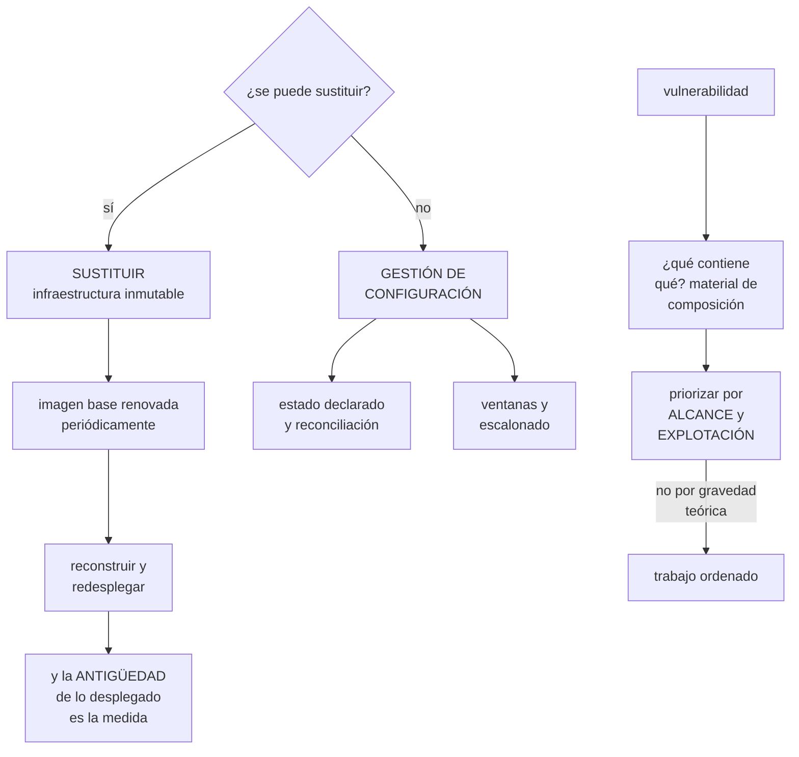

# 254 — Patching, imágenes doradas y gestión de configuración

> [← Clase anterior](../../part-21-cloud-operations-automation/253-inventario-etiquetado-cmdb-y-ownership/README.md) · [Índice de la parte](../README.md) · [Clase siguiente →](../../part-21-cloud-operations-automation/255-backups-restore-testing-vaults-e-inmutabilidad/README.md)

**Parte:** 21 — Operación cloud, automatización y respuesta a incidentes<br>
**Nivel:** avanzado · **Horas estimadas:** 4<br>
**Laboratorio:** `operations` · **Estado:** `EXECUTABLE_CORE`

## 🎯 Propósito

Mantener al día lo que existe, que es donde se acumula la mayor parte del riesgo operativo y del trabajo repetitivo. La clase explica por qué el parcheo tradicional fracasa y qué lo sustituye —**sustituir en vez de arreglar**—, cómo se construyen imágenes base que no envejecen, y qué hacer con lo que no se puede sustituir: la gestión de configuración, con su alcance real y sus límites.

## 📚 Resultados de aprendizaje

Al finalizar podrás:

1. **Sustituir** en lugar de parchear donde el sistema lo permita.
2. **Construir** y renovar imágenes base con procedencia y verificación.
3. **Priorizar** vulnerabilidades por alcance y por explotación real.
4. **Aplicar** gestión de configuración donde la sustitución no llega.
5. **Medir** la antigüedad de lo desplegado y actuar sobre ella.

## 🧩 Conceptos centrales

| Concepto | Comprensión verificable |
|---|---|
| `infraestructura inmutable` | No se modifica lo desplegado: se sustituye por una versión nueva. |
| `imagen base` | Punto de partida común de las cargas. Su renovación es lo que aplica los parches a todo. |
| `antigüedad de lo desplegado` | Tiempo desde que se construyó lo que está corriendo. La medida que resume el estado del parcheo. |
| `material de composición` | Lista de lo que contiene un artefacto. Permite saber qué está afectado por una vulnerabilidad. |
| `explotación conocida` | Que exista un ataque real usando esa vulnerabilidad. Cambia la prioridad más que la gravedad teórica. |
| `gestión de configuración` | Aplicar y mantener un estado declarado sobre sistemas que no se sustituyen. |

## 🧠 Modelo mental

Operar es controlar cambios bajo incertidumbre: inventario, señal, diagnóstico, acción reversible y aprendizaje deben formar un ciclo cerrado.

Aplicado a esta clase, separa siempre cuatro planos: **intención** (qué necesita el usuario),
**configuración** (qué declaramos), **estado observado** (qué existe de verdad) y
**evidencia** (cómo sabemos que cumple). Confundirlos produce diseños que se ven correctos
en un diagrama pero fallan al operar.

## 🗺️ Flujo de razonamiento



## 📖 Desarrollo

### 1. Sustituir en vez de arreglar

El parcheo tradicional —conectarse a un sistema y actualizarlo— falla por razones estructurales.

```text
POR QUÉ FALLA
  cada sistema acaba en un estado distinto
    → «funciona en el servidor 3 y no en el 7»
  un parche que rompe algo deja el sistema a medias
  el que estaba apagado no se parchea
  el que se creó ayer parte de una imagen vieja
  y nadie sabe qué versión hay dónde

→ y el resultado es un conjunto de sistemas únicos que
  nadie puede reproducir                       clase 253
```

**La alternativa**, que es la que este programa usa desde la parte 05:

```text
NO SE MODIFICA LO DESPLEGADO: SE SUSTITUYE
  la imagen base se renueva
  las cargas se reconstruyen sobre ella
  y se despliegan escalonadamente         clase 102

→ y así el parcheo deja de ser una operación aparte y pasa
  a ser un despliegue más
→ con su reversión, sus comprobaciones y su escalonado
```

Y lo que hace falta para que funcione:

```text
1  QUE NADA IMPORTANTE VIVA EN EL SISTEMA
   estado en almacenes y bases, no en discos locales
   → y si algo tiene estado local, no se puede sustituir
     sin más                                clase 149

2  QUE RECONSTRUIR SEA BARATO Y AUTOMÁTICO
   → si construir una imagen tarda dos horas y se hace a
     mano, no se renovará                       ley 16

3  QUE EL DESPLIEGUE SEA SEGURO
   escalonado, con comprobaciones y reversión
                                          clases 212, 233

4  Y QUE LA RENOVACIÓN ESTÉ PROGRAMADA
   → «cuando haya una vulnerabilidad» significa nunca
   → cada dos o cuatro semanas, pase lo que pase
```

**La medida que resume todo esto:**

```text
ANTIGÜEDAD DE LO DESPLEGADO
  ¿cuánto hace que se construyó lo que está corriendo?

  → si el p95 es de 15 días, el parcheo funciona
  → si es de 8 meses, no funciona, digan lo que digan los
    informes de cumplimiento

y es mejor medida que «porcentaje de parches aplicados»
  → porque no depende de qué se considere un parche
  → y porque es una sola cifra que todo el mundo entiende
                                                    ley 17
```

Y la alerta que corresponde:

```text
«esta carga lleva más de N días sin reconstruirse»
  → y es una alerta de antigüedad, como las de la
    clase 211                                     ley 13
→ y cubre lo que ninguna alerta de error cubre: lo que
  funciona y está viejo
```

### 2. Imágenes base y procedencia

La imagen base es el punto donde se aplica el parcheo a todo lo que la usa.

```text
UNA IMAGEN BASE POR FAMILIA, no una por equipo
  → si cada equipo mantiene la suya, hay veinte imágenes
    que renovar                                   ley 23
  → y la mitad no se renuevan

Y LO QUE DEBE TRAER
  el sistema mínimo, sin herramientas de más
  las bibliotecas comunes, con versión fija
  los agentes obligatorios: telemetría, seguridad
  la configuración base endurecida
  y NADA de secretos                       clase 212
```

Y el ciclo de renovación:

```text
1  construcción PROGRAMADA, cada 2-4 semanas
2  exploración de vulnerabilidades
3  pruebas: que arranca, que los agentes reportan, que
   pasan las comprobaciones
4  publicación con ETIQUETA INMUTABLE       clase 212
5  y las cargas la adoptan en su siguiente despliegue

→ y aquí hay una decisión
  ¿las cargas se redespliegan solas al haber imagen nueva,
   o esperan a su siguiente cambio?
  → si esperan, una carga que no cambia nunca se queda
    vieja                                        ley 25
  → lo razonable: redespliegue automático en entornos
    inferiores, y programado en producción
```

**La procedencia**, que es lo que permite responder a una vulnerabilidad:

```text
MATERIAL DE COMPOSICIÓN
  qué contiene cada artefacto: paquetes, bibliotecas,
  versiones
  generado al construir, no a posteriori

→ y así, ante una vulnerabilidad nueva, la pregunta «¿qué
  está afectado?» se responde con una consulta
→ sin él, se responde revisando a mano y se tarda días

Y LA FIRMA
  el artefacto se firma al construir y se verifica al
  desplegar                                clase 106
  → y la admisión rechaza lo no firmado    clase 234
```

Y el registro de imágenes, con su higiene:

```text
etiquetas inmutables
exploración CONTINUA, no solo al subir
  → una imagen desplegada hace tres meses puede tener hoy
    una vulnerabilidad conocida                clase 212
caducidad: las viejas se borran
y alerta: «hay imágenes en producción con vulnerabilidades
  graves publicadas después de su construcción»
```

Y una decisión que se hace mal:

```text
✗ RECONSTRUIR SOLO CUANDO HAY VULNERABILIDAD
  → convierte el parcheo en una urgencia cada vez
  → y la urgencia se hace mal

✓ RECONSTRUIR SIEMPRE, EN CALENDARIO
  → y entonces una vulnerabilidad es «adelantamos la
    siguiente construcción», que es un procedimiento
    conocido                                       ley 22
```

### 3. Priorizar vulnerabilidades

Una exploración produce cientos de hallazgos. Ordenarlos por gravedad teórica es la forma más rápida de trabajar mucho y reducir poco riesgo.

```text
LO QUE ORDENA DE VERDAD, en este orden

1  ¿HAY EXPLOTACIÓN CONOCIDA?
   ¿existe un ataque real usando esto?
   → hay catálogos públicos de vulnerabilidades explotadas
   → y esas van primero, sea cual sea su gravedad teórica

2  ¿ES ALCANZABLE?
   ¿el componente vulnerable está expuesto?
   ¿el código afectado se ejecuta siquiera?
   → una biblioteca incluida y no usada tiene riesgo casi
     nulo

3  ¿HASTA DÓNDE SE LLEGA DESDE AHÍ?
   el alcance desde el punto comprometido
                                          clases 189, 226

4  ¿CUÁNTOS ARTEFACTOS AFECTA?
   → y aquí el material de composición da la respuesta

5  Y SOLO ENTONCES, la gravedad teórica
```

Y la consecuencia práctica:

```text
de 400 hallazgos «críticos» de una exploración típica
  con explotación conocida               entre 5 y 20
  alcanzables de verdad                  menos de la mitad
→ y esos son el trabajo

→ perseguir los 400 consume el trimestre y no reduce el
  riesgo tanto como resolver los 12 primeros
                                                clase 226
```

Y lo que se hace con el resto:

```text
se resuelve en el ciclo normal de renovación
  → la mayoría desaparece sola al reconstruir
y lo que no se puede arreglar se acepta por escrito, con
  dueño y fecha                            clase 189
```

**La cadena de suministro**, que es la parte que más ha crecido:

```text
las dependencias de terceros son la mayor superficie
  → y una dependencia trae otras: el árbol es enorme

lo que hay que hacer
  fijar las versiones, con fichero de bloqueo
  verificar la procedencia de lo que se descarga
  usar un repositorio propio que actúe de espejo
    → así una dependencia retirada del origen no rompe la
      construcción                              ley 25
  y comprobar que un paquete nuevo no es un nombre
    parecido a otro

y lo que no hay que hacer
  actualizar todo automáticamente sin pruebas
  → una actualización maliciosa entra igual que una buena
                                                clase 106
```

Y una advertencia sobre las herramientas:

```text
las exploraciones producen FALSOS POSITIVOS
  versiones que el proveedor ha corregido sin cambiar el
  número
  componentes presentes y no usados
→ y si el equipo pierde la confianza en la herramienta,
  deja de mirarla                                 ley 15
→ por eso las exclusiones justificadas son parte del
  trabajo, no una trampa
```

### 4. Lo que no se puede sustituir

Siempre queda algo: bases de datos, sistemas heredados, dispositivos, equipos de red.

```text
DÓNDE NO LLEGA LA SUSTITUCIÓN
  bases de datos con estado grande
    → se actualizan en su sitio, con su procedimiento
  sistemas heredados que no se pueden reconstruir
  dispositivos y equipos de red             clase 203
  y estaciones de trabajo

→ y ahí sigue haciendo falta gestión de configuración
```

**Cómo se hace bien:**

```text
ESTADO DECLARADO Y RECONCILIACIÓN
  se declara cómo debe estar el sistema
  un agente lo compara y corrige la diferencia
  → y la deriva se detecta                    clase 253

EJECUCIÓN ESCALONADA
  nunca a todos a la vez                        ley 25
  → un grupo, comprobar, siguiente grupo
  → y con criterio de parada

VENTANAS DE MANTENIMIENTO
  declaradas, y con exclusiones para campañas
                                          clases 222, 234

Y COMPROBACIÓN POSTERIOR
  ¿el sistema sigue funcionando tras el cambio?
  → y no solo «el paquete se instaló»
```

Y el orden de una actualización de base de datos, que es el caso más delicado:

```text
1  comprobar compatibilidad de la aplicación
2  ensayar en una copia restaurada de producción
   → y medir cuánto tarda                    clase 255
3  ventana declarada, con el negocio avisado
4  copia inmediatamente antes
5  actualizar la réplica primero, si la hay
6  conmutar, comprobar y solo entonces la primaria
7  y vuelta atrás preparada y PROBADA          ley 22
```

**La antigüedad, medida en todo:**

```text
cargas: días desde la construcción
imágenes base: días desde la renovación
bases de datos: versión frente a la soportada
dispositivos: versión de firmware
y dependencias: días desde la última actualización

→ y una sola tabla con esas cifras dice más del estado del
  parcheo que cualquier informe de cumplimiento
                                                clase 226
```

Y las señales que hay que vigilar:

```text
p50 y p95 de antigüedad de lo desplegado
cargas por encima del umbral de antigüedad
vulnerabilidades con explotación conocida, abiertas
imágenes en producción con vulnerabilidades publicadas
  después de su construcción
sistemas fuera de soporte
y fallos de reconstrucción programada
  → si la construcción periódica falla y nadie lo mira, el
    parcheo se ha parado en silencio            ley 13
```

Y la lista de comprobación de la clase:

```text
☐ las cargas se sustituyen, no se parchean en el sitio
☐ nada importante vive en el disco local
☐ la reconstrucción está automatizada y es barata
☐ hay imagen base por familia, no por equipo
☐ la imagen se renueva en calendario, no por urgencia
☐ se genera material de composición al construir
☐ los artefactos se firman y se verifican al desplegar
☐ hay exploración continua, no solo al construir
☐ las vulnerabilidades se priorizan por explotación y
  alcance
☐ las exclusiones están justificadas y revisadas
☐ las dependencias están fijadas y con espejo propio
☐ lo que no se sustituye tiene estado declarado y
  reconciliación
☐ las actualizaciones son escalonadas y con ventana
☐ la vuelta atrás está probada
☐ se mide la antigüedad de lo desplegado, con alerta
☐ hay alerta si falla la reconstrucción programada
```

Y el cierre que enlaza con la clase siguiente: mantener al día lo que existe protege de lo previsible. Lo imprevisible exige poder volver atrás, y para eso hacen falta copias que funcionen. Es la materia de la clase 255.

## 🔬 Ejemplo trabajado

**CloudShop rehace su parcheo. Lo que sigue es la antigüedad de lo desplegado que nadie había medido, la priorización que redujo 412 hallazgos críticos a 14, y la reconstrucción programada que llevaba tres meses fallando en silencio.**

**La primera medición.**

```text
el informe de cumplimiento decía
  «97 % de sistemas parcheados»

y la antigüedad de lo desplegado, medida
  cargas en contenedores                            310
    p50                                          9 días
    p95                                        214 días  ←
    máximo                                     441 días
  máquinas virtuales                                 88
    p50                                        118 días
    p95                                        390 días
  imágenes base en uso                                7
    la más reciente                             14 días
    la más antigua                             290 días  ←

→ el 97 % se refería a que el agente de parcheo había
  ejecutado con éxito
→ y ejecutaba sobre las máquinas encendidas en ese momento
→ las cargas en contenedores no las tocaba en absoluto
```

Y el desglose de las cargas más antiguas:

```text
las 41 cargas con más de 180 días
  servicios que no habían cambiado desde su despliegue     28
    → funcionaban, nadie los tocaba, nadie los reconstruía
                                                    ley 25
  servicios de equipos disueltos                            7
  trabajos programados                                      6

→ y las 28 primeras son el caso puro: si la reconstrucción
  depende de que alguien cambie el código, lo que no cambia
  se queda viejo
```

**La reconstrucción programada.**

```text
lo que se montó
  las 7 imágenes base se reducen a 3 (una por familia)
  construcción programada cada 14 días
  exploración, pruebas de arranque y de agentes
  publicación con etiqueta inmutable
  y REDESPLIEGUE AUTOMÁTICO de todas las cargas
    en desarrollo y preproducción, inmediato
    en producción, escalonado durante la semana siguiente
                                                clase 212

y la decisión que importaba
  el redespliegue NO espera a que el equipo cambie algo
  → lo que no cambia se reconstruye igual
```

Y el resultado:

```text                                        antes     después
p50 de antigüedad (contenedores)          9 días      6 días
p95                                     214 días     19 días
máximo                                  441 días     24 días
cargas por encima de 30 días                 41           0
```

**La reconstrucción que fallaba en silencio.**

```text
tres meses después, la p95 volvió a subir a 74 días

diagnóstico
  la construcción programada de una de las tres imágenes
  fallaba desde hacía 11 semanas
  motivo: un repositorio de paquetes había cambiado su
  dirección                                clase 195

  y el fallo
    la canalización marcaba el trabajo como fallido
    la alerta existía
    y salía al canal del equipo de plataforma, que tenía
    340 mensajes al día                     ley 15, clase 211

→ y como la imagen anterior seguía existiendo, las cargas
  se seguían desplegando con ella
→ nada falló: simplemente dejó de renovarse       ley 13

correcciones
  alerta de ANTIGÜEDAD de la imagen base
    «la imagen X no se renueva desde hace más de 21 días»
    → a canal con guardia
  y espejo propio de los repositorios de paquetes
    → un cambio de dirección del origen deja de romper la
      construcción                              ley 25
```

**La priorización de vulnerabilidades.**

```text
la exploración de las 3 imágenes y las 310 cargas
  hallazgos totales                              4.180
  clasificados como críticos o graves              412

y el equipo llevaba 5 meses persiguiendo los 412
  resueltos                                        180
  y aparecían nuevos cada semana

la priorización, aplicada
  1  con explotación conocida (catálogo público)     14  ←
  2  alcanzables desde internet                      61
     de ellos, con explotación conocida               9
  3  en componentes que el código NO usa            190
     → riesgo casi nulo; se resuelven al reconstruir
  4  en herramientas de construcción, no en
     producción                                      88
  5  el resto                                        59

→ los 14 primeros se resolvieron en 6 días
→ de los 412, 340 desaparecieron solos en las dos
  siguientes reconstrucciones programadas

y lo que quedó
  vulnerabilidades sin corrección disponible          8
  → aceptadas por escrito, con dueño, mitigación y fecha
    de revisión                                clase 189
```

Y el material de composición, que hizo posible todo esto:

```text
antes de tenerlo
  ante una vulnerabilidad nueva, la pregunta «¿qué está
  afectado?» se respondía revisando a mano
  tiempo medio                                    3 días

con el material generado al construir
  consulta sobre el inventario de artefactos  clase 253
  tiempo medio                                    40 s

y en la primera vulnerabilidad grave tras montarlo
  artefactos afectados, según la consulta            61
  que el equipo creía                                12
  → 49 que no se habrían corregido
```

**Lo que no se pudo sustituir.**

```text
quedaron fuera de la sustitución
  4 bases de datos gestionadas
  1 sistema heredado de facturación
  11 equipos de red de las oficinas
  340 puntos de venta de las tiendas          clase 203

y para cada uno
  BASES DE DATOS
    actualización con el procedimiento de 7 pasos
    ensayada sobre copia restaurada           clase 255
    → y en el primer ensayo, la actualización tardó 4 h 10
      frente a la 1 h prevista
    → la ventana se planificó con la cifra medida

  SISTEMA HEREDADO
    gestión de configuración con estado declarado
    reconciliación diaria
    → y la deriva detectada: 14 cambios manuales en 6 meses
                                                clase 253

  EQUIPOS DE RED Y PUNTOS DE VENTA
    actualización escalonada por grupos       clase 203
    con doble partición y vuelta atrás automática
    → y en junio, una versión defectuosa se detectó en el
      grupo de 5 y no llegó a los otros 335
```

**Las dependencias y la cadena de suministro:**

```text
ficheros de bloqueo en los 41 repositorios
  antes                                            18
  después                                          41

espejo propio de los repositorios de paquetes
  → y en 6 meses, 3 paquetes desaparecieron del origen
  → las construcciones siguieron funcionando  ley 25

y la comprobación de nombres parecidos
  al añadir una dependencia nueva, se comprueba si existe
  otra con nombre casi idéntico y mucha más descarga
  → 2 avisos en 6 meses; los 2, errores de escritura
```

**El resultado, al año:**

```text                                        antes     después
p95 de antigüedad (contenedores)        214 días     19 días
p95 (máquinas virtuales)                390 días     26 días
imágenes base                                   7          3
la más antigua en uso                   290 días     16 días
vulnerabilidades con explotación conocida
  abiertas                                     14          0
hallazgos perseguidos sin criterio            412          0
tiempo para saber qué está afectado        3 días       40 s
reconstrucción programada parada sin
  detectar                                11 semanas       0
sistemas fuera de soporte                       6          0
```

**La lección que esta clase deja**: el informe decía **97 % de sistemas parcheados** y la antigüedad real del percentil 95 era de doscientos catorce días, porque la medida contaba ejecuciones del agente y no cubría los contenedores. La reconstrucción programada, que era la solución, **llevó once semanas parada sin que nadie lo notara**, porque su fallo era un mensaje más entre trescientos cuarenta al día. Y de cuatrocientos doce hallazgos críticos, **catorce tenían explotación conocida** y trescientos cuarenta desaparecieron solos al reconstruir.

## 🧪 Laboratorio guiado

Ejecuta desde la raíz:

```bash
python classes/part-21-cloud-operations-automation/254-patching-imagenes-doradas-y-gestion-de-configuracion/lab.py
```

El laboratorio selecciona el motor de práctica **`operations`** y produce
`lab_result.json`. El escenario, sus comprobaciones y el artefacto esperado corresponden a
esta clase; no requiere credenciales y deja explícito qué debe revalidarse en un sandbox real.

1. Lee `exercise.steps` y formula una predicción antes de ejecutar.
2. Ejecuta la práctica y verifica todos los elementos de `checks`.
3. Provoca el caso de `negative_test` y explica la señal observada.
4. Materializa `patch-strategy` en `evidence/` usando la plantilla indicada.
5. Para proveedor real, sigue `sandbox.requires`, registra costo y ejecuta `destroy`.

### Evidencia esperada

El artefacto principal es un runbook probado por otra persona. Además, la entrega debe incluir el comando ejecutado,
la salida estructurada y una conclusión que no exceda lo observado.

## 🏆 Reto verificable

Construye **`patch-strategy`** para el caso CloudShop. Incluye una alternativa descartada,
un supuesto que pueda falsarse, una prueba de fallo y una decisión de rollback.

## ✅ Criterio de aceptación

- [ ] `lab.py` termina con código 0 y genera JSON válido.
- [ ] La entrega conecta al menos tres requisitos con mecanismos verificables.
- [ ] Existe una prueba positiva y una prueba negativa con evidencia.
- [ ] Seguridad, costo y operación aparecen como decisiones, no como anexos.
- [ ] Se declara una limitación y una condición que obligaría a revisar el diseño.
- [ ] Otra persona puede repetir el recorrido sin conocimiento tácito.

## ⚠️ Errores frecuentes

| Síntoma | Causa probable | Corrección |
|---|---|---|
| El informe dice que casi todo está parcheado y no lo está | La medida cuenta ejecuciones del agente y no cubre lo que no es una máquina | Mide la antigüedad de lo desplegado, con percentiles, y alerta sobre las cargas que la superan. |
| Los servicios que nadie toca se quedan viejos | La reconstrucción depende de que alguien cambie el código | Redespliega automáticamente al renovar la imagen base, sin esperar a un cambio del equipo. |
| El parcheo se detiene sin que nadie lo note | La construcción programada falla y su alerta se pierde entre el ruido | Alerta por antigüedad de la imagen base a un canal con guardia, no solo por fallo de la construcción. |
| El equipo persigue cientos de hallazgos y el riesgo no baja | Se prioriza por gravedad teórica | Ordena por explotación conocida, alcanzabilidad y alcance; el resto desaparece con la renovación periódica. |
| No se sabe qué artefactos contienen un componente vulnerable | No se genera material de composición al construir | Genera la lista de contenido en la construcción y consúltala contra el inventario de artefactos. |
| Una actualización de base de datos se alarga mucho más de lo previsto | No se ensayó sobre una copia restaurada de producción | Ensaya y cronometra sobre una restauración real antes de planificar la ventana. |

## 🛡️ Seguridad, ética y costo

Trabaja con cuentas propias o sandboxes autorizados. No publiques secretos, identificadores
reales ni datos personales. Antes de crear recursos pagos define presupuesto, etiquetas y
comando de destrucción; después verifica que no queden recursos huérfanos. Los ejemplos
locales enseñan contratos, pero no certifican cumplimiento ni disponibilidad de producción.

## ❓ Preguntas de comprobación

1. ¿Por qué falla el parcheo tradicional y qué lo sustituye?
2. ¿Qué medida resume el estado del parcheo mejor que el porcentaje de parches aplicados?
3. ¿Qué decide si una carga que nadie toca se mantiene al día?
4. ¿En qué orden se priorizan las vulnerabilidades?
5. ¿Qué queda fuera de la sustitución y cómo se trata?

## 🔗 Referencias

- CISA (2025). *Known Exploited Vulnerabilities catalog*. <https://www.cisa.gov/known-exploited-vulnerabilities-catalog>
- CycloneDX (2025). *Software bill of materials specification*. <https://cyclonedx.org/specification/overview/>
- SLSA (2025). *Supply chain levels for software artifacts*. <https://slsa.dev/>
- AWS (2025). *EC2 Image Builder and golden AMI pipelines*. <https://docs.aws.amazon.com/imagebuilder/latest/userguide/what-is-image-builder.html>
- Beyer, B. y otros (2018). *The Site Reliability Workbook*, cap. sobre gestión de cambios. <https://sre.google/workbook/table-of-contents/>
- Documentación oficial vigente del servicio implementado; registra URL y fecha de consulta.

---

> [Evaluación](assessment.md) · [Contrato de clase](lesson.yaml) · [Índice de la parte](../README.md)
