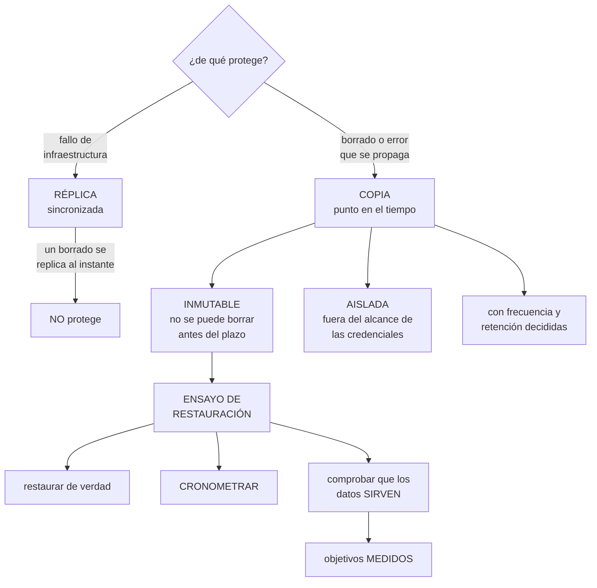

# 255 — Backups, restore testing, vaults e inmutabilidad

> [← 254 · Patching, imágenes doradas y gestión de configuración](../../part-21-cloud-operations-automation/254-patching-imagenes-doradas-y-gestion-de-configuracion/README.md) · [Índice de la parte](../README.md) · [256 · Administración remota sin SSH permanente →](../../part-21-cloud-operations-automation/256-administracion-remota-sin-ssh-permanente/README.md)

**Parte:** 21 — Operación cloud, automatización y respuesta a incidentes<br>
**Nivel:** avanzado · **Horas estimadas:** 4<br>
**Laboratorio:** `reliability` · **Estado:** `EXECUTABLE_CORE`

## 🎯 Propósito

Poder volver atrás cuando algo se pierde, que es distinto de tener copias: **una copia que nunca se ha restaurado no es una copia, es un fichero**. La clase cubre qué hay que copiar y qué no, la inmutabilidad y el aislamiento que protegen de un borrado deliberado, el ensayo de restauración como práctica obligatoria, y los escenarios que las copias no cubren.

## 📚 Resultados de aprendizaje

Al finalizar podrás:

1. **Decidir** qué se copia, con qué frecuencia y cuánto se conserva.
2. **Proteger** las copias de un borrado deliberado o accidental.
3. **Ensayar** restauraciones y medir el plazo real.
4. **Distinguir** copia, réplica y versión, y saber qué cubre cada una.
5. **Reconocer** los escenarios que las copias no resuelven.

## 🧩 Conceptos centrales

| Concepto | Comprensión verificable |
|---|---|
| `copia de seguridad` | Punto en el tiempo del que se puede restaurar. Protege de errores y de borrados. |
| `réplica` | Copia sincronizada de los datos. Protege de fallo de infraestructura, no de borrado. |
| `inmutabilidad` | Propiedad que impide modificar o borrar una copia antes de un plazo, ni siquiera con permisos totales. |
| `aislamiento de la copia` | Que las copias vivan fuera del alcance de las credenciales del sistema copiado. |
| `objetivo de recuperación` | Cuánto se tarda en volver y cuánto se pierde. Ambos MEDIDOS, no declarados. |
| `ensayo de restauración` | Restaurar de verdad y comprobar que los datos sirven. Lo único que valida una copia. |

## 🧠 Modelo mental

Operar es controlar cambios bajo incertidumbre: inventario, señal, diagnóstico, acción reversible y aprendizaje deben formar un ciclo cerrado.

Aplicado a esta clase, separa siempre cuatro planos: **intención** (qué necesita el usuario),
**configuración** (qué declaramos), **estado observado** (qué existe de verdad) y
**evidencia** (cómo sabemos que cumple). Confundirlos produce diseños que se ven correctos
en un diagrama pero fallan al operar.

## 🗺️ Flujo de razonamiento



## 📖 Desarrollo

### 1. Copia, réplica y versión

Tres cosas que se confunden y protegen de amenazas distintas. Confundirlas es el error inicial.

```text
RÉPLICA
  copia sincronizada, en otra zona o región
  protege de   fallo de infraestructura
  NO protege de
    un borrado: se replica al instante
    una corrupción: se replica
    un error de aplicación: se replica
    ni un cifrado malicioso: se replica

COPIA DE SEGURIDAD
  punto en el tiempo del que se puede volver
  protege de   borrado, corrupción, error y ataque
  → y es lo único que protege de esas cuatro

VERSIONADO
  las versiones anteriores de un objeto se conservan
  protege de   sobrescritura y borrado accidental
  NO protege de
    quien tenga permiso para borrar las versiones
  → y por eso el versionado sin bloqueo no basta
```

Y el error que este programa ha visto varias veces:

```text
«tenemos replicación multirregión, estamos cubiertos»
  → ante un borrado, las dos regiones quedan vacías a la
    vez                                          clase 166
→ y esa frase es la señal de que no hay copias de verdad
```

**Qué se copia**, con lo que se olvida:

```text
LO QUE SE COPIA SIEMPRE
  bases de datos
  almacenes de objetos con datos de negocio
  configuración que no está en código

LO QUE SE OLVIDA
  el ESTADO del código como infraestructura   clase 232
    → sin él, el código no sabe qué gestiona
  los secretos y las claves de cifrado
    → sin la clave, los datos cifrados no sirven
                                                clase 239
  los artefactos e imágenes                    clase 254
    → sin ellos, no se puede desplegar
  el registro de decisiones y la documentación
  las definiciones de alertas, paneles y objetivos
  y los datos de los sistemas gestionados que se creen
    copiados y no lo están

LO QUE NO SE COPIA
  lo que se puede reconstruir del código          clase 232
  cachés y datos derivados
  y registros más allá de su retención        clase 238
  → copiarlos cuesta y no aporta
```

Y la pregunta que ordena las decisiones:

```text
POR CADA CONJUNTO
  ¿cuánto se puede perder?     → frecuencia de la copia
  ¿cuánto se puede tardar?     → tipo de copia y de destino
  ¿cuánto hay que conservar?   → retención, por norma o por
                                 negocio
  ¿desde dónde hay que poder
   restaurar?                  → región y aislamiento

→ y las respuestas se escriben, por conjunto  clase 166
→ «lo copiamos todo cada noche» no es una respuesta
```

### 2. Proteger las copias

Una copia que se puede borrar con las mismas credenciales que borran los datos no protege del escenario que importa.

```text
EL ESCENARIO
  alguien obtiene credenciales con permisos amplios
  borra los datos
  y borra las copias
  → y ese es el orden que sigue un ataque de cifrado

→ y también es lo que hace un error: un despliegue en modo
  completo sobre el grupo equivocado          clase 220
```

**Las tres protecciones**, que se aplican juntas:

```text
1  INMUTABILIDAD
   la copia no se puede modificar ni borrar antes de un
   plazo
   ni siquiera con permisos totales
   → y ese plazo se elige por escenario, no por costumbre

2  AISLAMIENTO
   las copias viven en otra cuenta, otro proyecto u otra
   suscripción
   con credenciales distintas
   → y el sistema copiado NO puede escribir ni borrar allí
   → el flujo es de una sola dirección

3  SEPARACIÓN DE PERMISOS
   quien administra el sistema no administra las copias
   quien puede borrar una copia es otro, y con elevación
   temporal                                clases 218, 230
```

Y la comprobación que valida las tres:

```text
desde las credenciales de producción, intentar
  borrar una copia            → debe fallar
  modificarla                 → debe fallar
  cambiar su retención        → debe fallar
  desactivar la programación  → debe fallar

→ y esta prueba negativa ha aparecido en las clases 174,
  179 y 189, y ha fallado más de una vez        ley 22
```

Y la copia fuera de línea, para el peor caso:

```text
una copia periódica en un medio o una cuenta sin
conectividad con el resto
  → protege del escenario en que el atacante tiene tiempo
  → y su restauración es lenta, a propósito

→ hace falta si el sistema es crítico y el escenario de
  ataque es real
→ y si no se hace, se declara como riesgo aceptado
                                                clase 189
```

**El cifrado de las copias**, con su detalle:

```text
las copias van cifradas
  → y la CLAVE tiene que estar disponible al restaurar
  → si la clave vive solo en la región perdida, la copia no
    sirve                                     clase 239

y la clave también se copia, o se replica
  → con su propio aislamiento
  → y esto es lo que más se olvida
```

Y la retención, con lo que hay que decidir:

```text
¿CUÁNTO ATRÁS HAY QUE PODER VOLVER?
  un borrado se detecta en horas
  una corrupción, en días
  un error de lógica, en semanas o meses
  y un ataque puede llevar meses dentro

→ y por eso la retención de las copias más antiguas
  responde al escenario más lento, no al más rápido
→ típicamente: diarias 30 días, semanales 3 meses,
  mensuales 1 año, anuales lo que exija la norma
```

### 3. El ensayo de restauración

Es lo único que valida una copia, y es lo que casi nadie hace.

```text
LO QUE NO VALIDA UNA COPIA
  que el trabajo de copia terminó con éxito
  que el fichero existe y tiene el tamaño esperado
  que el panel está en verde
  → todo eso puede ser cierto con una copia inservible
                                                    ley 22

LO QUE SÍ
  restaurarla, ponerla a funcionar y comprobar que los
  datos sirven
```

**Qué se comprueba en un ensayo:**

```text
1  QUE SE PUEDE RESTAURAR
   → y aquí aparecen los permisos que faltan, la clave que
     no está y el procedimiento que no existe

2  CUÁNTO TARDA, cronometrado
   → y ese número es el objetivo REAL, no el declarado
   → y suele ser varias veces mayor

3  CUÁNTO SE PIERDE, medido
   → la diferencia entre el momento de la copia y el del
     fallo

4  QUE LOS DATOS SIRVEN
   → no que el fichero se restauró: que la aplicación
     arranca, que las consultas devuelven lo esperado y
     que los recuentos cuadran
   → y esto exige una comprobación funcional, no técnica

5  Y QUE EL PROCEDIMIENTO LO PUEDE EJECUTAR OTRA PERSONA
   → quien lo escribió sabe los pasos que no escribió
                                          clases 128, 179
```

Y la disciplina:

```text
ENSAYO PROGRAMADO, no cuando haya tiempo
  los conjuntos críticos, cada trimestre
  el resto, al menos una vez al año
  y siempre tras un cambio grande del sistema

EN UN ENTORNO SEPARADO
  → restaurar sobre producción para probar es como se
    convierte un ensayo en un incidente

Y CON EL RESULTADO PUBLICADO
  qué se restauró, cuánto tardó, qué falló
  → y los fallos se corrigen y se repite       clase 215
```

Y lo que los ensayos suelen encontrar:

```text
la clave de cifrado no estaba disponible
el procedimiento tenía pasos que ya no existían
el plazo real era 3 o 4 veces el declarado
faltaba copiar algo: una tabla, un esquema, una
  configuración
la copia estaba, y era de un sistema que ya no existe así
y nadie tenía permiso para restaurar sin pedirlo

→ y ninguno de estos se detecta mirando el panel de copias
```

Y una forma barata de ensayar continuamente:

```text
RESTAURACIÓN AUTOMÁTICA A UN ENTORNO DE PRUEBAS
  la copia de anoche se restaura sola en un entorno
  y se ejecutan unas comprobaciones funcionales
  → y si algo falla, alerta

→ cuesta poco y convierte el ensayo en algo continuo
→ y además da un entorno de pruebas con datos reales, que
  hay que tratar con sus permisos          clase 251
```

### 4. Lo que las copias no cubren

Hay escenarios que una copia no resuelve, y conviene saberlo antes.

```text
EL BORRADO QUE SE DESCUBRE TARDE
  si la retención es de 30 días y el error se descubre a
  los 45, no hay de dónde volver
  → por eso la retención responde al escenario más lento

LA CORRUPCIÓN QUE SE PROPAGA A LAS COPIAS
  un error de aplicación que corrompe datos durante
  semanas
  → todas las copias de ese periodo tienen el error
  → y volver atrás pierde todo lo bueno de esas semanas
  → aquí lo que salva es detectarlo antes    clase 243

LO QUE NO SE PUEDE VOLVER A HACER
  correos enviados, pagos ejecutados, mensajes publicados
  → restaurar la base no los deshace       clase 246

LA PÉRDIDA DE LO QUE ESTABA EN VUELO
  las transacciones entre la última copia y el fallo
  → y ese es el objetivo de pérdida, que hay que aceptar
    explícitamente

Y EL SISTEMA QUE NO ESTÁ COPIADO
  → lo que no está en el inventario no está copiado
                                                clase 253
```

Y las prácticas que cubren esos huecos:

```text
CONTRA EL DESCUBRIMIENTO TARDÍO
  detección de anomalías en los datos       clase 243
  y retención larga en las copias mensuales

CONTRA LA CORRUPCIÓN PROPAGADA
  comprobaciones de calidad que detienen    clase 243
  y capacidad de reprocesar desde el dato bruto
                                                clase 242

CONTRA LO IRREVERSIBLE
  límites y confirmación antes de actuar    clase 249

Y CONTRA LO NO COPIADO
  el inventario cruzado con la lista de copias
  → «recursos con datos que no tienen copia» es una
    consulta, y su resultado debe ser cero  clase 253
```

**El plan de recuperación**, con lo que debe contener:

```text
por cada conjunto
  qué se copia, con qué frecuencia y retención
  dónde está y con qué credenciales se accede
  el objetivo de recuperación MEDIDO
  el procedimiento, probado por otra persona
  quién puede autorizar una restauración
  y en qué orden se restauran las cosas
    → una aplicación sin su base no sirve
    → y una base sin sus secretos, tampoco
```

Y lo que hay que vigilar:

```text
copias con fallo, y su antigüedad
conjuntos con datos y SIN copia         → cero
antigüedad de la copia más reciente por conjunto  ley 13
fecha del último ensayo por conjunto
coste del almacenamiento de copias      clase 214
y cambios en la configuración de copias  → auditados
  → alguien que desactiva una programación es una señal
                                                clase 226
```

Y la lista de comprobación de la clase:

```text
☐ se distingue réplica de copia, y no se confunden
☐ está escrito qué se copia por conjunto, con frecuencia y
  retención
☐ se copian estado del código, secretos, claves y
  artefactos
☐ las copias son inmutables durante un plazo
☐ viven en otra cuenta, con credenciales distintas
☐ producción no puede borrarlas ni cambiar su retención
☐ la comprobación de que no puede se ha ejecutado
☐ la clave de cifrado está disponible al restaurar
☐ hay retención larga para escenarios de descubrimiento
  tardío
☐ hay ensayo de restauración programado y publicado
☐ el ensayo comprueba que los datos SIRVEN
☐ lo ejecuta alguien que no escribió el procedimiento
☐ el objetivo de recuperación está medido, no declarado
☐ hay consulta de recursos con datos y sin copia
☐ los cambios de configuración de copias se auditan
```

Y el cierre que enlaza con la clase siguiente: con lo que existe inventariado, al día y recuperable, queda cómo se accede a ello para operarlo. Administración remota sin acceso permanente es la materia de la clase 256.

## 🔬 Ejemplo trabajado

**CloudShop revisa sus copias. Lo que sigue es el ensayo que reveló que la clave de cifrado no estaba, los 41 conjuntos sin copia que nadie sabía, y el objetivo de recuperación que era cuatro veces el declarado.**

**El punto de partida:**

```text
el panel de copias                          todo en verde
trabajos de copia                                     118
  con éxito en los últimos 30 días                    118

el objetivo declarado en el plan de continuidad
  plazo de recuperación                             1 hora
  pérdida máxima                                   15 min

y ensayos de restauración ejecutados
  en los últimos 2 años                                  1
  → sobre una base pequeña, en 2023
```

**El primer ensayo completo.**

```text
se ensayó la restauración de la base de pedidos, la más
crítica

  09:00  se inicia
  09:04  se localiza la copia               ✓
  09:11  se solicita permiso de restauración
         → nadie del equipo lo tenía; hubo que escalar
  09:52  permiso concedido                  ✗ 41 min
  09:55  restauración iniciada
  10:38  restauración completada            ✓ 43 min
  10:40  la aplicación no arranca
         → los secretos de conexión estaban en el gestor de
           secretos de producción, que en el ensayo no era
           accesible
  11:20  resuelto copiando los secretos a mano
  11:25  la aplicación arranca
  11:30  COMPROBACIÓN FUNCIONAL
         → los recuentos no cuadran: faltaban 4 tablas
         → estaban en un esquema que la programación de
           copias no incluía

  ensayo detenido                            2 h 30
  resultado                                   FALLIDO

el objetivo declarado                        1 hora
el plazo real, con las correcciones           4 h 10
```

Y los cinco hallazgos:

```text
1  nadie del equipo de guardia podía restaurar
   → 3 personas con permiso, por elevación temporal
                                                clase 230
2  los secretos no estaban en el plan de recuperación
   → añadidos, con su propia copia aislada
3  4 tablas fuera de la programación de copias
   → la programación se hizo por lista y el esquema nuevo
     no entró                                    ley 27
   → cambiada a «todo el esquema, con exclusiones
     declaradas»
4  el procedimiento tenía 3 pasos que ya no existían
5  y el plazo real era 4 veces el declarado
   → el plan de continuidad se corrigió con la cifra
     medida                                  clase 215
```

**La clave de cifrado.**

```text
el segundo ensayo, esta vez simulando la pérdida de la
región principal

  la copia estaba replicada en la segunda región     ✓
  al intentar restaurar
    → la copia estaba cifrada con una clave gestionada por
      el cliente
    → y esa clave vivía SOLO en la región principal
                                                clase 239
    → la copia era ilegible

→ y esto no aparece en ningún panel: la copia existe, tiene
  el tamaño correcto y el trabajo terminó bien
                                                    ley 22

corrección
  la clave replicada a la segunda región
  y una comprobación mensual: restaurar un objeto pequeño
  desde la segunda región con la clave de allí
```

**Los 41 conjuntos sin copia.**

```text
se cruzó el inventario con la lista de copias
                                                clase 253

  recursos con datos                                 214
  con copia programada                               173
  SIN COPIA                                           41  ←

los 41
  14  almacenes de objetos creados por equipos, con datos
      de negocio
   9  bases de datos de entornos que se habían promovido a
      producción sin cambiar su configuración   ley 27
   6  conjuntos del almacén analítico con transformaciones
      que costaría semanas rehacer
   5  el ESTADO del código como infraestructura   clase 232
      → sin él, el código no sabe qué gestiona
   4  registros de decisión y documentación en una
      herramienta sin copias
   3  configuraciones de alertas y paneles       clase 238

→ y los 5 del estado eran el más grave: en un desastre, el
  código habría intentado recrear 4.100 recursos que ya
  existían                                    clase 232

corrección
  los 41 con copia
  y una consulta automática: «recursos con datos y sin
  copia» → debe dar cero
  → con alerta                                    ley 13
```

**La protección de las copias.**

```text
la prueba negativa, desde credenciales de producción
  borrar una copia                    ✗ FUNCIONÓ
  cambiar su retención                ✗ FUNCIONÓ
  desactivar la programación          ✗ FUNCIONÓ

→ las copias vivían en la misma cuenta que los datos
→ y un ataque con credenciales de producción se las habría
  llevado                                    clase 166

corrección
  cuenta de copias separada, con credenciales propias
  producción escribe allí y NO puede leer, modificar ni
    borrar
  inmutabilidad de 35 días
  cambios de retención y de programación, con elevación
    temporal y alerta inmediata            clases 218, 226

la prueba, repetida
  borrar                              ✓ denegado
  cambiar retención                   ✓ denegado
  desactivar programación             ✓ denegado + alerta
```

**La restauración continua, montada después.**

```text
cada noche
  la copia de las 4 bases críticas se restaura
  automáticamente en un entorno de pruebas
  se arranca la aplicación
  y se ejecutan 12 comprobaciones funcionales
    recuentos de tablas principales
    una consulta de negocio con resultado conocido
    y el arranque de los 3 servicios que dependen

  y si algo falla, alerta

en los primeros 6 meses
  fallos detectados                                   9
    4  una tabla nueva no estaba en la copia
    2  un cambio de esquema rompía la comprobación
    2  la copia de una noche estaba incompleta
    1  la clave rotó y el entorno de pruebas no la tenía

  → y los 9 se habrían descubierto en un desastre

y un efecto secundario
  el entorno de pruebas tiene datos reales de anoche
  → con datos personales, y con sus permisos y su
    seudonimización                          clase 251
  → se decidió seudonimizar en la restauración
```

**El plan de recuperación, con el orden:**

```text
el primer ensayo completo del sistema descubrió que el
orden importaba

  orden correcto
    1  claves de cifrado
    2  secretos
    3  red y nombres                        clases 219, 231
    4  bases de datos
    5  almacenes de objetos
    6  artefactos e imágenes                clase 254
    7  estado del código como infraestructura clase 232
    8  aplicaciones
    9  y las comprobaciones funcionales

  → y en el primer intento, el equipo empezó por las
    aplicaciones
  → que no arrancaban porque no había base, ni secretos, ni
    imágenes
```

**El resultado, al año:**

```text                                        antes     después
conjuntos con datos y sin copia                41           0
ensayos de restauración al año                  1          14
fallos detectados por los ensayos                —           9
plazo de recuperación declarado             1 hora     2 h 40
plazo de recuperación MEDIDO             desconocido   2 h 40
pérdida medida                           desconocida    8 min
copias borrables desde producción              sí          no
clave disponible en la segunda región          no          sí
personas que pueden restaurar                    0          3
coste de almacenamiento de copias           1.400 €     2.100 €
```

Y la observación sobre la última fila:

```text
el coste subió un 50 %
→ porque antes no se copiaban 41 conjuntos
→ y el plan de continuidad decía que sí
```

**La lección que esta clase deja**: el panel de copias estaba **entero en verde** con ciento dieciocho trabajos correctos, y la primera restauración real falló en cinco puntos distintos, incluido que **nadie del equipo tenía permiso para restaurar**. La copia de la segunda región existía, tenía el tamaño correcto y era **ilegible**, porque su clave de cifrado vivía solo en la región que se había perdido. Y el plazo declarado era de una hora: el medido, de cuatro.

## 🧪 Laboratorio guiado

Ejecuta desde la raíz:

```bash
python classes/part-21-cloud-operations-automation/255-backups-restore-testing-vaults-e-inmutabilidad/lab.py
```

El laboratorio selecciona el motor de práctica **`reliability`** y produce
`lab_result.json`. El escenario, sus comprobaciones y el artefacto esperado corresponden a
esta clase; no requiere credenciales y deja explícito qué debe revalidarse en un sandbox real.

1. Lee `exercise.steps` y formula una predicción antes de ejecutar.
2. Ejecuta la práctica y verifica todos los elementos de `checks`.
3. Provoca el caso de `negative_test` y explica la señal observada.
4. Materializa `backup-restore` en `evidence/` usando la plantilla indicada.
5. Para proveedor real, sigue `sandbox.requires`, registra costo y ejecuta `destroy`.

### Evidencia esperada

El artefacto principal es un escenario de fallo con objetivo y recuperación medida. Además, la entrega debe incluir el comando ejecutado,
la salida estructurada y una conclusión que no exceda lo observado.

## 🏆 Reto verificable

Construye **`backup-restore`** para el caso CloudShop. Incluye una alternativa descartada,
un supuesto que pueda falsarse, una prueba de fallo y una decisión de rollback.

## ✅ Criterio de aceptación

- [ ] `lab.py` termina con código 0 y genera JSON válido.
- [ ] La entrega conecta al menos tres requisitos con mecanismos verificables.
- [ ] Existe una prueba positiva y una prueba negativa con evidencia.
- [ ] Seguridad, costo y operación aparecen como decisiones, no como anexos.
- [ ] Se declara una limitación y una condición que obligaría a revisar el diseño.
- [ ] Otra persona puede repetir el recorrido sin conocimiento tácito.

## ⚠️ Errores frecuentes

| Síntoma | Causa probable | Corrección |
|---|---|---|
| Un borrado deja los datos perdidos pese a tener replicación | La réplica protege de fallo de infraestructura, no de borrado: lo replica al instante | Ten copias de punto en el tiempo, además de réplicas, y distínguelas al declarar la protección. |
| Las copias se pueden borrar con las credenciales de producción | Viven en la misma cuenta y con los mismos permisos | Cuenta separada con credenciales propias, inmutabilidad por plazo y elevación temporal para cambiar retención o programación. |
| La copia existe y no se puede restaurar | La clave de cifrado vive solo en la región perdida | Replica la clave y comprueba mensualmente una restauración pequeña desde la otra región. |
| Un esquema o una tabla nueva no está en las copias | La programación se hizo por lista y lo nuevo no entra | Programa por conjunto completo con exclusiones declaradas, y cruza el inventario con la lista de copias. |
| El plazo de recuperación real es varias veces el declarado | El objetivo se declaró sin ensayar | Ensaya, cronometra los cinco tramos y corrige el plan con la cifra medida. |
| La restauración se completa y la aplicación no funciona | Se comprobó que el fichero se restauró, no que los datos sirven | Incluye comprobaciones funcionales en el ensayo y restaura en un entorno separado, con el orden de dependencias escrito. |

## 🛡️ Seguridad, ética y costo

Trabaja con cuentas propias o sandboxes autorizados. No publiques secretos, identificadores
reales ni datos personales. Antes de crear recursos pagos define presupuesto, etiquetas y
comando de destrucción; después verifica que no queden recursos huérfanos. Los ejemplos
locales enseñan contratos, pero no certifican cumplimiento ni disponibilidad de producción.

## ❓ Preguntas de comprobación

1. ¿De qué protege una réplica y de qué no?
2. ¿Qué se olvida copiar con más frecuencia?
3. ¿Cuáles son las tres protecciones de las copias y qué prueba las valida?
4. ¿Qué comprueba un ensayo de restauración además de que el fichero vuelve?
5. ¿Qué escenarios no cubren las copias y con qué se cubren?

## 🔗 Referencias

- AWS (2025). *AWS Backup: vault lock and cross-account backups*. <https://docs.aws.amazon.com/aws-backup/latest/devguide/vault-lock.html>
- Microsoft (2025). *Azure Backup: immutable vaults and multi-user authorization*. <https://learn.microsoft.com/en-us/azure/backup/backup-azure-immutable-vault-concept>
- Google Cloud (2025). *Backup and DR Service*. <https://cloud.google.com/backup-disaster-recovery/docs/concepts/overview>
- Beyer, B. y otros (2016). *Site Reliability Engineering*, cap. «Data integrity: what you read is what you wrote». <https://sre.google/sre-book/data-integrity/>
- NIST SP 800-34 (2010). *Contingency planning guide for federal information systems*. <https://csrc.nist.gov/pubs/sp/800/34/r1/upd1/final>
- Documentación oficial vigente del servicio implementado; registra URL y fecha de consulta.

---

> [Evaluación](assessment.md) · [Contrato de clase](lesson.yaml) · [Índice de la parte](../README.md)

| Anterior | Índice | Siguiente |
|---|---|---|
| [← 254 · Patching, imágenes doradas y gestión de configuración](../../part-21-cloud-operations-automation/254-patching-imagenes-doradas-y-gestion-de-configuracion/README.md) | [Parte 21](../README.md) · [Programa](../../README.md) | [256 · Administración remota sin SSH permanente →](../../part-21-cloud-operations-automation/256-administracion-remota-sin-ssh-permanente/README.md) |
