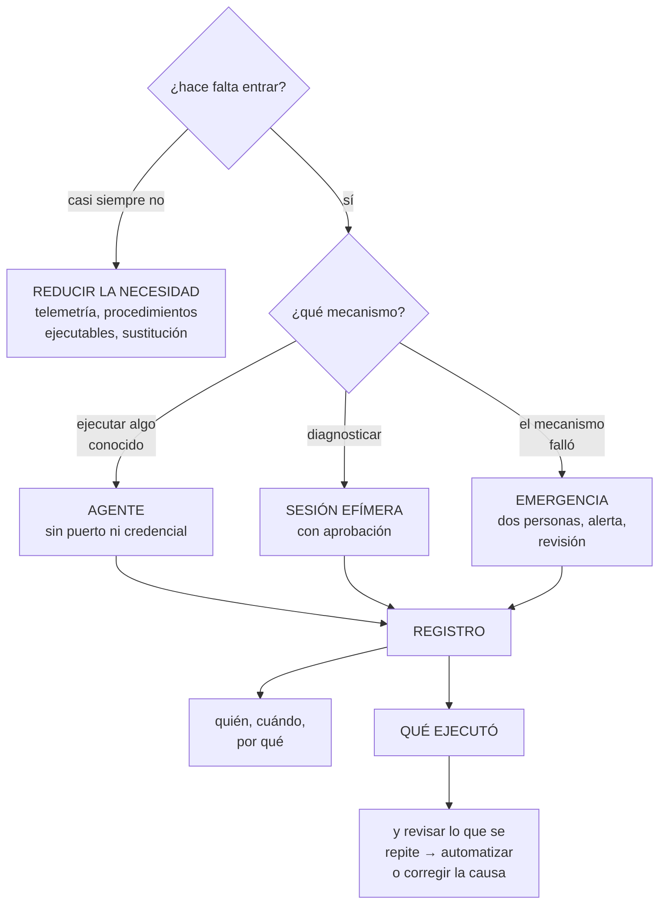

# 256 — Administración remota sin SSH permanente

> [← 255 · Backups, restore testing, vaults e inmutabilidad](../../part-21-cloud-operations-automation/255-backups-restore-testing-vaults-e-inmutabilidad/README.md) · [Índice de la parte](../README.md) · [257 · Alertas, on-call, escalamiento y comunicación →](../../part-21-cloud-operations-automation/257-alertas-on-call-escalamiento-y-comunicacion/README.md)

**Parte:** 21 — Operación cloud, automatización y respuesta a incidentes<br>
**Nivel:** avanzado · **Horas estimadas:** 4<br>
**Laboratorio:** `security` · **Estado:** `EXECUTABLE_CORE`

## 🎯 Propósito

Acceder a los sistemas para operarlos sin dejar puertas permanentes abiertas, que es el hueco que queda tras cerrar la red y montar la identidad. La clase explica por qué el acceso interactivo permanente es el patrón que hay que eliminar, cubre los mecanismos que lo sustituyen, y aborda lo que casi nadie resuelve: **qué se hace cuando el mecanismo de acceso es precisamente lo que ha fallado**.

## 📚 Resultados de aprendizaje

Al finalizar podrás:

1. **Eliminar** el acceso interactivo permanente y las claves asociadas.
2. **Elegir** el mecanismo de acceso adecuado a cada necesidad.
3. **Registrar** y auditar lo que se hace durante un acceso.
4. **Reducir** la necesidad de entrar, que es la mejor solución.
5. **Preparar** el acceso de emergencia y probarlo.

## 🧩 Conceptos centrales

| Concepto | Comprensión verificable |
|---|---|
| `acceso interactivo` | Sesión de línea de órdenes o de escritorio sobre un sistema. Lo que hay que hacer excepcional. |
| `agente de administración` | Componente del sistema que recibe órdenes de la plataforma, sin puerto abierto ni credencial. |
| `sesión efímera` | Acceso concedido por tiempo limitado, con justificación, aprobación y registro. |
| `anfitrión intermedio` | Punto único por el que pasa el acceso. Concentra el control y el registro, y es un punto único. |
| `grabación de sesión` | Registro de lo que se ejecuta durante un acceso. Necesario para auditar y para aprender. |
| `acceso de emergencia` | Vía alternativa cuando el mecanismo normal no funciona. Probada, vigilada y con dos personas. |

## 🧠 Modelo mental

Operar es controlar cambios bajo incertidumbre: inventario, señal, diagnóstico, acción reversible y aprendizaje deben formar un ciclo cerrado.

Aplicado a esta clase, separa siempre cuatro planos: **intención** (qué necesita el usuario),
**configuración** (qué declaramos), **estado observado** (qué existe de verdad) y
**evidencia** (cómo sabemos que cumple). Confundirlos produce diseños que se ven correctos
en un diagrama pero fallan al operar.

## 🗺️ Flujo de razonamiento



## 📖 Desarrollo

### 1. Eliminar el acceso permanente

El patrón que hay que eliminar es concreto: **un puerto de administración abierto y una credencial que vale siempre**.

```text
POR QUÉ ES UN PROBLEMA
  el puerto es un punto de entrada permanente
  la credencial no caduca y se comparte
  el acceso no queda justificado
  y lo que se hace dentro no queda registrado

→ y en la clase 226, el primer camino de ataque empezaba
  exactamente ahí: una máquina con el puerto de
  administración abierto
```

**Los mecanismos que lo sustituyen**, por orden de preferencia:

```text
1  NO ENTRAR                                ← lo mejor
   la telemetría contesta la pregunta       clase 238
   el procedimiento se ejecuta desde la plataforma
                                                clase 259
   y el sistema se sustituye en vez de arreglarse
                                                clase 254

2  AGENTE DE ADMINISTRACIÓN
   el sistema tiene un agente que recibe órdenes de la
   plataforma
   + sin puerto abierto: la conexión la inicia el agente
   + sin credencial en el sistema: usa su identidad
   + con permisos por documento y con registro
   → y es lo que sustituye al 90 % de los accesos

3  SESIÓN EFÍMERA POR LA PLATAFORMA
   se abre una sesión interactiva a través del agente
   + sin puerto, con identidad de la nube y con registro
   + y con permiso concedido por tiempo limitado
                                                clase 218

4  ANFITRIÓN INTERMEDIO
   un punto por el que pasa todo el acceso
   − es un punto único, y hay que operarlo y protegerlo
   → sigue haciendo falta para sistemas que no admiten
     agente

5  ACCESO DIRECTO CON CLAVE
   → último recurso, con excepción registrada  ley 25
```

Y lo que hay que hacer con las claves de acceso:

```text
las claves de sesión interactiva son credenciales de larga
duración
  → se comparten, se copian y no caducan
  → y su rotación es un procedimiento que nadie hace
                                                    ley 22

→ se eliminan, y el acceso pasa por identidad de la
  plataforma                              clases 206, 230
→ y las que queden, con certificado de corta duración
  emitido al pedir el acceso
```

Y la política que lo impone:

```text
prohibir direcciones públicas en máquinas   clase 229
prohibir puertos de administración abiertos
  → y comprobarlo con una prueba negativa       ley 22
y obligar a que el agente esté instalado en la imagen base
                                                clase 254
```

### 2. Reducir la necesidad de entrar

La mejor solución al acceso no es controlarlo mejor: es no necesitarlo.

```text
POR QUÉ SE ENTRA, en la práctica
  para MIRAR algo que no está en la telemetría
  para ejecutar un comando conocido
  para arreglar algo a mano
  y para investigar algo que no se entiende

→ y cada motivo tiene su solución
```

Y las soluciones, por motivo:

```text
PARA MIRAR
  → lo que se mira repetidamente se convierte en una
    señal o en una consulta guardada       clases 238, 250
  → y si hace falta entrar para saber si algo funciona, la
    observabilidad tiene un hueco             clase 211

PARA EJECUTAR UN COMANDO CONOCIDO
  → procedimiento ejecutable desde la plataforma
                                                clase 259
  → con parámetros validados y registro
  → y sin que nadie escriba comandos a mano

PARA ARREGLAR A MANO
  → casi siempre, lo correcto es sustituir  clase 254
  → y si el arreglo a mano se repite, es una causa que
    corregir, no una tarea que agilizar        clase 262

PARA INVESTIGAR
  → es el único motivo legítimo de una sesión interactiva
  → y aun así, con captura de lo que se ejecuta
```

Y la medida que dice si se está consiguiendo:

```text
NÚMERO DE SESIONES INTERACTIVAS AL MES
  → y su tendencia
  → si no baja, no se está reduciendo la necesidad

y la segunda
  qué se ejecuta en esas sesiones
  → y lo que se repite es lo que hay que automatizar o
    corregir                                clase 259, 263
```

Y una advertencia:

```text
SI ENTRAR ES MÁS DIFÍCIL QUE ÚTIL, SE BUSCARÁ OTRA VÍA
  una credencial guardada «por si acaso»
  un túnel abierto de forma permanente
  o una máquina de salto que nadie inventarió
                                          ley 16, clase 253
→ y por eso el acceso legítimo tiene que ser rápido
  → segundos cuando no requiere aprobación
```

### 3. Registrar y auditar

Un acceso sin registro deja al sistema sin respuesta ante la pregunta más simple: qué se hizo.

```text
LO QUE HAY QUE REGISTRAR
  quién                    ← la persona, no la cuenta de
                             servicio        clase 230
  cuándo, y cuánto duró
  a qué sistema
  por qué: la justificación escrita
  quién lo aprobó, si hubo aprobación
  y QUÉ SE EJECUTÓ

→ y el último es el que casi nunca está
```

**La grabación de sesión**, con lo que aporta y lo que cuesta:

```text
QUÉ APORTA
  saber qué se hizo, no solo que se entró
  investigar un incidente causado por un acceso
  y detectar lo repetitivo               clase 262

QUÉ CUESTA
  las sesiones contienen datos sensibles: consultas con
  datos personales, secretos escritos por error
  → se tratan como dato sensible: cifrado, acceso
    restringido, retención acotada       clases 238, 251
  y hay que decir a la gente que se graba

→ y grabar sin decirlo es un problema distinto
```

Y el destino, con la lección de la clase 238:

```text
los registros de acceso van a un destino que el sistema
accedido NO puede modificar
  → en otra cuenta, con otras credenciales    clase 141
→ si no, quien entra puede borrar su rastro
```

**Las alertas** que corresponden:

```text
uso del acceso de emergencia          → inmediata
acceso fuera de horario habitual
acceso a un sistema crítico
sesión de duración anómala
acceso desde una ubicación inhabitual
y comandos de una lista sensible ejecutados en sesión
  → borrados masivos, cambios de permisos, desactivación
    de registros                            clase 226
```

Y la revisión, que es lo que convierte el registro en mejora:

```text
MENSUAL
  ¿cuántas sesiones hubo y por qué?
  ¿qué se ejecutó, y qué se repite?
  → y lo que se repite pasa a ser un procedimiento
    ejecutable                              clase 259
  ¿alguien accede a sistemas que ya no le corresponden?
  → y eso se cruza con la revisión de accesos clase 230
```

Y una comprobación que da información inesperada:

```text
¿A QUÉ SISTEMAS NO HA ENTRADO NADIE EN 6 MESES?
  → o están perfectamente automatizados
  → o nadie los necesita y son candidatos a retirar
                                          clases 253, 254
```

### 4. Cuando el mecanismo es lo que falla

Es el escenario que casi nadie prepara: **el acceso normal no funciona precisamente cuando hace falta**.

```text
CUÁNDO OCURRE
  el proveedor de identidad no responde   clase 218
  el agente de administración no arranca
  la red que da acceso está caída          clase 219
  la política condicional bloquea a todos  clase 218
  o el propio sistema de acceso está en la región perdida
                                                clase 215

→ y en todos esos casos, el incidente que hay que arreglar
  incluye no poder entrar a arreglarlo
```

**El acceso de emergencia**, con lo que lo hace real:

```text
DOS VÍAS, no una
  porque una puede estar afectada por el mismo fallo

CON CREDENCIALES GUARDADAS FÍSICAMENTE
  largas, en un sitio con acceso controlado
  y con dos personas necesarias para usarlas, si el sistema
  es crítico

EXCLUIDAS de las políticas condicionales   clase 218
  → y esa exclusión, COMPROBADA

CON ALERTA INMEDIATA en cada uso
  → a varias personas, por varios canales

Y CON REVISIÓN POSTERIOR OBLIGATORIA
  qué se hizo, por qué hizo falta y qué se cambia para que
  no vuelva a hacer falta
```

Y la prueba, que es lo que este programa ha visto fallar:

```text
USAR EL ACCESO DE EMERGENCIA, CADA TRIMESTRE
  y cronometrar

  en la clase 179, estaba creado, documentado y NO
  funcionaba
  en la clase 218, la política condicional lo había
  incluido sin querer
  en la clase 230, había perdido un permiso al reorganizar
  la jerarquía                                    ley 27

→ tres veces, en tres nubes distintas
→ y las tres se descubrieron probándolo         ley 22
```

Y lo que hay que tener escrito antes:

```text
quién puede usarlo y en qué circunstancias
dónde están las credenciales y quién las custodia
qué hacer si la persona que las custodia no está
cómo se avisa
y qué se hace después: rotar las credenciales usadas
```

Y una decisión de diseño que reduce la necesidad:

```text
QUE EL SISTEMA DE ACCESO NO DEPENDA DE LO QUE PUEDE FALLAR
  no alojarlo en la misma región que protege
  no depender del mismo proveedor de identidad para la
    emergencia
  y no depender de la red que puede estar caída

→ y esto es la aritmética de dependencias de la clase 185,
  aplicada al propio acceso
```

Y la lista de comprobación de la clase:

```text
☐ no hay puertos de administración abiertos, comprobado
☐ no hay direcciones públicas en máquinas sin justificar
☐ no hay claves de sesión de larga duración
☐ el agente de administración está en la imagen base
☐ el acceso interactivo requiere permiso temporal
☐ hay anfitrión intermedio solo donde el agente no llega
☐ el acceso legítimo tarda segundos cuando no requiere
  aprobación
☐ se registra quién, cuándo, por qué y QUÉ EJECUTÓ
☐ el registro va a un destino que el sistema no puede
  tocar
☐ las grabaciones se tratan como dato sensible y se avisa
☐ hay alerta de emergencia, horario anómalo y comandos
  sensibles
☐ se revisa mensualmente qué se ejecuta y qué se repite
☐ hay dos vías de acceso de emergencia
☐ están excluidas de las políticas, comprobado
☐ se prueban cada trimestre y se cronometran
☐ el sistema de acceso no depende de lo que puede fallar
☐ se mide el número de sesiones interactivas y su
  tendencia
```

Y el cierre que enlaza con la clase siguiente: con el acceso resuelto, queda quién se entera cuando algo va mal y qué hace. Alertas, guardia, escalado y comunicación es la materia de la clase 257.

## 🔬 Ejemplo trabajado

**CloudShop elimina el acceso permanente a sus sistemas. Lo que sigue son los 118 puertos abiertos que nadie había inventariado, la revisión mensual que convirtió 41 sesiones en 3, y el acceso de emergencia que no funcionó por tercera vez.**

**El punto de partida:**

```text
máquinas con puerto de administración accesible      118
  desde internet                                       14  ←
  desde la red corporativa                            104

claves de sesión interactiva                          210
  compartidas entre varias personas                    88
  con más de 2 años                                   140
  cuya persona ya no está en la empresa                31  ←

sesiones interactivas al mes                          410
registradas                                             0
con justificación                                       0
```

Y las 14 desde internet:

```text
  9  máquinas de salto de distintos equipos
     → cada equipo montó la suya                clase 253
  3  servidores heredados que «necesitaban acceso directo»
  1  una instancia de pruebas de 2023             ley 25
  1  la que aparecía como primer paso del camino de ataque
     de la clase 226
```

**La migración, en cuatro fases.**

```text
FASE 1 · el agente en la imagen base
  el agente de administración pasa a la imagen base
                                                clase 254
  → y con la renovación programada, en 4 semanas estaba en
    el 96 % de las máquinas
  → el 4 % restante: 11 máquinas que no se reconstruyen
    → agente instalado a mano, con su fecha de revisión

FASE 2 · el acceso por la plataforma
  sesiones a través del agente, con identidad de la nube
  permiso concedido por elevación temporal   clase 218
    sin aprobación: activación en 15 segundos
    a sistemas críticos: aprobación de 2, en minutos
  y registro de la sesión completa

FASE 3 · cerrar los puertos
  se midió primero: qué puertos recibían conexiones y de
  dónde
    conexiones en 30 días                          1.940
    desde las nuevas sesiones                      1.610
    desde direcciones conocidas de personas          280
    DESDE DIRECCIONES DESCONOCIDAS                    50  ←
      → 41 de un proveedor de monitorización que nadie
        recordaba                                ley 20
      →  9 de un rastreador automatizado externo

  y entonces se cerraron
    puertos abiertos                          118 → 0
    y las 3 máquinas heredadas, tras un anfitrión
    intermedio con registro

FASE 4 · eliminar las claves
  210 → 6
    los 6, de sistemas que no admiten otra cosa
    con certificado de corta duración, emitido al pedir
    acceso
    y excepción registrada con fecha            ley 25

  y las 31 de personas que ya no estaban: revocadas
```

Y la prueba negativa:

```text
✓  conectar al puerto de administración desde internet
                                                denegado
✓  conectar desde la red corporativa            denegado
✓  usar una clave revocada                      denegado
✓  abrir sesión sin permiso temporal            denegado
✓  abrir sesión a un sistema crítico sin aprobación
                                                denegado
```

**La revisión mensual, y lo que cambió.**

```text
mes 1, tras montar el registro
  sesiones                                          341
  y lo que se ejecutaba, agrupado

    reiniciar un servicio                          88
    mirar registros de una aplicación              71
    consultar el espacio en disco                  54
    limpiar ficheros temporales                    41
    reprocesar mensajes fallidos                   29
                                                clase 210
    ampliar una cuota                              22
    investigar algo no rutinario                   19
    y otros                                        17

→ 19 de 341 eran investigación
→ el resto era trabajo repetitivo         clase 262
```

Y lo que se hizo con cada grupo:

```text
MIRAR REGISTROS (71)
  → los registros ya estaban centralizados; la gente
    entraba por costumbre                     clase 238
  → formación y consultas guardadas: 71 → 4

CONSULTAR ESPACIO EN DISCO (54)
  → no había señal de disco en el panel        clase 211
  → añadida, con alerta: 54 → 0

LIMPIAR TEMPORALES (41)
  → la causa era una rotación de registros mal configurada
  → CORREGIDA LA CAUSA: 41 → 0

REINICIAR UN SERVICIO (88)
  → procedimiento ejecutable desde la plataforma
                                                clase 259
  → y al analizarlo: 61 de los 88 eran el mismo servicio
    con una fuga de memoria
  → corregida la fuga: 88 → 6

REPROCESAR MENSAJES (29)
  → procedimiento ejecutable, con límite de ritmo
                                                clase 210
  → 29 → 0 sesiones (se ejecuta desde la plataforma)

AMPLIAR CUOTA (22)
  → petición automatizada                    clase 262
  → 22 → 0

INVESTIGACIÓN (19)
  → se mantienen: es el motivo legítimo
```

Y el resultado:

```text                                        mes 1     mes 6
sesiones interactivas                         341          14
  de investigación                             19          11
  de trabajo repetitivo                       322           3
```

Y la observación del equipo:

```text
de las 322 sesiones repetitivas
  se automatizaron                                117
  se ELIMINARON corrigiendo la causa              163
  quedaron                                          3

→ más de la mitad no hacía falta automatizarlas: hacía
  falta arreglar lo que las provocaba
→ y el instinto del equipo había sido automatizarlas todas
                                                clase 262
```

**El acceso de emergencia, que falló otra vez.**

```text
prueba trimestral, primera ejecución tras la migración

  09:00  se simula que el proveedor de identidad no
         responde
  09:02  se recuperan las credenciales de emergencia del
         sobre físico                              ✓
  09:05  se intenta entrar
         → la cuenta existía y estaba excluida de las
           políticas condicionales                 ✓
         → pero el permiso para abrir sesión por el agente
           dependía de un grupo del directorio
         → y el directorio era lo que no respondía

  → la vía de emergencia dependía de lo que había fallado
                                                clase 185

  09:20  se usa la segunda vía: el anfitrión intermedio con
         clave local
         → funcionó                                ✓
         → tiempo total                          20 min

correcciones
  la primera vía se rehace con permisos locales, no
  dependientes del directorio
  y la segunda se mantiene, con su clave rotada tras cada
  uso

y la observación
  es la TERCERA vez que el acceso de emergencia falla en
  este programa: clases 179, 218 y ahora
  → y las tres se descubrieron probándolo         ley 22
  → nunca por un incidente real, afortunadamente
```

**El registro y su tratamiento:**

```text
cada sesión graba
  quién, cuándo, cuánto, a qué, por qué y qué ejecutó

y la grabación
  cifrada, en la cuenta de seguridad          clase 238
  producción no puede leerla ni borrarla
  retención de 180 días
  acceso restringido a 3 personas, auditado
  y avisado a todo el equipo, por escrito

en los 6 meses siguientes
  consultas a las grabaciones                        14
    en investigación de incidentes                   11
    en auditoría                                      2
    y 1 por una reclamación de un cliente
      → «¿quién modificó este pedido a mano?»
      → contestado en 4 minutos
```

**El resultado, al año:**

```text                                        antes     después
puertos de administración abiertos            118           0
  desde internet                               14           0
claves de sesión de larga duración            210           6
  de personas que ya no están                  31           0
sesiones interactivas al mes                  410          14
  registradas                                   0        100 %
  con justificación                             0        100 %
sesiones de trabajo repetitivo                322           3
conexiones desde direcciones desconocidas      50           0
tiempo para conceder acceso legítimo      variable       15 s
acceso de emergencia probado                   no    trimestral
  vías independientes                            1           2
```

**La lección que esta clase deja**: cerrar ciento dieciocho puertos fue lo fácil; lo que redujo el riesgo de verdad fue **pasar de trescientas cuarenta y una sesiones al mes a catorce**, y de esas trescientas veintidós que sobraban, **más de la mitad se eliminaron corrigiendo la causa, no automatizándolas**. Y el acceso de emergencia falló por tercera vez en este programa, otra vez por una dependencia no contada: **dependía del directorio, que era justamente lo que había fallado**.

## 🧪 Laboratorio guiado

Ejecuta desde la raíz:

```bash
python classes/part-21-cloud-operations-automation/256-administracion-remota-sin-ssh-permanente/lab.py
```

El laboratorio selecciona el motor de práctica **`security`** y produce
`lab_result.json`. El escenario, sus comprobaciones y el artefacto esperado corresponden a
esta clase; no requiere credenciales y deja explícito qué debe revalidarse en un sandbox real.

1. Lee `exercise.steps` y formula una predicción antes de ejecutar.
2. Ejecuta la práctica y verifica todos los elementos de `checks`.
3. Provoca el caso de `negative_test` y explica la señal observada.
4. Materializa `secure-operations` en `evidence/` usando la plantilla indicada.
5. Para proveedor real, sigue `sandbox.requires`, registra costo y ejecuta `destroy`.

### Evidencia esperada

El artefacto principal es un control con amenaza, mitigación y evidencia. Además, la entrega debe incluir el comando ejecutado,
la salida estructurada y una conclusión que no exceda lo observado.

## 🏆 Reto verificable

Construye **`secure-operations`** para el caso CloudShop. Incluye una alternativa descartada,
un supuesto que pueda falsarse, una prueba de fallo y una decisión de rollback.

## ✅ Criterio de aceptación

- [ ] `lab.py` termina con código 0 y genera JSON válido.
- [ ] La entrega conecta al menos tres requisitos con mecanismos verificables.
- [ ] Existe una prueba positiva y una prueba negativa con evidencia.
- [ ] Seguridad, costo y operación aparecen como decisiones, no como anexos.
- [ ] Se declara una limitación y una condición que obligaría a revisar el diseño.
- [ ] Otra persona puede repetir el recorrido sin conocimiento tácito.

## ⚠️ Errores frecuentes

| Síntoma | Causa probable | Corrección |
|---|---|---|
| Hay puertos de administración abiertos que nadie recuerda | Cada equipo montó su propia máquina de salto y nadie las inventarió | Inventaría, mide qué conexiones reciben y de dónde, y sustituye por agente con sesiones efímeras antes de cerrar. |
| Quedan claves de acceso de personas que ya no están | Son credenciales de larga duración compartidas y sin rotación | Elimina las claves, usa identidad de la plataforma y, donde no se pueda, certificados de corta duración emitidos al pedir acceso. |
| El equipo busca vías alternativas para entrar | El acceso legítimo tarda o requiere aprobación siempre | Activación en segundos cuando no requiere aprobación, y aprobadores con turnos cuando sí. |
| No se sabe qué se hizo durante un acceso | Se registra que se entró, no lo que se ejecutó | Graba la sesión, guárdala fuera del alcance del sistema accedido y trátala como dato sensible, avisando al equipo. |
| Se automatizan tareas que no deberían existir | Se agiliza el síntoma en vez de corregir la causa | Revisa mensualmente qué se ejecuta y qué se repite; corrige la causa antes de automatizar. |
| El acceso de emergencia no funciona cuando hace falta | Depende del mismo componente que ha fallado | Dos vías independientes, excluidas de las políticas, con permisos locales, probadas y cronometradas cada trimestre. |

## 🛡️ Seguridad, ética y costo

Trabaja con cuentas propias o sandboxes autorizados. No publiques secretos, identificadores
reales ni datos personales. Antes de crear recursos pagos define presupuesto, etiquetas y
comando de destrucción; después verifica que no queden recursos huérfanos. Los ejemplos
locales enseñan contratos, pero no certifican cumplimiento ni disponibilidad de producción.

## ❓ Preguntas de comprobación

1. ¿Cuál es el patrón de acceso que hay que eliminar y por qué?
2. ¿Cuáles son los cinco mecanismos, por orden de preferencia?
3. ¿Qué se hace con cada uno de los cuatro motivos por los que se entra?
4. ¿Qué hay que registrar además de quién entró y dónde debe guardarse?
5. ¿Qué hace real un acceso de emergencia y con qué frecuencia se prueba?

## 🔗 Referencias

- AWS (2025). *Systems Manager Session Manager*. <https://docs.aws.amazon.com/systems-manager/latest/userguide/session-manager.html>
- Microsoft (2025). *Azure Bastion and just-in-time VM access*. <https://learn.microsoft.com/en-us/azure/bastion/bastion-overview>
- Google Cloud (2025). *Identity-Aware Proxy for TCP forwarding*. <https://cloud.google.com/iap/docs/using-tcp-forwarding>
- NIST SP 800-207 (2020). *Zero Trust Architecture*. <https://csrc.nist.gov/pubs/sp/800/207/final>
- Beyer, B. y otros (2018). *The Site Reliability Workbook*, cap. sobre eliminación de trabajo repetitivo. <https://sre.google/workbook/eliminating-toil/>
- Documentación oficial vigente del servicio implementado; registra URL y fecha de consulta.

---

> [Evaluación](assessment.md) · [Contrato de clase](lesson.yaml) · [Índice de la parte](../README.md)

| Anterior | Índice | Siguiente |
|---|---|---|
| [← 255 · Backups, restore testing, vaults e inmutabilidad](../../part-21-cloud-operations-automation/255-backups-restore-testing-vaults-e-inmutabilidad/README.md) | [Parte 21](../README.md) · [Programa](../../README.md) | [257 · Alertas, on-call, escalamiento y comunicación →](../../part-21-cloud-operations-automation/257-alertas-on-call-escalamiento-y-comunicacion/README.md) |
