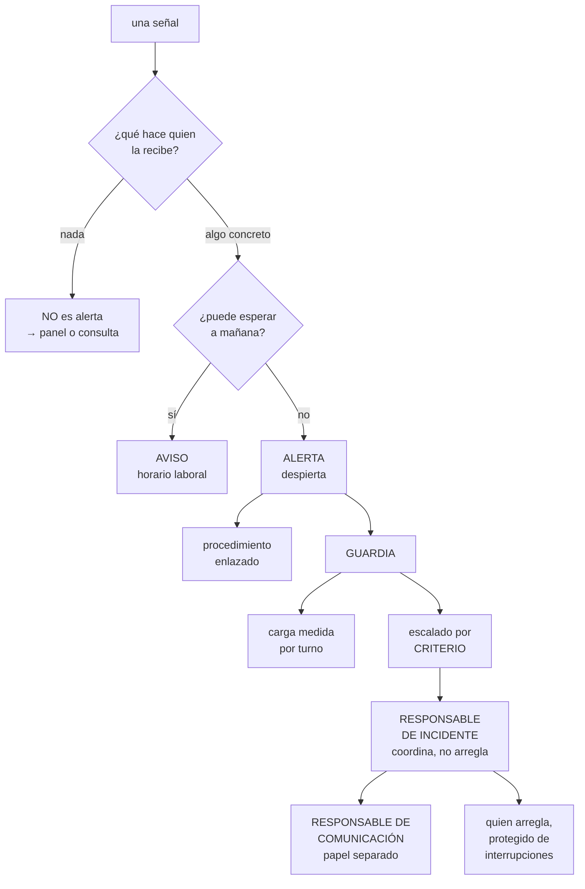

# 257 — Alertas, on-call, escalamiento y comunicación

> [← 256 · Administración remota sin SSH permanente](../../part-21-cloud-operations-automation/256-administracion-remota-sin-ssh-permanente/README.md) · [Índice de la parte](../README.md) · [258 · Triage de red, cómputo, datos y dependencias →](../../part-21-cloud-operations-automation/258-triage-de-red-computo-datos-y-dependencias/README.md)

**Parte:** 21 — Operación cloud, automatización y respuesta a incidentes<br>
**Nivel:** avanzado · **Horas estimadas:** 4<br>
**Laboratorio:** `incident` · **Estado:** `EXECUTABLE_CORE`

## 🎯 Propósito

Organizar quién se entera cuando algo va mal, qué hace y a quién avisa. La clase aborda las alertas desde la única pregunta que las justifica —**¿qué hace quien la recibe?**—, monta la guardia de forma sostenible, fija el escalado y desarrolla la parte que este programa ha visto dominar el tiempo de los incidentes: **comunicar, que es trabajo y hay que repartirlo**.

## 📚 Resultados de aprendizaje

Al finalizar podrás:

1. **Diseñar** alertas accionables y retirar las que no lo son.
2. **Montar** una guardia sostenible, con carga medida.
3. **Escalar** con criterios claros y sin depender de que alguien esté.
4. **Comunicar** durante un incidente, con papeles repartidos.
5. **Medir** la salud de la guardia y actuar sobre ella.

## 🧩 Conceptos centrales

| Concepto | Comprensión verificable |
|---|---|
| `alerta accionable` | La que exige una acción concreta de quien la recibe. Si no la exige, no es una alerta. |
| `carga de guardia` | Interrupciones por turno, dentro y fuera de horario. Determina si la guardia es sostenible. |
| `escalado` | Paso del incidente a alguien con más contexto o más autoridad, por criterio y no por desesperación. |
| `responsable de incidente` | Quien coordina. No arregla: decide, reparte y protege al que arregla. |
| `responsable de comunicación` | Quien informa a los afectados y a la organización. Papel separado, porque es trabajo a tiempo completo. |
| `fatiga de alertas` | Estado en que las alertas dejan de producir acción porque hay demasiadas. |

## 🧠 Modelo mental

Operar es controlar cambios bajo incertidumbre: inventario, señal, diagnóstico, acción reversible y aprendizaje deben formar un ciclo cerrado.

Aplicado a esta clase, separa siempre cuatro planos: **intención** (qué necesita el usuario),
**configuración** (qué declaramos), **estado observado** (qué existe de verdad) y
**evidencia** (cómo sabemos que cumple). Confundirlos produce diseños que se ven correctos
en un diagrama pero fallan al operar.

## 🗺️ Flujo de razonamiento



## 📖 Desarrollo

### 1. La única pregunta que justifica una alerta

Toda la disciplina de alertas cabe en una pregunta, y casi ninguna organización la hace.

```text
¿QUÉ HACE QUIEN LA RECIBE?

  si la respuesta es «mirar y ver que no pasa nada»
    → no es una alerta: es ruido
  si es «esperar a ver si se arregla sola»
    → no es una alerta
  si es «avisar a otro»
    → la alerta debe ir a ese otro
  si es «ejecutar este procedimiento»
    → es una alerta, y el procedimiento va enlazado
  y si es «investigar porque los usuarios están sufriendo»
    → es una alerta
```

Y la segunda pregunta, que decide si despierta:

```text
¿PUEDE ESPERAR A MAÑANA?
  sí  → aviso, en horario laboral
  no  → alerta, y despierta

→ y la mayoría de lo que hoy despierta puede esperar
→ despertar a alguien tiene un coste real: al día
  siguiente rinde menos y el turno siguiente empieza peor
```

**Sobre qué se alerta**, con la regla de las clases 123 y 211:

```text
SE ALERTA SOBRE SÍNTOMAS DE USUARIO
  el objetivo de nivel de servicio consume presupuesto
  demasiado rápido                          clase 238
  el flujo crítico no funciona
  el retraso de proceso supera lo acordado

Y SOBRE AUSENCIA Y ANTIGÜEDAD
  lo que dejó de ocurrir                        ley 13
  lo que lleva demasiado tiempo sin actualizarse

NO SE ALERTA SOBRE
  causas intermedias: CPU, memoria, disco
    → salvo que la acción sea inmediata y concreta
  errores sueltos
  y cosas que se recuperan solas
```

Y el error que produce la fatiga:

```text
SE ALERTA SOBRE CUANTO SE PUEDE MEDIR
  porque medir es fácil y decidir es difícil
  → cientos de alertas
  → y entonces se ignoran, incluidas las que importan
                                                clase 125

→ y el síntoma es una cifra: la proporción de alertas que
  resultan ser algo
  → por debajo del 50 %, el sistema ya no funciona
```

Y la limpieza, que hay que hacer periódicamente:

```text
cada alerta, una vez al trimestre
  ¿se ha disparado?
    no, en un año  → o sobra o su umbral está mal
  ¿fue accionable?
  ¿tiene procedimiento enlazado?
  ¿llegó a alguien que hizo algo?

→ y en las clases 211, 225 y 238, más de la mitad se
  retiraron sin perder nada
```

### 2. La guardia, sostenible

Una guardia insostenible se degrada sola: la gente se va, y quien queda hace peor su trabajo.

```text
LO QUE HACE FALTA MEDIR
  interrupciones por turno, dentro y fuera de horario
  cuántas despiertan
  duración de cada intervención
  y cuántos turnos seguidos hace cada persona

→ y un umbral que este programa sostiene
  más de 2 interrupciones por turno fuera de horario
  significa que hay un problema, no que hace falta más
  gente                                     clase 125
```

**El tamaño del turno**, con la aritmética:

```text
una rotación necesita al menos 6 personas para que nadie
esté de guardia más de una semana de cada seis
  → con 4, cada dos semanas de cada cuatro: se quema
  → con menos, no es una guardia: es que hay una persona
    disponible siempre                            ley 20

y si el equipo no llega
  se comparte la guardia con otro equipo
  o se reduce la superficie: menos servicios, menos alertas
                                                clase 253
  → y no se finge que hay guardia
```

Y las condiciones que la hacen sostenible:

```text
COMPENSACIÓN, en tiempo o en dinero, acordada
DERECHO A DESCONECTAR tras una noche mala
SIN OTRAS TAREAS durante el turno
  → estar de guardia y tener entregas es tener dos trabajos
Y UN LÍMITE: si el turno se pasa arreglando cosas, el
  trabajo siguiente es reducir las alertas, no aguantar
```

**Lo que hay que tener antes de que empiece un turno:**

```text
el procedimiento de cada alerta, enlazado    clase 125
los accesos concedidos y PROBADOS         clase 256
  → y no descubrir a las 3 que no se puede entrar
el camino esperado de los flujos             clase 194
las consultas de diagnóstico guardadas       clase 238
la lista de a quién escalar y cómo
y el traspaso del turno anterior
```

Y el traspaso, que es barato y se olvida:

```text
al terminar el turno, un resumen escrito
  qué pasó
  qué quedó a medias
  qué está degradado
  y qué esperar

→ sin él, quien entra empieza a ciegas
→ y los problemas que se arrastran no se ven
```

Y una práctica que reduce mucho la carga:

```text
EL TURNO REVISA SUS PROPIAS ALERTAS
  al terminar, quien estuvo de guardia dice qué alertas
  fueron ruido
  → y esas se corrigen o se retiran esa semana
  → y quien sufre el ruido es quien decide sobre él
                                                clase 172
```

### 3. Escalar y coordinar

**El escalado** falla cuando depende de que alguien esté disponible y de que a quien está se le ocurra.

```text
ESCALAR POR CRITERIO, no por desesperación
  «si en 15 minutos no hay hipótesis, se escala»
  «si afecta a más de N usuarios, se escala»
  «si toca datos o dinero, se escala inmediatamente»
  «si hay que decidir algo que no me corresponde, se
   escala»

→ y el criterio se escribe antes
→ así escalar no es admitir una derrota: es seguir el
  procedimiento
```

Y la cadena, con lo que debe garantizar:

```text
nivel 1   quien está de guardia
nivel 2   quien conoce ese servicio
nivel 3   quien puede decidir sobre el negocio

y cada nivel
  con más de una persona
  con un canal que funcione aunque el sistema esté caído
  y con un plazo: si no responde en N minutos, se pasa al
    siguiente automáticamente

→ y ese plazo automático es lo que evita el «llamé y no
  contestó»
```

**Los papeles durante un incidente**, que es lo que más ordena:

```text
RESPONSABLE DE INCIDENTE
  coordina; NO arregla
  decide qué se prueba y qué no
  reparte el trabajo
  y protege a quien arregla de las interrupciones
  → y este papel es el que más se salta, porque parece que
    no hace nada

QUIEN ARREGLA
  una o dos personas, sin interrupciones
  → y si son cinco, se estorban

RESPONSABLE DE COMUNICACIÓN
  informa a los afectados y a la organización
  → papel SEPARADO, porque comunicar es trabajo a tiempo
    completo
  → y si lo hace quien arregla, deja de arreglar

Y QUIEN TOMA NOTAS
  la línea de tiempo, mientras ocurre
  → reconstruirla después cuesta el triple  clase 127
```

Y la regla que se aprende cara:

```text
EN UN INCIDENTE GRANDE, EL RESPONSABLE NO TOCA EL TECLADO
  en cuanto empieza a arreglar, deja de coordinar
  → y nadie coordina

→ y en incidentes pequeños, una persona hace los tres
  papeles; el criterio para separarlos es el tamaño
```

Y el canal, con su requisito:

```text
un canal por incidente, no una conversación general
  → todo el mundo ve lo mismo y queda registrado
  y un canal ALTERNATIVO que no dependa del sistema
    afectado
  → si el incidente afecta a la identidad, la herramienta
    de mensajería puede no funcionar         clase 218
  → y eso hay que haberlo probado                ley 22
```

### 4. Comunicar

Este programa ha medido varias veces que **decidir y comunicar dominan el tiempo total** de un incidente. Comunicar es trabajo.

```text
A QUIÉN HAY QUE INFORMAR
  los usuarios afectados
  atención al cliente, que recibe las llamadas
  el negocio, que tiene que decidir cosas
  los socios, si les afecta
  y la organización, para que no pregunten uno a uno

→ y cada uno necesita algo distinto
```

Y lo que cada uno necesita:

```text
USUARIOS
  qué no funciona, en sus términos
  qué pueden hacer mientras tanto
  y cuándo habrá noticias
  → NO les interesa la causa técnica

ATENCIÓN AL CLIENTE
  lo anterior, más qué responder a las preguntas concretas
  → y lo antes posible, porque están recibiendo llamadas
    ya

NEGOCIO
  el impacto: cuántos, cuánto, desde cuándo
  y qué decisiones hay que tomar

LA ORGANIZACIÓN
  que hay un incidente, quién lo lleva y dónde mirar
  → y así dejan de preguntar en canales aleatorios
```

**El ritmo**, que es lo que más tranquiliza:

```text
la primera comunicación, en los primeros minutos
  aunque no se sepa nada: «lo sabemos, estamos en ello»
actualizaciones a intervalo FIJO y anunciado
  «volveremos a informar en 30 minutos»
  → y se cumple, aunque no haya novedades
  → «sin novedades» es información

→ y lo que genera desconfianza no es el incidente: es el
  silencio
```

Y lo que no hay que hacer:

```text
prometer un plazo de resolución que no se sabe
  → «estará en 20 minutos» y a las dos horas sigue
  → mejor: «la siguiente actualización en 30 minutos»
minimizar el impacto
y explicar la causa técnica antes de estar seguro
  → y luego corregirla, que es peor
```

Y las plantillas, que ahorran minutos que no se tienen:

```text
mensajes preparados para
  detección, actualización, mitigación y cierre
  por cada audiencia
→ y se rellenan, no se redactan
```

**Después del incidente**, con lo que enlaza con la clase 261:

```text
el cierre se comunica igual que el inicio
y la revisión se hace con la línea de tiempo tomada
durante                                       clase 127

y las preguntas de la revisión
  ¿cuánto tardamos en enterarnos?
  ¿cuánto en decidir?
  ¿cuánto en comunicar?
  y ¿qué señal habría avisado antes?
```

Y lo que hay que vigilar de la guardia:

```text
interrupciones por turno, y cuántas despiertan
proporción de alertas que resultan ser algo
tiempo hasta la primera acción
tiempo hasta la primera comunicación
escalados y si respetaron el criterio
y rotación: cuántas personas, y si alguien repite de más
```

Y la lista de comprobación de la clase:

```text
☐ cada alerta tiene respuesta a «¿qué hace quien la
  recibe?»
☐ lo que puede esperar es aviso, no alerta
☐ se alerta sobre síntomas, ausencia y antigüedad
☐ cada alerta tiene procedimiento enlazado
☐ se mide la proporción que resulta ser algo
☐ se revisan y retiran alertas cada trimestre
☐ la rotación tiene personas suficientes
☐ se mide la carga por turno
☐ quien está de guardia no tiene otras entregas
☐ los accesos están probados antes del turno
☐ hay traspaso escrito entre turnos
☐ el turno revisa y corrige sus propias alertas
☐ el escalado tiene criterio escrito y plazo automático
☐ hay papeles separados de coordinación, arreglo y
  comunicación
☐ hay canal alternativo probado
☐ hay plantillas por audiencia y ritmo fijo de
  actualización
```

Y el cierre que enlaza con la clase siguiente: con la guardia montada y la comunicación repartida, queda lo que hace quien arregla: diagnosticar. El método de triaje por capas es la materia de la clase 258.

## 🔬 Ejemplo trabajado

**CloudShop reorganiza su guardia. Lo que sigue son las 890 alertas mensuales de las que 8 % eran algo, la persona que hacía guardia una semana de cada dos, y el incidente en que comunicar consumió más tiempo que arreglar.**

**El punto de partida:**

```text
alertas configuradas                                412
disparadas al mes                                   890
que resultaron ser algo                          71 (8 %)

rotación de guardia
  personas                                            4
  → una semana de cada dos para cada una
interrupciones por turno
  media                                            27,4
  fuera de horario                                  9,1
  que despertaron                                   4,2

bajas y salidas del equipo en 12 meses                 2
  → las dos citaron la guardia en la entrevista de
    salida
```

**La limpieza de alertas.**

```text
las 412, revisadas con la pregunta «¿qué hace quien la
recibe?»

  nada, o mirar y comprobar que va bien             184
    → retiradas
  esperar a ver si se arregla sola                   61
    → retiradas; y 14 se convirtieron en aviso con umbral
      más alto
  avisar a otro equipo                               38
    → redirigidas a ese equipo
  ejecutar un procedimiento                          72
    → mantenidas, con procedimiento enlazado
  investigar porque hay impacto                      57
    → mantenidas

alertas tras la limpieza                            167
  de ellas, que despiertan                           41
  el resto, avisos en horario laboral                126
```

Y la segunda pasada, con la pregunta del horario:

```text
de las 41 que despertaban
  ¿puede esperar a mañana?
    sí                                               23
      → pasaron a aviso
    no                                               18

alertas que despiertan                          41 → 18
```

Y el resultado del primer mes:

```text                                        antes     después
alertas configuradas                          412         167
disparadas al mes                             890         104
que resultaron ser algo                    71 (8 %)   88 (85 %)
interrupciones por turno                     27,4         3,1
  fuera de horario                            9,1         1,2
  que despertaron                             4,2         0,4
```

Y la observación:

```text
las alertas que resultaron ser algo SUBIERON de 71 a 88
→ porque las 184 de ruido estaban tapando cosas reales
→ y el equipo había dejado de mirar               ley 15
```

**La rotación.**

```text
con 4 personas, una semana de cada dos
  → insostenible, y demostrado con las dos salidas

se plantearon tres opciones
  contratar                                  6 meses
  compartir con otro equipo                  posible
  reducir la superficie                      posible

lo que se hizo, las tres cosas
  1  compartir la guardia con el equipo de datos
     → de 4 a 9 personas: una semana de cada nueve
     → y con formación cruzada: 6 sesiones
  2  reducir la superficie
     → 22 servicios de los 61 se retiraron o pasaron a
       gestionados                    clases 253, 254
     → y las alertas de esos, con ellos
  3  y la contratación siguió su curso, sin urgencia

semanas de guardia por persona y año
  antes                                            26
  después                                         5,8
```

Y las condiciones que se acordaron:

```text
compensación en tiempo: un día por semana de guardia
derecho a desconectar la mañana siguiente a una noche con
  más de una interrupción
sin entregas comprometidas durante el turno
y la regla que más cambió las cosas
  «si un turno tiene más de 5 interrupciones fuera de
   horario, el trabajo de la semana siguiente es reducir
   alertas»
  → aplicada 3 veces en el primer trimestre, 0 en el
    segundo
```

**El traspaso, que no existía.**

```text
se añadió un resumen escrito al terminar el turno
  qué pasó
  qué quedó a medias
  qué está degradado
  y qué esperar

en los primeros 3 meses
  problemas que se arrastraban entre turnos y nadie veía
                                                      7
    · una réplica con retraso creciente desde hacía 9 días
    · un trabajo que fallaba cada noche y alguien
      relanzaba
    · y 5 más

→ y los 7 llevaban semanas: cada turno los arreglaba y no
  se los contaba al siguiente                     ley 15
```

**El incidente en que comunicar dominó.**

```text
incidente   el flujo de pago dejó de funcionar para el 40 %
            de los usuarios

  14:02  alerta de presupuesto de error         clase 238
  14:04  primera acción: se revisa el panel
  14:09  hipótesis: un despliegue de las 13:58
  14:12  reversión iniciada
  14:19  servicio restablecido

  → 17 minutos de detección a resolución

y lo que pasó en paralelo
  14:06  atención al cliente empieza a recibir llamadas
  14:11  el director de operaciones pregunta en un canal
  14:14  el equipo comercial pregunta en otro
  14:16  un socio escribe
  14:22  dirección pregunta por el impacto

  y quien estaba revirtiendo el despliegue contestaba a
  todos
  → la reversión se retrasó 6 minutos por eso

  y después
  14:19-15:40  reconstruir qué había pasado, calcular el
               impacto y contestar a cada uno
               → 1 h 21 de comunicación tras 17 minutos de
                 incidente

→ y ese reparto es el que este programa ha medido varias
  veces                                    clases 179, 215
```

Y lo que se montó después:

```text
PAPELES SEPARADOS, a partir de cierta gravedad
  responsable de incidente: coordina, no toca el teclado
  quien arregla: 1 o 2, sin interrupciones
  responsable de comunicación: informa a todos
  y quien toma notas

  → y para incidentes menores, una persona hace los cuatro

CANAL POR INCIDENTE
  se abre uno; todas las preguntas van ahí
  → y las preguntas en otros canales se redirigen

PLANTILLAS por audiencia
  usuarios, atención al cliente, negocio, socios y
  organización
  → 4 momentos cada una: detección, actualización,
    mitigación y cierre

RITMO FIJO
  primera comunicación en menos de 10 minutos
  actualizaciones cada 30, aunque no haya novedades

y la línea de tiempo, tomada DURANTE
```

Y el efecto, medido en los 9 incidentes siguientes:

```text                                        antes     después
tiempo hasta la primera comunicación         n/d       7 min
tiempo de quien arregla dedicado a
  comunicar                                  38 %         3 %
tiempo total de comunicación tras el
  incidente                                1 h 21      18 min
canales distintos con preguntas                 5           1
reconstrucción de la línea de tiempo       2-3 h        0
  (se toma durante)
```

**El canal alternativo, probado.**

```text
se simuló un incidente que afectaba al proveedor de
identidad
  → la herramienta de mensajería del equipo usa ese mismo
    proveedor                                clase 218
  → nadie podía entrar

  el canal alternativo: un grupo en un servicio de
  mensajería independiente, con los teléfonos
  → primera prueba: 4 de 9 personas no lo tenían
    instalado
  → corregido, y probado cada trimestre          ley 22
```

**El escalado, con criterio.**

```text
antes   se escalaba cuando quien estaba de guardia se
        rendía
        y llamaba a quien creía que sabía
        → y a veces no contestaba

después
  criterios escritos
    sin hipótesis en 15 min                → nivel 2
    afecta a más de 1.000 usuarios         → nivel 2 y
                                             comunicación
    toca datos o dinero                    → inmediato
    hay que decidir algo de negocio        → nivel 3
  cadena con 2 personas por nivel
  y plazo automático: sin respuesta en 5 min, siguiente

y en 6 meses
  escalados                                         14
  que respetaron el criterio                        14
  llamadas sin respuesta que bloquearon               0
```

**El resultado, al año:**

```text                                        antes     después
alertas configuradas                          412         151
disparadas al mes                             890          94
proporción accionable                         8 %        89 %
interrupciones por turno                     27,4         2,3
que despertaron                               4,2         0,3
semanas de guardia por persona y año           26         5,8
salidas del equipo citando la guardia            2           0
tiempo hasta la primera comunicación        n/d        7 min
problemas arrastrados entre turnos              7           0
```

**La lección que esta clase deja**: retirar ciento ochenta y cuatro alertas que no exigían ninguna acción hizo que **las que resultaban ser algo subieran de setenta y una a ochenta y ocho**: el ruido estaba tapando problemas reales. Y en el incidente que mejor se resolvió técnicamente —diecisiete minutos de detección a reversión—, **comunicar consumió una hora y veintiún minutos después**, y retrasó seis minutos la propia reversión porque quien arreglaba contestaba a cinco canales a la vez.

## 🧪 Laboratorio guiado

Ejecuta desde la raíz:

```bash
python classes/part-21-cloud-operations-automation/257-alertas-on-call-escalamiento-y-comunicacion/lab.py
```

El laboratorio selecciona el motor de práctica **`incident`** y produce
`lab_result.json`. El escenario, sus comprobaciones y el artefacto esperado corresponden a
esta clase; no requiere credenciales y deja explícito qué debe revalidarse en un sandbox real.

1. Lee `exercise.steps` y formula una predicción antes de ejecutar.
2. Ejecuta la práctica y verifica todos los elementos de `checks`.
3. Provoca el caso de `negative_test` y explica la señal observada.
4. Materializa `oncall-system` en `evidence/` usando la plantilla indicada.
5. Para proveedor real, sigue `sandbox.requires`, registra costo y ejecuta `destroy`.

### Evidencia esperada

El artefacto principal es una cronología, roles, comunicación y aprendizaje. Además, la entrega debe incluir el comando ejecutado,
la salida estructurada y una conclusión que no exceda lo observado.

## 🏆 Reto verificable

Construye **`oncall-system`** para el caso CloudShop. Incluye una alternativa descartada,
un supuesto que pueda falsarse, una prueba de fallo y una decisión de rollback.

## ✅ Criterio de aceptación

- [ ] `lab.py` termina con código 0 y genera JSON válido.
- [ ] La entrega conecta al menos tres requisitos con mecanismos verificables.
- [ ] Existe una prueba positiva y una prueba negativa con evidencia.
- [ ] Seguridad, costo y operación aparecen como decisiones, no como anexos.
- [ ] Se declara una limitación y una condición que obligaría a revisar el diseño.
- [ ] Otra persona puede repetir el recorrido sin conocimiento tácito.

## ⚠️ Errores frecuentes

| Síntoma | Causa probable | Corrección |
|---|---|---|
| Hay cientos de alertas y nadie las mira | Se alerta sobre todo lo que se puede medir, sin preguntar qué acción exige | Pregunta qué hace quien la recibe; lo que no exige acción concreta es un panel, no una alerta. |
| La gente abandona el equipo por la guardia | Rotación con pocas personas y carga alta por turno | Comparte guardia, reduce superficie y mide interrupciones por turno; por encima del umbral, el trabajo es reducir alertas. |
| Problemas que se arrastran semanas sin que nadie los vea | No hay traspaso entre turnos y cada uno los apaga sin contarlo | Resumen escrito al terminar el turno, con lo que quedó a medias y lo degradado. |
| Quien arregla el incidente pierde tiempo contestando preguntas | No hay papeles separados ni canal único | Separa coordinación, arreglo y comunicación a partir de cierta gravedad, y abre un canal por incidente. |
| Se escala tarde y a quien no contesta | El escalado depende de la desesperación y de la disponibilidad | Criterios escritos, dos personas por nivel y paso automático al siguiente si no responden en el plazo. |
| Durante un incidente nadie puede comunicarse | El canal de mensajería depende del sistema afectado | Ten un canal alternativo independiente y pruébalo cada trimestre. |

## 🛡️ Seguridad, ética y costo

Trabaja con cuentas propias o sandboxes autorizados. No publiques secretos, identificadores
reales ni datos personales. Antes de crear recursos pagos define presupuesto, etiquetas y
comando de destrucción; después verifica que no queden recursos huérfanos. Los ejemplos
locales enseñan contratos, pero no certifican cumplimiento ni disponibilidad de producción.

## ❓ Preguntas de comprobación

1. ¿Cuál es la única pregunta que justifica una alerta?
2. ¿Qué umbral de interrupciones por turno indica que hay un problema?
3. ¿Por qué el responsable de incidente no debe tocar el teclado?
4. ¿Qué necesita cada audiencia durante un incidente?
5. ¿Qué genera desconfianza más que el propio incidente?

## 🔗 Referencias

- Beyer, B. y otros (2016). *Site Reliability Engineering*, cap. «Being on-call». <https://sre.google/sre-book/being-on-call/>
- Google (2018). *The Site Reliability Workbook: alerting on SLOs*. <https://sre.google/workbook/alerting-on-slos/>
- PagerDuty (2025). *Incident response documentation: roles and escalation*. <https://response.pagerduty.com/>
- Atlassian (2025). *Incident communication best practices*. <https://www.atlassian.com/incident-management/incident-communication>
- Allspaw, J. (2016). *Incident command for IT*. <https://www.oreilly.com/library/view/incident-management-for/9781492045922/>
- Documentación oficial vigente del servicio implementado; registra URL y fecha de consulta.

---

> [Evaluación](assessment.md) · [Contrato de clase](lesson.yaml) · [Índice de la parte](../README.md)

| Anterior | Índice | Siguiente |
|---|---|---|
| [← 256 · Administración remota sin SSH permanente](../../part-21-cloud-operations-automation/256-administracion-remota-sin-ssh-permanente/README.md) | [Parte 21](../README.md) · [Programa](../../README.md) | [258 · Triage de red, cómputo, datos y dependencias →](../../part-21-cloud-operations-automation/258-triage-de-red-computo-datos-y-dependencias/README.md) |
