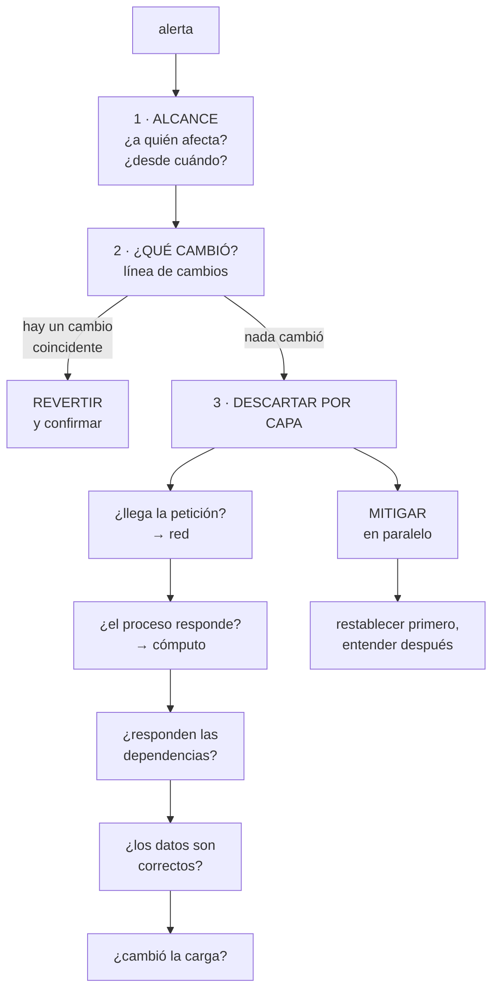

# 258 — Triage de red, cómputo, datos y dependencias

> [← Clase anterior](../../part-21-cloud-operations-automation/257-alertas-on-call-escalamiento-y-comunicacion/README.md) · [Índice de la parte](../README.md) · [Clase siguiente →](../../part-21-cloud-operations-automation/259-runbooks-ejecutables-y-auto-remediation/README.md)

**Parte:** 21 — Operación cloud, automatización y respuesta a incidentes<br>
**Nivel:** avanzado · **Horas estimadas:** 4<br>
**Laboratorio:** `incident` · **Estado:** `EXECUTABLE_CORE`

## 🎯 Propósito

Diagnosticar bajo presión con un método, en vez de con intuición. La clase da el orden de descarte que resuelve la mayoría de los casos en minutos, las preguntas que discriminan por capa —red, cómputo, datos y dependencias—, y las trampas de razonamiento que alargan los incidentes: **quedarse con la primera hipótesis, confundir correlación con causa y no comprobar lo que se da por sabido**.

## 📚 Resultados de aprendizaje

Al finalizar podrás:

1. **Aplicar** un orden de descarte que no dependa de la intuición.
2. **Discriminar** por capa con preguntas que separan causas.
3. **Usar** la línea de cambios como primera hipótesis, siempre.
4. **Evitar** las trampas de razonamiento que alargan los incidentes.
5. **Decidir** cuándo mitigar sin haber entendido la causa.

## 🧩 Conceptos centrales

| Concepto | Comprensión verificable |
|---|---|
| `triaje` | Clasificar rápido el alcance y la capa afectada antes de investigar en profundidad. |
| `línea de cambios` | Registro de qué se ha desplegado, configurado o modificado, con hora. La primera hipótesis. |
| `descarte` | Eliminar capas con una comprobación barata, en vez de buscar la causa directamente. |
| `mitigar` | Restablecer el servicio sin haber entendido la causa. Casi siempre lo correcto primero. |
| `sesgo de la primera hipótesis` | Quedarse con la primera explicación plausible y buscar solo pruebas que la apoyen. |
| `correlación temporal` | Que dos cosas ocurran a la vez. Es una pista, no una causa. |

## 🧠 Modelo mental

Operar es controlar cambios bajo incertidumbre: inventario, señal, diagnóstico, acción reversible y aprendizaje deben formar un ciclo cerrado.

Aplicado a esta clase, separa siempre cuatro planos: **intención** (qué necesita el usuario),
**configuración** (qué declaramos), **estado observado** (qué existe de verdad) y
**evidencia** (cómo sabemos que cumple). Confundirlos produce diseños que se ven correctos
en un diagrama pero fallan al operar.

## 🗺️ Flujo de razonamiento



## 📖 Desarrollo

### 1. El orden de descarte

Bajo presión, la intuición lleva a mirar donde uno sabe mirar, no donde está el problema. El orden lo evita.

```text
1  ALCANCE
   ¿a quién afecta? ¿a todos, a una región, a un tipo de
   usuario, a un cliente?
   ¿desde cuándo, exactamente?
   ¿es total o parcial?

   → y el alcance ya descarta capas enteras
     todos, de golpe        → algo global: cambio,
                              dependencia común, red
     una región             → esa región
     un porcentaje estable  → una parte de las réplicas
     un cliente             → sus datos o su configuración

2  ¿QUÉ CAMBIÓ?
   la línea de cambios, en la ventana anterior
   → despliegues, configuración, banderas, políticas,
     rutas, certificados, cuotas
   → y también cambios de OTROS: proveedores, socios,
     equipos vecinos

   → esta es la primera hipótesis SIEMPRE
   → y en la mayoría de los incidentes, la última también

3  DESCARTAR POR CAPA, con comprobaciones baratas
   → y en el orden en que el tráfico las atraviesa

4  Y EN PARALELO, MITIGAR
   → no se espera a entender para restablecer
```

Y por qué la línea de cambios va antes que cualquier otra cosa:

```text
la mayoría de los incidentes los causa un cambio
  un despliegue                                clase 102
  una configuración                            clase 232
  un certificado que caduca                    clase 196
  una política nueva                           clase 217
  una ruta                                     clase 194
  una cuota que se alcanza                     clase 217
  o un cambio de un tercero                    clase 188

→ y si hay un cambio coincidente, revertirlo es más rápido
  que entender
→ y si al revertir se arregla, la hipótesis queda
  confirmada
```

Y lo que hace posible ese paso:

```text
UNA LÍNEA DE CAMBIOS ÚNICA, de todas las fuentes
  despliegues, infraestructura, banderas, políticas,
  cambios manuales
  → y de todos los equipos

→ y si cada equipo tiene la suya, este paso no se puede
  dar                                          clase 122
→ es de las cosas más baratas de montar y de las que más
  tiempo ahorran
```

Y cuándo mitigar sin entender:

```text
CASI SIEMPRE
  revertir, desviar tráfico, reiniciar, escalar capacidad,
  desactivar una función
  → el servicio vuelve y la investigación sigue en calma

CUÁNDO NO
  si mitigar destruye la evidencia que hace falta
  → entonces se captura primero: registros, volcados,
    estado                                    clase 202
  y si mitigar puede empeorar: un reinicio que pierde datos
    en memoria

→ y la decisión de mitigar la toma quien coordina, no quien
  investiga                                    clase 257
```

### 2. Discriminar por capa

Cada capa tiene una pregunta que la descarta con poco esfuerzo. El orden es el del recorrido del tráfico.

```text
RED                                          clase 202
  ¿llega la petición al destino?
    → registros de flujo: ¿aceptada o rechazada?
  ¿qué ruta se aplica?
    → comprobación de siguiente salto
  ¿resuelve el nombre, y a qué?
    → y desde LA RED que importa            clase 195
  ¿es simétrico el camino?

  firma característica
    funciona en un sentido        asimetría + cortafuegos
    funciona a ratos              dos caminos, uno roto
    todo a la vez y de golpe      sesión BGP o cuota
    lo pequeño sí y lo grande no  MTU               clase 198

CÓMPUTO
  ¿el proceso está vivo y responde?
  ¿cuántas instancias sanas hay frente a las esperadas?
  ¿se reinició? ¿por qué?
    → memoria, comprobación de salud, expulsión
                                          clases 213, 221
  ¿está estrangulado por cuota o por límite?
    → y aquí la CPU del nodo engaña          clase 213

  firma característica
    latencia alta con recursos ociosos   límite o
                                         estrangulamiento
    reinicios silenciosos                memoria
    p99 malo y p50 bien                  una réplica
                                         degradada

DEPENDENCIAS                                 clase 185
  ¿responden? ¿y con qué latencia?
  ¿alguna responde LENTO en vez de fallar?
    → el fallo gris, que la redundancia no cubre
  ¿se agotó algún grupo de conexiones o de puertos?
                                          clases 207, 221
  ¿hay reintentos multiplicando la carga?  clase 201

DATOS                                        clase 243
  ¿los datos son correctos, o solo están?
  ¿cambió la distribución?                       ley 29
  ¿hay un flujo parado?
  ¿un despliegue cambió un esquema?

CARGA
  ¿cambió el tráfico? ¿en volumen o en FORMA?
  ¿hay un cliente nuevo, un rastreador, un bucle de
    reintentos?
  ¿estamos cerca del codo?                     clase 186
```

Y la regla que ordena el uso de herramientas:

```text
de lo barato a lo caro                        clase 202
  paneles y señales agregadas
  registros de flujo y consultas guardadas
  trazas del periodo
  registros de las trazas
  y solo entonces, captura o perfilado

→ y empezar por lo caro es el error más común bajo presión
```

### 3. Las trampas de razonamiento

La mayoría de los incidentes largos no lo son por falta de datos: lo son por errores de razonamiento.

```text
1  QUEDARSE CON LA PRIMERA HIPÓTESIS
   se encuentra una explicación plausible y se busca solo
   lo que la confirma
   → y si es falsa, se pierden horas

   la corrección
     escribir DOS hipótesis alternativas antes de investigar
     y decir qué observación distinguiría entre ellas
     → «si es A, veremos X; si es B, veremos Y»

2  CONFUNDIR CORRELACIÓN CON CAUSA
   «empezó justo cuando desplegamos» es una pista fuerte
   → y a veces el despliegue solo hizo visible algo que ya
     estaba

   la corrección
     revertir y comprobar
     → si al revertir se arregla, la relación es causal
     → si no, la hipótesis era falsa y hay que soltarla

3  NO COMPROBAR LO QUE SE DA POR SABIDO
   «eso no puede ser, lo cambiamos la semana pasada»
   «esa alerta funciona»
   «ese servicio no lo usa nadie»
   → y este programa ha demostrado las tres falsas
                              clases 179, 211, 253

   la corrección
     comprobar lo barato, aunque parezca obvio
     → 30 segundos de comprobación frente a una hora de
       suposición

4  BUSCAR DONDE UNO SABE MIRAR
   quien sabe de red mira la red; quien sabe de bases,
   la base
   → y el orden de descarte lo evita

5  ASUMIR UNA SOLA CAUSA
   los incidentes grandes suelen tener dos o tres cosas a
   la vez
   → una que degrada y otra que impide detectarlo
   → y arreglar una y ver que sigue mal desconcierta

6  Y NO PARAR A PENSAR
   tras 20 minutos sin avanzar, seguir probando cosas es
   peor que parar 3 minutos y reordenar
   → y quien coordina es quien debe forzar esa pausa
                                                clase 257
```

Y una técnica que funciona muy bien y cuesta nada:

```text
DECIR EN VOZ ALTA LO QUE SE ESTÁ HACIENDO
  «voy a comprobar si la petición llega al destino»
  «esperaba ver X y veo Y»

→ obliga a explicitar la hipótesis
→ permite que otro detecte el error
→ y produce la línea de tiempo sin esfuerzo   clase 257
```

Y la pregunta que desatasca más incidentes:

```text
«¿QUÉ ESTAMOS DANDO POR SUPUESTO?»
  → y comprobar lo primero que salga

y la segunda
«¿QUÉ OBSERVACIÓN NOS HARÍA CAMBIAR DE IDEA?»
  → si no hay ninguna, la hipótesis no es útil
```

### 4. Los casos difíciles

Algunos patrones no ceden al orden normal y conviene reconocerlos.

```text
INTERMITENTE
  falla el 3 % de las veces, sin patrón aparente
  → casi siempre es UNA de N: una réplica, una zona, un
    nodo, un camino                     clases 196, 202
  → y la forma de encontrarlo es agrupar por dimensión
    ¿todas las peticiones fallidas van a la misma
    instancia? ¿a la misma zona? ¿al mismo destino?

LENTO EN VEZ DE ROTO
  el fallo gris                                clase 185
  → nada da error; los percentiles altos se degradan
  → y la redundancia no lo cubre: el destino sigue «sano»
  → lo detecta la expulsión de atípicos y el reparto por
    conexiones en vuelo                      clase 196

CÍCLICO
  ocurre a la misma hora, o cada N horas
  → un trabajo programado, una rotación, una caducidad,
    una renegociación                        clase 198
  → y la pregunta es «¿qué ocurre con esa periodicidad?»

EMPEORA CON EL TIEMPO
  una fuga: memoria, conexiones, ficheros, hilos
  → y el síntoma es que reiniciar lo arregla temporalmente
  → si reiniciar arregla, es una fuga hasta que se
    demuestre lo contrario

SOLO EN PRODUCCIÓN
  volumen, datos reales, concurrencia, o una diferencia de
  configuración                                clase 104
  → y la primera comprobación es la diferencia de
    configuración entre entornos

Y SOLO PARA UN CLIENTE
  sus datos, su configuración, su volumen o su clave de
  partición                              clases 208, 223
```

**Cuando no se encuentra**, que también ocurre:

```text
si el servicio está restablecido y no se encuentra la
causa
  se documenta lo que se descartó
  se añade la señal que habría ayudado    clase 238
  y se cierra, con la investigación abierta

→ y eso es mejor que mantener a todo el equipo horas
  buscando con el servicio ya funcionando
→ y peor que no hacerlo: el problema volverá
```

Y lo que hay que dejar preparado para el siguiente:

```text
la consulta que se acabó usando, GUARDADA  clase 238
la señal que faltaba, añadida
el procedimiento actualizado con lo aprendido
y el caso, añadido a las pruebas negativas si procede
                                          clases 216, 250

→ y así el triaje siguiente es más corto
```

Y la lista de comprobación de la clase:

```text
☐ hay línea de cambios única, de todas las fuentes
☐ el triaje empieza por alcance y por «¿qué cambió?»
☐ el descarte sigue el recorrido del tráfico
☐ se usa la herramienta barata antes que la cara
☐ se mitiga en paralelo, sin esperar a entender
☐ se captura evidencia antes de mitigar si hace falta
☐ se escriben dos hipótesis y qué las distinguiría
☐ se comprueba lo que se da por sabido
☐ se dice en voz alta lo que se está haciendo
☐ se para a reordenar si no se avanza en 20 minutos
☐ los intermitentes se agrupan por dimensión
☐ si reiniciar arregla, se investiga como fuga
☐ cuando no se encuentra, se documenta lo descartado
☐ la consulta usada se guarda y la señal que faltaba se
  añade
```

Y el cierre que enlaza con la clase siguiente: cuando el diagnóstico y la respuesta se repiten, escribirlos no basta: hay que poder ejecutarlos. Procedimientos ejecutables y remediación automática es la materia de la clase 259.

## 🔬 Ejemplo trabajado

**Cuatro incidentes de CloudShop, resueltos con el método. Lo que sigue es el que se resolvió en cuatro minutos por la línea de cambios, el que costó tres horas por quedarse con la primera hipótesis, y el intermitente que resultó ser una de doce.**

**Incidente 1 · Cuatro minutos, por la línea de cambios.**

```text
03:14  alerta: presupuesto de error del flujo de compra
       consumiéndose 14 veces más rápido

03:14  ALCANCE
       todos los usuarios, de golpe, desde las 03:02
       → algo global

03:15  ¿QUÉ CAMBIÓ?
       línea de cambios, ventana 02:45-03:05
         02:58  despliegue del servicio de precios
         03:01  cambio de una regla del cortafuegos
         03:03  rotación programada de un certificado

03:16  tres candidatos; el cambio del cortafuegos es el más
       coincidente con las 03:02

03:17  se revierte el cambio del cortafuegos
03:18  restablecido

       tiempo total                              4 min

y la confirmación
  la regla nueva denegaba el tráfico hacia el servicio de
  precios desde una subred creada la semana anterior
                                        clases 219, 231
```

Y la observación:

```text
sin la línea de cambios unificada, el equipo habría
empezado por el despliegue de precios, que también
coincidía
→ y habría revertido lo que no era
→ la hora exacta del cambio fue lo que discriminó
                                                clase 122
```

**Incidente 2 · Tres horas, por la primera hipótesis.**

```text
11:20  el listado de catálogo con p99 de 4.100 ms
       el p50, normal

11:22  primera hipótesis: «la base está lenta»
       → alguien había visto la CPU de la base al 71 %

11:22-13:40  se investiga la base
  se revisan consultas lentas          nada anómalo
  se añade una réplica de lectura      no mejora
  se revisan índices                   correctos
  se sube el tamaño de la instancia    no mejora

13:45  alguien pregunta: «¿todas las peticiones lentas van
       a la misma instancia?»
13:47  se agrupa por instancia
       → el 100 % de las peticiones lentas iba a 1 de las
         12 instancias del servicio
13:50  esa instancia tenía un disco degradado
13:52  retirada; p99 a 240 ms

       tiempo total                           2 h 32
       tiempo desde la pregunta correcta       7 min
```

Y el análisis posterior:

```text
la CPU de la base al 71 % era su valor NORMAL en esa hora
  → correlación tomada por causa
  → y nadie comprobó si era anómala             clase 122

y la pregunta que faltó al principio
  «¿el fallo es de todas las instancias o de una?»
  → que es la pregunta del intermitente y del p99 malo con
    p50 bueno                                clase 196

correcciones
  el panel de servicio muestra el p99 POR INSTANCIA
  y se añadió expulsión de atípicos            clase 196
  → esa combinación habría resuelto el caso sola
```

**Incidente 3 · El intermitente.**

```text
síntoma   entre el 2 % y el 4 % de las llamadas al servicio
          de inventario fallaban por plazo
          sin patrón horario, desde hacía 9 días

el método
  se agruparon las peticiones fallidas por cada dimensión
  disponible

    por instancia de origen        repartido
    por instancia de destino       repartido
    por zona de origen             repartido
    por zona de DESTINO            41 % en una zona
    por nodo                       repartido
    por partición de la base       repartido
    por CLIENTE                    repartido

  → una zona concentraba el 41 % de los fallos con el 33 %
    del tráfico

  y dentro de esa zona
    por instancia de destino       1 de 4 concentraba el
                                   94 % de los fallos de
                                   la zona

  → una de doce instancias, en una zona
  → su comprobación de salud pasaba porque respondía al
    punto de vida                              clase 196
  → y su punto de listo no comprobaba la base

tiempo de diagnóstico con el método            22 min
tiempo que llevaba abierto                      9 días
```

Y la lección:

```text
los intermitentes casi siempre son UNA DE N
→ y agrupar por cada dimensión disponible es mecánico
→ y se puede dejar como consulta guardada    clase 238
```

**Incidente 4 · Dos causas a la vez.**

```text
16:40  el procesamiento de pedidos se detiene

16:42  ALCANCE: total, desde las 16:31
16:43  ¿QUÉ CAMBIÓ? nada en la ventana
16:45  DESCARTE POR CAPA
  ¿llega la petición?          sí
  ¿el proceso responde?        sí
  ¿dependencias?               la cola no entrega
                                                clase 237
16:50  la cola tenía 41.000 mensajes sin confirmar
       y el consumidor estaba parado
16:52  se reinicia el consumidor
16:54  empieza a consumir; se restablece

17:10  y vuelve a pararse

17:12  segunda hipótesis: hay algo que lo para
  → un mensaje con un campo que el consumidor no maneja
  → y ese mensaje bloqueaba la clave de ordenación
                                                clase 237
17:20  el mensaje se aparta; el consumo se normaliza

y la SEGUNDA causa
  ¿por qué nadie se enteró a las 16:31?
  → la alerta de antigüedad de la cola existía
  → con umbral de 24 horas                        ley 15
  → y llevaba 9 minutos cuando el negocio lo notó

→ dos cosas: una que rompió y otra que impidió detectarlo
→ arreglar la primera y ver que volvía a pasar fue lo que
  llevó a la segunda
```

**Lo que quedó montado tras los cuatro:**

```text
LÍNEA DE CAMBIOS ÚNICA
  despliegues, infraestructura, banderas, políticas, rutas,
  certificados y cambios manuales     clases 122, 232, 256
  → en un solo sitio, con hora

CONSULTAS GUARDADAS de triaje
  «agrupar peticiones fallidas por cada dimensión»
  «cambios en la última hora»
  «instancias sanas frente a esperadas»
  «dependencias y su latencia»
  «¿hay algún flujo parado?»
  → enlazadas desde los procedimientos      clase 257

PANELES POR INSTANCIA, no solo agregados
  → el p99 agregado ocultaba una de doce

Y LA PLANTILLA DE TRIAJE
  alcance · qué cambió · descarte por capa · dos hipótesis
  · qué las distingue
  → escrita, y usada en cada incidente
```

**El efecto, en los 6 meses siguientes:**

```text                                        antes     después
tiempo medio hasta la hipótesis correcta   52 min       8 min
incidentes resueltos revirtiendo un cambio    n/d      11/19
tiempo medio hasta mitigar                 1 h 20      14 min
incidentes con más de una causa               n/d        4/19
  detectados los dos                          n/d        4/4
intermitentes abiertos más de 2 días            3           0
incidentes en que se empezó por captura         6           0
  de paquetes
```

Y una cifra que el equipo destacó:

```text
de 19 incidentes, 11 se resolvieron revirtiendo un cambio
en menos de 15 minutos
→ el 58 %
→ y todos ellos habrían sido investigaciones largas sin la
  línea de cambios
```

**La lección que esta clase deja**: el incidente que se resolvió en cuatro minutos y el que costó dos horas y media tenían la misma dificultad técnica: la diferencia fue **preguntar «¿qué cambió?» y «¿es una de N?» antes de investigar**. Y en el que llevaba nueve días abierto, agrupar por cada dimensión disponible —una tarea mecánica de veintidós minutos— encontró **una instancia de doce** cuya comprobación de salud pasaba porque solo miraba si el proceso estaba vivo.

## 🧪 Laboratorio guiado

Ejecuta desde la raíz:

```bash
python classes/part-21-cloud-operations-automation/258-triage-de-red-computo-datos-y-dependencias/lab.py
```

El laboratorio selecciona el motor de práctica **`incident`** y produce
`lab_result.json`. El escenario, sus comprobaciones y el artefacto esperado corresponden a
esta clase; no requiere credenciales y deja explícito qué debe revalidarse en un sandbox real.

1. Lee `exercise.steps` y formula una predicción antes de ejecutar.
2. Ejecuta la práctica y verifica todos los elementos de `checks`.
3. Provoca el caso de `negative_test` y explica la señal observada.
4. Materializa `diagnostic-tree` en `evidence/` usando la plantilla indicada.
5. Para proveedor real, sigue `sandbox.requires`, registra costo y ejecuta `destroy`.

### Evidencia esperada

El artefacto principal es una cronología, roles, comunicación y aprendizaje. Además, la entrega debe incluir el comando ejecutado,
la salida estructurada y una conclusión que no exceda lo observado.

## 🏆 Reto verificable

Construye **`diagnostic-tree`** para el caso CloudShop. Incluye una alternativa descartada,
un supuesto que pueda falsarse, una prueba de fallo y una decisión de rollback.

## ✅ Criterio de aceptación

- [ ] `lab.py` termina con código 0 y genera JSON válido.
- [ ] La entrega conecta al menos tres requisitos con mecanismos verificables.
- [ ] Existe una prueba positiva y una prueba negativa con evidencia.
- [ ] Seguridad, costo y operación aparecen como decisiones, no como anexos.
- [ ] Se declara una limitación y una condición que obligaría a revisar el diseño.
- [ ] Otra persona puede repetir el recorrido sin conocimiento tácito.

## ⚠️ Errores frecuentes

| Síntoma | Causa probable | Corrección |
|---|---|---|
| Se investiga durante horas y la causa era un cambio reciente | No se consultó la línea de cambios al principio, o cada equipo tiene la suya | Monta una línea de cambios única de todas las fuentes y consúltala como primera hipótesis siempre. |
| Se persigue una hipótesis falsa mucho tiempo | Se tomó la primera explicación plausible y se buscó solo lo que la confirmaba | Escribe dos hipótesis y qué observación las distingue; y si revertir no arregla, suelta la hipótesis. |
| Un fallo intermitente lleva días sin diagnosticar | No se agrupó por dimensiones para ver si es una de N | Agrupa las peticiones fallidas por instancia, zona, destino, partición y cliente; casi siempre concentra en una. |
| El p99 es pésimo con el p50 bien y no se encuentra la causa | Los paneles son agregados y ocultan la instancia degradada | Mide por instancia y añade expulsión de atípicos; una réplica lenta no falla la comprobación de salud. |
| Se arregla la causa y el problema vuelve | Había dos causas: una que rompía y otra que impedía detectarlo | Tras mitigar, pregunta siempre por qué no se detectó antes; suele haber una segunda causa. |
| Se empieza capturando paquetes o volcados | Bajo presión se recurre a la herramienta que uno domina | Sigue el orden de descarte y usa las herramientas de lo barato a lo caro. |

## 🛡️ Seguridad, ética y costo

Trabaja con cuentas propias o sandboxes autorizados. No publiques secretos, identificadores
reales ni datos personales. Antes de crear recursos pagos define presupuesto, etiquetas y
comando de destrucción; después verifica que no queden recursos huérfanos. Los ejemplos
locales enseñan contratos, pero no certifican cumplimiento ni disponibilidad de producción.

## ❓ Preguntas de comprobación

1. ¿Cuáles son los cuatro pasos del triaje y por qué la línea de cambios va tan pronto?
2. ¿Qué pregunta descarta cada capa y en qué orden se recorren?
3. ¿Cuándo no conviene mitigar antes de entender?
4. ¿Cómo se aborda un fallo intermitente?
5. ¿Qué pregunta suele revelar la segunda causa de un incidente?

## 🔗 Referencias

- Beyer, B. y otros (2016). *Site Reliability Engineering*, cap. «Effective troubleshooting». <https://sre.google/sre-book/effective-troubleshooting/>
- Allspaw, J. (2015). *Trade-offs under pressure: heuristics and observations of teams resolving internet service outages*. <https://www.researchgate.net/publication/282869185>
- Huang, P. y otros (2017). *Gray failure: the Achilles' heel of cloud-scale systems*. <https://www.microsoft.com/en-us/research/publication/gray-failure-the-achilles-heel-of-cloud-scale-systems/>
- Nygard, M. (2018). *Release It!*, 2.ª ed. — patrones de fallo y su firma. <https://pragprog.com/titles/mnee2/release-it-second-edition/>
- Google (2018). *The Site Reliability Workbook: incident response*. <https://sre.google/workbook/incident-response/>
- Documentación oficial vigente del servicio implementado; registra URL y fecha de consulta.

---

> [Evaluación](assessment.md) · [Contrato de clase](lesson.yaml) · [Índice de la parte](../README.md)
