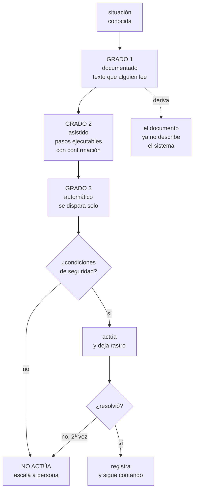

# 259 — Runbooks ejecutables y auto-remediation

> [← 258 · Triage de red, cómputo, datos y dependencias](../../part-21-cloud-operations-automation/258-triage-de-red-computo-datos-y-dependencias/README.md) · [Índice de la parte](../README.md) · [260 · Change management, ventanas y rollback →](../../part-21-cloud-operations-automation/260-change-management-ventanas-y-rollback/README.md)

**Parte:** 21 — Operación cloud, automatización y respuesta a incidentes<br>
**Nivel:** avanzado · **Horas estimadas:** 4<br>
**Laboratorio:** `operations` · **Estado:** `EXECUTABLE_CORE`

## 🎯 Propósito

Convertir procedimientos escritos en procedimientos que se ejecutan. La clase distingue los tres grados —documentado, asistido y automático—, da el criterio para subir de grado sin automatizar lo que no se debe, y monta la remediación automática con sus dos requisitos innegociables: **saber cuándo NO actuar y dejar rastro de lo que hizo**.

## 📚 Resultados de aprendizaje

Al finalizar podrás:

1. **Distinguir** procedimiento documentado, asistido y automático.
2. **Decidir** qué se automatiza y qué se queda con humano en el bucle.
3. **Escribir** procedimientos que no envejecen porque se ejecutan.
4. **Montar** remediación automática con límites y rastro.
5. **Evitar** que la automatización empeore el incidente.

## 🧩 Conceptos centrales

| Concepto | Comprensión verificable |
|---|---|
| `procedimiento` | Guía de respuesta para una situación conocida. Su valor está en ser correcta cuando se usa, no en existir. |
| `procedimiento asistido` | Documento donde los pasos son ejecutables desde él, con confirmación humana. |
| `remediación automática` | Acción correctiva disparada por una señal, sin intervención humana. |
| `límite de acción` | Cuántas veces y en qué condiciones puede actuar la automatización antes de parar y pedir ayuda. |
| `interruptor de la automatización` | Forma de desactivarla al instante, sin desplegar. |
| `deriva del procedimiento` | El documento describe un sistema que ya no existe. El estado por defecto de todo procedimiento escrito. |

## 🧠 Modelo mental

Operar es controlar cambios bajo incertidumbre: inventario, señal, diagnóstico, acción reversible y aprendizaje deben formar un ciclo cerrado.

Aplicado a esta clase, separa siempre cuatro planos: **intención** (qué necesita el usuario),
**configuración** (qué declaramos), **estado observado** (qué existe de verdad) y
**evidencia** (cómo sabemos que cumple). Confundirlos produce diseños que se ven correctos
en un diagrama pero fallan al operar.

## 🗺️ Flujo de razonamiento



## 📖 Desarrollo

### 1. Los tres grados

Un procedimiento no es un documento: es una capacidad de respuesta. Y tiene tres grados según cuánto trabajo humano exige.

```text
GRADO 1 · DOCUMENTADO
  texto que alguien lee y traduce a comandos
  ventaja  barato de escribir
  problema DERIVA
           el documento envejece y nadie se entera hasta
           el incidente
           → y a las 03:00 nadie descubre que el comando
             ya no existe

GRADO 2 · ASISTIDO
  el procedimiento contiene los pasos EJECUTABLES
  → un cuaderno, un flujo de trabajo, un asistente de chat
  → cada paso se ejecuta desde el documento, con
    confirmación

  ventaja  no hay traducción ni erratas
           y si un paso se rompe, se rompe al ejecutarlo:
           la deriva se detecta
           el rastro sale gratis            clase 257
  → y es el grado que más valor aporta por el esfuerzo

GRADO 3 · AUTOMÁTICO
  una señal dispara la acción, sin persona
  ventaja  segundos en vez de minutos, y de noche igual
           que de día
  riesgo   puede empeorar el incidente
  → y por eso necesita condiciones, límites y rastro
```

Y el criterio para subir de grado:

```text
de 1 a 2  SIEMPRE que el procedimiento se use más de una
          vez al trimestre
          → el coste es bajo y elimina la deriva

de 2 a 3  cuando las tres se cumplen
          a  el diagnóstico es INEQUÍVOCO
             la señal identifica la situación sin
             ambigüedad
          b  la acción es SEGURA si el diagnóstico fuera
             erróneo
             → «¿qué pasa si actúa cuando no debía?»
          c  la frecuencia lo justifica
             → automatizar lo que ocurre una vez al año
               produce automatización sin probar, que es
               peor que nada

→ y si (b) no se cumple, se queda en grado 2 aunque duela
```

Y los candidatos naturales de cada grado:

```text
GRADO 3, claros
  retirar una instancia que falla la comprobación de salud
  reiniciar un proceso con fuga detectada
  ampliar un volumen que llega al 85 %
  rotar un certificado a punto de caducar   clase 196
  limpiar registros antiguos
  reintentar un flujo de datos fallido       clase 244
  revertir un despliegue cuyo canario falla  clase 102

GRADO 2, y no más
  conmutar de región                         clase 187
  restaurar desde copia                      clase 189
  cambiar el enrutado del tráfico
  desactivar una función
  todo lo que toque datos de forma no reversible

GRADO 1 basta
  lo que ocurre una vez al año y es complejo
  → pero entonces hay que ENSAYARLO         clase 261
```

### 2. Procedimientos que no envejecen

La deriva es el estado por defecto: el sistema cambia y el documento no.

```text
LO QUE LA CAUSA
  el documento vive lejos del código
  quien cambia el sistema no sabe que existe el documento
  y nadie lo lee hasta que hay un incidente

LO QUE LA EVITA
  1  que los pasos sean EJECUTABLES
     → si el paso está roto, falla al ejecutarlo
  2  que se EJECUTEN aunque no haya incidente
     → ensayos periódicos                    clase 261
  3  que vivan con el código del servicio
     → y se revisen en el mismo cambio
  4  que la alerta ENLACE al procedimiento   clase 257
     → y si el enlace está roto, se ve en cada alerta
```

Y qué contiene un procedimiento útil:

```text
ENCABEZADO
  para qué alerta / síntoma
  cuál es el impacto en el usuario
  y cuál es la acción de MITIGACIÓN inmediata
  → arriba del todo, no al final

DIAGNÓSTICO
  las tres o cuatro comprobaciones que discriminan
  con las consultas ENLAZADAS, no descritas   clase 258

ACCIÓN, por escenario
  si A → hacer X
  si B → hacer Y
  si nada encaja → escalar a quien           clase 257

Y LO QUE NO HAY QUE HACER
  → «no reinicies la base: tarda 40 minutos en recuperar»
  → esta sección evita más daño que ninguna otra

VERIFICACIÓN
  cómo se sabe que quedó arreglado
  → una señal concreta, no «comprobar que va bien»
```

Y lo que NO debe contener:

```text
explicaciones de arquitectura       → en la documentación
historia del incidente que lo originó
listas de comandos sin contexto de cuándo usarlos
y nada que ocupe más de una pantalla antes de la primera
  acción útil

→ un procedimiento se lee a las 03:00, con prisa y con
  ruido
→ y el criterio de calidad es: ¿lo puede seguir alguien
  que no construyó el servicio?
→ que es exactamente lo que se prueba en el ensayo
                                              clase 261
```

### 3. Remediación automática, con límites

Automatizar la respuesta es lo que convierte incidentes en no-eventos. Y también lo que convierte un problema pequeño en uno grande, si falta lo siguiente.

```text
REQUISITO 1 · SABER CUÁNDO NO ACTUAR
  condiciones de seguridad antes de cada acción
    ¿cuántos objetivos sanos quedan?
      → si retirar esta instancia deja menos del mínimo,
        NO retirar
    ¿es un fallo local o general?
      → si fallan TODAS, el problema no es la instancia
      → y reiniciarlas todas destruye lo que quedaba
    ¿hay un despliegue en curso?
    ¿ya actuó por lo mismo hace poco?

REQUISITO 2 · LÍMITE DE ACCIONES
  «como mucho N veces por ventana»
    → y a la N+1, no actúa: ESCALA
  → porque si la acción no resolvió dos veces, el
    diagnóstico es falso
  → y el bucle de remediación es un modo de fallo real

REQUISITO 3 · RASTRO
  qué señal la disparó, qué comprobó, qué hizo, con qué
  resultado
  → visible en el mismo sitio que los cambios humanos
                                              clase 258
  → una automatización sin rastro convierte cada incidente
    en un misterio

REQUISITO 4 · INTERRUPTOR
  desactivarla al instante, sin desplegar     clase 105
  → y quien coordina el incidente debe poder usarlo

REQUISITO 5 · QUE AVISE
  actuó, luego se cuenta
  → aviso, no alerta: nadie tiene que despertarse
                                              clase 257
  → pero si actúa 40 veces en una semana, eso SÍ es una
    alerta: hay un problema que nadie está viendo
```

Y la métrica que revela si la automatización tapa problemas:

```text
CUÁNTAS VECES ACTÚA, por causa y por semana
  estable y baja      bien
  creciendo           hay un problema de fondo
  muy alta            la automatización es una tirita

→ y ese contador es lo que impide que la remediación
  automática se convierta en la forma de no arreglar nada
→ que es su mayor riesgo, y no es técnico
```

Y el escalón entre grado 2 y 3, que casi siempre conviene:

```text
MODO SOMBRA
  la automatización evalúa y REGISTRA lo que HABRÍA hecho
  sin hacerlo
  → dos o cuatro semanas
  → y se revisa: ¿habría acertado siempre?

→ y aquí se descubren las condiciones que faltaban
→ es el mismo patrón de las políticas en aviso  clase 217
→ y del canario                                 clase 102
```

### 4. Los modos de fallo de la automatización

Automatizar la respuesta introduce fallos nuevos. Conviene conocerlos antes de sufrirlos.

```text
1  EL BUCLE
   la acción dispara la señal que dispara la acción
   → escalar por CPU, y el arranque consume CPU
   → reiniciar por plazo, y el reinicio causa plazos
   defensa  límite de acciones y ventana de calma

2  LA REMEDIACIÓN QUE ESCONDE
   reinicia el proceso con fuga cada 6 horas, en silencio
   → y nadie arregla la fuga en dos años
   defensa  contador visible y revisión periódica

3  LA ACCIÓN CORRECTA EN EL MOMENTO EQUIVOCADO
   retirar instancias no sanas está bien
   → salvo durante un despliegue, donde no estar sano es
     temporal
   defensa  condición «¿hay cambio en curso?»

4  LA AUTOMATIZACIÓN QUE NO SE PROBÓ
   escrita hace 14 meses, nunca disparada
   → y cuando dispara, falla por permisos             ley 15
   defensa  ejercitarla en los ensayos            clase 261

5  LA QUE ACTÚA SOBRE UN DIAGNÓSTICO CORRELACIONAL
   «si la latencia sube, escalar»
   → y la latencia subía por una dependencia lenta
   → escalar multiplicó la carga sobre ella      clase 201
   defensa  el criterio (a): diagnóstico inequívoco

6  Y LA QUE NADIE SABE QUE EXISTE
   el incidente se comporta de forma inexplicable porque
   algo está actuando
   defensa  rastro en la línea de cambios       clase 258
   → y un inventario de automatizaciones activas
```

Y el papel de los procedimientos en el ciclo completo:

```text
incidente → análisis posterior → acción             clase 111
  y la acción tiene tres formas, en orden de valor
    1  eliminar la causa
    2  automatizar la respuesta
    3  documentar la respuesta

→ y (2) sin intentar (1) es deuda
→ pero (2) mientras (1) se hace bien es correcto
→ y (3) sola, sin plazo para subir de grado, es lo que
  produce carpetas de documentos muertos
```

Y la lista de comprobación de la clase:

```text
☐ cada alerta accionable enlaza a un procedimiento
☐ los procedimientos empiezan por impacto y mitigación
☐ los pasos son ejecutables, no descritos
☐ tienen sección de «lo que NO hay que hacer»
☐ tienen verificación con señal concreta
☐ viven con el código y se revisan en el mismo cambio
☐ se ejecutan en los ensayos, no solo en incidentes
☐ lo automatizado cumple diagnóstico inequívoco y acción
  segura
☐ toda remediación tiene condiciones de seguridad
☐ tiene límite de acciones por ventana y escala al
  superarlo
☐ deja rastro en la línea de cambios
☐ tiene interruptor sin despliegue
☐ se estrenó en modo sombra
☐ hay contador de actuaciones por causa, revisado
☐ existe inventario de automatizaciones activas
```

Y el cierre que enlaza con la clase siguiente: la mayor fuente de incidentes es el cambio, y el triaje lo confirmó: el 58 % se resolvió revirtiendo uno. Gestionar el cambio —ventanas, congelaciones y vuelta atrás— es la materia de la clase 260.

## 🔬 Ejemplo trabajado

**CloudShop convierte 34 procedimientos en capacidad de respuesta. Lo que sigue es el inventario que encontró que 19 de 34 estaban rotos, la primera remediación automática que causó un incidente, y las cifras a los nueve meses.**

**Punto de partida: el inventario.**

```text
34 procedimientos escritos, en tres sitios distintos
  wiki del equipo            18
  repositorio de la
  plataforma                  9
  documentos sueltos          7

y la prueba: coger cada uno y EJECUTARLO en un entorno
de ensayo

     funciona íntegro                       11
     algún comando ya no existe             13
     referencia a un servicio retirado       4
     permisos insuficientes para quien
     estaría de guardia                      2
     el procedimiento describe un sistema
     que ya no es así                        4

     rotos, en total                     19/34   56 %
     antigüedad media de la última
     edición                            14 meses
```

Y el hallazgo que más molestó:

```text
el procedimiento de conmutación de región
  escrito con mucho detalle, 6 páginas
  nunca ejecutado
  → el nombre del grupo de recursos secundario había
    cambiado hacía 8 meses
  → y tres de los pasos requerían un permiso que el rol de
    guardia no tenía                       clases 189, 231

→ el procedimiento del que más dependía el plan de
  continuidad era el más roto
→ ley 15, otra vez
```

**La conversión, por grados.**

```text
de los 34
  se retiraron por obsoletos                      9
  quedaron 25

  a GRADO 2 (asistido)                           25
    cuadernos ejecutables enlazados desde la alerta
    esfuerzo medio por procedimiento         3.5 horas

  y de esos, subieron a GRADO 3 (automático)      8
```

Y los ocho que subieron, con su criterio:

```text                              inequívoco  seguro  frec/mes
retirar instancia no sana              sí        sí      31
reiniciar proceso con fuga             sí        sí      12
ampliar volumen al 85 %                sí        sí       6
rotar certificado < 21 días            sí        sí       4
reintentar flujo de datos fallido      sí        sí      18
revertir despliegue con canario malo   sí        sí       3
limpiar registros antiguos             sí        sí       9
liberar conexiones huérfanas           sí        sí       7
```

Y los que se quedaron en grado 2, con el motivo:

```text
conmutar de región          acción no segura si el
                            diagnóstico falla
restaurar desde copia       no reversible
desviar tráfico entre       impacto amplio; decisión de
proveedores                 negocio
desactivar función de pago  decisión de negocio
ampliar cuota de la base    coste; requiere aprobación

→ el criterio (b) fue el que descartó a la mayoría
```

**El incidente que causó la primera remediación automática.**

```text
semana 3
  la automatización de «retirar instancia no sana» actuó
  correctamente 14 veces

semana 4, martes, 09:12
  una dependencia común empieza a responder lento
  → las comprobaciones de salud de 9 de 11 instancias
    empiezan a fallar por plazo

09:12  retira una
09:12  retira otra
09:13  retira otra
  ...
09:14  quedan 2 instancias sirviendo todo el tráfico
09:14  las 2 se saturan y también fallan
09:15  servicio caído por completo

tiempo desde el primer síntoma hasta la caída total
                                             3 minutos

y sin la automatización
  el servicio habría estado LENTO, no caído
  → la automatización convirtió una degradación en una
    caída
```

Y lo que faltaba, exactamente:

```text
la condición de MÍNIMO SANO
  «no retirar si quedarían menos de N sanas»

y la condición de FALLO GENERAL
  «si falla más del 50 % a la vez, el problema no son las
  instancias»
  → no actuar; escalar

y el LÍMITE POR VENTANA
  «como mucho 2 retiradas cada 10 minutos»

→ las tres se añadieron
→ y se añadió el interruptor, que en ese incidente no
  existía: hubo que desplegar para pararla, 11 minutos más
```

Y el cambio de proceso que siguió:

```text
ninguna remediación entra sin
  a  4 semanas en modo sombra
  b  condiciones de seguridad revisadas por otra persona
  c  interruptor probado
  d  contador de actuaciones en el panel
  e  y un ensayo donde se dispara a propósito  clase 261

→ las 7 restantes pasaron por esto
→ y en modo sombra, 2 de las 7 revelaron condiciones que
  faltaban
    reintentar flujo de datos → habría reintentado un
      fallo por datos malos indefinidamente     clase 244
    limpiar registros → habría borrado durante una
      investigación abierta
```

**Las cifras a los nueve meses.**

```text                                        antes     después
procedimientos                                 34          25
  ejecutables (grado 2 o 3)                     0          25
  rotos al probarlos                        19/34        1/25
  antigüedad media de la última edición   14 meses    19 días

situaciones resueltas sin persona             0/mes    73/mes
tiempo medio de respuesta a esas
  situaciones                              18 min       40 seg
interrupciones de guardia por turno            9.4         2.6
interrupciones fuera de horario por turno      3.1         0.7

incidentes causados por la automatización        -           1
  tras añadir condiciones y sombra                -           0
```

Y el contador que reveló un problema de fondo:

```text
«reiniciar proceso con fuga» empezó actuando 12 veces/mes
  mes 4      19
  mes 5      31
  mes 6      47

→ la revisión del contador lo detectó
→ la fuga se había agravado con un cambio del mes 4
→ y sin el contador, la automatización lo habría escondido
  indefinidamente

se arregló la fuga
  mes 7       2
  mes 8       0
```

Y el coste, para dimensionar:

```text
conversión de 25 procedimientos a grado 2   88 horas
8 remediaciones automáticas                 96 horas
modo sombra y ajustes                       34 horas
                                           ─────────
                                           218 horas

y el retorno, solo en interrupciones evitadas
  73 situaciones/mes × 18 min = 22 horas/mes
  → recuperado en 10 meses en tiempo directo
  → y el valor real está en las 2.4 interrupciones
    nocturnas por turno que dejaron de ocurrir
```

**La lección que esta clase deja**: los 34 procedimientos existían y **19 estaban rotos** —incluido el de conmutación de región, el más importante— porque un documento que nunca se ejecuta no tiene forma de avisar de que ha envejecido. Y la primera remediación automática convirtió una degradación en una **caída total en tres minutos**, no por estar mal programada, sino por no saber **cuándo no actuar**.

## 🧪 Laboratorio guiado

Ejecuta desde la raíz:

```bash
python classes/part-21-cloud-operations-automation/259-runbooks-ejecutables-y-auto-remediation/lab.py
```

El laboratorio selecciona el motor de práctica **`operations`** y produce
`lab_result.json`. El escenario, sus comprobaciones y el artefacto esperado corresponden a
esta clase; no requiere credenciales y deja explícito qué debe revalidarse en un sandbox real.

1. Lee `exercise.steps` y formula una predicción antes de ejecutar.
2. Ejecuta la práctica y verifica todos los elementos de `checks`.
3. Provoca el caso de `negative_test` y explica la señal observada.
4. Materializa `executable-runbook` en `evidence/` usando la plantilla indicada.
5. Para proveedor real, sigue `sandbox.requires`, registra costo y ejecuta `destroy`.

### Evidencia esperada

El artefacto principal es un runbook probado por otra persona. Además, la entrega debe incluir el comando ejecutado,
la salida estructurada y una conclusión que no exceda lo observado.

## 🏆 Reto verificable

Construye **`executable-runbook`** para el caso CloudShop. Incluye una alternativa descartada,
un supuesto que pueda falsarse, una prueba de fallo y una decisión de rollback.

## ✅ Criterio de aceptación

- [ ] `lab.py` termina con código 0 y genera JSON válido.
- [ ] La entrega conecta al menos tres requisitos con mecanismos verificables.
- [ ] Existe una prueba positiva y una prueba negativa con evidencia.
- [ ] Seguridad, costo y operación aparecen como decisiones, no como anexos.
- [ ] Se declara una limitación y una condición que obligaría a revisar el diseño.
- [ ] Otra persona puede repetir el recorrido sin conocimiento tácito.

## ⚠️ Errores frecuentes

| Síntoma | Causa probable | Corrección |
|---|---|---|
| El procedimiento no funciona cuando se necesita a las 03:00 | Es texto que nadie ha ejecutado desde que se escribió | Conviértelo en pasos ejecutables y ejercítalo en los ensayos; la deriva solo se detecta ejecutando. |
| La remediación automática convirtió una degradación en una caída | No tenía condición de mínimo sano ni detección de fallo general | Antes de cada acción comprueba cuántos objetivos sanos quedan y si el fallo es local o general; si es general, no actúes y escala. |
| Una automatización actúa sin parar y nadie arregla la causa | No hay contador visible ni revisión de cuántas veces actúa | Mide actuaciones por causa y semana, y revísalo; si crece, hay un problema de fondo que la automatización tapa. |
| Durante un incidente el sistema hace cosas que nadie ordenó | La remediación no deja rastro ni hay inventario de lo que está activo | Registra cada actuación en la línea de cambios y manten un inventario de automatizaciones con su interruptor. |
| Hubo que desplegar para parar la automatización durante el incidente | No existía interruptor independiente del despliegue | Toda remediación necesita desactivarse al instante mediante una bandera, y quien coordina debe poder usarla. |
| Se automatizó algo que se usa una vez al año y falló al dispararse | Frecuencia insuficiente para que la automatización esté probada | Si ocurre raramente, quédate en grado 2 y ensáyalo; la automatización sin uso es automatización sin probar. |

## 🛡️ Seguridad, ética y costo

Trabaja con cuentas propias o sandboxes autorizados. No publiques secretos, identificadores
reales ni datos personales. Antes de crear recursos pagos define presupuesto, etiquetas y
comando de destrucción; después verifica que no queden recursos huérfanos. Los ejemplos
locales enseñan contratos, pero no certifican cumplimiento ni disponibilidad de producción.

## ❓ Preguntas de comprobación

1. ¿Cuáles son los tres grados y qué criterio permite subir de 2 a 3?
2. ¿Qué hace que un procedimiento envejezca y qué lo evita?
3. ¿Qué condiciones de seguridad necesita toda remediación automática?
4. ¿Para qué sirve el modo sombra y qué suele revelar?
5. ¿Qué indica que una automatización está tapando un problema en vez de resolverlo?

## 🔗 Referencias

- Beyer, B. y otros (2018). *The Site Reliability Workbook*, cap. «Automation and toil». <https://sre.google/workbook/eliminating-toil/>
- AWS (2024). *Systems Manager Automation runbooks*. <https://docs.aws.amazon.com/systems-manager/latest/userguide/automation-documents.html>
- Microsoft (2024). *Azure Automation runbooks*. <https://learn.microsoft.com/azure/automation/automation-runbook-types>
- Google Cloud (2024). *Automated remediation with Cloud Functions and alerting*. <https://cloud.google.com/architecture/automated-remediation-cloud-monitoring>
- Limoncelli, T. (2020). *Operational excellence in April Fools' pranks* — sobre automatización probada frente a escrita. <https://queue.acm.org/detail.cfm?id=3380780>
- Documentación oficial vigente del servicio implementado; registra URL y fecha de consulta.

---

> [Evaluación](assessment.md) · [Contrato de clase](lesson.yaml) · [Índice de la parte](../README.md)

**📥 Descargar:** [Parte 21 en PDF](../../../site/downloads/partes/manual-parte-21-cloud-operations-automation.pdf) · [Manual integral](../../../site/downloads/multi-cloud-engineering-manual-v2.0.pdf)

| Anterior | Índice | Siguiente |
|---|---|---|
| [← 258 · Triage de red, cómputo, datos y dependencias](../../part-21-cloud-operations-automation/258-triage-de-red-computo-datos-y-dependencias/README.md) | [Parte 21](../README.md) · [Programa](../../README.md) | [260 · Change management, ventanas y rollback →](../../part-21-cloud-operations-automation/260-change-management-ventanas-y-rollback/README.md) |
