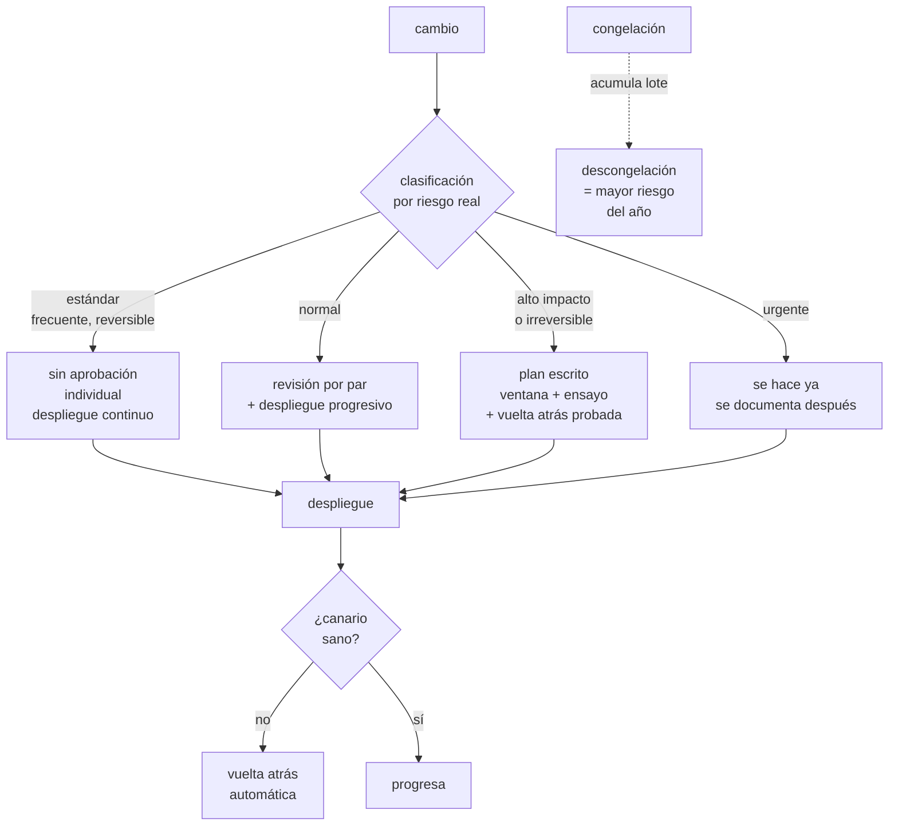

# 260 — Change management, ventanas y rollback

> [← 259 · Runbooks ejecutables y auto-remediation](../../part-21-cloud-operations-automation/259-runbooks-ejecutables-y-auto-remediation/README.md) · [Índice de la parte](../README.md) · [261 · Game days, chaos engineering y aprendizaje →](../../part-21-cloud-operations-automation/261-game-days-chaos-engineering-y-aprendizaje/README.md)

**Parte:** 21 — Operación cloud, automatización y respuesta a incidentes<br>
**Nivel:** avanzado · **Horas estimadas:** 4<br>
**Laboratorio:** `delivery` · **Estado:** `EXECUTABLE_CORE`

## 🎯 Propósito

Gestionar el cambio sin frenarlo. La clase demuestra que **cambiar más despacio no reduce el riesgo: lo concentra**, explica por qué los procesos de aprobación pesados empeoran las cifras, y da el conjunto que sí funciona: cambios pequeños y frecuentes, vuelta atrás probada, ventanas y congelaciones con criterio, y clasificación por riesgo real.

## 📚 Resultados de aprendizaje

Al finalizar podrás:

1. **Explicar** por qué frenar el cambio concentra el riesgo en vez de reducirlo.
2. **Clasificar** los cambios por riesgo real, no por burocracia.
3. **Diseñar** vuelta atrás que funcione, incluida la que no es reversible.
4. **Aplicar** ventanas y congelaciones con criterio y con coste explícito.
5. **Medir** el proceso de cambio con las cuatro métricas que importan.

## 🧩 Conceptos centrales

| Concepto | Comprensión verificable |
|---|---|
| `lote` | Cuántos cambios entran juntos. La variable que más determina el riesgo de un despliegue. |
| `cambio estándar` | Cambio frecuente, de riesgo conocido y con vuelta atrás probada. No necesita aprobación individual. |
| `vuelta atrás` | Devolver el sistema al estado anterior. Solo cuenta si se ha probado. |
| `avance hacia delante` | Arreglar aplicando un cambio nuevo. La única salida cuando la vuelta atrás no es posible. |
| `congelación` | Periodo sin cambios. Traslada el riesgo al momento en que se descongela. |
| `ventana de cambio` | Franja horaria en que se permite desplegar. Útil cuando el impacto depende de la hora, dañina cuando no. |

## 🧠 Modelo mental

Operar es controlar cambios bajo incertidumbre: inventario, señal, diagnóstico, acción reversible y aprendizaje deben formar un ciclo cerrado.

Aplicado a esta clase, separa siempre cuatro planos: **intención** (qué necesita el usuario),
**configuración** (qué declaramos), **estado observado** (qué existe de verdad) y
**evidencia** (cómo sabemos que cumple). Confundirlos produce diseños que se ven correctos
en un diagrama pero fallan al operar.

## 🗺️ Flujo de razonamiento



## 📖 Desarrollo

### 1. Frenar el cambio no reduce el riesgo

La intuición dice que menos cambios significan menos incidentes. Los datos dicen lo contrario, y la razón es aritmética.

```text
EL RIESGO DE UN DESPLIEGUE NO ES CONSTANTE:
CRECE CON EL LOTE

  1 cambio      1 causa posible
                y si falla, se sabe cuál es

  40 cambios    40 causas posibles
                y las interacciones entre ellas
                → y el diagnóstico se multiplica
                → y la vuelta atrás revierte 39 cambios
                  buenos con el malo

→ desplegar la mitad de veces no significa la mitad de
  riesgo: significa lotes del doble de tamaño
→ y el riesgo por despliegue crece más que linealmente
```

Y lo que muestran las mediciones del sector:

```text
los equipos que despliegan MÁS a menudo tienen
  menor tasa de fallo por cambio
  menor tiempo de recuperación
  y menor tiempo de entrega

→ no a pesar de desplegar más, sino PORQUE despliegan más
→ frecuencia y estabilidad correlacionan POSITIVAMENTE
→ es el hallazgo más contraintuitivo y mejor replicado
  del campo
```

Y por qué las aprobaciones pesadas empeoran las cifras:

```text
un comité que aprueba cambios
  no conoce el cambio mejor que quien lo escribió
  → y por tanto no puede evaluar su riesgo real
  añade días de espera
  → y la espera acumula lote
  y desplaza la responsabilidad
  → «lo aprobó el comité» sustituye a «lo comprobé»

→ el efecto medido: peor tiempo de entrega Y peor tasa de
  fallo
→ la aprobación externa funciona peor que la revisión por
  un par                                        clase 102
```

Y lo que sí reduce el riesgo:

```text
lote pequeño
despliegue progresivo con canario           clase 102
vuelta atrás probada
separación de despliegue y activación       clase 105
automatización de la comprobación           clase 100
y revisión por alguien que entiende el cambio

→ ninguna de estas es un proceso de aprobación
→ todas son propiedades del sistema de entrega
```

### 2. Clasificar por riesgo real

No todos los cambios necesitan el mismo tratamiento. La clasificación útil se hace por riesgo, no por tipo de recurso.

```text
ESTÁNDAR
  frecuente, con vuelta atrás probada, impacto acotado
  → despliegue de código con canario
  → cambio de configuración con bandera
  → escalado dentro de límites conocidos
  aprobación  ninguna individual; se aprobó el
              PROCEDIMIENTO, no el cambio
  → y aquí debe caer el 90 % o más de los cambios

NORMAL
  no rutinario, reversible, impacto conocido
  → revisión por un par que entienda el área
  → despliegue progresivo

ALTO IMPACTO O IRREVERSIBLE
  migración de datos, cambio de esquema destructivo,
  cambio de red troncal, rotación de clave maestra
  → plan escrito con pasos y verificación
  → ensayo previo en entorno equivalente
  → ventana acordada
  → vuelta atrás PROBADA, o plan de avance hacia delante
  → y una persona designada que puede detenerlo

URGENTE
  se hace ya, con quien coordina el incidente enterado
  → y se documenta DESPUÉS, sin excepción
  → el registro posterior es lo que evita que «urgente»
    se convierta en la vía de escape habitual

→ y la métrica de salud del proceso es qué porcentaje de
  cambios se declara urgente
→ si pasa del 5 %, la clasificación normal es demasiado
  lenta y la gente la rodea
```

Y la trampa clásica de la clasificación:

```text
clasificar por RECURSO en vez de por RIESGO
  «todo cambio en producción es alto impacto»
  → y entonces todo pasa por el proceso pesado
  → y el proceso pesado se convierte en un trámite que
    nadie lee

  «cambiar una variable de entorno es trivial»
  → y la variable era la cadena de conexión
                                          clase 232

→ el riesgo lo determina el ALCANCE DEL FALLO POSIBLE y
  la REVERSIBILIDAD, no el tipo de recurso
```

### 3. Vuelta atrás que funciona

«Podemos revertir» es la frase más repetida y menos comprobada de la operación.

```text
CUÁNDO LA VUELTA ATRÁS ES REAL
  el artefacto anterior sigue existiendo
  el procedimiento se ha ejecutado en los últimos 30 días
  el tiempo de vuelta atrás se conoce, medido
  y no depende de nada que el fallo haya roto

CUÁNDO NO LO ES
  cambio de esquema que ya escribió datos nuevos
  migración de datos ya iniciada
  mensajes ya consumidos con formato nuevo   clase 210
  claves rotadas y las anteriores destruidas  clase 197
  caché envenenada que sobrevive al despliegue
  y cambios de terceros, que no revierten cuando tú
    reviertes

→ y en todos esos casos, la salida es AVANZAR
→ y eso hay que decidirlo ANTES, no durante
```

Y el patrón que hace reversible lo que no lo parece:

```text
CAMBIO DE ESQUEMA EN CUATRO PASOS       clase 209
  1  añadir lo nuevo sin quitar lo viejo
  2  escribir en ambos
  3  leer de lo nuevo
  4  y solo entonces, retirar lo viejo

→ cada paso es reversible por separado
→ el paso 4 se hace días o semanas después
→ y es lo que convierte una migración irreversible en
  cuatro cambios estándar

y el mismo patrón vale para
  formatos de mensaje                       clase 210
  contratos de interfaz                     clase 106
  y particiones de datos                    clase 208
```

Y la separación que más margen da:

```text
DESPLEGAR ≠ ACTIVAR                       clase 105
  el código va a producción apagado
  → y se enciende con una bandera, por porcentaje
  → y se apaga en segundos, sin desplegar

→ la vuelta atrás de una bandera es instantánea
→ la de un despliegue tarda minutos
→ y en un incidente, esa diferencia es todo
```

Y qué hacer con el cambio que no se puede probar en pequeño:

```text
un cambio de red troncal, una rotación de clave maestra
  → no hay canario posible
  la defensa es
    ensayo en entorno equivalente        clase 261
    ventana con la gente disponible
    verificación paso a paso, no al final
    punto de no retorno EXPLÍCITO y anunciado
    y criterio de abandono escrito ANTES
      → «si a los 20 minutos X no ocurre, abortamos»
```

### 4. Ventanas, congelaciones y su coste

Ventanas y congelaciones son herramientas legítimas mal usadas casi siempre.

```text
VENTANA DE CAMBIO
  útil cuando el impacto DEPENDE DE LA HORA
    → un sistema de pago con pico a mediodía
    → un proceso por lotes nocturno
  dañina cuando no
    → «solo se despliega los martes de 14 a 16»
    → acumula lote, concentra el riesgo y multiplica la
      espera

  y la trampa nocturna
    desplegar de madrugada suena prudente
    → pero hay menos gente, más cansada, y menos tráfico
      para detectar el problema
    → y el fallo se descubre a las 09:00 con el equipo
      entrando
  → desplegar cuando hay gente disponible y tráfico
    suficiente para ver el efecto es MEJOR

CONGELACIÓN
  legítima cuando
    hay un evento de negocio con impacto extremo
      → temporada alta, lanzamiento, cierre fiscal
    y dura poco

  y su coste, que casi nunca se calcula
    el lote acumulado se libera de golpe al descongelar
    → el día de la descongelación es el de mayor riesgo
      del año
    los arreglos de seguridad también se congelan
    → y esa es la parte peligrosa            clase 216
    y el equipo pierde la práctica de desplegar

  cómo hacerla bien
    excepción explícita para seguridad y para incidentes
    descongelación ESCALONADA, no de golpe
    y medir cuántos incidentes ocurren en la semana
    siguiente
```

Y las cuatro métricas que dicen si el proceso de cambio es sano:

```text
FRECUENCIA DE DESPLIEGUE
  → cuántas veces se entrega valor
TIEMPO DE ENTREGA
  → de confirmar el cambio a estar en producción
TASA DE FALLO POR CAMBIO
  → qué porcentaje causa degradación
TIEMPO DE RECUPERACIÓN
  → cuánto se tarda en restablecer

→ y las cuatro mejoran juntas o empeoran juntas
→ un proceso que mejora la tasa de fallo empeorando la
  frecuencia NO está mejorando
→ y esa es la comprobación que desenmascara los procesos
  de aprobación pesados
```

Y la lista de comprobación de la clase:

```text
☐ el 90 % o más de los cambios son estándar
☐ los cambios estándar no requieren aprobación individual
☐ la revisión la hace quien entiende el área, no un comité
☐ menos del 5 % de los cambios se declaran urgentes
☐ los urgentes se documentan después, siempre
☐ la clasificación es por alcance y reversibilidad
☐ el despliegue es progresivo con canario y vuelta atrás
  automática
☐ la vuelta atrás se ha ejecutado en los últimos 30 días
☐ los cambios irreversibles se descomponen en pasos
  reversibles
☐ desplegar y activar están separados
☐ los cambios de alto impacto tienen criterio de abandono
  escrito antes
☐ las ventanas existen solo donde el impacto depende de
  la hora
☐ no se despliega de madrugada por costumbre
☐ las congelaciones tienen excepción para seguridad
☐ la descongelación es escalonada
☐ se miden las cuatro métricas y se miran juntas
```

Y el cierre que enlaza con la clase siguiente: todo lo montado hasta aquí —guardia, triaje, procedimientos, vuelta atrás— vale lo que valga cuando se usa de verdad. Provocar los fallos a propósito, en horario laboral y con la gente delante, es la materia de la clase 261.

## 🔬 Ejemplo trabajado

**CloudShop desmonta su comité de cambios. Lo que sigue son los datos que lo justificaron, la congelación de temporada alta que costó más de lo que ahorró, y las cuatro métricas antes y después.**

**El punto de partida: el comité.**

```text
comité de cambios, semanal, miércoles 10:00
  7 personas, 90 minutos
  todo cambio a producción pasaba por él

cifras de 12 meses
  cambios presentados                          1.847
  rechazados                                      11    0.6 %
  aprobados con condiciones                       23    1.2 %
  aprobados sin cambios                        1.813   98.2 %

  espera media desde listo hasta aprobado    4.2 días
  coste del comité                       546 h/persona/año
```

Y los 11 rechazos, examinados uno por uno:

```text
  rechazados por falta de plan de vuelta atrás      6
  rechazados por coincidir con otro cambio          3
  rechazados por no entenderse la descripción       2

→ los 6 primeros los habría detectado una comprobación
  automática
→ los 3 siguientes, un calendario compartido
→ y los 2 últimos no eran un problema de riesgo

→ ningún rechazo se debió a que el comité detectara un
  riesgo técnico que el autor no viera
```

Y el dato que cerró la discusión:

```text
incidentes causados por cambio, en esos 12 meses     34
  de cambios APROBADOS por el comité                 31
  de cambios urgentes que lo saltaron                 3

→ el 91 % de los incidentes por cambio venían de cambios
  que el comité había aprobado
→ la tasa de fallo de lo aprobado (1.7 %) era
  indistinguible de la de lo no aprobado
```

**Lo que se puso en su lugar.**

```text
CLASIFICACIÓN
  estándar        94 % de los cambios
    revisión por un par + canario + vuelta atrás
      automática
    sin aprobación individual
  normal           5 %
    revisión por par del área + despliegue progresivo
  alto impacto     1 %
    plan escrito, ensayo, ventana, persona que puede
      detenerlo
  urgente          registrado aparte

Y COMPROBACIONES AUTOMÁTICAS que sustituyen al comité
  ¿hay procedimiento de vuelta atrás y se probó?
  ¿el canario está configurado?
  ¿coincide con otro cambio en el mismo servicio?
  ¿coincide con una ventana de negocio?
  ¿toca algo marcado como crítico?
  → y si algo falla, el cambio no sale; sin reunión

EL COMITÉ se convirtió en
  revisión MENSUAL de los cambios de alto impacto
  previstos y de los incidentes por cambio del mes
  → 90 minutos al mes, 4 personas
```

**La congelación de temporada alta.**

```text
política heredada
  congelación total del 15 de noviembre al 5 de enero
  51 días

lo que ocurría
  cambios acumulados al descongelar          287
  incidentes en la semana posterior a la
  descongelación                              9
  incidentes en una semana normal            1.4

  → 6.4 veces la tasa normal
  → y todos los años igual, durante tres años
```

Y el coste oculto que nadie había contado:

```text
durante la congelación de ese año
  arreglos de seguridad retenidos                     14
    de ellos, de severidad alta                        4
    días medios de exposición añadida            37 días
                                              clase 216
  cambios de capacidad retenidos                       6
    → y dos incidentes de temporada alta fueron por
      capacidad que se había pedido y no se aplicó
```

Y la política nueva:

```text
en vez de congelación total
  cambios estándar          SIGUEN, con canario más lento
                            y ventana ampliada de
                            observación
  cambios normales          requieren aprobación del
                            responsable del servicio
  alto impacto              suspendidos, salvo excepción
                            escrita
  seguridad y capacidad     NUNCA se congelan

y el resultado de la temporada siguiente
  cambios acumulados al «descongelar»            19
  incidentes en la semana posterior             1.7
  incidentes durante la temporada alta
    año anterior (congelado)                       11
    este año                                        6

→ menos incidentes DURANTE la temporada, con cambios
  fluyendo
→ el mecanismo: los problemas de capacidad y de
  configuración se corrigieron cuando aparecieron, en vez
  de acumularse
```

**Un cambio de alto impacto, con su plan.**

```text
migración del esquema de pedidos: partición por cliente
→ irreversible una vez escritos datos nuevos  clase 208

en vez de un cambio, CUATRO
  semana 1  añadir la clave nueva sin usarla
            → reversible; 0 riesgo
  semana 2  escribir en ambas claves
            → reversible; se compara consistencia 7 días
  semana 4  leer de la clave nueva, con bandera al 1 %,
            luego 10 %, 50 %, 100 %
            → reversible en segundos       clase 105
  semana 7  retirar la clave vieja
            → punto de no retorno, con copia verificada
                                            clase 189

y el criterio de abandono, escrito antes
  «si la comparación de consistencia muestra más de 1 por
  100.000 divergencias, se detiene y se investiga»

lo que pasó
  semana 2, día 3: 41 divergencias por 100.000
  → se detuvo
  → causa: un camino de escritura antiguo no actualizado
  → dos semanas de retraso, cero impacto en usuarios

→ y con la migración como un solo cambio, esas 41
  divergencias por 100.000 habrían llegado a producción
  como corrupción silenciosa                     ley 29
```

**Las cuatro métricas, a los 14 meses.**

```text                                        antes     después
frecuencia de despliegue              3.1/semana   47/semana
tiempo de entrega (confirmar → prod)     6.4 días      3.2 h
tasa de fallo por cambio                   1.8 %       0.6 %
tiempo de recuperación                    47 min      11 min

cambios por lote (mediana)                    14           1
cambios declarados urgentes                 12 %        1.9 %
incidentes causados por cambio          34/año      13/año
  con más de una causa posible
  identificada                          26/34        2/13

coste de gobierno del cambio        546 h/año     72 h/año
```

Y la cifra que mejor resume el mecanismo:

```text
incidentes en que NO se supo qué cambio lo causó
  antes    26 de 34    (lotes de 14 cambios)
  después   2 de 13    (lotes de 1)

→ y el tiempo de recuperación cayó de 47 a 11 minutos
  casi todo por esto
→ revertir un cambio es rápido; encontrar cuál de catorce
  no lo es                                    clase 258
```

**La lección que esta clase deja**: el comité aprobó el **98,2 %** de lo que le llegó y **el 91 % de los incidentes por cambio venían de cambios que había aprobado**; su efecto real no era filtrar riesgo sino añadir 4,2 días de espera que engordaban los lotes. Y la congelación de 51 días producía **6,4 veces la tasa normal de incidentes** el día de descongelarla, mientras retenía cuatro arreglos de seguridad graves durante 37 días.

## 🧪 Laboratorio guiado

Ejecuta desde la raíz:

```bash
python classes/part-21-cloud-operations-automation/260-change-management-ventanas-y-rollback/lab.py
```

El laboratorio selecciona el motor de práctica **`delivery`** y produce
`lab_result.json`. El escenario, sus comprobaciones y el artefacto esperado corresponden a
esta clase; no requiere credenciales y deja explícito qué debe revalidarse en un sandbox real.

1. Lee `exercise.steps` y formula una predicción antes de ejecutar.
2. Ejecuta la práctica y verifica todos los elementos de `checks`.
3. Provoca el caso de `negative_test` y explica la señal observada.
4. Materializa `change-plan` en `evidence/` usando la plantilla indicada.
5. Para proveedor real, sigue `sandbox.requires`, registra costo y ejecuta `destroy`.

### Evidencia esperada

El artefacto principal es un pipeline con gates, promoción y rollback. Además, la entrega debe incluir el comando ejecutado,
la salida estructurada y una conclusión que no exceda lo observado.

## 🏆 Reto verificable

Construye **`change-plan`** para el caso CloudShop. Incluye una alternativa descartada,
un supuesto que pueda falsarse, una prueba de fallo y una decisión de rollback.

## ✅ Criterio de aceptación

- [ ] `lab.py` termina con código 0 y genera JSON válido.
- [ ] La entrega conecta al menos tres requisitos con mecanismos verificables.
- [ ] Existe una prueba positiva y una prueba negativa con evidencia.
- [ ] Seguridad, costo y operación aparecen como decisiones, no como anexos.
- [ ] Se declara una limitación y una condición que obligaría a revisar el diseño.
- [ ] Otra persona puede repetir el recorrido sin conocimiento tácito.

## ⚠️ Errores frecuentes

| Síntoma | Causa probable | Corrección |
|---|---|---|
| Se despliega menos y los incidentes por cambio no bajan | Menos despliegues significan lotes mayores; el riesgo se concentra en lugar de reducirse | Reduce el tamaño del lote, no la frecuencia; un cambio por despliegue hace que revertir y diagnosticar sean triviales. |
| El comité aprueba casi todo y aun así hay incidentes por cambio | Quien aprueba no conoce el cambio mejor que quien lo escribió | Sustituye la aprobación por comprobaciones automáticas y revisión por un par del área; deja el comité para el 1 % de alto impacto. |
| La vuelta atrás falla justo cuando se necesita | Nunca se ejecutó, o el cambio ya escribió datos nuevos | Ejecuta la vuelta atrás al menos cada 30 días y descompón los cambios irreversibles en pasos reversibles. |
| El día de la descongelación es el peor del año | La congelación acumula lote y lo libera de golpe | Descongela de forma escalonada, y nunca congeles arreglos de seguridad ni de capacidad. |
| Muchos cambios se declaran urgentes para saltarse el proceso | El proceso normal es demasiado lento y la gente lo rodea | Si más del 5 % son urgentes, arregla el proceso normal; y documenta siempre los urgentes después. |
| Se despliega de madrugada y el fallo se descubre por la mañana | Hay menos gente, más cansada, y poco tráfico para detectar el problema | Despliega cuando hay gente disponible y tráfico suficiente para ver el efecto, salvo que el impacto dependa de la hora. |

## 🛡️ Seguridad, ética y costo

Trabaja con cuentas propias o sandboxes autorizados. No publiques secretos, identificadores
reales ni datos personales. Antes de crear recursos pagos define presupuesto, etiquetas y
comando de destrucción; después verifica que no queden recursos huérfanos. Los ejemplos
locales enseñan contratos, pero no certifican cumplimiento ni disponibilidad de producción.

## ❓ Preguntas de comprobación

1. ¿Por qué desplegar menos a menudo no reduce el riesgo?
2. ¿Qué distingue un cambio estándar de uno de alto impacto?
3. ¿Cuándo una vuelta atrás no es posible y qué se hace entonces?
4. ¿Qué coste tiene una congelación y cómo se mitiga?
5. ¿Cuáles son las cuatro métricas del proceso de cambio y por qué hay que mirarlas juntas?

## 🔗 Referencias

- Forsgren, N., Humble, J. y Kim, G. (2018). *Accelerate* — frecuencia y estabilidad correlacionan positivamente. <https://itrevolution.com/product/accelerate/>
- Google (2024). *DORA: capabilities — change approval processes*. <https://dora.dev/capabilities/streamlining-change-approval/>
- Humble, J. y Farley, D. (2010). *Continuous Delivery*, cap. sobre gestión del cambio. <https://www.pearson.com/en-us/subject-catalog/p/continuous-delivery/P200000009415>
- AWS (2024). *Operational Excellence Pillar: managing change*. <https://docs.aws.amazon.com/wellarchitected/latest/operational-excellence-pillar/welcome.html>
- Microsoft (2024). *Azure Well-Architected Framework: safe deployment practices*. <https://learn.microsoft.com/azure/well-architected/operational-excellence/safe-deployments>
- Documentación oficial vigente del servicio implementado; registra URL y fecha de consulta.

---

> [Evaluación](assessment.md) · [Contrato de clase](lesson.yaml) · [Índice de la parte](../README.md)

| Anterior | Índice | Siguiente |
|---|---|---|
| [← 259 · Runbooks ejecutables y auto-remediation](../../part-21-cloud-operations-automation/259-runbooks-ejecutables-y-auto-remediation/README.md) | [Parte 21](../README.md) · [Programa](../../README.md) | [261 · Game days, chaos engineering y aprendizaje →](../../part-21-cloud-operations-automation/261-game-days-chaos-engineering-y-aprendizaje/README.md) |
