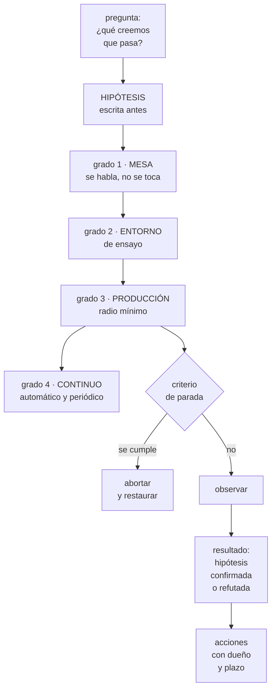

# 261 — Game days, chaos engineering y aprendizaje

> [← 260 · Change management, ventanas y rollback](../../part-21-cloud-operations-automation/260-change-management-ventanas-y-rollback/README.md) · [Índice de la parte](../README.md) · [262 · Capacity planning, cuotas y gestión de demanda →](../../part-21-cloud-operations-automation/262-capacity-planning-cuotas-y-gestion-de-demanda/README.md)

**Parte:** 21 — Operación cloud, automatización y respuesta a incidentes<br>
**Nivel:** avanzado · **Horas estimadas:** 4<br>
**Laboratorio:** `chaos` · **Estado:** `EXECUTABLE_CORE`

## 🎯 Propósito

Provocar los fallos a propósito para descubrir lo que no funciona antes de que lo descubra un incidente. La clase da el método de los ensayos —hipótesis, radio de impacto, criterio de parada—, la progresión de experimentos que no asusta a nadie, y la parte que casi siempre importa más que la técnica: **que lo que falla en un ensayo son las personas, los procedimientos y la información, no las máquinas**.

## 📚 Resultados de aprendizaje

Al finalizar podrás:

1. **Diseñar** un ensayo con hipótesis, radio de impacto y criterio de parada.
2. **Progresar** desde el ensayo de mesa hasta el experimento en producción.
3. **Elegir** qué fallos provocar según lo que se quiere aprender.
4. **Extraer** de cada ensayo acciones concretas, no una sensación.
5. **Justificar** el ejercicio ante quien teme romper producción.

## 🧩 Conceptos centrales

| Concepto | Comprensión verificable |
|---|---|
| `ensayo` | Ejercicio planificado en que se provoca un fallo para observar la respuesta completa: sistema, procedimientos y personas. |
| `hipótesis del ensayo` | Lo que se espera que ocurra, escrito antes. Sin ella el ejercicio no puede fallar y no enseña nada. |
| `radio de impacto` | Cuánto puede afectar el experimento como máximo. Se empieza mínimo y se amplía con evidencia. |
| `criterio de parada` | Condición escrita ante la cual el ejercicio se aborta de inmediato. |
| `ensayo de mesa` | Se recorre el escenario hablando, sin tocar nada. El grado más barato y el que más deriva descubre. |
| `experimento continuo` | Inyección de fallos automatizada y periódica, no un evento anual. |

## 🧠 Modelo mental

Operar es controlar cambios bajo incertidumbre: inventario, señal, diagnóstico, acción reversible y aprendizaje deben formar un ciclo cerrado.

Aplicado a esta clase, separa siempre cuatro planos: **intención** (qué necesita el usuario),
**configuración** (qué declaramos), **estado observado** (qué existe de verdad) y
**evidencia** (cómo sabemos que cumple). Confundirlos produce diseños que se ven correctos
en un diagrama pero fallan al operar.

## 🗺️ Flujo de razonamiento



## 📖 Desarrollo

### 1. Qué se está probando de verdad

El nombre engaña. Un ensayo no prueba si el sistema aguanta: prueba si la **organización** responde.

```text
LO QUE FALLA EN LOS ENSAYOS, por frecuencia
  1  la información no está donde debería
     el panel no muestra lo que hace falta
     la alerta no saltó, o saltó tarde
     nadie sabe dónde mirar

  2  el procedimiento está roto o no existe
     → el 56 % de CloudShop                 clase 259

  3  los permisos no alcanzan
     quien está de guardia no puede ejecutar el paso 4

  4  la coordinación
     tres personas haciendo lo mismo, nadie comunicando
                                            clase 257

  5  y solo entonces, el sistema
     el mecanismo de recuperación no funciona como se creía

→ los cuatro primeros son organizativos
→ y son los que más tiempo cuestan en un incidente real
```

Y por eso el ejercicio más barato es el más rentable:

```text
ENSAYO DE MESA
  una hora, una sala, un escenario
  quien lo dirige va describiendo lo que ocurre
  y los participantes dicen QUÉ HARÍAN y LO ENSEÑAN
    → «abro este panel» → que lo abra
    → «miro esta métrica» → que la enseñe
    → «ejecuto este paso» → que abra el procedimiento

→ no se toca nada, y aun así descubre 1, 2, 3 y 4
→ coste: 6 personas × 1 hora
→ y es donde debe empezar cualquier equipo
```

Y la regla que hace que el ensayo enseñe:

```text
HIPÓTESIS ESCRITA ANTES
  «cuando caiga la zona A, esperamos que
     el tráfico se redistribuya en menos de 60 s
     la latencia suba menos de 30 ms
     no haya errores visibles para el usuario
     y salte la alerta de instancias sanas»

→ y sin esto, el ensayo se convierte en «hemos roto algo
  y lo hemos arreglado»
→ que no es aprendizaje: es una anécdota
→ es la misma exigencia que este programa lleva
  aplicándose desde la parte 1
```

### 2. El método

Un ensayo tiene cinco partes y ninguna es opcional.

```text
1  PREGUNTA
   qué queremos saber que hoy no sabemos
   → y viene de un riesgo real, no de una lista genérica
   → «¿qué pasa si el proveedor de identidad no responde?»

2  HIPÓTESIS
   lo que esperamos, con números y con señales concretas
   → incluida la parte de detección: ¿saltará la alerta?

3  RADIO DE IMPACTO
   el máximo daño posible si todo sale mal
   → una instancia, no una zona
   → el 1 % del tráfico, no el 100 %
   → y se amplía SOLO con evidencia del anterior

4  CRITERIO DE PARADA
   escrito, medible, y decidido antes
   → «si los errores del usuario superan el 0,5 %,
     abortamos»
   → y quién puede declararlo: cualquiera

5  RESTAURACIÓN
   cómo se deshace, probado antes de empezar
   → y el interruptor del propio experimento
                                            clase 259
```

Y la logística que la gente subestima:

```text
ANUNCIARLO
  a todos los equipos que puedan verlo
  → un ensayo sorpresa produce un incidente real con
    gente confundida
  → y quema la confianza que el ejercicio necesita

EN HORARIO LABORAL
  con la gente delante, descansada y disponible
  → hacerlo de noche contradice el propósito

CON OBSERVADORES
  alguien que solo toma notas de lo que ocurre y CUÁNDO
  → incluidas las cosas que no se dicen: dudas,
    búsquedas, sitios donde se mira y no hay nada

Y CON LA GUARDIA REAL
  el ensayo lo responde quien estaría de guardia
  → no quien construyó el sistema
  → esa diferencia es la mitad del valor
```

Y la progresión de grados, que es lo que permite empezar sin permiso especial:

```text
GRADO 1  mesa                          riesgo cero
GRADO 2  entorno de ensayo             riesgo cero
         → y aquí se descubre que el entorno de ensayo no
           se parece a producción, que ya es un hallazgo
GRADO 3  producción, radio mínimo      riesgo acotado
         una instancia, un 1 %, una dependencia
GRADO 4  producción, radio amplio      riesgo real
         una zona entera, una región
GRADO 5  continuo y automático
         → inyección periódica, sin evento

→ y no se salta de grado sin haber tenido éxito en el
  anterior
→ la mayoría de las organizaciones sacan casi todo el
  valor de los grados 1 a 3
```

### 3. Qué fallos provocar

La elección debe venir de los riesgos del sistema, no de un catálogo. Pero el catálogo ayuda a no olvidarse.

```text
DE RECURSO
  matar una instancia                       clase 213
  agotar CPU, memoria o disco
  agotar un grupo de conexiones             clase 207
  llenar un volumen

DE RED, que son los más reveladores        clase 202
  latencia añadida a una dependencia
  → y esto encuentra fallos grises que nada más encuentra
    plazos mal configurados                clase 201
    reintentos sin límite
    ausencia de cortacircuitos
  pérdida de paquetes
  bloqueo de un destino concreto
  y partición entre zonas

DE DEPENDENCIA                              clase 185
  una dependencia devuelve errores
  una dependencia responde LENTO
    → casi siempre peor que si fallara
  el proveedor de identidad no responde     clase 209
  el registro de imágenes no responde
  y el gestor de secretos no responde       clase 197

DE ZONA Y REGIÓN                            clase 187
  retirar una zona
  conmutar de región de verdad, con reloj

DE DATOS                                    clase 243
  un flujo se para
  un esquema cambia
  llegan datos con una distribución distinta

Y DE PERSONAS, los más incómodos
  quien más sabe del servicio NO participa
  → «está de vacaciones»
  el panel principal no está disponible
  el canal de chat habitual no funciona
  → y esto prueba la comunicación de verdad  clase 257
```

Y el que más sorpresas da y menos se hace:

```text
LATENCIA AÑADIDA, no fallo
  200 ms extra en una dependencia

lo que suele aparecer
  plazos que eran mayores que el plazo del llamante
  reintentos que triplican la carga             clase 201
  grupos de conexiones que se agotan
  colas que crecen sin límite
  y una degradación que ninguna alerta detecta

→ porque los sistemas se prueban contra el fallo y casi
  nunca contra la LENTITUD
→ y la lentitud es la forma real en que fallan
                                        clase 185, ley 21
```

### 4. Del ensayo a la acción

Un ensayo sin acciones cerradas es teatro. Lo que lo convierte en aprendizaje:

```text
AL TERMINAR, EN CALIENTE (30 min)
  qué esperábamos y qué pasó
  qué nos sorprendió
  qué buscamos y no encontramos
  → esta última pregunta produce la mitad de las acciones
  qué habría pasado con radio mayor

Y DE AHÍ SALEN ACCIONES
  con dueño, con plazo y con seguimiento    clase 111
  y priorizadas por lo que habrían costado en un
  incidente real

Y LA COMPROBACIÓN DE QUE SIRVIÓ
  REPETIR EL MISMO ENSAYO en 8-12 semanas
  → y la hipótesis ahora debería cumplirse
  → y si no se cumple, las acciones no funcionaron

→ repetir es lo que distingue un programa de ensayos de
  una sucesión de eventos
```

Y cómo convencer a quien teme el ejercicio, que es la parte política:

```text
LA OBJECIÓN  «no vamos a romper producción a propósito»
LA RESPUESTA
  producción se rompe sola, a las 03:00, sin observadores
  y sin la gente que sabe
  → el ensayo es lo mismo con todo a favor
  → y el radio de impacto de un ensayo es MENOR que el de
    un incidente

Y CÓMO EMPEZAR SIN PEDIR PERMISO
  el ensayo de mesa no toca nada
  → y produce hallazgos suficientes para justificar el
    grado siguiente
  → CloudShop encontró 19 procedimientos rotos así
                                            clase 259

Y LA MÉTRICA QUE CONVENCE
  hallazgos por ensayo, y qué habría costado cada uno en
  un incidente real
```

Y el error que arruina programas de ensayos enteros:

```text
USAR LOS HALLAZGOS PARA SEÑALAR CULPABLES
  «el equipo X no sabía responder»
→ y al siguiente ensayo nadie participa de verdad
→ los hallazgos son del SISTEMA, siempre       clase 111

y el segundo error
  hacer el ensayo con quien construyó el servicio
  → responde por conocimiento, no por procedimiento
  → y el ensayo sale bien y no enseña nada
```

Y la lista de comprobación de la clase:

```text
☐ cada ensayo tiene pregunta e hipótesis escritas antes
☐ la hipótesis incluye si la detección funcionará
☐ hay radio de impacto mínimo y se amplía con evidencia
☐ hay criterio de parada medible y cualquiera puede
  declararlo
☐ la restauración está probada antes de empezar
☐ el ensayo se anuncia y se hace en horario laboral
☐ responde quien estaría de guardia, no quien lo construyó
☐ hay observador que anota qué se busca y no se encuentra
☐ se prueba latencia añadida, no solo fallo
☐ se ensaya también la ausencia de personas y de
  herramientas
☐ salen acciones con dueño y plazo
☐ el mismo ensayo se repite en 8-12 semanas
☐ los hallazgos nunca se usan para señalar personas
☐ hay progresión de grados y no se salta ninguno
```

Y el cierre que enlaza con la clase siguiente: los ensayos revelan qué se rompe cuando algo falla; queda saber qué se rompe cuando todo funciona y la demanda crece. Planificación de capacidad, cuotas y gestión de la demanda es la materia de la clase 262.

## 🔬 Ejemplo trabajado

**El programa de ensayos de CloudShop, de la primera sesión de mesa al experimento continuo. Lo que sigue son los hallazgos del ensayo que no tocó nada, el que abortó a los cuatro minutos, y el que descubrió que 200 ms de latencia hacían más daño que una caída.**

**Ensayo 1 · De mesa. Coste: 6 personas × 90 minutos.**

```text
escenario  «la base de datos principal de pedidos deja de
           aceptar escrituras a las 14:20 de un martes»

regla      cada participante ENSEÑA lo que dice que haría

hallazgos                                        gravedad
1  nadie sabía dónde ver si la base aceptaba
   escrituras; el panel mostraba CPU y
   conexiones                                       alta
2  el procedimiento de conmutación a la
   réplica databa de 11 meses y citaba un
   nombre de recurso inexistente                    alta
3  la alerta de «escrituras fallidas» existía
   pero apuntaba a un canal retirado                alta
4  dos personas creían que la conmutación
   era automática; no lo era                        alta
5  nadie sabía a quién avisar en el equipo
   de datos fuera de horario                       media
6  el tiempo estimado de conmutación variaba
   entre «2 minutos» y «media hora» según a
   quién se preguntara                             media

6 hallazgos, 4 graves, sin tocar nada
```

Y la observación que el equipo hizo:

```text
el hallazgo 4 era el peor
  dos de seis personas habrían esperado a que ocurriera
  algo que no iba a ocurrir
  → y esa espera, en el incidente real, habría sido de
    20-30 minutos

→ nadie descubre esa clase de suposición leyendo
  documentación
→ solo se descubre preguntando «¿y ahora qué haces?»
```

**Ensayo 4 · Producción, radio mínimo. El que abortó.**

```text
hipótesis  al retirar 1 de 11 instancias del servicio de
           catálogo, esperamos
             el tráfico se redistribuye en < 30 s
             el p99 sube menos de 20 ms
             cero errores de usuario
             y salta el aviso de instancias sanas

radio      1 instancia de 11
criterio   errores de usuario > 0,2 % durante 60 s
de parada

14:02  se retira la instancia
14:02  el tráfico se redistribuye en 8 s     ✓
14:03  p99 sube 12 ms                        ✓
14:04  errores de usuario: 0,7 %             ✗
14:04  ABORTADO; instancia restaurada
14:06  errores a 0

tiempo total de impacto              4 min, 0,7 % errores
```

Y la causa, que era lo que se buscaba:

```text
las sesiones de usuario estaban en memoria de la instancia
  → y la afinidad de sesión hacía que el 9 % del tráfico
    fuera a esa instancia
  → al retirarla, esos usuarios perdieron la sesión

→ nadie sabía que había estado en memoria
→ se había introducido 7 meses antes como «caché
  temporal»                                    clase 207

y la comparación que importa
  en el ensayo    4 minutos, 0,7 %, con todo el mundo
                  mirando, abortado por criterio
  en un incidente esa instancia se habría muerto sola una
                  noche, y el síntoma habría sido
                  «algunos usuarios pierden el carrito»,
                  intermitente e inexplicable
                                                clase 258
```

**Ensayo 7 · Latencia añadida. El que más enseñó.**

```text
hipótesis  al añadir 200 ms de latencia al servicio de
           inventario, esperamos que el flujo de compra se
           degrade proporcionalmente y siga funcionando

radio      10 % del tráfico
criterio   errores > 1 % o latencia del flujo > 3 s

lo que pasó
  minuto 0    +200 ms en inventario
  minuto 1    latencia del flujo de compra: 4.100 ms
              → 20 veces los 200 ms inyectados
  minuto 1    ABORTADO

y la causa, en cascada
  el servicio de compra llamaba a inventario 3 veces en
    serie                                     clase 106
    → 600 ms
  con reintentos de 2 intentos y plazo de 1 s
    → los 200 ms no disparaban reintento, pero la suma sí
  el grupo de conexiones al inventario era de 20
    → con llamadas más lentas, se agotó       clase 207
    → y las peticiones esperaban a tener conexión
  y no había cortacircuito                     clase 201

→ 200 ms de latencia producían 4.100 ms de degradación
→ y el mismo servicio, CAÍDO por completo, se degradaba
  mejor: el cliente fallaba rápido y el flujo mostraba
  «inventario no disponible» en 1,2 s

→ el fallo era MENOS dañino que la lentitud
                                              clase 185
```

Y las acciones que salieron:

```text
las 3 llamadas en serie pasaron a 1 en lote
se añadió cortacircuito con umbral de latencia
el grupo de conexiones se dimensionó y se alertó su
  saturación                                clase 207
y se añadió un plazo por LLAMADA además del total

y al repetir el ensayo, 9 semanas después
  +200 ms → latencia del flujo 1.240 ms
  → hipótesis cumplida
  → y el ensayo se subió a +500 ms: 1.480 ms
```

**Ensayo 11 · Sin las personas clave.**

```text
escenario  el mismo de la sesión de mesa (base sin
           escrituras), pero real, en entorno de ensayo
regla      las dos personas que más saben de la base OBSERVAN
           y no intervienen

resultado
  tiempo hasta identificar el problema             6 min
  tiempo hasta ejecutar la conmutación            31 min
    de los cuales, buscando el permiso              14 min
    y esperando confirmación de quién podía
    autorizarla                                     9 min

  → y las dos personas que observaban dijeron que ellas
    lo habrían hecho en 5 minutos
  → esa diferencia, 26 minutos, es exactamente el riesgo
    de que estén de vacaciones

acciones
  el rol de guardia recibió el permiso            clase 231
  la autorización se sustituyó por un criterio escrito
  y el procedimiento se convirtió en grado 2      clase 259

al repetir, 10 semanas después                    7 min
```

**El programa, a los 15 meses.**

```text
ensayos realizados                                    28
  de mesa                                             11
  en entorno de ensayo                                 9
  en producción, radio mínimo                          6
  en producción, radio amplio                          2

hallazgos                                            134
  organizativos (información, procedimiento,
  permisos, coordinación)                        91   68 %
  técnicos                                       43   32 %

ensayos abortados por criterio de parada               4
incidentes reales causados por un ensayo               0

ensayos repetidos con hipótesis cumplida al
  segundo intento                                 19/22
```

Y la comparación que el equipo llevó a la dirección:

```text
de los 134 hallazgos, 21 se clasificaron como «habría
causado o alargado un incidente grave»

coste del programa de ensayos, 15 meses     310 horas
coste medio de un incidente grave en
  CloudShop (tiempo de equipo + impacto)     ~40 horas

→ y aunque solo 8 de esos 21 se hubieran materializado,
  el programa se paga
→ y la sesión de mesa, que cuesta 9 horas, dio 6 hallazgos
  de los cuales 4 graves
```

**La lección que esta clase deja**: **el 68 % de los hallazgos fueron organizativos** —información que no estaba, procedimientos rotos, permisos que faltaban, coordinación— y esos son exactamente los que ninguna prueba automática encuentra. Y el ensayo más revelador no simuló una caída sino **200 ms de latencia**, que degradaron el flujo de compra a 4.100 ms: el servicio se comportaba mejor **caído del todo** que lento.

## 🧪 Laboratorio guiado

Ejecuta desde la raíz:

```bash
python classes/part-21-cloud-operations-automation/261-game-days-chaos-engineering-y-aprendizaje/lab.py
```

El laboratorio selecciona el motor de práctica **`chaos`** y produce
`lab_result.json`. El escenario, sus comprobaciones y el artefacto esperado corresponden a
esta clase; no requiere credenciales y deja explícito qué debe revalidarse en un sandbox real.

1. Lee `exercise.steps` y formula una predicción antes de ejecutar.
2. Ejecuta la práctica y verifica todos los elementos de `checks`.
3. Provoca el caso de `negative_test` y explica la señal observada.
4. Materializa `gameday-report` en `evidence/` usando la plantilla indicada.
5. Para proveedor real, sigue `sandbox.requires`, registra costo y ejecuta `destroy`.

### Evidencia esperada

El artefacto principal es una hipótesis de resiliencia y criterio de abortar. Además, la entrega debe incluir el comando ejecutado,
la salida estructurada y una conclusión que no exceda lo observado.

## 🏆 Reto verificable

Construye **`gameday-report`** para el caso CloudShop. Incluye una alternativa descartada,
un supuesto que pueda falsarse, una prueba de fallo y una decisión de rollback.

## ✅ Criterio de aceptación

- [ ] `lab.py` termina con código 0 y genera JSON válido.
- [ ] La entrega conecta al menos tres requisitos con mecanismos verificables.
- [ ] Existe una prueba positiva y una prueba negativa con evidencia.
- [ ] Seguridad, costo y operación aparecen como decisiones, no como anexos.
- [ ] Se declara una limitación y una condición que obligaría a revisar el diseño.
- [ ] Otra persona puede repetir el recorrido sin conocimiento tácito.

## ⚠️ Errores frecuentes

| Síntoma | Causa probable | Corrección |
|---|---|---|
| El ensayo sale bien y no se aprende nada | Lo respondió quien construyó el sistema, con conocimiento en vez de procedimiento | Que responda quien estaría de guardia y que quien lo construyó solo observe; esa diferencia es la mitad del valor. |
| Después del ensayo queda una sensación pero ninguna mejora | No había hipótesis escrita ni salieron acciones con dueño y plazo | Escribe la hipótesis antes, incluida la detección; y cierra con acciones priorizadas y repetición del ensayo en 8-12 semanas. |
| El ensayo causó un incidente real y ahora nadie quiere repetir | Radio de impacto demasiado grande, sin criterio de parada o sin restauración probada | Empieza por mesa y radio mínimo, con criterio de parada medible que cualquiera pueda declarar y restauración probada antes. |
| Se prueban caídas y en producción los problemas vienen de lentitud | Solo se inyecta fallo, no latencia | Inyecta latencia añadida: descubre plazos mal puestos, reintentos, grupos de conexiones y falta de cortacircuitos. |
| La participación baja tras los primeros ensayos | Los hallazgos se usaron para señalar a personas o equipos | Los hallazgos son del sistema; publica lo que faltaba en información y procedimientos, nunca quién no supo responder. |
| Nunca se aprueba hacer ensayos en producción | Se pide permiso para el grado alto antes de demostrar valor con el bajo | Empieza con ensayos de mesa, que no tocan nada, y usa sus hallazgos para justificar el grado siguiente. |

## 🛡️ Seguridad, ética y costo

Trabaja con cuentas propias o sandboxes autorizados. No publiques secretos, identificadores
reales ni datos personales. Antes de crear recursos pagos define presupuesto, etiquetas y
comando de destrucción; después verifica que no queden recursos huérfanos. Los ejemplos
locales enseñan contratos, pero no certifican cumplimiento ni disponibilidad de producción.

## ❓ Preguntas de comprobación

1. ¿Qué cinco partes tiene un ensayo bien diseñado?
2. ¿Por qué el ensayo de mesa es el de mejor relación entre coste y hallazgos?
3. ¿Por qué inyectar latencia enseña más que inyectar fallos?
4. ¿Qué se pierde si el ensayo lo responde quien construyó el sistema?
5. ¿Cómo se comprueba que las acciones de un ensayo sirvieron?

## 🔗 Referencias

- Basiri, A. y otros (2016). *Chaos engineering*, IEEE Software. <https://ieeexplore.ieee.org/document/7436642>
- Rosenthal, C. y Jones, N. (2020). *Chaos Engineering: system resiliency in practice*. <https://www.oreilly.com/library/view/chaos-engineering/9781492043850/>
- Google (2018). *The Site Reliability Workbook*, cap. «Testing for reliability» y DiRT. <https://sre.google/workbook/reliable-product-launches/>
- AWS (2024). *Fault Injection Service — experiment design*. <https://docs.aws.amazon.com/fis/latest/userguide/what-is.html>
- Microsoft (2024). *Azure Chaos Studio*. <https://learn.microsoft.com/azure/chaos-studio/chaos-studio-overview>
- Documentación oficial vigente del servicio implementado; registra URL y fecha de consulta.

---

> [Evaluación](assessment.md) · [Contrato de clase](lesson.yaml) · [Índice de la parte](../README.md)

**📥 Descargar:** [Parte 21 en PDF](../../../site/downloads/partes/manual-parte-21-cloud-operations-automation.pdf) · [Manual integral](../../../site/downloads/multi-cloud-engineering-manual-v2.0.pdf)

| Anterior | Índice | Siguiente |
|---|---|---|
| [← 260 · Change management, ventanas y rollback](../../part-21-cloud-operations-automation/260-change-management-ventanas-y-rollback/README.md) | [Parte 21](../README.md) · [Programa](../../README.md) | [262 · Capacity planning, cuotas y gestión de demanda →](../../part-21-cloud-operations-automation/262-capacity-planning-cuotas-y-gestion-de-demanda/README.md) |
