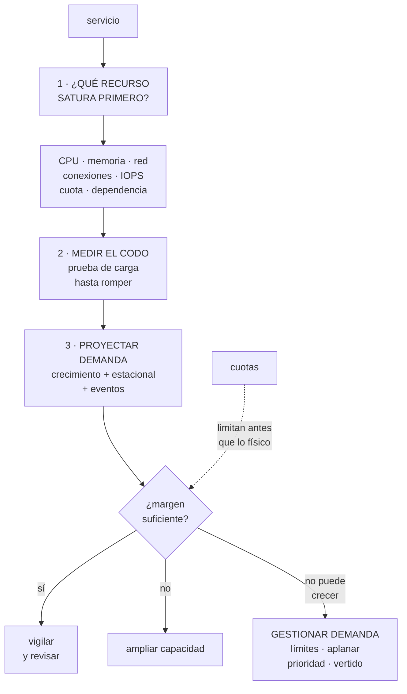

# 262 — Capacity planning, cuotas y gestión de demanda

> [← Clase anterior](../../part-21-cloud-operations-automation/261-game-days-chaos-engineering-y-aprendizaje/README.md) · [Índice de la parte](../README.md) · [Clase siguiente →](../../part-21-cloud-operations-automation/263-aiops-automatizacion-asistida-y-limites-humanos/README.md)

**Parte:** 21 — Operación cloud, automatización y respuesta a incidentes<br>
**Nivel:** avanzado · **Horas estimadas:** 4<br>
**Laboratorio:** `capacity` · **Estado:** `EXECUTABLE_CORE`

## 🎯 Propósito

Planificar capacidad en un entorno elástico, donde el problema ya no es comprar máquinas sino **saber dónde está el límite antes de chocar con él**. La clase da el método —encontrar el recurso que satura primero, medir el codo, proyectar la demanda—, el inventario de cuotas que causa la mayoría de las sorpresas, y las palancas para gestionar la demanda cuando la capacidad no da.

## 📚 Resultados de aprendizaje

Al finalizar podrás:

1. **Identificar** el recurso que satura primero en cada servicio.
2. **Medir** el codo con una prueba de carga que sirva para decidir.
3. **Proyectar** demanda con crecimiento, estacionalidad y eventos.
4. **Inventariar** las cuotas que limitan antes que la capacidad.
5. **Gestionar** la demanda cuando la capacidad no puede crecer.

## 🧩 Conceptos centrales

| Concepto | Comprensión verificable |
|---|---|
| `recurso limitante` | El que satura primero. Determina el límite del servicio; ampliar cualquier otro no sirve de nada. |
| `codo` | Punto en que la latencia deja de crecer despacio y se dispara. El límite útil, no el teórico. |
| `cuota` | Límite impuesto por el proveedor o por la organización. Suele llegar antes que el límite físico. |
| `margen` | Distancia entre la carga actual y el codo. Se dimensiona por el tiempo que se tarda en reaccionar. |
| `gestión de demanda` | Reducir o aplanar la carga en vez de aumentar la capacidad. |
| `vertido de carga` | Rechazar parte de la demanda deliberadamente para que el resto siga funcionando. |

## 🧠 Modelo mental

Operar es controlar cambios bajo incertidumbre: inventario, señal, diagnóstico, acción reversible y aprendizaje deben formar un ciclo cerrado.

Aplicado a esta clase, separa siempre cuatro planos: **intención** (qué necesita el usuario),
**configuración** (qué declaramos), **estado observado** (qué existe de verdad) y
**evidencia** (cómo sabemos que cumple). Confundirlos produce diseños que se ven correctos
en un diagrama pero fallan al operar.

## 🗺️ Flujo de razonamiento



## 📖 Desarrollo

### 1. Encontrar el recurso limitante

La elasticidad no elimina la planificación de capacidad: la traslada. Ya no se planifica cuándo comprar, sino **dónde está el techo y cuánto se tarda en llegar**.

```text
CADA SERVICIO TIENE UN RECURSO QUE SATURA PRIMERO
  y casi nunca es la CPU, aunque sea lo que todos miran

candidatos, por frecuencia real
  conexiones a la base                       clase 207
  memoria                                    clase 213
  IOPS o rendimiento del disco               clase 190
  ancho de banda o paquetes por segundo      clase 198
  cuota del proveedor                        clase 217
  una dependencia aguas abajo                clase 185
  un bloqueo o una partición caliente        clase 208
  el número de hilos o de sockets
  y la CPU, sí, pero menos veces de lo que se cree

→ y ampliar lo que no es el limitante no cambia nada
→ y esto explica el incidente de la clase 258: añadir una
  réplica de lectura no mejoró nada porque el limitante
  era un disco degradado
```

Y cómo se identifica, que no es adivinando:

```text
SE CARGA HASTA ROMPER Y SE MIRA QUÉ SE ACABÓ
  y se mira CUANTO hay, a la vez, no solo lo sospechoso

y el patrón revelador
  la latencia se dispara MIENTRAS la CPU está al 40 %
  → entonces el limitante es una espera, no un cálculo
  → conexiones, bloqueos, dependencia, cuota o disco

y la trampa de escalar
  añadir instancias multiplica las conexiones a la base
  → y el limitante empeora al escalar
  → el escalado automático puede tumbar la base
                                        clases 207, 212
```

Y la ley de Little, que evita muchas pruebas:

```text
concurrencia = tasa de llegada × tiempo de servicio

  1.000 peticiones/s × 0,2 s = 200 en curso
  → y si el grupo de conexiones tiene 50, ese es el techo
  → 50 / 0,2 = 250 peticiones/s como máximo

→ y con esta cuenta se descubren techos sin cargar nada
→ y explica por qué una dependencia más lenta reduce el
  caudal aunque nada falle              clases 201, 261
```

### 2. El codo y el margen

El límite útil no es donde el sistema deja de responder: es donde deja de responder **bien**.

```text
LA CURVA
  carga baja       latencia plana
  carga media      latencia sube despacio
  EL CODO          latencia se dispara
  más allá         colas, plazos, cascada

→ y entre el codo y el fallo total suele haber muy poco
→ el codo típico está entre el 60 % y el 80 % de
  utilización del recurso limitante
→ nunca en el 100 %

y por qué
  a medida que la utilización se acerca a 1, el tiempo de
  espera crece de forma no lineal
  → al 50 % de utilización, la espera es comparable al
    servicio
  → al 90 %, es unas nueve veces mayor
  → planificar «al 95 % de uso» es planificar el desastre
```

Y cómo se mide de forma que sirva:

```text
PRUEBA DE CARGA ÚTIL
  con tráfico REALISTA en forma, no solo en volumen
    → mezcla de operaciones, tamaños, distribución de
      claves                                clase 208
  con datos de tamaño realista
    → una base con 10.000 filas no se parece a una con
      400 millones
  subiendo por escalones y esperando estabilización
  midiendo latencia por percentiles, no la media
  y ANOTANDO qué recurso se acaba en cada escalón

y qué NO sirve
  medir el máximo de peticiones por segundo sin mirar la
  latencia
  → ese número siempre existe y nunca es útil
```

Y cómo se dimensiona el margen:

```text
EL MARGEN SE MIDE EN TIEMPO, NO EN PORCENTAJE
  «¿cuánto tardamos en añadir capacidad?»
    escalado automático              1-3 minutos
    cuota que hay que solicitar      horas o días
    capacidad reservada              días
    rediseño                         semanas

  → y el margen debe cubrir el crecimiento durante ESE
    tiempo, más el pico

y la pregunta que ordena todo
  «si el tráfico se duplicara ahora mismo, ¿qué se rompe
  primero y en cuánto tiempo?»
  → si no se sabe responder, no hay plan de capacidad
```

Y las tres alertas de capacidad que hacen falta:

```text
  proximidad al codo del recurso limitante
  proximidad a cada CUOTA relevante
  y tendencia: «a este ritmo, se llega en N días»
  → la tercera es la única que da tiempo a reaccionar
                                              clase 256
```

### 3. Cuotas: el techo que llega antes

En la nube, la mayoría de los topes con los que se choca no son físicos. Son cuotas.

```text
CLASES DE CUOTA
  por cuenta o suscripción
  por región
  por servicio
  por operación (peticiones por segundo a la API de
    control)
  y algunas ajustables, otras no                clase 217

DÓNDE APARECEN, con más frecuencia
  direcciones IP públicas y elásticas
  núcleos por familia de instancia y por región
  reglas por grupo de seguridad y grupos por interfaz
  conexiones concurrentes al balanceador
  invocaciones concurrentes de funciones      clase 214
  rendimiento provisionado de tablas y colas
  peticiones por segundo a la API de gestión
    → y esta es la que sorprende a la infraestructura
      como código                             clase 128
  cuotas de servicios gestionados de datos y de IA
                                              clase 248
```

Y lo que hace que las cuotas causen incidentes:

```text
1  SON POR REGIÓN
   se amplía en una y se olvida la de conmutación
   → y la conmutación falla justo cuando se necesita
                                            clase 187
2  SON POR CUENTA
   y el equipo que las consume no es el que las pidió
   → un entorno de ensayo puede agotar la cuota de
     producción si comparten cuenta            clase 219
3  NO AVISAN
   se llega al 100 % sin señal previa, salvo que se
   configure
4  Y SE AMPLÍAN CON RETRASO
   de horas a días, y a veces con negociación
   → pedirla durante el incidente es tarde

EL INVENTARIO MÍNIMO
  qué cuotas nos afectan, por región y por cuenta
  cuál es el valor actual y cuál el consumo
  cuál es el plazo para ampliarla
  y alerta al 70 % y al 85 %
  → generado automáticamente, no mantenido a mano
```

Y el caso especial de la cuota del plano de control:

```text
las herramientas de infraestructura como código consultan
mucho
  → y con muchos recursos, se alcanza el límite de
    peticiones
  → y el síntoma es una aplicación que falla a mitad, de
    forma intermitente                        clase 128
  → y no aparece en ningún panel de capacidad
```

### 4. Cuando la capacidad no puede crecer

A veces no se puede ampliar: la cuota tarda, la dependencia no escala, el coste no lo permite. Entonces se gestiona la demanda.

```text
PALANCAS, de menos a más visible para el usuario

1  QUITAR TRABAJO INNECESARIO
   reintentos excesivos                       clase 201
   sondeos que podrían ser eventos             clase 210
   consultas que traen más de lo que usan
   y trabajo duplicado por falta de caché      clase 207
   → y aquí suele haber entre un 20 % y un 40 % de la
     carga

2  APLANAR EL PICO
   mover lo que no es interactivo a las horas valle
   → informes, reprocesos, sincronizaciones
   encolar en vez de atender en línea          clase 210
   → convierte un pico en una cola más larga

3  LÍMITES POR CLIENTE
   cuotas por consumidor, no solo globales
   → evita que uno consuma la capacidad de todos
   → y es la defensa contra el vecino ruidoso

4  DEGRADACIÓN POR PRIORIDAD
   lo esencial sigue; lo accesorio se apaga
   → recomendaciones, informes, funciones de adorno
   → decidido ANTES, con negocio, no durante   clase 105

5  VERTIDO DE CARGA
   rechazar deliberadamente parte de la demanda
   → rápido y con un error claro, no con una espera
   → es MEJOR que caer entero
   → y hay que probarlo, porque casi nunca se ha probado
                                              clase 261
```

Y la aritmética que justifica el vertido:

```text
capacidad 1.000 peticiones/s, llegan 1.400
  sin vertido   todo se encola; la latencia se dispara;
                los plazos vencen; los clientes
                reintentan; llegan 2.100
                → y se sirve prácticamente nada
  con vertido   se sirven 1.000 bien y se rechazan 400
                rápido
                → el 71 % de los usuarios queda servido

→ y el fallo de no verter es que el sistema entrega CERO
  en vez de la mayoría
→ este es el mecanismo de la ley 21, en capacidad
```

Y la lista de comprobación de la clase:

```text
☐ se sabe qué recurso satura primero en cada servicio
☐ el codo está medido, no supuesto
☐ las pruebas de carga usan forma y volumen de datos
  realistas
☐ el margen se dimensiona por el tiempo de reacción
☐ hay alerta de tendencia, no solo de umbral
☐ existe inventario de cuotas por región y por cuenta,
  automático
☐ las cuotas de la región de conmutación están ampliadas
☐ hay alerta al 70 % y al 85 % de cada cuota relevante
☐ se vigila la cuota de peticiones al plano de control
☐ se ha respondido a «si el tráfico se duplica, ¿qué se
  rompe y en cuánto?»
☐ hay límites por cliente, no solo globales
☐ la degradación por prioridad está decidida con negocio
☐ el vertido de carga existe y se ha probado
☐ escalar no empeora el recurso limitante
```

Y el cierre que enlaza con la clase siguiente: hasta aquí, la operación la hacen personas con herramientas. Qué parte puede delegarse en sistemas que aprenden, qué gana y dónde está el límite que no conviene cruzar, es la materia de la clase 263.

## 🔬 Ejemplo trabajado

**CloudShop prepara la temporada alta. Lo que sigue es la prueba que reveló que el recurso limitante no era el que todos creían, la cuota que habría hecho fracasar la conmutación de región, y el vertido de carga que salvó el pico.**

**Primera pregunta: ¿qué satura primero?**

```text
creencia del equipo   «la CPU del servicio de catálogo»
                      → era lo que mostraba el panel

prueba de carga por escalones, midiendo todo

  peticiones/s   p99      CPU    conexiones   IOPS   memoria
         500    120 ms    22 %      18/50     31 %     41 %
       1.000    145 ms    39 %      34/50     58 %     44 %
       1.500    210 ms    51 %      48/50     79 %     46 %
       1.700    890 ms    54 %      50/50     84 %     47 %
       1.900  4.200 ms    55 %      50/50     84 %     47 %

→ EL CODO ESTÁ EN 1.600 peticiones/s
→ con la CPU al 52 %
→ el limitante son las CONEXIONES a la base  clase 207
```

Y la comprobación con la ley de Little:

```text
50 conexiones / 0,031 s de tiempo en base = 1.612 pet/s
→ coincide con el codo medido
→ y se podría haber calculado sin cargar nada
```

Y la trampa que se descubrió al intentar arreglarlo:

```text
primer intento: escalar de 11 a 22 instancias
  → cada instancia tiene su propio grupo de 50
  → 22 × 50 = 1.100 conexiones contra la base
  → la base admite 800
  → la base rechazó conexiones y el servicio EMPEORÓ

→ escalar el servicio empeoró el recurso limitante
→ la solución fue un intermediario de conexiones y bajar
  el grupo por instancia a 15                clase 207

codo tras el cambio                       4.100 pet/s
coste del cambio                          9 horas
coste de la alternativa (base mayor)      +3.100 USD/mes
```

**Segunda: el inventario de cuotas.**

```text
generado automáticamente por cuenta y región
  cuotas relevantes encontradas                      63
  con consumo por encima del 70 %                     9
  con consumo por encima del 85 %                     4
```

Y las cuatro por encima del 85 %:

```text                                consumo   plazo ampliación
direcciones IP elásticas, región
  principal                              47/50        2 días
núcleos de la familia de cómputo
  general                             892/1.000        3 días
invocaciones concurrentes de
  funciones                          780/1.000     inmediato
reglas por grupo de seguridad            56/60     inmediato
```

Y el hallazgo grave, que estaba en la región secundaria:

```text
la región de conmutación tenía las cuotas POR DEFECTO
  núcleos                              32 (frente a 1.000)
  direcciones IP elásticas              5 (frente a 50)
  rendimiento de la tabla de pedidos    por defecto

→ el plan de continuidad suponía levantar el 100 % de la
  capacidad allí
→ y la cuota permitía el 3,2 %
→ el ensayo de conmutación nunca había levantado más de
  4 instancias, así que nunca lo detectó   clase 261

→ y ampliar esas cuotas tardó 4 días
→ durante un incidente real, ese plan habría fracasado
  entero                                  clases 187, 189
```

**Tercera: la proyección para temporada alta.**

```text
base                pico actual        1.240 pet/s
crecimiento         +34 % interanual
estacionalidad      ×3,1 el pico de noviembre frente al
                    de un martes normal
evento              campaña de televisión, 2 días
                    → ×1,6 adicional durante 40 minutos

proyección
  1.240 × 1,34 × 3,1              = 5.151 pet/s
  con el evento, ×1,6             = 8.242 pet/s

capacidad tras el arreglo del limitante   4.100 pet/s
  → insuficiente incluso sin el evento
```

Y las decisiones, por palanca:

```text
1  QUITAR TRABAJO INNECESARIO
   sondeo del estado del pedido cada 5 s desde el navegador
     → sustituido por eventos                clase 210
     → -22 % de peticiones
   reintentos sin retroceso en la aplicación móvil
     → corregidos                            clase 201
     → -9 % en momentos de degradación

   pico proyectado tras esto              6.428 pet/s

2  APLANAR
   la generación de informes de comerciantes se movió a
   las 03:00                                  -6 %
   la sincronización de catálogo pasó a cola   -4 %

   pico proyectado                        5.784 pet/s

3  AMPLIAR CAPACIDAD
   intermediario de conexiones dimensionado para 9.000
   escalado automático con margen de 3 minutos
   cuotas ampliadas en ambas regiones

   capacidad                              9.200 pet/s

4  Y AUN ASÍ, VERTIDO DE CARGA PREPARADO
   por si la proyección se quedaba corta
```

**El día del evento.**

```text
pico real                              10.870 pet/s
  proyectado                            5.784
  → 1,88 veces la proyección
  → la campaña rindió mucho más de lo previsto

11:42  se supera la capacidad (9.200)
11:42  entra el vertido de carga
         prioridad 1  compra y pago             se sirve
         prioridad 2  catálogo y búsqueda       se sirve
         prioridad 3  recomendaciones           apagado
         prioridad 4  histórico y reseñas       vertido
11:42-12:31  vertido activo, 49 minutos

resultado
  peticiones rechazadas             8,4 % del total
  compras completadas               100 % de las
                                    intentadas
  p99 del flujo de compra           340 ms
  incidentes                        0
```

Y la comparación con el año anterior, sin vertido:

```text                                   año anterior    este año
pico                              4.900 pet/s   10.870 pet/s
capacidad                         3.800 pet/s    9.200 pet/s
exceso                                  1,29×          1,18×

lo que pasó
  latencia p99                       31 s          340 ms
  compras completadas                 41 %           100 %
  duración del incidente          2 h 40 min             -
  ingresos perdidos estimados     alto             ~0

→ con un exceso PARECIDO, un año cayó y el otro no
→ la diferencia fue verter en vez de encolar
```

Y lo que el equipo anotó como lección de proyección:

```text
la proyección falló por 1,88×
  → y la planificación aguantó igualmente

porque el plan no era «acertar la proyección»
  sino «tener una respuesta cuando la proyección falle»
  → capacidad para lo proyectado
  → y vertido para lo que no se proyectó

→ y esa es la diferencia entre planificar capacidad y
  adivinar el futuro
```

**La lección que esta clase deja**: el recurso limitante no era la CPU sino **50 conexiones**, y escalar el servicio de 11 a 22 instancias **empeoró** el problema porque multiplicó las conexiones contra la base. Y la región de conmutación tenía cuotas para el **3,2 %** de la capacidad que el plan de continuidad daba por hecha, algo que ningún ensayo había detectado porque ninguno había levantado más de cuatro instancias.

## 🧪 Laboratorio guiado

Ejecuta desde la raíz:

```bash
python classes/part-21-cloud-operations-automation/262-capacity-planning-cuotas-y-gestion-de-demanda/lab.py
```

El laboratorio selecciona el motor de práctica **`capacity`** y produce
`lab_result.json`. El escenario, sus comprobaciones y el artefacto esperado corresponden a
esta clase; no requiere credenciales y deja explícito qué debe revalidarse en un sandbox real.

1. Lee `exercise.steps` y formula una predicción antes de ejecutar.
2. Ejecuta la práctica y verifica todos los elementos de `checks`.
3. Provoca el caso de `negative_test` y explica la señal observada.
4. Materializa `capacity-plan` en `evidence/` usando la plantilla indicada.
5. Para proveedor real, sigue `sandbox.requires`, registra costo y ejecuta `destroy`.

### Evidencia esperada

El artefacto principal es requests, límites y una decisión de escalado medida. Además, la entrega debe incluir el comando ejecutado,
la salida estructurada y una conclusión que no exceda lo observado.

## 🏆 Reto verificable

Construye **`capacity-plan`** para el caso CloudShop. Incluye una alternativa descartada,
un supuesto que pueda falsarse, una prueba de fallo y una decisión de rollback.

## ✅ Criterio de aceptación

- [ ] `lab.py` termina con código 0 y genera JSON válido.
- [ ] La entrega conecta al menos tres requisitos con mecanismos verificables.
- [ ] Existe una prueba positiva y una prueba negativa con evidencia.
- [ ] Seguridad, costo y operación aparecen como decisiones, no como anexos.
- [ ] Se declara una limitación y una condición que obligaría a revisar el diseño.
- [ ] Otra persona puede repetir el recorrido sin conocimiento tácito.

## ⚠️ Errores frecuentes

| Síntoma | Causa probable | Corrección |
|---|---|---|
| Se amplía capacidad y el rendimiento no mejora | Se amplió un recurso que no era el limitante | Carga hasta romper midiendo todos los recursos y comprueba cuál se acaba; si la latencia se dispara con CPU baja, el limitante es una espera. |
| Escalar automáticamente tumbó la base de datos | Cada instancia nueva multiplica las conexiones contra un recurso compartido | Usa un intermediario de conexiones y dimensiona el grupo por instancia contando el total; comprueba que escalar no empeora el limitante. |
| La conmutación de región falló por falta de capacidad | Las cuotas de la región secundaria estaban en los valores por defecto | Inventaria cuotas por región y por cuenta, amplía las de la región de conmutación y ensaya levantando capacidad real, no cuatro instancias. |
| Se choca con un límite sin ningún aviso previo | Las cuotas no alertan por sí solas y no había alerta de tendencia | Genera el inventario de cuotas automáticamente con alerta al 70 % y al 85 %, y añade alerta de tendencia en días hasta agotarse. |
| En el pico el sistema entrega casi nada en vez de degradarse | Todo se encola, los plazos vencen y los clientes reintentan, multiplicando la carga | Implementa vertido de carga por prioridad y pruébalo; servir el 70 % bien es mejor que servir el 0 % lentamente. |
| La prueba de carga dice que se aguanta y en producción no | Se midió volumen sin forma realista, con datos pequeños y mirando la media | Reproduce la mezcla de operaciones y la distribución de claves con datos del tamaño real, y mide por percentiles anotando qué recurso se acaba. |

## 🛡️ Seguridad, ética y costo

Trabaja con cuentas propias o sandboxes autorizados. No publiques secretos, identificadores
reales ni datos personales. Antes de crear recursos pagos define presupuesto, etiquetas y
comando de destrucción; después verifica que no queden recursos huérfanos. Los ejemplos
locales enseñan contratos, pero no certifican cumplimiento ni disponibilidad de producción.

## ❓ Preguntas de comprobación

1. ¿Cómo se identifica el recurso limitante de un servicio?
2. ¿Por qué el codo aparece muy por debajo del 100 % de utilización?
3. ¿Cómo se dimensiona el margen de capacidad?
4. ¿Qué cuotas suelen causar incidentes y por qué no se ven venir?
5. ¿Por qué verter carga da mejor resultado que encolar en un pico?

## 🔗 Referencias

- Gunther, N. (2007). *Guerrilla Capacity Planning*. <https://link.springer.com/book/10.1007/978-3-540-31010-5>
- Google (2018). *The Site Reliability Workbook*, cap. «Managing load» y «Handling overload». <https://sre.google/sre-book/handling-overload/>
- AWS (2024). *Service Quotas — monitoring and requesting increases*. <https://docs.aws.amazon.com/servicequotas/latest/userguide/intro.html>
- Microsoft (2024). *Azure subscription and service limits, quotas, and constraints*. <https://learn.microsoft.com/azure/azure-resource-manager/management/azure-subscription-service-limits>
- Google Cloud (2024). *Quotas and limits*. <https://cloud.google.com/docs/quotas>
- Documentación oficial vigente del servicio implementado; registra URL y fecha de consulta.

---

> [Evaluación](assessment.md) · [Contrato de clase](lesson.yaml) · [Índice de la parte](../README.md)
