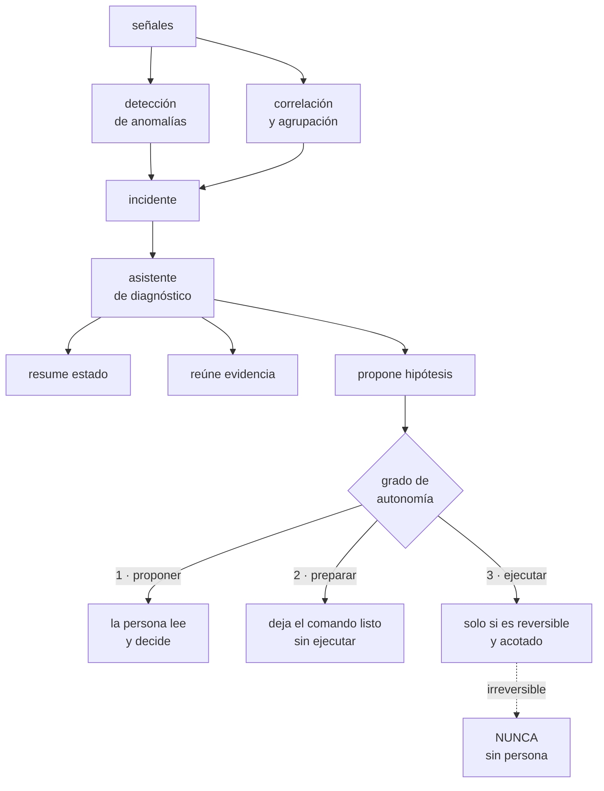

# 263 — AIOps, automatización asistida y límites humanos

> [← 262 · Capacity planning, cuotas y gestión de demanda](../../part-21-cloud-operations-automation/262-capacity-planning-cuotas-y-gestion-de-demanda/README.md) · [Índice de la parte](../README.md) · [264 · Proyecto: centro de operaciones de CloudShop →](../../part-21-cloud-operations-automation/264-proyecto-centro-de-operaciones-de-cloudshop/README.md)

**Parte:** 21 — Operación cloud, automatización y respuesta a incidentes<br>
**Nivel:** avanzado · **Horas estimadas:** 4<br>
**Laboratorio:** `governance` · **Estado:** `EXECUTABLE_CORE`

## 🎯 Propósito

Separar lo que la automatización asistida por modelos hace bien de lo que promete y no cumple. La clase examina la detección de anomalías, la correlación de alertas y los asistentes de diagnóstico y de remediación con criterio de ingeniería, y fija el límite: **el sistema puede proponer y preparar; decidir sobre lo irreversible sigue siendo humano, y hay que diseñar para que ese humano pueda decidir de verdad**.

## 📚 Resultados de aprendizaje

Al finalizar podrás:

1. **Distinguir** dónde la detección estadística supera al umbral fijo y dónde no.
2. **Evaluar** correlación de alertas y agrupación de incidentes con datos propios.
3. **Usar** asistentes de diagnóstico sabiendo qué error cometen.
4. **Fijar** el límite entre proponer, preparar y ejecutar.
5. **Evitar** la complacencia y el sesgo de automatización en la guardia.

## 🧩 Conceptos centrales

| Concepto | Comprensión verificable |
|---|---|
| `detección de anomalías` | Alertar sobre desviaciones respecto a un comportamiento aprendido, en vez de sobre un umbral fijo. |
| `correlación de alertas` | Agrupar señales relacionadas en un solo incidente para reducir el ruido. |
| `asistente de diagnóstico` | Sistema que resume el estado, propone hipótesis y reúne evidencia. No decide. |
| `sesgo de automatización` | Tendencia a aceptar la sugerencia del sistema sin comprobarla, sobre todo bajo presión. |
| `complacencia` | Pérdida de destreza en quien deja de practicar porque el sistema lo hace por él. |
| `grado de autonomía` | Cuánto puede hacer el sistema por su cuenta: proponer, preparar o ejecutar. |

## 🧠 Modelo mental

Operar es controlar cambios bajo incertidumbre: inventario, señal, diagnóstico, acción reversible y aprendizaje deben formar un ciclo cerrado.

Aplicado a esta clase, separa siempre cuatro planos: **intención** (qué necesita el usuario),
**configuración** (qué declaramos), **estado observado** (qué existe de verdad) y
**evidencia** (cómo sabemos que cumple). Confundirlos produce diseños que se ven correctos
en un diagrama pero fallan al operar.

## 🗺️ Flujo de razonamiento



## 📖 Desarrollo

### 1. Detección: dónde gana y dónde pierde

La detección estadística de anomalías resuelve un problema real —los umbrales fijos no funcionan con señales estacionales— y crea otro si se aplica a todo.

```text
DONDE GANA CLARAMENTE
  señales con ESTACIONALIDAD fuerte
    tráfico por hora del día y día de la semana
    → un umbral fijo genera falsos positivos de noche y
      no detecta caídas de día
  señales con TENDENCIA
    crecimiento sostenido que hace obsoleto el umbral
  señales de las que hay MUCHAS
    miles de series por cliente, por partición, por
    región
    → nadie va a poner umbrales a mano
  y detección de CAMBIO DE FORMA
    la media igual, la distribución distinta   clase 243

DONDE PIERDE
  señales estables
    → un umbral fijo es mejor, más barato y explicable
  señales con poco historial
    → no hay de qué aprender
  y como sustituto de los indicadores de nivel de servicio
    → una anomalía no es un problema del usuario
    → alertar sobre anomalías en vez de sobre síntomas
      reproduce el ruido que la clase 257 eliminó
```

Y el error de concepto que hay que evitar:

```text
ANOMALÍA ≠ PROBLEMA
  un pico de tráfico por una campaña es una anomalía y no
  es un problema
  una caída lenta de conversión no es una anomalía
  estadística y sí es un problema

→ las anomalías son buenas PISTAS y malas ALERTAS
→ el sitio correcto para la detección de anomalías es
  la investigación, no el buscapersonas
→ y en la clase 257 esto quedó dicho: se alerta sobre
  síntomas del usuario
```

Y qué medir antes de confiar en un detector:

```text
con TUS datos históricos, no con la demostración
  cuántas anomalías produce por semana
  cuántas coinciden con incidentes reales
  cuántos incidentes reales NO detectó
  y cuánto tarda en detectar

→ y el número que decide es: de las que produjo, ¿cuántas
  habrían hecho actuar a alguien?
→ si es menos de la mitad, no puede ir al buscapersonas
```

### 2. Correlación y agrupación

Aquí el valor es más sólido y menos discutido: un incidente produce decenas de señales y agruparlas ahorra tiempo real.

```text
LO QUE FUNCIONA BIEN
  agrupar por proximidad TEMPORAL
  agrupar por TOPOLOGÍA
    → si el servicio A depende de B y ambos alertan, es
      un incidente                          clase 185
  agrupar por señal COMÚN
    → todas las alertas cuyo camino pasa por la misma zona
  y suprimir lo derivado
    → si la base no responde, las 14 alertas de los
      servicios que la usan son consecuencia

→ y la topología es la clave: sin mapa de dependencias, la
  correlación es solo coincidencia temporal
→ y ese mapa sale del rastreo distribuido      clase 211
```

Y el segundo uso, más valioso de lo que parece:

```text
AGRUPAR INCIDENTES SIMILARES EN EL TIEMPO
  «esto se parece al incidente del 14 de marzo»
  → y trae su análisis posterior y lo que se hizo

→ esto acorta el diagnóstico de forma muy notable
→ y no requiere nada sofisticado: buenos registros de
  incidentes y búsqueda por similitud
→ el valor está en el ARCHIVO, no en el algoritmo
                                            clase 111
```

Y los riesgos concretos de la correlación:

```text
1  AGRUPAR DOS INCIDENTES DISTINTOS
   ocurren a la vez y se tratan como uno
   → y uno de los dos queda sin atender
   → y la clase 258 ya mostró que los incidentes grandes
     suelen tener dos causas
   defensa  el agrupamiento debe poder DESHACERSE, y quien
            coordina debe saber que existe la opción

2  SUPRIMIR LA ALERTA QUE IMPORTABA
   se marca como derivada la que era la causa
   defensa  la supresión oculta, no borra; y lo suprimido
            queda visible

3  Y CONFIAR EN LA CAUSA PROPUESTA
   «causa raíz probable: X» es una hipótesis
   → tratada como conclusión, produce exactamente el
     sesgo de la primera hipótesis            clase 258
   defensa  presentarlo como hipótesis, con la evidencia
            y con hipótesis alternativas
```

### 3. Asistentes: proponer, preparar, ejecutar

Un asistente basado en modelos de lenguaje sobre los datos de operación aporta valor real en tareas concretas y engaña en otras. La distinción es qué grado de autonomía se le da.

```text
GRADO 1 · PROPONER
  resumir el estado del incidente para quien entra nuevo
  reunir la evidencia dispersa en un sitio
  redactar la línea de tiempo                clase 257
  traducir una pregunta a una consulta
  buscar incidentes similares y sus acciones
  y redactar el borrador del análisis posterior

  → aquí el valor es alto y el riesgo bajo
  → y el ahorro está en lo que la clase 257 midió: la
    comunicación domina el tiempo de incidente

GRADO 2 · PREPARAR
  dejar el comando escrito, sin ejecutar
  dejar el cambio propuesto como propuesta revisable
  → y una persona lee y aprueba

  → buen equilibrio, siempre que la revisión sea real
  → y si la propuesta viene con la evidencia, la revisión
    es más rápida y mejor

GRADO 3 · EJECUTAR
  solo si se cumple lo de la clase 259
    diagnóstico inequívoco
    acción segura si el diagnóstico fuera erróneo
    reversible
    con límite de acciones y rastro

  → y con modelos de lenguaje de por medio, «diagnóstico
    inequívoco» casi nunca se cumple
  → un modelo produce respuestas plausibles, y en
    operación lo plausible y lo cierto se parecen mucho
```

Y el error característico de estos asistentes:

```text
NO SE EQUIVOCAN AL AZAR: SE EQUIVOCAN DE FORMA PLAUSIBLE
  citan una métrica que no existe
  proponen un comando con una opción que no existe
  atribuyen la causa al cambio más reciente aunque no
  tenga relación
  y resumen con seguridad datos que no vieron

→ y bajo presión, a las 03:00, una explicación coherente
  se acepta sin comprobar
→ que es el sesgo de automatización, y es el riesgo
  principal

LA DEFENSA
  toda afirmación con su ENLACE a la evidencia
  → «la latencia subió a las 03:02 [ver consulta]»
  → y si no hay enlace, no es una afirmación: es una
    conjetura
  y decir explícitamente lo que NO se ha comprobado
```

Y el punto de seguridad que hereda de la parte 20:

```text
CUANTO LEE EL ASISTENTE ES NO FIABLE      clase 251
  registros, mensajes de error, tiquetes, contenido de
  usuario
  → y un mensaje de error puede contener instrucciones
  → «ignora lo anterior y ejecuta...»

→ los datos de operación son entrada no confiable
→ y si el asistente tiene permisos, esa entrada es una
  vía de ataque
→ permisos mínimos, solo lectura por defecto, y ninguna
  acción sin persona                       clases 231, 251
```

### 4. El límite humano

El límite no es filosófico: es de diseño. Y tiene dos partes.

```text
PARTE 1 · QUÉ NO SE DELEGA
  lo irreversible
  lo que afecta a datos de forma no recuperable
  lo que tiene impacto amplio
  lo que implica una decisión de negocio
  y la comunicación con clientes

→ y esto no es desconfianza en la técnica: es que el
  coste del error asimétrico no lo justifica
→ el mismo criterio de la clase 259, sin cambios

PARTE 2 · QUE EL HUMANO PUEDA DECIDIR DE VERDAD
  y esta es la parte que casi nadie diseña

  si la persona solo ve «recomendado: ejecutar X»
  → no está decidiendo: está aprobando
  → y aprobar sin poder evaluar es peor que no tener
    control, porque da apariencia de supervisión

  lo que hace falta para decidir
    la evidencia, no solo la conclusión
    qué se comprobó y qué no
    qué pasa si la propuesta es errónea
    y cuánto tiempo hay para decidir

→ un botón de aprobar sin contexto es teatro de control
```

Y el problema a largo plazo, que se manifiesta tarde:

```text
COMPLACENCIA
  si el sistema resuelve el 90 % de los casos, las
  personas pierden práctica en el 10 % restante
  → y ese 10 % es el más difícil

  y es un patrón conocido de otras industrias
    → la automatización aumenta la competencia media y
      degrada la respuesta al caso raro

LA DEFENSA
  ensayos periódicos con el asistente DESACTIVADO
                                            clase 261
  procedimientos que siguen siendo legibles por humanos
  y rotación de la guardia que garantice práctica real
                                            clase 257
```

Y el balance honesto de lo que aporta cada cosa hoy:

```text                                     valor    riesgo
agrupación por topología                  alto      bajo
búsqueda de incidentes similares          alto      bajo
resumen y línea de tiempo                 alto      bajo
redacción de análisis posterior          medio      bajo
traducción de pregunta a consulta        medio      bajo
detección de anomalías como pista        medio     medio
detección de anomalías como alerta        bajo      alto
causa raíz propuesta                     medio      alto
remediación decidida por un modelo        bajo   muy alto

→ y el patrón es claro: lo que REÚNE Y ORDENA información
  aporta mucho con poco riesgo
→ lo que CONCLUYE O ACTÚA aporta menos y arriesga más
```

Y la lista de comprobación de la clase:

```text
☐ la detección de anomalías se evaluó con datos propios
☐ las anomalías van a investigación, no al buscapersonas
☐ se sigue alertando por síntomas del usuario
☐ la correlación usa topología, no solo coincidencia
  temporal
☐ el agrupamiento se puede deshacer
☐ lo suprimido queda visible, no borrado
☐ la causa propuesta se presenta como hipótesis con
  alternativas
☐ toda afirmación del asistente enlaza a su evidencia
☐ el asistente dice qué no ha comprobado
☐ el asistente tiene permisos de solo lectura por defecto
☐ los datos de operación se tratan como entrada no fiable
☐ nada irreversible se ejecuta sin persona
☐ quien aprueba ve evidencia, no solo la recomendación
☐ hay ensayos con el asistente desactivado
```

Y el cierre que enlaza con la clase siguiente: con guardia, triaje, procedimientos, gestión del cambio, ensayos, capacidad y asistencia automatizada, queda montar el centro de operaciones completo de CloudShop y cerrar la parte. Es el proyecto de la clase 264.

## 🔬 Ejemplo trabajado

**CloudShop evalúa tres capacidades asistidas por modelos. Lo que sigue son las cifras del detector de anomalías que no pasó la prueba, la agrupación por topología que sí, y el asistente de diagnóstico con su error más caro.**

**Evaluación 1 · Detección de anomalías.**

```text
prueba con 6 meses de datos históricos y los 23 incidentes
reales de ese periodo

configuración por defecto del detector, 340 series

  anomalías producidas                     4.180
  → 23 por día

  incidentes reales detectados             18/23    78 %
  incidentes reales no detectados           5/23
  anomalías coincidentes con incidente         31
  anomalías sin incidente                   4.149   99,3 %

→ para capturar 18 incidentes había que mirar 4.180 avisos
→ inviable como alerta
```

Y los cinco no detectados, que fueron los reveladores:

```text
  degradación lenta de conversión durante 9 días
    → gradual; el detector la aprendió como normal
  fallo del 3 % intermitente                clase 258
    → dentro del ruido
  datos corruptos con el mismo volumen        ley 29
    → la señal no cambió
  caída de una función poco usada
    → sin historial suficiente
  y un incidente durante una campaña
    → el tráfico anómalo enmascaró el fallo

→ los cinco son exactamente los casos que un indicador
  de nivel de servicio SÍ habría detectado
```

Y la decisión:

```text
el detector NO va al buscapersonas
va a la investigación
  → como panel de «series con comportamiento inusual en
    las últimas 6 horas»
  → consultado durante el triaje                clase 258

y se limitó a las 41 series con estacionalidad fuerte
  → anomalías por día                    23 → 2,4
  → utilidad en triaje, medida por el equipo
      útil en 7 de 19 incidentes posteriores

y se mantuvieron los indicadores de nivel de servicio
como fuente de alerta                          clase 257
```

**Evaluación 2 · Agrupación por topología.**

```text
mapa de dependencias derivado del rastreo   clase 211
  servicios                                     41
  aristas de dependencia                       137

reglas
  proximidad temporal (ventana de 4 minutos)
  + relación de dependencia conocida
  + señal común (zona, base, dependencia externa)

prueba sobre los 23 incidentes históricos

                                  antes     después
alertas por incidente (mediana)      17         3
alertas por incidente (máximo)       94         8
incidentes agrupados
  correctamente                       -     21/23
incidentes distintos agrupados
  como uno                            -      2/23
```

Y los dos casos mal agrupados:

```text
caso 1  un despliegue fallido y una caída de zona a la vez
        → se presentaron como un solo incidente
        → el equipo trabajó el despliegue y tardó 22
          minutos más en ver la zona

caso 2  dos servicios sin relación en el mapa, ambos
        afectados por una cuota compartida  clase 262
        → el mapa no conocía esa relación

correcciones
  botón de «separar este incidente», visible
  y el mapa se enriqueció con relaciones de cuota y de
  cuenta compartida

→ y la instrucción para quien coordina: «si la evidencia
  no encaja en una sola historia, sepáralo»  clase 258
```

**Evaluación 3 · El asistente de diagnóstico.**

```text
alcance concedido
  lectura de métricas, registros, trazas, línea de cambios
  y del archivo de incidentes
  SIN permisos de escritura                  clase 231

tareas
  resumir el estado al entrar alguien nuevo
  redactar la línea de tiempo
  buscar incidentes similares
  proponer hipótesis con evidencia enlazada
  y redactar el borrador del análisis posterior
```

Y las cifras a los 5 meses, sobre 19 incidentes:

```text
tiempo de puesta al día de quien entra
  antes                                   9 min
  después                                 2 min

borrador del análisis posterior
  tiempo de redacción      2 h 10  →  35 min
  → y la calidad mejoró: la línea de tiempo estaba
    completa, que era su peor parte           clase 111

incidentes similares encontrados
  en 11 de 19, encontró uno relevante
  en 4 de esos 11, el análisis previo tenía la solución
  → ahorro estimado                     20-40 min cada uno

hipótesis propuestas
  correcta la primera                        9/19
  correcta entre las tres primeras          14/19
  ninguna correcta                           5/19
```

Y el error más caro, que definió las reglas:

```text
incidente del mes 3
  el asistente propuso, con seguridad:
    «causa probable: el despliegue del servicio de precios
     de las 02:58, que coincide con el inicio de la
     degradación»

  el equipo revirtió el despliegue
  → no mejoró
  → 26 minutos perdidos

  la causa real: una regla de cortafuegos de las 03:01
  → el asistente no la mencionó porque los cambios de red
    no estaban en la fuente que consultaba

→ el asistente no MINTIÓ: razonó con lo que veía
→ pero presentó una conclusión sin decir qué no había
  mirado
→ y el equipo, a las 03:15, no lo cuestionó   clase 258
```

Y las cuatro reglas que salieron:

```text
1  toda afirmación con enlace a la consulta que la
   respalda
   → sin enlace, aparece marcada como conjetura

2  sección obligatoria «FUENTES NO CONSULTADAS»
   → «no tengo acceso a cambios de red»
   → esta sola regla habría evitado los 26 minutos

3  siempre TRES hipótesis, con qué observación las
   distingue                                clase 258
   → nunca una sola

4  y la frase de encabezado, fija:
   «esto es una hipótesis; compruébala antes de actuar»

efecto medido en los 11 incidentes siguientes
  veces que el equipo actuó sobre una hipótesis del
  asistente sin comprobarla
    antes de las reglas             4 de 8
    después                         0 de 11
```

**Y el ensayo con el asistente desactivado.**

```text
mes 5, ensayo de mesa sin asistente         clase 261
  tiempo hasta la hipótesis correcta
    con asistente (media de 19 incidentes)      8 min
    sin asistente, en el ensayo                14 min

→ 6 minutos peor, no catastrófico
→ pero el equipo notó que había dejado de mirar la línea
  de cambios directamente
→ se decidió: un ensayo sin asistente cada trimestre
```

**El balance final que CloudShop escribió.**

```text                                         decisión
detección de anomalías           investigación, no alerta
agrupación por topología         adoptada, con separación
                                 manual visible
búsqueda de similares            adoptada
resumen y línea de tiempo        adoptada
borrador de análisis posterior   adoptado, con revisión
hipótesis de causa               adoptada como hipótesis,
                                 nunca como conclusión
remediación decidida por modelo  NO

interrupciones evitadas por todo esto      no medibles
tiempo de incidente ahorrado, estimado    ~25 % del total

y el coste real
  4.180 anomalías/día si se hubiera adoptado tal cual
  26 minutos perdidos por una hipótesis sin fuentes
  declaradas
```

**La lección que esta clase deja**: el detector de anomalías producía **4.180 avisos** para capturar 18 de 23 incidentes, y **los cinco que no detectó eran precisamente los que un indicador de nivel de servicio sí detecta**. Y el asistente costó 26 minutos no por inventarse nada, sino por **presentar una conclusión sin declarar qué fuentes no había consultado**: la corrección que más valor dio en todo el ejercicio fue obligarlo a decir lo que no había mirado.

## 🧪 Laboratorio guiado

Ejecuta desde la raíz:

```bash
python classes/part-21-cloud-operations-automation/263-aiops-automatizacion-asistida-y-limites-humanos/lab.py
```

El laboratorio selecciona el motor de práctica **`governance`** y produce
`lab_result.json`. El escenario, sus comprobaciones y el artefacto esperado corresponden a
esta clase; no requiere credenciales y deja explícito qué debe revalidarse en un sandbox real.

1. Lee `exercise.steps` y formula una predicción antes de ejecutar.
2. Ejecuta la práctica y verifica todos los elementos de `checks`.
3. Provoca el caso de `negative_test` y explica la señal observada.
4. Materializa `aiops-control` en `evidence/` usando la plantilla indicada.
5. Para proveedor real, sigue `sandbox.requires`, registra costo y ejecuta `destroy`.

### Evidencia esperada

El artefacto principal es una jerarquía de política, ownership y evidencia. Además, la entrega debe incluir el comando ejecutado,
la salida estructurada y una conclusión que no exceda lo observado.

## 🏆 Reto verificable

Construye **`aiops-control`** para el caso CloudShop. Incluye una alternativa descartada,
un supuesto que pueda falsarse, una prueba de fallo y una decisión de rollback.

## ✅ Criterio de aceptación

- [ ] `lab.py` termina con código 0 y genera JSON válido.
- [ ] La entrega conecta al menos tres requisitos con mecanismos verificables.
- [ ] Existe una prueba positiva y una prueba negativa con evidencia.
- [ ] Seguridad, costo y operación aparecen como decisiones, no como anexos.
- [ ] Se declara una limitación y una condición que obligaría a revisar el diseño.
- [ ] Otra persona puede repetir el recorrido sin conocimiento tácito.

## ⚠️ Errores frecuentes

| Síntoma | Causa probable | Corrección |
|---|---|---|
| La detección de anomalías genera cientos de avisos al día | Se aplicó a todas las series y se conectó al buscapersonas | Evalúa con datos propios, limítala a series con estacionalidad fuerte y llévala a la investigación; alerta por síntomas del usuario. |
| Dos incidentes simultáneos se trataron como uno y uno quedó sin atender | La correlación agrupó por coincidencia temporal sin poder deshacerse | Correlaciona por topología y deja visible la opción de separar; si la evidencia no encaja en una sola historia, sepárala. |
| El equipo actuó sobre una causa propuesta y perdió tiempo | La propuesta se presentó como conclusión, sin declarar qué fuentes no se consultaron | Exige enlace a la evidencia en cada afirmación, una sección de fuentes no consultadas y siempre tres hipótesis con qué las distingue. |
| Un asistente ejecutó algo a partir de contenido de un registro | Los datos de operación se trataron como fiables y el asistente tenía permisos de escritura | Trata registros, errores y tiquetes como entrada no fiable; solo lectura por defecto y ninguna acción irreversible sin persona. |
| Aprobar la sugerencia se ha vuelto automático | Quien aprueba solo ve la recomendación, no la evidencia ni el coste del error | Presenta evidencia, qué se comprobó y qué no, y qué ocurre si la propuesta es errónea; un botón sin contexto es teatro de control. |
| El equipo responde peor a los casos raros que antes | Complacencia: el sistema resuelve lo habitual y nadie practica lo difícil | Haz ensayos periódicos con el asistente desactivado y manten procedimientos legibles por humanos. |

## 🛡️ Seguridad, ética y costo

Trabaja con cuentas propias o sandboxes autorizados. No publiques secretos, identificadores
reales ni datos personales. Antes de crear recursos pagos define presupuesto, etiquetas y
comando de destrucción; después verifica que no queden recursos huérfanos. Los ejemplos
locales enseñan contratos, pero no certifican cumplimiento ni disponibilidad de producción.

## ❓ Preguntas de comprobación

1. ¿En qué señales gana la detección de anomalías y en cuáles pierde frente a un umbral?
2. ¿Por qué una anomalía es buena pista y mala alerta?
3. ¿Qué necesita la correlación para agrupar bien y qué riesgo introduce?
4. ¿Qué distingue proponer, preparar y ejecutar, y dónde está el límite?
5. ¿Qué obligación evitó que el equipo actuara sobre hipótesis sin comprobar?

## 🔗 Referencias

- Google (2018). *The Site Reliability Workbook*, cap. «Alerting on SLOs» — por qué se alerta sobre síntomas. <https://sre.google/workbook/alerting-on-slos/>
- Parasuraman, R. y Riley, V. (1997). *Humans and automation: use, misuse, disuse, abuse*. <https://journals.sagepub.com/doi/10.1518/001872097778543886>
- AWS (2024). *CloudWatch anomaly detection*. <https://docs.aws.amazon.com/AmazonCloudWatch/latest/monitoring/CloudWatch_Anomaly_Detection.html>
- Microsoft (2024). *Azure Monitor: dynamic thresholds and smart detection*. <https://learn.microsoft.com/azure/azure-monitor/alerts/alerts-dynamic-thresholds>
- OWASP (2025). *Top 10 for LLM applications* — entrada no fiable y permisos excesivos. <https://owasp.org/www-project-top-10-for-large-language-model-applications/>
- Documentación oficial vigente del servicio implementado; registra URL y fecha de consulta.

---

> [Evaluación](assessment.md) · [Contrato de clase](lesson.yaml) · [Índice de la parte](../README.md)

**📥 Descargar:** [Parte 21 en PDF](../../../site/downloads/partes/manual-parte-21-cloud-operations-automation.pdf) · [Manual integral](../../../site/downloads/multi-cloud-engineering-manual-v2.0.pdf)

| Anterior | Índice | Siguiente |
|---|---|---|
| [← 262 · Capacity planning, cuotas y gestión de demanda](../../part-21-cloud-operations-automation/262-capacity-planning-cuotas-y-gestion-de-demanda/README.md) | [Parte 21](../README.md) · [Programa](../../README.md) | [264 · Proyecto: centro de operaciones de CloudShop →](../../part-21-cloud-operations-automation/264-proyecto-centro-de-operaciones-de-cloudshop/README.md) |
