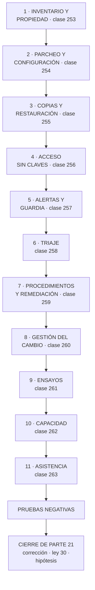

# 264 — Proyecto: centro de operaciones de CloudShop

> [← 263 · AIOps, automatización asistida y límites humanos](../../part-21-cloud-operations-automation/263-aiops-automatizacion-asistida-y-limites-humanos/README.md) · [Índice de la parte](../README.md) · [265 · Ruta Cloud Engineer y mapa de competencias →](../../part-22-specializations-certifications-career/265-ruta-cloud-engineer-y-mapa-de-competencias/README.md)

**Parte:** 21 — Operación cloud, automatización y respuesta a incidentes<br>
**Nivel:** avanzado · **Horas estimadas:** 8<br>
**Laboratorio:** `capstone` · **Estado:** `EXECUTABLE_CORE`

## 🎯 Propósito

Construir el centro de operaciones de CloudShop con todo lo de la parte 21 y comprobarlo. La clase da el encargo, el orden, el entregable y las pruebas negativas. Y cierra la parte 21: corrige las cinco predicciones de la clase 252 —dos acertadas y tres a medias—, actualiza el recuento de leyes, añade la ley 30 y escribe la hipótesis de la parte 22.

## 📚 Resultados de aprendizaje

Al finalizar podrás:

1. **Construir** una operación completa en el orden que evita rehacer.
2. **Comprobar** con las pruebas negativas acumuladas de la parte.
3. **Medir** la operación con cifras que resistan una revisión.
4. **Corregir** las cinco predicciones de la clase 252 con evidencia.
5. **Escribir** la hipótesis de la parte 22 en forma refutable.

## 🧩 Conceptos centrales

| Concepto | Comprensión verificable |
|---|---|
| `centro de operaciones` | El conjunto de inventario, señales, guardia, procedimientos, cambio y ensayos que hace operable un sistema. |
| `ley 30` | Toda tarea manual lleva un juicio que nadie escribió; automatizarla lo elimina sin avisar. |
| `orden por dependencia` | Inventario primero, automatización al final. No se puede automatizar lo que no se sabe que existe. |
| `prueba negativa de parte` | Comprobación acumulada de las once clases, ejecutada sobre la operación entera. |
| `trabajo repetitivo` | Tarea manual, sin valor duradero, que crece con el tamaño del sistema. |
| `hipótesis de parte` | Afirmación refutable escrita antes de estudiar, que la parte siguiente corrige con evidencia. |

## 🧠 Modelo mental

Operar es controlar cambios bajo incertidumbre: inventario, señal, diagnóstico, acción reversible y aprendizaje deben formar un ciclo cerrado.

Aplicado a esta clase, separa siempre cuatro planos: **intención** (qué necesita el usuario),
**configuración** (qué declaramos), **estado observado** (qué existe de verdad) y
**evidencia** (cómo sabemos que cumple). Confundirlos produce diseños que se ven correctos
en un diagrama pero fallan al operar.

## 🗺️ Flujo de razonamiento



## 📖 Desarrollo

### 1. El encargo, el orden y el entregable

**El encargo.** CloudShop opera 41 servicios en tres nubes, con un equipo de plataforma de nueve personas y equipos de producto que despliegan solos. Hay que dejar la operación en un estado en que una persona que entra hoy pueda estar de guardia en seis semanas.

**El orden**, por dependencia:

```text
1  INVENTARIO Y PROPIEDAD                     clase 253
   qué hay, en qué cuenta, de quién es, para qué sirve
   → sin esto, todo lo demás actúa sobre una parte del
     sistema y nadie sabe cuál

2  PARCHEO Y CONFIGURACIÓN                    clase 254
   imágenes construidas, no retocadas; configuración
   declarada y reconciliada

3  COPIAS Y RESTAURACIÓN                      clase 255
   copias inmutables, y restauración PROBADA con reloj

4  ACCESO SIN CREDENCIALES PERMANENTES        clase 256
   sesiones auditadas, elevación temporal, sin claves
   compartidas

5  ALERTAS Y GUARDIA                          clase 257
   se alerta por síntomas del usuario; rotación
   sostenible; roles separados

6  TRIAJE                                     clase 258
   línea de cambios única y orden de descarte

7  PROCEDIMIENTOS Y REMEDIACIÓN               clase 259
   ejecutables; automáticos solo donde procede

8  GESTIÓN DEL CAMBIO                         clase 260
   lotes pequeños, vuelta atrás probada, sin comité

9  ENSAYOS                                    clase 261
   de mesa hacia arriba, con hipótesis

10 CAPACIDAD Y CUOTAS                         clase 262
   recurso limitante, codo medido, inventario de cuotas

11 ASISTENCIA AUTOMATIZADA                    clase 263
   reúne y ordena; no concluye ni ejecuta
```

Y por qué este orden y no otro:

```text
los pasos 1 a 4 son el ESTADO del sistema
los pasos 5 a 8 son la RESPUESTA
los pasos 9 a 11 son la MEJORA

→ y hacer la respuesta sin el estado produce guardias que
  no pueden actuar
→ y hacer la mejora sin la respuesta produce ensayos que
  descubren lo obvio
→ intentar el paso 7 antes del 6 es el error más común: se
  automatiza sin saber diagnosticar
```

**El entregable**, que es lo que se evalúa:

```text
1  inventario generado automáticamente, con dueño por
   recurso y cobertura medida
2  la línea de cambios única, de todas las fuentes
3  el catálogo de alertas, con la prueba de accionabilidad
   pasada
4  el calendario de guardia con la carga por turno medida
5  los procedimientos, en grado 2 o 3, con fecha de última
   ejecución
6  el inventario de automatizaciones, con condiciones,
   límite e interruptor
7  las cuatro métricas de entrega, medidas
8  el inventario de cuotas, por cuenta y región, con
   alertas
9  el registro de ensayos, con hipótesis y acciones
   cerradas
10 y el registro de decisiones: qué NO se automatizó y por
   qué
```

### 2. Las pruebas negativas de la parte

Cada clase dejó una comprobación que falla en la mayoría de las organizaciones. Aquí se ejecutan todas sobre el sistema entero.

```text
clase 253  coge 20 recursos al azar del inventario
           → ¿los 20 tienen dueño identificable HOY?
           → y a la inversa: coge 20 recursos de la
             consola; ¿están en el inventario?

clase 254  coge una máquina de producción
           → ¿cuánto hace que se creó su imagen?
           → ¿hay algo instalado a mano en ella?

clase 255  RESTAURA una copia, con reloj
           → ¿cuánto tardó y qué se perdió?
           → ¿la copia sobrevive a quien tiene permisos de
             administrador?

clase 256  ¿queda alguna credencial permanente?
           → busca claves de acceso con más de 90 días
           → ¿alguien puede entrar sin dejar rastro?

clase 257  coge las 20 últimas alertas
           → ¿qué hizo quien las recibió?
           → si en más de 3 la respuesta es «nada»,
             el catálogo está roto

clase 258  ¿existe la línea de cambios única?
           → pide «todos los cambios de la última hora»
           → si hay que mirar en más de un sitio, no existe

clase 259  coge 5 procedimientos al azar y EJECÚTALOS
           → ¿cuántos funcionan íntegros?

clase 260  ¿cuál es la mediana de cambios por despliegue?
           → ¿cuándo se ejecutó la última vuelta atrás?
           → ¿qué porcentaje de cambios se declara urgente?

clase 261  retira una instancia de producción, ahora
           → ¿pasa lo que la hipótesis dice?

clase 262  «si el tráfico se duplica, ¿qué se rompe
           primero y en cuánto tiempo?»
           → y comprueba las cuotas de la región de
             conmutación

clase 263  coge una conclusión del asistente
           → ¿enlaza a la evidencia?
           → ¿dice qué fuentes no consultó?
```

Y la prueba que resume la parte entera:

```text
LA PRUEBA DE LAS SEIS SEMANAS
  coge a alguien que entró hace seis semanas
  ponle un incidente de mesa                  clase 261
  y observa
    ¿encuentra el inventario y el dueño?
    ¿encuentra la línea de cambios?
    ¿encuentra el procedimiento y funciona?
    ¿tiene los permisos para ejecutarlo?
    ¿sabe a quién escalar y cuándo?
    ¿sabe qué comunicar y a quién?

→ si falla cualquiera, la operación depende de las
  personas que ya estaban
→ y eso es exactamente lo que se estaba intentando
  evitar
```

### 3. Corrección de las cinco predicciones de la clase 252

**La corrección, con evidencia y sin adornos.**

```text
1. «los problemas de operación no son de herramientas sino
    de INVENTARIO Y DE DUEÑO: la mayoría de los hallazgos
    serán cosas que existen y que nadie sabía que existían»

   CORRECTA, Y MÁS AMPLIA DE LO PREVISTO. Acertamos la
   dirección y nos quedamos cortos en el alcance: lo
   desconocido no fueron solo recursos. Fueron cuotas
   —la región de conmutación permitía el 3,2 % de la
   capacidad que el plan daba por hecha—, procedimientos
   —19 de 34 rotos—, permisos —el rol de guardia no podía
   ejecutar el paso 4—, y comportamientos —una caché «tem-
   poral» de sesiones en memoria llevaba siete meses.
   El inventario que faltaba no era el de máquinas: era el
   de SUPUESTOS.

2. «la práctica que más diferencia producirá será la más
    aburrida: retirar. Y será la que menos se haga»

   FALLIDA EN LA PRIMERA MITAD, CORRECTA EN LA SEGUNDA.
   Retirar produjo mucho: 245 alertas eliminadas de 412,
   nueve procedimientos obsoletos, un 22 % del tráfico al
   quitar el sondeo del navegador. Pero la práctica que más
   diferencia produjo, medida, fue otra igual de aburrida:
   REDUCIR EL TAMAÑO DEL LOTE. Pasar de 14 cambios por
   despliegue a 1 llevó el tiempo de recuperación de 47 a
   11 minutos y la tasa de fallo del 1,8 % al 0,6 %.
   Y la segunda mitad sí: nadie pidió nunca ninguna de
   las dos.

3. «la automatización de la remediación fracasará donde el
    procedimiento no estuviera antes escrito y probado»

   CORRECTA PERO INCOMPLETA, Y LO QUE FALTABA IMPORTA MÁS.
   Sí fracasó donde no había procedimiento probado. Pero la
   remediación que causó el incidente —retirar instancias
   no sanas— tenía el procedimiento escrito, probado y
   ejecutado a mano decenas de veces. Falló porque lo que
   una persona hace al ver que fallan nueve de once no está
   escrito en ninguna parte: es el juicio de PARAR. Y ese
   juicio se pierde al automatizar sin que nadie lo note.

4. «el tramo que dominará el tiempo total no será
    diagnosticar ni arreglar: será DECIDIR y COMUNICAR»

   CORRECTA Y CONFIRMADA CON CIFRAS. Un incidente resuelto
   técnicamente en 17 minutos consumió 1 h 21 de
   comunicación posterior. Y en el ensayo sin las personas
   clave, de los 31 minutos hasta conmutar, 14 fueron
   buscando el permiso y 9 esperando a quien podía
   autorizarlo: 23 de 31 minutos decidiendo, no
   diagnosticando.

5. «más de la mitad del trabajo repetitivo se podrá
    eliminar retirando o corrigiendo la causa, en vez de
    automatizándolo; y el equipo intentará automatizarlo
    primero»

   FALLIDA EN LA CIFRA, ACERTADA EN LA CONDUCTA. Del
   trabajo repetitivo identificado, el 38 % se eliminó en
   la causa y el 62 % se automatizó: por debajo de la mitad
   que predijimos. Y la conducta, exacta: en los tres casos
   donde acabó eliminándose la causa, la primera propuesta
   del equipo había sido automatizar. La fuga que se
   reiniciaba cada seis horas tardó cuatro meses en
   arreglarse, y solo porque el contador de actuaciones la
   delató.
```

**Marcador: dos correctas, tres a medias.** Y el fallo de la tercera es el que obliga a escribir una ley: **acertamos que la automatización fracasa donde falta el procedimiento, y no vimos que también fracasa donde el procedimiento está completo, porque lo que no está escrito no es el paso sino la decisión de no darlo.**

### 4. Recuento de leyes, ley 30 e hipótesis de la parte 22

**El recuento de leyes, cerrada la parte 21.**

```text
ley 13  lo que no se mira deja de funcionar en silencio        66
ley 15  la señal existe y nadie la mira                        56
ley 22  un procedimiento nunca ejecutado no funciona           53
ley 14  el coste se decide al crear, no al pagar               39
ley 16  un control que estorba se rodea                        38
ley 20  lo que no tiene dueño se filtra y se desperdicia       37
ley 25  lo provisional sobrevive a su motivo                   33
ley 21  el acoplamiento vive en quién escribe                  33
ley 26  el valor por defecto sirve a la demostración           27
ley 23  la capacidad la limita lo que ya se mantiene           22
ley 17  se optimiza la medida, no el objetivo                  19
ley 24  lo que no está en el diagrama no se analiza            16
ley 27  un control solo actúa sobre lo que cambia              13
ley 19  la compensación hace invisible el fallo                11
ley 18  lo asíncrono traslada la garantía, no la elimina       11
ley 28  donde se paga por uso, cada defecto es una factura     10
ley 29  un fallo de datos no da error: da otro número           8
ley 30  automatizar elimina un juicio que nadie escribió        6
```

Y la ley que la parte 21 obliga a escribir:

```text
LEY 30
  toda tarea manual lleva un juicio que nadie escribió;
  automatizarla lo elimina sin avisar

apariciones en esta parte                                      6
  clase 258   la pregunta «¿es una de N?» no estaba en
              ningún procedimiento y resolvió en 22 minutos
              un caso de nueve días
  clase 259   retirar instancias no sanas era correcto; lo
              que faltaba era la decisión de no hacerlo
              cuando fallan nueve de once
  clase 259   en modo sombra, dos de siete automatizaciones
              habrían actuado en momentos en que una
              persona no lo habría hecho
  clase 261   sin las dos personas que más sabían, la misma
              conmutación tardó 26 minutos más: la
              diferencia era juicio, no conocimiento
  clase 262   escalar el servicio era la respuesta correcta
              y multiplicó las conexiones contra el recurso
              limitante
  clase 263   el asistente concluyó sin decir qué no había
              mirado; una persona habría dicho «no tengo
              acceso a los cambios de red»

y lo que la distingue de la ley 22
  la 22 dice que un procedimiento no ejecutado no funciona
  la 30 dice algo peor: que un procedimiento PERFECTAMENTE
  ejecutado a mano durante años sigue estando incompleto,
  porque la parte que lo hace seguro nunca se escribió
  → y por eso el modo sombra vale tanto: es la única forma
    de descubrir el juicio ausente antes de perderlo
                                                clase 259
```

**La hipótesis de la parte 22** (clases 265 a 276, especialización, certificación y carrera), escrita antes de estudiarla:

```text
1. las certificaciones correlacionarán con conseguir
   entrevistas y no con resolver problemas; y el hueco
   estará justo donde no se puede examinar por opción
   múltiple: decidir con información incompleta
                                                  ley 17

2. la especialización que peor envejecerá será la atada a
   un producto, y la que mejor, la atada a una RESTRICCIÓN
   —red, datos, coste, seguridad—, porque las restricciones
   sobreviven a los productos que las gestionan

3. buena parte del consejo de carrera tratará de
   visibilidad y no de destreza; será incómodo y será
   cierto, y lo medible será que lo que predice una
   promoción no es lo que predice resolver un incidente

4. lo que el mercado paga en multinube no será saber tres
   nubes: será saber una a fondo y poder TRADUCIR; y quien
   sepa las tres por encima rendirá peor que quien sepa una
   y entienda el modelo                          ley 24

5. y una refutable con cifra: **más de la mitad de lo
   enseñado en este programa será transferible entre nubes
   sin cambios, y menos de una quinta parte será sintaxis
   de un producto concreto**; y los temarios de
   certificación invertirán esa proporción
```

Y el cierre de la parte 21: **de once clases, lo más caro no fue ningún fallo técnico: fue que 19 de 34 procedimientos estaban rotos y nadie podía saberlo, porque un documento que nunca se ejecuta no tiene forma de avisar de que ha envejecido**. La parte 22 cambia de plano: deja el sistema y mira a quien lo opera. Empieza por el mapa de especializaciones y qué exige cada una. Es la clase 265.

## 🔬 Ejemplo trabajado

**El centro de operaciones de CloudShop, resuelto. Lo que sigue son las decisiones con su motivo, el resultado de las once pruebas negativas, y las cifras de la operación a los quince meses.**

**Las decisiones, por capa.**

```text
INVENTARIO Y PROPIEDAD                        clase 253
  generado desde las tres nubes cada 6 horas
  dueño obligatorio por etiqueta; sin dueño, se marca y a
    los 30 días se apaga en entornos no productivos
  cobertura de dueño       61 % → 99,4 %
  recursos sin uso hallados y retirados      1.107

PARCHEO Y CONFIGURACIÓN                       clase 254
  imágenes construidas en cadena, con antigüedad máxima
    de 30 días
  configuración declarada y reconciliada; la deriva se
    corrige o se alerta
  máquinas con cambios manuales    23 → 0

COPIAS Y RESTAURACIÓN                         clase 255
  copias inmutables, en cuenta separada         clase 219
  restauración probada mensualmente, con reloj
  tiempo real de restauración de la base de pedidos
    creído 40 min · medido 3 h 10 · tras trabajo 52 min

ACCESO                                        clase 256
  cero credenciales permanentes; sesiones registradas
  elevación temporal con motivo
  claves de acceso con más de 90 días     41 → 0

ALERTAS Y GUARDIA                             clase 257
  alertas    412 → 167 · accionables 8 % → 85 %
  guardia de 6 personas por rotación
  roles separados: coordina, arregla, comunica, anota

TRIAJE                                        clase 258
  línea de cambios única, de 7 fuentes
  consultas de triaje guardadas y enlazadas

PROCEDIMIENTOS                                clase 259
  34 → 25, todos en grado 2; 8 en grado 3
  con condiciones, límite, interruptor y contador

CAMBIO                                        clase 260
  comité disuelto; comprobaciones automáticas
  94 % de cambios estándar; lote mediano de 1

ENSAYOS                                       clase 261
  28 en 15 meses; 134 hallazgos, 68 % organizativos

CAPACIDAD                                     clase 262
  recurso limitante identificado por servicio
  inventario de cuotas automático, 63 relevantes
  vertido de carga por prioridad, probado

ASISTENCIA                                    clase 263
  reúne, resume y propone; no concluye ni ejecuta
```

**Las once pruebas negativas, ejecutadas.**

```text                                        antes     después
253  20 recursos con dueño identificable       11/20      20/20
     20 recursos de consola en inventario      14/20      20/20
254  antigüedad de la imagen en producción  312 días    19 días
     algo instalado a mano                        sí         no
255  restauración con reloj                  3 h 10     52 min
     copia sobrevive a administrador             no         sí
256  claves permanentes > 90 días                41          0
     acceso sin rastro                           sí         no
257  de 20 alertas, cuántas hicieron actuar    2/20      17/20
258  línea de cambios en un solo sitio           no         sí
259  de 5 procedimientos, cuántos funcionan     1/5        5/5
260  mediana de cambios por despliegue            14          1
     última vuelta atrás ejecutada         14 meses     6 días
     cambios declarados urgentes               12 %      1,9 %
261  retirar una instancia: ¿pasa lo previsto?   no         sí
262  «si el tráfico se duplica, ¿qué se rompe?»
                                          sin respuesta  medido
     cuotas de la región de conmutación        3,2 %      100 %
263  conclusión del asistente con evidencia      no         sí
```

Y la prueba de las seis semanas, ejecutada dos veces:

```text
mes 4, con una persona incorporada 6 semanas antes
  encuentra inventario y dueño                       sí
  encuentra la línea de cambios                      sí
  encuentra el procedimiento y funciona              sí
  tiene los permisos                                 NO
  sabe a quién escalar                               sí
  sabe qué comunicar                                 NO
  → dos fallos; ambos corregidos

mes 11, con otra persona
  las seis, sí
  tiempo hasta mitigar en el ensayo             11 min
  (la media del equipo veterano era de 9)
```

**Las cifras de la operación, a los quince meses.**

```text                                        antes     después
DISPONIBILIDAD Y RESPUESTA
incidentes de gravedad alta            34/año      13/año
tiempo medio hasta mitigar             1 h 20      14 min
tiempo medio de recuperación           47 min      11 min
incidentes sin causa identificada       26/34        2/13

CAMBIO
frecuencia de despliegue           3,1/semana   47/semana
tiempo de entrega                     6,4 días      3,2 h
tasa de fallo por cambio                 1,8 %      0,6 %

PERSONAS
interrupciones de guardia por turno        9,4        2,6
fuera de horario, por turno                3,1        0,7
rotación mínima (personas)                   4          6
abandonos del equipo de plataforma
  en el periodo                              3          0

TRABAJO
situaciones resueltas sin persona        0/mes      73/mes
trabajo repetitivo (h/semana/persona)     14,2        4,8
  eliminado en la causa                        38 %
  automatizado                                 62 %

COSTE
coste de gobierno del cambio        546 h/año     72 h/año
recursos sin uso retirados                    1.107
ahorro anual asociado                    41.200 USD
```

Y el dato que el equipo puso primero en la revisión:

```text
abandonos del equipo de plataforma
  en los 15 meses anteriores                          3
  en los 15 meses del proyecto                        0

y lo que las entrevistas de salida habían dicho
  «la guardia es insostenible»                        3 de 3

→ de 3,1 a 0,7 interrupciones nocturnas por turno
→ y esa es la métrica que la dirección entendió sin
  explicación
```

**Y el registro de decisiones: qué NO se automatizó y por qué.**

```text
conmutación de región        acción no segura si el
                             diagnóstico falla
restauración desde copia     no reversible
desviar tráfico entre        impacto amplio; decisión de
proveedores                  negocio
desactivar el pago           decisión de negocio
ampliar cuota de la base     coste; requiere aprobación
comunicación con clientes    nunca                clase 257
y cualquier acción propuesta
por el asistente             nunca sin persona    clase 263

→ y este registro es el entregable que más se consultó
  después
→ porque responde a la pregunta que vuelve cada trimestre:
  «¿por qué esto todavía lo hace una persona?»
```

**Lo que salió mal durante el proyecto**, que también es entregable:

```text
1  la primera remediación automática convirtió una
   degradación en una caída total en 3 minutos
                                                clase 259
2  el ensayo 4 se abortó por errores de usuario que la
   hipótesis no preveía                         clase 261
3  el asistente costó 26 minutos por concluir sin declarar
   qué no había mirado                          clase 263
4  la migración de esquema se detuvo en la semana 2 por 41
   divergencias por 100.000                     clase 260
5  y el detector de anomalías, adoptado tal cual, habría
   producido 4.180 avisos al día                clase 263

→ los cinco se descubrieron con radio acotado y con gente
  delante
→ ninguno llegó a un incidente nocturno
→ y ese es el argumento entero de la parte 21
```

**La lección que esta clase deja**: la operación mejoró en las doce métricas, pero la que convenció a la dirección no fue ninguna de disponibilidad: fue **cero abandonos frente a tres**, con las interrupciones nocturnas por turno de 3,1 a 0,7. Y de los cinco fallos del proyecto, los cinco ocurrieron **con radio acotado, en horario laboral y con observadores**, que es exactamente la diferencia entre un ensayo y un incidente.

## 🧪 Laboratorio guiado

Ejecuta desde la raíz:

```bash
python classes/part-21-cloud-operations-automation/264-proyecto-centro-de-operaciones-de-cloudshop/lab.py
```

El laboratorio selecciona el motor de práctica **`capstone`** y produce
`lab_result.json`. El escenario, sus comprobaciones y el artefacto esperado corresponden a
esta clase; no requiere credenciales y deja explícito qué debe revalidarse en un sandbox real.

1. Lee `exercise.steps` y formula una predicción antes de ejecutar.
2. Ejecuta la práctica y verifica todos los elementos de `checks`.
3. Provoca el caso de `negative_test` y explica la señal observada.
4. Materializa `cloudshop-operations` en `evidence/` usando la plantilla indicada.
5. Para proveedor real, sigue `sandbox.requires`, registra costo y ejecuta `destroy`.

### Evidencia esperada

El artefacto principal es un incremento integrado, demostrable y documentado. Además, la entrega debe incluir el comando ejecutado,
la salida estructurada y una conclusión que no exceda lo observado.

## 🏆 Reto verificable

Construye **`cloudshop-operations`** para el caso CloudShop. Incluye una alternativa descartada,
un supuesto que pueda falsarse, una prueba de fallo y una decisión de rollback.

## ✅ Criterio de aceptación

- [ ] `lab.py` termina con código 0 y genera JSON válido.
- [ ] La entrega conecta al menos tres requisitos con mecanismos verificables.
- [ ] Existe una prueba positiva y una prueba negativa con evidencia.
- [ ] Seguridad, costo y operación aparecen como decisiones, no como anexos.
- [ ] Se declara una limitación y una condición que obligaría a revisar el diseño.
- [ ] Otra persona puede repetir el recorrido sin conocimiento tácito.

## ⚠️ Errores frecuentes

| Síntoma | Causa probable | Corrección |
|---|---|---|
| Se automatiza la respuesta antes de saber diagnosticar | Se saltó el orden: la respuesta se montó sin el estado del sistema debajo | Inventario, parcheo, copias y acceso primero; luego alertas y triaje; la automatización va después, no antes. |
| La operación funciona solo si están las personas de siempre | El conocimiento vive en las cabezas y no en inventario, procedimientos y permisos | Aplica la prueba de las seis semanas: si alguien recién incorporado no puede responder un incidente de mesa, sabes exactamente qué falta. |
| Todas las métricas mejoran y el equipo sigue quemado | Se midió el sistema y no las interrupciones por turno | Mide interrupciones de guardia por turno y fuera de horario; es la métrica que predice abandonos y la que entiende la dirección. |
| Nadie recuerda por qué una tarea sigue siendo manual | No se registró la decisión de no automatizarla | Manten un registro de qué no se automatizó y por qué; es lo que responde a la pregunta que vuelve cada trimestre. |
| Una automatización correcta hizo daño en una situación que nadie previó | El juicio de cuándo no actuar nunca se escribió porque la persona lo aplicaba sin pensarlo | Estrena en modo sombra y revisa cada caso en que habría actuado; es la única forma de encontrar el juicio ausente antes de perderlo. |
| El proyecto de operación se estanca sin resultados visibles | Se empezó por lo llamativo en vez de por el inventario y la propiedad | El inventario con dueño es el primer entregable y el que desbloquea todo lo demás; sin él, cada mejora actúa sobre una parte desconocida del sistema. |

## 🛡️ Seguridad, ética y costo

Trabaja con cuentas propias o sandboxes autorizados. No publiques secretos, identificadores
reales ni datos personales. Antes de crear recursos pagos define presupuesto, etiquetas y
comando de destrucción; después verifica que no queden recursos huérfanos. Los ejemplos
locales enseñan contratos, pero no certifican cumplimiento ni disponibilidad de producción.

## ❓ Preguntas de comprobación

1. ¿Por qué el inventario va antes que la automatización y qué pasa si se invierte?
2. ¿Qué comprueba la prueba de las seis semanas y qué revela cuando falla?
3. ¿Cuál de las cinco predicciones falló y qué ley obligó a escribir?
4. ¿Qué distingue la ley 30 de la ley 22?
5. ¿Qué debe contener el registro de lo que no se automatizó?

## 🔗 Referencias

- Beyer, B. y otros (2018). *The Site Reliability Workbook* — operación completa de extremo a extremo. <https://sre.google/workbook/table-of-contents/>
- Forsgren, N., Humble, J. y Kim, G. (2018). *Accelerate* — las cuatro métricas de entrega. <https://itrevolution.com/product/accelerate/>
- AWS (2024). *Operational Excellence Pillar*. <https://docs.aws.amazon.com/wellarchitected/latest/operational-excellence-pillar/welcome.html>
- Microsoft (2024). *Azure Well-Architected Framework: Operational Excellence*. <https://learn.microsoft.com/azure/well-architected/operational-excellence/>
- Google Cloud (2024). *Architecture Framework: Operational excellence*. <https://cloud.google.com/architecture/framework/operational-excellence>
- Documentación oficial vigente del servicio implementado; registra URL y fecha de consulta.

---

> [Evaluación](assessment.md) · [Contrato de clase](lesson.yaml) · [Índice de la parte](../README.md)

**📥 Descargar:** [Parte 21 en PDF](../../../site/downloads/partes/manual-parte-21-cloud-operations-automation.pdf) · [Manual integral](../../../site/downloads/multi-cloud-engineering-manual-v2.0.pdf)

| Anterior | Índice | Siguiente |
|---|---|---|
| [← 263 · AIOps, automatización asistida y límites humanos](../../part-21-cloud-operations-automation/263-aiops-automatizacion-asistida-y-limites-humanos/README.md) | [Parte 21](../README.md) · [Programa](../../README.md) | [265 · Ruta Cloud Engineer y mapa de competencias →](../../part-22-specializations-certifications-career/265-ruta-cloud-engineer-y-mapa-de-competencias/README.md) |
