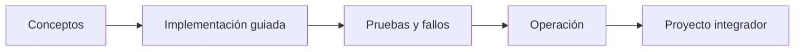

# Parte 21 — Operación cloud, automatización y respuesta a incidentes

> [← Parte 20](../part-20-cloud-data-ai-platforms/README.md) · [Índice completo](../README.md) · [Parte 22 →](../part-22-specializations-certifications-career/README.md)

**📥 Descargar:** [Esta parte en PDF](../../site/downloads/partes/manual-parte-21-cloud-operations-automation.pdf) · [Manual integral](../../site/downloads/multi-cloud-engineering-manual-v2.0.pdf)

**Nivel:** avanzado · **Clases:** 12 · **Duración sugerida:** 6–8 semanas

Convertir la operación diaria en procesos observables, repetibles y progresivamente automatizados.

## Resultados de la parte

Al completar esta parte podrás explicar el dominio con lenguaje independiente del proveedor,
implementar sus mecanismos esenciales, diagnosticar fallos y defender decisiones mediante
evidencia, costo, seguridad y objetivos de confiabilidad.

## Modelo mental

Operar es controlar cambios bajo incertidumbre: inventario, señal, diagnóstico, acción reversible y aprendizaje deben formar un ciclo cerrado.

## Secuencia

## Clases

| ID | Clase | Laboratorio | Horas |
|---:|---|---|---:|
| 253 | [Inventario, etiquetado, CMDB y ownership](253-inventario-etiquetado-cmdb-y-ownership/README.md) | `governance` | 4 |
| 254 | [Patching, imágenes doradas y gestión de configuración](254-patching-imagenes-doradas-y-gestion-de-configuracion/README.md) | `operations` | 4 |
| 255 | [Backups, restore testing, vaults e inmutabilidad](255-backups-restore-testing-vaults-e-inmutabilidad/README.md) | `reliability` | 4 |
| 256 | [Administración remota sin SSH permanente](256-administracion-remota-sin-ssh-permanente/README.md) | `security` | 4 |
| 257 | [Alertas, on-call, escalamiento y comunicación](257-alertas-on-call-escalamiento-y-comunicacion/README.md) | `incident` | 4 |
| 258 | [Triage de red, cómputo, datos y dependencias](258-triage-de-red-computo-datos-y-dependencias/README.md) | `incident` | 4 |
| 259 | [Runbooks ejecutables y auto-remediation](259-runbooks-ejecutables-y-auto-remediation/README.md) | `operations` | 4 |
| 260 | [Change management, ventanas y rollback](260-change-management-ventanas-y-rollback/README.md) | `delivery` | 4 |
| 261 | [Game days, chaos engineering y aprendizaje](261-game-days-chaos-engineering-y-aprendizaje/README.md) | `chaos` | 4 |
| 262 | [Capacity planning, cuotas y gestión de demanda](262-capacity-planning-cuotas-y-gestion-de-demanda/README.md) | `capacity` | 4 |
| 263 | [AIOps, automatización asistida y límites humanos](263-aiops-automatizacion-asistida-y-limites-humanos/README.md) | `governance` | 4 |
| 264 | [Proyecto: centro de operaciones de CloudShop](264-proyecto-centro-de-operaciones-de-cloudshop/README.md) | `capstone` | 8 |

## Evaluación de la parte

- 35 % laboratorios y evidencia reproducible.
- 25 % retos verificables.
- 20 % decisiones y ADR.
- 10 % seguridad, confiabilidad y costo.
- 10 % proyecto integrador de la parte.

Se aprueba con 80 % de clases en nivel B o superior y el proyecto integrador reproducible.

## Pauta bibliográfica

- The Site Reliability Workbook — Beyer et al..
- Seeking SRE — Murphy et al..
- Effective DevOps — Davis y Daniels.
