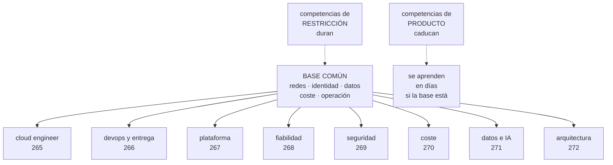

# 265 — Ruta Cloud Engineer y mapa de competencias

> [← 264 · Proyecto: centro de operaciones de CloudShop](../../part-21-cloud-operations-automation/264-proyecto-centro-de-operaciones-de-cloudshop/README.md) · [Índice de la parte](../README.md) · [266 · Ruta DevOps y Delivery Engineer →](../../part-22-specializations-certifications-career/266-ruta-devops-y-delivery-engineer/README.md)

**Parte:** 22 — Especializaciones, certificaciones y práctica profesional<br>
**Nivel:** intermedio-avanzado · **Horas estimadas:** 4<br>
**Laboratorio:** `decision` · **Estado:** `EXECUTABLE_CORE`

## 🎯 Propósito

Dar el mapa de competencias que ordena la parte 22 y la ruta base de la que salen todas las demás. La clase separa lo que hay que saber de lo que hay que saber **hacer**, distingue las competencias atadas a un producto de las atadas a una restricción —que son las que duran—, y da el método para evaluarse sin engañarse: por lo que uno ha resuelto, no por lo que ha leído.

## 📚 Resultados de aprendizaje

Al finalizar podrás:

1. **Distinguir** competencias de producto y competencias de restricción.
2. **Situar** las ocho rutas de la parte 22 en un mapa común.
3. **Evaluar** el nivel propio por evidencia y no por familiaridad.
4. **Construir** un plan de aprendizaje con hueco identificado y prueba.
5. **Reconocer** el techo de cada ruta y qué lo levanta.

## 🧩 Conceptos centrales

| Concepto | Comprensión verificable |
|---|---|
| `competencia de restricción` | Saber que se organiza alrededor de un límite del mundo: latencia, coherencia, coste, superficie de ataque. Sobrevive a los productos. |
| `competencia de producto` | Saber cómo se hace algo en un servicio concreto. Caduca con él. |
| `nivel por evidencia` | Lo que uno ha resuelto sin ayuda, con las consecuencias delante. La única medida honesta. |
| `ilusión de familiaridad` | Confundir haber leído o visto algo con saber hacerlo. |
| `ruta` | Combinación de competencias que un puesto exige. No es una identidad: es un reparto de énfasis. |
| `techo de ruta` | El límite al que se llega sin adquirir competencias de otra ruta. |

## 🧠 Modelo mental

Una especialización combina fundamentos, evidencia de proyectos y juicio bajo restricciones; una insignia sin práctica no sustituye esa combinación.

Aplicado a esta clase, separa siempre cuatro planos: **intención** (qué necesita el usuario),
**configuración** (qué declaramos), **estado observado** (qué existe de verdad) y
**evidencia** (cómo sabemos que cumple). Confundirlos produce diseños que se ven correctos
en un diagrama pero fallan al operar.

## 🗺️ Flujo de razonamiento



## 📖 Desarrollo

### 1. Restricción frente a producto

La distinción que ordena una carrera entera: hay saberes que caducan con el servicio que los origina y saberes que no.

```text
COMPETENCIA DE PRODUCTO
  cómo se configura un balanceador en la nube X
  qué nombre tiene el servicio de colas en la nube Y
  qué campos lleva una política en la nube Z

  → se aprende en días si la base está
  → caduca cuando el producto cambia
  → y es lo que más ocupa en los temarios

COMPETENCIA DE RESTRICCIÓN
  por qué la latencia entre regiones limita la coherencia
                                            clases 183, 187
  por qué un reintento sin retroceso multiplica la carga
                                                clase 201
  por qué el coste se decide al diseñar          ley 14
  por qué un permiso amplio es una decisión de riesgo
                                                clase 231
  por qué una cola cambia dónde está la garantía  ley 18

  → no caduca, porque la restricción no depende del
    producto
  → un producto nuevo es otra forma de encajar el mismo
    límite
```

Y la consecuencia práctica, que es lo que cambia decisiones:

```text
QUIEN SABE LA RESTRICCIÓN APRENDE EL PRODUCTO EN DÍAS
QUIEN SABE EL PRODUCTO NO DEDUCE LA RESTRICCIÓN NUNCA

→ y por eso este programa ha enseñado por restricción y
  ha usado los tres proveedores como ejemplos
→ y por eso la parte 19 pudo comparar las tres nubes
  midiendo, en vez de listando
```

Y las cinco restricciones que estructuran todo lo demás:

```text
1  LA DISTANCIA
   la luz tarda; y de ahí salen latencia, coherencia,
   regiones, réplicas y conmutación

2  EL FALLO PARCIAL
   las cosas fallan a medias y lento, no del todo
   → y de ahí, plazos, reintentos, cortacircuitos y
     degradación                          clases 185, 201

3  LA IDENTIDAD
   todo acceso es una afirmación que hay que verificar
   → y de ahí, autenticación, autorización, privilegio
     mínimo y auditoría                        clase 231

4  EL COSTE POR USO
   cada operación se factura
   → y de ahí, arquitectura, formatos, y la ley 28

5  Y EL CAMBIO
   los sistemas cambian y las personas olvidan
   → y de ahí, inventario, procedimientos, ensayos y la
     parte 21 entera
```

### 2. El mapa de competencias

Ocho rutas y una base común. Y el error de leerlo como ocho identidades excluyentes.

```text
LA BASE COMÚN, que ninguna ruta puede saltarse
  redes: rutas, nombres, plazos, camino esperado
                                    clases 194, 195, 202
  identidad: quién es y qué puede               clase 231
  datos: dónde están, quién los copia, qué se pierde
                                          clases 189, 208
  coste: cómo se genera y quién responde   clases 220, 270
  operación: alertas, procedimientos, cambio  parte 21

→ y quien no tiene esta base opera de oídas en cualquier
  ruta

LAS OCHO RUTAS, por lo que priorizan
  cloud engineer          construir y sostener servicios
  devops y entrega        que el cambio llegue rápido y
                          seguro                clase 266
  plataforma              que otros equipos vayan solos
                                                clase 267
  fiabilidad              que el sistema cumpla lo
                          prometido              clase 268
  seguridad               que el fallo no sea catastrófico
                                                clase 269
  coste                   que el gasto sea una decisión
                                                clase 270
  datos e IA              que el dato sea confiable
                                                clase 271
  arquitectura            que la decisión sea defendible
                                                clase 272

→ y todas comparten la base; se diferencian en el ÉNFASIS
→ y nadie ocupa una sola casilla en la práctica
```

Y los cuatro niveles, definidos por lo que uno puede hacer solo:

```text
NIVEL 1 · SIGO
  ejecuto un procedimiento existente y sé cuándo pedir
  ayuda

NIVEL 2 · RESUELVO
  diagnostico y arreglo problemas conocidos sin ayuda
  y escribo el procedimiento que faltaba

NIVEL 3 · DISEÑO
  tomo decisiones con compromisos y las defiendo con
  cifras
  y anticipo el modo de fallo antes de que ocurra

NIVEL 4 · CAMBIO EL SISTEMA
  cambio cómo trabaja la organización, no solo el sistema
  y el efecto se mide en otros equipos

→ y el salto de 2 a 3 es el que más gente no da
→ porque el nivel 2 se alcanza practicando y el 3 exige
  equivocarse con consecuencias y revisarlo
```

### 3. Evaluarse sin engañarse

La autoevaluación por familiaridad es inútil y es la que todo el mundo hace.

```text
LA ILUSIÓN DE FAMILIARIDAD
  «sé de balanceadores» significa, casi siempre,
  «he leído sobre balanceadores»

  → leer produce reconocimiento, no capacidad
  → y el reconocimiento se siente igual que saber

LA PRUEBA QUE LO DESHACE
  «¿cuándo lo hiciste sin ayuda?»
  «¿qué salió mal y cómo lo supiste?»
  «¿qué decidirías distinto ahora?»

→ si no hay respuesta a las tres, el nivel es 1
→ y esto duele, y es útil
```

Y la rejilla de autoevaluación, que se rellena con evidencia:

```text
por cada competencia
  ¿lo he hecho?                    sí / no
  ¿solo o acompañado?
  ¿en producción o en un ejercicio?
  ¿qué salió mal?
  ¿qué mide que salió bien?

→ y si la respuesta a «¿qué salió mal?» es «nada», casi
  siempre significa que el ejercicio era pequeño
→ los ejercicios que no fallan no enseñan       clase 261
```

Y cómo se construye el plan a partir del hueco:

```text
1  ELIGE UNA RESTRICCIÓN, no un producto
   «no sé razonar sobre coherencia entre regiones»
   → mejor que «no sé el servicio X»

2  BUSCA UN PROBLEMA REAL
   en tu sistema, en un proyecto propio o en un ejercicio
   con consecuencias medibles

3  ESCRIBE LA HIPÓTESIS ANTES
   qué crees que va a pasar
   → el mismo método que este programa aplica cada parte

4  MIDE
   y compara con lo que creías

5  ESCRÍBELO
   → y ahí tienes evidencia para el portafolio
                                              clase 275

→ y este ciclo, repetido, es lo que produce el nivel 3
→ leer más contenidos no lo produce nunca
```

### 4. La ruta de ingeniería de nube y su techo

La ruta base: construir y sostener servicios en la nube. Es donde casi todo el mundo empieza y donde muchos se quedan por una razón concreta.

```text
QUÉ HACE
  aprovisiona y mantiene infraestructura
  monta redes, cómputo, almacenamiento y bases
  automatiza con infraestructura como código   clase 128
  responde de que funcione

LO QUE SE ESPERA POR NIVEL
  nivel 1  ejecuta cambios definidos por otros
  nivel 2  diseña y monta un servicio completo, con red,
           identidad, copias y señales
  nivel 3  decide entre alternativas con coste y riesgo
           medidos, y lo defiende
  nivel 4  define cómo se construye en la organización

LAS COMPETENCIAS QUE MÁS SE MIDEN
  redes: por qué no llega el tráfico       clases 194-202
  identidad y permisos                          clase 231
  infraestructura como código, con estado y módulos
                                          clases 128, 232
  copias y restauración probada                 clase 255
  coste al diseñar                              clase 220
  y diagnóstico                                 clase 258
```

Y el techo, que es lo importante de esta clase:

```text
EL TECHO DE LA RUTA BASE
  se llega a construir bien lo que a uno le piden
  → y ahí se para

  y lo que lo levanta NO es más profundidad técnica
  es una de estas tres
    a  saber decidir entre opciones y defenderlo
       → ruta de arquitectura                clase 272
    b  hacer que otros vayan más rápido
       → ruta de plataforma                  clase 267
    c  responder de una propiedad del sistema entero
       → fiabilidad, seguridad o coste
                                    clases 268, 269, 270

→ y ninguna de las tres es «saber más servicios»
→ el hueco entre nivel 2 y 3 es de JUICIO, no de catálogo
→ que es exactamente lo que la ley 30 dijo de los
  procedimientos: lo que falta no es el paso, es la
  decisión                                    clase 264
```

Y el consejo que más cambia trayectorias:

```text
ESPECIALIZARSE EN UNA NUBE A FONDO Y APRENDER A TRADUCIR
  → mejor que las tres por encima
  → porque la profundidad en una enseña la restricción,
    y la restricción se traduce             clase 273
  → y quien sabe las tres por encima no ha visto ninguna
    fallar de verdad

y la trampa del currículo
  listar veinte servicios no dice nada
  → lo que dice algo es «reduje el tiempo de recuperación
    de 47 a 11 minutos y así lo medí»       clase 275
```

Y la lista de comprobación de la clase:

```text
☐ sé distinguir qué de lo que sé es producto y qué es
  restricción
☐ tengo la base común, no solo la parte que uso
☐ mi nivel lo he fijado por evidencia, no por familiaridad
☐ por cada competencia puedo decir qué salió mal alguna vez
☐ mi plan parte de una restricción, no de un producto
☐ tengo un problema real donde practicarla
☐ escribo la hipótesis antes y la comparo después
☐ sé cuál es el techo de mi ruta y qué lo levanta
☐ tengo una nube a fondo antes que tres por encima
☐ mis logros están escritos con cifras, no con servicios
```

Y el cierre que enlaza con la clase siguiente: la primera especialización que sale de la base es la que se ocupa de que el cambio llegue a producción rápido y sin romper. Entrega continua y su ruta es la materia de la clase 266.

## 🔬 Ejemplo trabajado

**Tres autoevaluaciones reales del equipo de CloudShop, hechas con la rejilla por evidencia. Lo que sigue es lo que la rejilla dijo frente a lo que cada persona creía, y el plan que salió de ahí.**

**Persona A · Cuatro años de experiencia. Se creía nivel 3.**

```text
autoevaluación inicial, por familiaridad
  redes                        «alto»
  identidad                    «alto»
  infraestructura como código  «alto»
  copias                       «medio»
  coste                        «medio»
  diagnóstico                  «alto»

y la rejilla por evidencia
                        ¿solo?  ¿producción?  ¿qué falló?
  redes                    sí         sí       nada
  identidad                sí         sí       nada
  infraestructura
    como código            sí         sí       «un estado
                                               corrupto»
  copias                   no          -       -
  coste                    no          -       -
  diagnóstico              sí         sí       «tardé 3 h
                                               en un caso»
```

Y la conversación que lo cambió:

```text
«¿qué falló en redes?»            «nada»
«¿has visto una asimetría de rutas?»    no
«¿has diagnosticado un problema de
  unidad máxima de transmisión?»        no
«¿has visto un nombre resolver distinto
  según desde dónde se pregunte?»       no

→ nivel real en redes: 2, no 3
→ había construido muchas redes y no había roto ninguna
→ y el nivel 3 exige haber visto fallar

y en copias, el hallazgo
  «las copias las configuré yo»
  «¿has restaurado alguna?»              no
  → nivel 1, no medio                        ley 22
```

Y el plan que salió:

```text
restricción elegida   el fallo parcial
problema real         los ensayos de la clase 261
hipótesis escrita     «al añadir 200 ms, el flujo se
                       degradará proporcionalmente»
resultado             4.100 ms; hipótesis refutada

→ y esa refutación produjo más aprendizaje que dos años
  construyendo redes que funcionaban
→ nivel en redes y en fallo parcial, 12 meses después: 3
```

**Persona B · Once meses. Se creía nivel 1 en todo.**

```text
la rejilla dio otra cosa
                        ¿solo?  ¿producción?  ¿qué falló?
  diagnóstico              sí         sí      «seguí una
                                               hipótesis
                                               falsa 2 h»
  procedimientos           sí         sí      «el mío
                                               estaba mal
                                               escrito y
                                               otro no lo
                                               entendió»
  copias                   sí         sí      «restauré y
                                               faltaban
                                               40 min»

→ nivel 2 en tres competencias
→ y nivel 1 en redes e identidad, correctamente

→ había hecho MENOS cosas y las había hecho fallar
→ que es lo que produce nivel
```

Y lo que esto reveló del equipo:

```text
quien lleva menos tiempo suele tener MEJOR calibrada la
autoevaluación
  → porque recuerda cuándo pidió ayuda

y quien lleva más tiempo confunde antigüedad con nivel
  → porque ha visto muchas veces lo mismo funcionar

→ la rejilla por evidencia corrige a los dos
```

**Persona C · Ocho años. Nivel 3 real, con techo.**

```text
la rejilla confirmó nivel 3 en casi todo
  decide entre alternativas con cifras         sí
  anticipa modos de fallo                      sí
  defiende decisiones ante negocio             sí

y la pregunta del techo
  «¿cuál fue tu último trabajo que cambió cómo trabaja
  otro equipo?»
  → ninguno en dos años

→ nivel 3 estable, techo alcanzado
→ y su queja era «no avanzo, y ya sé más que nadie de esto»
→ que es el síntoma exacto del techo de la ruta base
```

Y las tres salidas que se le plantearon, con lo que cada una exigía:

```text
a  ARQUITECTURA                                clase 272
   lo que le falta: defender ante un panel que no es
   técnico, y escribir decisiones para que sobrevivan
   a su autor

b  PLATAFORMA                                  clase 267
   lo que le falta: tratar a otros equipos como clientes
   y medir adopción, no calidad interna

c  FIABILIDAD                                  clase 268
   lo que le falta: responder de un número acordado con
   negocio, y decir que no a un despliegue

eligió (b)
  y a los 9 meses, su medida era otra
    equipos que despliegan solos      3 → 14
    tiempo de un servicio nuevo    3 semanas → 2 días

→ el mismo conocimiento técnico, otro efecto
→ y eso es lo que distingue el nivel 4
```

**Y la comparación agregada del equipo, 9 personas.**

```text                                  autoevaluación   evidencia
redes                          media 2,9        media 2,1
identidad                            2,7              1,9
infraestructura como código          3,1              2,6
copias y restauración                2,4              1,2
coste                                2,2              1,1
diagnóstico                          2,8              2,3
operación                            2,6              1,8

→ el hueco es mayor donde la práctica es más rara
→ copias y coste son los peores, y no es casualidad:
  son los que solo se practican cuando algo va mal
→ y la parte 21 lo confirmó: la restauración real tardó
  3 h 10 frente a los 40 minutos que todos creían
```

Y lo que el equipo hizo con esa tabla:

```text
no se usó para evaluar a nadie
  → se usó para decidir qué ensayar
  → y los ensayos de la clase 261 se ordenaron por el
    hueco más grande

12 meses después
  copias y restauración      1,2 → 2,4
  coste                      1,1 → 2,0
  y el tiempo de restauración medido      3 h 10 → 52 min

→ la rejilla no midió el aprendizaje: lo dirigió
```

**La lección que esta clase deja**: la persona con cuatro años se creía nivel 3 en redes **porque nunca había visto una fallar**, y la de once meses tenía nivel 2 real en tres competencias porque las había roto. Y el hueco entre autoevaluación y evidencia era mayor justo en **copias y coste**, que son las dos competencias que solo se practican cuando algo va mal.

## 🧪 Laboratorio guiado

Ejecuta desde la raíz:

```bash
python classes/part-22-specializations-certifications-career/265-ruta-cloud-engineer-y-mapa-de-competencias/lab.py
```

El laboratorio selecciona el motor de práctica **`decision`** y produce
`lab_result.json`. El escenario, sus comprobaciones y el artefacto esperado corresponden a
esta clase; no requiere credenciales y deja explícito qué debe revalidarse en un sandbox real.

1. Lee `exercise.steps` y formula una predicción antes de ejecutar.
2. Ejecuta la práctica y verifica todos los elementos de `checks`.
3. Provoca el caso de `negative_test` y explica la señal observada.
4. Materializa `cloud-engineer-plan` en `evidence/` usando la plantilla indicada.
5. Para proveedor real, sigue `sandbox.requires`, registra costo y ejecuta `destroy`.

### Evidencia esperada

El artefacto principal es una matriz de decisión ponderada y un ADR. Además, la entrega debe incluir el comando ejecutado,
la salida estructurada y una conclusión que no exceda lo observado.

## 🏆 Reto verificable

Construye **`cloud-engineer-plan`** para el caso CloudShop. Incluye una alternativa descartada,
un supuesto que pueda falsarse, una prueba de fallo y una decisión de rollback.

## ✅ Criterio de aceptación

- [ ] `lab.py` termina con código 0 y genera JSON válido.
- [ ] La entrega conecta al menos tres requisitos con mecanismos verificables.
- [ ] Existe una prueba positiva y una prueba negativa con evidencia.
- [ ] Seguridad, costo y operación aparecen como decisiones, no como anexos.
- [ ] Se declara una limitación y una condición que obligaría a revisar el diseño.
- [ ] Otra persona puede repetir el recorrido sin conocimiento tácito.

## ⚠️ Errores frecuentes

| Síntoma | Causa probable | Corrección |
|---|---|---|
| Se estudia mucho y el nivel no sube | Leer produce reconocimiento, no capacidad; la familiaridad se confunde con saber | Por cada competencia responde qué hiciste solo, qué salió mal y qué harías distinto; si no hay respuesta, el nivel es 1. |
| Se conocen tres nubes y no se resuelve bien en ninguna | La amplitud sin profundidad no enseña la restricción, que es lo que se traduce | Domina una nube hasta haberla visto fallar y luego traduce; la restricción es transferible, la sintaxis se aprende en días. |
| Se llega a construir bien y la carrera se estanca | Es el techo de la ruta base; no se levanta con más servicios sino con juicio o alcance | Elige entre decidir y defender, hacer que otros vayan más rápido, o responder de una propiedad del sistema entero. |
| El currículo lista veinte servicios y no consigue entrevistas técnicas buenas | Una lista de productos no demuestra capacidad de resolver | Escribe logros con cifra y método: qué medías antes, qué cambiaste y qué mide que funcionó. |
| La autoevaluación del equipo no coincide con lo que ocurre en incidentes | Se evaluó por antigüedad y familiaridad, no por evidencia | Usa la rejilla por evidencia y ordena los ensayos por el hueco mayor; suele estar en copias y coste. |
| Un ejercicio de práctica salió perfecto y no se aprendió nada | El ejercicio era demasiado pequeño para fallar | Escoge problemas con consecuencias medibles y escribe la hipótesis antes; lo que no falla no enseña. |

## 🛡️ Seguridad, ética y costo

Trabaja con cuentas propias o sandboxes autorizados. No publiques secretos, identificadores
reales ni datos personales. Antes de crear recursos pagos define presupuesto, etiquetas y
comando de destrucción; después verifica que no queden recursos huérfanos. Los ejemplos
locales enseñan contratos, pero no certifican cumplimiento ni disponibilidad de producción.

## ❓ Preguntas de comprobación

1. ¿Qué distingue una competencia de restricción de una de producto?
2. ¿Cuáles son las cinco restricciones que estructuran el resto?
3. ¿Cómo se fija el nivel propio sin caer en la ilusión de familiaridad?
4. ¿Qué separa el nivel 2 del nivel 3 y por qué es el salto que menos gente da?
5. ¿Cuál es el techo de la ruta base y qué tres cosas lo levantan?

## 🔗 Referencias

- Ericsson, K. A. y Pool, R. (2016). *Peak: secrets from the new science of expertise*. <https://www.hachettebookgroup.com/titles/anders-ericsson/peak/9780544456259/>
- Dreyfus, S. (2004). *The five-stage model of adult skill acquisition*. <https://journals.sagepub.com/doi/10.1177/0270467604264992>
- AWS (2024). *Skills and certification paths*. <https://aws.amazon.com/training/learn-about/>
- Microsoft (2024). *Azure career and skills paths*. <https://learn.microsoft.com/credentials/browse/>
- Google Cloud (2024). *Cloud learning paths by role*. <https://cloud.google.com/learn/training>
- Documentación oficial vigente del servicio implementado; registra URL y fecha de consulta.

---

> [Evaluación](assessment.md) · [Contrato de clase](lesson.yaml) · [Índice de la parte](../README.md)

| Anterior | Índice | Siguiente |
|---|---|---|
| [← 264 · Proyecto: centro de operaciones de CloudShop](../../part-21-cloud-operations-automation/264-proyecto-centro-de-operaciones-de-cloudshop/README.md) | [Parte 22](../README.md) · [Programa](../../README.md) | [266 · Ruta DevOps y Delivery Engineer →](../../part-22-specializations-certifications-career/266-ruta-devops-y-delivery-engineer/README.md) |
