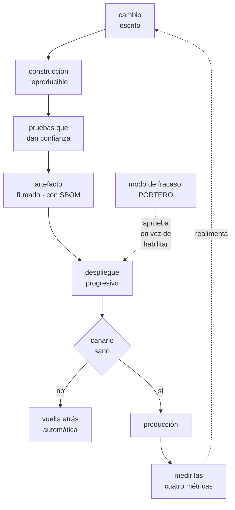

# 266 — Ruta DevOps y Delivery Engineer

> [← 265 · Ruta Cloud Engineer y mapa de competencias](../../part-22-specializations-certifications-career/265-ruta-cloud-engineer-y-mapa-de-competencias/README.md) · [Índice de la parte](../README.md) · [267 · Ruta Platform Engineer →](../../part-22-specializations-certifications-career/267-ruta-platform-engineer/README.md)

**Parte:** 22 — Especializaciones, certificaciones y práctica profesional<br>
**Nivel:** intermedio-avanzado · **Horas estimadas:** 4<br>
**Laboratorio:** `decision` · **Estado:** `EXECUTABLE_CORE`

## 🎯 Propósito

La ruta de entrega: hacer que el cambio llegue a producción rápido y sin romper. La clase separa lo que esta especialidad hace de verdad —que no es montar cadenas de construcción— de lo que aparenta, da las competencias que se miden en una entrevista y en el trabajo, y marca su modo de fracaso característico: **convertirse en el equipo que aprueba en vez del que habilita**.

## 📚 Resultados de aprendizaje

Al finalizar podrás:

1. **Definir** qué hace esta ruta y qué no, con las cuatro métricas.
2. **Identificar** las competencias que se miden y en qué orden crecen.
3. **Diagnosticar** una cadena de entrega lenta o poco fiable.
4. **Evitar** el modo de fracaso de convertirse en portero.
5. **Reconocer** el techo de la ruta y qué lo levanta.

## 🧩 Conceptos centrales

| Concepto | Comprensión verificable |
|---|---|
| `ruta de entrega` | Especialidad centrada en el camino desde que se escribe un cambio hasta que sirve a un usuario. |
| `cadena de entrega` | Construcción, pruebas, empaquetado, despliegue y verificación. El producto de esta ruta. |
| `portero` | Modo de fracaso en que el equipo pasa de habilitar a autorizar, y se convierte en el cuello de botella. |
| `tiempo de entrega` | De confirmar un cambio a que sirva tráfico. La métrica que más revela. |
| `camino pavimentado` | La forma fácil de hacer lo correcto. Reemplaza a la norma que hay que recordar. |
| `prueba que da confianza` | La que, si pasa, permite desplegar sin mirar. Cualquier otra es decoración. |

## 🧠 Modelo mental

Una especialización combina fundamentos, evidencia de proyectos y juicio bajo restricciones; una insignia sin práctica no sustituye esa combinación.

Aplicado a esta clase, separa siempre cuatro planos: **intención** (qué necesita el usuario),
**configuración** (qué declaramos), **estado observado** (qué existe de verdad) y
**evidencia** (cómo sabemos que cumple). Confundirlos produce diseños que se ven correctos
en un diagrama pero fallan al operar.

## 🗺️ Flujo de razonamiento



## 📖 Desarrollo

### 1. Qué hace esta ruta de verdad

El nombre y las herramientas engañan. Esta ruta no se define por montar cadenas: se define por un número.

```text
EL TRABAJO ES REDUCIR EL TIEMPO Y EL RIESGO ENTRE
«ESTÁ ESCRITO» Y «SIRVE A UN USUARIO»

y se mide con cuatro cosas               clase 260
  frecuencia de despliegue
  tiempo de entrega
  tasa de fallo por cambio
  tiempo de recuperación

→ si estas cuatro no mejoran, el trabajo no está
  produciendo efecto, por muchas herramientas que haya
```

Y lo que hace, desglosado:

```text
CONSTRUCCIÓN REPRODUCIBLE
  la misma entrada produce la misma salida
  dependencias fijadas y almacenadas       clase 216
  y construcción sin acceso a producción

PRUEBAS QUE DAN CONFIANZA
  la pregunta no es «¿cuánta cobertura?»
  es «si pasan, ¿despliego sin mirar?»
  → y si la respuesta es no, sobra o falta algo

ARTEFACTO ÚNICO Y TRAZABLE
  se construye una vez y se promociona
  → no se reconstruye por entorno
  firmado, con inventario de componentes  clase 216

DESPLIEGUE PROGRESIVO
  canario, porcentajes, vuelta atrás automática
                                          clase 102
  y despliegue separado de activación     clase 105

VERIFICACIÓN AUTOMÁTICA
  el propio despliegue comprueba que funcionó
  → y si no, revierte solo

Y EL CAMINO PAVIMENTADO
  que hacer lo correcto sea lo más fácil
  → una plantilla que ya trae señales, copias, permisos
    mínimos y despliegue progresivo
  → esto es lo que hace que la norma no haga falta
                                          ley 16
```

Y lo que NO es esta ruta, aunque se lo asignen:

```text
no es «el equipo que despliega»
  → si esta ruta despliega por los demás, es el cuello de
    botella
no es «el equipo de las herramientas»
  → las herramientas son el medio
no es «el que arregla la cadena cuando se rompe»
  → eso es síntoma de una cadena frágil
y no es el que aprueba
  → ese es el modo de fracaso
```

### 2. Las competencias que se miden

Lo que distingue a alguien bueno en esta ruta, por orden de aparición.

```text
NIVEL 2 · RESUELVO
  monta una cadena completa para un servicio
  diagnostica por qué una construcción no es reproducible
  distingue prueba útil de prueba decorativa
  gestiona secretos sin ponerlos en el repositorio
                                          clase 197
  y sabe qué hace lento el ciclo, midiéndolo

NIVEL 3 · DISEÑO
  decide la estrategia de ramas y de versiones y la
  defiende con datos de tiempo de entrega
  diseña el despliegue progresivo por servicio, según su
  riesgo                                  clase 260
  hace reversible lo que no lo parece: esquemas, mensajes,
  contratos                        clases 106, 209, 210
  reduce el lote sin bajar la calidad
  y monta la cadena de suministro: firma, procedencia,
  inventario                              clase 216

NIVEL 4 · CAMBIO EL SISTEMA
  convierte el camino pavimentado en el más fácil, y la
  adopción se mide
  elimina el proceso de aprobación demostrando que no
  filtra riesgo                           clase 260
  y consigue que los equipos de producto respondan de sus
  despliegues
```

Y las preguntas que separan niveles en una entrevista:

```text
«¿cuál es vuestro tiempo de entrega y cómo lo medís?»
  → nivel 1 no lo sabe
  → nivel 2 da un número
  → nivel 3 lo desglosa por tramos y sabe cuál domina

«¿qué pasa si una prueba falla de forma intermitente?»
  → la respuesta mala: reintentarla
  → la buena: es un defecto; se aísla, se arregla o se
    retira, porque una prueba en la que no se confía
    destruye el valor de todas

«¿cómo desplegáis un cambio de esquema?»
  → discrimina mucho                        clase 260

«¿cuándo fue vuestra última vuelta atrás?»
  → y si es «no hemos necesitado», es mala señal
                                              ley 22

y la que más revela
«¿cuánto tarda un equipo nuevo en tener su primer
despliegue en producción?»
  → mide el camino pavimentado, no la cadena
```

Y los diagnósticos típicos de una cadena mala:

```text
SÍNTOMA                      CAUSA HABITUAL
la cadena tarda 40 min       pruebas mal ordenadas; lo
                             barato debe ir primero
nadie confía en las pruebas  intermitentes toleradas
funciona en un entorno y no  el artefacto se reconstruye
en otro                      por entorno
se despliega los viernes
nunca                        no hay vuelta atrás fiable
el despliegue exige a una    hay pasos manuales no escritos
persona concreta                                  ley 30
y el ciclo es rápido pero
rompe mucho                  falta verificación automática
                             tras desplegar
```

### 3. El modo de fracaso: el portero

Toda ruta tiene una forma característica de estropearse. La de esta es convertirse en quien autoriza.

```text
CÓMO EMPIEZA, siempre con buena intención
  un despliegue rompe producción
  → «revisemos los despliegues antes»
  otro rompe
  → «que pase por nosotros»
  y en seis meses
  → el equipo de entrega aprueba todos los despliegues

QUÉ PRODUCE
  cola de espera → lotes mayores → más riesgo
                                            clase 260
  responsabilidad desplazada
    → «lo aprobasteis vosotros»
  y el equipo pasa el día en trabajo repetitivo, sin
    mejorar nada

→ y las cuatro métricas empeoran a la vez
→ es el mismo mecanismo del comité de cambios, con otro
  nombre                                    clase 260
```

Y cómo se sale de ahí, que es trabajo de nivel 4:

```text
1  MEDIR QUÉ FILTRA LA APROBACIÓN
   de los últimos 200 despliegues revisados, ¿cuántos se
   rechazaron y cuántos incidentes causaron los aprobados?
   → CloudShop: 0,6 % rechazados y el 91 % de los
     incidentes venían de aprobados          clase 260

2  SUSTITUIR CADA MOTIVO DE RECHAZO POR UNA COMPROBACIÓN
   AUTOMÁTICA
   → «no tenía vuelta atrás» → comprobación
   → «coincidía con otro cambio» → calendario

3  DEVOLVER LA RESPONSABILIDAD
   quien escribe el cambio responde del despliegue
   → y para eso hace falta que PUEDA: señales, vuelta
     atrás, procedimiento y permisos

4  Y QUEDARSE CON EL CAMINO PAVIMENTADO
   → el equipo de entrega hace fácil lo correcto
   → no vigila que se haga
```

Y el segundo modo de fracaso, menos visible:

```text
LA CADENA COMO PRODUCTO PROPIO
  se optimiza la cadena por elegancia interna
  → módulos, abstracciones, plantillas anidadas
  → y los equipos de producto no la entienden

→ y entonces vuelven a pedir ayuda para cada cambio
→ y el equipo vuelve a ser cuello de botella, por otra vía
→ la medida correcta es la ADOPCIÓN y la autonomía, no la
  calidad interna de la cadena             clase 267
```

### 4. El techo de la ruta

Dónde se acaba esta especialidad y qué la continúa.

```text
EL TECHO
  se llega a tener una cadena rápida, fiable y adoptada
  → y las cuatro métricas dejan de mejorar porque el
    cuello ya no está ahí

y lo que suele limitar entonces
  la arquitectura del sistema
    → servicios acoplados que no se pueden desplegar por
      separado                          clases 106, 183
  la organización
    → equipos que dependen unos de otros para entregar
  o la calidad del propio código

→ y ninguna de las tres se arregla desde la cadena
```

Y las tres continuaciones naturales:

```text
a  PLATAFORMA                                clase 267
   la cadena es una parte del producto interno; el
   siguiente paso es todo lo demás que un equipo necesita
   para ir solo

b  FIABILIDAD                                clase 268
   de «que el cambio llegue» a «que el sistema cumpla»
   → y añade presupuestos de error y decir que no

c  ARQUITECTURA                              clase 272
   si lo que frena es el acoplamiento, el trabajo es
   rediseñar los límites

→ y la señal para elegir es qué te está frenando HOY
```

Y el consejo específico de esta ruta:

```text
APRENDE A MEDIR ANTES QUE A MONTAR
  la mayoría llega con herramientas y sin números
  → y sin números no se puede demostrar mejora, ni
    justificar quitar una aprobación

y la evidencia que vale en una entrevista
  «bajamos el tiempo de entrega de 6,4 días a 3,2 horas
  reduciendo el lote de 14 cambios a 1, y la tasa de
  fallo bajó del 1,8 % al 0,6 %»
  → con el método explicado
  → mejor que cualquier lista de herramientas
                                            clase 275
```

Y la lista de comprobación de la clase:

```text
☐ sé cuáles son mis cuatro métricas y de dónde salen
☐ sé qué tramo domina mi tiempo de entrega
☐ mis pruebas permiten desplegar sin mirar; si no, lo sé
☐ no tolero pruebas intermitentes
☐ el artefacto se construye una vez y se promociona
☐ hay despliegue progresivo con vuelta atrás automática
☐ se ha ejecutado una vuelta atrás en los últimos 30 días
☐ los cambios de esquema se hacen en pasos reversibles
☐ mi equipo habilita y no aprueba
☐ mido adopción del camino pavimentado, no su elegancia
☐ un equipo nuevo llega a producción en días, y lo mido
☐ sé qué me está frenando ahora y en qué ruta se resuelve
```

Y el cierre que enlaza con la clase siguiente: cuando la cadena deja de ser el cuello de botella, lo que frena es todo lo demás que un equipo necesita para ir solo. Tratar eso como un producto interno es la ruta de plataforma, materia de la clase 267.

## 🔬 Ejemplo trabajado

**Dos trayectorias reales en la ruta de entrega, con las cifras que las definieron. Lo que sigue es el caso de quien montó una cadena impecable que nadie usaba, y el de quien desmontó su propio trabajo de portero.**

**Caso 1 · La cadena que nadie usaba.**

```text
situación
  una persona de nivel 2 alto monta, en 4 meses, una
  cadena de entrega excelente
    construcción reproducible
    pruebas por capas, ordenadas por coste
    artefacto único, firmado, con inventario
    despliegue progresivo con vuelta atrás automática
    y plantillas para servicios nuevos

adopción a los 4 meses
  servicios que la usan               3 de 41
  y los 3 eran del propio equipo de plataforma
```

Y las razones, recogidas preguntando:

```text
«tiene 11 ficheros de configuración y no entiendo ninguno»
«tarda 40 minutos y el nuestro tarda 6»
«para añadir una variable hay que abrir una solicitud al
  equipo de plataforma»
«no sé qué hace cuando falla»

→ la cadena era mejor en todo salvo en lo que decidía la
  adopción
→ se había optimizado la calidad interna, no el uso
```

Y lo que cambió las cifras:

```text
se midió el tiempo de las pruebas y se reordenó
  40 min → 9 min
  (lo barato primero; lo caro solo si lo barato pasa)

se redujo la configuración
  11 ficheros → 1, con valores por defecto sensatos
  → y lo avanzado sigue disponible para quien lo necesite

se eliminó la solicitud al equipo de plataforma
  → variables autoservicio, con validación

se documentó qué hace al fallar, en una página

adopción a los 3 meses siguientes    3 → 29 de 41
y a los 9 meses                            38 de 41
```

Y la conclusión que quedó escrita en el equipo:

```text
la medida de esta ruta no es la calidad de la cadena
es cuántos equipos entregan solos y cuánto tardan
→ y eso es lo que la separa de un pasatiempo técnico
```

**Caso 2 · El portero que se desmontó a sí mismo.**

```text
punto de partida
  el equipo de entrega revisaba y ejecutaba todos los
  despliegues a producción
  2 personas dedicadas a ello
  8 a 14 despliegues por semana

lo que se medía
  tiempo de entrega                        6,4 días
  de los cuales, esperando al equipo       4,1 días
  despliegues rechazados                       0,6 %
  incidentes por cambio                      34/año
    de despliegues que el equipo ejecutó         31
```

Y el argumento que preparó, que es el trabajo de nivel 4:

```text
para cada motivo por el que alguna vez se había parado un
despliegue, una comprobación automática

  motivo                       sustituto
  sin plan de vuelta atrás     comprobación en la cadena
  coincide con otro cambio     calendario y bloqueo
                               automático
  falta la señal de salud      comprobación en la cadena
  toca algo crítico            etiqueta que exige canario
                               más lento
  descripción incomprensible   plantilla obligatoria

  → 5 motivos, 5 comprobaciones
  → tiempo de implementación            3 semanas
```

Y la transición, que se hizo por fases para poder revertirla:

```text
fase 1  las comprobaciones se ejecutan y el equipo sigue
        revisando
        → 6 semanas en modo sombra           clase 259
        → coincidencia entre la comprobación y la decisión
          humana                      194 de 197 casos
        → y los 3 discrepantes: la comprobación tenía razón
          en 2

fase 2  tres equipos piloto despliegan solos
        → 5 semanas; incidentes por cambio: 0

fase 3  todos
```

Y las cifras a los 12 meses:

```text                                        antes     después
tiempo de entrega                     6,4 días      3,2 h
despliegues por semana                    8-14         47
tasa de fallo por cambio                 1,8 %      0,6 %
tiempo de recuperación                  47 min     11 min
personas dedicadas a ejecutar
  despliegues                                2          0
```

Y lo que esas dos personas hicieron con su tiempo:

```text
  camino pavimentado para servicios nuevos
    tiempo de un servicio nuevo hasta producción
      3 semanas → 2 días
  cadena de suministro: firma e inventario  clase 216
  y verificación automática tras desplegar
    → que es lo que llevó el tiempo de recuperación de
      47 a 11 minutos

→ el mismo equipo, el mismo tamaño, otro efecto
→ y el trabajo repetitivo que hacían no era necesario:
  era una consecuencia de no tener las comprobaciones
```

**Y las preguntas de entrevista con las que se contrató a la siguiente persona.**

```text
1  «¿cuál es el tiempo de entrega de tu equipo y qué tramo
    lo domina?»
   respuestas recibidas, 11 candidaturas
     no lo sabe                                    6
     da un número                                  4
     lo desglosa por tramos                        1

2  «tenéis una prueba que falla 1 de cada 20 veces sin
    motivo aparente. ¿Qué haces?»
     reintentarla automáticamente                  7
     aislarla y arreglarla o retirarla             4

3  «¿cómo despliegas un cambio de esquema que ya escribió
    datos?»
     lo describe en pasos reversibles              3
     propone ventana de mantenimiento              6
     no lo ha hecho                                2

4  «¿cuándo fue la última vuelta atrás que ejecutasteis?»
     una fecha concreta del último mes             2
     «no hemos necesitado»                         5
     no lo sabe                                    4

→ la persona contratada fue la única que desglosó el
  tiempo de entrega por tramos, y también la única que
  dio fecha de la última vuelta atrás
→ y en el trabajo, esas dos respuestas predijeron bien
```

**La lección que esta clase deja**: la cadena técnicamente mejor tenía **3 de 41 servicios** usándola, porque se había optimizado su calidad interna y no su adopción. Y el equipo que revisaba todos los despliegues rechazaba el **0,6 %** mientras añadía 4,1 días de espera: al sustituir sus cinco motivos de rechazo por cinco comprobaciones automáticas, las cuatro métricas mejoraron a la vez y dos personas dejaron de hacer trabajo que nunca fue necesario.

## 🧪 Laboratorio guiado

Ejecuta desde la raíz:

```bash
python classes/part-22-specializations-certifications-career/266-ruta-devops-y-delivery-engineer/lab.py
```

El laboratorio selecciona el motor de práctica **`decision`** y produce
`lab_result.json`. El escenario, sus comprobaciones y el artefacto esperado corresponden a
esta clase; no requiere credenciales y deja explícito qué debe revalidarse en un sandbox real.

1. Lee `exercise.steps` y formula una predicción antes de ejecutar.
2. Ejecuta la práctica y verifica todos los elementos de `checks`.
3. Provoca el caso de `negative_test` y explica la señal observada.
4. Materializa `devops-plan` en `evidence/` usando la plantilla indicada.
5. Para proveedor real, sigue `sandbox.requires`, registra costo y ejecuta `destroy`.

### Evidencia esperada

El artefacto principal es una matriz de decisión ponderada y un ADR. Además, la entrega debe incluir el comando ejecutado,
la salida estructurada y una conclusión que no exceda lo observado.

## 🏆 Reto verificable

Construye **`devops-plan`** para el caso CloudShop. Incluye una alternativa descartada,
un supuesto que pueda falsarse, una prueba de fallo y una decisión de rollback.

## ✅ Criterio de aceptación

- [ ] `lab.py` termina con código 0 y genera JSON válido.
- [ ] La entrega conecta al menos tres requisitos con mecanismos verificables.
- [ ] Existe una prueba positiva y una prueba negativa con evidencia.
- [ ] Seguridad, costo y operación aparecen como decisiones, no como anexos.
- [ ] Se declara una limitación y una condición que obligaría a revisar el diseño.
- [ ] Otra persona puede repetir el recorrido sin conocimiento tácito.

## ⚠️ Errores frecuentes

| Síntoma | Causa probable | Corrección |
|---|---|---|
| La cadena es excelente y casi nadie la usa | Se optimizó la calidad interna en vez de la adopción y la autonomía | Mide cuántos equipos entregan solos y cuánto tardan; reduce configuración, tiempo y dependencias del equipo de plataforma. |
| El equipo de entrega revisa todos los despliegues y es el cuello de botella | Cada incidente añadió una aprobación en vez de una comprobación | Mide cuánto filtra la aprobación, sustituye cada motivo de rechazo por una comprobación automática y devuelve la responsabilidad con las herramientas para ejercerla. |
| Nadie confía en las pruebas y todos miran el despliegue | Se toleran pruebas intermitentes y se reintentan | Trata la intermitencia como defecto: aísla, arregla o retira; una prueba en la que no se confía destruye el valor de todas. |
| Funciona en un entorno y falla en el siguiente | El artefacto se reconstruye por entorno en vez de promocionarse | Construye una vez, firma y promociona el mismo artefacto; la configuración va fuera, no en la construcción. |
| No se despliega los viernes | No hay vuelta atrás fiable ni verificación automática tras desplegar | Automatiza la verificación y la vuelta atrás; si desplegar da miedo un día concreto, el problema no es el día. |
| Las cuatro métricas dejaron de mejorar pese al esfuerzo | El cuello de botella ya no está en la cadena sino en la arquitectura o en la organización | Identifica qué te frena hoy y cámbiate de ruta: plataforma, fiabilidad o arquitectura según el caso. |

## 🛡️ Seguridad, ética y costo

Trabaja con cuentas propias o sandboxes autorizados. No publiques secretos, identificadores
reales ni datos personales. Antes de crear recursos pagos define presupuesto, etiquetas y
comando de destrucción; después verifica que no queden recursos huérfanos. Los ejemplos
locales enseñan contratos, pero no certifican cumplimiento ni disponibilidad de producción.

## ❓ Preguntas de comprobación

1. ¿Cómo se sabe si el trabajo de esta ruta está produciendo efecto?
2. ¿Qué distingue una prueba que da confianza de una decorativa?
3. ¿Cómo empieza y cómo se sale del modo de fracaso del portero?
4. ¿Qué mide realmente la pregunta sobre el primer despliegue de un equipo nuevo?
5. ¿Cuál es el techo de esta ruta y qué la continúa?

## 🔗 Referencias

- Humble, J. y Farley, D. (2010). *Continuous Delivery*. <https://www.pearson.com/en-us/subject-catalog/p/continuous-delivery/P200000009415>
- Forsgren, N., Humble, J. y Kim, G. (2018). *Accelerate*. <https://itrevolution.com/product/accelerate/>
- Google (2024). *DORA capabilities: continuous delivery*. <https://dora.dev/capabilities/>
- OpenSSF (2024). *SLSA: supply chain levels for software artifacts*. <https://slsa.dev/>
- Skelton, M. y Pais, M. (2019). *Team Topologies* — equipos habilitadores frente a porteros. <https://teamtopologies.com/book>
- Documentación oficial vigente del servicio implementado; registra URL y fecha de consulta.

---

> [Evaluación](assessment.md) · [Contrato de clase](lesson.yaml) · [Índice de la parte](../README.md)

| Anterior | Índice | Siguiente |
|---|---|---|
| [← 265 · Ruta Cloud Engineer y mapa de competencias](../../part-22-specializations-certifications-career/265-ruta-cloud-engineer-y-mapa-de-competencias/README.md) | [Parte 22](../README.md) · [Programa](../../README.md) | [267 · Ruta Platform Engineer →](../../part-22-specializations-certifications-career/267-ruta-platform-engineer/README.md) |
