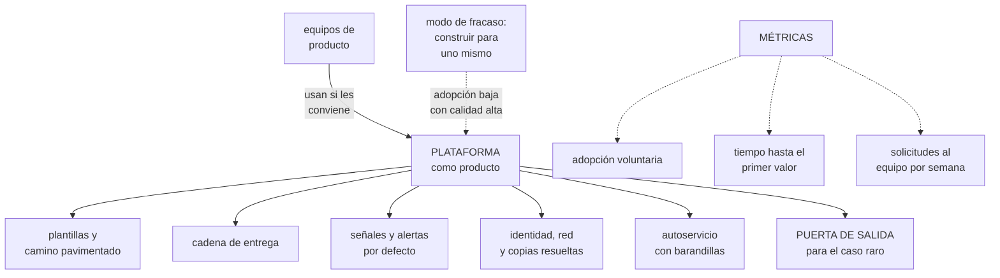

# 267 — Ruta Platform Engineer

> [← 266 · Ruta DevOps y Delivery Engineer](../../part-22-specializations-certifications-career/266-ruta-devops-y-delivery-engineer/README.md) · [Índice de la parte](../README.md) · [268 · Ruta Site Reliability Engineer →](../../part-22-specializations-certifications-career/268-ruta-site-reliability-engineer/README.md)

**Parte:** 22 — Especializaciones, certificaciones y práctica profesional<br>
**Nivel:** intermedio-avanzado · **Horas estimadas:** 4<br>
**Laboratorio:** `decision` · **Estado:** `EXECUTABLE_CORE`

## 🎯 Propósito

La ruta de plataforma: tratar la infraestructura interna como un producto con usuarios que pueden no usarlo. La clase da lo que la distingue de la ruta de entrega, la única métrica que importa —**adopción voluntaria**—, el criterio para decidir qué entra en la plataforma y qué no, y su modo de fracaso: **construir la plataforma que el equipo quiere construir, no la que los equipos necesitan**.

## 📚 Resultados de aprendizaje

Al finalizar podrás:

1. **Definir** la plataforma como producto con usuarios y competencia.
2. **Medir** adopción voluntaria, autonomía y tiempo hasta el primer valor.
3. **Decidir** qué entra en la plataforma y qué se deja fuera.
4. **Evitar** construir para el equipo de plataforma en vez de para sus usuarios.
5. **Reconocer** cuándo una organización todavía no necesita plataforma.

## 🧩 Conceptos centrales

| Concepto | Comprensión verificable |
|---|---|
| `plataforma interna` | Producto que otros equipos usan para entregar software sin depender de personas concretas. |
| `adopción voluntaria` | Porcentaje de equipos que la usan pudiendo no hacerlo. La medida honesta. |
| `camino pavimentado` | La forma fácil de hacer lo correcto. La plataforma es su implementación. |
| `puerta de salida` | Posibilidad de salirse de la plataforma para un caso concreto sin salirse del todo. |
| `tiempo hasta el primer valor` | Cuánto tarda un equipo nuevo desde que empieza hasta que sirve algo en producción. |
| `plataforma prematura` | Producto interno construido antes de que existan varios equipos con problemas comunes. |

## 🧠 Modelo mental

Una especialización combina fundamentos, evidencia de proyectos y juicio bajo restricciones; una insignia sin práctica no sustituye esa combinación.

Aplicado a esta clase, separa siempre cuatro planos: **intención** (qué necesita el usuario),
**configuración** (qué declaramos), **estado observado** (qué existe de verdad) y
**evidencia** (cómo sabemos que cumple). Confundirlos produce diseños que se ven correctos
en un diagrama pero fallan al operar.

## 🗺️ Flujo de razonamiento



## 📖 Desarrollo

### 1. Producto, no infraestructura

La diferencia entre esta ruta y las demás no es técnica: es que aquí los usuarios son internos y **pueden no usarte**.

```text
LO QUE CAMBIA AL TRATARLO COMO PRODUCTO
  hay usuarios, y se les pregunta
  hay alternativas, y compites con ellas
    → la alternativa siempre existe: hacerlo a mano
  hay adopción, y se mide
  hay versiones, migraciones y retirada
  y hay soporte

→ y si la plataforma es obligatoria, todo esto se apaga
→ la obligatoriedad esconde los defectos en vez de
  corregirlos                                  ley 16
```

Y lo que distingue esta ruta de la de entrega:

```text
ENTREGA                        PLATAFORMA
el camino del cambio           todo lo que un equipo
a producción                   necesita para ir solo

las cuatro métricas            adopción y autonomía

una cadena                     un producto con muchas
                               piezas: cadena, plantillas,
                               señales, identidad, red,
                               datos, coste

→ la de entrega es una PARTE de la de plataforma
→ y quien viene de entrega suele traer la cadena resuelta
  y la conversación con usuarios sin empezar
```

Y las tres métricas que dicen la verdad:

```text
1  ADOPCIÓN VOLUNTARIA
   equipos que la usan pudiendo no hacerlo
   → y si es obligatoria, la métrica no existe y hay que
     preguntar: «¿la usarías si no fuera obligatoria?»

2  TIEMPO HASTA EL PRIMER VALOR
   de un equipo nuevo a servir algo en producción
   → semanas significa que la plataforma no reduce trabajo
   → días significa que sí

3  SOLICITUDES AL EQUIPO DE PLATAFORMA POR SEMANA
   → y su tendencia
   → si crece con el número de equipos, no hay
     autoservicio: hay un mostrador

y una cuarta, para el equipo
   qué porcentaje del tiempo va a atender solicitudes
   → por encima del 40 %, la plataforma no avanza
```

Y la pregunta que ordena las prioridades:

```text
«¿QUÉ ES LO QUE MÁS VECES HAN TENIDO QUE RESOLVER LOS
EQUIPOS POR SU CUENTA ESTE TRIMESTRE?»

→ eso es la siguiente pieza
→ y no lo que el equipo de plataforma encuentra
  interesante
```

### 2. Qué entra y qué no

El criterio de alcance decide si la plataforma es útil o es una carga.

```text
ENTRA SI
  varios equipos lo necesitan
  hacerlo mal tiene consecuencias serias
    → identidad, red, copias, secretos, señales
  y resolverlo bien exige conocimiento que no todos
    tienen

NO ENTRA SI
  lo necesita un solo equipo
    → que lo haga él; y si aparece un segundo, se reconsidera
  varía mucho entre equipos
    → la abstracción costará más de lo que ahorra
  o está cambiando rápido
    → congelarlo en una plantilla lo hace obsoleto

→ y la regla práctica: se abstrae al TERCER caso, no al
  primero
→ dos casos no dicen dónde está la variación
```

Y la pieza que casi nadie diseña y que decide la adopción:

```text
LA PUERTA DE SALIDA
  «quiero todo lo de la plataforma, salvo el balanceador,
  que en mi caso necesita algo que no cubrís»

  si la respuesta es «entonces sal del todo»
  → el equipo sale del todo
  → y se lleva consigo las señales, las copias y los
    permisos bien puestos

  si la respuesta es «cambia esa pieza y quédate con el
  resto»
  → el equipo se queda

→ una plataforma sin puerta de salida pierde a sus
  usuarios más avanzados
→ y esos son los que descubren lo que le falta
```

Y los niveles de la ruta:

```text
NIVEL 2 · RESUELVO
  monta piezas de la plataforma que funcionan
  documenta y da soporte
  y sabe por qué un equipo no la usa, porque lo ha
    preguntado

NIVEL 3 · DISEÑO
  decide el alcance: qué entra y qué se deja fuera
  diseña interfaces estables y migraciones sin ruptura
                                            clase 106
  y mide adopción, no calidad interna

NIVEL 4 · CAMBIO EL SISTEMA
  la plataforma cambia cómo se organiza la empresa
  los equipos de producto responden de sus servicios
    porque PUEDEN
  y el equipo de plataforma deja de aparecer en la ruta
    crítica de nadie
```

Y el requisito que la hace sostenible:

```text
LA PLATAFORMA TAMBIÉN SE OPERA
  tiene guardia, señales, procedimientos y ensayos
                                            parte 21
  → y su indisponibilidad afecta a todos los equipos
  → una plataforma sin operación propia es un riesgo
    concentrado                            clase 185

y tiene compromiso de servicio con sus usuarios
  → «la cadena de entrega estará disponible el 99,5 %»
  → y si no se cumple, los equipos vuelven a hacerlo a
    mano
```

### 3. El modo de fracaso y la plataforma prematura

Dos formas de equivocarse, y la segunda es más común de lo que parece.

```text
MODO DE FRACASO 1 · CONSTRUIR PARA UNO MISMO
  el equipo construye lo que le parece elegante
  → abstracciones profundas, configuración expresiva,
    plantillas anidadas
  y los usuarios no lo entienden

  la señal
    calidad interna alta y adopción baja
    → y el equipo lo interpreta como falta de formación
    → cuando es una respuesta del mercado interno

  la corrección
    hablar con usuarios cada semana, no cada trimestre
    medir el tiempo hasta el primer valor con alguien
      real, mirando
    y aceptar que la configuración sobra casi siempre

MODO DE FRACASO 2 · LA PLATAFORMA PREMATURA
  se monta una plataforma con dos equipos y tres servicios
  → y no hay suficientes casos para saber qué abstraer
  → y se congela una forma de trabajar que aún no está
    entendida

  la señal
    la plataforma cambia cada mes por peticiones
    y el equipo de plataforma es más grande que los
    equipos que la usan

  la corrección
    no montar plataforma hasta que haya problemas
    REPETIDOS entre varios equipos
    → y mientras tanto, hacer bibliotecas y plantillas
      copiables, que no crean dependencia
```

Y el techo de la ruta:

```text
EL TECHO
  la plataforma funciona, se adopta y el equipo ya no está
  en la ruta crítica de nadie
  → y entonces la limitación pasa a ser la arquitectura de
    los sistemas o la organización

continuaciones
  a  ARQUITECTURA                            clase 272
     los límites entre servicios y equipos
  b  FIABILIDAD                              clase 268
     responder de propiedades del conjunto
  c  o dirección técnica
     donde el trabajo es de personas y de prioridades
```

Y la señal de que la organización todavía no necesita esta ruta:

```text
☐ hay menos de tres equipos entregando software
☐ los problemas que se repiten aún no se han repetido
☐ no hay nadie que pueda dedicarse a ello de forma
  sostenida
→ si se cumple alguna, hacer plantillas y bibliotecas,
  no plataforma
```

Y la lista de comprobación de la clase:

```text
☐ la plataforma tiene usuarios y se les pregunta
☐ la adopción es voluntaria, o sé qué esconde que no lo sea
☐ mido tiempo hasta el primer valor con alguien real
☐ las solicitudes al equipo no crecen con el número de
  equipos
☐ el equipo dedica menos del 40 % a atender solicitudes
☐ se abstrae al tercer caso, no al primero
☐ existe puerta de salida por pieza
☐ hay interfaz estable y migraciones sin ruptura
☐ la plataforma se opera: guardia, señales, procedimientos
☐ tiene compromiso de servicio con sus usuarios
☐ sé por qué cada equipo que no la usa no la usa
☐ y sé si la organización necesita plataforma o todavía no
```

Y el cierre que enlaza con la clase siguiente: la plataforma hace que otros puedan; queda quien responde de que el sistema cumpla lo prometido, con un número acordado y la autoridad para frenar. La ruta de fiabilidad es la materia de la clase 268.

### 4. Cómo se demuestra esta ruta

Lo que vale como evidencia, en entrevista y en revisión de desempeño.

```text
LO QUE NO VALE
  «monté la plataforma interna»
  «usamos Kubernetes y plantillas»
  → describe el qué y no el efecto

LO QUE VALE
  «la adopción pasó de 3 a 38 de 41 servicios en 9 meses,
   y lo que lo movió fue bajar las pruebas de 40 a 9
   minutos y la configuración de 11 ficheros a 1»
  «el tiempo de un servicio nuevo hasta producción pasó
   de 3 semanas a 2 días»
  «las solicitudes al equipo bajaron de 34 a 6 por semana
   con el doble de equipos»

→ efecto, mecanismo y cifra                clase 275
```

Y las preguntas que separan niveles:

```text
«¿cuántos equipos la usan y cuántos podrían no usarla?»
  → si es obligatoria, ¿qué pasaría si dejara de serlo?

«¿qué pieza de la plataforma retirasteis y cómo?»
  → nivel 3 ha retirado algo; nivel 2 solo ha añadido

«¿qué hace un equipo que necesita algo que no cubrís?»
  → la respuesta revela si hay puerta de salida

«¿qué porcentaje del tiempo de tu equipo va a soporte?»
  → y su tendencia

y la que más discrimina
«¿por qué el último equipo que no la adoptó no la
adoptó?»
  → quien no lo sabe no está tratando esto como producto
```

Y el consejo específico de la ruta:

```text
SIÉNTATE CON UN EQUIPO NUEVO Y MIRA SIN AYUDAR
  con un cronómetro y sin decir nada
  → dónde se atasca, qué busca y no encuentra, qué
    interpreta al revés

→ una hora de esto vale más que un trimestre de
  encuestas
→ y es el mismo método de los ensayos: observar sin
  intervenir                                clase 261
```

Y el error de comunicación que más cuesta:

```text
PRESENTAR LA PLATAFORMA COMO AHORRO DE COSTE
  → y entonces se evalúa contra el coste del equipo que
    la mantiene, y siempre pierde

PRESENTARLA COMO CAPACIDAD DE ENTREGA
  → «los equipos entregan en 2 días lo que antes tardaba
    3 semanas, con 14 equipos en vez de 3»
  → y eso sí se compara con lo que produce
```

## 🔬 Ejemplo trabajado

**La plataforma de CloudShop, tres años en cifras. Lo que sigue es el intento prematuro que se desmontó, la reconstrucción con puerta de salida, y las dos preguntas que decidieron cada prioridad.**

**Intento 1 · La plataforma prematura.**

```text
momento
  2 equipos de producto, 6 servicios
  1 persona dedicada a plataforma

lo que se construyó, en 5 meses
  abstracción propia sobre la infraestructura
  un lenguaje de descripción de servicios
  un panel interno de despliegue
  y plantillas para «cualquier servicio»

lo que pasó
  cada servicio nuevo requería extender la abstracción
  → 11 extensiones en 5 meses
  la abstracción tenía casos especiales para 4 de los 6
    servicios
  y la persona de plataforma pasó a ser dependencia de
    todo

y la señal clara
  tiempo de un servicio nuevo
    antes de la plataforma            4 días
    con la plataforma                 6 días
```

Y el diagnóstico:

```text
con 6 servicios no había forma de saber qué variaba y qué
no
→ se abstrajo al primer caso, no al tercero
→ y la abstracción codificó las particularidades de los
  dos primeros servicios

lo que se hizo
  se retiró la abstracción
  se dejaron PLANTILLAS COPIABLES
    → cada equipo copia y modifica
    → duplicación, sí; dependencia, no
  y se apuntó lo que se repetía

→ 14 meses después, con 9 equipos y 27 servicios, esas
  notas dijeron exactamente qué abstraer
```

**Intento 2 · La reconstrucción.**

```text
punto de partida
  9 equipos, 27 servicios
  y una lista de lo que cada equipo había resuelto por su
  cuenta, recogida durante 14 meses

lo que se repetía, por número de equipos que lo habían
resuelto solos
  señales y paneles básicos                     9/9
  identidad y permisos de servicio              9/9
  copias y su verificación                      8/9
  cadena de entrega                             9/9
  gestión de secretos                           7/9
  red y exposición                              9/9
  alta disponibilidad entre zonas               6/9
  colas y reintentos                            5/9
  caché                                         4/9
  búsqueda                                      2/9

→ se construyó de arriba abajo
→ y búsqueda y caché se dejaron fuera, con nota
```

Y la puerta de salida, que fue la decisión de diseño más discutida:

```text
cada pieza se puede sustituir sin salir de la plataforma
  → «uso vuestra cadena, vuestras señales y vuestros
    permisos, pero mi red la monto yo»
  → y la plataforma sigue dando lo demás

coste de esta decisión
  las piezas tienen que tener interfaz, no estar
  entrelazadas                              clase 106
  → más trabajo de diseño

y lo que produjo
  equipos que usan la plataforma completa           31
  equipos que sustituyen 1 o 2 piezas                7
  equipos fuera del todo                             3

→ sin puerta de salida, esos 7 habrían salido del todo
→ y con ellos, 7 servicios sin señales ni copias bien
  puestas
```

**Las dos preguntas que decidieron cada prioridad.**

```text
PREGUNTA 1, cada trimestre, a cada equipo
  «¿qué has tenido que resolver por tu cuenta este
  trimestre?»

PREGUNTA 2, en la sesión de observación
  se sienta un equipo nuevo con la plataforma
  y el equipo de plataforma MIRA sin ayudar, una hora

lo que la observación encontró, y las encuestas no
  el ejemplo de la documentación no funcionaba
    (una variable había cambiado de nombre)
  el mensaje de error al faltar un permiso decía
    «acceso denegado» sin decir cuál
  la plantilla pedía elegir entre tres opciones sin
    explicar la diferencia
  y el primer despliegue fallaba siempre por un valor por
    defecto que nadie cambiaba

→ los cuatro son triviales de arreglar
→ y los cuatro costaban entre 20 y 90 minutos a CADA
  equipo nuevo
→ ninguna encuesta los había mencionado
```

**Las cifras, a los tres años.**

```text                               año 1     año 2     año 3
equipos de producto                     2         9        14
servicios                               6        27        41
personas en plataforma                  1         3         4

adopción voluntaria                     -    18/27     38/41
tiempo hasta el primer valor       6 días    5 días    2 días
solicitudes al equipo/semana            -        34         6
% del tiempo en soporte                 -      61 %      18 %
disponibilidad de la cadena             -    97,1 %    99,7 %

servicios con señales por defecto       -     11/27     41/41
servicios con copias verificadas        -      9/27     39/41
servicios con permisos mínimos          -      6/27     38/41
```

Y la cifra que el equipo usó para defender su presupuesto:

```text
no se presentó como ahorro de coste
se presentó así

  equipos que entregan solos            2 → 14
  servicios en producción               6 → 41
  personas de plataforma                1 → 4

  servicios por persona de plataforma   6 → 10,25
  y tiempo de un servicio nuevo    4 días → 2 días

→ el sistema creció 7 veces con 4 veces el equipo
→ y la calidad por defecto subió: 41 de 41 con señales,
  frente a 11 de 27 dos años antes
```

Y el fracaso que quedó registrado:

```text
la pieza de colas y reintentos se construyó en el año 2
  la habían resuelto solos 5 de 9 equipos
  adopción a los 6 meses                        2 de 14

por qué
  cada equipo tenía necesidades distintas de orden,
  reintento y duplicados                    clase 210
  → la variación era el problema, no la repetición
  → «lo han resuelto muchos» no implica «lo resuelven
    igual»

se retiró
  y se sustituyó por documentación y ejemplos revisados
  → adopción de los ejemplos                  11 de 14

→ y la lección quedó: antes de abstraer, comprobar que
  las N soluciones se parecen
```

**La lección que esta clase deja**: la primera plataforma hizo que un servicio nuevo tardara **6 días en vez de 4**, porque se abstrajo con seis servicios y la abstracción codificó las particularidades de los dos primeros. Y la puerta de salida —la decisión más discutida— retuvo a **7 equipos** que habrían salido del todo, y con ellos siete servicios que habrían perdido señales, copias y permisos mínimos.

## 🧪 Laboratorio guiado

Ejecuta desde la raíz:

```bash
python classes/part-22-specializations-certifications-career/267-ruta-platform-engineer/lab.py
```

El laboratorio selecciona el motor de práctica **`decision`** y produce
`lab_result.json`. El escenario, sus comprobaciones y el artefacto esperado corresponden a
esta clase; no requiere credenciales y deja explícito qué debe revalidarse en un sandbox real.

1. Lee `exercise.steps` y formula una predicción antes de ejecutar.
2. Ejecuta la práctica y verifica todos los elementos de `checks`.
3. Provoca el caso de `negative_test` y explica la señal observada.
4. Materializa `platform-engineer-plan` en `evidence/` usando la plantilla indicada.
5. Para proveedor real, sigue `sandbox.requires`, registra costo y ejecuta `destroy`.

### Evidencia esperada

El artefacto principal es una matriz de decisión ponderada y un ADR. Además, la entrega debe incluir el comando ejecutado,
la salida estructurada y una conclusión que no exceda lo observado.

## 🏆 Reto verificable

Construye **`platform-engineer-plan`** para el caso CloudShop. Incluye una alternativa descartada,
un supuesto que pueda falsarse, una prueba de fallo y una decisión de rollback.

## ✅ Criterio de aceptación

- [ ] `lab.py` termina con código 0 y genera JSON válido.
- [ ] La entrega conecta al menos tres requisitos con mecanismos verificables.
- [ ] Existe una prueba positiva y una prueba negativa con evidencia.
- [ ] Seguridad, costo y operación aparecen como decisiones, no como anexos.
- [ ] Se declara una limitación y una condición que obligaría a revisar el diseño.
- [ ] Otra persona puede repetir el recorrido sin conocimiento tácito.

## ⚠️ Errores frecuentes

| Síntoma | Causa probable | Corrección |
|---|---|---|
| La plataforma tiene calidad alta y adopción baja | Se construyó para el equipo de plataforma, no para sus usuarios | Siéntate a mirar a un equipo nuevo sin ayudar durante una hora; encontrarás obstáculos triviales que ninguna encuesta menciona. |
| Cada servicio nuevo obliga a extender la abstracción | Se abstrajo demasiado pronto, con muy pocos casos para saber qué varía | Abstrae al tercer caso; hasta entonces usa plantillas copiables, que duplican pero no crean dependencia. |
| Un equipo con una necesidad especial abandona la plataforma entera | No hay puerta de salida por pieza | Diseña piezas con interfaz para que se puedan sustituir una a una; sin eso pierdes a los usuarios más avanzados. |
| Las solicitudes al equipo crecen con cada equipo nuevo | Hay mostrador en vez de autoservicio | Convierte en autoservicio con validación cada solicitud repetida y vigila que el soporte no pase del 40 % del tiempo. |
| Se construyó una pieza que muchos habían resuelto y casi nadie la adopta | Se confundió repetición con uniformidad: cada equipo lo resolvía distinto | Antes de abstraer comprueba que las soluciones existentes se parecen; si varían mucho, documenta y da ejemplos. |
| La plataforma se justifica como ahorro y siempre pierde en el presupuesto | Presentada como coste, se compara con el coste del equipo que la mantiene | Preséntala como capacidad de entrega: equipos que entregan solos, servicios por persona de plataforma y tiempo hasta producción. |

## 🛡️ Seguridad, ética y costo

Trabaja con cuentas propias o sandboxes autorizados. No publiques secretos, identificadores
reales ni datos personales. Antes de crear recursos pagos define presupuesto, etiquetas y
comando de destrucción; después verifica que no queden recursos huérfanos. Los ejemplos
locales enseñan contratos, pero no certifican cumplimiento ni disponibilidad de producción.

## ❓ Preguntas de comprobación

1. ¿Qué cambia al tratar la infraestructura interna como producto?
2. ¿Cuáles son las tres métricas que dicen la verdad sobre una plataforma?
3. ¿Qué criterio decide si algo entra en la plataforma?
4. ¿Para qué sirve la puerta de salida y qué pasa sin ella?
5. ¿Cómo se reconoce una plataforma prematura y qué se hace en su lugar?

## 🔗 Referencias

- Skelton, M. y Pais, M. (2019). *Team Topologies* — equipos de plataforma como habilitadores. <https://teamtopologies.com/book>
- Bottcher, E. (2018). *What I talk about when I talk about platforms*. <https://martinfowler.com/articles/talk-about-platforms.html>
- Google (2024). *DORA: platform engineering and developer experience*. <https://dora.dev/research/>
- CNCF (2024). *Platform engineering maturity model*. <https://tag-app-delivery.cncf.io/whitepapers/platform-eng-maturity-model/>
- Humanitec (2024). *Platform as a product: reference architectures*. <https://humanitec.com/reference-architectures>
- Documentación oficial vigente del servicio implementado; registra URL y fecha de consulta.

---

> [Evaluación](assessment.md) · [Contrato de clase](lesson.yaml) · [Índice de la parte](../README.md)

**📥 Descargar:** [Parte 22 en PDF](../../../site/downloads/partes/manual-parte-22-specializations-certifications-career.pdf) · [Manual integral](../../../site/downloads/multi-cloud-engineering-manual-v2.0.pdf)

| Anterior | Índice | Siguiente |
|---|---|---|
| [← 266 · Ruta DevOps y Delivery Engineer](../../part-22-specializations-certifications-career/266-ruta-devops-y-delivery-engineer/README.md) | [Parte 22](../README.md) · [Programa](../../README.md) | [268 · Ruta Site Reliability Engineer →](../../part-22-specializations-certifications-career/268-ruta-site-reliability-engineer/README.md) |
