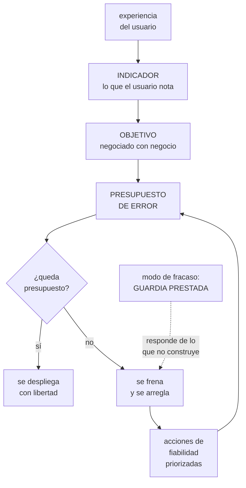

# 268 — Ruta Site Reliability Engineer

> [← 267 · Ruta Platform Engineer](../../part-22-specializations-certifications-career/267-ruta-platform-engineer/README.md) · [Índice de la parte](../README.md) · [269 · Ruta Cloud Security Engineer →](../../part-22-specializations-certifications-career/269-ruta-cloud-security-engineer/README.md)

**Parte:** 22 — Especializaciones, certificaciones y práctica profesional<br>
**Nivel:** intermedio-avanzado · **Horas estimadas:** 4<br>
**Laboratorio:** `decision` · **Estado:** `EXECUTABLE_CORE`

## 🎯 Propósito

La ruta de fiabilidad: responder de que el sistema cumpla lo prometido, con un número acordado y la autoridad para actuar sobre él. La clase da lo que la distingue de «operar bien» —el objetivo negociado, el presupuesto de error y la potestad de frenar—, las competencias que se miden, y su modo de fracaso: **convertirse en el equipo que hace las guardias de los demás**.

## 📚 Resultados de aprendizaje

Al finalizar podrás:

1. **Definir** objetivos de nivel de servicio que representen al usuario.
2. **Usar** el presupuesto de error como mecanismo de decisión, no de informe.
3. **Negociar** el número con negocio y con producto, con sus costes.
4. **Evitar** convertirse en el equipo que absorbe la guardia ajena.
5. **Reconocer** el techo de la ruta y qué la continúa.

## 🧩 Conceptos centrales

| Concepto | Comprensión verificable |
|---|---|
| `indicador de nivel de servicio` | Medida de algo que el usuario experimenta: éxito de una operación, latencia, frescura. |
| `objetivo de nivel de servicio` | El valor acordado que ese indicador debe cumplir. Se negocia, no se declara. |
| `presupuesto de error` | Lo que sobra del objetivo. Se gasta desplegando; agotarlo tiene consecuencias acordadas. |
| `potestad de frenar` | Autoridad para detener despliegues cuando el presupuesto se agota. Sin ella, el objetivo es decorativo. |
| `trabajo repetitivo` | Tarea manual sin valor duradero que crece con el sistema. Su límite define esta ruta. |
| `guardia prestada` | Modo de fracaso en que el equipo de fiabilidad responde de servicios que no construye. |

## 🧠 Modelo mental

Una especialización combina fundamentos, evidencia de proyectos y juicio bajo restricciones; una insignia sin práctica no sustituye esa combinación.

Aplicado a esta clase, separa siempre cuatro planos: **intención** (qué necesita el usuario),
**configuración** (qué declaramos), **estado observado** (qué existe de verdad) y
**evidencia** (cómo sabemos que cumple). Confundirlos produce diseños que se ven correctos
en un diagrama pero fallan al operar.

## 🗺️ Flujo de razonamiento



## 📖 Desarrollo

### 1. Qué distingue esta ruta

No es «operar bien»: eso lo hace la parte 21 entera. Lo que define esta ruta son tres cosas que casi nunca están juntas.

```text
1  UN NÚMERO ACORDADO
   no «que vaya bien», sino «el 99,9 % de las compras se
   completan en menos de 2 segundos»
   → acordado con negocio, no declarado por ingeniería

2  UN MECANISMO QUE CONVIERTE EL NÚMERO EN DECISIONES
   el presupuesto de error
   → mientras quede, se despliega con libertad
   → cuando se agota, se para y se arregla

3  Y LA POTESTAD DE APLICARLO
   → sin esto, el objetivo es un informe mensual que nadie
     lee
   → y esta es la parte que no es técnica y la que decide
     si la ruta existe de verdad
```

Y el indicador, que es donde se cometen los errores:

```text
UN BUEN INDICADOR
  mide lo que el usuario experimenta
  se mide donde el usuario está, no en el servidor
  tiene un umbral claro de bueno y malo
  y su caída significa que alguien está sufriendo

UN MAL INDICADOR
  disponibilidad de la máquina
  uso de CPU
  «la petición devolvió 200»
    → aunque el contenido esté vacío         ley 29
  y el promedio de latencia
    → la media oculta la cola                clase 186

→ la prueba: «si esto empeora, ¿lo nota alguien?»
→ y la inversa, que es la que más falla:
  «si algo empeora para el usuario, ¿esto lo refleja?»
```

Y cómo se elige el objetivo, que se negocia:

```text
NO SE ELIGE «EL MÁS ALTO POSIBLE»
  cada nueve adicional multiplica el coste
  99,9 %    8,7 h al año de margen
  99,95 %   4,4 h
  99,99 %   52 min
  → y pasar de 99,9 a 99,99 puede costar más que todo el
    servicio

SE ELIGE MIRANDO
  qué nota el usuario de verdad
    → si el cliente móvil ya falla el 0,4 % por la red,
      un 99,99 % de servidor no lo nota nadie
  qué prometen los contratos
  qué cuesta cada nivel
  y qué disponibilidad tienen las dependencias
                                            clase 185

→ y el objetivo debe ser PEOR que lo que hoy se consigue
  por casualidad
→ si el objetivo se cumple siempre sin esfuerzo, no está
  midiendo nada útil
```

### 2. El presupuesto de error como mecanismo

El presupuesto de error solo sirve si tiene consecuencias acordadas de antemano. Si no, es una métrica más.

```text
CÓMO FUNCIONA
  objetivo 99,9 % → presupuesto 0,1 %
  en 30 días, unos 43 minutos de fallo total equivalente

  cada incidente y cada despliegue fallido lo consumen
  y se repone al empezar la ventana siguiente

LAS CONSECUENCIAS, escritas ANTES
  presupuesto > 50 %      se despliega con libertad; se
                          pueden asumir riesgos
  presupuesto < 25 %      solo cambios de bajo riesgo;
                          revisión más estricta
  presupuesto agotado     se congelan las funciones
                          nuevas; el equipo trabaja en
                          fiabilidad hasta reponerlo

→ y esto último es lo que le da poder
→ y es lo que hay que acordar con producto ANTES de que
  ocurra, no durante
```

Y lo que el mecanismo consigue, que es su verdadero propósito:

```text
CONVIERTE UNA DISCUSIÓN DE OPINIONES EN UNA DE DATOS
  antes  «hay que ir más despacio» / «hay que entregar»
  ahora  «queda el 18 % del presupuesto»

y alinea incentivos
  a producto le interesa que el sistema sea fiable, porque
  si no, se le congelan las funciones
  a ingeniería le interesa no ser conservadora de más,
  porque el presupuesto sin gastar es margen
  desaprovechado

→ y ese segundo punto sorprende: gastar POCO presupuesto
  también es una señal
→ significa que se podría entregar más rápido o que el
  objetivo está mal puesto
```

Y los errores más comunes con el presupuesto:

```text
1  NO TENER CONSECUENCIAS
   se informa y no pasa nada
   → y entonces es un panel bonito

2  PONER EL OBJETIVO DONDE YA SE CUMPLE
   → presupuesto siempre lleno, nunca decide nada

3  MEDIRLO SOBRE LA VENTANA EQUIVOCADA
   30 días móviles funciona bien
   → trimestral esconde; semanal es demasiado ruidoso

4  EXCLUIR INCIDENTES «QUE NO CUENTAN»
   → «esto fue del proveedor»
   → el usuario no distingue de quién fue      clase 185
   → y si se excluye, el número deja de representarlo

5  Y TENER DEMASIADOS
   → 3 a 5 objetivos por servicio; más no se gestionan
```

### 3. Competencias, niveles y el trabajo repetitivo

Lo que se mide en esta ruta, por nivel.

```text
NIVEL 2 · RESUELVO
  define indicadores que representan al usuario
  instrumenta y mide con corrección     clases 211, 257
  diagnostica y arregla                     clase 258
  escribe procedimientos y análisis posteriores
                                      clases 111, 259
  y responde de una guardia

NIVEL 3 · DISEÑO
  negocia objetivos con negocio y sostiene el número
  diseña degradación y vertido de carga     clase 262
  hace análisis de modos de fallo antes de que ocurran
  dimensiona capacidad y márgenes
  y dice que no a un despliegue, con argumento

NIVEL 4 · CAMBIO EL SISTEMA
  el presupuesto de error se respeta sin discusión porque
  la organización lo acordó
  la fiabilidad se diseña en los servicios nuevos, no se
  añade después
  y el trabajo repetitivo baja mientras el sistema crece
```

Y el límite que define la salud de la ruta:

```text
EL LÍMITE AL TRABAJO REPETITIVO
  la práctica clásica: no más del 50 % del tiempo
  → y el resto, en trabajo que reduce el futuro trabajo

  y si se pasa
    se devuelve la guardia al equipo que construye
    o se para de aceptar servicios nuevos

→ este límite es lo que impide el modo de fracaso
→ y hay que escribirlo antes de necesitarlo
```

Y el modo de fracaso, que es el más frecuente de todas las rutas:

```text
LA GUARDIA PRESTADA
  el equipo de fiabilidad acaba respondiendo de servicios
  que no construye

  cómo empieza
    «vosotros sabéis operar mejor»
    y el equipo de producto deja de recibir alertas

  qué produce
    quien construye no sufre lo que construye
    → y entonces no lo arregla                clase 111
    el equipo de fiabilidad se llena de trabajo repetitivo
    y su conocimiento de cada servicio es superficial

  cómo se evita
    CRITERIOS DE ENTRADA para aceptar un servicio
      señales definidas y objetivos acordados
      procedimientos ejecutables            clase 259
      despliegue progresivo y vuelta atrás  clase 260
      y el equipo que lo construye COMPARTE la guardia
    y criterios de SALIDA
      → si el servicio deja de cumplirlos, se devuelve

→ y devolver un servicio es la acción más impopular y más
  necesaria de esta ruta
```

### 4. Negociar el número y el techo de la ruta

La parte que hace difícil esta especialidad no es medir: es sostener el número cuando incomoda.

```text
CÓMO SE NEGOCIA CON NEGOCIO
  no se pregunta «¿qué disponibilidad quieres?»
  → la respuesta siempre es «la máxima»

  se pregunta
    «¿cuánto vale para el negocio una hora de caída?»
    «¿qué prefieres: esta función un mes antes o pasar de
     99,9 a 99,95?»
    «¿qué le pasa a un usuario cuando esto falla?»

  y se presenta el coste de cada nivel
    → con la cifra de la parte 19: la redundancia entre
      regiones no es un ajuste, es otro sistema
                                            clase 187
```

Y cómo se sostiene:

```text
CUANDO EL PRESUPUESTO SE AGOTA Y HAY UN LANZAMIENTO
  la conversación no es «¿lo paramos?»
  es «acordamos esto; ¿queréis cambiar el acuerdo?»
  → y cambiar el acuerdo es legítimo, si es explícito
  → lo ilegítimo es ignorarlo

y la salida honesta
  «podemos lanzarlo si asumimos que el objetivo baja a
  99,5 % este trimestre; ¿lo asumimos?»
  → decisión de negocio, registrada

→ el trabajo de esta ruta no es impedir: es hacer la
  decisión VISIBLE
```

Y el techo:

```text
EL TECHO
  el sistema cumple, el presupuesto se respeta y el
  trabajo repetitivo está bajo control
  → y lo que limita entonces es la arquitectura o la
    organización

continuaciones
  a  ARQUITECTURA                            clase 272
     si el límite es cómo está construido
  b  PLATAFORMA                              clase 267
     si el límite es que cada equipo lo resuelve solo
  c  o dirección técnica
     si el límite es cómo se priorizan las decisiones
```

Y la lista de comprobación de la clase:

```text
☐ mis indicadores miden lo que el usuario experimenta
☐ se miden donde el usuario está
☐ el objetivo está acordado con negocio, no declarado
☐ el objetivo no se cumple solo, por casualidad
☐ hay entre 3 y 5 objetivos por servicio
☐ el presupuesto de error tiene consecuencias escritas
  antes
☐ no se excluyen incidentes «que no cuentan»
☐ la ventana es de 30 días móviles
☐ existe potestad de frenar y se ha ejercido alguna vez
☐ el trabajo repetitivo tiene límite escrito
☐ hay criterios de entrada y de salida para aceptar
  servicios
☐ quien construye comparte la guardia
☐ gastar poco presupuesto también se revisa
```

Y el cierre que enlaza con la clase siguiente: la fiabilidad responde de que el sistema cumpla; queda quien responde de que un fallo no sea catastrófico ni deliberado. La ruta de seguridad es la materia de la clase 269.

## 🔬 Ejemplo trabajado

**La ruta de fiabilidad en CloudShop: del panel que nadie miraba al presupuesto que paró un lanzamiento. Lo que sigue son los objetivos mal puestos que se corrigieron, la negociación que costó tres reuniones, y el servicio que hubo que devolver.**

**Punto de partida: los objetivos que no medían nada.**

```text
lo que había, 14 objetivos declarados por ingeniería

  objetivo                     valor    cumplido en 12 meses
  disponibilidad de máquinas   99,95 %          12/12 meses
  CPU media < 70 %                  -           12/12
  latencia media < 200 ms           -           11/12
  errores 5xx < 0,1 %          99,9 %           12/12
  ...

→ 12 de 14 se cumplían todos los meses
→ y en esos 12 meses hubo 34 incidentes de gravedad alta

→ los objetivos no medían lo que fallaba
```

Y el ejemplo que lo dejó claro:

```text
el incidente del carrito perdido           clase 261
  el 9 % de los usuarios perdía la sesión
  → todas las peticiones devolvían 200
  → la latencia, normal
  → la CPU, normal
  → los 14 objetivos, cumplidos

→ el usuario perdía su compra y ningún número lo reflejaba
```

**La corrección: cuatro indicadores por recorrido.**

```text
se eligieron por RECORRIDO DE USUARIO, no por servicio

  COMPRAR
    éxito     % de intentos de compra que se completan
    latencia  % que se completan en < 2 s
  BUSCAR Y VER CATÁLOGO
    éxito     % de búsquedas con resultado
    latencia  % en < 800 ms
  SEGUIMIENTO DE PEDIDO
    frescura  % de consultas con estado de < 5 min de
              antigüedad
  DEVOLUCIONES
    éxito     % de solicitudes que se registran

y se miden en el CLIENTE, no en el servidor
  → y ahí apareció una diferencia que nadie esperaba
```

Y la diferencia:

```text                            medido en      medido en
                             el servidor      el cliente
éxito de compra                   99,94 %         98,71 %

→ 1,23 puntos de diferencia
→ causas: plazos del cliente móvil, errores de red del
  usuario, y una versión de la aplicación con un fallo
  que reintentaba mal                         clase 201

→ y el 1,23 % eran unas 4.100 compras al mes
→ ninguna aparecía en ningún panel
```

**La negociación del número: tres reuniones.**

```text
reunión 1  ingeniería propone 99,95 % para comprar
           negocio dice «¿por qué no 99,99?»

reunión 2  ingeniería lleva el coste
             99,9 %   sistema actual + trabajo de
                      fiabilidad          ~0 adicional
             99,95 %  + redundancia de la base entre
                      zonas y vertido de carga
                                       +14.000 USD/mes
             99,99 %  + segunda región activa, datos
                      replicados, ensayos mensuales
                                      +112.000 USD/mes
                                      + 2 personas

           y la pregunta que cambió la conversación
             «¿cuánto vale una hora de caída del flujo de
             compra?»
             → negocio lo calculó: ~31.000 USD

reunión 3  se acuerda
             comprar        99,95 %
             buscar         99,9 %
             seguimiento    99,5 %
             devoluciones   99,5 %

           y el razonamiento escrito
             99,99 % costaría 1,34 M USD/año para evitar
             ~7,7 h de caída al año → ~239.000 USD de
             impacto
             → no se justifica
```

Y las consecuencias, acordadas por escrito:

```text
presupuesto > 50 %   despliegue libre; se pueden probar
                     cosas
presupuesto < 25 %   solo cambios de bajo riesgo
presupuesto agotado  se congelan funciones nuevas del
                     recorrido afectado hasta reponerlo

y la excepción
  producto puede pedir una revisión del objetivo, por
  escrito, con la nueva cifra y su vigencia
```

**El trimestre en que se aplicó.**

```text
mes 2  el presupuesto de «comprar» cae al 11 %
       causa: dos incidentes y tres despliegues fallidos
mes 2  había un lanzamiento previsto para 9 días después

la conversación
  no fue «¿lo paramos?»
  fue «acordamos congelar; ¿queréis cambiar el acuerdo?»

lo que decidió negocio
  el lanzamiento se retrasó 3 semanas
  y el equipo dedicó ese tiempo a
    la instancia con disco degradado         clase 258
    la verificación automática tras desplegar
    y el vertido de carga                    clase 262

resultado
  presupuesto del mes siguiente        94 %
  y el lanzamiento salió sin incidentes
```

Y el dato que convenció a producto para el trimestre siguiente:

```text
lanzamientos con presupuesto > 50 %          11
  con incidente asociado                      1
lanzamientos con presupuesto < 25 %           4
  con incidente asociado                      3

→ el presupuesto predecía el riesgo del lanzamiento
→ y a partir de ahí, producto empezó a mirarlo antes de
  planificar fechas
```

**El servicio que hubo que devolver.**

```text
criterios de entrada, escritos
  señales definidas y objetivos acordados
  procedimientos en grado 2 o superior     clase 259
  despliegue progresivo con vuelta atrás   clase 260
  y guardia compartida con el equipo que construye

el servicio de recomendaciones entró en el mes 4
  cumplía los cuatro

mes 9
  interrupciones de guardia por ese servicio     41 %
    del total
  procedimientos actualizados por su equipo        0
  incidentes con acciones cerradas               2/9
  y su equipo había dejado de compartir la guardia

se aplicó el criterio de salida
  → se devolvió el servicio a su equipo, con 4 semanas de
    aviso
  → conversación muy incómoda

y lo que pasó a los 3 meses
  interrupciones de ese servicio            -74 %
  procedimientos actualizados                     6
  y su equipo pidió volver a entrar

→ y volvió, cumpliendo los criterios
→ y el mecanismo funcionó: quien construye sufre lo que
  construye, y entonces lo arregla            clase 111
```

**Las cifras a los 18 meses.**

```text                                        antes     después
objetivos definidos                           14           6
  que se cumplen siempre sin esfuerzo         12           0
medición en el cliente                        no          sí
incidentes de gravedad alta               34/año      13/año
incidentes no reflejados en ningún
  objetivo                                 26/34        0/13

presupuesto agotado (trimestres)               -       2 de 6
congelaciones aplicadas                        -           2
congelaciones ignoradas                        -           0
revisiones de objetivo pedidas por
  producto, por escrito                        -           1

trabajo repetitivo del equipo             71 %          38 %
servicios aceptados                            -          17
servicios devueltos                            -           1
```

**La lección que esta clase deja**: catorce objetivos se cumplían todos los meses mientras ocurrían **34 incidentes graves al año**, porque medían máquinas y no recorridos. Y medir en el cliente en vez de en el servidor reveló **1,23 puntos** de diferencia —unas 4.100 compras al mes— que ningún panel del servidor podía mostrar.

## 🧪 Laboratorio guiado

Ejecuta desde la raíz:

```bash
python classes/part-22-specializations-certifications-career/268-ruta-site-reliability-engineer/lab.py
```

El laboratorio selecciona el motor de práctica **`decision`** y produce
`lab_result.json`. El escenario, sus comprobaciones y el artefacto esperado corresponden a
esta clase; no requiere credenciales y deja explícito qué debe revalidarse en un sandbox real.

1. Lee `exercise.steps` y formula una predicción antes de ejecutar.
2. Ejecuta la práctica y verifica todos los elementos de `checks`.
3. Provoca el caso de `negative_test` y explica la señal observada.
4. Materializa `sre-plan` en `evidence/` usando la plantilla indicada.
5. Para proveedor real, sigue `sandbox.requires`, registra costo y ejecuta `destroy`.

### Evidencia esperada

El artefacto principal es una matriz de decisión ponderada y un ADR. Además, la entrega debe incluir el comando ejecutado,
la salida estructurada y una conclusión que no exceda lo observado.

## 🏆 Reto verificable

Construye **`sre-plan`** para el caso CloudShop. Incluye una alternativa descartada,
un supuesto que pueda falsarse, una prueba de fallo y una decisión de rollback.

## ✅ Criterio de aceptación

- [ ] `lab.py` termina con código 0 y genera JSON válido.
- [ ] La entrega conecta al menos tres requisitos con mecanismos verificables.
- [ ] Existe una prueba positiva y una prueba negativa con evidencia.
- [ ] Seguridad, costo y operación aparecen como decisiones, no como anexos.
- [ ] Se declara una limitación y una condición que obligaría a revisar el diseño.
- [ ] Otra persona puede repetir el recorrido sin conocimiento tácito.

## ⚠️ Errores frecuentes

| Síntoma | Causa probable | Corrección |
|---|---|---|
| Todos los objetivos se cumplen y hay incidentes graves cada mes | Los indicadores miden recursos y no recorridos de usuario | Define indicadores por recorrido, con umbral claro, y comprueba las dos direcciones: si empeora, ¿lo nota alguien? Si el usuario sufre, ¿esto lo refleja? |
| El presupuesto de error se informa y nunca cambia nada | No hay consecuencias acordadas antes ni potestad de aplicarlas | Escribe las consecuencias por tramo antes de necesitarlas y acuérdalas con producto; sin consecuencias es un panel bonito. |
| El equipo de fiabilidad hace las guardias de servicios que no construye | Se aceptaron servicios sin criterios de entrada y quien los construye dejó de recibir alertas | Fija criterios de entrada y de salida, exige guardia compartida y devuelve el servicio cuando dejen de cumplirse. |
| Se discute el objetivo cada vez que hay un lanzamiento | El número se declaró en vez de negociarse con su coste | Lleva el coste de cada nivel y el valor de una hora de caída; y deja que cambiar el acuerdo sea legítimo, pero explícito y escrito. |
| Se excluyen incidentes del cómputo porque fueron del proveedor | Se confunde responsabilidad con experiencia del usuario | El usuario no distingue de quién fue el fallo; si se excluye, el número deja de representarlo y pierde su función. |
| El presupuesto nunca se gasta y el equipo se siente bien | El objetivo está por debajo de lo que se consigue sin esfuerzo, o se está siendo conservador de más | Revisa también el presupuesto sin gastar: indica que se podría entregar más rápido o que el objetivo está mal puesto. |

## 🛡️ Seguridad, ética y costo

Trabaja con cuentas propias o sandboxes autorizados. No publiques secretos, identificadores
reales ni datos personales. Antes de crear recursos pagos define presupuesto, etiquetas y
comando de destrucción; después verifica que no queden recursos huérfanos. Los ejemplos
locales enseñan contratos, pero no certifican cumplimiento ni disponibilidad de producción.

## ❓ Preguntas de comprobación

1. ¿Qué tres cosas definen esta ruta frente a operar bien?
2. ¿Cómo se distingue un buen indicador de uno malo?
3. ¿Qué hace útil al presupuesto de error y qué lo convierte en decoración?
4. ¿Cómo empieza el modo de fracaso de la guardia prestada y cómo se evita?
5. ¿Cómo se negocia un objetivo con negocio sin preguntar qué disponibilidad quiere?

## 🔗 Referencias

- Beyer, B. y otros (2016). *Site Reliability Engineering*, caps. sobre SLO y presupuesto de error. <https://sre.google/sre-book/service-level-objectives/>
- Google (2018). *The Site Reliability Workbook*, cap. «Implementing SLOs». <https://sre.google/workbook/implementing-slos/>
- Wilkinson, A. y Hidalgo, A. (2020). *Implementing Service Level Objectives*. <https://www.oreilly.com/library/view/implementing-service-level/9781492076803/>
- AWS (2024). *Reliability Pillar: workload SLAs and SLOs*. <https://docs.aws.amazon.com/wellarchitected/latest/reliability-pillar/welcome.html>
- Microsoft (2024). *Azure Well-Architected Framework: reliability targets*. <https://learn.microsoft.com/azure/well-architected/reliability/metrics>
- Documentación oficial vigente del servicio implementado; registra URL y fecha de consulta.

---

> [Evaluación](assessment.md) · [Contrato de clase](lesson.yaml) · [Índice de la parte](../README.md)

**📥 Descargar:** [Parte 22 en PDF](../../../site/downloads/partes/manual-parte-22-specializations-certifications-career.pdf) · [Manual integral](../../../site/downloads/multi-cloud-engineering-manual-v2.0.pdf)

| Anterior | Índice | Siguiente |
|---|---|---|
| [← 267 · Ruta Platform Engineer](../../part-22-specializations-certifications-career/267-ruta-platform-engineer/README.md) | [Parte 22](../README.md) · [Programa](../../README.md) | [269 · Ruta Cloud Security Engineer →](../../part-22-specializations-certifications-career/269-ruta-cloud-security-engineer/README.md) |
