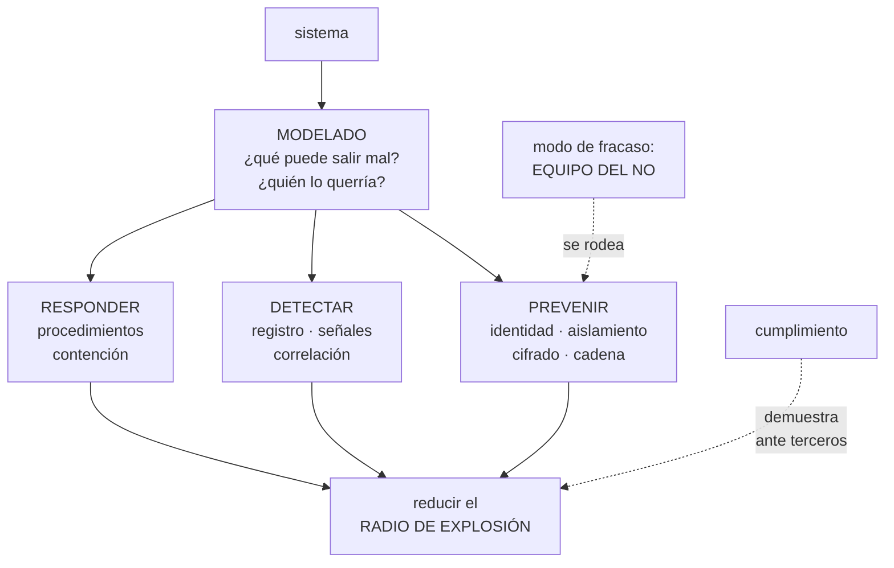

# 269 — Ruta Cloud Security Engineer

> [← 268 · Ruta Site Reliability Engineer](../../part-22-specializations-certifications-career/268-ruta-site-reliability-engineer/README.md) · [Índice de la parte](../README.md) · [270 · Ruta FinOps Practitioner →](../../part-22-specializations-certifications-career/270-ruta-finops-practitioner/README.md)

**Parte:** 22 — Especializaciones, certificaciones y práctica profesional<br>
**Nivel:** intermedio-avanzado · **Horas estimadas:** 4<br>
**Laboratorio:** `decision` · **Estado:** `EXECUTABLE_CORE`

## 🎯 Propósito

La ruta de seguridad en la nube: conseguir que un fallo no sea catastrófico y que un ataque no sea rentable. La clase separa esta especialidad del cumplimiento normativo, da las competencias que se miden —modelado de amenazas, identidad, detección y respuesta—, y marca su modo de fracaso, que es el más caro de todos: **convertirse en el equipo del no, al que se rodea**.

## 📚 Resultados de aprendizaje

Al finalizar podrás:

1. **Distinguir** seguridad de cumplimiento y saber para qué sirve cada uno.
2. **Modelar** amenazas de forma que produzca decisiones, no documentos.
3. **Priorizar** por explotabilidad e impacto, no por gravedad nominal.
4. **Evitar** el modo de fracaso del equipo al que se rodea.
5. **Reconocer** el techo de la ruta y qué la continúa.

## 🧩 Conceptos centrales

| Concepto | Comprensión verificable |
|---|---|
| `modelado de amenazas` | Ejercicio de preguntar qué puede salir mal, quién lo querría y qué lo impediría. Produce decisiones, no documentos. |
| `radio de explosión` | Hasta dónde llega el daño si una parte cae. La variable que esta ruta reduce. |
| `explotabilidad` | Si la vulnerabilidad es alcanzable y aprovechable en este sistema concreto. Domina sobre la gravedad nominal. |
| `camino pavimentado seguro` | Hacer que lo seguro sea lo fácil. La alternativa a la norma que hay que recordar. |
| `cumplimiento` | Demostrar ante un tercero que se hace lo que se dice. Necesario, y distinto de estar seguro. |
| `equipo del no` | Modo de fracaso en que seguridad bloquea sin alternativa y los equipos aprenden a esquivarla. |

## 🧠 Modelo mental

Una especialización combina fundamentos, evidencia de proyectos y juicio bajo restricciones; una insignia sin práctica no sustituye esa combinación.

Aplicado a esta clase, separa siempre cuatro planos: **intención** (qué necesita el usuario),
**configuración** (qué declaramos), **estado observado** (qué existe de verdad) y
**evidencia** (cómo sabemos que cumple). Confundirlos produce diseños que se ven correctos
en un diagrama pero fallan al operar.

## 🗺️ Flujo de razonamiento



## 📖 Desarrollo

### 1. Seguridad no es cumplimiento

Los dos son necesarios y se confunden constantemente, con consecuencias caras en las dos direcciones.

```text
SEGURIDAD
  reducir la probabilidad y el impacto de que alguien
  haga algo que no debería
  → se mide por lo que pasa cuando se intenta

CUMPLIMIENTO
  demostrar ante un tercero que se hace lo que se dice
  → se mide por evidencia auditable

→ un sistema puede cumplir y ser inseguro
→ y puede ser seguro y no poder demostrarlo
→ y el error caro es dejar que el calendario de auditoría
  fije las prioridades de seguridad
```

Y lo que esta ruta hace de verdad, en tres verbos:

```text
PREVENIR
  identidad y privilegio mínimo               clase 231
  aislamiento de red y de cuentas       clases 219, 231
  cifrado y gestión de claves                 clase 197
  cadena de suministro: firma y procedencia   clase 216
  y valores por defecto seguros                 ley 26

DETECTAR
  registro completo e inalterable
  señales de comportamiento anómalo
  y tiempo hasta detectar, medido

RESPONDER
  contener, erradicar, recuperar
  con procedimientos ejecutables              clase 259
  y ensayados                                 clase 261

→ y la mayoría de los equipos gastan casi todo en
  prevenir
→ y la diferencia entre un incidente y una catástrofe la
  hacen los otros dos
```

Y la variable que resume la ruta:

```text
EL RADIO DE EXPLOSIÓN
  «si esta credencial se filtra, ¿hasta dónde llega?»
  «si este servicio se compromete, ¿qué puede tocar?»
  «si esta cuenta cae, ¿qué otras caen con ella?»

→ y casi todo el trabajo técnico de la ruta es reducirlo
  cuentas separadas por entorno            clase 219
  permisos por propósito                   clase 231
  credenciales temporales                  clase 256
  copias que sobreviven al administrador   clase 255
  y segmentación de red                    clase 194

→ porque asumir que nada fallará no es una estrategia
```

### 2. Modelado de amenazas que produce decisiones

El modelado de amenazas tiene mala fama porque suele producir documentos. Hecho bien, produce cambios concretos.

```text
LAS CUATRO PREGUNTAS
  1  ¿qué estamos construyendo?
     → un diagrama con los límites de confianza
     → y lo que no está en el diagrama no se analiza
                                                ley 24
  2  ¿qué puede salir mal?
     → por cada flujo que cruza un límite
  3  ¿qué vamos a hacer?
     → mitigar, aceptar, transferir o eliminar
  4  ¿lo hicimos bien?
     → y esta cuarta es la que casi siempre falta

→ una sesión de 90 minutos con las personas que lo
  construyen
→ y sale con acciones, dueño y plazo, o no sirvió
```

Y dónde mirar, por rendimiento:

```text
LOS LÍMITES DE CONFIANZA, que es donde está casi todo
  entrada de usuario a sistema
  servicio a servicio                       clase 231
  sistema a proveedor externo               clase 188
  plano de control a plano de datos
  y persona a sistema                       clase 256

Y LAS PREGUNTAS QUE MÁS DESCUBREN
  «¿qué pasa si este componente miente?»
  «¿qué puede hacer esta identidad que no necesita?»
  «¿quién puede borrar las copias?»          clase 255
  «¿quién puede desactivar el registro?»
  «¿qué credencial hay aquí que no caduca?»
  y «si esto se compromete, ¿cómo nos enteraríamos?»

→ la última suele no tener respuesta
→ y esa ausencia es el hallazgo más valioso de la sesión
```

Y el criterio de prioridad, que corrige el error más común:

```text
NO SE PRIORIZA POR GRAVEDAD NOMINAL
  una vulnerabilidad «crítica» en una biblioteca que el
  código nunca invoca, sin exposición externa, es menos
  urgente que una «media» en el borde

SE PRIORIZA POR
  ¿es alcanzable desde fuera?
  ¿está en el camino de ejecución?
  ¿hay explotación conocida en circulación?
  ¿qué radio de explosión tiene si se aprovecha?
  ¿y qué compensaciones existen ya?

→ y esto es lo que convierte 3.000 hallazgos en 40
  acciones                                  clase 216
→ y una lista de 3.000 no se arregla: se ignora
```

### 3. El modo de fracaso: el equipo del no

Es el modo de fracaso más caro de todas las rutas, porque su resultado no es lentitud: es que la seguridad deja de existir donde importa.

```text
CÓMO EMPIEZA
  seguridad bloquea algo con razón
  → y sin ofrecer alternativa
  el equipo necesita entregar
  → y encuentra otro camino

QUÉ PRODUCE
  el trabajo se hace igual, fuera del alcance de seguridad
  → cuentas personales, servicios sin registrar,
    credenciales en repositorios privados
  seguridad deja de saber qué existe
  → y pierde la única cosa que necesitaba: visibilidad
  y se entera de los sistemas cuando fallan

→ es la ley 16 en su forma más costosa
→ y el daño no es que se salte una norma: es que el
  sistema real se vuelve invisible
```

Y cómo se sale, que define el nivel 4 de esta ruta:

```text
1  NUNCA BLOQUEAR SIN ALTERNATIVA
   «no puedes usar eso» → «usa esto, que ya está listo»
   → y si no hay alternativa, el trabajo de seguridad es
     construirla, no prohibir

2  CAMINO PAVIMENTADO SEGURO
   la plantilla ya trae permisos mínimos, cifrado,
   registro y secretos gestionados          clase 267
   → y entonces lo seguro es lo fácil
   → y la norma escrita deja de ser necesaria

3  POLÍTICAS EN MODO AVISO ANTES DE BLOQUEAR
                                            clase 217
   → se mide el impacto antes de imponerlo

4  Y AMNISTÍA PARA LO QUE APAREZCA
   «cuéntanos qué tienes fuera y te ayudamos a traerlo,
   sin consecuencias»
   → recupera visibilidad, que es lo que se había perdido
```

Y el segundo modo de fracaso, el del teatro:

```text
SEGURIDAD DE INFORME
  paneles llenos, informes mensuales, cientos de reglas
  → y ningún ensayo de respuesta                clase 261
  → y nadie ha comprobado si la detección funciona

la prueba
  haz algo que DEBERÍA detectarse y cronometra
  → crear una clave de acceso permanente
  → dar permisos amplios a un rol
  → exfiltrar un fichero grande a un destino externo

→ y si nadie lo detecta, las reglas son decoración
→ este ejercicio, hecho una vez, reordena las
  prioridades del año
```

### 4. Niveles, evidencia y techo

Lo que se mide en esta ruta, por nivel.

```text
NIVEL 2 · RESUELVO
  configura identidad, red y cifrado correctamente
  revisa permisos y encuentra los excesivos
  gestiona secretos y su rotación             clase 197
  responde a un incidente siguiendo el procedimiento
  y prioriza vulnerabilidades por explotabilidad

NIVEL 3 · DISEÑO
  modela amenazas y produce decisiones
  diseña el aislamiento y el radio de explosión
  monta detección que se ha comprobado que detecta
  dirige un incidente de seguridad, con su comunicación
  y negocia riesgo aceptado, por escrito y con dueño

NIVEL 4 · CAMBIO EL SISTEMA
  lo seguro es lo fácil, y la adopción se mide
  los equipos llaman a seguridad ANTES de construir
  → y esa es la señal definitiva de que la ruta funciona
  y el riesgo aceptado es una decisión de negocio
    registrada, no un silencio
```

Y la evidencia que vale:

```text
LO QUE NO VALE
  «implantamos la herramienta X»
  «pasamos la auditoría»
  → describe actividad, no efecto

LO QUE VALE
  «el tiempo hasta detectar una credencial expuesta pasó
   de 9 días a 40 minutos, y así lo probamos»
  «eliminamos 41 claves permanentes y el acceso pasó a
   sesiones temporales auditadas»
  «de 3.000 hallazgos, 40 eran alcanzables; los cerramos
   en 6 semanas y el resto se documentó con su motivo»
  «un servicio comprometido ya no puede tocar producción
   porque están en cuentas distintas»

→ efecto, mecanismo y cifra                clase 275
```

Y el techo:

```text
EL TECHO
  los controles funcionan, la detección detecta y los
  equipos consultan antes de construir
  → y lo que limita entonces es el riesgo que la
    organización acepta, que es una decisión de
    dirección

continuaciones
  a  ARQUITECTURA                            clase 272
     si el límite es cómo está construido el sistema
  b  GOBIERNO Y RIESGO
     si el límite es cómo se decide qué se acepta
  c  o dirección de seguridad
     donde el trabajo es presupuesto, personas y
     prioridades
```

Y la lista de comprobación de la clase:

```text
☐ distingo seguridad de cumplimiento y no dejo que la
  auditoría fije las prioridades
☐ hay inversión en detectar y responder, no solo en
  prevenir
☐ sé el radio de explosión de mis credenciales y cuentas
☐ el modelado de amenazas sale con acciones y dueño
☐ sé responder a «si esto se compromete, ¿cómo nos
  enteraríamos?»
☐ priorizo por explotabilidad, no por gravedad nominal
☐ nunca bloqueo sin ofrecer alternativa
☐ existe camino pavimentado seguro y mido su adopción
☐ las políticas pasan por modo aviso antes de bloquear
☐ he comprobado que la detección detecta, cronometrando
☐ el riesgo aceptado está escrito, con dueño y vigencia
☐ los equipos me llaman antes de construir, no después
```

Y el cierre que enlaza con la clase siguiente: seguridad responde de que el fallo no sea catastrófico; queda quien responde de que el gasto sea una decisión y no una consecuencia. La ruta de gestión económica de la nube es la materia de la clase 270.

## 🔬 Ejemplo trabajado

**La función de seguridad de CloudShop, dos años. Lo que sigue es la prueba que descubrió que la detección no detectaba, la lista de 3.100 hallazgos convertida en 47 acciones, y la amnistía que reveló lo que se había construido fuera.**

**Prueba 1 · ¿Detecta la detección?**

```text
ejercicio anunciado a dirección, no al equipo de guardia
cinco acciones que deberían detectarse, cronometradas

  acción                              detectada   tiempo
  crear una clave de acceso
    permanente                             no        -
  dar permiso administrativo a un rol
    de servicio                            sí     4 min
  desactivar el registro de auditoría
    en una cuenta                          no        -
  copiar 2 GB a un destino externo         no        -
  acceder a la base de producción
    desde una IP nueva                     sí    31 min

  detectadas                              2 de 5
```

Y lo que se descubrió al investigar por qué:

```text
la regla de «clave permanente creada» existía
  → enviaba a un canal retirado hacía 7 meses
                                                ley 15
la de «registro desactivado» existía
  → y solo cubría 2 de las 9 cuentas         clase 219
la de exfiltración
  → nunca se había escrito; se daba por cubierta por otra

→ tres de cinco fallos eran de configuración, no de
  capacidad
→ el ejercicio costó 4 horas y reordenó el plan del año
```

Y lo que se hizo:

```text
cobertura de reglas verificada por cuenta y por región
cada regla con una PRUEBA que la dispara, ejecutada
  mensualmente                              clase 261
  → y si la prueba no dispara la alerta, la regla está
    rota

reejecución del ejercicio a los 5 meses
  detectadas                              5 de 5
  tiempo máximo                          6 minutos
```

**Prueba 2 · De 3.100 hallazgos a 47 acciones.**

```text
el escáner producía                        3.100
  críticos                                   287
  altos                                      941

y llevaba 14 meses sin que nadie lo mirara
→ porque una lista de 3.100 no se arregla: se ignora
```

Y el filtro que se aplicó, por orden:

```text                                              quedan
3.100  todos los hallazgos
1.412  en componentes que llegan a producción
  610  en el camino de ejecución del código
  188  alcanzables desde fuera o desde entrada de
       usuario
   94  sin compensación existente
   47  con explotación conocida en circulación o con
       radio de explosión alto

→ 47 acciones, cerradas en 6 semanas
→ y de los 287 «críticos» originales, 19 quedaron en la
  lista final
→ y 3 de los 47 eran de gravedad «media»
```

Y lo que se hizo con los 3.053 restantes:

```text
se documentaron por lote, con el motivo
  «no alcanzable: componente no desplegado»
  «no en camino de ejecución»
  «compensado por segmentación de red»

y se automatizó el filtro
  → el informe semanal pasó de 3.100 líneas a entre 4 y
    12 acciones
  → y esas sí se atendían

tiempo medio de cierre de un hallazgo alcanzable
  antes                          no medible (nadie miraba)
  después                                        9 días
```

**Prueba 3 · La amnistía.**

```text
situación
  seguridad había bloqueado, en 18 meses
    uso de una base gestionada concreta
    despliegue directo desde portátiles
    y tres servicios de terceros
  sin ofrecer alternativa en ninguno de los tres casos

la amnistía
  «cuéntanos qué tienes funcionando fuera del alcance;
  te ayudamos a traerlo; sin consecuencias; 4 semanas»

lo que apareció
  cuentas de nube personales con carga real          6
  servicios de terceros contratados con tarjeta
    de empresa                                       11
  repositorios privados con credenciales             4
  una base de datos con datos de clientes en una
    cuenta no inventariada                           1
  y un servicio expuesto a internet sin cortafuegos  1
```

Y la lectura:

```text
los seis primeros casos existían porque la alternativa
oficial tardaba semanas
  → y el bloqueo no impidió el trabajo: lo hizo invisible

y el caso de la base con datos de clientes
  → llevaba 11 meses
  → sin copias, sin registro, sin cifrado en reposo
  → y era exactamente el riesgo que la norma bloqueada
    pretendía evitar

→ el bloqueo produjo el riesgo que quería evitar
→ ley 16, en su versión más cara
```

Y lo que se cambió:

```text
camino pavimentado seguro                    clase 267
  plantilla con permisos mínimos, cifrado, registro y
  secretos gestionados, lista para usar
  tiempo desde la petición hasta tener entorno
    3 semanas → 4 horas

y la regla de trabajo del equipo
  «no se bloquea nada sin alternativa disponible el mismo
  día»

resultado a los 12 meses
  recursos fuera del inventario detectados        1.107 → 12
  peticiones de excepción                          34 → 6
  y equipos que consultan a seguridad ANTES de
    construir                                       2 → 11
```

**Las cifras a los dos años.**

```text                                        antes     después
DETECCIÓN
acciones de prueba detectadas                2 de 5     5 de 5
tiempo máximo hasta detectar                    n/d      6 min
reglas con prueba de disparo mensual              0         41
cobertura de registro por cuenta             2 de 9     9 de 9

PREVENCIÓN
claves de acceso permanentes                     41          0
roles con permisos administrativos               23          4
cuentas con separación por entorno               no         sí
copias que sobreviven al administrador           no         sí

GESTIÓN
hallazgos en el informe semanal               3.100       4-12
tiempo de cierre de hallazgo alcanzable         n/d     9 días
riesgos aceptados con dueño y vigencia            0         14

RELACIÓN CON LOS EQUIPOS
recursos fuera del inventario                 1.107         12
equipos que consultan antes de construir          2         11
peticiones de excepción                          34          6
```

Y el dato que la persona responsable puso primero:

```text
equipos que consultan a seguridad ANTES de construir
  2 → 11 de 14

→ y esa es la única métrica que no se puede falsear
→ nadie consulta voluntariamente al equipo del no
```

**La lección que esta clase deja**: la detección estaba montada y detectaba **2 de 5** acciones que debía detectar, y tres de los tres fallos eran de configuración —un canal retirado, dos cuentas de nueve cubiertas, una regla que nunca se escribió—, no de capacidad. Y el bloqueo sin alternativa produjo exactamente el riesgo que pretendía evitar: **una base con datos de clientes, once meses sin copias, sin registro y sin cifrado**, en una cuenta que nadie sabía que existía.

## 🧪 Laboratorio guiado

Ejecuta desde la raíz:

```bash
python classes/part-22-specializations-certifications-career/269-ruta-cloud-security-engineer/lab.py
```

El laboratorio selecciona el motor de práctica **`decision`** y produce
`lab_result.json`. El escenario, sus comprobaciones y el artefacto esperado corresponden a
esta clase; no requiere credenciales y deja explícito qué debe revalidarse en un sandbox real.

1. Lee `exercise.steps` y formula una predicción antes de ejecutar.
2. Ejecuta la práctica y verifica todos los elementos de `checks`.
3. Provoca el caso de `negative_test` y explica la señal observada.
4. Materializa `security-engineer-plan` en `evidence/` usando la plantilla indicada.
5. Para proveedor real, sigue `sandbox.requires`, registra costo y ejecuta `destroy`.

### Evidencia esperada

El artefacto principal es una matriz de decisión ponderada y un ADR. Además, la entrega debe incluir el comando ejecutado,
la salida estructurada y una conclusión que no exceda lo observado.

## 🏆 Reto verificable

Construye **`security-engineer-plan`** para el caso CloudShop. Incluye una alternativa descartada,
un supuesto que pueda falsarse, una prueba de fallo y una decisión de rollback.

## ✅ Criterio de aceptación

- [ ] `lab.py` termina con código 0 y genera JSON válido.
- [ ] La entrega conecta al menos tres requisitos con mecanismos verificables.
- [ ] Existe una prueba positiva y una prueba negativa con evidencia.
- [ ] Seguridad, costo y operación aparecen como decisiones, no como anexos.
- [ ] Se declara una limitación y una condición que obligaría a revisar el diseño.
- [ ] Otra persona puede repetir el recorrido sin conocimiento tácito.

## ⚠️ Errores frecuentes

| Síntoma | Causa probable | Corrección |
|---|---|---|
| Se pasa la auditoría y aun así ocurre una brecha | El calendario de cumplimiento fijó las prioridades de seguridad | Separa las dos funciones: cumplimiento demuestra ante terceros, seguridad reduce probabilidad e impacto; prioriza por radio de explosión. |
| Hay miles de hallazgos y no se arregla ninguno | Se prioriza por gravedad nominal en vez de por explotabilidad | Filtra por alcanzable, en camino de ejecución, con explotación conocida y radio de explosión; documenta el resto por lote con su motivo. |
| Aparecen sistemas que nadie sabía que existían | Se bloqueó sin ofrecer alternativa y el trabajo se hizo fuera del alcance | No bloquees sin alternativa disponible, monta el camino pavimentado seguro y ofrece amnistía para recuperar visibilidad. |
| Las reglas de detección existen y no detectan | Nadie ha comprobado si disparan: canales retirados, cobertura parcial, reglas que nunca se escribieron | Ejecuta acciones que deberían detectarse y cronometra; cada regla necesita una prueba de disparo periódica. |
| El modelado de amenazas produce documentos y ningún cambio | Falta la cuarta pregunta y no salen acciones con dueño y plazo | Cierra la sesión con acciones asignadas y revisa después si se hicieron; y pregunta siempre cómo os enteraríais si eso se comprometiera. |
| Seguridad se entera de los proyectos cuando ya están en producción | Consultar es caro y bloquea, así que se evita | Mide cuántos equipos consultan antes de construir; si no crece, el problema es tu proceso, no su disciplina. |

## 🛡️ Seguridad, ética y costo

Trabaja con cuentas propias o sandboxes autorizados. No publiques secretos, identificadores
reales ni datos personales. Antes de crear recursos pagos define presupuesto, etiquetas y
comando de destrucción; después verifica que no queden recursos huérfanos. Los ejemplos
locales enseñan contratos, pero no certifican cumplimiento ni disponibilidad de producción.

## ❓ Preguntas de comprobación

1. ¿En qué se diferencian seguridad y cumplimiento y qué error produce confundirlos?
2. ¿Qué es el radio de explosión y qué medidas lo reducen?
3. ¿Qué criterio convierte miles de hallazgos en unas pocas acciones?
4. ¿Cómo empieza el modo de fracaso del equipo del no y qué produce?
5. ¿Cómo se comprueba que la detección detecta?

## 🔗 Referencias

- Shostack, A. (2014). *Threat Modeling: designing for security*. <https://shostack.org/books/threat-modeling-book>
- NIST (2018). *Cybersecurity Framework* — identificar, proteger, detectar, responder, recuperar. <https://www.nist.gov/cyberframework>
- AWS (2024). *Security Pillar, Well-Architected Framework*. <https://docs.aws.amazon.com/wellarchitected/latest/security-pillar/welcome.html>
- Microsoft (2024). *Azure security best practices and patterns*. <https://learn.microsoft.com/azure/security/fundamentals/best-practices-and-patterns>
- Google Cloud (2024). *Security foundations blueprint*. <https://cloud.google.com/architecture/security-foundations>
- Documentación oficial vigente del servicio implementado; registra URL y fecha de consulta.

---

> [Evaluación](assessment.md) · [Contrato de clase](lesson.yaml) · [Índice de la parte](../README.md)

**📥 Descargar:** [Parte 22 en PDF](../../../site/downloads/partes/manual-parte-22-specializations-certifications-career.pdf) · [Manual integral](../../../site/downloads/multi-cloud-engineering-manual-v2.0.pdf)

| Anterior | Índice | Siguiente |
|---|---|---|
| [← 268 · Ruta Site Reliability Engineer](../../part-22-specializations-certifications-career/268-ruta-site-reliability-engineer/README.md) | [Parte 22](../README.md) · [Programa](../../README.md) | [270 · Ruta FinOps Practitioner →](../../part-22-specializations-certifications-career/270-ruta-finops-practitioner/README.md) |
