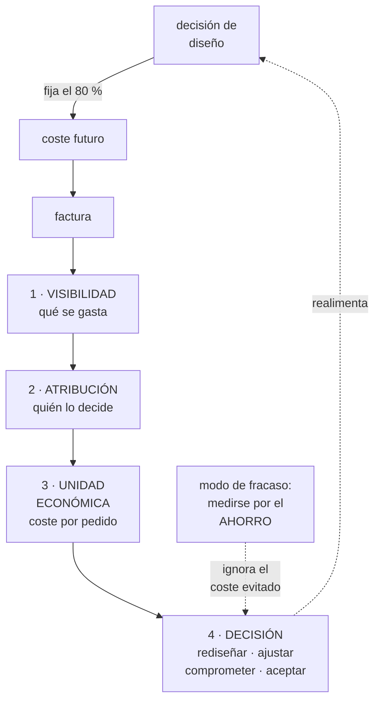

# 270 — Ruta FinOps Practitioner

> [← 269 · Ruta Cloud Security Engineer](../../part-22-specializations-certifications-career/269-ruta-cloud-security-engineer/README.md) · [Índice de la parte](../README.md) · [271 · Ruta Cloud Data y AI Engineer →](../../part-22-specializations-certifications-career/271-ruta-cloud-data-y-ai-engineer/README.md)

**Parte:** 22 — Especializaciones, certificaciones y práctica profesional<br>
**Nivel:** intermedio-avanzado · **Horas estimadas:** 4<br>
**Laboratorio:** `decision` · **Estado:** `EXECUTABLE_CORE`

## 🎯 Propósito

La ruta económica de la nube: conseguir que el gasto sea una decisión y no una consecuencia. La clase separa esta especialidad de «recortar factura», da el modelo que la sostiene —visibilidad, atribución, unidad económica y decisión al diseñar—, y marca su modo de fracaso: **medir el ahorro conseguido en vez del coste evitado, que es donde está casi todo el valor**.

## 📚 Resultados de aprendizaje

Al finalizar podrás:

1. **Distinguir** reducción de factura de gestión económica del sistema.
2. **Atribuir** el coste a quien lo decide, con la granularidad justa.
3. **Definir** la unidad económica que hace comparable el gasto.
4. **Intervenir** donde el coste se decide: el diseño, no la factura.
5. **Evitar** medirse por el ahorro y perder el coste evitado.

## 🧩 Conceptos centrales

| Concepto | Comprensión verificable |
|---|---|
| `unidad económica` | Coste por unidad de negocio: por pedido, por cliente, por consulta. Hace comparable el gasto en el tiempo. |
| `atribución` | Asignar cada coste a quien puede decidir sobre él. Sin ella no hay decisión posible. |
| `coste evitado` | El gasto que no llegó a existir porque la decisión de diseño fue otra. Invisible en la factura. |
| `compromiso` | Descuento a cambio de uso garantizado. Palanca financiera, no de ingeniería. |
| `arquitectura del coste` | Las decisiones de diseño que fijan la mayor parte del gasto antes de facturar nada. |
| `coste no atribuido` | Lo que no tiene dueño. Crece siempre, porque nadie decide sobre ello. |

## 🧠 Modelo mental

Una especialización combina fundamentos, evidencia de proyectos y juicio bajo restricciones; una insignia sin práctica no sustituye esa combinación.

Aplicado a esta clase, separa siempre cuatro planos: **intención** (qué necesita el usuario),
**configuración** (qué declaramos), **estado observado** (qué existe de verdad) y
**evidencia** (cómo sabemos que cumple). Confundirlos produce diseños que se ven correctos
en un diagrama pero fallan al operar.

## 🗺️ Flujo de razonamiento



## 📖 Desarrollo

### 1. No es recortar la factura

La especialidad se confunde con una campaña de recortes. Y una campaña de recortes tiene un final; esta ruta no.

```text
RECORTAR FACTURA
  apagar lo que no se usa, redimensionar, comprar
  compromisos
  → efecto real, y acotado
  → se agota: hay un suelo

GESTIÓN ECONÓMICA DEL SISTEMA
  que cada decisión de diseño se tome sabiendo lo que
  cuesta
  → y eso no se agota, porque el sistema no deja de
    cambiar

→ y la diferencia se ve en una cifra: el coste por unidad
  de negocio
→ una empresa que crece puede tener factura creciente y
  coste por pedido decreciente
→ y esa es la señal de que la ruta funciona
```

Y la razón por la que la factura es un mal punto de intervención:

```text
EL COSTE SE DECIDE AL CREAR, NO AL PAGAR      ley 14
  el tipo de base de datos
  el formato y la partición de los datos     clase 243
  cuántas veces se llama a un servicio       clase 106
  si se replica entre regiones               clase 187
  cuánto se registra y cuánto se conserva    clase 211
  y si algo consulta o escucha               clase 210

→ cuando llega la factura, esas decisiones ya están
  tomadas
→ cambiar una decisión de diseño cuesta semanas; ajustar
  un tamaño cuesta minutos y ahorra mucho menos
```

Y las cuatro etapas del trabajo, en orden:

```text
1  VISIBILIDAD
   qué se gasta, en qué, con qué granularidad y con qué
   retraso
   → y sin esto no hay conversación posible

2  ATRIBUCIÓN
   cada coste a quien puede decidir sobre él
   → por etiqueta, por cuenta, por proyecto
                                    clases 219, 220, 253
   → y lo no atribuido crece siempre           ley 20

3  UNIDAD ECONÓMICA
   coste por pedido, por cliente activo, por consulta
   → convierte «gastamos 340.000» en «cuesta 0,41 por
     pedido»
   → y eso sí se puede juzgar y comparar

4  DECISIÓN
   rediseñar, ajustar, comprometer o aceptar
   → con dueño y con plazo
```

### 2. Atribución y unidad económica

Las dos piezas donde esta ruta gana o pierde credibilidad.

```text
LA ATRIBUCIÓN
  la pregunta no es «¿de qué equipo es este recurso?»
  es «¿quién puede tomar una decisión que cambie este
  coste?»

  y hay costes que no se atribuyen bien
    recursos compartidos: red, registros, plataforma
    → repartir por uso si se puede medir
    → si no, por una regla ACORDADA, no perfecta
    → una regla acordada e imperfecta funciona; ninguna
      regla no

  y el objetivo realista
    > 95 % del coste atribuido
    y lo no atribuido, decreciente y con dueño del
    problema
```

Y el error caro de la atribución:

```text
ATRIBUIR SIN DAR PALANCA
  «tu equipo gasta 41.000 al mes»
  → y el equipo no puede cambiar la instancia porque la
    fija la plataforma
  → y no puede reducir el tráfico porque lo genera otro

→ atribuir sin capacidad de decidir produce frustración,
  no ahorro
→ la atribución tiene que ir con la palanca
```

Y la unidad económica, que es lo que hace la conversación posible:

```text
CÓMO SE ELIGE
  algo que el negocio ya cuenta
    pedidos, clientes activos, consultas atendidas,
    minutos servidos, documentos procesados
  y que crece con el uso real

QUÉ REVELA
  el coste absoluto sube y la unidad baja  → sano
  ambos suben                              → el sistema
                                             escala mal
  el absoluto baja y la unidad sube        → se recortó
                                             algo que
                                             importaba

→ y esta tabla convierte una discusión de presupuesto en
  una de ingeniería
```

Y las palancas, en orden de rendimiento:

```text
1  ELIMINAR TRABAJO QUE NO HACE FALTA
   sondeos que podrían ser eventos            clase 210
   reintentos excesivos                       clase 201
   datos que se copian tres veces
   registros que nadie consulta y se guardan 400 días
   entornos de ensayo encendidos de noche
   → aquí suele estar el mayor rendimiento y nadie lo mira

2  CAMBIAR LA FORMA DE LOS DATOS
   formato columnar, partición, compresión   clase 243
   → factores de 5 a 50 en analítica

3  MOVER TRABAJO A DONDE ES BARATO
   lotes en horas valle, capacidad interrumpible
   caché en el borde                          clase 207

4  AJUSTAR TAMAÑOS
   → efecto real y limitado

5  COMPROMISOS Y DESCUENTOS
   → palanca financiera; se aplica AL FINAL
   → comprometerse sobre una arquitectura mala congela
     la arquitectura mala
```

### 3. El modo de fracaso: medirse por el ahorro

Es el modo de fracaso más sutil, porque la métrica equivocada parece la correcta.

```text
SI LA RUTA SE MIDE POR «AHORRO CONSEGUIDO»
  el incentivo es dejar que el gasto crezca para poder
  recortarlo
  el trabajo de prevención no cuenta, porque no genera
  ahorro
  y cuando ya no queda nada obvio que recortar, la
  función parece agotada

→ y la mayor parte del valor está justo en lo que esa
  métrica no ve
```

Y qué es el coste evitado y cómo se cuenta:

```text
COSTE EVITADO
  el diseño se cambió antes de construir y el gasto nunca
  existió

  ejemplos medibles
    se eligió partición por fecha en vez de exploración
    completa
      → el mismo informe cuesta 12 USD en vez de 340
    se sustituyó un sondeo por eventos antes de lanzar
      → 22 % menos peticiones, que nunca se facturaron
    se descartó la réplica activa entre regiones porque
      el objetivo de recuperación no la necesitaba
      → 112.000 USD/mes que no se gastaron

  cómo se registra
    en el momento de la decisión, con la alternativa
    descartada y su coste estimado
    → y firmado por quien decide
    → si se apunta después, nadie se lo cree
```

Y las métricas correctas de la ruta:

```text
coste por unidad de negocio, y su tendencia
% del coste atribuido
% de decisiones de diseño con coste estimado ANTES
coste evitado registrado, con la alternativa
precisión de la previsión mensual
  → y esta última importa más de lo que parece: sin
    previsión fiable, finanzas no confía en el resto
y recursos sin dueño y sin uso

→ ninguna de estas es «ahorro conseguido»
→ y el ahorro aparece igual, como consecuencia
```

Y el segundo modo de fracaso, el del panel:

```text
PANELES DE COSTE QUE NADIE MIRA
  se monta la visibilidad y ahí se queda
  → porque ver el coste no cambia nada si no llega a quien
    decide, cuando decide

LO QUE SÍ FUNCIONA
  el coste estimado en la propuesta de cambio
    → antes de aprobar, no en el informe mensual
  alertas de anomalía por servicio, con dueño
  y una revisión periódica corta, con acciones

→ el coste tiene que aparecer donde se toma la decisión
→ que es exactamente el mismo principio del camino
  pavimentado                              clases 267, 269
```

### 4. Niveles, evidencia y techo

Qué se espera por nivel en esta ruta.

```text
NIVEL 2 · RESUELVO
  monta visibilidad y atribución con etiquetas
  encuentra desperdicio y lo elimina
  entiende el modelo de precios de lo que usa
  y explica una factura línea a línea

NIVEL 3 · DISEÑO
  define la unidad económica con negocio
  estima el coste de una arquitectura ANTES de construirla
  negocia compromisos con datos de uso real
  decide entre alternativas con coste, riesgo y
  rendimiento juntos
  y dice que una optimización no compensa

NIVEL 4 · CAMBIO EL SISTEMA
  el coste aparece en el momento de la decisión, siempre
  los equipos estiman su coste sin que se lo pidan
  y la conversación con negocio es sobre unidad económica,
  no sobre factura
```

Y la evidencia que vale:

```text
LO QUE NO VALE
  «ahorramos un 30 %»
  → sin decir de qué base ni si el sistema creció

LO QUE VALE
  «el coste por pedido pasó de 0,41 a 0,17 mientras los
   pedidos crecían un 34 %»
  «el 96 % del coste está atribuido y lo no atribuido baja
   cada mes»
  «registramos 340.000 USD/año de coste evitado, con la
   alternativa y quien la descartó»
  «la previsión mensual falla menos del 4 %»

→ efecto, mecanismo y cifra                clase 275
```

Y el techo:

```text
EL TECHO
  el coste está atribuido, la unidad baja y las decisiones
  llevan cifra
  → y lo que limita entonces es la arquitectura o la
    estrategia de producto

continuaciones
  a  ARQUITECTURA                            clase 272
     si el gasto lo fija cómo está construido
  b  producto o dirección financiera de tecnología
     si la conversación pasa a ser de márgenes y precios
  c  o plataforma                            clase 267
     si lo que falta es que hacer lo barato sea lo fácil
```

Y la lista de comprobación de la clase:

```text
☐ distingo recortar factura de gestionar el coste
☐ tengo unidad económica definida con negocio
☐ miro su tendencia, no el coste absoluto
☐ más del 95 % del coste está atribuido
☐ quien recibe la atribución tiene palanca para cambiarla
☐ el coste aparece en la propuesta de cambio, antes de
  aprobar
☐ registro coste evitado en el momento de decidir
☐ no me mido por ahorro conseguido
☐ ataco primero el trabajo innecesario, no los tamaños
☐ los compromisos van al final, sobre arquitectura
  estable
☐ hay alertas de anomalía por servicio, con dueño
☐ la previsión mensual es fiable
```

Y el cierre que enlaza con la clase siguiente: quedan las dos rutas que trabajan sobre el material del que salen las decisiones. Datos e inteligencia artificial, con lo que la parte 20 dejó demostrado, es la materia de la clase 271.

## 🔬 Ejemplo trabajado

**La función económica de CloudShop, dos años. Lo que sigue es la atribución que empezó en el 38 %, la unidad económica que cambió la conversación con dirección, y el registro de coste evitado que salvó la función cuando el ahorro obvio se agotó.**

**Año 0 · El punto de partida.**

```text
factura mensual                          341.000 USD
crecimiento interanual                        +41 %
coste atribuido a un equipo                    38 %

y la conversación con dirección, cada trimestre
  «la nube sube mucho»
  «es que crecemos»
  → sin datos que resolvieran la discusión
```

Y el desglose de lo no atribuido, que fue el primer trabajo:

```text                                    del total    del no atribuido
recursos sin etiqueta                      27 %              44 %
servicios compartidos (red, registros)     19 %              31 %
cuentas antiguas sin dueño                  9 %              15 %
suscripciones y licencias                   6 %              10 %
                                          ─────
                                           62 %
```

Y cómo se atacó cada uno:

```text
sin etiqueta
  etiqueta obligatoria en la creación         clase 253
  y lo existente, por barrido con el inventario
  → 27 % → 2 % en 5 meses

compartidos
  red y registros repartidos por uso medido
  plataforma, por número de servicios
  → regla ACORDADA en una reunión de 40 minutos
  → imperfecta y suficiente

cuentas antiguas
  9 cuentas sin dueño; 4 se apagaron enteras
  → y no pasó nada, que era la sospecha

atribución total     38 % → 96 % en 7 meses
```

**La unidad económica y la conversación que cambió.**

```text
se eligió con negocio: COSTE POR PEDIDO COMPLETADO
  y una segunda: coste por cliente activo mensual

el histórico, reconstruido con 24 meses de datos

           factura/mes   pedidos/mes   coste/pedido
  mes -24     198.000       412.000          0,48
  mes -18     241.000       506.000          0,48
  mes -12     287.000       648.000          0,44
  mes  -6     319.000       741.000          0,43
  mes   0     341.000       832.000          0,41
```

Y lo que esa tabla hizo con la discusión:

```text
la factura había subido un 72 % en dos años
y el coste por pedido había bajado un 15 %

→ dirección dejó de preguntar por la factura
→ y empezó a preguntar por la tendencia de la unidad
→ y la pregunta pasó a ser «¿cuánto más se puede bajar y
  qué cuesta bajarlo?»
```

**Las palancas, por orden de rendimiento real.**

```text
1  TRABAJO QUE NO HACÍA FALTA
   sondeo del estado del pedido desde el navegador
     → eventos                              clase 210
     -22 % de peticiones           -31.000 USD/mes
   registros de acceso conservados 400 días
     → 30 días en caliente, 13 meses en frío
                                    -19.400 USD/mes
   entornos de ensayo encendidos 24 horas
     → apagado nocturno automático
                                    -11.200 USD/mes
   tres copias del mismo conjunto de datos en tres equipos
     → un producto de datos con contrato    clase 241
                                     -8.900 USD/mes

   subtotal                          -70.500 USD/mes

2  FORMA DE LOS DATOS
   informes sobre ficheros de texto → columnar y
   particionado                              clase 243
     coste del informe diario  340 → 12 USD
     y el conjunto de 41 informes
                                    -37.800 USD/mes

3  MOVER TRABAJO
   reprocesos y entrenamientos a capacidad interrumpible
                                    -14.100 USD/mes

4  AJUSTE DE TAMAÑOS
                                     -9.600 USD/mes

5  COMPROMISOS, aplicados al final
   sobre la base ya reducida y estable
                                    -22.400 USD/mes
```

Y la observación que el equipo destacó:

```text
el ajuste de tamaños —lo que casi todas las herramientas
recomiendan primero— fue la CUARTA palanca y aportó el
6 % del total

y el trabajo innecesario aportó el 45 %
→ y no lo detecta ninguna herramienta de coste, porque
  desde la factura ese gasto parece legítimo
→ hace falta mirar el sistema, no la factura
```

Y el error que estuvo a punto de cometerse:

```text
en el mes 2, finanzas propuso firmar compromisos a 3 años
sobre el consumo de ese momento
  descuento ofrecido                         -31 %

se retrasó a después de las optimizaciones
  consumo tras optimizar                     -46 %

→ el compromiso sobre el consumo original habría
  congelado una arquitectura que se iba a reducir a la
  mitad
→ y habría obligado a pagar capacidad no usada durante
  3 años
→ el descuento del 31 % sobre el doble de consumo es peor
  que el 22 % sobre la mitad
```

**Año 2 · Cuando el ahorro obvio se agotó.**

```text
situación
  factura                        341.000 → 227.000 USD/mes
  coste por pedido                    0,41 → 0,17
  pedidos                          832.000 → 1.114.000

y la pregunta de dirección
  «¿qué más vais a ahorrar este año?»
  → y la respuesta honesta era «poco»

→ y aquí es donde la función suele desaparecer
```

Y lo que la salvó: el registro de coste evitado.

```text
durante 14 meses, cada decisión de arquitectura con
implicación de coste se había registrado con
  la alternativa considerada
  el coste estimado de cada una
  y quién decidió

lo acumulado en el año 2

  decisión                        alternativa   evitado/año
  objetivo de recuperación de
    4 h en vez de activo-activo   2ª región     1.344.000
  partición por fecha desde el
    diseño del almacén            exploración
                                  completa        394.000
  eventos en vez de sondeo en el
    servicio nuevo de envíos      sondeo           78.000
  caché en el borde para el
    catálogo                      más réplicas     61.000
  retención de 30 días desde el
    principio en el servicio de
    recomendaciones               400 días         44.000
  ... (11 decisiones más)                         218.000
                                              ───────────
                                                2.139.000
```

Y cómo se presentó:

```text
no como «hemos ahorrado 2,1 millones»
  → eso sería falso: ese gasto nunca existió

sino así
  «en 14 meses, 16 decisiones de arquitectura se tomaron
  con la cifra delante. Las alternativas descartadas
  habrían costado 2,1 M USD al año. Cada decisión está
  registrada con quién la tomó.»

→ y la función pasó de «los que recortan» a «los que
  ponen la cifra antes de decidir»
→ que es exactamente el cambio que define el nivel 4
```

**Las cifras a los dos años.**

```text                                        antes     después
coste por pedido                            0,41        0,17
coste por cliente activo                    2,14        1,03
factura mensual                          341.000     227.000
pedidos mensuales                        832.000   1.114.000

coste atribuido                             38 %        96 %
recursos sin dueño                         1.107          12
decisiones de diseño con coste
  estimado antes                             0 %        84 %
coste evitado registrado (año)                 -   2.139.000
error de la previsión mensual              21 %        3,4 %

reuniones trimestrales sobre «por qué
  sube la nube»                                4           0
```

**La lección que esta clase deja**: el ajuste de tamaños —lo primero que recomienda cualquier herramienta— aportó el **6 %** del resultado, y eliminar trabajo que no hacía falta aportó el **45 %**, porque desde la factura ese gasto parece legítimo y solo se ve mirando el sistema. Y cuando el ahorro obvio se agotó, lo que sostuvo la función no fue lo recortado sino **2,1 millones al año de alternativas descartadas**, registradas en el momento de decidir y con nombre de quien decidió.

## 🧪 Laboratorio guiado

Ejecuta desde la raíz:

```bash
python classes/part-22-specializations-certifications-career/270-ruta-finops-practitioner/lab.py
```

El laboratorio selecciona el motor de práctica **`decision`** y produce
`lab_result.json`. El escenario, sus comprobaciones y el artefacto esperado corresponden a
esta clase; no requiere credenciales y deja explícito qué debe revalidarse en un sandbox real.

1. Lee `exercise.steps` y formula una predicción antes de ejecutar.
2. Ejecuta la práctica y verifica todos los elementos de `checks`.
3. Provoca el caso de `negative_test` y explica la señal observada.
4. Materializa `finops-plan` en `evidence/` usando la plantilla indicada.
5. Para proveedor real, sigue `sandbox.requires`, registra costo y ejecuta `destroy`.

### Evidencia esperada

El artefacto principal es una matriz de decisión ponderada y un ADR. Además, la entrega debe incluir el comando ejecutado,
la salida estructurada y una conclusión que no exceda lo observado.

## 🏆 Reto verificable

Construye **`finops-plan`** para el caso CloudShop. Incluye una alternativa descartada,
un supuesto que pueda falsarse, una prueba de fallo y una decisión de rollback.

## ✅ Criterio de aceptación

- [ ] `lab.py` termina con código 0 y genera JSON válido.
- [ ] La entrega conecta al menos tres requisitos con mecanismos verificables.
- [ ] Existe una prueba positiva y una prueba negativa con evidencia.
- [ ] Seguridad, costo y operación aparecen como decisiones, no como anexos.
- [ ] Se declara una limitación y una condición que obligaría a revisar el diseño.
- [ ] Otra persona puede repetir el recorrido sin conocimiento tácito.

## ⚠️ Errores frecuentes

| Síntoma | Causa probable | Corrección |
|---|---|---|
| El ahorro obvio se agota y la función parece innecesaria | Se midió por ahorro conseguido, que no ve el coste evitado | Registra cada decisión de diseño con su alternativa y coste estimado en el momento de decidir; ahí está la mayor parte del valor. |
| Se atribuye el coste a los equipos y nadie lo reduce | Se atribuyó sin dar palanca: el equipo no puede cambiar lo que le cuesta | Atribuye a quien puede decidir y acompaña la atribución con la capacidad de cambiarlo. |
| Se firman compromisos y luego sobra capacidad pagada | Se comprometió antes de optimizar, congelando la arquitectura que iba a cambiar | Aplica compromisos al final, sobre una base ya reducida y estable; el descuento sobre el doble de consumo es peor negocio. |
| Hay paneles de coste completos y el gasto sigue creciendo | El coste se ve en el informe mensual, no donde se toma la decisión | Pon el coste estimado en la propuesta de cambio antes de aprobarla y añade alertas de anomalía por servicio con dueño. |
| Las herramientas recomiendan ajustar tamaños y el efecto es pequeño | El desperdicio real es trabajo innecesario, que desde la factura parece legítimo | Empieza por sondeos, reintentos, copias duplicadas, retención excesiva y entornos encendidos; mira el sistema, no la factura. |
| Cada trimestre se discute por qué sube la nube | Se habla de factura absoluta en vez de coste por unidad de negocio | Define la unidad económica con negocio y presenta su tendencia; una factura creciente con unidad decreciente es una señal sana. |

## 🛡️ Seguridad, ética y costo

Trabaja con cuentas propias o sandboxes autorizados. No publiques secretos, identificadores
reales ni datos personales. Antes de crear recursos pagos define presupuesto, etiquetas y
comando de destrucción; después verifica que no queden recursos huérfanos. Los ejemplos
locales enseñan contratos, pero no certifican cumplimiento ni disponibilidad de producción.

## ❓ Preguntas de comprobación

1. ¿Qué diferencia recortar factura de gestionar el coste del sistema?
2. ¿Por qué la factura es un mal punto de intervención?
3. ¿Qué revela la unidad económica que el coste absoluto oculta?
4. ¿Qué es el coste evitado y cómo se registra para que sea creíble?
5. ¿Por qué medirse por el ahorro conseguido es un modo de fracaso?

## 🔗 Referencias

- Storment, J. R. y Fuller, M. (2023). *Cloud FinOps*, 2.ª ed. <https://www.oreilly.com/library/view/cloud-finops-2nd/9781492098348/>
- FinOps Foundation (2024). *FinOps Framework: capabilities and maturity*. <https://www.finops.org/framework/>
- AWS (2024). *Cost Optimization Pillar, Well-Architected Framework*. <https://docs.aws.amazon.com/wellarchitected/latest/cost-optimization-pillar/welcome.html>
- Microsoft (2024). *Azure Well-Architected Framework: cost optimization*. <https://learn.microsoft.com/azure/well-architected/cost-optimization/>
- Google Cloud (2024). *Cost management and FinOps best practices*. <https://cloud.google.com/architecture/framework/cost-optimization>
- Documentación oficial vigente del servicio implementado; registra URL y fecha de consulta.

---

> [Evaluación](assessment.md) · [Contrato de clase](lesson.yaml) · [Índice de la parte](../README.md)

**📥 Descargar:** [Parte 22 en PDF](../../../site/downloads/partes/manual-parte-22-specializations-certifications-career.pdf) · [Manual integral](../../../site/downloads/multi-cloud-engineering-manual-v2.0.pdf)

| Anterior | Índice | Siguiente |
|---|---|---|
| [← 269 · Ruta Cloud Security Engineer](../../part-22-specializations-certifications-career/269-ruta-cloud-security-engineer/README.md) | [Parte 22](../README.md) · [Programa](../../README.md) | [271 · Ruta Cloud Data y AI Engineer →](../../part-22-specializations-certifications-career/271-ruta-cloud-data-y-ai-engineer/README.md) |
