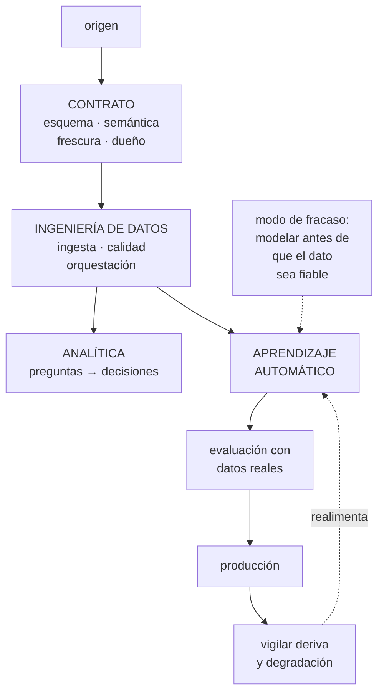

# 271 — Ruta Cloud Data y AI Engineer

> [← 270 · Ruta FinOps Practitioner](../../part-22-specializations-certifications-career/270-ruta-finops-practitioner/README.md) · [Índice de la parte](../README.md) · [272 · Ruta Cloud Solutions Architect →](../../part-22-specializations-certifications-career/272-ruta-cloud-solutions-architect/README.md)

**Parte:** 22 — Especializaciones, certificaciones y práctica profesional<br>
**Nivel:** intermedio-avanzado · **Horas estimadas:** 4<br>
**Laboratorio:** `decision` · **Estado:** `EXECUTABLE_CORE`

## 🎯 Propósito

La ruta de datos e inteligencia artificial en la nube: conseguir que el dato sea confiable y que el modelo sirva en producción. La clase separa las tres funciones que suelen confundirse —ingeniería de datos, analítica y aprendizaje automático—, da las competencias que se miden en cada una, y marca el modo de fracaso que la parte 20 demostró con cifras: **construir el modelo antes de que el dato sea de fiar**.

## 📚 Resultados de aprendizaje

Al finalizar podrás:

1. **Separar** ingeniería de datos, analítica y aprendizaje automático.
2. **Reconocer** qué competencias se miden en cada función y en qué orden.
3. **Aplicar** el orden por coste de cambio: contratos primero, modelo al final.
4. **Detectar** el modo de fracaso de modelar sobre datos no fiables.
5. **Elegir** entre las tres funciones según lo que se quiere resolver.

## 🧩 Conceptos centrales

| Concepto | Comprensión verificable |
|---|---|
| `ingeniería de datos` | Hacer que el dato llegue completo, a tiempo y con significado declarado. La base de las otras dos. |
| `analítica` | Convertir datos en respuestas que alguien usa para decidir. Su producto es la decisión, no el panel. |
| `aprendizaje automático` | Producir predicciones útiles en producción, con su evaluación y su degradación vigiladas. |
| `contrato de datos` | Acuerdo escrito sobre esquema, semántica, frescura y dueño. Lo más caro de cambiar. |
| `sesgo entrenar-servir` | Calcular un atributo distinto al entrenar y al servir. El fallo silencioso más común. |
| `evaluación de producción` | Medir la calidad con datos reales y en el sistema real, no con casos imaginados. |

## 🧠 Modelo mental

Una especialización combina fundamentos, evidencia de proyectos y juicio bajo restricciones; una insignia sin práctica no sustituye esa combinación.

Aplicado a esta clase, separa siempre cuatro planos: **intención** (qué necesita el usuario),
**configuración** (qué declaramos), **estado observado** (qué existe de verdad) y
**evidencia** (cómo sabemos que cumple). Confundirlos produce diseños que se ven correctos
en un diagrama pero fallan al operar.

## 🗺️ Flujo de razonamiento



## 📖 Desarrollo

### 1. Tres funciones distintas

Se anuncian juntas y exigen cosas diferentes. Confundirlas produce contrataciones frustradas en las dos direcciones.

```text
INGENIERÍA DE DATOS
  que el dato llegue completo, a tiempo y con significado
  declarado
  → ingesta, orquestación, calidad, formatos, particiones,
    reproceso                          clases 241-244
  su producto  conjuntos de datos en los que otros confían
  su fallo     nadie se entera hasta semanas después
                                                ley 29

ANALÍTICA
  convertir datos en respuestas que alguien usa
  → modelado dimensional, métricas acordadas, paneles
  su producto  DECISIONES, no paneles
  su fallo     paneles preciosos que nadie mira, o dos
               cifras distintas para lo mismo

APRENDIZAJE AUTOMÁTICO
  producir predicciones útiles en producción
  → atributos, entrenamiento, servicio, evaluación,
    deriva                             clases 244-250
  su producto  un sistema que decide mejor que la regla
               que sustituye
  su fallo     funciona en el laboratorio y no en
               producción

→ y las tres dependen de la primera
→ que es lo que la parte 20 demostró midiendo
```

Y la jerarquía que no se puede saltar:

```text
SIN CONTRATO NO HAY DATO FIABLE
SIN DATO FIABLE NO HAY MÉTRICA COMPARABLE
SIN MÉTRICA COMPARABLE NO HAY MODELO EVALUABLE

→ y el error de la parte 20, medido: un campo llamado
  «importe» que significaba tres cosas distintas y cuyo
  esquema era idéntico en las tres tablas
→ el error más caro no lo cometió ningún modelo
```

Y el orden por coste de cambio, que ordena cualquier proyecto:

```text
1  contratos y semántica          lo más caro de cambiar
2  ingesta y reproceso
3  calidad que DETIENE            clase 243
4  atributos, con el mismo cálculo al entrenar y al servir
5  servicio y evaluación
6  y el modelo                    lo más barato de cambiar

→ y casi todos los proyectos empiezan por el 6
```

### 2. Las competencias que se miden

Por función y por nivel, lo que separa a alguien que resuelve de alguien que ha leído.

```text
INGENIERÍA DE DATOS
  nivel 2
    monta ingesta incremental con captura de cambios y
    sabe qué pasa con los borrados          clase 242
    define marca de agua y trata lo tardío
    elige formato y partición con criterio de coste
                                            clase 243
    y hace reproceso reproducible
  nivel 3
    diseña contratos con semántica escrita  clase 241
    decide la arquitectura de datos y sus fronteras
    monta calidad que detiene antes de publicar
    y baja el plazo de publicar un dato nuevo
  nivel 4
    el consumo pasa por la plataforma porque conviene, no
    porque se obligue                          ley 16

ANALÍTICA
  nivel 2
    modela para consultar, no para almacenar
    define métricas con su definición escrita
    y sabe por qué dos paneles no coinciden
  nivel 3
    acuerda las métricas con negocio y las hace únicas
    diseña para que la respuesta llegue cuando se decide
    y retira paneles
  nivel 4
    las decisiones de la empresa usan las mismas cifras

APRENDIZAJE AUTOMÁTICO
  nivel 2
    entrena, evalúa y despliega un modelo
    calcula atributos igual al entrenar y al servir
                                            clase 244
    y mide en producción, no solo en el laboratorio
  nivel 3
    diseña la evaluación con casos REALES   clase 250
    decide entre modelo y regla, con coste y riesgo
    vigila deriva y degradación             clase 246
    y sabe cuándo NO usar un modelo
  nivel 4
    el sistema se evalúa continuamente y la organización
    acepta retirar modelos que no aportan
```

Y las preguntas que más discriminan en una entrevista:

```text
«¿cómo detectáis que un dato está mal si no da error?»
  → discrimina brutalmente                     ley 29

«¿qué pasa con los borrados en vuestra ingesta
incremental?»
  → la mayoría no lo ha pensado          clase 242

«¿el atributo se calcula igual al entrenar y al servir?
¿cómo lo comprobáis?»

«¿de dónde salieron los casos de vuestra evaluación?»
  → si los imaginó el equipo, el número no significa nada
                                          clase 250

y «¿qué modelo habéis retirado?»
  → nivel 3 ha retirado alguno
```

### 3. El modo de fracaso y sus señales

El modo de fracaso de esta ruta es empezar por el final, y tiene señales tempranas.

```text
MODELAR ANTES DE QUE EL DATO SEA FIABLE
  se construye el modelo, funciona en el laboratorio, y en
  producción da resultados peores sin que nadie sepa por
  qué

las causas, por frecuencia medida en la parte 20
  el atributo se calcula distinto al entrenar y al servir
                                            clase 244
  el conjunto de entrenamiento contiene información que
    en producción no existe todavía
  la evaluación se hizo con casos imaginados
                                            clase 250
  el dato de entrada cambió de significado    ley 29
  y la distribución se movió sin que nadie mirara
                                            clase 246

→ las cinco son de DATOS, no de modelo
→ y ninguna da error
```

Y las señales tempranas, que se pueden mirar hoy:

```text
☐ ¿existe una definición escrita de cada campo que
  usamos?
☐ ¿sabemos cuándo se actualizó por última vez cada
  conjunto?
☐ ¿hay comprobaciones que DETIENEN la publicación?
☐ ¿los atributos se calculan en un solo sitio?
☐ ¿la evaluación usa casos que ocurrieron de verdad?
☐ ¿alguien mira la distribución además del volumen?

→ si más de dos son «no», el modelo va a fallar y la
  causa no será el modelo
```

Y los otros dos modos de fracaso de la ruta:

```text
EL ALMACÉN QUE NADIE USA
  se construye la plataforma de datos y el consumo la
  rodea con exportaciones y copias
  → y en la parte 20 eso era el 71 %
  la causa medida: publicar por el camino oficial tardaba
  once semanas
  → lo que lo revirtió fue bajarlo a dos días, no una
    norma                                     ley 16

EL MODELO QUE NADIE PUEDE RETIRAR
  entra en producción, nadie mide si aporta, y quitarlo da
  miedo
  → la defensa es medir el efecto contra la alternativa
    simple DESDE EL PRINCIPIO
  → y muchas veces la regla de tres líneas gana
```

Y la pregunta que ahorra proyectos enteros:

```text
«¿QUÉ DECISIÓN VA A CAMBIAR CON ESTO, Y QUIÉN LA TOMA?»
  → si no hay respuesta, no hay proyecto
  → y esto vale igual para un panel que para un modelo

y la segunda
«¿CUÁL ES LA ALTERNATIVA SIMPLE Y CUÁNTO DE LO PROMETIDO
CONSIGUE?»
  → una media móvil, una regla, un umbral
  → y con frecuencia consigue el 80 % con el 2 % del
    coste
```

### 4. Elegir, demostrar y el techo

Cómo se decide entre las tres funciones y cómo se demuestra la ruta.

```text
ELIGE INGENIERÍA DE DATOS SI
  te interesan sistemas, fiabilidad y volumen
  toleras que tu trabajo sea invisible cuando funciona
  y te motiva que otros construyan encima
  → es la que más demanda tiene y la que menos se anuncia

ELIGE ANALÍTICA SI
  te interesa el negocio tanto como la técnica
  te motiva discutir definiciones hasta que sean únicas
  y aceptas que tu producto es la decisión ajena

ELIGE APRENDIZAJE AUTOMÁTICO SI
  toleras la incertidumbre y la evaluación constante
  y aceptas que la mayor parte del trabajo son datos y
  producción, no modelado
  → y quien entra esperando lo contrario se va
```

Y la evidencia que vale:

```text
LO QUE NO VALE
  «monté un canal de datos con estas herramientas»
  «entrené un modelo con un 94 % de acierto»
  → el segundo, además, es sospechoso: ¿medido con qué?

LO QUE VALE
  «el plazo de publicar un dato nuevo pasó de once semanas
   a dos días, y el consumo que pasa por la plataforma
   subió del 29 % al 96 %»
  «detectamos un cambio de céntimos a euros que había
   pasado todas las comprobaciones de validez, y añadimos
   la comparación de distribución que lo habría cogido»
  «el conjunto de evaluación con preguntas reales dio 67 %
   frente al 94 % del imaginado; con eso rediseñamos la
   recuperación»
  «retiramos el modelo de recomendación porque una regla
   conseguía el 91 % del efecto con el 3 % del coste»

→ efecto, mecanismo y cifra                clase 275
```

Y el techo:

```text
EL TECHO
  los datos son fiables, las métricas únicas y los modelos
  se evalúan y se retiran
  → y lo que limita entonces es qué decide la organización
    con ellos

continuaciones
  a  ARQUITECTURA                            clase 272
     si el límite es cómo están organizados los sistemas
  b  producto o dirección de datos
     si el límite es qué preguntas se hacen
  c  o plataforma                            clase 267
     si lo que falta es que publicar un dato sea fácil
```

Y la lista de comprobación de la clase:

```text
☐ sé cuál de las tres funciones estoy haciendo
☐ no empiezo por el modelo
☐ cada campo que uso tiene definición escrita y dueño
☐ hay comprobaciones que detienen la publicación
☐ los atributos se calculan en un solo sitio
☐ la evaluación usa casos que ocurrieron de verdad
☐ alguien mira la distribución, no solo el volumen
☐ mido el efecto contra la alternativa simple
☐ sé qué decisión cambia con lo que construyo y quién la
  toma
☐ publicar un dato nuevo se mide en días, no en semanas
☐ he retirado algún panel o algún modelo
```

Y el cierre que enlaza con la clase siguiente: queda la ruta que no construye ninguna pieza y responde de que las decisiones sean defendibles y sobrevivan a quien las tomó. Arquitectura de soluciones es la materia de la clase 272.

## 🔬 Ejemplo trabajado

**Tres trayectorias en la ruta de datos, con lo que cada una midió. Lo que sigue es el proyecto que empezó por el modelo y tuvo que rehacerse, la analista que retiró 61 paneles, y el ingeniero de datos que bajó un plazo de once semanas a dos días.**

**Caso 1 · El proyecto que empezó por el modelo.**

```text
encargo   predecir la fecha de entrega de un pedido
equipo    2 personas, 4 meses

lo que se hizo, en este orden
  1  se recogieron datos históricos con una consulta
  2  se entrenaron seis modelos
  3  se eligió el mejor
  4  se desplegó

resultado en el laboratorio    error medio 1,4 días
resultado en producción        error medio 3,9 días
```

Y el diagnóstico, que tardó cinco semanas:

```text
causa 1  17 atributos se calculaban con una consulta al
         entrenar y con código distinto al servir
         → y 6 de ellos daban valores diferentes
                                            clase 244
causa 2  el conjunto de entrenamiento incluía el estado
         final del pedido, que al predecir no existe
         → información del futuro
causa 3  el campo «fecha de envío» significaba «fecha
         planificada» en una tabla y «fecha real» en otra
         → y el esquema era idéntico

→ las tres son de datos
→ y el modelo era correcto
```

Y lo que costó rehacerlo en el orden correcto:

```text
contratos y semántica de 9 campos          3 semanas
  → la discusión sobre «fecha de envío» duró 4 días
una sola definición de cada atributo,
  usada al entrenar y al servir             2 semanas
comprobaciones que detienen                 1 semana
evaluación con pedidos reales del último
  trimestre                                 1 semana
el modelo, reentrenado                       2 días

resultado en producción      error medio 1,6 días

→ el modelo fue lo último y lo más rápido
→ y las 7 semanas de datos eran inevitables: solo se
  pagaron dos veces
```

**Caso 2 · La analista que retiró 61 paneles.**

```text
situación
  paneles existentes                            94
  con más de una visita al mes                  33
  con más de una visita a la semana             19

y el problema real
  «pedidos completados» tenía cuatro definiciones
  distintas en cuatro paneles
    incluye o no cancelados posteriormente
    cuenta por fecha de pedido o de pago
    incluye o no pedidos de prueba
    y una usaba zona horaria local y otra universal

→ y en una reunión de dirección se presentaron dos cifras
  del mismo mes con un 11 % de diferencia
```

Y el trabajo, que fue de acuerdo más que de técnica:

```text
1  se listaron las métricas usadas en decisiones reales
   → 14, de las 240 definidas
2  cada una se acordó con su dueño de negocio
   → definición escrita, con los casos límite resueltos
   → «pedido completado: pagado y no cancelado en 30
     días, por fecha de pago, en zona horaria universal,
     excluyendo cuentas de prueba»
3  se implementaron una sola vez, en una capa común
4  y los paneles se reconstruyeron sobre ellas
5  se retiraron 61 paneles
   → y se avisó con 4 semanas; 3 personas reclamaron; se
     recuperaron 2

resultado
  métricas con definición única y escrita          14
  paneles                                    94 → 33
  discrepancias en reuniones de dirección     11 → 0
  tiempo de la analista en «¿por qué no cuadra?»
                                     9 h/semana → 1
```

Y lo que la analista escribió en su revisión anual:

```text
«mi trabajo del año no fue construir nada: fue conseguir
que catorce cifras significaran una sola cosa, y retirar
sesenta y un paneles»

→ y esa frase describe el nivel 3 de analítica mejor que
  cualquier lista de herramientas
```

**Caso 3 · De once semanas a dos días.**

```text
situación
  publicar un conjunto de datos nuevo en la plataforma
  tardaba 11 semanas

  el desglose, medido con 6 casos
    solicitud y aprobación                    2,1 semanas
    revisión de esquema por el equipo central 3,4
    implementación del canal                  2,8
    revisión de seguridad y permisos          1,9
    documentación y publicación               0,8

y la consecuencia
  el 71 % del consumo de datos rodeaba la plataforma
  → exportaciones, accesos directos y copias
  → cada una sin contrato, sin calidad y sin dueño
```

Y lo que se cambió:

```text
la aprobación se sustituyó por criterios automáticos
  → 2,1 semanas → 0
la revisión de esquema pasó a una comprobación
  automatizada del contrato, con revisión humana solo si
  falla
  → 3,4 semanas → 20 minutos en el 84 % de los casos
la implementación del canal pasó a plantilla
  → 2,8 semanas → 4 horas
los permisos se derivaron del contrato
  → 1,9 semanas → automático
y la documentación se generó del contrato
  → 0,8 semanas → automático

plazo total          11 semanas → 2 días
```

Y el efecto, doce meses después:

```text                                        antes     después
plazo de publicación                    11 semanas     2 días
conjuntos publicados por trimestre               3         41
consumo que pasa por la plataforma            29 %       96 %
copias no gobernadas detectadas                 34          3
incidentes por dato incorrecto              19/año      4/año

y el coste del trabajo                    340 horas
```

Y la observación que se llevó a la dirección:

```text
no se prohibió nada
→ el consumo volvió a la plataforma porque el camino
  oficial pasó a ser el más rápido
→ ley 16, aplicada en la dirección correcta

y la comparación con el intento anterior
  18 meses antes se había emitido una NORMA que obligaba
  a publicar por la plataforma
  → consumo por la plataforma tras la norma: 29 % → 31 %
  → tras bajar el plazo: 96 %
```

**La lección que esta clase deja**: el proyecto que empezó por el modelo tuvo un error de **3,9 días en producción frente a 1,4 en el laboratorio**, y las tres causas eran de datos —atributos calculados distinto, información del futuro y un campo que significaba dos cosas—, ninguna del modelo. Y una norma que obligaba a usar la plataforma movió el consumo del 29 % al 31 %; bajar el plazo de once semanas a dos días lo movió al **96 %**.

## 🧪 Laboratorio guiado

Ejecuta desde la raíz:

```bash
python classes/part-22-specializations-certifications-career/271-ruta-cloud-data-y-ai-engineer/lab.py
```

El laboratorio selecciona el motor de práctica **`decision`** y produce
`lab_result.json`. El escenario, sus comprobaciones y el artefacto esperado corresponden a
esta clase; no requiere credenciales y deja explícito qué debe revalidarse en un sandbox real.

1. Lee `exercise.steps` y formula una predicción antes de ejecutar.
2. Ejecuta la práctica y verifica todos los elementos de `checks`.
3. Provoca el caso de `negative_test` y explica la señal observada.
4. Materializa `data-ai-plan` en `evidence/` usando la plantilla indicada.
5. Para proveedor real, sigue `sandbox.requires`, registra costo y ejecuta `destroy`.

### Evidencia esperada

El artefacto principal es una matriz de decisión ponderada y un ADR. Además, la entrega debe incluir el comando ejecutado,
la salida estructurada y una conclusión que no exceda lo observado.

## 🏆 Reto verificable

Construye **`data-ai-plan`** para el caso CloudShop. Incluye una alternativa descartada,
un supuesto que pueda falsarse, una prueba de fallo y una decisión de rollback.

## ✅ Criterio de aceptación

- [ ] `lab.py` termina con código 0 y genera JSON válido.
- [ ] La entrega conecta al menos tres requisitos con mecanismos verificables.
- [ ] Existe una prueba positiva y una prueba negativa con evidencia.
- [ ] Seguridad, costo y operación aparecen como decisiones, no como anexos.
- [ ] Se declara una limitación y una condición que obligaría a revisar el diseño.
- [ ] Otra persona puede repetir el recorrido sin conocimiento tácito.

## ⚠️ Errores frecuentes

| Síntoma | Causa probable | Corrección |
|---|---|---|
| El modelo funciona en el laboratorio y falla en producción | Los atributos se calculan distinto al entrenar y al servir, o el entrenamiento vio información que al predecir no existe | Calcula cada atributo en un solo sitio, comprueba la equivalencia y revisa que ningún campo del conjunto contenga estado posterior a la predicción. |
| Dos paneles dan cifras distintas para lo mismo | La métrica tiene varias definiciones y ninguna está escrita | Acuerda con negocio una definición única con los casos límite resueltos, impleméntala una vez en capa común y reconstruye encima. |
| La plataforma de datos existe y el consumo la rodea | Publicar por el camino oficial tarda semanas | Mide el plazo por tramos y automatiza aprobación, revisión de esquema, canal y permisos; el camino oficial tiene que ser el más rápido. |
| La evaluación da un número excelente y los usuarios se quejan | Los casos de evaluación los imaginó el equipo | Construye el conjunto con casos que ocurrieron de verdad; si el número cae mucho, ese es el número real. |
| Un dato incorrecto se descubre semanas después | Los fallos de datos no dan error: dan otro número | Añade comprobaciones que detengan la publicación y compara distribución, volumen, frescura y completitud contra el histórico. |
| Hay un modelo en producción que nadie sabe si aporta | No se midió contra la alternativa simple desde el principio | Compara siempre con una regla o un umbral; muchas veces consigue la mayor parte del efecto por una fracción del coste, y entonces se retira el modelo. |

## 🛡️ Seguridad, ética y costo

Trabaja con cuentas propias o sandboxes autorizados. No publiques secretos, identificadores
reales ni datos personales. Antes de crear recursos pagos define presupuesto, etiquetas y
comando de destrucción; después verifica que no queden recursos huérfanos. Los ejemplos
locales enseñan contratos, pero no certifican cumplimiento ni disponibilidad de producción.

## ❓ Preguntas de comprobación

1. ¿Qué distingue ingeniería de datos, analítica y aprendizaje automático?
2. ¿Por qué el modelo debe ser lo último y no lo primero?
3. ¿Qué señales tempranas indican que un modelo va a fallar por datos?
4. ¿Qué pregunta ahorra proyectos enteros antes de empezarlos?
5. ¿Qué evidencia demuestra nivel 3 en cada una de las tres funciones?

## 🔗 Referencias

- Kleppmann, M. (2017). *Designing Data-Intensive Applications*. <https://dataintensive.net/>
- Sculley, D. y otros (2015). *Hidden technical debt in machine learning systems*. <https://papers.nips.cc/paper/2015/hash/86df7dcfd896fcaf2674f757a2463eba-Abstract.html>
- Google Cloud (2024). *MLOps: continuous delivery and automation pipelines*. <https://cloud.google.com/architecture/mlops-continuous-delivery-and-automation-pipelines-in-machine-learning>
- AWS (2024). *Machine Learning Lens, Well-Architected Framework*. <https://docs.aws.amazon.com/wellarchitected/latest/machine-learning-lens/machine-learning-lens.html>
- Microsoft (2024). *Azure MLOps and data governance guidance*. <https://learn.microsoft.com/azure/architecture/ai-ml/guide/machine-learning-operations-v2>
- Documentación oficial vigente del servicio implementado; registra URL y fecha de consulta.

---

> [Evaluación](assessment.md) · [Contrato de clase](lesson.yaml) · [Índice de la parte](../README.md)

| Anterior | Índice | Siguiente |
|---|---|---|
| [← 270 · Ruta FinOps Practitioner](../../part-22-specializations-certifications-career/270-ruta-finops-practitioner/README.md) | [Parte 22](../README.md) · [Programa](../../README.md) | [272 · Ruta Cloud Solutions Architect →](../../part-22-specializations-certifications-career/272-ruta-cloud-solutions-architect/README.md) |
