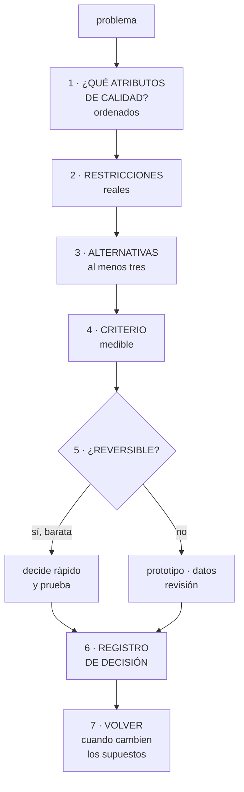

# 272 — Ruta Cloud Solutions Architect

> [← 271 · Ruta Cloud Data y AI Engineer](../../part-22-specializations-certifications-career/271-ruta-cloud-data-y-ai-engineer/README.md) · [Índice de la parte](../README.md) · [273 · Mapeo AWS, Azure, Google Cloud, Kubernetes y FinOps →](../../part-22-specializations-certifications-career/273-mapeo-aws-azure-google-cloud-kubernetes-y-finops/README.md)

**Parte:** 22 — Especializaciones, certificaciones y práctica profesional<br>
**Nivel:** intermedio-avanzado · **Horas estimadas:** 4<br>
**Laboratorio:** `decision` · **Estado:** `EXECUTABLE_CORE`

## 🎯 Propósito

La ruta de arquitectura: responder de que las decisiones sean defendibles y sobrevivan a quien las tomó. La clase da lo que esta especialidad produce de verdad —decisiones escritas con sus alternativas y su reversibilidad—, el método para tomarlas, y sus dos modos de fracaso: **la arquitectura de diapositivas, que no toca el sistema, y la arquitectura de control, que aprueba en vez de decidir**.

## 📚 Resultados de aprendizaje

Al finalizar podrás:

1. **Producir** decisiones escritas con alternativas, criterio y consecuencias.
2. **Clasificar** decisiones por reversibilidad para ajustar el rigor.
3. **Defender** una decisión ante quien no es técnico, con cifras.
4. **Evitar** la arquitectura que no toca el sistema y la que solo aprueba.
5. **Reconocer** qué hace que una decisión sobreviva a su autor.

## 🧩 Conceptos centrales

| Concepto | Comprensión verificable |
|---|---|
| `registro de decisión` | Documento breve con contexto, alternativas, decisión, criterio y consecuencias. El producto de esta ruta. |
| `reversibilidad` | Cuánto cuesta deshacer una decisión. Determina cuánto rigor merece. |
| `atributo de calidad` | Propiedad del sistema que se prioriza: latencia, disponibilidad, coste, evolución, seguridad. |
| `compromiso explícito` | Decir qué se empeora al mejorar otra cosa. Sin él no hay decisión, hay preferencia. |
| `arquitectura de diapositivas` | Modo de fracaso en que se diseña sin construir y el sistema real diverge del diagrama. |
| `restricción real` | Lo que el sistema no puede saltarse: plazos, normativa, personas disponibles, dinero. |

## 🧠 Modelo mental

Una especialización combina fundamentos, evidencia de proyectos y juicio bajo restricciones; una insignia sin práctica no sustituye esa combinación.

Aplicado a esta clase, separa siempre cuatro planos: **intención** (qué necesita el usuario),
**configuración** (qué declaramos), **estado observado** (qué existe de verdad) y
**evidencia** (cómo sabemos que cumple). Confundirlos produce diseños que se ven correctos
en un diagrama pero fallan al operar.

## 🗺️ Flujo de razonamiento



## 📖 Desarrollo

### 1. Qué produce esta ruta

No produce diagramas ni sistemas: produce **decisiones que otros pueden entender, cuestionar y revisar cuando cambien los supuestos**.

```text
EL REGISTRO DE DECISIÓN, que es el entregable
  CONTEXTO      qué problema y con qué restricciones
  ATRIBUTOS     qué priorizamos y en qué orden
  ALTERNATIVAS  al menos tres, con lo bueno y lo malo de
                cada una
  DECISIÓN      cuál y por qué
  CRITERIO      qué medida la justifica
  CONSECUENCIAS qué empeora y qué nos obliga a hacer
  REVISIÓN      qué supuesto, si cambia, invalida esto

→ una o dos páginas, no veinte
→ y lo que lo hace útil es la última línea: la revisión
```

Y por qué el registro importa más que el diagrama:

```text
UN DIAGRAMA DICE QUÉ HAY
UN REGISTRO DICE POR QUÉ, Y CUÁNDO DEJARÁ DE VALER

→ y a los dos años, quien mantiene el sistema no necesita
  saber qué hay: lo ve
→ necesita saber por qué, para poder cambiarlo sin miedo
→ y sin eso, cada decisión antigua se trata como sagrada
  o se rompe sin entenderla
```

Y los atributos de calidad, que hay que **ordenar**:

```text
latencia · disponibilidad · coste · evolución ·
seguridad · operabilidad · coherencia

→ y no se pueden maximizar todos
→ decir «todos son importantes» es no decidir
→ el trabajo es ORDENARLOS con quien tiene el problema

y la pregunta que fuerza el orden
  «si tuviéramos que empeorar uno para mejorar otro,
  ¿cuál empeoramos?»
  → y esa conversación es el 70 % del trabajo
```

Y el compromiso explícito, sin el cual no hay decisión:

```text
«elegimos una base relacional única»
  → mejora coherencia y simplicidad operativa
  → empeora escalado de escritura y aislamiento por
    servicio
  → y nos obliga a vigilar el codo del recurso limitante
                                            clase 262

→ si no se puede nombrar lo que empeora, no se ha
  entendido la alternativa
```

### 2. El método, ajustado a la reversibilidad

No todas las decisiones merecen el mismo esfuerzo. La variable que lo determina es cuánto cuesta deshacerlas.

```text
DECISIONES REVERSIBLES BARATAS
  qué biblioteca, qué formato de registro, qué umbral
  → decidir rápido, probar y corregir
  → y gastar dos semanas en analizarlas es desperdicio

DECISIONES CARAS DE DESHACER
  modelo de datos y particiones             clase 208
  fronteras entre servicios                 clase 106
  proveedor de identidad                    clase 209
  estrategia entre regiones                 clase 187
  y el modelo de cuentas y aislamiento      clase 219
  → prototipo, datos y revisión por pares

→ y el error más común es tratarlas al revés: analizar
  mucho lo barato y decidir por costumbre lo caro
```

Y las restricciones reales, que se ignoran demasiado:

```text
no son solo técnicas
  cuánta gente hay y qué sabe hacer            ley 23
  qué se puede mantener de guardia
  qué exige la normativa                    clase 251
  qué presupuesto hay
  y cuánto tiempo hay

→ una arquitectura correcta que el equipo no puede operar
  es una arquitectura incorrecta
→ y esta es la lección de la parte 21 aplicada al diseño
```

Y el método completo:

```text
1  entender el problema y quién lo tiene
2  ordenar atributos de calidad con esa persona
3  listar restricciones reales
4  generar al menos TRES alternativas
   → dos alternativas suelen ser «la que quiero» y una de
     paja
5  definir el criterio medible ANTES de comparar
6  clasificar por reversibilidad y ajustar el rigor
7  decidir, escribir y comunicar
8  y volver cuando el supuesto de revisión cambie
```

Y el paso que casi nadie da y que separa niveles:

```text
VOLVER
  «esta decisión asume menos de 2.000 pedidos por minuto;
  por encima, hay que revisarla»
  → y una alerta cuando se acerque

→ una decisión con condición de revisión es viva
→ una sin ella se convierte en herencia
```

### 3. Los dos modos de fracaso

Esta ruta tiene dos formas características de dejar de ser útil, y son opuestas.

```text
MODO 1 · LA ARQUITECTURA DE DIAPOSITIVAS
  se diseña, se presenta y no se toca el sistema
  → y el sistema real diverge del diagrama en semanas

  las señales
    el diagrama no coincide con lo desplegado
    las decisiones no consideran restricciones de
      operación
    y quien diseña no recibe alertas de lo que diseñó

  la corrección
    quien decide construye una parte
    quien decide entra en la rotación de guardia
    y las decisiones se validan con un prototipo

→ es el mismo mecanismo de la ley 30: quien no ejecuta
  pierde el juicio que solo da ejecutar

MODO 2 · LA ARQUITECTURA DE CONTROL
  el arquitecto aprueba diseños ajenos
  → cola de espera, lotes grandes y responsabilidad
    desplazada
  → y es el comité de cambios con otro nombre
                                    clases 260, 266

  la corrección
    dar principios y ejemplos, no aprobaciones
    revisar por invitación y en las decisiones caras
    y medir cuántas decisiones se toman bien SIN ti
```

Y la señal de que la ruta funciona:

```text
EQUIPOS QUE TOMAN BUENAS DECISIONES SIN CONSULTARTE
  → y consultan cuando la decisión es cara de deshacer

→ y eso se consigue con principios escritos, ejemplos y
  registros anteriores accesibles
→ no con revisiones obligatorias
```

Y los niveles de la ruta:

```text
NIVEL 2 · RESUELVO
  diseña un servicio completo con sus compromisos claros
  escribe registros de decisión que otro entiende
  y sabe estimar coste y capacidad de lo que propone

NIVEL 3 · DISEÑO
  decide fronteras entre servicios y equipos
  defiende ante negocio con cifras y con alternativas
  hace reversible lo que puede y avisa de lo que no
  y anticipa el modo de fallo y la operación

NIVEL 4 · CAMBIO EL SISTEMA
  los principios están escritos y se usan sin ti
  las decisiones caras se detectan antes de tomarse
  y las decisiones antiguas se revisan cuando cambian los
    supuestos, sin drama
```

### 4. Defender una decisión

La parte que más gente subestima: una decisión correcta que no se sostiene ante quien paga no se ejecuta.

```text
ANTE NEGOCIO
  no se habla de tecnología
  se habla de
    qué se consigue y cuándo
    cuánto cuesta, de operación y de construcción
    qué riesgo se asume y cuál se evita
    y qué se pierde con la alternativa

  y la cifra que más funciona
    el coste de la alternativa descartada    clase 270
    → «activo-activo cuesta 112.000 al mes; el objetivo de
      recuperación de 4 horas nos cuesta 9.000 y cumple
      lo que el negocio pidió»

ANTE INGENIERÍA
  las alternativas, con lo bueno de cada una dicho en
  serio
  → si la alternativa descartada se presenta como tonta,
    nadie se cree la comparación
  el criterio medible
  y lo que empeora, dicho antes de que lo digan ellos

ANTE UN PANEL DE REVISIÓN                  clase 276
  la pregunta más frecuente es «¿y si...?»
  → y la buena respuesta no es tener respuesta a todo
  → es «no lo consideramos; ¿cambiaría el criterio?»
```

Y los errores de defensa más caros:

```text
1  DEFENDER LA DECISIÓN EN VEZ DEL CRITERIO
   → si alguien aporta un dato nuevo, la decisión debe
     poder cambiar
   → defender la decisión convierte una revisión en una
     discusión personal

2  NO DECIR LO QUE EMPEORA
   → y cuando aparece, se pierde la credibilidad de todo
     lo demás

3  PRESENTAR CERTEZA DONDE HAY ESTIMACIÓN
   → «costará 40.000» frente a «entre 30.000 y 55.000,
     según el volumen; y por encima de X hay que
     revisarlo»

4  Y NO TENER LA ALTERNATIVA BARATA EN LA MESA
   → siempre hay que llevar la opción simple, aunque no
     se recomiende
   → porque si no la llevas tú, la lleva otro
```

Y la lista de comprobación de la clase:

```text
☐ mis decisiones están escritas con alternativas y
  criterio
☐ cada registro dice qué empeora
☐ cada registro dice qué supuesto, si cambia, lo invalida
☐ ajusto el rigor a la reversibilidad
☐ genero al menos tres alternativas de verdad
☐ incluyo restricciones de personas y de operación
☐ lo que diseño lo construyo en parte y lo opero
☐ no apruebo diseños ajenos por sistema
☐ mido cuántas decisiones buenas se toman sin mí
☐ llevo la alternativa barata a la mesa
☐ defiendo el criterio, no la decisión
☐ y presento rangos donde hay estimación
```

Y el cierre que enlaza con la clase siguiente: las ocho rutas comparten la base y se apoyan en poder traducir entre proveedores. El mapeo entre las tres nubes, los contenedores y la disciplina de coste es la materia de la clase 273.

## 🔬 Ejemplo trabajado

**Tres decisiones de arquitectura de CloudShop con su registro real. Lo que sigue es la que se defendió con el coste de la alternativa, la que se revisó dos años después porque el supuesto cambió, y la que se tomó mal por analizar lo barato y decidir lo caro por costumbre.**

**Decisión 1 · Estrategia entre regiones.**

```text
CONTEXTO
  el flujo de compra debe seguir disponible si cae una
  región. Negocio pide «que no se caiga nunca».

ATRIBUTOS, ordenados con negocio
  1  disponibilidad del flujo de compra
  2  coste
  3  operabilidad (equipo de 9 personas)
  4  latencia

RESTRICCIONES
  9 personas de plataforma; guardia de 6
  presupuesto anual de infraestructura: 2,8 M USD
  y ningún requisito normativo de residencia

ALTERNATIVAS
  A  una región, copias en otra, restauración manual
     recuperación 8-14 h · +0 USD/mes
  B  una región activa, otra en frío con infraestructura
     desplegada y datos replicados
     recuperación 3-4 h · +9.000 USD/mes
  C  activo-activo entre dos regiones
     recuperación < 5 min · +112.000 USD/mes
     y +2 personas para operarlo

CRITERIO
  coste por hora de caída evitada, contra el valor de una
  hora de caída medido por negocio: 31.000 USD

DECISIÓN
  B, con objetivo de recuperación de 4 horas

CONSECUENCIAS
  empeora: una caída de región cuesta ~4 h de servicio
  nos obliga a: ensayar la conmutación cada trimestre y
    mantener las cuotas de la región secundaria
                                            clase 262

REVISIÓN
  si el valor de una hora de caída supera los 90.000 USD,
  o si el equipo pasa de 15 personas, se revisa C
```

Y cómo se defendió:

```text
la presentación a dirección duró 11 minutos

lo que se dijo
  «C cumple lo que pedís y cuesta 1,34 M al año más dos
  personas. Evita unas 7,7 horas de caída al año, que
  valen 239.000. B cuesta 108.000 al año y deja 4 horas
  de exposición. Recomendamos B y revisamos si el valor
  de una hora cambia.»

y la pregunta que hizo dirección
  «¿y si la caída ocurre en temporada alta?»
  → respuesta: «entonces vale más; por eso proponemos
    congelar los cambios de alto impacto en esa ventana
    y ensayar la conmutación antes de que empiece»
                                            clase 260

→ se aprobó B
→ y la decisión sobrevivió a dos cambios de dirección
  porque el criterio estaba escrito
```

**Decisión 2 · La que se revisó porque el supuesto cambió.**

```text
decisión original, año 0
  «una sola base relacional para pedidos, inventario y
  clientes»
  criterio: simplicidad operativa con un equipo de 4
  personas
  revisión escrita: «si superamos 2.000 pedidos por minuto
  en pico o si el equipo se divide en más de tres,
  revisar»

lo que pasó
  año 2, pico de 2.340 pedidos/minuto
  → saltó la alerta que se había puesto por esa línea

la revisión, año 2
  no fue una discusión: fue abrir el registro y comprobar
  el supuesto
  → 40 minutos de reunión

nueva decisión
  separar inventario, que era el 71 % de la carga de
  escritura
  con el patrón de cuatro pasos                clase 260
  → y el registro nuevo enlaza al anterior
```

Y lo que el equipo destacó:

```text
la decisión original NO fue un error
  fue correcta para 4 personas y 600 pedidos/minuto

→ y sin la línea de revisión, esa misma decisión se habría
  discutido como si hubiera sido un error de origen
→ y quien la tomó ya no estaba en la empresa

→ eso es lo que significa que una decisión sobreviva a su
  autor
```

**Decisión 3 · La que salió mal.**

```text
qué se analizó mucho
  qué biblioteca de registro usar
  → 3 semanas, comparativa de 6 opciones, 14 páginas
  → decisión reversible en 2 días

qué se decidió por costumbre
  la clave de partición de la tabla de pedidos
  → «como en el proyecto anterior: por identificador de
    cliente»
  → 20 minutos de conversación
  → decisión irreversible sin una migración de 7 semanas

lo que pasó
  el 4 % de los clientes generaba el 61 % de los pedidos
  → particiones calientes                    clase 208
  → y el codo del servicio llegó mucho antes de lo
    previsto                                 clase 262

coste de la corrección, 14 meses después
  migración en cuatro pasos                  7 semanas
  y la detención en la semana 2 por 41 divergencias por
  100.000                                    clase 260
```

Y el cambio de método que salió de ahí:

```text
se añadió un paso al principio de cada diseño
  «lista las decisiones de este trabajo y marca cuáles son
  caras de deshacer»
  → y el rigor se asigna a esas

efecto medido en los 18 meses siguientes
  decisiones caras con registro escrito         2/9 → 11/11
  decisiones baratas con análisis largo         6 → 0
  tiempo total dedicado a decidir            -34 %
  y decisiones caras revertidas después          3 → 0
```

**Y el registro de decisiones como activo.**

```text
a los tres años
  registros escritos                              64
  consultados al menos una vez                    51
  que provocaron una revisión por cambio de
    supuesto                                       9
  y decisiones tomadas por equipos sin consultar
    a arquitectura, revisadas después y correctas
                                              38 de 41

y la métrica que la persona responsable puso primero
  «decisiones buenas tomadas sin mí»
  → 38 de 41

→ porque el objetivo no era decidir más: era que se
  decidiera bien sin cuello de botella
```

Y el contraste con el punto de partida:

```text                                        antes     después
decisiones con alternativas escritas         2/9        11/11
registros con condición de revisión            0           64
revisiones obligatorias por arquitectura     todas    solo caras
tiempo de espera por revisión             9 días        0-2 días
decisiones caras revertidas por sorpresa       3            0
diagrama que coincide con lo desplegado       no           sí
```

**La lección que esta clase deja**: la decisión sobre la biblioteca de registro consumió **tres semanas y catorce páginas** siendo reversible en dos días, y la clave de partición —irreversible sin una migración de siete semanas— se decidió en veinte minutos por costumbre. Y lo que hizo que una decisión de hace dos años se revisara sin drama, con su autor ya fuera de la empresa, fue **una sola línea escrita**: qué supuesto, si cambia, la invalida.

## 🧪 Laboratorio guiado

Ejecuta desde la raíz:

```bash
python classes/part-22-specializations-certifications-career/272-ruta-cloud-solutions-architect/lab.py
```

El laboratorio selecciona el motor de práctica **`decision`** y produce
`lab_result.json`. El escenario, sus comprobaciones y el artefacto esperado corresponden a
esta clase; no requiere credenciales y deja explícito qué debe revalidarse en un sandbox real.

1. Lee `exercise.steps` y formula una predicción antes de ejecutar.
2. Ejecuta la práctica y verifica todos los elementos de `checks`.
3. Provoca el caso de `negative_test` y explica la señal observada.
4. Materializa `architect-plan` en `evidence/` usando la plantilla indicada.
5. Para proveedor real, sigue `sandbox.requires`, registra costo y ejecuta `destroy`.

### Evidencia esperada

El artefacto principal es una matriz de decisión ponderada y un ADR. Además, la entrega debe incluir el comando ejecutado,
la salida estructurada y una conclusión que no exceda lo observado.

## 🏆 Reto verificable

Construye **`architect-plan`** para el caso CloudShop. Incluye una alternativa descartada,
un supuesto que pueda falsarse, una prueba de fallo y una decisión de rollback.

## ✅ Criterio de aceptación

- [ ] `lab.py` termina con código 0 y genera JSON válido.
- [ ] La entrega conecta al menos tres requisitos con mecanismos verificables.
- [ ] Existe una prueba positiva y una prueba negativa con evidencia.
- [ ] Seguridad, costo y operación aparecen como decisiones, no como anexos.
- [ ] Se declara una limitación y una condición que obligaría a revisar el diseño.
- [ ] Otra persona puede repetir el recorrido sin conocimiento tácito.

## ⚠️ Errores frecuentes

| Síntoma | Causa probable | Corrección |
|---|---|---|
| Se analizan mucho decisiones triviales y se decide rápido lo irreversible | El rigor no se asigna por reversibilidad | Al empezar cualquier diseño, lista las decisiones y marca las caras de deshacer; dedica el esfuerzo ahí y decide lo barato probando. |
| Una decisión antigua se discute como si hubiera sido un error | No se escribió qué supuesto la sostenía | Cierra cada registro con la condición de revisión y pon una alerta cuando el supuesto se acerque a su límite. |
| El diagrama no se parece a lo que está desplegado | Arquitectura de diapositivas: se diseña sin construir ni operar | Quien decide construye una parte y entra en la rotación de guardia; valida las decisiones caras con un prototipo. |
| Arquitectura se ha convertido en una cola de aprobaciones | Se revisan todos los diseños por sistema | Publica principios, ejemplos y registros anteriores; revisa por invitación y en las decisiones caras, y mide cuántas se toman bien sin ti. |
| La decisión se aprueba y luego nadie la sostiene | Se defendió la decisión en vez del criterio, o no se dijo qué empeoraba | Presenta el criterio medible, di lo que empeora antes de que lo digan, y acepta cambiar si aparece un dato nuevo. |
| Negocio percibe la propuesta como cara sin contexto | Se presentó el coste de lo propuesto sin el de la alternativa descartada | Lleva siempre la opción simple y el coste de lo descartado; comparar dos cifras convence mucho más que justificar una. |

## 🛡️ Seguridad, ética y costo

Trabaja con cuentas propias o sandboxes autorizados. No publiques secretos, identificadores
reales ni datos personales. Antes de crear recursos pagos define presupuesto, etiquetas y
comando de destrucción; después verifica que no queden recursos huérfanos. Los ejemplos
locales enseñan contratos, pero no certifican cumplimiento ni disponibilidad de producción.

## ❓ Preguntas de comprobación

1. ¿Qué contiene un registro de decisión y cuál es su línea más importante?
2. ¿Por qué la reversibilidad determina el rigor de una decisión?
3. ¿Qué distingue los dos modos de fracaso de esta ruta?
4. ¿Cuál es la señal de que la ruta funciona en una organización?
5. ¿Qué cuatro errores arruinan la defensa de una decisión correcta?

## 🔗 Referencias

- Nygard, M. (2011). *Documenting architecture decisions*. <https://cognitect.com/blog/2011/11/15/documenting-architecture-decisions>
- Ford, N., Richards, M. y otros (2021). *Software Architecture: the hard parts*. <https://www.oreilly.com/library/view/software-architecture-the/9781492086888/>
- Bass, L., Clements, P. y Kazman, R. (2021). *Software Architecture in Practice*, 4.ª ed. <https://www.pearson.com/en-us/subject-catalog/p/software-architecture-in-practice/P200000009360>
- AWS (2024). *Well-Architected Framework: making architectural decisions*. <https://docs.aws.amazon.com/wellarchitected/latest/framework/welcome.html>
- Microsoft (2024). *Azure architecture decision guides*. <https://learn.microsoft.com/azure/architecture/guide/>
- Documentación oficial vigente del servicio implementado; registra URL y fecha de consulta.

---

> [Evaluación](assessment.md) · [Contrato de clase](lesson.yaml) · [Índice de la parte](../README.md)

| Anterior | Índice | Siguiente |
|---|---|---|
| [← 271 · Ruta Cloud Data y AI Engineer](../../part-22-specializations-certifications-career/271-ruta-cloud-data-y-ai-engineer/README.md) | [Parte 22](../README.md) · [Programa](../../README.md) | [273 · Mapeo AWS, Azure, Google Cloud, Kubernetes y FinOps →](../../part-22-specializations-certifications-career/273-mapeo-aws-azure-google-cloud-kubernetes-y-finops/README.md) |
