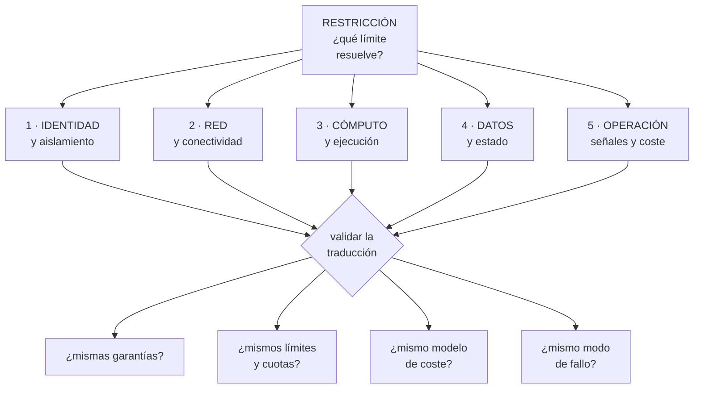

# 273 — Mapeo AWS, Azure, Google Cloud, Kubernetes y FinOps

> [← 272 · Ruta Cloud Solutions Architect](../../part-22-specializations-certifications-career/272-ruta-cloud-solutions-architect/README.md) · [Índice de la parte](../README.md) · [274 · Preguntas de escenario y estrategia de examen →](../../part-22-specializations-certifications-career/274-preguntas-de-escenario-y-estrategia-de-examen/README.md)

**Parte:** 22 — Especializaciones, certificaciones y práctica profesional<br>
**Nivel:** intermedio-avanzado · **Horas estimadas:** 4<br>
**Laboratorio:** `assessment` · **Estado:** `EXECUTABLE_CORE`

## 🎯 Propósito

Traducir entre proveedores sin engañarse: dar el mapa de equivalencias entre las tres nubes, los contenedores y la disciplina de coste, y —más importante— **dónde la equivalencia se rompe**. La clase enseña el método de traducción por restricción en vez de por nombre, y las diferencias reales que este programa ha medido y que ninguna tabla de equivalencias recoge.

## 📚 Resultados de aprendizaje

Al finalizar podrás:

1. **Traducir** entre proveedores por restricción, no por nombre de servicio.
2. **Reconocer** dónde la equivalencia aparente esconde una diferencia real.
3. **Usar** el mapa de las cinco capas para orientarse en una nube nueva.
4. **Evaluar** una traducción con las preguntas que la validan.
5. **Aplicar** el mismo método a los contenedores y a la disciplina de coste.

## 🧩 Conceptos centrales

| Concepto | Comprensión verificable |
|---|---|
| `traducción por restricción` | Buscar cómo la otra nube resuelve el mismo límite físico, en vez de buscar el servicio con nombre parecido. |
| `equivalencia falsa` | Dos servicios con el mismo propósito y garantías, límites o modelo de coste distintos. |
| `unidad de aislamiento` | El contenedor administrativo donde vive la separación: cuenta, suscripción o proyecto. |
| `plano de control` | La interfaz que crea y modifica recursos. Sus cuotas y su latencia difieren mucho entre nubes. |
| `portabilidad aparente` | Creer que usar la misma tecnología en tres nubes elimina las diferencias. No lo hace. |
| `coste de traducción` | Lo que cuesta operar en dos nubes: no es el doble de aprender, es el doble de operar. |

## 🧠 Modelo mental

Una especialización combina fundamentos, evidencia de proyectos y juicio bajo restricciones; una insignia sin práctica no sustituye esa combinación.

Aplicado a esta clase, separa siempre cuatro planos: **intención** (qué necesita el usuario),
**configuración** (qué declaramos), **estado observado** (qué existe de verdad) y
**evidencia** (cómo sabemos que cumple). Confundirlos produce diseños que se ven correctos
en un diagrama pero fallan al operar.

## 🗺️ Flujo de razonamiento



## 📖 Desarrollo

### 1. Traducir por restricción, no por nombre

Las tablas de equivalencias por nombre producen errores caros. El método que funciona empieza por la restricción.

```text
EL MÉTODO
  1  ¿qué RESTRICCIÓN resuelve esto?
     → «necesito que un servicio pruebe su identidad ante
       otro sin credencial permanente»
  2  ¿cómo la resuelve la nube destino?
  3  ¿con qué garantías, límites y coste?
  4  ¿y con qué modo de fallo?

→ y solo entonces se escribe el nombre del servicio
→ empezar por el nombre es lo que produce las sorpresas
```

Y las cinco capas en las que conviene organizarse:

```text
1  IDENTIDAD Y AISLAMIENTO
   quién es quién, qué puede, y dónde vive la separación
   → cuenta · suscripción · proyecto
2  RED Y CONECTIVIDAD
   direccionamiento, rutas, resolución de nombres, salida
   a internet, interconexión
3  CÓMPUTO Y EJECUCIÓN
   máquinas, contenedores, funciones, escalado
4  DATOS Y ESTADO
   objetos, bloques, relacional, no relacional, analítico,
   mensajería
5  OPERACIÓN
   señales, registros, políticas, coste, cuotas

→ en toda nube existen las cinco
→ y aprender una nube nueva es rellenar esta rejilla, no
  leer un catálogo
```

Y el mapa por restricción, que es lo transferible:

```text
RESTRICCIÓN                        DÓNDE MIRAR EN CUALQUIER NUBE
«que un servicio pruebe quién es   identidad de carga de
sin credencial fija»               trabajo, federada
«separar entornos para que un       unidad de aislamiento
fallo no cruce»                     administrativa
«que el tráfico solo llegue a       segmentación de red y
quien debe»                         reglas por identidad
«que un cambio no afecte a todos    despliegue progresivo
a la vez»                           del proveedor o propio
«que el dato sobreviva a un         copia en otra unidad de
administrador comprometido»         aislamiento, inmutable
«saber quién gasta qué»             etiquetas y jerarquía
                                    administrativa
«no pasar de N peticiones por       cuotas del plano de
segundo al plano de control»        control

→ y este mapa no cambia cuando cambian los productos
```

### 2. Dónde la equivalencia se rompe

Lo que ninguna tabla de equivalencias dice, y este programa ha medido.

```text
1  LA UNIDAD DE AISLAMIENTO NO ES EQUIVALENTE
   cuenta, suscripción y proyecto se parecen y difieren en
     cuánto cuesta crear una nueva
     qué se hereda desde arriba
     y qué queda compartido aunque parezca separado
   → y de aquí salen los errores de aislamiento más caros
                                          clases 219, 231

2  LOS LÍMITES POR DEFECTO SON MUY DISTINTOS
   dos nubes con el «mismo» servicio de funciones tienen
   concurrencias por defecto de órdenes distintos
   → y en la región secundaria, los valores por defecto
     mandan                                clase 262, ley 26

3  EL MODELO DE COSTE CAMBIA LA ARQUITECTURA
   donde el tráfico entre zonas se cobra, la arquitectura
   correcta es otra
   donde el análisis se cobra por dato leído, el formato y
   la partición valen más que el motor    clase 243, ley 28
   → y una traducción literal puede multiplicar la factura

4  LA COHERENCIA DE LOS ALMACENES DE OBJETOS
   parecen iguales y sus garantías de lectura tras
   escritura, de listado y de sobrescritura no lo son
   → y esto rompe canales de datos silenciosamente
                                                ley 29

5  LA RESOLUCIÓN DE NOMBRES Y LA SALIDA A INTERNET
   quién resuelve, desde dónde, y qué pasa con las
   respuestas privadas difiere mucho          clase 195
   → es la fuente número uno de «funciona en una nube y no
     en la otra»

6  EL PLANO DE CONTROL
   su latencia y sus cuotas de peticiones difieren
   → y una herramienta de infraestructura como código que
     funciona en una nube se estrangula en otra
                                        clases 128, 262

7  Y LA SEMÁNTICA DE LOS PERMISOS
   denegar explícito, herencia, ámbito y evaluación no
   funcionan igual
   → una política traducida literalmente puede conceder
     más de lo que concedía                  clase 231
```

Y la regla que resume todo lo anterior:

```text
LO QUE SE TRADUCE BIEN
  el propósito y la forma de la arquitectura

LO QUE NO SE TRADUCE
  garantías, límites, modelo de coste y modos de fallo

→ y esos cuatro son los que deciden si el sistema
  funciona
→ por eso la traducción se VALIDA midiendo, no leyendo
```

### 3. Contenedores y la portabilidad aparente

El caso especial que más expectativas defrauda.

```text
LO QUE SÍ APORTA UNA CAPA COMÚN DE CONTENEDORES
  el empaquetado y el modelo de despliegue se parecen
  las descripciones de carga de trabajo son casi iguales
  y el conocimiento del equipo se traslada

LO QUE NO ELIMINA
  la identidad y su federación con la nube
  la red: direccionamiento, salida, balanceo, resolución
  el almacenamiento persistente y sus garantías
  el registro de imágenes y su disponibilidad
  las cuotas del plano de control
  el coste, muy distinto por nube
  y la operación: actualizaciones, versiones y su ritmo

→ la portabilidad es del ARTEFACTO, no del SISTEMA
→ y la parte que no se traslada es la que da los
  incidentes                                clase 185
```

Y el coste real de operar en dos nubes:

```text
NO ES EL DOBLE DE APRENDER: ES EL DOBLE DE OPERAR
  dos inventarios                            clase 253
  dos modelos de permisos                    clase 231
  dos formas de red                          clase 194
  dos conjuntos de cuotas                    clase 262
  dos catálogos de alertas y dos guardias    clase 257
  dos formas de facturar                     clase 270
  y ensayos en las dos                       clase 261

→ y por eso multinube por defecto es caro
→ y multinube por una RAZÓN concreta —normativa,
  adquisición, un servicio que solo existe en una— se
  sostiene

y la pregunta que ordena la decisión
  «¿qué riesgo concreto estamos comprando con este coste?»
  → si la respuesta es «no depender de un proveedor», hay
    que cuantificar cuánto vale eso y compararlo
```

Y el mapa de la disciplina de coste, que también se traduce:

```text
lo que existe en las tres, con otros nombres
  jerarquía administrativa para atribuir
  etiquetas y su obligatoriedad
  exportación detallada de facturación
  compromisos con descuento
  presupuestos y alertas
  y capacidad interrumpible

lo que cambia de verdad
  qué se cobra por transferencia entre zonas y regiones
  cómo se factura el almacenamiento frío y su
    recuperación
  cómo se cobra la analítica: por dato leído o por
    capacidad reservada
  y el retraso con que llega el detalle de coste

→ y esos cuatro cambian decisiones de diseño
                                            clase 270
```

### 4. Cómo se valida una traducción

Una traducción sobre el papel no vale nada. Estas son las comprobaciones que la convierten en fiable.

```text
LAS CUATRO PREGUNTAS DE VALIDACIÓN
  1  ¿MISMAS GARANTÍAS?
     coherencia, durabilidad, orden, exactamente una vez
     → y aquí casi siempre hay una diferencia
  2  ¿MISMOS LÍMITES Y CUOTAS?
     por defecto y ampliables, por región
  3  ¿MISMO MODELO DE COSTE?
     qué se cobra por operación, por dato, por hora
  4  ¿MISMO MODO DE FALLO?
     ¿falla rápido o se degrada? ¿qué se ve cuando falla?

→ y las cuatro se responden con documentación y con una
  prueba
```

Y la prueba mínima antes de comprometerse:

```text
PROTOTIPO DE UNA SEMANA
  el camino crítico de extremo a extremo
  con identidad real, red real y datos de tamaño
    realista
  midiendo latencia, coste por operación y comportamiento
    al fallar
  y provocando un fallo a propósito         clase 261

→ una semana de esto ahorra meses
→ y descubre las diferencias que ninguna tabla recoge
```

Y cómo se demuestra esta competencia:

```text
LO QUE NO VALE
  «conozco las tres nubes»
  → y la parte 22 predijo que esto rendiría peor que
    conocer una a fondo                     clase 264

LO QUE VALE
  «migramos el canal de datos y descubrimos que las
   garantías de listado del almacén de objetos eran
   distintas; lo detectamos con una prueba de una semana
   antes de comprometernos»
  «traducimos la política y concedía más de lo que
   concedía la original; lo cogió la comprobación
   automática»
  «el mismo diseño costaba 3,2 veces más por el cobro de
   tráfico entre zonas, y rediseñamos la colocación»

→ efecto, mecanismo y cifra                clase 275
```

Y la lista de comprobación de la clase:

```text
☐ traduzco por restricción, no por nombre de servicio
☐ uso la rejilla de cinco capas para orientarme
☐ compruebo garantías, límites, coste y modo de fallo
☐ sé que la unidad de aislamiento no es equivalente
☐ reviso los valores por defecto, sobre todo en la región
  secundaria
☐ compruebo la semántica de permisos, no solo su forma
☐ verifico resolución de nombres y salida a internet
☐ vigilo las cuotas del plano de control
☐ no confundo portabilidad del artefacto con la del
  sistema
☐ cuantifico el coste de operar en dos nubes
☐ hago un prototipo de una semana antes de comprometerme
☐ y provoco un fallo en ese prototipo
```

Y el cierre que enlaza con la clase siguiente: con el mapa y el método de traducción, queda la parte que examina esto por escrito y con tiempo limitado. Las preguntas de escenario y la estrategia de examen son la materia de la clase 274.

## 🔬 Ejemplo trabajado

**CloudShop traduce tres piezas entre nubes. Lo que sigue son las cuatro diferencias que el prototipo de una semana encontró y ninguna tabla recogía, la política traducida que concedía de más, y la cuenta del coste real de operar en dos nubes.**

**Traducción 1 · El canal de datos.**

```text
qué se traducía
  ingesta a almacén de objetos, catálogo, y consultas
  analíticas                                clase 242

la tabla de equivalencias decía
  almacén de objetos      →  almacén de objetos
  catálogo                →  catálogo
  motor de consulta       →  motor de consulta

→ traducción aparentemente trivial
```

Y lo que el prototipo de una semana encontró:

```text
DIFERENCIA 1 · garantías de listado
  el proceso dependía de listar un prefijo justo después
  de escribir
  → en el origen, el listado era inmediato
  → en el destino, podía tardar
  → y el trabajo posterior procesaba ficheros de menos
    SIN ERROR                                  ley 29

  cómo se detectó
    prueba con 40.000 ficheros escritos y listados de
    inmediato
    → 61 casos de listado incompleto
  cómo se arregló
    manifiesto explícito de ficheros, en vez de listar

DIFERENCIA 2 · modelo de coste de la consulta
  origen   por dato leído
  destino  por capacidad reservada
  → el mismo conjunto de 41 informes
    origen, tras optimizar                12 USD/informe
    destino con capacidad mínima          por debajo del
                                          umbral, pero con
                                          suelo mensual
  → por debajo de cierto volumen el destino era más caro
  → y por encima, mucho más barato
  → la decisión dependía del volumen, no del motor

DIFERENCIA 3 · cuota del plano de control
  la herramienta de infraestructura como código aplicaba
  341 recursos
  → en el destino se estrangulaba a mitad
  → aplicación fallida de forma intermitente  clase 128
  → se resolvió partiendo el estado y limitando el
    paralelismo

DIFERENCIA 4 · zonas horarias en las particiones
  la convención por defecto del catálogo difería
  → y las particiones diarias se desplazaban unas horas
  → los informes diarios cuadraban salvo en el límite del
    día                                     clase 243
```

Y la valoración:

```text
coste del prototipo                       1 semana, 1 persona
diferencias encontradas                                   4
  que ninguna tabla de equivalencias recogía              4
  que habrían llegado a producción sin error visible      2

→ las dos silenciosas eran las peligrosas
```

**Traducción 2 · La política que concedía de más.**

```text
política original
  permitir lectura de un prefijo concreto del almacén, a
  un rol de servicio, con denegación explícita para todo
  lo demás                                  clase 231

la traducción literal
  se mantuvo la concesión y se omitió la denegación
  explícita
  → porque en la nube destino la herencia y la evaluación
    funcionaban distinto y «parecía innecesaria»

lo que produjo
  el rol heredaba desde el nivel superior un permiso de
  lectura sobre el contenedor entero administrativo
  → y sin la denegación explícita, la herencia ganaba
  → el rol podía leer 214 conjuntos de datos en vez de 1
```

Y cómo se detectó:

```text
no en la revisión humana: la revisión lo aprobó

lo cogió la comprobación automática de permisos efectivos
  → que compara «qué puede hacer realmente esta identidad»
    antes y después                          clase 217
  → 214 recursos accesibles frente a 1 esperado

→ la lección: se compara el EFECTO, no el texto de la
  política
→ y esa comprobación se añadió a la cadena para toda
  traducción
```

**La cuenta del coste real de operar en dos nubes.**

```text
CloudShop tenía una razón concreta para la segunda nube
  un cliente del sector público exigía residencia en una
  región que el proveedor principal no ofrecía
                                            clase 280

y se midió lo que costaba mantenerla

  inventario y etiquetado, segunda nube      0,4 personas
  modelo de permisos y su auditoría          0,3
  red y conectividad                         0,3
  cuotas y capacidad                         0,2
  alertas, guardia y procedimientos          0,6
  facturación y atribución                   0,2
  ensayos                                    0,2
  actualizaciones y versiones                0,3
                                            ──────
                                             2,5 personas

  más el coste de infraestructura            41.000 USD/mes
  y el sobrecoste por menor volumen
    (compromisos peores)                     +9 %
```

Y la decisión que se tomó con esa cifra:

```text
ingresos del cliente que exigía la segunda nube
                                        1,9 M USD/año
coste de mantenerla              ~2,5 personas + 492.000
                                        USD/año

→ se mantuvo, y con la cifra escrita en el registro de
  decisión                                clase 272
→ con condición de revisión: «si estos ingresos bajan de
  900.000, se revisa»

y lo que NO se hizo
  no se replicó el resto de la plataforma en la segunda
  nube «por si acaso»
  → solo lo que ese cliente necesitaba
  → 6 servicios de 41
```

Y la comparación con lo que se había propuesto al principio:

```text
propuesta inicial   «seamos multinube en todo, para no
                    depender de un proveedor»
  coste estimado    ~7 personas + 1,4 M USD/año
  riesgo evitado    no cuantificado

y la pregunta que la desmontó
  «¿cuál es el escenario concreto del que nos protege, y
  cuánto nos costaría si ocurriera?»
  → el escenario realista era una subida de precios o una
    pérdida de servicio prolongada
  → y la protección real requería mantener el sistema
    EJECUTÁNDOSE en las dos, no solo poder migrar
  → lo que multiplicaba la cifra

→ se decidió: multinube donde hay una razón concreta;
  portabilidad razonable en lo demás
→ y «portabilidad razonable» se definió: contratos, datos
  exportables y decisiones registradas, no abstracciones
  propias                                    clase 267
```

**Y la rejilla de cinco capas, rellenada para orientarse.**

```text
el equipo mantuvo una tabla de una página por nube

  capa            qué mirar             dónde difiere más
  identidad       unidad de aislamiento herencia y
                  y federación          denegación
  red             direccionamiento,     resolución de
                  salida, balanceo      nombres privados
  cómputo         escalado, arranque,   límites por
                  interrumpible         defecto
  datos           garantías del almacén listado y coste
                  y del relacional      por operación
  operación       señales, políticas,   retraso del
                  cuotas, coste         detalle de coste

→ una página por nube, actualizada cuando algo sorprende
→ y usada para entrar en una nube nueva en días
```

**La lección que esta clase deja**: la traducción del canal de datos parecía trivial y el prototipo de una semana encontró **cuatro diferencias, dos de ellas silenciosas** —un listado incompleto y un desplazamiento de particiones— que habrían llegado a producción sin producir ningún error. Y la política traducida pasó la revisión humana mientras concedía acceso a **214 conjuntos de datos en vez de uno**: lo cogió comparar permisos efectivos, no leer el texto.

## 🧪 Laboratorio guiado

Ejecuta desde la raíz:

```bash
python classes/part-22-specializations-certifications-career/273-mapeo-aws-azure-google-cloud-kubernetes-y-finops/lab.py
```

El laboratorio selecciona el motor de práctica **`assessment`** y produce
`lab_result.json`. El escenario, sus comprobaciones y el artefacto esperado corresponden a
esta clase; no requiere credenciales y deja explícito qué debe revalidarse en un sandbox real.

1. Lee `exercise.steps` y formula una predicción antes de ejecutar.
2. Ejecuta la práctica y verifica todos los elementos de `checks`.
3. Provoca el caso de `negative_test` y explica la señal observada.
4. Materializa `certification-map` en `evidence/` usando la plantilla indicada.
5. Para proveedor real, sigue `sandbox.requires`, registra costo y ejecuta `destroy`.

### Evidencia esperada

El artefacto principal es una evaluación por escenarios con rúbrica y evidencia trazable. Además, la entrega debe incluir el comando ejecutado,
la salida estructurada y una conclusión que no exceda lo observado.

## 🏆 Reto verificable

Construye **`certification-map`** para el caso CloudShop. Incluye una alternativa descartada,
un supuesto que pueda falsarse, una prueba de fallo y una decisión de rollback.

## ✅ Criterio de aceptación

- [ ] `lab.py` termina con código 0 y genera JSON válido.
- [ ] La entrega conecta al menos tres requisitos con mecanismos verificables.
- [ ] Existe una prueba positiva y una prueba negativa con evidencia.
- [ ] Seguridad, costo y operación aparecen como decisiones, no como anexos.
- [ ] Se declara una limitación y una condición que obligaría a revisar el diseño.
- [ ] Otra persona puede repetir el recorrido sin conocimiento tácito.

## ⚠️ Errores frecuentes

| Síntoma | Causa probable | Corrección |
|---|---|---|
| Un servicio equivalente se comporta distinto en producción | Se tradujo por nombre y no se compararon garantías, límites, coste y modo de fallo | Traduce por restricción y valida las cuatro preguntas con documentación y con un prototipo del camino crítico. |
| Una política traducida concede más de lo que concedía | La herencia y la evaluación de permisos difieren y la denegación explícita se omitió | Compara permisos efectivos antes y después, no el texto de la política; automatiza esa comprobación en la cadena. |
| El canal de datos procesa registros de menos sin dar error | Las garantías de listado y de lectura tras escritura del almacén no son iguales | Usa manifiestos explícitos en vez de listar, y prueba con volumen realista escribiendo y listando de inmediato. |
| La infraestructura como código se aplica a medias e intermitentemente | Se alcanzan las cuotas de peticiones del plano de control, que difieren por nube | Parte el estado, limita el paralelismo y vigila la cuota del plano de control como una más del inventario. |
| El mismo diseño cuesta varias veces más en la otra nube | El modelo de coste cambia lo que es una buena arquitectura | Revisa qué se cobra por transferencia, por operación y por dato leído; rediseña colocación y formato antes de migrar. |
| Se adopta multinube por no depender de un proveedor y el coste se dispara | No se cuantificó el riesgo evitado ni el coste de operar dos nubes | Exige un escenario concreto y su coste; multinube donde hay una razón, portabilidad razonable en lo demás. |

## 🛡️ Seguridad, ética y costo

Trabaja con cuentas propias o sandboxes autorizados. No publiques secretos, identificadores
reales ni datos personales. Antes de crear recursos pagos define presupuesto, etiquetas y
comando de destrucción; después verifica que no queden recursos huérfanos. Los ejemplos
locales enseñan contratos, pero no certifican cumplimiento ni disponibilidad de producción.

## ❓ Preguntas de comprobación

1. ¿Por qué se traduce por restricción y no por nombre de servicio?
2. ¿Cuáles son las cinco capas de la rejilla y para qué sirven?
3. ¿Qué cuatro cosas no se traducen nunca y por qué deciden el resultado?
4. ¿Qué aporta y qué no aporta una capa común de contenedores?
5. ¿Qué comprueba un prototipo de una semana que ninguna tabla recoge?

## 🔗 Referencias

- AWS (2024). *Compare AWS and Azure services*. <https://learn.microsoft.com/azure/architecture/aws-professional/services>
- Google Cloud (2024). *Google Cloud for AWS professionals*. <https://cloud.google.com/docs/get-started/aws-comparison>
- CNCF (2024). *Kubernetes conformance and portability*. <https://www.cncf.io/certification/software-conformance/>
- FinOps Foundation (2024). *FOCUS: FinOps cost and usage specification* — coste comparable entre nubes. <https://focus.finops.org/>
- Brewer, E. (2012). *CAP twelve years later: how the rules have changed* — por qué las garantías no se traducen. <https://www.infoq.com/articles/cap-twelve-years-later-how-the-rules-have-changed/>
- Documentación oficial vigente del servicio implementado; registra URL y fecha de consulta.

---

> [Evaluación](assessment.md) · [Contrato de clase](lesson.yaml) · [Índice de la parte](../README.md)

**📥 Descargar:** [Parte 22 en PDF](../../../site/downloads/partes/manual-parte-22-specializations-certifications-career.pdf) · [Manual integral](../../../site/downloads/multi-cloud-engineering-manual-v2.0.pdf)

| Anterior | Índice | Siguiente |
|---|---|---|
| [← 272 · Ruta Cloud Solutions Architect](../../part-22-specializations-certifications-career/272-ruta-cloud-solutions-architect/README.md) | [Parte 22](../README.md) · [Programa](../../README.md) | [274 · Preguntas de escenario y estrategia de examen →](../../part-22-specializations-certifications-career/274-preguntas-de-escenario-y-estrategia-de-examen/README.md) |
