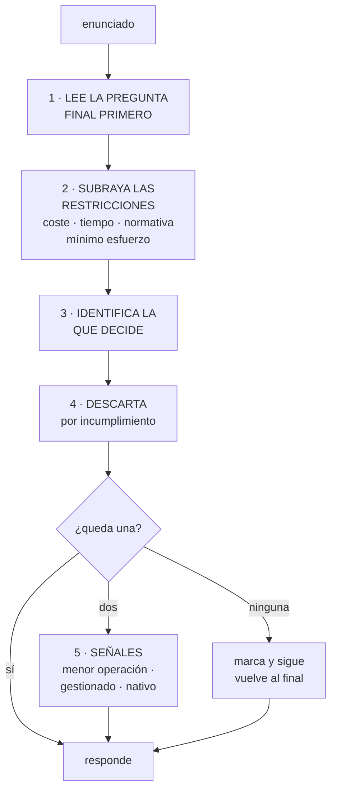

# 274 — Preguntas de escenario y estrategia de examen

> [← 273 · Mapeo AWS, Azure, Google Cloud, Kubernetes y FinOps](../../part-22-specializations-certifications-career/273-mapeo-aws-azure-google-cloud-kubernetes-y-finops/README.md) · [Índice de la parte](../README.md) · [275 · Portafolio, evidencia, README y entrevista de sistemas →](../../part-22-specializations-certifications-career/275-portafolio-evidencia-readme-y-entrevista-de-sistemas/README.md)

**Parte:** 22 — Especializaciones, certificaciones y práctica profesional<br>
**Nivel:** intermedio-avanzado · **Horas estimadas:** 4<br>
**Laboratorio:** `assessment` · **Estado:** `EXECUTABLE_CORE`

## 🎯 Propósito

Resolver preguntas de escenario y aprobar exámenes de certificación sin confundirlos con capacidad. La clase da el método para leer un escenario —encontrar la restricción que decide, descartar por eliminación, reconocer las señales de la respuesta esperada—, la estrategia de tiempo, y lo que un examen no puede medir y por tanto hay que demostrar en otro sitio.

## 📚 Resultados de aprendizaje

Al finalizar podrás:

1. **Leer** un escenario identificando la restricción que decide.
2. **Descartar** opciones por eliminación con criterios explícitos.
3. **Reconocer** las señales que delatan la respuesta esperada.
4. **Gestionar** el tiempo y las preguntas dudosas.
5. **Situar** la certificación en su valor real, sin sobreestimarla ni despreciarla.

## 🧩 Conceptos centrales

| Concepto | Comprensión verificable |
|---|---|
| `pregunta de escenario` | Enunciado con contexto y varias opciones plausibles, donde una restricción decide cuál es correcta. |
| `restricción que decide` | La condición del enunciado que elimina todas las opciones menos una. Suele ir en una sola frase. |
| `distractor` | Opción técnicamente posible pero que incumple una restricción del enunciado. |
| `respuesta esperada` | La que el examen considera correcta según la doctrina del proveedor, que puede no ser la mejor en tu contexto. |
| `coste de oportunidad del examen` | Lo que se deja de aprender mientras se estudia para aprobar. |
| `conocimiento inerte` | El que se recuerda para el examen y no se aplica después. |

## 🧠 Modelo mental

Una especialización combina fundamentos, evidencia de proyectos y juicio bajo restricciones; una insignia sin práctica no sustituye esa combinación.

Aplicado a esta clase, separa siempre cuatro planos: **intención** (qué necesita el usuario),
**configuración** (qué declaramos), **estado observado** (qué existe de verdad) y
**evidencia** (cómo sabemos que cumple). Confundirlos produce diseños que se ven correctos
en un diagrama pero fallan al operar.

## 🗺️ Flujo de razonamiento



## 📖 Desarrollo

### 1. Cómo se lee un escenario

Las preguntas de escenario están construidas con un patrón, y conocerlo cambia mucho el resultado.

```text
LA ESTRUCTURA HABITUAL
  contexto           2-6 líneas, con datos relevantes e
                     irrelevantes mezclados
  requisito          lo que hay que conseguir
  restricciones      coste mínimo · mínimo esfuerzo
                     operativo · sin interrumpir el
                     servicio · en menos de X · sin
                     cambiar la aplicación
  pregunta final     qué hay que elegir
  opciones           una correcta y tres plausibles

→ y las restricciones son lo que decide
→ casi nunca decide la parte técnica del contexto
```

Y el método, en orden:

```text
1  LEE LA PREGUNTA FINAL ANTES QUE EL CONTEXTO
   → así lees el contexto buscando algo concreto
   → y no memorizas datos irrelevantes

2  SUBRAYA LAS RESTRICCIONES
   «con el menor coste posible»
   «con el menor esfuerzo operativo»
   «sin modificar la aplicación»
   «sin tiempo de inactividad»
   «cumpliendo la normativa X»
   «lo antes posible»

3  IDENTIFICA LA QUE DECIDE
   → normalmente una sola elimina tres opciones

4  DESCARTA POR INCUMPLIMIENTO, no por preferencia
   → «esta requiere cambiar la aplicación» → fuera
   → «esta implica una ventana de parada» → fuera

5  SI QUEDAN DOS, aplica las señales
```

Y las restricciones más frecuentes y lo que implican:

```text
«MENOR ESFUERZO OPERATIVO»
  → prefiere el servicio gestionado sobre el autogestionado
  → prefiere lo nativo sobre lo montado a mano
  → elimina cualquier opción con máquinas que mantener

«MENOR COSTE»
  → prefiere almacenamiento frío, capacidad interrumpible,
    procesamiento por lotes
  → cuidado: a veces la más barata incumple otra
    restricción

«SIN CAMBIAR LA APLICACIÓN»
  → elimina toda opción que exija tocar el código
  → suele apuntar a una capa intermedia o a un
    intermediario

«SIN INTERRUPCIÓN»
  → elimina migraciones con parada
  → apunta a replicar y conmutar, o a pasos reversibles
                                            clase 260

«LO ANTES POSIBLE»
  → prefiere lo que ya existe sobre lo que hay que
    construir
```

### 2. Las señales y los distractores

Cuando dos opciones sobreviven al descarte, hay patrones que resuelven la mayoría.

```text
SEÑALES DE LA RESPUESTA ESPERADA
  usa el servicio gestionado del proveedor antes que uno
    montado
  resuelve dentro de la nube antes que con una pieza
    externa
  usa identidades y roles antes que claves            ley 26
  usa cifrado gestionado antes que propio
  usa la opción con menos piezas
  y respeta el privilegio mínimo

→ la doctrina del proveedor es coherente: gestionado,
  nativo, con identidad, con menos operación
→ y las preguntas la reflejan
```

Y los distractores típicos, que se reconocen a simple vista:

```text
1  EL QUE HACE DEMASIADO
   una arquitectura elaborada para un problema sencillo
   → si el enunciado pide algo simple, la respuesta es
     simple

2  EL QUE USA CREDENCIALES PERMANENTES
   «crea una clave de acceso y guárdala en el código»
   → casi siempre incorrecto                clase 256

3  EL QUE CONCEDE PERMISOS AMPLIOS
   «asigna el rol de administrador»
   → casi siempre incorrecto                clase 231

4  EL QUE INTRODUCE UNA MÁQUINA QUE MANTENER
   cuando la restricción dice «mínimo esfuerzo operativo»

5  EL TÉCNICAMENTE CORRECTO QUE INCUMPLE UNA RESTRICCIÓN
   → el más peligroso: funciona, pero el enunciado lo
     prohibía
   → por eso se subrayan las restricciones primero

6  Y EL QUE INVENTA UNA CAPACIDAD
   un servicio que no hace lo que la opción dice
   → y este se reconoce si se conoce el servicio de verdad
```

Y las palabras del enunciado que suelen ser trampa:

```text
«actualmente»           describe el problema, no la
                        solución
«el equipo no tiene
 experiencia en»        elimina las opciones que la
                        requieren
«debe mantenerse
 durante 7 años»        apunta a archivo y a inmutabilidad
                                            clase 255
«los datos no pueden
 salir de la región»    apunta a residencia y elimina
                        servicios globales
«el pico ocurre una vez
 al mes»                apunta a elasticidad, no a
                        capacidad reservada
y «se accede pocas
 veces al año»          apunta a almacenamiento frío y a
                        su coste de recuperación
```

### 3. Estrategia de tiempo y de dudas

La gestión del examen es una habilidad separada del conocimiento, y explica una parte de los suspensos.

```text
EL PRESUPUESTO DE TIEMPO
  divide el tiempo total entre las preguntas y ten el
  ritmo objetivo en la cabeza
  → si vas por detrás a mitad, acelera antes de que sea
    tarde

LAS TRES PASADAS
  1ª  responde lo que sabes; marca lo dudoso; no te
      atasques
      → nunca dejes una sin responder: no hay penalización
        por fallar
  2ª  vuelve a lo marcado, con tiempo conocido
  3ª  si queda tiempo, revisa solo lo marcado como muy
      dudoso

→ y NO revises lo que respondiste con seguridad
→ cambiar respuestas seguras empeora el resultado más
  veces de las que lo mejora
```

Y qué hacer con una pregunta que no se sabe:

```text
1  descarta lo que incumple una restricción
2  descarta credenciales permanentes y permisos amplios
3  descarta lo que hace demasiado
4  y entre lo que quede, elige lo gestionado y con menos
   piezas

→ esto convierte una adivinanza de 1 entre 4 en una de
  1 entre 2, con frecuencia
```

Y los errores de examen más comunes:

```text
leer el contexto entero y luego la pregunta
  → se pierde tiempo y se retiene lo irrelevante
elegir la que uno haría en su trabajo
  → el examen pregunta la doctrina del proveedor
  → y a veces tu solución es mejor y no es la esperada
no leer «elige DOS» o «elige TRES»
quedarse en una pregunta más de dos minutos
y cambiar respuestas por nerviosismo al final
```

Y cómo se prepara de verdad:

```text
QUÉ FUNCIONA
  hacer preguntas de práctica y ANALIZAR LOS FALLOS
    → por qué la correcta era correcta y por qué la mía
      no
  construir lo que se estudia, aunque sea pequeño
  y leer la documentación de los límites y las cuotas
    → que es lo que más se pregunta y menos se estudia

QUÉ NO FUNCIONA
  memorizar volcados de preguntas
    → además de inútil, suele vulnerar las condiciones
      del examen
  ver vídeos sin construir nada
  y estudiar servicios que el examen apenas toca
```

### 4. Qué mide y qué no mide un examen

La parte honesta, que conviene tener clara antes de invertir semanas.

```text
LO QUE UN EXAMEN SÍ MIDE
  amplitud de catálogo: qué servicio sirve para qué
  conocimiento de límites, cuotas y modelos de precio
  la doctrina del proveedor
  y capacidad de descartar bajo restricciones

→ y esto tiene valor real: acelera conversaciones y evita
  reinventar

LO QUE NO PUEDE MEDIR
  decidir con información incompleta
  diagnosticar bajo presión                 clase 258
  sostener un número ante negocio           clase 268
  saber qué NO automatizar                  clase 259
  y el juicio que no está escrito              ley 30

→ porque nada de eso se puede examinar por opción
  múltiple
→ y es justo donde está la diferencia entre nivel 2 y
  nivel 3                                   clase 265
```

Y para qué sirve una certificación, sin exagerar:

```text
SIRVE PARA
  pasar filtros de contratación
  dar estructura a un estudio disperso
  cubrir huecos de catálogo que uno no sabía que tenía
  y requisitos de socio comercial de la empresa

NO SIRVE PARA
  demostrar que sabes resolver
  sustituir evidencia de trabajo real       clase 275
  ni justificar un nivel

→ y el coste de oportunidad es real: seis semanas de
  estudio son seis semanas de no construir
→ la combinación que funciona es certificación + evidencia
  → la certificación abre la puerta y la evidencia
    sostiene la conversación
```

Y el riesgo del conocimiento inerte:

```text
SE APRUEBA Y A LOS SEIS MESES NO SE RECUERDA NADA
  porque no se aplicó

LA DEFENSA
  construir algo con lo que se estudió, aunque sea pequeño
  → y escribirlo, que es lo que lo convierte en evidencia
                                            clase 275
  y elegir el examen que se solapa con lo que haces
    ahora
```

Y la lista de comprobación de la clase:

```text
☐ leo la pregunta final antes que el contexto
☐ subrayo las restricciones y encuentro la que decide
☐ descarto por incumplimiento, no por preferencia
☐ reconozco los distractores de credenciales y permisos
☐ respondo todas: no hay penalización por fallar
☐ hago tres pasadas y no reviso lo que sabía
☐ no me quedo más de dos minutos en una pregunta
☐ analizo por qué fallé cada pregunta de práctica
☐ estudio límites, cuotas y precios, que es lo que más cae
☐ construyo algo con lo que estudio
☐ y sé qué mide el examen y qué tengo que demostrar en
  otro sitio
```

Y el cierre que enlaza con la clase siguiente: el examen abre la puerta y no sostiene la conversación. Lo que la sostiene es la evidencia de trabajo real, bien presentada. Portafolio, evidencia y entrevista de sistemas es la materia de la clase 275.

## 🔬 Ejemplo trabajado

**Cinco preguntas de escenario resueltas con el método, y los datos de preparación de cuatro personas del equipo de CloudShop. Lo que sigue muestra dónde estaba la restricción que decidía en cada caso.**

**Pregunta 1 · La restricción está en una sola palabra.**

```text
ENUNCIADO
  «Una empresa almacena registros de auditoría que deben
  conservarse 7 años por normativa. Se consultan menos de
  dos veces al año, y cuando se consultan puede tardarse
  varias horas en recuperarlos. ¿Qué opción cumple con el
  menor coste?»

  A  almacenamiento estándar con ciclo de vida a 90 días
  B  almacenamiento de archivo profundo con bloqueo de
     retención
  C  base de datos gestionada con copias mensuales
  D  almacenamiento estándar con replicación entre
     regiones

MÉTODO
  restricciones subrayadas
    7 años por normativa · menos de 2 accesos al año ·
    puede tardar varias horas · menor coste

  la que decide: «puede tardar varias horas»
    → autoriza el archivo profundo, que es lo más barato
    → si no lo dijera, el archivo profundo quedaría
      descartado

  descarte
    A  no cumple 7 años
    C  base de datos para registros de auditoría: caro y
       no aporta
    D  replicación no la pide nadie: coste innecesario

  RESPUESTA  B
  y el bloqueo de retención está ahí por «normativa»
                                            clase 255
```

**Pregunta 2 · El distractor técnicamente correcto.**

```text
ENUNCIADO
  «Una aplicación que se ejecuta en máquinas virtuales
  necesita leer objetos de un contenedor de
  almacenamiento. La empresa exige que no se almacenen
  credenciales de larga duración. ¿Qué haces?»

  A  crear una clave de acceso y guardarla cifrada en el
     gestor de secretos
  B  asignar un rol a la instancia con permiso de solo
     lectura sobre ese contenedor
  C  asignar un rol a la instancia con permiso de
     administrador de almacenamiento
  D  usar credenciales de un usuario de servicio rotadas
     cada 30 días

MÉTODO
  restricción que decide: «no credenciales de larga
  duración»

  A  técnicamente funciona y guarda una credencial de
     larga duración → fuera
  D  igual: rotar no deja de ser una credencial
     permanente → fuera
  C  cumple la restricción y viola privilegio mínimo

  RESPUESTA  B

→ A y D son el distractor más común: funcionan, y el
  enunciado los prohibía
```

**Pregunta 3 · «Sin cambiar la aplicación».**

```text
ENUNCIADO
  «Una aplicación heredada abre demasiadas conexiones a la
  base de datos y la satura en picos. No se puede
  modificar el código. ¿Qué solución aplicas con el menor
  esfuerzo operativo?»

  A  reescribir la capa de acceso para usar un grupo de
     conexiones
  B  desplegar un intermediario de conexiones gestionado
     entre la aplicación y la base
  C  aumentar el tamaño de la instancia de base de datos
  D  instalar un intermediario en una máquina propia

MÉTODO
  restricciones: «no se puede modificar el código» y
  «menor esfuerzo operativo»

  A  modifica el código → fuera
  C  no resuelve el problema, solo lo retrasa; y en la
     clase 262 se vio que escalar puede empeorarlo
  D  cumple, pero añade una máquina que mantener →
     incumple «menor esfuerzo operativo»

  RESPUESTA  B

→ aquí dos restricciones descartan dos opciones cada una
```

**Pregunta 4 · Elige DOS.**

```text
ENUNCIADO
  «Un equipo necesita que un trabajo por lotes nocturno se
  ejecute con el menor coste posible. El trabajo puede
  reiniciarse sin problema si se interrumpe y debe acabar
  antes de las 06:00. Elige DOS opciones.»

  A  capacidad interrumpible
  B  instancias reservadas a 3 años
  C  puntos de control para reanudar si se interrumpe
  D  instancias bajo demanda en la región más cara
  E  ejecutar el trabajo en horario laboral

MÉTODO
  «puede reiniciarse sin problema» + «menor coste»
    → A, claramente
  y A sin C es frágil: si se interrumpe, vuelve a empezar
    y puede no acabar antes de las 06:00

  RESPUESTA  A y C

→ las preguntas de dos opciones suelen pedir una decisión
  y su salvaguarda
→ B es caro para un trabajo nocturno y compromete 3 años
                                            clase 270
```

**Pregunta 5 · La que parece técnica y decide la operación.**

```text
ENUNCIADO
  «Una empresa quiere migrar una base de datos de 4 TB a
  la nube. El sistema no puede estar parado más de 15
  minutos. El equipo no tiene experiencia con replicación.
  ¿Qué enfoque eliges?»

  A  exportar, copiar por red e importar
  B  servicio gestionado de migración con replicación
     continua y conmutación final
  C  montar replicación manual entre el origen y el
     destino
  D  copia física por dispositivo enviado por mensajería

MÉTODO
  restricciones: «máximo 15 minutos de parada» y «el
  equipo no tiene experiencia con replicación»

  A  4 TB de exportación e importación: mucho más de 15
     minutos → fuera
  D  igual, y además el envío tarda días → fuera
  C  cumple los 15 minutos e incumple «sin experiencia»
     → fuera

  RESPUESTA  B

→ la frase «el equipo no tiene experiencia en» está ahí
  para descartar, siempre
→ y es la restricción de personas, que también decide en
  la vida real                              clase 272
```

**Los datos de preparación de cuatro personas.**

```text                       horas    prácticas   resultado
persona A  solo vídeos        62         no       suspenso
           y lectura                              (68 %)
persona B  vídeos +           74         sí       aprobado
           prácticas con                          (81 %)
           análisis de fallos
persona C  construyó un       58         sí       aprobado
           proyecto pequeño +                     (89 %)
           prácticas
persona D  volcados de        40         no       aprobado
           preguntas                              (74 %)
```

Y lo que pasó seis meses después:

```text
prueba interna de escenarios NUEVOS, no vistos
  persona B                                     78 %
  persona C                                     85 %
  persona D                                     41 %

→ quien memorizó volcados aprobó y no retuvo nada
→ y además, esa práctica suele vulnerar las condiciones
  del examen

y en el trabajo, a los 12 meses
  persona C había construido tres cosas con lo estudiado
  y era la única que aplicaba el catálogo sin consultar
```

Y el análisis de fallos de la persona B, que fue lo que la hizo aprobar:

```text
de 180 preguntas de práctica, falló 47
  clasificadas por causa
    no conocía el servicio                       9
    no leí una restricción                      19
    elegí lo que haría yo, no la doctrina        11
    leí mal «elige DOS»                          5
    error de tiempo, respondí sin leer           3

→ 38 de 47 fallos NO eran de conocimiento
→ y los corrigió con método, no con más estudio
→ segundo simulacro: 12 fallos de 180
```

**La lección que esta clase deja**: de 47 fallos en las preguntas de práctica, **38 no eran de conocimiento** sino de método —restricciones no leídas, doctrina propia en vez de la del proveedor, enunciados de dos opciones mal leídos—, y se corrigieron sin estudiar más. Y quien memorizó volcados aprobó con un 74 % y a los seis meses resolvió el **41 %** de escenarios nuevos.

## 🧪 Laboratorio guiado

Ejecuta desde la raíz:

```bash
python classes/part-22-specializations-certifications-career/274-preguntas-de-escenario-y-estrategia-de-examen/lab.py
```

El laboratorio selecciona el motor de práctica **`assessment`** y produce
`lab_result.json`. El escenario, sus comprobaciones y el artefacto esperado corresponden a
esta clase; no requiere credenciales y deja explícito qué debe revalidarse en un sandbox real.

1. Lee `exercise.steps` y formula una predicción antes de ejecutar.
2. Ejecuta la práctica y verifica todos los elementos de `checks`.
3. Provoca el caso de `negative_test` y explica la señal observada.
4. Materializa `exam-simulation` en `evidence/` usando la plantilla indicada.
5. Para proveedor real, sigue `sandbox.requires`, registra costo y ejecuta `destroy`.

### Evidencia esperada

El artefacto principal es una evaluación por escenarios con rúbrica y evidencia trazable. Además, la entrega debe incluir el comando ejecutado,
la salida estructurada y una conclusión que no exceda lo observado.

## 🏆 Reto verificable

Construye **`exam-simulation`** para el caso CloudShop. Incluye una alternativa descartada,
un supuesto que pueda falsarse, una prueba de fallo y una decisión de rollback.

## ✅ Criterio de aceptación

- [ ] `lab.py` termina con código 0 y genera JSON válido.
- [ ] La entrega conecta al menos tres requisitos con mecanismos verificables.
- [ ] Existe una prueba positiva y una prueba negativa con evidencia.
- [ ] Seguridad, costo y operación aparecen como decisiones, no como anexos.
- [ ] Se declara una limitación y una condición que obligaría a revisar el diseño.
- [ ] Otra persona puede repetir el recorrido sin conocimiento tácito.

## ⚠️ Errores frecuentes

| Síntoma | Causa probable | Corrección |
|---|---|---|
| Se falla eligiendo una opción que funcionaría en la vida real | El examen pregunta la doctrina del proveedor, no tu mejor solución | Descarta por incumplimiento de restricciones y, entre lo que quede, elige lo gestionado, nativo, con identidad y con menos piezas. |
| Se acaba el tiempo con preguntas sin responder | Se leyó el contexto entero antes que la pregunta y se agotó tiempo en dudas | Lee la pregunta final primero, haz tres pasadas, no pases de dos minutos por pregunta y responde siempre: no hay penalización. |
| Se aprueba y a los seis meses no se recuerda nada | Conocimiento inerte: se memorizó sin aplicar | Construye algo con lo estudiado y escríbelo; y elige el examen que se solapa con lo que haces ahora. |
| Se estudian muchos servicios y caen preguntas de límites y precios | Se estudia el catálogo y no las cuotas ni los modelos de coste | Dedica tiempo explícito a límites, cuotas y precios; es lo que más cae y lo que menos se estudia. |
| Se cambian respuestas al final y baja la nota | Se revisan también las preguntas contestadas con seguridad | Revisa solo lo que marcaste como dudoso; cambiar respuestas seguras empeora más veces de las que mejora. |
| Se tiene la certificación y no se pasa la entrevista técnica | El examen no puede medir juicio, diagnóstico ni decisión con información incompleta | Acompaña la certificación con evidencia de trabajo real: efecto, mecanismo y cifra. |

## 🛡️ Seguridad, ética y costo

Trabaja con cuentas propias o sandboxes autorizados. No publiques secretos, identificadores
reales ni datos personales. Antes de crear recursos pagos define presupuesto, etiquetas y
comando de destrucción; después verifica que no queden recursos huérfanos. Los ejemplos
locales enseñan contratos, pero no certifican cumplimiento ni disponibilidad de producción.

## ❓ Preguntas de comprobación

1. ¿Cuál es el orden correcto para leer una pregunta de escenario?
2. ¿Qué restricciones aparecen más y qué elimina cada una?
3. ¿Cómo se reconocen los distractores más frecuentes?
4. ¿Qué estrategia de pasadas y de tiempo funciona mejor?
5. ¿Qué mide un examen y qué hay que demostrar en otro sitio?

## 🔗 Referencias

- AWS (2024). *Certification exam guides and sample questions*. <https://aws.amazon.com/certification/>
- Microsoft (2024). *Certification exam study guides and practice assessments*. <https://learn.microsoft.com/credentials/certifications/>
- Google Cloud (2024). *Certification exam guides*. <https://cloud.google.com/learn/certification>
- Roediger, H. y Karpicke, J. (2006). *Test-enhanced learning* — por qué practicar preguntas supera a releer. <https://journals.sagepub.com/doi/10.1111/j.1467-9280.2006.01693.x>
- Haladyna, T. y Rodriguez, M. (2013). *Developing and Validating Test Items* — cómo se construyen los distractores. <https://www.routledge.com/Developing-and-Validating-Test-Items/Haladyna-Rodriguez/p/book/9780415876049>
- Documentación oficial vigente del servicio implementado; registra URL y fecha de consulta.

---

> [Evaluación](assessment.md) · [Contrato de clase](lesson.yaml) · [Índice de la parte](../README.md)

| Anterior | Índice | Siguiente |
|---|---|---|
| [← 273 · Mapeo AWS, Azure, Google Cloud, Kubernetes y FinOps](../../part-22-specializations-certifications-career/273-mapeo-aws-azure-google-cloud-kubernetes-y-finops/README.md) | [Parte 22](../README.md) · [Programa](../../README.md) | [275 · Portafolio, evidencia, README y entrevista de sistemas →](../../part-22-specializations-certifications-career/275-portafolio-evidencia-readme-y-entrevista-de-sistemas/README.md) |
