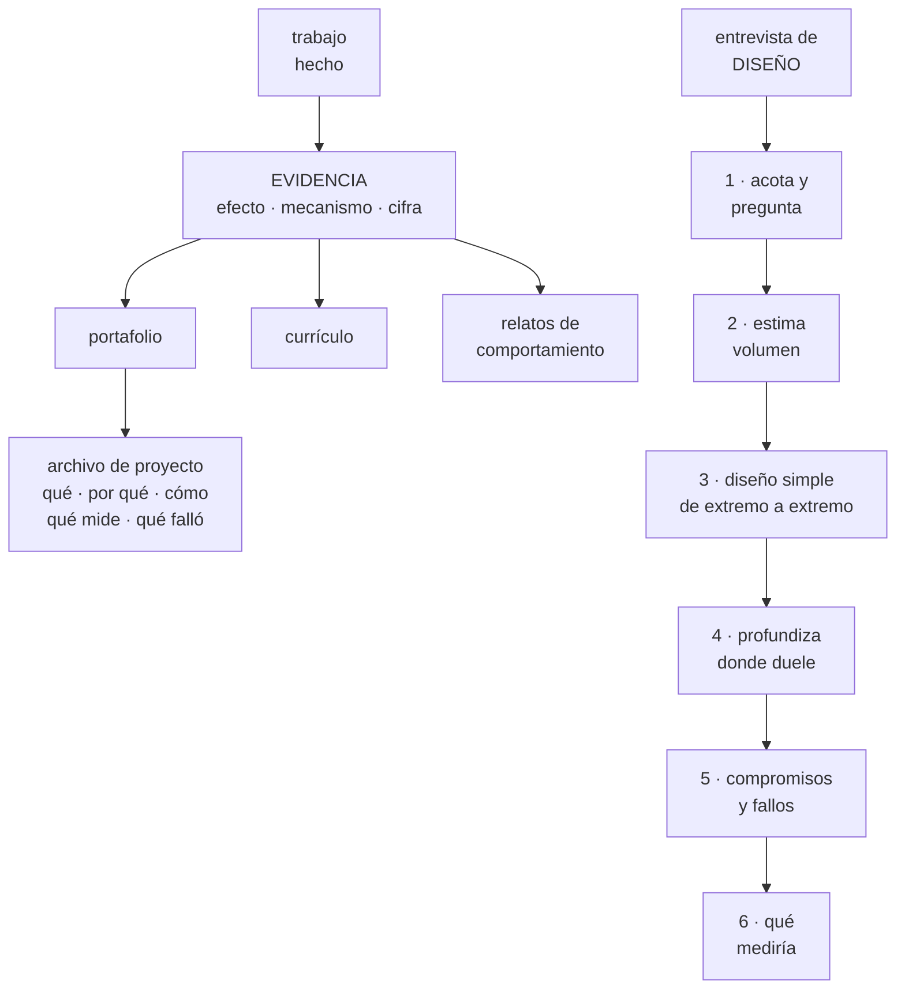

# 275 — Portafolio, evidencia, README y entrevista de sistemas

> [← Clase anterior](../../part-22-specializations-certifications-career/274-preguntas-de-escenario-y-estrategia-de-examen/README.md) · [Índice de la parte](../README.md) · [Clase siguiente →](../../part-22-specializations-certifications-career/276-proyecto-defensa-tecnica-ante-panel/README.md)

**Parte:** 22 — Especializaciones, certificaciones y práctica profesional<br>
**Nivel:** intermedio-avanzado · **Horas estimadas:** 4<br>
**Laboratorio:** `assessment` · **Estado:** `EXECUTABLE_CORE`

## 🎯 Propósito

Convertir el trabajo hecho en evidencia que otro puede evaluar en cinco minutos, y resolver una entrevista de diseño de sistemas. La clase da el formato de evidencia que funciona —**efecto, mecanismo y cifra**—, cómo se escribe un archivo de proyecto que se lee, y el método de la entrevista de diseño, donde lo que se evalúa no es la solución sino **cómo se llega a ella**.

## 📚 Resultados de aprendizaje

Al finalizar podrás:

1. **Escribir** evidencia con efecto, mecanismo y cifra.
2. **Estructurar** un archivo de proyecto que alguien lee en cinco minutos.
3. **Conducir** una entrevista de diseño de sistemas con método.
4. **Responder** preguntas de comportamiento con hechos y no con adjetivos.
5. **Elegir** qué mostrar y qué omitir según a quién evalúa.

## 🧩 Conceptos centrales

| Concepto | Comprensión verificable |
|---|---|
| `evidencia` | Afirmación verificable sobre trabajo real: qué cambió, cómo y cuánto. |
| `efecto, mecanismo y cifra` | Formato mínimo de una afirmación creíble: qué mejoró, por qué mejoró y cuánto. |
| `archivo de proyecto` | Documento de entrada de un repositorio. Su primer párrafo decide si alguien sigue leyendo. |
| `entrevista de diseño` | Ejercicio abierto donde se evalúa el método, las preguntas y los compromisos, no la respuesta. |
| `compromiso declarado` | Decir qué se empeora al elegir. Su ausencia es la señal más clara de nivel bajo. |
| `relato con hechos` | Respuesta de comportamiento con situación, acción propia y resultado medido. |

## 🧠 Modelo mental

Una especialización combina fundamentos, evidencia de proyectos y juicio bajo restricciones; una insignia sin práctica no sustituye esa combinación.

Aplicado a esta clase, separa siempre cuatro planos: **intención** (qué necesita el usuario),
**configuración** (qué declaramos), **estado observado** (qué existe de verdad) y
**evidencia** (cómo sabemos que cumple). Confundirlos produce diseños que se ven correctos
en un diagrama pero fallan al operar.

## 🗺️ Flujo de razonamiento



## 📖 Desarrollo

### 1. Evidencia: efecto, mecanismo y cifra

La mayoría de los currículos y portafolios describen actividad. Lo que se evalúa es efecto.

```text
ACTIVIDAD (no vale)
  «responsable de la infraestructura en la nube»
  «implanté una plataforma interna»
  «trabajé con contenedores, canales de datos y
   monitorización»
  → no dice qué cambió ni si funcionó

EVIDENCIA (vale)
  «bajé el tiempo de recuperación de 47 a 11 minutos
   reduciendo el lote de 14 cambios por despliegue a 1»
  «la adopción de la plataforma pasó de 3 a 38 de 41
   servicios al bajar las pruebas de 40 a 9 minutos y la
   configuración de 11 ficheros a 1»
  «encontré que 19 de 34 procedimientos estaban rotos
   ejecutándolos, y los convertí en ejecutables»

→ EFECTO: qué mejoró, medido
→ MECANISMO: por qué mejoró
→ CIFRA: cuánto
```

Y por qué el mecanismo es la parte que más discrimina:

```text
sin mecanismo, la cifra no se puede evaluar
  «mejoré el rendimiento un 40 %» → ¿cómo? ¿desde qué
  base? ¿a costa de qué?

con mecanismo, la conversación se vuelve técnica
  → y ahí es donde alguien de nivel 3 se distingue

y el mecanismo delata a quien no hizo el trabajo
  → quien lo hizo puede explicarlo tres niveles hacia
    abajo
```

Y qué hacer si no hay cifras:

```text
CASI SIEMPRE HAY ALGO CONTABLE
  cuántos, cuánto tardaba, cuántas veces al mes, de qué a
  qué
  → «de no poder restaurar a restaurar en 52 minutos,
    probado mensualmente»

y si de verdad no hay
  se cuenta el CAMBIO CUALITATIVO con precisión
  → «antes nadie sabía qué recursos existían; ahora hay
    inventario con dueño, generado cada 6 horas»

→ lo que no vale es el adjetivo: «mejoré mucho la
  fiabilidad»
```

Y la evidencia del fracaso, que casi nadie incluye y que más impresiona:

```text
«la primera remediación automática convirtió una
degradación en una caída en 3 minutos; le faltaba la
condición de mínimo sano. Desde entonces todo pasa por
modo sombra cuatro semanas»

→ demuestra nivel 3 mejor que un éxito
→ porque demuestra que hubo consecuencias y aprendizaje
→ y porque nadie inventa un fracaso con ese detalle
```

### 2. El archivo de proyecto

Un repositorio se juzga por su archivo de entrada, y casi siempre en menos de un minuto.

```text
LA ESTRUCTURA QUE FUNCIONA
  1  QUÉ ES, en dos frases
     y para quién
  2  EL PROBLEMA que resuelve, concreto
  3  CÓMO SE PRUEBA
     → los comandos para verlo funcionando
     → y esto va ARRIBA, no al final
  4  DECISIONES, con sus alternativas
     → «elegí X frente a Y porque Z; lo que empeora es W»
                                            clase 272
  5  QUÉ MIDE que funciona
  6  QUÉ NO HACE y qué falta
  7  y QUÉ APRENDÍ, incluido lo que salió mal

→ el punto 4 es el que distingue un proyecto de
  aprendizaje de un ejercicio copiado
→ y el 6 genera confianza: quien dice lo que falta suele
  saber de qué habla
```

Y los errores que descartan un portafolio:

```text
el proyecto no arranca siguiendo las instrucciones
  → y esto se comprueba, y falla mucho más de lo que se
    cree
credenciales en el repositorio
  → descarte inmediato en cualquier evaluación seria
                                            clase 197
tres proyectos idénticos de un tutorial
  → mejor uno propio, aunque sea pequeño
un README que explica la tecnología en vez del problema
y cero pruebas o cero señales
  → en un programa como este, es incoherente
```

Y qué proyecto elegir, si hay que construir uno:

```text
MEJOR PEQUEÑO Y COMPLETO QUE GRANDE E INACABADO
  un solo servicio con
    infraestructura como código               clase 128
    cadena de entrega con despliegue progresivo
                                              clase 102
    identidad sin credenciales permanentes    clase 256
    señales e indicadores de servicio         clase 268
    copias con restauración probada           clase 255
    y coste medido                            clase 270

→ eso demuestra más que un sistema distribuido a medias
→ y permite responder «¿qué pasa si...?» con datos
```

Y la adaptación a quien evalúa:

```text
filtro automático o de recursos humanos
  → palabras del anuncio, cifras claras, sin jerga
ingeniería
  → mecanismos y compromisos
dirección
  → efecto en negocio: coste, riesgo, tiempo de entrega

→ el mismo trabajo, tres presentaciones
→ y mentir en cualquiera se detecta en la siguiente
  conversación
```

### 3. La entrevista de diseño de sistemas

El error más común es empezar a dibujar. Lo que se evalúa es el método.

```text
QUÉ SE EVALÚA DE VERDAD
  qué preguntas haces antes de decidir
  si acotas el problema o lo aceptas tal cual
  si estimas volúmenes
  si declaras compromisos
  si anticipas fallos
  y si dices qué medirías

→ no hay respuesta correcta
→ y quien empieza a dibujar sin preguntar ya ha perdido
  la mitad
```

Y el método, con tiempos aproximados para 45 minutos:

```text
1  ACOTAR Y PREGUNTAR                         5-8 min
   ¿quiénes son los usuarios y qué hacen?
   ¿cuántos y con qué crecimiento?
   ¿qué es lo crítico: latencia, coherencia, coste?
   ¿qué está fuera de alcance?
   → y escribe los requisitos donde se vean

2  ESTIMAR                                    3-5 min
   peticiones por segundo, tamaño de los datos,
   crecimiento
   → con números redondos y dichos en voz alta
   → «un millón de usuarios activos al día, 20 acciones
     cada uno, son 20 millones al día, unas 230 por
     segundo de media y quizá 700 en pico»

3  DISEÑO SIMPLE DE EXTREMO A EXTREMO         8-10 min
   la versión que funciona, sin adornos
   → y decir explícitamente «esto es la versión simple;
     ahora veamos dónde se rompe»

4  PROFUNDIZAR DONDE DUELE                   10-15 min
   el modelo de datos y su partición          clase 208
   el camino crítico y sus plazos             clase 201
   qué pasa cuando una dependencia va lenta   clase 185
   y la coherencia que se necesita de verdad

5  COMPROMISOS Y FALLOS                       5-8 min
   qué empeora cada elección
   qué se cae si cae una zona
   y qué se degrada antes que caer            clase 262

6  QUÉ MEDIRÍA                                3-5 min
   indicadores por recorrido, no por máquina  clase 268
   → y con esto se cierra muy bien
```

Y las señales que buscan quienes entrevistan:

```text
SEÑALES BUENAS
  pregunta antes de decidir
  dice números en voz alta
  empieza simple y complica con motivo
  nombra lo que empeora sin que se lo pidan
  dice «no lo sé» y propone cómo averiguarlo
  y cambia de opinión cuando le dan un dato nuevo

SEÑALES MALAS
  dibuja una arquitectura elaborada de entrada
  añade componentes sin justificarlos
  no estima nada
  defiende su primera idea contra la evidencia
  y no menciona fallos ni operación

→ estas dos listas son las mismas de la clase 272,
  aplicadas a 45 minutos
```

### 4. Preguntas de comportamiento y qué omitir

La otra mitad de la entrevista, que decide más de lo que se admite.

```text
EL FORMATO QUE FUNCIONA
  SITUACIÓN   contexto en dos frases, con números
  TAREA       qué había que conseguir
  ACCIÓN      qué hiciste TÚ, no el equipo
  RESULTADO   medido, y qué aprendiste

→ y la parte que más se falla es la acción: se cuenta en
  plural y no se sabe qué hizo la persona
```

Y las preguntas que más se repiten, con lo que buscan:

```text
«cuéntame un incidente que dirigiste»
  → buscan método, comunicación y qué cambiaste después

«una decisión técnica de la que te arrepientes»
  → buscan honestidad y capacidad de análisis
  → responder «ninguna» es la peor respuesta posible

«un desacuerdo técnico con alguien»
  → buscan cómo se resuelve, no quién tenía razón
  → y la mejor respuesta suele incluir «tenía razón la
    otra persona y así lo comprobamos»

«algo que hiciste que nadie te pidió»
  → buscan iniciativa con criterio

y «cómo te mantienes al día»
  → buscan método, no lista de fuentes
```

Y qué omitir, que también es una decisión:

```text
NO PONGAS
  tecnologías que no sabrías defender
  → se pregunta por lo que está escrito
  proyectos de tutorial sin aportación propia
  niveles autoevaluados en barras de porcentaje
  → nadie sabe qué significa un 80 % en redes
  y trabajo de otros presentado como propio

SÍ PON
  lo que puedas explicar tres niveles hacia abajo
  y una cosa que salió mal, con lo que cambiaste
```

Y la lista de comprobación de la clase:

```text
☐ cada afirmación tiene efecto, mecanismo y cifra
☐ puedo explicar el mecanismo tres niveles hacia abajo
☐ incluyo al menos un fracaso con su corrección
☐ mi archivo de proyecto dice el problema antes que la
  tecnología
☐ los comandos para verlo funcionando están arriba
☐ hay una sección de decisiones con alternativas
☐ hay una sección de qué no hace y qué falta
☐ el proyecto arranca siguiendo las instrucciones
☐ no hay credenciales en ningún repositorio
☐ en diseño, pregunto y estimo antes de dibujar
☐ empiezo simple y digo dónde se rompe
☐ nombro lo que empeora sin que me lo pidan
☐ cierro diciendo qué mediría
☐ mis relatos dicen qué hice yo, con resultado medido
```

Y el cierre que enlaza con la clase siguiente: con la evidencia escrita y el método de diseño, queda ponerlo a prueba delante de gente que pregunta. La defensa técnica ante un panel es el proyecto de la clase 276, que cierra la parte 22.

## 🔬 Ejemplo trabajado

**Tres transformaciones de evidencia y una entrevista de diseño completa. Lo que sigue es el mismo trabajo escrito de tres formas, el archivo de proyecto que pasó de descartado a entrevista, y la transcripción resumida de una entrevista de diseño con lo que el evaluador anotó.**

**Transformación 1 · El mismo trabajo, tres versiones.**

```text
VERSIÓN 1 · actividad
  «Responsable de la operación de la plataforma en la
  nube. Implanté monitorización, procedimientos y mejoras
  en el proceso de despliegue.»

VERSIÓN 2 · con cifras, sin mecanismo
  «Reduje los incidentes un 62 % y el tiempo de
  recuperación un 77 %.»
  → mejor, y no se puede evaluar
  → «¿cómo?» y no hay respuesta escrita

VERSIÓN 3 · efecto, mecanismo y cifra
  «Los incidentes graves pasaron de 34 a 13 al año y el
  tiempo de recuperación de 47 a 11 minutos. El mecanismo
  principal fue reducir el lote: de 14 cambios por
  despliegue a 1, sustituyendo el comité de aprobación
  —que rechazaba el 0,6 %— por cinco comprobaciones
  automáticas. Con lotes de un cambio, revertir es
  inmediato y no hay que averiguar cuál de catorce fue.»
```

Y lo que ocurrió en la entrevista con cada versión:

```text
versión 1   3 preguntas genéricas, conversación corta
versión 3   la entrevista se fue 20 minutos por
            «cuéntame esas cinco comprobaciones»
            → y ahí se demostró el nivel

→ una evidencia bien escrita DIRIGE la entrevista hacia
  donde uno es fuerte
```

**Transformación 2 · El archivo de proyecto.**

```text
ANTES
  # cloudshop-infra
  Proyecto de infraestructura con Terraform, Kubernetes,
  Prometheus y GitHub Actions.

  ## Instalación
  (47 líneas de pasos manuales)

→ descartado en 20 segundos
→ dice tecnologías, no problema; y arrancar cuesta 47
  pasos
```

Y la versión reescrita:

```text
DESPUÉS

  # Servicio de pedidos con operación completa

  Un servicio de pedidos pequeño, montado con todo lo que
  hace falta para operarlo de verdad: despliegue
  progresivo, señales por recorrido, copias con
  restauración probada y coste medido. Sirve para
  enseñar cómo se opera un servicio, no cómo se escribe
  uno.

  ## Verlo funcionando en 3 minutos
  ```
  make up
  make smoke
  make chaos-kill-instance
  ```
  El tercer comando mata una instancia; el servicio sigue
  respondiendo y el panel lo muestra.

  ## El problema
  La mayoría de los proyectos de ejemplo despliegan y
  ahí acaban. Este responde a: ¿qué pasa cuando algo
  falla, quién se entera y cuánto se tarda en volver?

  ## Decisiones
  | decisión | alternativa | por qué | qué empeora |
  |---|---|---|---|
  | base relacional única | una por servicio | simplicidad operativa con 1 persona | escalado de escritura |
  | despliegue por porcentajes | azul-verde | vuelta atrás fina | despliegue más lento |
  | señales por recorrido | por máquina | refleja al usuario | más trabajo de instrumentación |

  ## Qué mide que funciona
  - éxito de compra > 99,5 %, medido en el cliente
  - restauración probada: 4 min 12 s la última vez
  - coste: 0,004 USD por pedido

  ## Qué NO hace
  - no hay multi-región: el objetivo de recuperación
    asumido son 4 horas
  - no hay autenticación de usuario final
  - la caché es en memoria y se pierde al reiniciar

  ## Qué aprendí
  La primera versión del despliegue progresivo retiraba
  instancias sin comprobar cuántas sanas quedaban. Con 3
  de 4 fallando por una dependencia lenta, las retiró
  todas. Añadí la condición de mínimo sano y una
  detección de fallo general.
```

Y el resultado:

```text
candidaturas enviadas con la versión antigua      14
  entrevistas                                      1
con la versión nueva                              11
  entrevistas                                      6
  y en 5 de las 6, el entrevistador citó la sección
  «Qué aprendí»

→ el fracaso contado con detalle fue lo más citado
```

**Una entrevista de diseño, resumida.**

```text
ENUNCIADO
  «Diseña el sistema de seguimiento de pedidos de una
  tienda: el usuario quiere ver dónde está su pedido.»

MINUTO 0-6 · ACOTAR
  «¿cuántos pedidos activos hay a la vez?»      ~2 M
  «¿de dónde viene el estado?»       de 4 transportistas,
                                     por API y por fichero
  «¿con qué frescura debe verse?»    «unos minutos está
                                     bien»
  «¿el usuario consulta o quiere que le avisen?»
                                     ambas
  «¿qué queda fuera?»                devoluciones

  y el candidato escribió:
    2 M pedidos activos · 4 orígenes · frescura de
    minutos · consulta y aviso

MINUTO 6-10 · ESTIMAR, en voz alta
  «2 M pedidos activos, con 3 actualizaciones al día cada
  uno, son 6 M eventos/día, unos 70 por segundo de media
  y quizá 300 en pico»
  «si el usuario consulta 2 veces por pedido, son 4 M
  consultas/día, unas 46 por segundo»
  «el estado de un pedido son unos 200 bytes; 2 M
  activos son 400 MB: cabe en memoria si hiciera falta»

  → el evaluador anotó: «estima sin que se lo pidan y usa
    la estimación para decidir»

MINUTO 10-19 · DISEÑO SIMPLE
  ingesta de los 4 orígenes → cola → procesador →
  almacén de estado → API de consulta
  y avisos por eventos desde el procesador

  «esta es la versión simple; ahora dónde se rompe»

MINUTO 19-33 · DONDE DUELE
  el evaluador pregunta: «un transportista envía eventos
  desordenados y a veces repetidos»
    → «entonces necesito idempotencia y orden por pedido:
      clave de partición el identificador de pedido, y
      descarto eventos con marca anterior a la última
      aplicada»                              clase 210

  «uno de los transportistas deja de responder»
    → «el estado se queda viejo. Prefiero mostrar la
      antigüedad —‹actualizado hace 3 horas›— a mostrar
      un estado falso. Y una alerta de frescura por
      transportista, no global, porque global se diluye»
                                              clase 268

  «los ficheros de un transportista llegan con 6 horas de
  retraso una vez»
    → «marca de agua y reproceso; el estado se corrige y
      el aviso ya enviado no se puede deshacer, así que
      los avisos solo se disparan con eventos de las APIs
      en tiempo real»                        clase 242

MINUTO 33-40 · COMPROMISOS
  «lo que empeora con la partición por pedido: un pedido
  con muchísimos eventos crea una partición caliente.
  Con 3 al día no pasa, pero si añadieran geolocalización
  continua, sí; ahí lo revisaría»            clase 208
  «y no tengo coherencia fuerte entre el estado y el
  aviso: puede llegar el aviso antes de que la consulta
  lo muestre. Lo acepto y lo mitigo leyendo de la réplica
  primaria durante 30 segundos tras un aviso»

MINUTO 40-45 · QUÉ MEDIRÍA
  «frescura por transportista, percentil 95»
  «éxito de la consulta de estado»
  «retraso de la cola»
  «y avisos enviados con estado incorrecto, que es el
   fallo que más molesta al usuario y el que menos se
   mide»
```

Y lo que el evaluador anotó al final:

```text
+ acotó antes de dibujar y escribió los requisitos
+ estimó en voz alta y usó la estimación
+ empezó simple y complicó con motivo
+ mencionó lo que empeora sin que se lo pidieran
+ propuso mostrar la antigüedad en vez de un estado falso
  → «esa respuesta la dan pocos y dice mucho»
+ cerró con una métrica que nadie suele nombrar
- no habló de coste en ningún momento
- no preguntó por normativa ni por datos personales

contratado
```

Y la observación del propio candidato después:

```text
«no dije nada que no estuviera en el programa; lo único
que hice distinto fue no dibujar hasta el minuto diez»
```

**La lección que esta clase deja**: la misma experiencia escrita como actividad dio **1 entrevista en 14 candidaturas** y escrita con efecto, mecanismo y cifra dio **6 en 11** —y en cinco de esas seis, lo que el entrevistador citó fue la sección donde se contaba un fracaso con detalle. Y en la entrevista de diseño, lo que el evaluador subrayó no fue ninguna pieza del sistema: fue que **no se dibujó nada hasta el minuto diez**.

## 🧪 Laboratorio guiado

Ejecuta desde la raíz:

```bash
python classes/part-22-specializations-certifications-career/275-portafolio-evidencia-readme-y-entrevista-de-sistemas/lab.py
```

El laboratorio selecciona el motor de práctica **`assessment`** y produce
`lab_result.json`. El escenario, sus comprobaciones y el artefacto esperado corresponden a
esta clase; no requiere credenciales y deja explícito qué debe revalidarse en un sandbox real.

1. Lee `exercise.steps` y formula una predicción antes de ejecutar.
2. Ejecuta la práctica y verifica todos los elementos de `checks`.
3. Provoca el caso de `negative_test` y explica la señal observada.
4. Materializa `professional-portfolio` en `evidence/` usando la plantilla indicada.
5. Para proveedor real, sigue `sandbox.requires`, registra costo y ejecuta `destroy`.

### Evidencia esperada

El artefacto principal es una evaluación por escenarios con rúbrica y evidencia trazable. Además, la entrega debe incluir el comando ejecutado,
la salida estructurada y una conclusión que no exceda lo observado.

## 🏆 Reto verificable

Construye **`professional-portfolio`** para el caso CloudShop. Incluye una alternativa descartada,
un supuesto que pueda falsarse, una prueba de fallo y una decisión de rollback.

## ✅ Criterio de aceptación

- [ ] `lab.py` termina con código 0 y genera JSON válido.
- [ ] La entrega conecta al menos tres requisitos con mecanismos verificables.
- [ ] Existe una prueba positiva y una prueba negativa con evidencia.
- [ ] Seguridad, costo y operación aparecen como decisiones, no como anexos.
- [ ] Se declara una limitación y una condición que obligaría a revisar el diseño.
- [ ] Otra persona puede repetir el recorrido sin conocimiento tácito.

## ⚠️ Errores frecuentes

| Síntoma | Causa probable | Corrección |
|---|---|---|
| El currículo describe responsabilidades y no genera entrevistas técnicas | Describe actividad en vez de efecto | Reescribe cada punto con efecto, mecanismo y cifra; el mecanismo es lo que convierte la conversación en técnica. |
| El portafolio se descarta en segundos | El archivo de entrada habla de tecnologías y arrancar cuesta decenas de pasos | Pon el problema en las dos primeras frases y los comandos para verlo funcionando arriba; comprueba que arranca siguiendo tus instrucciones. |
| En la entrevista de diseño la conversación se pierde | Se empezó a dibujar sin acotar ni estimar | Dedica los primeros minutos a preguntar y escribir requisitos, estima en voz alta y empieza por la versión simple diciendo dónde se rompe. |
| Preguntan por algo del currículo y no se sabe explicar | Se listó tecnología que no se puede defender | Pon solo lo que puedas explicar tres niveles hacia abajo; lo demás resta credibilidad al resto. |
| Las respuestas de comportamiento suenan vacías | Se cuentan en plural y sin resultado medido | Di qué hiciste tú, con contexto numérico y resultado; y ten preparada una decisión de la que te arrepientes, con su análisis. |
| El proyecto es grande, impresionante y no se puede probar | Se priorizó tamaño sobre completitud | Mejor un servicio pequeño con despliegue, señales, copias probadas y coste medido: permite responder a qué pasa si algo falla. |

## 🛡️ Seguridad, ética y costo

Trabaja con cuentas propias o sandboxes autorizados. No publiques secretos, identificadores
reales ni datos personales. Antes de crear recursos pagos define presupuesto, etiquetas y
comando de destrucción; después verifica que no queden recursos huérfanos. Los ejemplos
locales enseñan contratos, pero no certifican cumplimiento ni disponibilidad de producción.

## ❓ Preguntas de comprobación

1. ¿Qué tres partes tiene una afirmación de evidencia creíble y cuál discrimina más?
2. ¿Qué secciones hacen que un archivo de proyecto se lea y genere confianza?
3. ¿Qué se evalúa realmente en una entrevista de diseño de sistemas?
4. ¿Por qué contar un fracaso con detalle funciona mejor que otro éxito?
5. ¿Qué conviene omitir de un currículo o portafolio y por qué?

## 🔗 Referencias

- Xu, A. (2020). *System Design Interview: an insider's guide*. <https://www.oreilly.com/library/view/system-design-interview/9798641135823/>
- Google (2024). *How we hire: interviewing at Google*. <https://careers.google.com/how-we-hire/>
- Amazon (2024). *Interview process and behavioral questions guidance*. <https://amazon.jobs/content/en/how-we-hire/interviewing-at-amazon>
- GitHub (2024). *About READMEs*. <https://docs.github.com/repositories/managing-your-repositorys-settings-and-features/customizing-your-repository/about-readmes>
- Kleppmann, M. (2017). *Designing Data-Intensive Applications* — base habitual de las entrevistas de diseño. <https://dataintensive.net/>
- Documentación oficial vigente del servicio implementado; registra URL y fecha de consulta.

---

> [Evaluación](assessment.md) · [Contrato de clase](lesson.yaml) · [Índice de la parte](../README.md)
