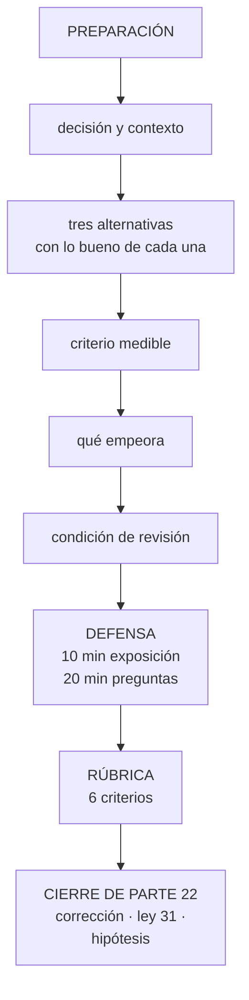

# 276 — Proyecto: defensa técnica ante panel

> [← 275 · Portafolio, evidencia, README y entrevista de sistemas](../../part-22-specializations-certifications-career/275-portafolio-evidencia-readme-y-entrevista-de-sistemas/README.md) · [Índice de la parte](../README.md) · [277 · Capstone retail: comercio multi-región →](../../part-23-industry-capstones/277-capstone-retail-comercio-multi-region/README.md)

**Parte:** 22 — Especializaciones, certificaciones y práctica profesional<br>
**Nivel:** intermedio-avanzado · **Horas estimadas:** 8<br>
**Laboratorio:** `capstone` · **Estado:** `EXECUTABLE_CORE`

## 🎯 Propósito

Defender una decisión técnica ante un panel que pregunta, con el material de toda la parte 22. La clase da el encargo, el formato, la rúbrica con la que se evalúa y las pruebas negativas. Y cierra la parte 22: corrige las cinco predicciones de la clase 264 —tres acertadas, una acertada por el motivo equivocado y una fallida—, actualiza el recuento de leyes, añade la ley 31 y escribe la hipótesis de la parte 23.

## 📚 Resultados de aprendizaje

Al finalizar podrás:

1. **Preparar** una defensa técnica con decisión, alternativas y criterio.
2. **Responder** preguntas hostiles sin defender la decisión, sino el criterio.
3. **Evaluar** una defensa con una rúbrica explícita.
4. **Corregir** las cinco predicciones de la clase 264 con evidencia.
5. **Escribir** la hipótesis de la parte 23 en forma refutable.

## 🧩 Conceptos centrales

| Concepto | Comprensión verificable |
|---|---|
| `defensa técnica` | Exposición breve de una decisión seguida de preguntas abiertas de un panel. Se evalúa el razonamiento, no la solución. |
| `ley 31` | Toda función de apoyo tiende a convertirse en la que autoriza; y al hacerlo, deja de ver el sistema real. |
| `rúbrica` | Criterios explícitos de evaluación, conocidos antes. Convierte una impresión en un juicio. |
| `pregunta hostil` | La que busca el punto débil real. Su respuesta correcta suele empezar por reconocerlo. |
| `alcance frente a visibilidad` | Distinción que decide una carrera: contar el trabajo no es lo mismo que hacer trabajo que afecta a otros. |
| `hipótesis de parte` | Afirmación refutable escrita antes de estudiar, que la parte siguiente corrige con evidencia. |

## 🧠 Modelo mental

Una especialización combina fundamentos, evidencia de proyectos y juicio bajo restricciones; una insignia sin práctica no sustituye esa combinación.

Aplicado a esta clase, separa siempre cuatro planos: **intención** (qué necesita el usuario),
**configuración** (qué declaramos), **estado observado** (qué existe de verdad) y
**evidencia** (cómo sabemos que cumple). Confundirlos produce diseños que se ven correctos
en un diagrama pero fallan al operar.

## 🗺️ Flujo de razonamiento



## 📖 Desarrollo

### 1. El encargo, el formato y la rúbrica

**El encargo.** Elige una decisión técnica real —tuya o del programa— y defiéndela ante un panel de tres personas: una técnica de tu área, una técnica de otra área y una que representa a negocio.

```text
EL FORMATO
  10 minutos de exposición
  20 minutos de preguntas
  5 minutos de cierre: qué cambiarías tras la
    conversación

→ y ese último tramo vale tanto como los otros dos
```

**Lo que hay que llevar preparado**, que es el material de la clase 272:

```text
1  la decisión, en una frase
2  el contexto y las restricciones reales
3  los atributos de calidad, ORDENADOS
4  tres alternativas, con lo bueno de cada una dicho en
   serio
5  el criterio medible que decidió
6  qué empeora con la elección
7  la condición de revisión
8  y el coste de la alternativa descartada  clase 270
```

**La rúbrica**, conocida antes de empezar:

```text                                              peso
1  ACOTACIÓN
   ¿queda claro el problema y lo que queda fuera?    15
2  ALTERNATIVAS
   ¿son tres reales? ¿se presenta bien lo bueno de
   las descartadas?                                  20
3  CRITERIO
   ¿es medible y se aplicó de verdad?                20
4  COMPROMISOS
   ¿dice qué empeora sin que se lo pidan?            20
5  RESPUESTA A LAS PREGUNTAS
   ¿defiende el criterio y no la decisión?
   ¿dice «no lo sé» cuando toca?                     15
6  REVISIÓN
   ¿hay condición que la invalide?                   10

→ y suspenden casi siempre por el 2 y el 4
→ el 2 porque llevan una alternativa de paja
→ el 4 porque presentan la decisión como sin coste
```

Y las preguntas que el panel debe hacer:

```text
«¿qué te haría cambiar de opinión?»
«¿cuál es la opción más barata y por qué no la elegiste?»
«¿qué pasa si el volumen se multiplica por diez?»
«¿quién opera esto y con qué guardia?»       clase 268
«¿qué se rompe primero?»                     clase 262
«¿cuánto cuesta al mes y de dónde sale esa cifra?»
«si te equivocaste, ¿cuándo lo sabrás?»
y «¿qué parte de esto no has probado?»

→ la última desarma a quien ha memorizado una defensa
```

### 2. Las pruebas negativas de la parte

Cada clase dejó una comprobación. Aquí se ejecutan sobre uno mismo.

```text
clase 265  coge tres competencias que dices tener
           → ¿qué falló alguna vez en cada una?
           → si en alguna es «nada», tu nivel ahí es 1

clase 266  ¿cuál es tu tiempo de entrega y qué tramo lo
           domina?
           → y ¿cuándo fue tu última vuelta atrás?

clase 267  ¿por qué el último equipo que no adoptó tu
           herramienta no la adoptó?
           → si no lo sabes, no es un producto

clase 268  coge tus objetivos de servicio
           → ¿alguno se incumple alguna vez?
           → si todos se cumplen siempre, no miden nada

clase 269  haz algo que debería detectarse y cronometra
           → ¿cuánto tardó? ¿alguien llamó?

clase 270  ¿cuál es tu coste por unidad de negocio y su
           tendencia?
           → y ¿cuánto coste evitado has registrado?

clase 271  ¿de dónde salieron los casos de tu evaluación?
           → y ¿cómo detectas un dato malo que no da
             error?

clase 272  coge tu última decisión importante
           → ¿está escrita con alternativas y condición de
             revisión?

clase 273  coge un servicio que uses
           → ¿sabrías traducirlo por restricción a otra
             nube y decir dónde se rompe la equivalencia?

clase 274  haz 20 preguntas de práctica y clasifica tus
           fallos
           → ¿cuántos son de conocimiento y cuántos de
             método?

clase 275  dale tu archivo de proyecto a alguien
           → ¿arranca siguiendo tus instrucciones?
           → ¿entiende el problema en dos frases?
```

Y la prueba que resume la parte entera:

```text
LA PRUEBA DE LOS CINCO MINUTOS
  cuenta a alguien que no conoce tu trabajo
    qué cambió por lo que hiciste
    por qué mecanismo
    con qué cifra
    y qué salió mal por el camino

→ en cinco minutos y sin jerga
→ si no puedes, no es que no lo hayas hecho: es que no
  sabes qué hiciste
```

### 3. Corrección de las cinco predicciones de la clase 264

**La corrección, con evidencia y sin adornos.**

```text
1. «las certificaciones correlacionarán con conseguir
    entrevistas y no con resolver problemas; y el hueco
    estará donde no se puede examinar por opción múltiple:
    decidir con información incompleta»

   CORRECTA, E INJUSTA EN UN PUNTO. Los datos la sostienen:
   quien memorizó volcados aprobó con un 74 % y seis meses
   después resolvió el 41 % de escenarios nuevos. Pero
   fuimos injustos con lo que el examen SÍ mide: límites,
   cuotas y modelos de precio, que es lo que más cae y lo
   que menos se estudia, y que en la clase 262 resultó ser
   la causa de que un plan de continuidad cubriera el 3,2 %
   de la capacidad prometida. Eso no es catálogo inútil.

2. «la especialización que peor envejecerá será la atada a
    un producto, y la que mejor, la atada a una
    RESTRICCIÓN, porque las restricciones sobreviven a los
    productos»

   CORRECTA Y DEMOSTRADA CON UN MÉTODO. La clase 273 lo
   convirtió en procedimiento: traducir por restricción
   encontró cuatro diferencias que la tabla por nombres no
   recogía, dos de ellas silenciosas. Y la evidencia
   inversa: la política traducida literalmente pasó la
   revisión humana concediendo acceso a 214 conjuntos de
   datos en vez de uno.

3. «buena parte del consejo de carrera tratará de
    visibilidad y no de destreza; será incómodo y será
    cierto»

   FALLIDA EN EL DIAGNÓSTICO. Predijimos visibilidad y lo
   que apareció fue otra cosa: la diferencia entre quien
   avanza y quien no no era contar el trabajo, era que el
   trabajo tuviera EFECTO SOBRE OTROS. La persona con ocho
   años y nivel 3 estable no tenía un problema de
   visibilidad: llevaba dos años sin cambiar cómo trabajaba
   ningún otro equipo. Y lo que convirtió una candidatura
   de una entrevista en catorce a seis en once no fue
   promocionarse: fue poder nombrar el MECANISMO, que
   requiere haberlo producido. Confundimos alcance con
   visibilidad.

4. «lo que el mercado paga en multinube no será saber tres
    nubes: será saber una a fondo y poder TRADUCIR»

   CORRECTA, Y CON UN MECANISMO QUE NO TENÍAMOS. Acertamos
   el qué y no sabíamos el porqué. El porqué es doble: la
   profundidad es lo que enseña la restricción, y la
   restricción es lo único que se traduce; y las empresas
   no quieren generalistas de tres nubes porque no quieren
   tres nubes. Operar la segunda le costaba a CloudShop 2,5
   personas y 492.000 USD al año, y se mantuvo por un
   contrato concreto, no por estrategia.

5. «más de la mitad de lo enseñado será transferible entre
    nubes sin cambios, y menos de una quinta parte será
    sintaxis de un producto concreto; y los temarios de
    certificación invertirán esa proporción»

   CORRECTA EN LA CIFRA Y CIEGA EN UN TERCIO. La
   clasificación del contenido dio 71 % de restricción,
   18 % de producto y 11 % de organización y personas. Las
   dos cifras predichas se cumplen. Lo que no vimos es ese
   11 %: no lo predijimos y resultó ser donde vive el modo
   de fracaso de las seis rutas. Ninguna especialidad
   fracasa por falta de técnica.
```

**Marcador: tres correctas, una correcta por el motivo equivocado y una fallida.** Y el fallo de la tercera enseña lo que obliga a escribir la ley: **el 11 % que no predijimos —lo organizativo— es donde todas las rutas se estropean, y siempre de la misma forma.**

### 4. Recuento de leyes, ley 31 e hipótesis de la parte 23

**El recuento de leyes, cerrada la parte 22.**

```text
ley 13  lo que no se mira deja de funcionar en silencio        68
ley 15  la señal existe y nadie la mira                        58
ley 22  un procedimiento nunca ejecutado no funciona           55
ley 16  un control que estorba se rodea                        43
ley 14  el coste se decide al crear, no al pagar               41
ley 20  lo que no tiene dueño se filtra y se desperdicia       38
ley 25  lo provisional sobrevive a su motivo                   34
ley 21  el acoplamiento vive en quién escribe                  34
ley 26  el valor por defecto sirve a la demostración           29
ley 23  la capacidad la limita lo que ya se mantiene           25
ley 17  se optimiza la medida, no el objetivo                  22
ley 24  lo que no está en el diagrama no se analiza            18
ley 27  un control solo actúa sobre lo que cambia              13
ley 19  la compensación hace invisible el fallo                11
ley 18  lo asíncrono traslada la garantía, no la elimina       11
ley 28  donde se paga por uso, cada defecto es una factura     11
ley 29  un fallo de datos no da error: da otro número          10
ley 30  automatizar elimina un juicio que nadie escribió        9
ley 31  la función de apoyo acaba autorizando, y se queda
        ciega                                                   6
```

Y la ley que la parte 22 obliga a escribir:

```text
LEY 31
  toda función de apoyo tiende a convertirse en la que
  autoriza; y en cuanto lo hace, deja de ver el sistema
  real

apariciones en esta parte                                      6
  clase 266   el equipo de entrega acabó aprobando todos los
              despliegues: rechazaba el 0,6 % y añadía 4,1
              días de espera
  clase 267   una plataforma obligatoria apaga la señal de
              adopción y esconde sus defectos en vez de
              corregirlos
  clase 268   la variante inversa: absorber la guardia ajena
              hace que quien construye deje de sufrir lo que
              construye
  clase 269   bloquear sin alternativa produjo 1.107 recursos
              fuera del inventario, incluida una base con
              datos de clientes
  clase 270   medirse por el ahorro conseguido convierte la
              función en la que aprueba gastos, y le quita
              de la vista el coste evitado
  clase 272   la arquitectura de control revisa diseños
              ajenos y reproduce el comité de cambios

y lo que la distingue de la ley 16
  la 16 describe a QUIEN SUFRE el control: lo rodea
  la 31 describe al que LO EJERCE: deriva hacia autorizar
  porque parece prudente, y su castigo no es la lentitud
  → es la CEGUERA: deja de ver lo que realmente ocurre
  → y por eso la métrica que salva a una función de apoyo
    es siempre la misma: cuántas decisiones buenas se
    toman sin ella
```

**La hipótesis de la parte 23** (clases 277 a 288, capstones sectoriales), escrita antes de estudiarla:

```text
1. los ocho sectores diferirán mucho menos en tecnología de
   lo que aparentan: lo que cambiará será QUÉ RESTRICCIÓN
   MANDA y qué se acepta perder cuando algo falla

2. en todos ellos, la restricción dominante será NO
   TÉCNICA: normativa, contrato o coste unitario; y la
   técnica se acomodará a ella                    ley 23

3. el capstone que más fallos silenciosos revele será el de
   datos e inteligencia artificial, porque un fallo de
   datos no da error                              ley 29

4. en el ensayo integrado, alrededor de dos tercios de los
   hallazgos volverán a ser organizativos, como en la
   clase 261                                  leyes 30, 31

5. y una refutable con cifra: **más del 70 % de las
   decisiones de los ocho capstones se podrán justificar
   con leyes ya escritas, sin necesidad de una nueva**; y
   las que no, se concentrarán en sector público y salud,
   donde la restricción es jurídica y no física
```

Y el cierre de la parte 22: **de doce clases, lo que más cambió resultados no fue técnico: fue que la misma experiencia, escrita como actividad, dio una entrevista en catorce candidaturas y escrita con efecto, mecanismo y cifra dio seis en once**. La parte 23 baja de nuevo al sistema y lo somete a ocho sectores con restricciones distintas. Empieza por el comercio en varias regiones. Es la clase 277.

## 🔬 Ejemplo trabajado

**Dos defensas ante panel, evaluadas con la rúbrica. Lo que sigue es la que suspendió con una solución técnicamente correcta, la que aprobó reconociendo su punto débil en la primera respuesta, y las preguntas que decidieron cada una.**

**Defensa 1 · Técnicamente correcta, suspendida.**

```text
DECISIÓN DEFENDIDA
  «migrar el catálogo a una base no relacional para
  soportar el crecimiento»

EXPOSICIÓN, 10 minutos
  8 minutos describiendo el modelo de datos y las ventajas
  1 minuto sobre el plan de migración
  1 minuto de conclusión

  → ninguna alternativa mencionada
  → ningún número de volumen actual
```

Y las preguntas que lo desmontaron:

```text
PANEL  «¿cuál es el volumen actual y cuál es el codo del
        sistema de ahora?»
CAND.  «no lo tengo medido, pero la base relacional no
        escala»
  → la clase 262 dice exactamente lo contrario de esa
    frase: el limitante casi nunca es el motor

PANEL  «¿cuál es la opción más barata y por qué no la
        elegiste?»
CAND.  «seguir como estamos, pero no aguantaría»
  → alternativa de paja: no se presentó nada bueno de ella

PANEL  «¿qué empeora con tu decisión?»
CAND.  «nada relevante; ganamos escalado»
  → y aquí el panel dio la defensa por perdida

PANEL  «¿cómo se hacen las consultas por rango de precio y
        categoría, que hoy son el 40 % del tráfico?»
CAND.  (silencio) «habría que modelarlas distinto»

PANEL  «¿quién opera esto de guardia y qué sabe hacer?»
CAND.  «el mismo equipo»
```

Y la puntuación:

```text                                        peso   obtenido
acotación                                     15         9
alternativas                                  20         3
criterio                                      20         4
compromisos                                   20         0
respuesta a preguntas                         15         6
revisión                                      10         2
                                            ────      ────
                                             100        24
```

Y el comentario del panel:

```text
«la decisión podría ser correcta. No lo sabemos, y quien
la defiende tampoco, porque no midió el sistema actual ni
consideró nada más. Decir que no empeora nada es lo que
más nos preocupa: significa que no ha entendido la
alternativa que descarta.»
```

**Defensa 2 · Aprobada reconociendo el punto débil.**

```text
DECISIÓN DEFENDIDA
  «no hacer activo-activo entre regiones y quedarnos en
  una región activa con otra en frío»       clase 272

EXPOSICIÓN, 10 minutos
  2 min  el problema y las restricciones: 9 personas de
         plataforma, guardia de 6, sin requisito de
         residencia
  2 min  atributos ordenados con negocio, y quién los
         ordenó
  3 min  tres alternativas, con lo bueno de cada una
         → y de la más cara dijo: «es la única que cumple
           literalmente lo que negocio pidió al principio»
  2 min  el criterio: coste por hora de caída evitada,
         contra 31.000 USD por hora medidos por negocio
  1 min  qué empeora: 4 horas de exposición por caída de
         región; y qué nos obliga: ensayar la conmutación
         cada trimestre y mantener las cuotas de la
         secundaria
```

Y la primera pregunta, que era la hostil:

```text
PANEL  «¿y si la caída ocurre en temporada alta, cuando
        una hora vale cuatro veces más?»

CAND.  «Entonces mi criterio se rompe. Con 124.000 por
        hora, activo-activo se justifica durante esas seis
        semanas y no durante las otras cuarenta y seis. Y
        no tengo una respuesta buena para eso: no puedo
        montar y desmontar una región activa dos veces al
        año. Lo que hago es reducir la probabilidad en esa
        ventana: congelar cambios de alto impacto, ensayar
        la conmutación antes de que empiece y ampliar las
        cuotas de la secundaria. Es una mitigación, no una
        solución.»

→ el panel anotó: «reconoce el límite de su criterio en la
  primera respuesta»
```

Y dos preguntas más:

```text
PANEL  «¿qué te haría cambiar de opinión?»
CAND.  «que el valor de una hora suba de 90.000 de forma
        sostenida, o que el equipo pase de 15 personas.
        Están escritas las dos en el registro, con alerta.»

PANEL  «¿qué parte de esto no has probado?»
CAND.  «la conmutación completa con carga real. Hemos
        conmutado con cuatro instancias y las cuotas de la
        secundaria solo daban para el 3,2 % de la
        capacidad. Eso lo arreglamos, pero el ensayo con
        carga completa está pendiente y es mi mayor riesgo
        abierto.»

→ el panel anotó: «dice lo que no ha probado sin que se lo
  saquemos»
```

Y la puntuación:

```text                                        peso   obtenido
acotación                                     15        14
alternativas                                  20        18
criterio                                      20        19
compromisos                                   20        18
respuesta a preguntas                         15        15
revisión                                      10        10
                                            ────      ────
                                             100        94
```

Y el cierre de esa persona, en los 5 minutos finales:

```text
«cambiaría dos cosas tras esta conversación. Una: el
criterio debería estar ponderado por temporada, no ser un
número anual; lo tenía como constante y no lo es. Y dos:
voy a poner fecha al ensayo de conmutación con carga
completa antes de la próxima temporada alta, porque
responder “está pendiente” dos veces seguidas ya es una
respuesta mala.»

→ y ese tramo, que muchos desperdician, subió la nota más
  que ninguna respuesta
```

**Los datos agregados de 14 defensas del equipo.**

```text                                        media   suspensos
                                             sobre     por ese
                                              peso     criterio
acotación                              15     11,2          1
alternativas                           20      9,4          8
criterio                               20     12,1          4
compromisos                            20      8,7          9
respuesta a preguntas                  15     10,9          2
revisión                               10      4,1          6

→ 9 de 14 fallaron en «qué empeora»
→ 8 de 14 llevaron alternativas de paja
→ y solo 5 de 14 tenían condición de revisión
```

Y el patrón que el panel escribió al final del ejercicio:

```text
«casi nadie suspende por no saber. Suspenden por presentar
su decisión como si no tuviera coste. Y eso, en una
revisión real, no lo perdona nadie: si no dices tú lo que
empeora, lo dirá otro, y entonces se pone en duda todo lo
demás que has dicho.»

→ que es exactamente el error 2 de la clase 272
```

**La lección que esta clase deja**: la defensa que suspendió con 24 puntos no era técnicamente incorrecta; suspendió por responder **«nada relevante»** a qué empeoraba, lo que el panel leyó como no haber entendido la alternativa descartada. Y la que sacó 94 empezó reconociendo, en la primera respuesta, que su criterio **se rompe en temporada alta** y que no tenía una solución buena para eso, solo una mitigación.

## 🧪 Laboratorio guiado

Ejecuta desde la raíz:

```bash
python classes/part-22-specializations-certifications-career/276-proyecto-defensa-tecnica-ante-panel/lab.py
```

El laboratorio selecciona el motor de práctica **`capstone`** y produce
`lab_result.json`. El escenario, sus comprobaciones y el artefacto esperado corresponden a
esta clase; no requiere credenciales y deja explícito qué debe revalidarse en un sandbox real.

1. Lee `exercise.steps` y formula una predicción antes de ejecutar.
2. Ejecuta la práctica y verifica todos los elementos de `checks`.
3. Provoca el caso de `negative_test` y explica la señal observada.
4. Materializa `technical-defense` en `evidence/` usando la plantilla indicada.
5. Para proveedor real, sigue `sandbox.requires`, registra costo y ejecuta `destroy`.

### Evidencia esperada

El artefacto principal es un incremento integrado, demostrable y documentado. Además, la entrega debe incluir el comando ejecutado,
la salida estructurada y una conclusión que no exceda lo observado.

## 🏆 Reto verificable

Construye **`technical-defense`** para el caso CloudShop. Incluye una alternativa descartada,
un supuesto que pueda falsarse, una prueba de fallo y una decisión de rollback.

## ✅ Criterio de aceptación

- [ ] `lab.py` termina con código 0 y genera JSON válido.
- [ ] La entrega conecta al menos tres requisitos con mecanismos verificables.
- [ ] Existe una prueba positiva y una prueba negativa con evidencia.
- [ ] Seguridad, costo y operación aparecen como decisiones, no como anexos.
- [ ] Se declara una limitación y una condición que obligaría a revisar el diseño.
- [ ] Otra persona puede repetir el recorrido sin conocimiento tácito.

## ⚠️ Errores frecuentes

| Síntoma | Causa probable | Corrección |
|---|---|---|
| La defensa suspende con una decisión técnicamente correcta | Se presentó como si no tuviera coste y sin alternativas reales | Di qué empeora antes de que te lo pregunten y presenta lo bueno de las opciones descartadas; una alternativa de paja invalida la comparación. |
| El panel pregunta por volúmenes y no hay respuesta | Se decidió sin medir el sistema actual | Lleva el codo medido y el recurso limitante actual; una migración justificada por que algo no escala necesita demostrar dónde está el límite. |
| La conversación se convierte en una discusión personal | Se defiende la decisión en vez del criterio | Sostén el criterio; si aparece un dato nuevo que lo rompe, dilo y ajusta, que es lo que el panel evalúa. |
| Se desperdicia el tramo final de la defensa | Se usa para repetir la conclusión en vez de responder a lo aprendido | Cierra diciendo qué cambiarías tras la conversación y con qué plazo; ese tramo sube la nota más que ninguna respuesta. |
| La decisión se defiende bien y no sobrevive seis meses | No tiene condición de revisión escrita | Escribe qué supuesto, si cambia, la invalida, y pon una alerta cuando se acerque; sin eso pasa a ser herencia. |
| El panel pregunta qué no has probado y la respuesta improvisa | No se identificó el riesgo abierto antes de la defensa | Ten localizado y dicho tu mayor riesgo sin probar; decirlo tú da credibilidad, que te lo saquen la quita. |

## 🛡️ Seguridad, ética y costo

Trabaja con cuentas propias o sandboxes autorizados. No publiques secretos, identificadores
reales ni datos personales. Antes de crear recursos pagos define presupuesto, etiquetas y
comando de destrucción; después verifica que no queden recursos huérfanos. Los ejemplos
locales enseñan contratos, pero no certifican cumplimiento ni disponibilidad de producción.

## ❓ Preguntas de comprobación

1. ¿Qué ocho piezas hay que llevar preparadas a una defensa técnica?
2. ¿Por qué se suspende más por compromisos y alternativas que por conocimiento?
3. ¿Cuál de las cinco predicciones falló y qué confundió?
4. ¿Qué distingue la ley 31 de la ley 16?
5. ¿Cuál es la métrica que salva a una función de apoyo?

## 🔗 Referencias

- Nygard, M. (2011). *Documenting architecture decisions*. <https://cognitect.com/blog/2011/11/15/documenting-architecture-decisions>
- Skelton, M. y Pais, M. (2019). *Team Topologies* — funciones de apoyo y su deriva. <https://teamtopologies.com/book>
- Google (2024). *DORA capabilities: streamlining change approval*. <https://dora.dev/capabilities/streamlining-change-approval/>
- AWS (2024). *Well-Architected Framework Reviews*. <https://docs.aws.amazon.com/wellarchitected/latest/framework/welcome.html>
- Ford, N. y Richards, M. (2021). *Software Architecture: the hard parts* — defender compromisos. <https://www.oreilly.com/library/view/software-architecture-the/9781492086888/>
- Documentación oficial vigente del servicio implementado; registra URL y fecha de consulta.

---

> [Evaluación](assessment.md) · [Contrato de clase](lesson.yaml) · [Índice de la parte](../README.md)

| Anterior | Índice | Siguiente |
|---|---|---|
| [← 275 · Portafolio, evidencia, README y entrevista de sistemas](../../part-22-specializations-certifications-career/275-portafolio-evidencia-readme-y-entrevista-de-sistemas/README.md) | [Parte 22](../README.md) · [Programa](../../README.md) | [277 · Capstone retail: comercio multi-región →](../../part-23-industry-capstones/277-capstone-retail-comercio-multi-region/README.md) |
