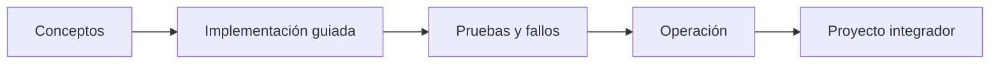

# Parte 22 — Especializaciones, certificaciones y práctica profesional

> [← Parte 21](../part-21-cloud-operations-automation/README.md) · [Índice completo](../README.md) · [Parte 23 →](../part-23-industry-capstones/README.md)

**📥 Descargar:** [Esta parte en PDF](../../site/downloads/partes/manual-parte-22-specializations-certifications-career.pdf) · [Manual integral](../../site/downloads/multi-cloud-engineering-manual-v2.0.pdf)

**Nivel:** intermedio-avanzado · **Clases:** 12 · **Duración sugerida:** 6–8 semanas

Transformar el conocimiento transversal en perfiles demostrables, preparación certificable y comunicación profesional.

## Resultados de la parte

Al completar esta parte podrás explicar el dominio con lenguaje independiente del proveedor,
implementar sus mecanismos esenciales, diagnosticar fallos y defender decisiones mediante
evidencia, costo, seguridad y objetivos de confiabilidad.

## Modelo mental

Una especialización combina fundamentos, evidencia de proyectos y juicio bajo restricciones; una insignia sin práctica no sustituye esa combinación.

## Secuencia

## Clases

| ID | Clase | Laboratorio | Horas |
|---:|---|---|---:|
| 265 | [Ruta Cloud Engineer y mapa de competencias](265-ruta-cloud-engineer-y-mapa-de-competencias/README.md) | `decision` | 4 |
| 266 | [Ruta DevOps y Delivery Engineer](266-ruta-devops-y-delivery-engineer/README.md) | `decision` | 4 |
| 267 | [Ruta Platform Engineer](267-ruta-platform-engineer/README.md) | `decision` | 4 |
| 268 | [Ruta Site Reliability Engineer](268-ruta-site-reliability-engineer/README.md) | `decision` | 4 |
| 269 | [Ruta Cloud Security Engineer](269-ruta-cloud-security-engineer/README.md) | `decision` | 4 |
| 270 | [Ruta FinOps Practitioner](270-ruta-finops-practitioner/README.md) | `decision` | 4 |
| 271 | [Ruta Cloud Data y AI Engineer](271-ruta-cloud-data-y-ai-engineer/README.md) | `decision` | 4 |
| 272 | [Ruta Cloud Solutions Architect](272-ruta-cloud-solutions-architect/README.md) | `decision` | 4 |
| 273 | [Mapeo AWS, Azure, Google Cloud, Kubernetes y FinOps](273-mapeo-aws-azure-google-cloud-kubernetes-y-finops/README.md) | `assessment` | 4 |
| 274 | [Preguntas de escenario y estrategia de examen](274-preguntas-de-escenario-y-estrategia-de-examen/README.md) | `assessment` | 4 |
| 275 | [Portafolio, evidencia, README y entrevista de sistemas](275-portafolio-evidencia-readme-y-entrevista-de-sistemas/README.md) | `assessment` | 4 |
| 276 | [Proyecto: defensa técnica ante panel](276-proyecto-defensa-tecnica-ante-panel/README.md) | `capstone` | 8 |

## Evaluación de la parte

- 35 % laboratorios y evidencia reproducible.
- 25 % retos verificables.
- 20 % decisiones y ADR.
- 10 % seguridad, confiabilidad y costo.
- 10 % proyecto integrador de la parte.

Se aprueba con 80 % de clases en nivel B o superior y el proyecto integrador reproducible.

## Pauta bibliográfica

- The Staff Engineer's Path — Tanya Reilly.
- The Manager's Path — Camille Fournier.
- Staff Engineer — Will Larson.
