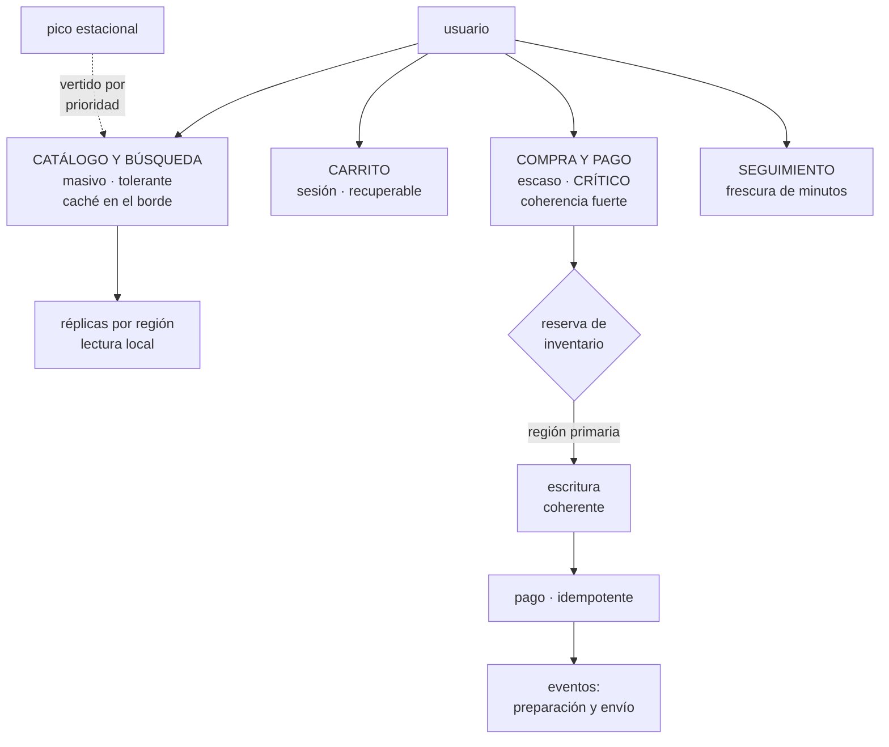

# 277 — Capstone retail: comercio multi-región

> [← Clase anterior](../../part-22-specializations-certifications-career/276-proyecto-defensa-tecnica-ante-panel/README.md) · [Índice de la parte](../README.md) · [Clase siguiente →](../../part-23-industry-capstones/278-capstone-financiero-pagos-auditoria-y-recuperacion/README.md)

**Parte:** 23 — Capstones por industria y defensa final<br>
**Nivel:** experto · **Horas estimadas:** 8<br>
**Laboratorio:** `capstone` · **Estado:** `EXECUTABLE_CORE`

## 🎯 Propósito

Primer capstone sectorial: comercio en varias regiones. La clase da el encargo completo, la restricción que manda en este sector —**el pico estacional concentrado y la asimetría entre leer y comprar**—, las decisiones por capa con sus alternativas, lo que se acepta perder cuando algo falla, y las pruebas negativas que verifican el resultado.

## 📚 Resultados de aprendizaje

Al finalizar podrás:

1. **Identificar** la restricción dominante del comercio y qué decide.
2. **Separar** los recorridos por criticidad y tratarlos distinto.
3. **Decidir** la estrategia entre regiones con coste y con cifras.
4. **Definir** qué se degrada y en qué orden bajo carga.
5. **Verificar** el diseño con las pruebas negativas del sector.

## 🧩 Conceptos centrales

| Concepto | Comprensión verificable |
|---|---|
| `asimetría de recorridos` | Leer catálogo es masivo y tolerante; comprar es escaso y crítico. Se diseñan por separado. |
| `pico estacional` | Concentración de demanda en horas concretas del año. Determina capacidad, cambio y guardia. |
| `reserva de inventario` | El punto donde el comercio necesita coherencia fuerte. Casi el único. |
| `sobreventa` | Vender más unidades de las existentes. Riesgo aceptable con compensación, o no, según el producto. |
| `degradación por prioridad` | Apagar lo accesorio para que lo esencial siga. Decidido antes, con negocio. |
| `residencia por mercado` | Obligación de que ciertos datos permanezcan en una región concreta. |

## 🧠 Modelo mental

El capstone no premia cantidad de servicios, sino trazabilidad entre contexto, decisiones, implementación, fallos, evidencia y aprendizaje.

Aplicado a esta clase, separa siempre cuatro planos: **intención** (qué necesita el usuario),
**configuración** (qué declaramos), **estado observado** (qué existe de verdad) y
**evidencia** (cómo sabemos que cumple). Confundirlos produce diseños que se ven correctos
en un diagrama pero fallan al operar.

## 🗺️ Flujo de razonamiento



## 📖 Desarrollo

### 1. El encargo y la restricción que manda

**El encargo.** CloudShop opera en tres mercados —Europa, Norteamérica y Latinoamérica— con catálogo compartido, inventario por almacén y pago por pasarela local. Hay que diseñar y defender la arquitectura completa, con cifras.

```text
CIFRAS DE PARTIDA
  visitas/mes                              41 M
  búsquedas y vistas de catálogo/día        18 M
  pedidos/día                              38.000
  pico de temporada alta                    ×3,1 sobre un
                                            martes normal
  y el evento de campaña                    ×1,6 durante
                                            40 minutos
  referencias en catálogo                   2,1 M
  almacenes                                 7
  mercados con residencia obligatoria       1 (Europa,
                                            datos
                                            personales)
```

Y la restricción que manda, que no es técnica:

```text
EL NEGOCIO SE JUEGA EN HORAS CONCRETAS DEL AÑO
  el 31 % de los ingresos anuales ocurre en 6 semanas
  y dentro de esas, el 9 % en 3 días

→ consecuencias directas
  la capacidad se dimensiona para el pico y se paga todo
    el año, salvo que sea elástica de verdad
                                            clase 262
  la ventana de cambio de esas semanas vale más que
    cualquier otra decisión                 clase 260
  y la guardia de esos días necesita gente, no
    procedimientos                          clase 257

→ y en un sector donde una caída de una hora en el día
  malo cuesta más que un mes de infraestructura, la
  conversación de coste cambia de sentido
```

Y la segunda restricción, la que ordena el diseño:

```text
LA ASIMETRÍA ENTRE LEER Y COMPRAR
  18 M vistas/día frente a 38.000 pedidos/día
  → 474 lecturas por cada compra

  y sus exigencias son opuestas
    catálogo   masivo · tolerante a datos algo viejos ·
               caché sirve · latencia importa mucho
    compra     escaso · exige coherencia · idempotencia ·
               latencia importa menos que la corrección

→ tratarlos igual es el error de partida del sector
→ y separarlos permite que el 99,8 % del tráfico se sirva
  desde caché regional y el 0,2 % desde la región donde
  vive la verdad
```

### 2. Las decisiones por capa

Cada una con su alternativa y con lo que empeora.

```text
CATÁLOGO Y BÚSQUEDA
  decisión   réplicas de solo lectura por región, con
             caché en el borde y validez de 5 minutos
  alternativa  servir todo desde una región
  por qué    474 lecturas por compra; la latencia de
             catálogo mueve la conversión
  empeora    un cambio de precio tarda hasta 5 minutos en
             verse en todas partes
  mitigación invalidación explícita para precio y para
             disponibilidad; los demás campos, por caducidad

INVENTARIO Y RESERVA
  decisión   la reserva se hace en la región del ALMACÉN
             que sirve, con coherencia fuerte
  alternativa  inventario replicado con resolución de
             conflictos
  por qué    la sobreventa de un producto único no se
             compensa; la de un producto con reposición, sí
  empeora    una compra que cruza almacenes de dos regiones
             tarda más
  y se acepta porque son el 3 % de los pedidos

CARRITO
  decisión   persistente y asociado a la identidad, no a
             la sesión ni a la instancia
  alternativa  en memoria de la instancia
  por qué    la clase 261 midió lo que cuesta: el 9 % de
             usuarios perdía la compra al retirar una
             instancia
  empeora    una escritura por acción del usuario

PAGO
  decisión   pasarela local por mercado, con clave de
             idempotencia obligatoria y máquina de estados
             explícita                       clase 210
  alternativa  una pasarela global
  por qué    las tasas de aprobación locales son entre 4 y
             11 puntos mejores, y eso domina cualquier
             consideración técnica
  empeora    tres integraciones que mantener y tres modos
             de fallo distintos

PEDIDO Y CUMPLIMIENTO
  decisión   pedido confirmado = evento; el resto es
             asíncrono                       clase 210
  alternativa  todo síncrono hasta el almacén
  por qué    el almacén no puede tumbar la compra
  empeora    el usuario ve «confirmado» antes de que el
             almacén lo sepa
  y se acepta con seguimiento por frescura   clase 275

DATOS PERSONALES
  decisión   los de clientes europeos residen en Europa;
             el catálogo y los datos agregados, no
  alternativa  todo en una región
  por qué    obligación legal del mercado
  empeora    dos almacenes analíticos y una vista unificada
             que hay que construir
```

Y la estrategia entre regiones:

```text
decisión   una región activa por mercado, con la
           secundaria en frío y datos replicados
           objetivo de recuperación: 30 minutos en
           temporada alta, 4 horas el resto del año
  → y esa diferencia es lo interesante
  → durante 6 semanas se mantiene capacidad caliente en la
    secundaria; el resto del año no
  coste     +9.000 USD/mes base; +41.000 en temporada
  alternativa activo-activo permanente: +112.000/mes
```

### 3. Qué se acepta perder

El diseño no se define por lo que aguanta: se define por lo que se decide sacrificar y en qué orden.

```text
EL ORDEN DE DEGRADACIÓN, acordado con negocio

  PRIORIDAD 1 · nunca se apaga
    completar una compra ya iniciada
    pago y confirmación
    → si esto cae, no hay negocio

  PRIORIDAD 2 · se degrada, no se apaga
    catálogo y búsqueda
    → si la búsqueda falla, se sirve el catálogo por
      categorías desde caché
    → peor experiencia, negocio vivo

  PRIORIDAD 3 · se apaga bajo carga
    recomendaciones
    valoraciones y reseñas
    disponibilidad exacta por tienda física
    → y esto se decidió ANTES, no durante  clase 262

  PRIORIDAD 4 · se vierte
    histórico de pedidos
    exportaciones y paneles de comerciantes
```

Y los sacrificios explícitos, que son la parte que cuesta acordar:

```text
SE ACEPTA
  que un precio tarde hasta 5 minutos en propagarse
  que el seguimiento muestre «actualizado hace X» en vez
    de un estado falso
  que un pedido aparezca en el almacén con hasta 2 minutos
    de retraso
  que el histórico no esté disponible en el pico
  y sobreventa de hasta el 0,3 % en productos con
    reposición, con compensación automática al cliente

NO SE ACEPTA
  cobrar dos veces                         clase 210
  perder un pedido confirmado
  sobrevender un producto único o personalizado
  mostrar el pedido de otro cliente
  y que un dato personal europeo salga de Europa

→ y esta lista es el documento más útil del capstone
→ porque durante un incidente nadie tiene tiempo de
  decidirlo                                clase 257
```

Y las señales que verifican esas promesas:

```text
éxito de compra, medido en el cliente        > 99,9 %
latencia del catálogo, percentil 95          < 800 ms
cobros duplicados                            0, alerta
                                             inmediata
sobreventa por categoría de producto         panel diario
frescura del seguimiento por transportista   p95 < 10 min
retraso pedido → almacén                     p95 < 2 min
y datos personales fuera de región           0, control
                                             automático
```

### 4. Las pruebas negativas del capstone

Lo que hay que ejecutar para saber si el diseño funciona.

```text
DE CARGA Y CAPACIDAD                        clase 262
  ☐ ¿cuál es el recurso limitante de la compra y dónde
    está su codo?
  ☐ ¿el vertido por prioridad está probado con carga real?
  ☐ ¿escalar el servicio empeora algún limitante?
  ☐ ¿las cuotas de la región secundaria dan para el 100 %?

DE FALLO                                    clase 261
  ☐ retirar una instancia: ¿alguien pierde el carrito?
  ☐ +200 ms en inventario: ¿cuánto se degrada la compra?
  ☐ la pasarela de un mercado no responde: ¿qué ve el
    usuario?
  ☐ el almacén no consume eventos durante 2 horas: ¿se
    pierde algún pedido?
  ☐ caída de una zona en pico: ¿qué se degrada y en qué
    orden?

DE CORRECCIÓN
  ☐ reenviar el mismo pago tres veces: ¿un solo cobro?
  ☐ dos compras simultáneas de la última unidad: ¿una sola
    gana?
  ☐ un evento de estado llega desordenado: ¿se aplica el
    viejo?
  ☐ un evento llega duplicado: ¿se duplica el pedido?

DE DATOS Y NORMATIVA
  ☐ ¿algún dato personal europeo sale de Europa? control
    automático                              clase 251
  ☐ ¿un cliente puede ver el pedido de otro cambiando un
    identificador?
  ☐ ¿la exportación analítica contiene datos personales?

DE OPERACIÓN                                parte 21
  ☐ ¿cuánto tarda restaurar el pedido más reciente?
  ☐ ¿la conmutación de región se ha ensayado con carga?
  ☐ ¿el procedimiento de sobreventa existe y se ha
    ejecutado?
  ☐ ¿la guardia de temporada alta está dimensionada?
```

**El entregable del capstone:**

```text
1  diagrama por recorrido, no por servicio
2  registro de decisiones con alternativas y coste
                                            clase 272
3  la lista de lo que se acepta perder, firmada con
   negocio
4  el orden de degradación
5  los indicadores por recorrido y sus objetivos
                                            clase 268
6  el plan de temporada alta: capacidad, congelación,
   guardia y ensayos
7  el coste mensual estimado, base y pico
8  y el resultado de las pruebas negativas, con lo que
   falló
```

Y el cierre que enlaza con la clase siguiente: el comercio acepta perder cosas y compensar. El siguiente sector no puede: cuando el dato es dinero y hay que probar ante un tercero qué ocurrió, el diseño cambia. Pagos, auditoría y recuperación es la materia de la clase 278.

## 🔬 Ejemplo trabajado

**El capstone resuelto, con las cifras de las pruebas negativas. Lo que sigue son las tres decisiones que costaron discusión, lo que falló al ejecutar las pruebas, y el resultado de la temporada alta.**

**Discusión 1 · Sobreventa: dónde está la coherencia fuerte.**

```text
posturas
  ingeniería  «reservar con coherencia fuerte cuesta
              latencia y limita el caudal»
  negocio     «vender algo que no existe destroza la
              confianza»

lo que resolvió la discusión: separar por tipo de producto

  producto con reposición (94 % del catálogo)
    → reserva optimista con reconciliación
    → sobreventa tolerada hasta el 0,3 %
    → compensación automática: cupón y aviso en 2 horas
    → coste de la compensación   ~11.000 USD/año

  producto único o personalizado (6 %)
    → reserva con coherencia fuerte en la región del
      almacén
    → cero sobreventa
    → y esos productos son el 23 % del margen

→ el coste de la coherencia fuerte solo se paga donde hace
  falta
→ y la cifra que cerró la discusión fue el coste de las
  compensaciones frente al de aplicar coherencia fuerte a
  todo: 11.000 al año frente a 214.000
```

**Discusión 2 · La región activa por mercado.**

```text
propuesta inicial   una sola región global
  latencia de catálogo desde Latinoamérica     310 ms
  conversión medida en ese mercado             1,7 %

prueba controlada
  se sirvió el catálogo desde una réplica regional a la
  mitad del tráfico durante 3 semanas
    latencia            310 ms → 84 ms
    conversión          1,7 % → 2,3 %
    → +35 % relativo

  ingresos adicionales anualizados        1,9 M USD
  coste de la réplica regional          148.000 USD/año

→ decisión tomada con datos, no con principios
→ y el registro guarda la prueba, no solo la conclusión
                                            clase 272
```

Y lo que empeoró, dicho en el registro:

```text
un cambio de precio tarda hasta 5 minutos en verse en
todas las regiones
  → y en una campaña relámpago eso importaba
  → mitigación: invalidación explícita para precio y
    disponibilidad, propagada en < 20 s
  → y los demás campos por caducidad, que es lo barato
```

**Las pruebas negativas, ejecutadas.**

```text                                              resultado

CARGA
codo de la compra                          4.100 pet/s
recurso limitante                          conexiones a
                                           inventario
vertido por prioridad probado                      sí
escalar empeora el limitante          sí, corregido con
                                      intermediario
cuotas de la secundaria                3,2 % → 100 %

FALLO
retirar instancia: ¿se pierde carrito?             no
+200 ms en inventario                 compra 1.240 ms
                                      (antes 4.100)
pasarela caída de un mercado          se ofrece método
                                      alternativo en 1,4 s
almacén sin consumir 2 h              0 pedidos perdidos;
                                      cola al día en 9 min
caída de zona en pico                 recomendaciones y
                                      reseñas apagadas;
                                      compra intacta

CORRECCIÓN
pago reenviado 3 veces                       1 cobro
última unidad, 2 compras simultáneas   1 gana, 1 avisa
evento de estado desordenado             descartado
evento duplicado                         sin efecto

DATOS
dato personal europeo fuera de Europa   1 HALLAZGO
cliente ve pedido ajeno                        no
exportación con datos personales        1 HALLAZGO

OPERACIÓN
restaurar el pedido más reciente             4 min 12 s
conmutación ensayada con carga               sí, 22 min
procedimiento de sobreventa                  sí, usado 3
                                             veces
```

Y los dos hallazgos de datos, que eran los graves:

```text
HALLAZGO 1
  el servicio de recomendaciones enviaba el identificador
  de cliente a un proveedor externo alojado fuera de
  Europa
  → llevaba 14 meses
  → y el contrato con el proveedor no cubría transferencia
  corrección  se sustituyó por un identificador
              seudonimizado y rotatorio; y el control
              automático se añadió a la cadena  clase 251

HALLAZGO 2
  la exportación analítica nocturna incluía correo
  electrónico y dirección, y se copiaba a un almacén en
  otra región
  → la exportación existía desde antes de la separación
    por mercados                                ley 25
  corrección  seudonimización en el origen y control de
              esquema que detiene la publicación
                                             clase 243

→ los dos son de datos, ninguno da error, y los dos
  llevaban más de un año                       ley 29
```

**La temporada alta, con el plan aplicado.**

```text
plan
  capacidad para 9.200 pet/s, con vertido preparado
  cuotas ampliadas en ambas regiones de cada mercado
  objetivo de recuperación bajado a 30 min con secundaria
    caliente durante 6 semanas
  congelación parcial: estándar sí, alto impacto no
                                            clase 260
  guardia reforzada: 8 personas, turnos de 8 horas
  y ensayo de conmutación 2 semanas antes

lo que ocurrió
  pico real                              10.870 pet/s
  vertido activo                              49 min
  peticiones rechazadas                        8,4 %
  compras completadas               100 % de las
                                    intentadas
  incidentes de gravedad alta                      1
    (una pasarela local degradada 26 min; método
     alternativo ofrecido automáticamente)
  ingresos de las 6 semanas             +37 % interanual
```

Y la comparación con el año anterior:

```text                                   año anterior    este año
pico soportado                     3.800 pet/s    9.200 pet/s
caídas del flujo de compra            2 h 40 min          0
compras completadas en el pico             41 %       100 %
incidentes graves                             6           1
cambios desplegados en las 6 semanas           0         214
  incidentes causados por ellos               -           0

coste de infraestructura de las 6
  semanas                              189.000     241.000
ingresos de las 6 semanas                  base       +37 %
```

Y la lectura que el equipo llevó a la defensa:

```text
se gastaron 52.000 USD más en infraestructura durante la
temporada
y se desplegaron 214 cambios donde antes 0

→ y no hubo ni una caída del flujo de compra
→ la congelación total del año anterior no había evitado
  las 2 h 40 de caída: las había concentrado
                                            clase 260
```

**La lección que este capstone deja**: la coherencia fuerte se aplicó al **6 % del catálogo** —los productos únicos, que son el 23 % del margen— y compensar la sobreventa del resto costó 11.000 USD al año frente a los 214.000 de aplicarla a todo. Y las dos pruebas que fallaron no eran de carga ni de fallo: eran **datos personales saliendo de Europa por dos caminos que llevaban más de un año abiertos** y que no producían ningún error.

## 🧪 Laboratorio guiado

Ejecuta desde la raíz:

```bash
python classes/part-23-industry-capstones/277-capstone-retail-comercio-multi-region/lab.py
```

El laboratorio selecciona el motor de práctica **`capstone`** y produce
`lab_result.json`. El escenario, sus comprobaciones y el artefacto esperado corresponden a
esta clase; no requiere credenciales y deja explícito qué debe revalidarse en un sandbox real.

1. Lee `exercise.steps` y formula una predicción antes de ejecutar.
2. Ejecuta la práctica y verifica todos los elementos de `checks`.
3. Provoca el caso de `negative_test` y explica la señal observada.
4. Materializa `retail-capstone` en `evidence/` usando la plantilla indicada.
5. Para proveedor real, sigue `sandbox.requires`, registra costo y ejecuta `destroy`.

### Evidencia esperada

El artefacto principal es un incremento integrado, demostrable y documentado. Además, la entrega debe incluir el comando ejecutado,
la salida estructurada y una conclusión que no exceda lo observado.

## 🏆 Reto verificable

Construye **`retail-capstone`** para el caso CloudShop. Incluye una alternativa descartada,
un supuesto que pueda falsarse, una prueba de fallo y una decisión de rollback.

## ✅ Criterio de aceptación

- [ ] `lab.py` termina con código 0 y genera JSON válido.
- [ ] La entrega conecta al menos tres requisitos con mecanismos verificables.
- [ ] Existe una prueba positiva y una prueba negativa con evidencia.
- [ ] Seguridad, costo y operación aparecen como decisiones, no como anexos.
- [ ] Se declara una limitación y una condición que obligaría a revisar el diseño.
- [ ] Otra persona puede repetir el recorrido sin conocimiento tácito.

## ⚠️ Errores frecuentes

| Síntoma | Causa probable | Corrección |
|---|---|---|
| El catálogo y la compra se diseñan igual y ninguno queda bien | Se ignoró la asimetría: cientos de lecturas por cada compra, con exigencias opuestas | Separa los recorridos: catálogo con réplicas y caché regional, compra con coherencia donde hace falta. |
| Aplicar coherencia fuerte a todo el inventario limita el caudal y encarece | No se distinguió el producto con reposición del producto único | Reserva optimista con reconciliación y compensación donde la sobreventa se puede compensar; coherencia fuerte solo donde no. |
| Durante el pico se decide sobre la marcha qué apagar | El orden de degradación no estaba acordado antes con negocio | Escribe y firma el orden de prioridad y la lista de lo que se acepta perder; en un incidente nadie tiene tiempo de decidirlo. |
| Se congela todo en temporada alta y aun así hay caídas | La congelación concentra el riesgo en vez de eliminarlo y retiene arreglos de capacidad | Congela solo el alto impacto, manten los cambios estándar con canario más lento y nunca congeles capacidad ni seguridad. |
| Un dato personal sale de su región sin que nadie lo note | Integraciones y exportaciones anteriores a la separación por mercados siguen activas | Añade control automático de residencia en la cadena y comprobación de esquema que detenga exportaciones con datos personales. |
| El plan de continuidad no funciona justo en temporada alta | Las cuotas de la región secundaria estaban en valores por defecto y el ensayo nunca levantó carga real | Amplía cuotas en ambas regiones y ensaya la conmutación con carga antes de que empiece la temporada. |

## 🛡️ Seguridad, ética y costo

Trabaja con cuentas propias o sandboxes autorizados. No publiques secretos, identificadores
reales ni datos personales. Antes de crear recursos pagos define presupuesto, etiquetas y
comando de destrucción; después verifica que no queden recursos huérfanos. Los ejemplos
locales enseñan contratos, pero no certifican cumplimiento ni disponibilidad de producción.

## ❓ Preguntas de comprobación

1. ¿Cuál es la restricción dominante del comercio y qué tres cosas decide?
2. ¿Por qué se separan catálogo y compra y qué exige cada uno?
3. ¿Dónde hace falta coherencia fuerte en este sector y dónde no?
4. ¿Qué contiene la lista de lo que se acepta perder y por qué se escribe antes?
5. ¿Qué pruebas negativas revelaron los fallos más graves y por qué no daban error?

## 🔗 Referencias

- AWS (2024). *Retail reference architectures and Well-Architected retail lens*. <https://docs.aws.amazon.com/wellarchitected/latest/retail-lens/retail-lens.html>
- Google Cloud (2024). *Retail and commerce architectures*. <https://cloud.google.com/architecture/ecommerce-web-application>
- Microsoft (2024). *E-commerce architecture on Azure*. <https://learn.microsoft.com/azure/architecture/industries/retail/>
- Helland, P. (2007). *Life beyond distributed transactions* — reservas y compensación. <https://queue.acm.org/detail.cfm?id=3025012>
- Reglamento (UE) 2016/679, RGPD — residencia y transferencias de datos personales. <https://eur-lex.europa.eu/eli/reg/2016/679/oj>
- Documentación oficial vigente del servicio implementado; registra URL y fecha de consulta.

---

> [Evaluación](assessment.md) · [Contrato de clase](lesson.yaml) · [Índice de la parte](../README.md)
