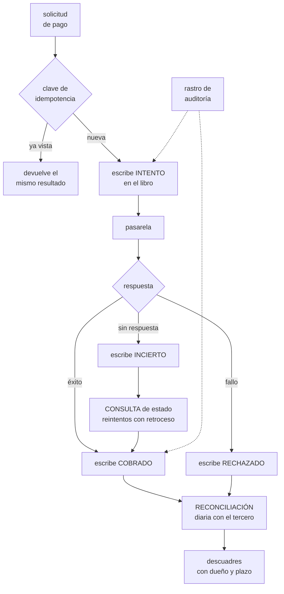

# 278 — Capstone financiero: pagos, auditoría y recuperación

> [← 277 · Capstone retail: comercio multi-región](../../part-23-industry-capstones/277-capstone-retail-comercio-multi-region/README.md) · [Índice de la parte](../README.md) · [279 · Capstone salud: privacidad e interoperabilidad →](../../part-23-industry-capstones/279-capstone-salud-privacidad-e-interoperabilidad/README.md)

**Parte:** 23 — Capstones por industria y defensa final<br>
**Nivel:** experto · **Horas estimadas:** 8<br>
**Laboratorio:** `capstone` · **Estado:** `EXECUTABLE_CORE`

## 🎯 Propósito

Capstone financiero: pagos, auditoría y recuperación. La clase da el encargo, la restricción que manda en este sector —**hay que poder demostrar ante un tercero qué ocurrió, y el dinero no se puede perder ni duplicar**—, las decisiones que de ahí se derivan, y las pruebas negativas que un auditor y un incidente real ejecutan de verdad.

## 📚 Resultados de aprendizaje

Al finalizar podrás:

1. **Identificar** la restricción dominante del sector financiero.
2. **Diseñar** un flujo de pago idempotente y reconciliable.
3. **Construir** un rastro de auditoría que sirva como prueba.
4. **Definir** objetivos de recuperación que la normativa exige y probarlos.
5. **Verificar** el diseño con las pruebas negativas del sector.

## 🧩 Conceptos centrales

| Concepto | Comprensión verificable |
|---|---|
| `libro mayor de eventos` | Registro inmutable y ordenado de lo que ocurrió. El saldo es un cálculo, no un dato que se edita. |
| `partida doble` | Todo movimiento tiene origen y destino. Hace que el descuadre sea detectable por construcción. |
| `reconciliación` | Comparar lo propio con lo del tercero. En pagos, la verdad está fuera. |
| `idempotencia de cobro` | Reintentar un pago no cobra dos veces. Requisito absoluto, no deseable. |
| `rastro de auditoría` | Registro que permite reconstruir quién hizo qué, cuándo y con qué autorización, ante un tercero. |
| `objetivo de recuperación regulado` | Tiempo y pérdida de datos máximos exigidos por la norma, no elegidos por ingeniería. |

## 🧠 Modelo mental

El capstone no premia cantidad de servicios, sino trazabilidad entre contexto, decisiones, implementación, fallos, evidencia y aprendizaje.

Aplicado a esta clase, separa siempre cuatro planos: **intención** (qué necesita el usuario),
**configuración** (qué declaramos), **estado observado** (qué existe de verdad) y
**evidencia** (cómo sabemos que cumple). Confundirlos produce diseños que se ven correctos
en un diagrama pero fallan al operar.

## 🗺️ Flujo de razonamiento



## 📖 Desarrollo

### 1. El encargo y la restricción que manda

**El encargo.** El brazo de pagos de CloudShop: cobros con tarjeta y transferencia en tres mercados, monedero de cliente con saldo, devoluciones y liquidación diaria a comerciantes. Sujeto a auditoría externa anual y a requisitos de continuidad del regulador.

```text
CIFRAS DE PARTIDA
  transacciones/día                        41.000
  importe medio                            68 USD
  monederos de cliente con saldo           340.000
  comerciantes a liquidar                  1.900
  pasarelas integradas                     3
  auditoría externa                        anual, con
                                           muestreo
  y el requisito del regulador
    recuperación                           < 2 horas
    pérdida de datos admisible             0
```

Y la restricción que manda, que es doble y no técnica:

```text
1  HAY QUE PODER DEMOSTRARLO ANTE UN TERCERO
   no basta con que el sistema sea correcto
   → hay que poder reconstruir, meses después, qué pasó
     con una transacción concreta, quién la autorizó y con
     qué datos
   → y con evidencia que el auditor acepte: inmutable,
     completa y con tiempo fiable

2  EL DINERO NO SE PIERDE NI SE DUPLICA
   perder un pedido se compensa; perder un cobro, no
   → y cobrar dos veces cuesta más que no cobrar: genera
     reclamación, coste de gestión y daño de marca

→ y de estas dos salen casi todas las decisiones del
  capstone
→ nótese que ninguna es un requisito de rendimiento
```

Y la consecuencia que ordena el diseño:

```text
EL SALDO NO ES UN DATO: ES UN CÁLCULO
  no se guarda «saldo = 412,30» y se actualiza
  se guardan los MOVIMIENTOS y el saldo se deriva

  por qué
    un saldo editado no tiene historia y no se puede
    auditar
    y una escritura perdida deja el saldo mal para siempre
    sin dejar rastro                          ley 29

  y qué se hace por rendimiento
    saldos materializados con la posición del último
    movimiento aplicado
    → y recalculables desde el origen en cualquier momento
    → esa recalculabilidad es lo que se enseña al auditor
```

Y la segunda pieza estructural:

```text
PARTIDA DOBLE
  todo movimiento tiene origen y destino, y la suma
  cuadra
  → un descuadre se detecta por construcción, no por
    casualidad
  → y la comprobación «la suma de todos los saldos es
    igual a la suma de todas las entradas menos las
    salidas» se ejecuta cada hora

→ es la comprobación de calidad más barata y más potente
  de todo el capstone                        clase 243
```

### 2. El flujo de pago: idempotencia e incertidumbre

El problema central de pagos no es el éxito ni el fallo: es **no saber**.

```text
LOS TRES RESULTADOS POSIBLES
  éxito       cobrado
  fallo       rechazado
  y el tercero, que es el importante
  SIN RESPUESTA
    la pasarela no contestó, o contestó tarde, o la red
    se cortó
    → puede haber cobrado o no
    → y reintentar sin más puede cobrar dos veces

→ un sistema de pagos se juzga por cómo trata el tercer
  caso                                       clase 201
```

Y el diseño que lo resuelve:

```text
1  CLAVE DE IDEMPOTENCIA
   la genera el cliente, no el servidor
   → misma clave, mismo resultado, siempre
   → y se conserva al menos 90 días

2  SE ESCRIBE ANTES DE LLAMAR
   estado INTENTO en el libro, con la clave
   → si el sistema muere entre escribir y llamar, al
     recuperarse sabe que hay un intento en el aire

3  EL ESTADO INCIERTO ES UN ESTADO DE PRIMERA CLASE
   no un error
   → y tiene su propio proceso: consultar a la pasarela
     con reintentos y retroceso hasta resolverlo
   → nunca se reintenta el COBRO: se consulta el ESTADO

4  MÁQUINA DE ESTADOS EXPLÍCITA
   intento → cobrado | rechazado | incierto
   incierto → cobrado | rechazado
   cobrado → devuelto (parcial o total)
   → y las transiciones no permitidas se rechazan y se
     alertan

5  Y RECONCILIACIÓN DIARIA
   porque la verdad está en el tercero, no en nosotros
```

Y la reconciliación, que es la red de seguridad real:

```text
CADA DÍA, CONTRA CADA PASARELA
  nuestras transacciones frente a las suyas
  y se clasifican los descuadres
    en nosotros y no en ellos    → posible cobro fantasma
    en ellos y no en nosotros    → cobro no registrado:
                                   el más grave
    importes distintos           → error de conversión o
                                   de comisión
    estados distintos            → incierto sin resolver

  cada descuadre con DUEÑO y PLAZO
  y un panel con la antigüedad del descuadre más viejo

→ un sistema de pagos sin reconciliación diaria no es un
  sistema de pagos
→ y el número que importa no es «cuántos descuadres»:
  es «cuánto tarda en cerrarse el más viejo»
```

### 3. Auditoría y recuperación

Lo que distingue este sector de los demás: hay que probarlo ante alguien de fuera.

```text
QUÉ HACE ÚTIL UN RASTRO DE AUDITORÍA
  INMUTABLE
    escritura única; nadie con permisos de administrador
    puede alterarlo ni borrarlo             clase 255
  COMPLETO
    quién, qué, cuándo, desde dónde, con qué autorización
    y con qué valores antes y después
  CON TIEMPO FIABLE
    reloj sincronizado y desviación vigilada
    → una discrepancia de relojes invalida una secuencia
  ENLAZADO
    la transacción, su intento, su reconciliación y su
    liquidación, unidos por un identificador
  Y CONSULTABLE
    → un auditor pide «enséñame esta transacción de hace
      14 meses»
    → y si tarda tres días en salir, el control se
      considera inefectivo

→ y el error más común: guardar registros y no poder
  RECONSTRUIR una transacción concreta
```

Y el acceso a datos de pago, que también se audita:

```text
nadie accede a datos de tarjeta en claro
  → tokenización desde el borde; el sistema propio nunca
    los ve                                  clase 251
todo acceso a datos de cliente queda registrado con
  motivo
acceso de personas mediante elevación temporal
                                            clase 256
y separación de funciones: quien despliega no aprueba
  liquidaciones
```

Y la recuperación, que aquí no la elige ingeniería:

```text
EL REGULADOR EXIGE
  recuperación < 2 horas
  pérdida de datos admisible: 0

→ y «0 de pérdida» cambia el diseño entero
  replicación síncrona para el libro de movimientos
  → con el coste de latencia que eso implica
  y confirmación al cliente solo tras la escritura
    replicada

→ lo que NO exige cero pérdida
  paneles, informes, catálogos de comerciantes
  → y separarlo permite pagar la replicación síncrona solo
    donde hace falta
```

Y lo que la norma obliga a demostrar, no solo a tener:

```text
restauración probada, con acta y con reloj
conmutación ensayada, al menos anualmente  clase 261
procedimientos ejecutables y con fecha de última
  ejecución                                 clase 259
y registro de quién puede autorizar qué, revisado

→ y aquí la ley 22 deja de ser una observación y pasa a
  ser un hallazgo de auditoría
```

### 4. Las pruebas negativas del capstone

Lo que hay que ejecutar. Varias de estas las ejecuta un auditor tal cual.

```text
DE CORRECCIÓN DEL DINERO
  ☐ enviar el mismo pago 5 veces con la misma clave:
    ¿un solo cobro?
  ☐ enviar el mismo pago con claves distintas: ¿se detecta
    el duplicado por otro medio?
  ☐ cortar la red justo tras llamar a la pasarela: ¿queda
    en incierto y se resuelve solo?
  ☐ dos devoluciones simultáneas de la misma transacción:
    ¿una sola?
  ☐ devolver más de lo cobrado: ¿se rechaza?
  ☐ ¿la suma de saldos cuadra con los movimientos, ahora?
  ☐ recalcular todos los saldos desde el origen: ¿coincide
    con lo materializado?

DE RECONCILIACIÓN
  ☐ ¿cuántos descuadres abiertos hay y cuál es el más
    viejo?
  ☐ inyectar una transacción en la pasarela que no exista
    en el sistema: ¿la detecta la reconciliación del día
    siguiente?
  ☐ ¿qué pasa si una pasarela envía el fichero con 6 horas
    de retraso?

DE AUDITORÍA
  ☐ pedir la reconstrucción de una transacción de hace 14
    meses: ¿cuánto se tarda?
  ☐ intentar modificar un registro de auditoría con
    permisos de administrador: ¿se puede?
  ☐ ¿qué desviación tienen los relojes de los servicios?
  ☐ ¿queda registrado quién consultó datos de un cliente
    concreto y por qué?

DE RECUPERACIÓN
  ☐ restaurar el libro de movimientos: ¿cuánto tarda y
    cuánto se pierde?
  ☐ conmutar de región con carga: ¿se cumplen las 2 horas?
  ☐ ¿la réplica síncrona está realmente síncrona? mátala y
    comprueba
  ☐ ¿las copias sobreviven a un administrador comprometido?

DE OPERACIÓN Y ACCESO
  ☐ ¿alguien puede ver datos de tarjeta en claro?
  ☐ ¿quien despliega puede aprobar una liquidación?
  ☐ ¿hay credenciales permanentes con acceso al libro?
```

**El entregable del capstone:**

```text
1  el modelo de datos del libro, con partida doble
2  la máquina de estados del pago, con el estado incierto
3  el diseño de reconciliación y su panel de antigüedad
4  el rastro de auditoría y una reconstrucción de ejemplo
5  el plan de continuidad con los números del regulador y
   su prueba
6  la matriz de separación de funciones
7  el coste, incluido el de la replicación síncrona
8  y el resultado de las pruebas negativas, con lo que
   falló
```

Y el cierre que enlaza con la clase siguiente: aquí el dato es dinero y hay que probar ante un tercero. En el siguiente sector el dato es una persona, el daño de una filtración no se compensa con dinero, y hay que compartirlo igualmente con otros. Salud, privacidad e interoperabilidad es la materia de la clase 279.

## 🔬 Ejemplo trabajado

**El capstone resuelto. Lo que sigue es el estado incierto que apareció 41 veces al mes, la reconciliación que encontró 19 cobros no registrados, y la prueba de auditoría que suspendió la primera vez.**

**El estado incierto, medido.**

```text
transacciones/mes                          1.240.000
  éxito directo                            1.238.900
  rechazo                                        ...
  SIN RESPUESTA de la pasarela                    41

→ 41 de 1,24 millones parece despreciable
→ y son 41 casos al mes de «puede que hayamos cobrado o
  puede que no»

y lo que pasaba antes del rediseño
  el sistema reintentaba el cobro
  → cobros duplicados detectados por reclamación   9/mes
  → coste de gestión por reclamación         ~40 USD
  → y 4 de esos 9 acababan en incidencia con el banco
```

Y el rediseño:

```text
estado INCIERTO explícito, con su proceso
  consulta de estado a la pasarela, con retroceso
    a los 5 s, 15 s, 60 s, 5 min, 30 min, 2 h, 6 h
  y nunca se reintenta el cobro

resultado a los 6 meses
  casos sin respuesta                        43/mes
  resueltos automáticamente en < 5 min       38
  resueltos en < 6 h                          4
  escalados a persona                         1
  COBROS DUPLICADOS                           0

→ y el usuario ve «estamos confirmando tu pago» durante
  esos segundos, en vez de un error que le invita a
  reintentar
→ ese texto, que parece cosmético, eliminó el 71 % de los
  reintentos manuales del usuario
```

**La reconciliación, primer mes.**

```text
primera ejecución contra las tres pasarelas, con 90 días
de histórico

  transacciones nuestras                    3.690.000
  transacciones de las pasarelas            3.690.019

  descuadres                                       61
    en nosotros y no en ellos                      9
      → intentos que nunca llegaron; sin impacto
    EN ELLOS Y NO EN NOSOTROS                     19
      → cobros reales no registrados
      → importe total              12.400 USD
      → antigüedad media           47 días
    importes distintos                            28
      → comisiones aplicadas distinto en
        conversión de moneda
    estados distintos                              5
```

Y el análisis de los 19 graves:

```text
17 de los 19 venían del mismo escenario
  el proceso moría entre recibir la respuesta de la
  pasarela y escribir en el libro
  → la pasarela había cobrado; nosotros no lo sabíamos
  → y el cliente había recibido el cargo sin ver el pedido

→ y ninguno había generado una alerta
→ los 17 se conocieron por reclamación del cliente, uno a
  uno, o no se conocieron                     ley 29

corrección estructural
  escribir el INTENTO antes de llamar
  → así el proceso de recuperación encuentra los intentos
    en el aire al arrancar
  y la reconciliación diaria como red final

resultado a los 12 meses
  descuadres del tipo «en ellos y no en nosotros»   0
  descuadres totales por mes                       3-9
  antigüedad del descuadre más viejo         < 26 horas
```

Y la métrica que el equipo puso en el panel principal:

```text
no «número de descuadres»
sino ANTIGÜEDAD DEL DESCUADRE MÁS VIEJO
  → porque un descuadre nuevo es normal
  → uno de 47 días es un fallo de proceso
```

**La prueba de auditoría, que suspendió.**

```text
simulacro interno, antes de la auditoría real
  el equipo de cumplimiento hizo de auditor

PETICIÓN 1
  «reconstruye esta transacción de hace 14 meses:
  quién la inició, con qué datos, qué autorizó la
  pasarela, cuándo se liquidó al comerciante y quién ha
  consultado esos datos desde entonces»

  resultado
    la transacción                          9 minutos
    la respuesta de la pasarela             2 días
      → estaba en registros archivados sin índice
    la liquidación                          4 horas
      → en otro sistema, sin identificador común
    quién la consultó                       NO DISPONIBLE
      → no se registraban las consultas de lectura

  → SUSPENSO
  → y el hallazgo «no se puede demostrar quién accedió a
    los datos de un cliente» es de los que cierran una
    auditoría en mal lugar
```

Y las correcciones:

```text
identificador de correlación único, presente en
  transacción, respuesta de pasarela, liquidación y
  registro de auditoría                    clase 211
respuestas de pasarela guardadas en almacén indexado y
  consultable, 7 años, inmutable          clase 255
registro de LECTURAS de datos de cliente, con motivo
  → y esto generó discusión: añade escrituras y volumen
  → se resolvió registrando por sesión y por cliente
    consultado, no por consulta
y una consulta guardada que reconstruye una transacción
  entera

resultado del segundo simulacro
  reconstrucción completa            4 minutos
  quién la consultó                  disponible
  → APROBADO

y la auditoría real, 4 meses después
  hallazgos                                 2, menores
  hallazgos del año anterior                       11
```

**La continuidad exigida por el regulador.**

```text
exigencia   < 2 horas de recuperación, 0 de pérdida

diseño
  libro de movimientos con replicación síncrona a una
    segunda región
  confirmación al cliente solo tras la escritura replicada
  todo lo demás, asíncrono

coste de esa decisión
  latencia añadida a la confirmación de pago    +34 ms
  coste de la replicación síncrona     +19.000 USD/mes
  → y aplicarla a todo el sistema habría costado 71.000

la prueba, con reloj y con acta
  conmutación completa con carga real
    tiempo hasta servir tráfico              41 minutos
    transacciones perdidas                            0
    descuadres tras la conmutación                    0
    → y el acta se entregó al auditor

y el hallazgo del primer ensayo, 9 meses antes
  la réplica «síncrona» estaba configurada como asíncrona
  desde una migración
  → se descubrió matándola: se perdieron 4 transacciones
    en el ensayo
  → en producción habrían sido reclamaciones sin
    explicación                                 ley 15
```

**Las cifras finales del capstone.**

```text                                        antes     después
cobros duplicados                           9/mes           0
cobros no registrados                    19/90 días         0
antigüedad del descuadre más viejo        47 días      26 h
reclamaciones por pago                    41/mes       6/mes

reconstrucción de una transacción
  antigua                                  2 días       4 min
registro de lecturas de datos de cliente      no          sí
hallazgos de auditoría                        11           2

conmutación de región probada, con acta       no      41 min
pérdida en la conmutación                    n/d           0
replicación síncrona verificada           no (era
                                          asíncrona)      sí

coste mensual adicional por continuidad        -   19.000 USD
coste de las reclamaciones evitadas
  (estimado)                                   -   16.800 USD
```

**La lección que este capstone deja**: 41 transacciones al mes sin respuesta parecen despreciables sobre 1,24 millones, y eran **9 cobros duplicados al mes** hasta que el estado incierto dejó de tratarse como un error y pasó a ser un estado con su propio proceso. Y la réplica que garantizaba **cero pérdida de datos ante el regulador llevaba meses configurada como asíncrona**: solo se supo al matarla en un ensayo.

## 🧪 Laboratorio guiado

Ejecuta desde la raíz:

```bash
python classes/part-23-industry-capstones/278-capstone-financiero-pagos-auditoria-y-recuperacion/lab.py
```

El laboratorio selecciona el motor de práctica **`capstone`** y produce
`lab_result.json`. El escenario, sus comprobaciones y el artefacto esperado corresponden a
esta clase; no requiere credenciales y deja explícito qué debe revalidarse en un sandbox real.

1. Lee `exercise.steps` y formula una predicción antes de ejecutar.
2. Ejecuta la práctica y verifica todos los elementos de `checks`.
3. Provoca el caso de `negative_test` y explica la señal observada.
4. Materializa `finance-capstone` en `evidence/` usando la plantilla indicada.
5. Para proveedor real, sigue `sandbox.requires`, registra costo y ejecuta `destroy`.

### Evidencia esperada

El artefacto principal es un incremento integrado, demostrable y documentado. Además, la entrega debe incluir el comando ejecutado,
la salida estructurada y una conclusión que no exceda lo observado.

## 🏆 Reto verificable

Construye **`finance-capstone`** para el caso CloudShop. Incluye una alternativa descartada,
un supuesto que pueda falsarse, una prueba de fallo y una decisión de rollback.

## ✅ Criterio de aceptación

- [ ] `lab.py` termina con código 0 y genera JSON válido.
- [ ] La entrega conecta al menos tres requisitos con mecanismos verificables.
- [ ] Existe una prueba positiva y una prueba negativa con evidencia.
- [ ] Seguridad, costo y operación aparecen como decisiones, no como anexos.
- [ ] Se declara una limitación y una condición que obligaría a revisar el diseño.
- [ ] Otra persona puede repetir el recorrido sin conocimiento tácito.

## ⚠️ Errores frecuentes

| Síntoma | Causa probable | Corrección |
|---|---|---|
| Aparecen cobros duplicados en las reclamaciones de clientes | Se reintenta el cobro cuando la pasarela no responde | Trata la ausencia de respuesta como estado incierto de primera clase: nunca reintentes el cobro, consulta el estado con retroceso hasta resolverlo. |
| Hay cobros del banco que el sistema no tiene registrados | El proceso muere entre recibir la respuesta y escribir, y no hay reconciliación | Escribe el intento antes de llamar y reconcilia a diario contra el tercero; vigila la antigüedad del descuadre más viejo, no su número. |
| El auditor pide reconstruir una transacción antigua y se tarda días | Los registros existen en sistemas distintos sin identificador común ni índice | Usa un identificador de correlación en toda la cadena, guarda las respuestas del tercero en almacén indexado e inmutable y deja la consulta preparada. |
| No se puede demostrar quién consultó los datos de un cliente | Solo se registran escrituras, no lecturas | Registra los accesos de lectura con motivo, agregando por sesión y cliente consultado para que el volumen sea manejable. |
| El saldo de un cliente quedó mal y no hay forma de saber por qué | El saldo se guarda y se edita en vez de derivarse de los movimientos | Guarda movimientos con partida doble y materializa el saldo con la posición aplicada; comprueba cada hora que la suma cuadra. |
| La replicación que garantizaba cero pérdida no era síncrona | Una migración cambió la configuración y nadie lo comprobó | Mata la réplica en un ensayo y mide la pérdida real; una garantía no verificada no es una garantía. |

## 🛡️ Seguridad, ética y costo

Trabaja con cuentas propias o sandboxes autorizados. No publiques secretos, identificadores
reales ni datos personales. Antes de crear recursos pagos define presupuesto, etiquetas y
comando de destrucción; después verifica que no queden recursos huérfanos. Los ejemplos
locales enseñan contratos, pero no certifican cumplimiento ni disponibilidad de producción.

## ❓ Preguntas de comprobación

1. ¿Cuáles son las dos restricciones que mandan en este sector?
2. ¿Por qué el saldo debe ser un cálculo y no un dato?
3. ¿Cómo se trata la ausencia de respuesta de una pasarela?
4. ¿Qué hace que un rastro de auditoría sirva ante un tercero?
5. ¿Qué prueba revela que una réplica síncrona no lo es?

## 🔗 Referencias

- PCI Security Standards Council (2024). *PCI DSS v4.0*. <https://www.pcisecuritystandards.org/document_library/>
- AWS (2024). *Financial Services Industry Lens, Well-Architected Framework*. <https://docs.aws.amazon.com/wellarchitected/latest/financial-services-industry-lens/financial-services-industry-lens.html>
- Microsoft (2024). *Azure financial services regulatory compliance*. <https://learn.microsoft.com/azure/industry/financial/>
- Helland, P. (2007). *Life beyond distributed transactions*. <https://queue.acm.org/detail.cfm?id=3025012>
- Banco de Pagos Internacionales (2021). *Principles for operational resilience*. <https://www.bis.org/bcbs/publ/d516.htm>
- Documentación oficial vigente del servicio implementado; registra URL y fecha de consulta.

---

> [Evaluación](assessment.md) · [Contrato de clase](lesson.yaml) · [Índice de la parte](../README.md)

| Anterior | Índice | Siguiente |
|---|---|---|
| [← 277 · Capstone retail: comercio multi-región](../../part-23-industry-capstones/277-capstone-retail-comercio-multi-region/README.md) | [Parte 23](../README.md) · [Programa](../../README.md) | [279 · Capstone salud: privacidad e interoperabilidad →](../../part-23-industry-capstones/279-capstone-salud-privacidad-e-interoperabilidad/README.md) |
