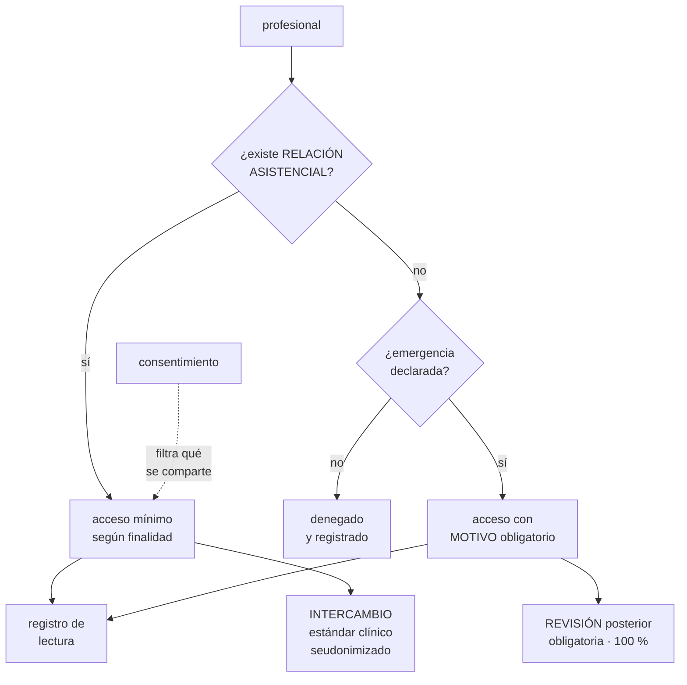

# 279 — Capstone salud: privacidad e interoperabilidad

> [← Clase anterior](../../part-23-industry-capstones/278-capstone-financiero-pagos-auditoria-y-recuperacion/README.md) · [Índice de la parte](../README.md) · [Clase siguiente →](../../part-23-industry-capstones/280-capstone-sector-publico-soberania-y-continuidad/README.md)

**Parte:** 23 — Capstones por industria y defensa final<br>
**Nivel:** experto · **Horas estimadas:** 8<br>
**Laboratorio:** `capstone` · **Estado:** `EXECUTABLE_CORE`

## 🎯 Propósito

Capstone de salud: privacidad e interoperabilidad. La clase da el encargo y la restricción que manda en este sector —**el daño de una filtración no se compensa con dinero, y aun así hay que compartir el dato con otros para que el paciente reciba atención**—, la tensión entre esas dos exigencias, y las pruebas negativas que la revelan.

## 📚 Resultados de aprendizaje

Al finalizar podrás:

1. **Identificar** la tensión entre privacidad e interoperabilidad y resolverla por capas.
2. **Diseñar** control de acceso por relación asistencial, no por rol.
3. **Aplicar** minimización, seudonimización y separación de identidad.
4. **Tratar** el acceso de emergencia sin abrir una puerta permanente.
5. **Verificar** el diseño con las pruebas negativas del sector.

## 🧩 Conceptos centrales

| Concepto | Comprensión verificable |
|---|---|
| `relación asistencial` | Vínculo entre profesional y paciente que justifica el acceso. Es lo que autoriza, no el cargo. |
| `acceso de emergencia` | Mecanismo que permite saltarse el control en urgencias, dejando rastro y con revisión posterior obligatoria. |
| `minimización` | Recoger y mostrar solo lo necesario para la finalidad concreta. |
| `seudonimización` | Separar los identificadores directos del dato clínico, con la correspondencia guardada aparte. |
| `interoperabilidad` | Que otro sistema pueda usar el dato con su significado intacto. Exige estándar, no solo formato. |
| `consentimiento` | Permiso del paciente sobre qué se comparte, con quién y para qué. Debe poder retirarse y aplicarse. |

## 🧠 Modelo mental

El capstone no premia cantidad de servicios, sino trazabilidad entre contexto, decisiones, implementación, fallos, evidencia y aprendizaje.

Aplicado a esta clase, separa siempre cuatro planos: **intención** (qué necesita el usuario),
**configuración** (qué declaramos), **estado observado** (qué existe de verdad) y
**evidencia** (cómo sabemos que cumple). Confundirlos produce diseños que se ven correctos
en un diagrama pero fallan al operar.

## 🗺️ Flujo de razonamiento



## 📖 Desarrollo

### 1. El encargo y la tensión que lo define

**El encargo.** Una plataforma que da soporte a una red de clínicas: historia clínica, resultados de laboratorio, imagen médica, citas y facturación. Debe intercambiar información con hospitales públicos, con laboratorios externos y con la aseguradora.

```text
CIFRAS DE PARTIDA
  pacientes                                1,4 M
  profesionales con acceso                 4.100
  centros                                  62
  estudios de imagen/mes                   41.000
  intercambios con terceros/día            18.000
  y el requisito legal
    datos de salud: categoría especial
    consentimiento explícito para usos secundarios
    derecho de acceso y de supresión
    y notificación de brecha en 72 horas
```

Y la restricción que manda:

```text
EL DAÑO DE UNA FILTRACIÓN NO SE COMPENSA
  un cobro duplicado se devuelve            clase 278
  un pedido perdido se repone               clase 277
  un diagnóstico filtrado no se puede deshacer
  → afecta al empleo, al seguro, a la familia y a la
    intimidad, de forma permanente

→ y de ahí sale la primera consecuencia de diseño: el
  radio de explosión de cualquier credencial de este
  sistema tiene que ser mínimo               clase 269
```

Y la tensión, que es lo que hace difícil el capstone:

```text
Y AUN ASÍ HAY QUE COMPARTIRLO
  un paciente que llega a urgencias necesita que su
  alergia se conozca
  un laboratorio externo tiene que devolver el resultado
  el hospital público necesita el informe previo
  y la aseguradora necesita justificar el pago

→ la privacidad absoluta mata la atención
→ y la interoperabilidad sin control mata la privacidad

→ el diseño no elige entre las dos: las separa por CAPAS
  qué se comparte (mínimo por finalidad)
  con quién (relación y consentimiento)
  con qué significado (estándar clínico)
  y con qué rastro (todo acceso registrado)
```

### 2. Acceso por relación, no por rol

El error clásico del sector: dar acceso por cargo. Un médico no debe poder ver a cualquier paciente por ser médico.

```text
EL MODELO POR ROL, que falla
  «rol: médico» → acceso a la historia clínica
  → 4.100 profesionales pueden ver 1,4 M de historias
  → radio de explosión: total
  → y es indistinguible un acceso legítimo de una
    curiosidad

EL MODELO POR RELACIÓN ASISTENCIAL
  el acceso lo autoriza el VÍNCULO, no el cargo
    profesional asignado a una cita con ese paciente
    profesional del servicio donde el paciente está
      ingresado
    profesional al que se le ha derivado el caso
    o profesional del equipo del anterior, durante la
      atención

  y la relación tiene VIGENCIA
    → termina cuando termina el episodio
    → y con un margen definido, no indefinido

→ pasa de «4.100 pueden ver a 1,4 M» a «cada profesional
  ve, de media, a 340 pacientes activos»
→ tres órdenes de magnitud de radio de explosión
```

Y las dimensiones que se combinan:

```text
RELACIÓN     ¿hay vínculo asistencial vigente?
FINALIDAD    ¿para qué? asistencia · facturación ·
             investigación · calidad
             → y cada finalidad ve un subconjunto distinto
CONSENTIMIENTO ¿el paciente permite ese uso?
             → y puede excluir apartados concretos
SENSIBILIDAD  hay datos con protección reforzada
             → salud mental, adicciones, reproductiva,
               genética
             → y estos exigen consentimiento explícito
               adicional

→ y las cuatro se evalúan en el momento del acceso, no al
  crear la cuenta                            clase 231
```

Y el caso que rompe cualquier control: la urgencia.

```text
EL ACCESO DE EMERGENCIA
  un paciente inconsciente en urgencias, sin relación
  previa
  → si el control lo impide, el sistema se rodea o alguien
    muere                                       ley 16

  el diseño correcto
    existe, y es UN CLIC
    exige MOTIVO escrito, no una casilla
    concede acceso limitado en alcance y en tiempo
    genera un aviso inmediato al responsable de privacidad
    y su revisión posterior es OBLIGATORIA, del 100 %

→ la clave no es dificultar el acceso: es que sea
  imposible que pase desapercibido
→ y el número que se vigila es cuántos accesos de
  emergencia hay por profesional y por mes
  → uno es normal; treinta es un patrón
```

### 3. Minimización, separación e interoperabilidad

Cómo se reduce el daño posible antes de que ocurra.

```text
SEPARACIÓN DE IDENTIDAD Y CLÍNICA
  los identificadores directos —nombre, documento,
  dirección, teléfono— en un almacén
  el dato clínico en otro, con un identificador interno
  y la correspondencia, con acceso propio y registrado

  → una filtración del almacén clínico no identifica a
    nadie por sí sola
  → y una del de identidad no dice nada clínico
  → el coste: una unión más en cada consulta y disciplina
    para no desnormalizar «por comodidad»

MINIMIZACIÓN POR FINALIDAD
  facturación no necesita el diagnóstico completo: necesita
    el código de procedimiento
  investigación no necesita identidad: necesita cohortes
  calidad no necesita el texto libre

  → y el texto libre es el mayor problema de la
    minimización: contiene de todo y no se puede filtrar
    por campo
  → se trata como el dato más sensible del sistema

Y EL BORRADO
  el derecho de supresión choca con la obligación de
  conservar la historia clínica durante años
  → se resuelve distinguiendo: lo asistencial se conserva
    por obligación legal; lo secundario —marketing,
    analítica— se borra
  → y esa distinción tiene que estar en el modelo de datos
    desde el principio, no añadirse después
```

Y la interoperabilidad, que es más que un formato:

```text
COMPARTIR NO ES ENVIAR UN FICHERO
  hace falta que el receptor entienda lo mismo
    identificadores de paciente que se puedan conciliar
    vocabularios clínicos codificados, no texto
    unidades explícitas
    y contexto: quién lo midió, cuándo y con qué método

→ un resultado de laboratorio sin unidad ni método no es
  interoperable: es peligroso
→ y aquí el contrato de datos de la parte 20 deja de ser
  buena práctica y pasa a ser seguridad del paciente
                                            clase 241

Y LA CONCILIACIÓN DE PACIENTES
  el mismo paciente con identificadores distintos en dos
  sistemas
  → unirlos mal mezcla dos historias clínicas
  → y ese es el error más grave posible en este sector
  → por eso la conciliación automática exige umbral alto y
    revisión humana en la zona dudosa
```

### 4. Las pruebas negativas del capstone

Varias de estas las ejecuta una inspección tal cual.

```text
DE ACCESO
  ☐ un profesional sin relación con un paciente, ¿puede
    verlo?
  ☐ ¿sigue viéndolo tres meses después del alta?
  ☐ ¿un administrativo de facturación ve el diagnóstico
    completo?
  ☐ ¿un profesional puede buscar por nombre a alguien con
    quien no tiene relación?
  ☐ ¿cuántos accesos de emergencia hubo el mes pasado y
    cuántos se revisaron?
  ☐ ¿alguien con permisos de administrador de base puede
    leer datos clínicos?

DE CONSENTIMIENTO
  ☐ retirar un consentimiento: ¿deja de compartirse desde
    ese momento?
  ☐ ¿y lo ya compartido con terceros?
  ☐ ¿los apartados con protección reforzada exigen
    consentimiento adicional?

DE MINIMIZACIÓN
  ☐ ¿qué campos viajan a la aseguradora? ¿alguno sobra?
  ☐ ¿la exportación para investigación permite
    reidentificar?
  ☐ ¿el texto libre sale del sistema en alguna
    integración?
  ☐ ¿los entornos de prueba tienen datos reales?

DE INTEROPERABILIDAD
  ☐ enviar un resultado sin unidad: ¿se rechaza?
  ☐ dos pacientes con nombre y fecha de nacimiento
    iguales: ¿se fusionan?
  ☐ ¿un código clínico desconocido se descarta en silencio
    o se detiene?                            clase 243
  ☐ una imagen médica con metadatos identificativos:
    ¿se limpian?

DE OPERACIÓN Y BRECHA
  ☐ simular una filtración: ¿en cuánto se detecta y se
    puede notificar en 72 horas?
  ☐ ¿se sabe exactamente qué registros se vieron
    afectados?
  ☐ ¿las copias contienen datos identificables y quién
    accede a ellas?
  ☐ restaurar la historia clínica: ¿cuánto tarda?
```

**El entregable del capstone:**

```text
1  el modelo de acceso por relación, finalidad,
   consentimiento y sensibilidad
2  el diseño del acceso de emergencia y su revisión
3  la separación de identidad y clínica, con su coste
4  el mapa de qué campos salen a cada tercero y por qué
5  el diseño de conciliación de pacientes y su umbral
6  el plan de respuesta a brecha, con el ensayo hecho
7  la política de conservación y borrado, distinguiendo
   finalidad
8  y el resultado de las pruebas negativas, con lo que
   falló
```

Y el cierre que enlaza con la clase siguiente: aquí el límite lo pone la protección de una persona. En el siguiente sector lo pone la soberanía de un Estado sobre sus datos y su continuidad, con requisitos que no se negocian con ingeniería. Sector público es la materia de la clase 280.

## 🔬 Ejemplo trabajado

**El capstone resuelto. Lo que sigue es el cambio de acceso por rol a acceso por relación con sus cifras, los accesos de emergencia que revelaron un patrón, y las cuatro pruebas que fallaron.**

**El cambio de modelo de acceso.**

```text
ANTES · por rol
  profesionales con acceso a historia clínica     4.100
  pacientes visibles por cada uno               1,4 M
  accesos/mes                                  890.000
  accesos revisados                                  0

→ y una auditoría interna preguntó: «¿cuántos de esos
  890.000 accesos eran legítimos?»
→ la respuesta honesta era «no se puede saber»
```

Y la medición previa al cambio, que fue lo que lo justificó:

```text
se cruzaron los accesos con las relaciones asistenciales
existentes en la agenda y en los ingresos

  accesos con relación asistencial clara       847.100   95,2 %
  accesos sin relación identificable            42.900    4,8 %

y de esos 42.900, muestreo manual de 400
  cobertura de compañero (equipo real, relación
    no registrada)                              291   72,8 %
  continuidad asistencial fuera de episodio       74   18,5 %
  gestión administrativa legítima                 21    5,3 %
  SIN JUSTIFICACIÓN APARENTE                      14    3,5 %

→ extrapolado: ~1.500 accesos al mes sin justificación
→ incluidos 3 casos de un profesional consultando a
  personas de su municipio sin relación con la clínica
```

Y el modelo nuevo:

```text
relación asistencial derivada automáticamente de
  cita asignada · ingreso activo · derivación ·
  pertenencia al equipo tratante
vigencia: episodio + 90 días
y para todo lo demás, acceso de emergencia con motivo

resultado a los 6 meses
  pacientes visibles por profesional, media         340
  accesos/mes                                   861.000
  accesos denegados por falta de relación         4.100
    de los cuales, convertidos en emergencia      2.900
    y abandonados                                 1.200
  accesos de emergencia/mes                       2.900
  revisados                                        100 %
```

Y lo que la revisión del 100 % encontró:

```text
de 2.900 accesos de emergencia mensuales
  justificados por cobertura o continuidad       2.847
  con motivo insuficiente, aclarados               41
  ESCALADOS a privacidad                            12

y el patrón que apareció al mirar por profesional
  media de accesos de emergencia por profesional  0,7/mes
  y un profesional con                             31/mes
    → todos a pacientes sin ninguna relación con su
      servicio
    → investigación interna; caso confirmado de acceso
      indebido

→ con el modelo por rol, esos 31 accesos habrían sido
  indistinguibles de los otros 890.000
→ el control no impidió el acceso: lo hizo VISIBLE
→ y eso es lo que se buscaba                clase 269
```

**Las cuatro pruebas que fallaron.**

```text
FALLO 1 · el entorno de prueba
  ☐ ¿los entornos de prueba tienen datos reales?
  → SÍ: una copia de producción de hacía 14 meses
  → con 1,1 M de historias completas
  → accesible por 34 personas, incluidos 6 proveedores
    externos
  → y sin registro de acceso

  → era, con diferencia, el mayor riesgo del sistema
  → y no estaba en ningún inventario de riesgo   ley 24

  corrección
    generación de datos sintéticos con la misma forma
    y, donde hacía falta realismo, seudonimización
    irreversible con desplazamiento de fechas
    → los entornos dejaron de tener datos reales en 7
      semanas

FALLO 2 · el texto libre en la integración con la
          aseguradora
  el mensaje de facturación incluía el campo
  «observaciones clínicas» completo
  → porque la especificación original lo pedía «por si
    acaso»                                       ley 25
  → 4 años enviándolo

  muestreo de 200 mensajes
    con información clínica sensible en el texto     87
    con datos de terceros (familiares)                9

  corrección
    el campo se retiró
    y se añadió control de esquema que detiene el envío si
    aparece un campo no declarado             clase 243

FALLO 3 · retirada de consentimiento
  retirar el consentimiento de uso secundario dejaba de
  compartir a partir de ese momento
  → y lo ya enviado al almacén de investigación seguía ahí
  → y ese almacén permitía reidentificar por cruce de
    fecha de nacimiento, código postal y fecha de episodio

  corrección
    el almacén de investigación pasó a guardar cohortes
    con generalización de fechas y de zona
    y la retirada de consentimiento dispara la eliminación
    del registro individual, con acta

FALLO 4 · conciliación de pacientes
  dos pacientes con el mismo nombre y la misma fecha de
  nacimiento
  → el algoritmo los fusionó
  → detectado en la prueba, no en producción

  → si hubiera pasado en producción, dos historias
    clínicas mezcladas
  → que es el peor error posible de este sector

  corrección
    umbral de fusión automática elevado
    zona dudosa a revisión humana obligatoria
    y fusión REVERSIBLE, con registro de qué se unió
```

**El ensayo de brecha.**

```text
escenario  «una credencial de un profesional se usa desde
           una dirección desconocida y descarga 4.100
           historias en 40 minutos»

lo que se midió
  tiempo hasta detectar                        6 minutos
    (regla de volumen de lectura anómalo por profesional)
  tiempo hasta cortar el acceso                9 minutos
  tiempo hasta saber QUÉ registros se vieron   3 h 20
    → y esto era lo que había que medir
  tiempo hasta poder notificar con precisión   4 h 10

→ dentro de las 72 horas, con margen
→ y el tramo largo fue reconstruir el alcance exacto, no
  detectar

corrección
  el registro de lecturas pasó a incluir el identificador
  de cada registro consultado, no solo la sesión
  → coste: +31 % de volumen de registro
  → beneficio: alcance exacto en 11 minutos en el segundo
    ensayo
```

**Las cifras finales del capstone.**

```text                                        antes     después
pacientes visibles por profesional          1,4 M         340
accesos sin justificación (estimado)     1.500/mes     ~0/mes
accesos de emergencia revisados               0 %       100 %
casos de acceso indebido detectados             0           1

entornos de prueba con datos reales             sí          no
campos innecesarios enviados a terceros          1           0
reidentificación posible en investigación       sí          no
fusiones erróneas de pacientes            no medido    0 (con
                                                       revisión)

detección de brecha simulada                  n/d       6 min
alcance exacto de la brecha                   n/d      11 min
notificación posible en 72 h                   no          sí

coste añadido (separación, registro,
  datos sintéticos)                             -   21.000 USD/mes
```

**La lección que este capstone deja**: el modelo por rol permitía a 4.100 profesionales ver 1,4 millones de historias, y el cambio a relación asistencial no impidió los accesos indebidos —los hizo **visibles**: un profesional con 31 accesos de emergencia al mes frente a una media de 0,7 apareció en la primera revisión. Y el mayor riesgo del sistema no estaba en producción: era una copia completa de **1,1 millones de historias** en los entornos de prueba, accesible por 34 personas y sin registro.

## 🧪 Laboratorio guiado

Ejecuta desde la raíz:

```bash
python classes/part-23-industry-capstones/279-capstone-salud-privacidad-e-interoperabilidad/lab.py
```

El laboratorio selecciona el motor de práctica **`capstone`** y produce
`lab_result.json`. El escenario, sus comprobaciones y el artefacto esperado corresponden a
esta clase; no requiere credenciales y deja explícito qué debe revalidarse en un sandbox real.

1. Lee `exercise.steps` y formula una predicción antes de ejecutar.
2. Ejecuta la práctica y verifica todos los elementos de `checks`.
3. Provoca el caso de `negative_test` y explica la señal observada.
4. Materializa `health-capstone` en `evidence/` usando la plantilla indicada.
5. Para proveedor real, sigue `sandbox.requires`, registra costo y ejecuta `destroy`.

### Evidencia esperada

El artefacto principal es un incremento integrado, demostrable y documentado. Además, la entrega debe incluir el comando ejecutado,
la salida estructurada y una conclusión que no exceda lo observado.

## 🏆 Reto verificable

Construye **`health-capstone`** para el caso CloudShop. Incluye una alternativa descartada,
un supuesto que pueda falsarse, una prueba de fallo y una decisión de rollback.

## ✅ Criterio de aceptación

- [ ] `lab.py` termina con código 0 y genera JSON válido.
- [ ] La entrega conecta al menos tres requisitos con mecanismos verificables.
- [ ] Existe una prueba positiva y una prueba negativa con evidencia.
- [ ] Seguridad, costo y operación aparecen como decisiones, no como anexos.
- [ ] Se declara una limitación y una condición que obligaría a revisar el diseño.
- [ ] Otra persona puede repetir el recorrido sin conocimiento tácito.

## ⚠️ Errores frecuentes

| Síntoma | Causa probable | Corrección |
|---|---|---|
| Cualquier profesional puede consultar cualquier historia clínica | El acceso se concede por rol y no por relación asistencial | Deriva la relación de citas, ingresos y derivaciones, dale vigencia limitada y evalúa relación, finalidad, consentimiento y sensibilidad en el momento del acceso. |
| El control de acceso se rodea en urgencias | No existe una vía de emergencia y bloquear pone en riesgo al paciente | Ofrece acceso de emergencia a un clic con motivo escrito, aviso inmediato y revisión posterior del 100 %; el objetivo es visibilidad, no fricción. |
| Hay datos reales en entornos de prueba | Se copió producción por comodidad y nunca se revisó | Genera datos sintéticos con la misma forma y, donde haga falta realismo, seudonimiza de forma irreversible desplazando fechas. |
| Se envían campos innecesarios a un tercero | La especificación original pedía el campo completo y nadie lo revisó | Mapea qué campo sale a cada tercero con su finalidad y añade control de esquema que detenga el envío de campos no declarados. |
| Retirar el consentimiento no afecta a lo ya compartido | El almacén secundario guarda registros individuales reidentificables | Guarda cohortes generalizadas y haz que la retirada dispare la eliminación del registro individual, con acta. |
| Se fusionan dos pacientes distintos | El umbral de conciliación automática es bajo y la fusión es irreversible | Eleva el umbral, manda la zona dudosa a revisión humana y haz la fusión reversible con registro de qué se unió. |

## 🛡️ Seguridad, ética y costo

Trabaja con cuentas propias o sandboxes autorizados. No publiques secretos, identificadores
reales ni datos personales. Antes de crear recursos pagos define presupuesto, etiquetas y
comando de destrucción; después verifica que no queden recursos huérfanos. Los ejemplos
locales enseñan contratos, pero no certifican cumplimiento ni disponibilidad de producción.

## ❓ Preguntas de comprobación

1. ¿Cuál es la tensión que define este sector y cómo se resuelve por capas?
2. ¿Por qué el acceso por rol falla y qué lo sustituye?
3. ¿Cómo se diseña el acceso de emergencia sin abrir una puerta permanente?
4. ¿Qué aporta separar identidad y dato clínico y qué cuesta?
5. ¿Qué hace que un dato clínico sea interoperable y no solo transferible?

## 🔗 Referencias

- HL7 (2024). *FHIR: Fast Healthcare Interoperability Resources*. <https://www.hl7.org/fhir/>
- Reglamento (UE) 2016/679, RGPD — datos de salud como categoría especial. <https://eur-lex.europa.eu/eli/reg/2016/679/oj>
- AWS (2024). *Healthcare Industry Lens, Well-Architected Framework*. <https://docs.aws.amazon.com/wellarchitected/latest/healthcare-industry-lens/healthcare-industry-lens.html>
- Microsoft (2024). *Azure for healthcare: compliance and data protection*. <https://learn.microsoft.com/azure/architecture/industries/healthcare/>
- El Emam, K. (2013). *Guide to the De-Identification of Personal Health Information*. <https://www.routledge.com/Guide-to-the-De-Identification-of-Personal-Health-Information/Emam/p/book/9781466579064>
- Documentación oficial vigente del servicio implementado; registra URL y fecha de consulta.

---

> [Evaluación](assessment.md) · [Contrato de clase](lesson.yaml) · [Índice de la parte](../README.md)
